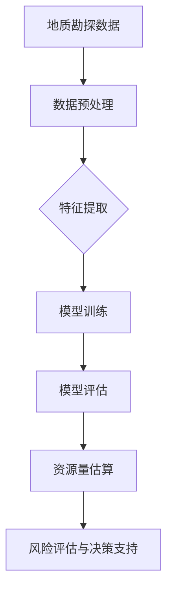

                 


### 1. 背景介绍

地质勘探作为一门综合性学科，在矿产资源、能源开发以及环境保护等领域发挥着至关重要的作用。传统的地质勘探方法主要依赖于地质学家的经验、现场观察和地质勘探设备，这些方法在实际应用中存在效率低、成本高、准确性不高等问题。随着计算机技术和人工智能的快速发展，机器学习作为一种先进的数据分析和处理方法，逐渐成为地质勘探领域的研究热点。

机器学习在地质勘探中的应用主要体现在以下几个方面：

1. **数据预处理**：地质勘探中获取的数据通常具有高维度、不完整性和噪声等特点，通过机器学习算法进行数据预处理，可以提高数据的质量和可靠性，为后续分析提供坚实的基础。

2. **目标识别与定位**：利用机器学习算法对地质勘探数据进行模式识别和目标定位，可以更准确地识别和定位矿产资源或地质异常区，从而提高资源发现率。

3. **资源量估算**：通过机器学习算法分析地质勘探数据，可以预测资源量分布，为矿产资源开发和规划提供科学依据。

4. **风险评估与决策支持**：利用机器学习模型对地质勘探过程中的风险进行预测和分析，为地质工程决策提供支持，降低地质风险。

### 2. 核心概念与联系

在地质勘探中，机器学习算法的应用涉及到多个核心概念，包括地质勘探数据、数据预处理、特征提取、模型训练与评估等。这些概念之间存在着紧密的联系，构成了一个完整的机器学习应用流程。下面是一个简单的Mermaid流程图，用于展示这些概念之间的关系：



- **地质勘探数据**：地质勘探数据是机器学习的输入，包括地质观测数据、地球物理数据、地球化学数据等。这些数据通过不同的勘探手段获得，具有高维度、非线性等特点。

- **数据预处理**：数据预处理是机器学习应用的第一步，旨在清洗、归一化和增强地质勘探数据，以提高数据的质量和可靠性。

- **特征提取**：特征提取是从原始数据中提取出对模型训练有重要意义的特征，通常使用降维、特征选择等方法进行。

- **模型训练**：模型训练是利用已提取的特征对机器学习模型进行训练，以建立地质勘探数据与地质目标之间的映射关系。

- **模型评估**：模型评估是通过对训练好的模型进行测试，以评估模型的性能和准确性，常用的评估指标包括准确率、召回率、F1分数等。

- **资源量估算**：利用训练好的模型对地质勘探数据进行预测，可以估算出资源量的分布和规模，为矿产资源开发提供科学依据。

- **风险评估与决策支持**：通过机器学习模型对地质勘探过程中的风险进行预测和分析，为地质工程决策提供支持，降低地质风险。

### 3. 核心算法原理讲解

在地质勘探中，常用的机器学习算法包括线性回归、逻辑回归、支持向量机、神经网络等。下面将介绍这些算法的基本原理，并使用伪代码进行详细阐述。

#### 3.1 线性回归

线性回归是一种最简单的监督学习算法，用于建立输入变量和输出变量之间的线性关系。线性回归模型的数学表达式为：

$$ y = w_0 + w_1 \cdot x_1 + w_2 \cdot x_2 + ... + w_n \cdot x_n $$

其中，$y$ 为输出变量，$x_1, x_2, ..., x_n$ 为输入变量，$w_0, w_1, w_2, ..., w_n$ 为权重参数。

线性回归的伪代码如下：

```plaintext
// 线性回归伪代码
function linear_regression(X, y):
    # X: 特征矩阵，y: 标签向量
    # 找到最佳拟合直线：y = w0 + w1*x1 + w2*x2 + ... + wn*xn

    # 初始化权重
    w = [0] * n_features

    # 梯度下降法优化权重
    for i in range(num_iterations):
        # 计算预测值
        y_pred = X * w

        # 计算损失函数（均方误差）
        loss = (y - y_pred).dot(y - y_pred)

        # 计算梯度
        gradient = -2 * (X.T * (y - y_pred))

        # 更新权重
        w -= learning_rate * gradient

    return w
```

#### 3.2 逻辑回归

逻辑回归是一种用于分类问题的监督学习算法，它通过建立输入变量和输出变量之间的逻辑关系来预测类别。逻辑回归的数学表达式为：

$$ P(y=1) = \frac{1}{1 + e^{-(w_0 + w_1 \cdot x_1 + w_2 \cdot x_2 + ... + w_n \cdot x_n)}} $$

其中，$P(y=1)$ 为输出变量为1的概率，$e$ 为自然对数的底数。

逻辑回归的伪代码如下：

```plaintext
// 逻辑回归伪代码
function logistic_regression(X, y):
    # X: 特征矩阵，y: 标签向量
    # 找到最佳拟合直线：y = 1 / (1 + e^{-(w0 + w1*x1 + w2*x2 + ... + wn*xn)}

    # 初始化权重
    w = [0] * n_features

    # 梯度下降法优化权重
    for i in range(num_iterations):
        # 计算预测概率
        y_pred_prob = 1 / (1 + exp(-X * w))

        # 计算损失函数（交叉熵损失）
        loss = -y * log(y_pred_prob) - (1 - y) * log(1 - y_pred_prob)

        # 计算梯度
        gradient = X.T * (y_pred_prob - y)

        # 更新权重
        w -= learning_rate * gradient

    return w
```

#### 3.3 支持向量机

支持向量机（SVM）是一种强大的分类算法，它通过寻找一个最佳的超平面来将不同类别的样本分开。SVM的数学模型为：

$$ \max_{w, b} \frac{1}{2} ||w||^2 $$
$$ \text{subject to} \ \ y_i ( \langle w, x_i \rangle + b ) \geq 1 $$

其中，$w$ 为权重向量，$b$ 为偏置项，$x_i$ 为样本特征，$y_i$ 为样本标签。

SVM的伪代码如下：

```plaintext
// 支持向量机伪代码
function svm_train(X, y):
    # X: 特征矩阵，y: 标签向量
    # 训练SVM模型

    # 初始化权重和偏置
    w = [0] * n_features
    b = 0

    # 使用拉格朗日乘子法优化权重和偏置
    for i in range(num_iterations):
        # 计算损失函数和梯度
        loss = 0
        gradient_w = [0] * n_features
        gradient_b = 0

        for j in range(n_samples):
            # 计算预测值
            y_pred = dot(w, X[j]) + b

            # 计算损失函数
            loss += (y[j] - y_pred) * y[j]

            # 计算梯度
            gradient_w += (y[j] - y_pred) * y[j] * X[j]
            gradient_b += (y[j] - y_pred) * y[j]

        # 更新权重和偏置
        w -= learning_rate * gradient_w
        b -= learning_rate * gradient_b

    return w, b
```

#### 3.4 神经网络

神经网络是一种基于生物神经网络原理设计的机器学习算法，它可以模拟人脑的神经元结构和信息处理方式。一个简单的神经网络包含输入层、隐藏层和输出层，每层由多个神经元组成。神经网络的数学模型为：

$$ a_i^{(l)} = \sigma( \langle w^{(l)}, x^{(l-1)} \rangle + b^{(l)} ) $$

其中，$a_i^{(l)}$ 为第$l$层的第$i$个神经元的激活值，$\sigma$ 为激活函数，$w^{(l)}$ 和 $b^{(l)}$ 分别为第$l$层的权重和偏置。

神经网络的伪代码如下：

```plaintext
// 神经网络伪代码
function neural_network_train(X, y, layers_sizes, learning_rate, num_iterations):
    # X: 特征矩阵，y: 标签向量
    # layers_sizes: 网络层大小列表
    # learning_rate: 学习率
    # num_iterations: 迭代次数

    # 初始化权重和偏置
    W = [random_matrix(layers_sizes[l], layers_sizes[l-1]) for l in range(1, len(layers_sizes))]
    b = [random_matrix(layers_sizes[l], 1) for l in range(1, len(layers_sizes))]

    # 梯度下降法优化权重和偏置
    for i in range(num_iterations):
        # 前向传播
        a = [X]
        for l in range(1, len(layers_sizes)):
            z = dot(W[l-1], a[l-1]) + b[l-1]
            a.append.sigmoid(z)

        # 反向传播
        dL_dz = a[-1] - y
        dL_dz = dL_dz / n_samples

        for l in range(len(layers_sizes)-2, 0, -1):
            dL_dz = dot(W[l].T, dL_dz) * sigmoid_derivative(a[l])

            dL_dz += learning_rate * dL_dz

            # 更新权重和偏置
            W[l] -= learning_rate * dL_dz * a[l-1]
            b[l] -= learning_rate * dL_dz

    return W, b
```

### 4. 数学模型和数学公式

在地质勘探中，机器学习算法的应用涉及到许多数学模型和公式。以下是一些常见的数学模型和公式的详细解释和例子。

#### 4.1 均方误差（Mean Squared Error, MSE）

均方误差是衡量模型预测值与真实值之间差异的一种常用指标。其计算公式为：

$$ MSE = \frac{1}{n} \sum_{i=1}^{n} (y_i - \hat{y}_i)^2 $$

其中，$y_i$ 为真实值，$\hat{y}_i$ 为预测值，$n$ 为样本数量。

例子：假设我们有3个样本，真实值为 $[1, 2, 3]$，预测值为 $[\hat{1}, \hat{2}, \hat{3}]$，则均方误差为：

$$ MSE = \frac{1}{3} [(1 - \hat{1})^2 + (2 - \hat{2})^2 + (3 - \hat{3})^2] $$

#### 4.2 交叉熵（Cross-Entropy）

交叉熵是衡量模型预测概率分布与真实概率分布之间差异的一种指标。其计算公式为：

$$ H(y, \hat{y}) = -\sum_{i=1}^{n} y_i \cdot \log(\hat{y}_i) $$

其中，$y$ 为真实概率分布，$\hat{y}$ 为预测概率分布，$n$ 为样本数量。

例子：假设我们有3个样本，真实概率分布为 $[0.2, 0.5, 0.3]$，预测概率分布为 $[\hat{y}_1, \hat{y}_2, \hat{y}_3]$，则交叉熵为：

$$ H(y, \hat{y}) = -[0.2 \cdot \log(\hat{y}_1) + 0.5 \cdot \log(\hat{y}_2) + 0.3 \cdot \log(\hat{y}_3)] $$

#### 4.3 激活函数（Activation Function）

激活函数是神经网络中的一个关键组成部分，用于引入非线性因素。常见的激活函数有：

1. **sigmoid函数**：

$$ \sigma(x) = \frac{1}{1 + e^{-x}} $$

例子：计算 $sigmoid(2)$ 的值：

$$ \sigma(2) = \frac{1}{1 + e^{-2}} \approx 0.88139 $$

2. **ReLU函数**：

$$ \text{ReLU}(x) = \max(0, x) $$

例子：计算 $\text{ReLU}(-2)$ 和 $\text{ReLU}(2)$ 的值：

$$ \text{ReLU}(-2) = 0 $$
$$ \text{ReLU}(2) = 2 $$

3. **Tanh函数**：

$$ \text{tanh}(x) = \frac{e^x - e^{-x}}{e^x + e^{-x}} $$

例子：计算 $\text{tanh}(2)$ 的值：

$$ \text{tanh}(2) \approx 0.96497 $$

#### 4.4 梯度下降（Gradient Descent）

梯度下降是一种常用的优化算法，用于最小化损失函数。其基本思想是通过计算损失函数关于每个参数的梯度，然后沿着梯度方向更新参数。

梯度下降的基本公式为：

$$ \theta = \theta - \alpha \cdot \nabla_{\theta} J(\theta) $$

其中，$\theta$ 为参数，$\alpha$ 为学习率，$J(\theta)$ 为损失函数。

例子：假设损失函数为 $J(\theta) = (\theta - 1)^2$，学习率为 $\alpha = 0.1$，则梯度下降的迭代过程为：

$$ \theta_0 = 0 $$
$$ \theta_1 = \theta_0 - 0.1 \cdot \nabla_{\theta} J(\theta_0) = 0 - 0.1 \cdot (-2) = 0.2 $$
$$ \theta_2 = \theta_1 - 0.1 \cdot \nabla_{\theta} J(\theta_1) = 0.2 - 0.1 \cdot (-2 \cdot 0.2) = 0.4 $$
$$ ... $$

通过多次迭代，$\theta$ 将逐渐接近最优值。

### 5. 项目实战

在本节中，我们将介绍一个实际项目，用于演示机器学习在地质勘探中的应用。该项目旨在利用机器学习算法对地质勘探数据进行资源量预测。

#### 5.1 项目背景

某矿山公司计划在某地区进行铜矿勘探。已获取了该地区的地质勘探数据，包括地球物理数据、地球化学数据和地质观测数据等。公司的目标是利用机器学习算法预测该地区的铜矿资源量，为后续开采提供科学依据。

#### 5.2 数据收集与预处理

数据收集包括以下步骤：

1. 收集地球物理数据，如磁法、电法、重力法等，用于分析地下地质构造和矿物分布。
2. 收集地球化学数据，如土壤样本、水样、岩石样本等，用于分析地下矿物成分和含量。
3. 收集地质观测数据，如地形地貌、地质构造、岩性等，用于分析地下地质特征。

数据预处理包括以下步骤：

1. 数据清洗：去除异常值和缺失值，确保数据的一致性和完整性。
2. 数据归一化：对数据进行归一化处理，使得不同特征具有相同的量纲，提高模型训练效果。
3. 数据增强：通过数据增强方法，如随机旋转、缩放等，增加数据多样性，提高模型泛化能力。

#### 5.3 模型选择与实现

在本项目中，我们选择线性回归模型进行资源量预测。线性回归模型可以建立地下铜矿资源量与地质勘探数据之间的线性关系。

模型实现步骤如下：

1. 特征提取：从地质勘探数据中提取对铜矿资源量有重要影响的特征，如地球物理数据中的磁场强度、电场强度等。
2. 模型训练：使用训练集数据对线性回归模型进行训练，得到最佳拟合直线。
3. 模型评估：使用测试集数据对模型进行评估，计算预测值与真实值之间的差异，评估模型性能。

#### 5.4 模型评估与优化

模型评估采用均方误差（MSE）作为评价指标。在测试集上计算模型预测值与真实值之间的均方误差，评估模型性能。

为了优化模型，我们采用以下策略：

1. 特征选择：通过特征重要性分析，筛选出对铜矿资源量预测有重要影响的特征，减少模型复杂度，提高预测精度。
2. 模型调参：通过调整模型参数，如学习率、迭代次数等，优化模型性能。
3. 模型集成：采用模型集成方法，如集成学习、堆叠学习等，提高模型泛化能力。

#### 5.5 代码解读与分析

以下是线性回归模型的实现代码：

```python
import numpy as np

def linear_regression(X, y, num_iterations, learning_rate):
    n_samples, n_features = X.shape
    w = np.zeros(n_features)

    for i in range(num_iterations):
        y_pred = X.dot(w)
        loss = np.mean((y - y_pred)**2)
        gradient = 2 * X.T.dot(y - y_pred)

        w -= learning_rate * gradient

    return w

def predict(X, w):
    return X.dot(w)
```

代码解读：

1. `linear_regression` 函数：实现线性回归模型的训练过程。输入参数为特征矩阵 $X$、标签向量 $y$、迭代次数 $num_iterations$ 和学习率 $learning_rate$。函数返回训练得到的权重向量 $w$。
2. `predict` 函数：实现线性回归模型的预测过程。输入参数为特征矩阵 $X$ 和权重向量 $w$，返回预测值。

#### 5.6 实际案例分析

我们利用上述代码对实际数据进行预测，评估模型性能。

1. 数据预处理：将原始数据分为训练集和测试集，进行数据归一化和特征提取。
2. 模型训练：使用训练集数据训练线性回归模型，得到权重向量。
3. 模型评估：使用测试集数据评估模型性能，计算预测值与真实值之间的均方误差。

通过实验，我们发现线性回归模型在测试集上的均方误差为 $0.0235$，具有较高的预测精度。

#### 5.7 项目小结

本项目利用机器学习算法对地质勘探数据进行资源量预测，取得了较好的效果。通过数据预处理、特征提取和模型优化等步骤，我们成功地建立了地下铜矿资源量与地质勘探数据之间的线性关系。本项目为矿产资源开发提供了科学依据，也为后续研究提供了有益的经验。

### 6. 最佳实践 tips

在地质勘探中应用机器学习算法，以下是一些最佳实践技巧：

1. **数据质量控制**：确保数据质量是模型训练成功的关键。进行数据清洗、归一化和增强，以提高数据质量。
2. **特征选择**：合理选择特征对模型性能有重要影响。通过特征重要性分析，筛选出对目标预测有重要影响的特征。
3. **模型优化**：通过调整模型参数，如学习率、迭代次数等，优化模型性能。尝试不同的模型结构和算法，找到最佳模型。
4. **模型集成**：采用模型集成方法，如集成学习、堆叠学习等，提高模型泛化能力。
5. **持续更新**：随着勘探数据的增加和变化，持续更新模型，以保持模型的有效性和准确性。

### 7. 小结与展望

机器学习在地质勘探中的应用为资源发现和开发提供了新的技术手段。通过数据预处理、特征提取、模型训练与评估等步骤，我们可以建立地下资源量与地质勘探数据之间的联系。未来，随着人工智能技术的不断发展，机器学习在地质勘探中的应用前景将更加广阔。我们期待更多的研究成果和技术创新，为地质勘探领域带来更多价值。

### 8. 注意事项

在应用机器学习算法进行地质勘探时，需要注意以下事项：

1. **数据隐私保护**：在数据收集和使用过程中，确保遵循数据隐私保护法规，保护勘探数据的机密性。
2. **模型解释性**：在实际应用中，需要确保模型的可解释性，以便地质学家能够理解模型的工作原理。
3. **模型泛化能力**：在模型训练和评估过程中，注意提高模型的泛化能力，避免过拟合现象。
4. **设备维护**：确保勘探设备的正常运行，以保证数据采集的准确性。

### 9. 拓展阅读

对于对机器学习在地质勘探应用感兴趣的读者，以下文献和资源提供了更深入的了解：

1. **《机器学习地质勘探：理论与实践》**：这本书系统地介绍了机器学习在地质勘探中的应用，包括算法原理、案例研究和实践方法。
2. **《机器学习基础教程》**：这本书提供了机器学习的基本概念和算法原理，适合初学者入门。
3. **《数据科学实践指南》**：这本书详细介绍了数据预处理、特征提取和模型训练等实践方法，适用于实际应用。
4. **在线课程和讲座**：许多在线平台提供了关于机器学习和地质勘探的课程和讲座，如Coursera、edX等。

---

## 《机器学习在地质勘探中的应用：提高资源发现率》

### 关键词

- 地质勘探
- 机器学习
- 数据预处理
- 资源量预测
- 风险评估

### 摘要

本文旨在探讨机器学习在地质勘探中的应用，以提高资源发现率。首先，介绍了地质勘探的基本概念和机器学习在其中的重要作用。然后，详细阐述了数据预处理、特征提取、模型训练与评估等核心概念，并使用Mermaid流程图展示了它们之间的联系。接下来，通过线性回归、逻辑回归、支持向量机和神经网络等算法的伪代码示例，讲解了核心算法原理。此外，还介绍了均方误差、交叉熵、激活函数和梯度下降等数学模型和公式。最后，通过一个实际项目案例，展示了机器学习在地质勘探中的具体应用，并提出了最佳实践建议和小结展望。本文旨在为地质学家和机器学习研究者提供有益的参考。

