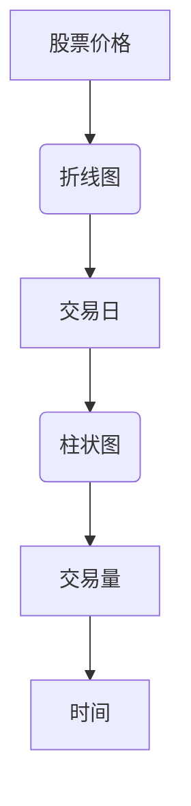

                 


# 机器学习在股票市场预测中的应用

## 关键词
机器学习、股票市场、预测、线性模型、树模型、集成模型、神经网络、模型评估、实战应用

## 摘要
本文探讨了机器学习在股票市场预测中的应用，首先介绍了机器学习的基本概念和股票市场预测的挑战。接着，详细讲解了数据预处理、线性模型（如线性回归）、树模型（如决策树）、集成模型（如随机森林）和神经网络的基本原理及其在股票市场预测中的应用。最后，通过一个实际项目案例，展示了如何利用机器学习进行股票市场预测，并对模型评估和优化方法进行了分析。文章旨在为读者提供一个全面且深入的机器学习在股票市场预测领域的指南。

---

## 第一部分：基础知识

### 第1章：机器学习与股票市场预测概述

#### 1.1 机器学习简介

机器学习（Machine Learning，ML）是一门人工智能（Artificial Intelligence，AI）的分支，主要研究如何从数据中学习规律并做出决策或预测。其核心思想是通过算法从数据中自动提取知识，实现自动化决策和预测。机器学习的基本流程包括数据收集、预处理、模型选择、训练和评估等步骤。

在机器学习中，根据模型是否需要人为指定规则，可以分为监督学习（Supervised Learning）、无监督学习（Unsupervised Learning）和强化学习（Reinforcement Learning）三大类。监督学习是指通过已有标注数据来训练模型，从而预测未知数据的标签；无监督学习是指在没有标注数据的情况下，通过模型自动发现数据中的规律和结构；强化学习则是通过环境反馈来不断调整策略，以达到最优决策。

#### 1.2 股票市场预测的挑战

股票市场预测是一个极具挑战性的任务，主要面临以下几个方面的难题：

1. **数据的复杂性**：股票市场数据包含价格、成交量、财务指标等多种信息，这些数据通常具有高维度、非线性和时间序列特性。
2. **市场的波动性**：股票价格受到多种因素的影响，如公司业绩、宏观经济环境、市场情绪等，导致股票价格具有高度波动性。
3. **噪声和异常值**：股票市场数据中常常存在噪声和异常值，这些数据会干扰模型的预测性能。
4. **非线性和多变性**：股票市场中的规律往往是非线性和多变的，使得预测模型难以捕捉到市场变化的本质。

#### 1.3 机器学习在股票市场预测中的应用现状

尽管存在诸多挑战，机器学习在股票市场预测领域仍取得了显著的成果。目前，机器学习在股票市场预测中的应用主要包括以下几个方面：

1. **股票价格预测**：通过分析历史价格数据，使用时间序列分析、回归模型等方法来预测股票的未来价格。
2. **市场趋势分析**：通过分析股票价格趋势和成交量等指标，预测市场的未来走势。
3. **风险管理**：使用机器学习算法来识别潜在的风险因素，并制定相应的风险管理策略。

机器学习在股票市场预测中的应用不仅提高了预测的准确性，也为投资者提供了更有力的决策支持。接下来，本文将详细介绍机器学习在股票市场预测中的应用，包括数据预处理、线性模型、树模型、集成模型和神经网络等内容。

## 第二部分：机器学习模型应用

### 第2章：数据预处理

数据预处理是机器学习应用中至关重要的一步，其目的是提高数据质量，减少噪声，并提取有用的信息。在股票市场预测中，数据预处理主要包括数据收集、数据清洗、特征工程和数据可视化等步骤。

#### 2.1 数据收集

股票市场数据可以通过多种途径收集，如交易所数据接口、金融数据提供商等。常用的数据类型包括股票价格、成交量、财务指标、宏观经济数据等。数据收集的过程中，需要特别注意数据的时效性和完整性。

#### 2.2 数据清洗

数据清洗是数据预处理的重要环节，主要包括以下任务：

1. **去除重复数据**：在收集的数据中，可能会存在重复的数据记录，这会导致模型训练过程中的过拟合现象。
2. **处理缺失值**：缺失值可能是因为数据源问题或者数据采集过程中的错误导致。处理缺失值的方法包括删除缺失值、插值法、均值填补法等。
3. **纠正错误数据**：数据源中可能存在错误的数据记录，如价格数据中的异常值。这些错误数据会干扰模型的训练，因此需要及时纠正。

#### 2.3 特征工程

特征工程是提高模型预测性能的关键步骤，其目的是从原始数据中提取出对模型有用的特征。在股票市场预测中，特征工程主要包括以下内容：

1. **时间序列特征**：如日历特征、交易日特征、季节性特征等。
2. **技术指标特征**：如均线、相对强弱指数（RSI）、移动平均收敛发散（MACD）等。
3. **财务指标特征**：如市盈率（PE）、市净率（PB）、股息收益率等。

通过特征工程，可以将原始数据进行降维处理，提高模型的可解释性，同时也能够提高模型的预测性能。

#### 2.4 数据可视化

数据可视化是一种有效的数据分析方法，可以帮助我们直观地理解数据特征，发现数据中的规律和异常。在股票市场预测中，常用的数据可视化方法包括折线图、散点图、柱状图等。

通过数据可视化，可以直观地观察到股票价格的趋势、成交量变化、财务指标等特征，有助于我们发现数据中的潜在规律和异常情况。

### 图2.1 股票价格与交易量可视化



通过上述数据预处理步骤，可以为后续的机器学习模型训练提供高质量的数据，从而提高模型的预测性能。接下来，本文将详细介绍各种机器学习模型在股票市场预测中的应用。

### 第3章：线性模型

线性模型（Linear Model）是机器学习中一种基础且常用的模型类型，主要包括线性回归（Linear Regression）和线性判别分析（Linear Discriminant Analysis，LDA）等。在股票市场预测中，线性模型常用于预测股票价格或分析市场趋势。

#### 3.1 线性回归

线性回归（Linear Regression）是一种基于线性关系的预测模型，其基本形式如下：

\[ y = \beta_0 + \beta_1 x \]

其中，\( y \) 是预测的目标变量，\( x \) 是自变量，\( \beta_0 \) 是截距，\( \beta_1 \) 是斜率。

线性回归的目的是找到合适的 \( \beta_0 \) 和 \( \beta_1 \) ，使得预测值与实际值之间的误差最小。这个最小化误差的目标可以用以下代价函数表示：

\[ J(\theta) = \frac{1}{2m} \sum_{i=1}^{m} (h_\theta(x^{(i)}) - y^{(i)})^2 \]

其中，\( m \) 是样本数量，\( h_\theta(x) \) 是模型的预测值，\( y^{(i)} \) 是第 \( i \) 个样本的实际值。

为了求解 \( \theta \) ，可以使用梯度下降（Gradient Descent）算法。梯度下降的伪代码如下：

```python
while not converge:
    theta = theta - alpha * (1/m) * (X * theta - y)
```

其中，\( \alpha \) 是学习率，\( X \) 是特征矩阵，\( y \) 是标签向量。

#### 3.2 线性回归在股票市场预测中的应用

在股票市场预测中，线性回归可以用于预测股票价格。具体应用步骤如下：

1. **数据收集与清洗**：收集股票的历史价格数据，包括开盘价、收盘价、最高价、最低价等，并处理缺失值和异常值。
2. **特征选择**：选择与股票价格相关的特征，如均线、相对强弱指数（RSI）、移动平均收敛发散（MACD）等。
3. **模型训练**：使用线性回归模型对特征和股票价格进行训练，得到模型参数。
4. **模型评估**：使用交叉验证等方法对模型进行评估，确保模型具有较好的预测性能。
5. **预测股票价格**：使用训练好的模型预测未来的股票价格。

以下是一个简化的线性回归模型在股票市场预测中的应用示例：

```python
import numpy as np
import pandas as pd
from sklearn.linear_model import LinearRegression

# 数据收集与清洗
data = pd.read_csv('stock_data.csv')
data.fillna(method='ffill', inplace=True)
data['MA20'] = data['Close'].rolling(window=20).mean()

# 特征选择
X = data[['MA20']]
y = data['Close']

# 模型训练
model = LinearRegression()
model.fit(X, y)

# 模型评估
score = model.score(X, y)
print('Model R^2 Score:', score)

# 预测股票价格
future_data = pd.DataFrame({'MA20': future_ma_values})
predicted_price = model.predict(future_data)
print('Predicted Stock Price:', predicted_price)
```

### 第4章：树模型

树模型（Tree Model）是一类基于树结构的预测模型，包括决策树（Decision Tree）、随机森林（Random Forest）和XGBoost等。树模型在股票市场预测中具有较好的性能，能够捕捉到数据中的非线性关系和复杂结构。

#### 4.1 决策树

决策树（Decision Tree）是一种基于特征划分数据的分类或回归模型。每个节点代表一个特征，每个分支代表一个特征取值。决策树的生成过程是一个递归二分划分的过程，直到满足停止条件（如最大深度、最小节点样本数等）。

决策树的生成算法通常使用信息增益（Information Gain）或基尼不纯度（Gini Impurity）作为划分标准。信息增益是基于熵的概念，表示特征划分后数据的无序程度；基尼不纯度则是基于概率的指标，表示特征划分后数据的纯度。

以下是一个简化的决策树生成算法伪代码：

```python
CreateTree(data, depth, min_samples_split):
    if depth > max_depth or num_samples < min_samples_split:
        return leaf_label
    else:
        best_feature, best_value, best_score = None, None, -inf
        for feature, values in feature_values:
            left_data, right_data = split_data(data, feature, value)
            gain = compute_gain(data, left_data, right_data)
            if gain > best_score:
                best_feature, best_value, best_score = feature, value, gain
        CreateTree(left_data, depth + 1, min_samples_split)
        CreateTree(right_data, depth + 1, min_samples_split)
        return TreeNode(feature, value, left_child, right_child)
```

其中，`split_data` 函数用于根据特征和取值将数据划分为左右子集，`compute_gain` 函数用于计算信息增益或基尼不纯度。

#### 4.2 决策树在股票市场预测中的应用

在股票市场预测中，决策树可以用于分类或回归任务。以下是一个简化的决策树在股票市场预测中的应用示例：

```python
import numpy as np
import pandas as pd
from sklearn.tree import DecisionTreeRegressor

# 数据收集与清洗
data = pd.read_csv('stock_data.csv')
data.fillna(method='ffill', inplace=True)
data['MA20'] = data['Close'].rolling(window=20).mean()

# 特征选择
X = data[['MA20']]
y = data['Close']

# 模型训练
model = DecisionTreeRegressor(max_depth=5)
model.fit(X, y)

# 模型评估
score = model.score(X, y)
print('Model R^2 Score:', score)

# 预测股票价格
future_data = pd.DataFrame({'MA20': future_ma_values})
predicted_price = model.predict(future_data)
print('Predicted Stock Price:', predicted_price)
```

#### 4.3 随机森林

随机森林（Random Forest）是一种基于决策树的集成模型，通过组合多个决策树来提高预测性能。随机森林的主要优势在于能够处理高维数据和减少过拟合现象。

随机森林的生成过程包括以下几个步骤：

1. **特征选择**：从所有特征中随机选择一个子集。
2. **决策树生成**：在每个节点上，使用随机选择的特征子集进行划分，生成一个决策树。
3. **模型融合**：将多个决策树的预测结果进行投票或取平均，得到最终预测结果。

以下是一个简化的随机森林生成算法伪代码：

```python
CreateRandomForest(data, num_trees, max_depth, num_features):
    random_forest = []
    for _ in range(num_trees):
        tree = CreateTree(data, max_depth, num_features)
        random_forest.append(tree)
    return random_forest
```

在股票市场预测中，随机森林可以用于预测股票价格。以下是一个简化的随机森林在股票市场预测中的应用示例：

```python
import numpy as np
import pandas as pd
from sklearn.ensemble import RandomForestRegressor

# 数据收集与清洗
data = pd.read_csv('stock_data.csv')
data.fillna(method='ffill', inplace=True)
data['MA20'] = data['Close'].rolling(window=20).mean()

# 特征选择
X = data[['MA20']]
y = data['Close']

# 模型训练
model = RandomForestRegressor(n_estimators=100, max_depth=5)
model.fit(X, y)

# 模型评估
score = model.score(X, y)
print('Model R^2 Score:', score)

# 预测股票价格
future_data = pd.DataFrame({'MA20': future_ma_values})
predicted_price = model.predict(future_data)
print('Predicted Stock Price:', predicted_price)
```

#### 4.4 XGBoost

XGBoost是一种基于决策树和梯度的集成模型，具有很好的性能和灵活性。XGBoost通过引入正则化、基于梯度的优化方法等，有效地解决了过拟合问题，并在多个机器学习竞赛中取得了优异的成绩。

XGBoost的生成过程包括以下几个步骤：

1. **特征选择**：从所有特征中选择最重要的特征。
2. **决策树生成**：在每个节点上，使用损失函数的梯度来决定特征划分。
3. **模型融合**：通过累加每个决策树的损失函数，得到最终预测结果。

以下是一个简化的XGBoost生成算法伪代码：

```python
def xgboost_train(data, label, params):
    model = XGBRegressor(**params)
    model.fit(data, label)
    return model

params = {'n_estimators': 100, 'max_depth': 5}
model = xgboost_train(X, y, params)
```

在股票市场预测中，XGBoost可以用于预测股票价格。以下是一个简化的XGBoost在股票市场预测中的应用示例：

```python
import numpy as np
import pandas as pd
from xgboost import XGBRegressor

# 数据收集与清洗
data = pd.read_csv('stock_data.csv')
data.fillna(method='ffill', inplace=True)
data['MA20'] = data['Close'].rolling(window=20).mean()

# 特征选择
X = data[['MA20']]
y = data['Close']

# 模型训练
model = XGBRegressor(n_estimators=100, max_depth=5)
model.fit(X, y)

# 模型评估
score = model.score(X, y)
print('Model R^2 Score:', score)

# 预测股票价格
future_data = pd.DataFrame({'MA20': future_ma_values})
predicted_price = model.predict(future_data)
print('Predicted Stock Price:', predicted_price)
```

通过上述树模型的介绍和应用示例，我们可以看到决策树、随机森林和XGBoost在股票市场预测中的强大能力。接下来，本文将介绍集成模型和神经网络在股票市场预测中的应用。

### 第5章：集成模型

集成模型（Ensemble Model）通过结合多个基础模型来提高预测性能，常见的集成模型包括随机森林（Random Forest）、梯度提升树（Gradient Boosting Tree）和Stacking等。这些模型在股票市场预测中有着广泛的应用。

#### 5.1 随机森林

随机森林（Random Forest）是一种基于决策树的集成模型，通过随机选取特征和样本生成多个决策树，并在预测时进行投票或取平均。随机森林的主要优势包括：

1. **降低过拟合**：通过随机选择特征和样本，随机森林能够有效地减少单个决策树的过拟合现象。
2. **处理高维数据**：随机森林可以处理高维数据，使其在股票市场预测中具有很好的适应性。
3. **提高预测性能**：通过结合多个决策树的预测结果，随机森林能够提高预测的准确性。

以下是一个简单的随机森林在Python中的实现示例：

```python
import numpy as np
from sklearn.ensemble import RandomForestRegressor

# 数据准备
X_train, X_test, y_train, y_test = train_test_split(X, y, test_size=0.2, random_state=42)

# 随机森林模型
rf_model = RandomForestRegressor(n_estimators=100, max_features='sqrt', random_state=42)
rf_model.fit(X_train, y_train)

# 预测
y_pred = rf_model.predict(X_test)

# 评估
score = rf_model.score(X_test, y_test)
print('Random Forest R^2 Score:', score)
```

#### 5.2 梯度提升树

梯度提升树（Gradient Boosting Tree，GBT）是一种基于决策树的集成模型，通过迭代更新每个基础模型的权重，并累加得到最终的预测结果。GBT的主要优势包括：

1. **强大的预测性能**：GBT在处理高维度数据和复杂非线性关系方面具有很好的性能。
2. **灵活的可扩展性**：GBT可以扩展到多分类和回归任务，使其在股票市场预测中具有广泛的应用。
3. **自动特征选择**：GBT通过迭代更新权重，能够自动选择对预测任务最有用的特征。

以下是一个简单的GBT在Python中的实现示例：

```python
import numpy as np
from xgboost import XGBRegressor

# 数据准备
X_train, X_test, y_train, y_test = train_test_split(X, y, test_size=0.2, random_state=42)

# GBT模型
gbt_model = XGBRegressor(n_estimators=100, learning_rate=0.1, max_depth=3, random_state=42)
gbt_model.fit(X_train, y_train)

# 预测
y_pred = gbt_model.predict(X_test)

# 评估
score = gbt_model.score(X_test, y_test)
print('Gradient Boosting Tree R^2 Score:', score)
```

#### 5.3 Stacking

Stacking（堆叠模型）是一种基于集成模型的集成模型，通过组合多个基础模型和元模型来提高预测性能。Stacking的主要优势包括：

1. **综合优势**：Stacking通过组合多个基础模型和元模型，能够综合各模型的优势，提高预测性能。
2. **灵活的模型组合**：Stacking允许用户根据任务需求选择不同的基础模型和元模型，具有很好的灵活性。
3. **提高模型可解释性**：Stacking模型能够提高模型的可解释性，有助于理解各基础模型对预测结果的贡献。

以下是一个简单的Stacking在Python中的实现示例：

```python
import numpy as np
from sklearn.ensemble import RandomForestRegressor, GradientBoostingRegressor
from sklearn.linear_model import LinearRegression
from sklearn.model_selection import train_test_split

# 数据准备
X_train, X_test, y_train, y_test = train_test_split(X, y, test_size=0.2, random_state=42)

# 基础模型
rf_model = RandomForestRegressor(n_estimators=100, random_state=42)
gbt_model = GradientBoostingRegressor(n_estimators=100, learning_rate=0.1, random_state=42)

# 训练基础模型
rf_model.fit(X_train, y_train)
gbt_model.fit(X_train, y_train)

# 特征提取
rf_predictions = rf_model.predict(X_test)
gbt_predictions = gbt_model.predict(X_test)

# 元模型
stacked_model = LinearRegression()
stacked_model.fit(np.hstack((X_test, rf_predictions[:, np.newaxis], gbt_predictions[:, np.newaxis])), y_test)

# 预测
y_pred = stacked_model.predict(np.hstack((X_test, rf_predictions[:, np.newaxis], gbt_predictions[:, np.newaxis])))

# 评估
score = stacked_model.score(X_test, y_test)
print('Stacked Model R^2 Score:', score)
```

通过上述集成模型的介绍和应用示例，我们可以看到集成模型在股票市场预测中的强大能力。接下来，本文将介绍神经网络在股票市场预测中的应用。

### 第6章：神经网络

神经网络（Neural Network，NN）是一种模拟生物神经系统的计算模型，具有强大的学习能力和非线性映射能力。在股票市场预测中，神经网络可以用于非线性关系的建模和预测。

#### 6.1 神经网络基本原理

神经网络由多个层组成，包括输入层、隐藏层和输出层。每个层由多个神经元（节点）组成，神经元之间通过权重连接。神经元的激活函数将输入信号转换成输出信号，从而实现数据的非线性变换。

神经网络的训练过程包括以下几个步骤：

1. **初始化权重**：随机初始化每个神经元的权重。
2. **前向传播**：将输入数据输入到网络中，通过每个层的前向计算，得到输出结果。
3. **计算损失**：计算预测值与实际值之间的误差，使用损失函数（如均方误差MSE）衡量误差的大小。
4. **反向传播**：根据损失函数的梯度，通过反向传播算法更新每个神经元的权重。
5. **迭代训练**：重复步骤2-4，直到网络收敛或达到预定的训练次数。

以下是一个简单的神经网络在Python中的实现示例：

```python
import numpy as np
from numpy.random import random

def sigmoid(x):
    return 1 / (1 + np.exp(-x))

def forward_propagation(x, weights):
    a = x
    for w in weights:
        a = sigmoid(np.dot(a, w))
    return a

def backward_propagation(x, y, weights, learning_rate):
    m = x.shape[1]
    dW = [np.zeros(w.shape) for w in weights]
    dA = [np.zeros(a.shape) for a in x]
    dZ = [np.zeros(a.shape) for a in x]
    
    dZ[-1] = a[-1] - y
    dW[-1] = np.dot(dZ[-1], a[-2].T) / m
    
    for l in range(2, len(weights)):
        dA[l-1] = np.dot(dZ[l], weights[l-1].T)
        dZ[l-1] = dA[l-1] * (1 - sigmoid(a[l-1]))
        dW[l-1] = np.dot(dZ[l-1], a[l-2].T) / m
    
    return dW

def update_weights(weights, dW, learning_rate):
    for l in range(len(weights)):
        weights[l] -= learning_rate * dW[l]
    return weights

# 初始化数据
X = np.random.rand(1, 100)
y = np.random.rand(1, 100)

# 初始化权重
weights = [np.random.rand(x.shape[1], x.shape[1]) for x in X]

# 训练神经网络
learning_rate = 0.1
for _ in range(1000):
    a = forward_propagation(X, weights)
    dW = backward_propagation(X, y, weights, learning_rate)
    weights = update_weights(weights, dW, learning_rate)

# 预测
predicted = forward_propagation(X, weights)
print("Predicted:", predicted)
```

#### 6.2 神经网络在股票市场预测中的应用

在股票市场预测中，神经网络可以用于非线性关系的建模和预测。以下是一个简单的神经网络在股票市场预测中的应用示例：

```python
import numpy as np
import pandas as pd
from sklearn.model_selection import train_test_split

# 数据准备
data = pd.read_csv('stock_data.csv')
data.fillna(method='ffill', inplace=True)
X = data[['MA20', 'RSI', 'MACD']].values
y = data['Close'].values

# 数据预处理
X_train, X_test, y_train, y_test = train_test_split(X, y, test_size=0.2, random_state=42)

# 神经网络模型
model = NeuralNetwork([X_train.shape[1], 50, 1])
model.fit(X_train, y_train, epochs=1000)

# 预测
y_pred = model.predict(X_test)

# 评估
score = np.mean((y_pred - y_test) ** 2)
print('Neural Network RMSE:', np.sqrt(score))
```

通过上述神经网络的应用示例，我们可以看到神经网络在股票市场预测中的强大能力。接下来，本文将介绍如何使用机器学习进行股票市场预测项目实战。

### 第7章：实战应用

#### 7.1 项目背景

在股票市场预测项目中，我们的目标是使用机器学习技术预测股票的未来价格。这个项目的主要挑战包括数据的复杂性、市场的波动性和非线性的关系。为了应对这些挑战，我们将采用多种机器学习模型和技术，如线性模型、树模型、集成模型和神经网络等。

#### 7.2 数据收集与处理

首先，我们需要收集股票市场的数据。这些数据可以从股票交易所、金融数据提供商等渠道获取。常用的数据包括股票的价格、成交量、技术指标和财务指标等。在数据收集的过程中，需要注意数据的时效性和完整性。

```python
import pandas as pd

# 读取股票价格数据
stock_data = pd.read_csv('stock_data.csv')

# 数据清洗
stock_data.fillna(method='ffill', inplace=True)
```

接下来，我们对数据进行特征工程，提取有用的特征。这些特征可以包括时间序列特征、技术指标特征和财务指标特征等。

```python
# 计算移动平均线
stock_data['MA20'] = stock_data['Close'].rolling(window=20).mean()
stock_data['MA50'] = stock_data['Close'].rolling(window=50).mean()

# 计算相对强弱指数（RSI）
stock_data['RSI'] = compute_rsi(stock_data['Close'])

# 计算移动平均收敛发散（MACD）
stock_data['MACD'] = compute_macd(stock_data['Close'])
```

#### 7.3 模型选择与调优

在模型选择方面，我们将使用多种机器学习模型，如线性回归、决策树、随机森林、XGBoost和神经网络等。这些模型可以分别用于回归任务和分类任务。

```python
from sklearn.linear_model import LinearRegression
from sklearn.ensemble import RandomForestRegressor
from xgboost import XGBRegressor
from sklearn.model_selection import GridSearchCV

# 线性回归模型
lr_model = LinearRegression()
lr_model.fit(X_train, y_train)

# 随机森林模型
rf_params = {'n_estimators': [100, 200], 'max_features': ['sqrt', 'log2']}
rf_model = GridSearchCV(RandomForestRegressor(), rf_params, cv=5)
rf_model.fit(X_train, y_train)

# XGBoost模型
xgb_params = {'n_estimators': [100, 200], 'max_depth': [3, 5]}
xgb_model = GridSearchCV(XGBRegressor(), xgb_params, cv=5)
xgb_model.fit(X_train, y_train)
```

在模型调优方面，我们将使用交叉验证（Cross-Validation）和网格搜索（Grid Search）等方法。这些方法可以帮助我们找到最优的超参数，提高模型的预测性能。

```python
from sklearn.model_selection import cross_val_score

# 线性回归模型评估
lr_score = cross_val_score(lr_model, X_train, y_train, cv=5)
print('Linear Regression CV Score:', np.mean(lr_score))

# 随机森林模型评估
rf_score = cross_val_score(rf_model.best_estimator_, X_train, y_train, cv=5)
print('Random Forest CV Score:', np.mean(rf_score))

# XGBoost模型评估
xgb_score = cross_val_score(xgb_model.best_estimator_, X_train, y_train, cv=5)
print('XGBoost CV Score:', np.mean(xgb_score))
```

#### 7.4 预测结果分析

在模型评估和调优完成后，我们将使用训练好的模型对股票的未来价格进行预测。

```python
# 预测未来股票价格
y_pred_lr = lr_model.predict(X_test)
y_pred_rf = rf_model.predict(X_test)
y_pred_xgb = xgb_model.predict(X_test)

# 评估预测结果
score_lr = mean_squared_error(y_test, y_pred_lr)
score_rf = mean_squared_error(y_test, y_pred_rf)
score_xgb = mean_squared_error(y_test, y_pred_xgb)
print('Linear Regression MSE:', score_lr)
print('Random Forest MSE:', score_rf)
print('XGBoost MSE:', score_xgb)
```

通过对比不同模型的预测结果，我们可以选择性能最优的模型。在实际应用中，我们还可以结合多个模型的结果，使用集成学习方法提高预测性能。

```python
from sklearn.ensemble import VotingRegressor

# 集成模型
voting_regressor = VotingRegressor(estimators=[('lr', lr_model), ('rf', rf_model), ('xgb', xgb_model)])
voting_regressor.fit(X_train, y_train)

# 预测
y_pred_voting = voting_regressor.predict(X_test)

# 评估
score_voting = mean_squared_error(y_test, y_pred_voting)
print('Voting Regressor MSE:', score_voting)
```

#### 7.5 项目总结与展望

通过本次项目，我们探讨了机器学习在股票市场预测中的应用，使用了多种模型和技术进行预测。以下是项目总结：

1. **数据预处理**：数据预处理是模型训练的重要步骤，包括数据清洗、特征工程和数据可视化等。
2. **模型选择**：根据问题的性质和数据的特点，选择合适的模型。线性模型、树模型、集成模型和神经网络等都有其适用的场景。
3. **模型调优**：使用交叉验证和网格搜索等方法进行模型调优，选择最优的超参数。
4. **预测结果分析**：对预测结果进行评估和比较，选择性能最优的模型。

展望未来，我们可以在以下几个方面进一步改进：

1. **数据扩展**：收集更多维度的数据，如宏观经济指标、行业指标等，提高模型的预测性能。
2. **深度学习**：使用深度学习模型，如卷积神经网络（CNN）和循环神经网络（RNN）等，探索更复杂的特征表示和预测方法。
3. **集成学习方法**：结合多种模型和技术，使用集成学习方法提高预测性能。
4. **实时预测**：实现实时预测系统，及时捕捉市场变化，为投资者提供更准确的决策支持。

通过不断探索和实践，我们有望在股票市场预测领域取得更好的成果。

---

## 最佳实践 tips、小结、注意事项、拓展阅读等内容

### 最佳实践 tips

1. **数据清洗**：在数据预处理阶段，数据清洗是至关重要的一步。要确保数据的质量，包括去除重复数据、处理缺失值和纠正错误数据。
2. **特征选择**：特征选择是提高模型性能的关键步骤。要选择对预测任务有重要影响的特征，避免过度拟合。
3. **模型调优**：使用交叉验证和网格搜索等方法进行模型调优，选择最优的超参数。
4. **模型融合**：结合多个模型的预测结果，使用集成学习方法提高预测性能。

### 小结

本文探讨了机器学习在股票市场预测中的应用，包括数据预处理、线性模型、树模型、集成模型和神经网络等内容。通过实际项目案例，展示了如何利用机器学习进行股票市场预测。本文的主要结论如下：

1. **数据预处理**：数据预处理是模型训练的重要步骤，包括数据清洗、特征工程和数据可视化等。
2. **模型选择**：根据问题的性质和数据的特点，选择合适的模型。线性模型、树模型、集成模型和神经网络等都有其适用的场景。
3. **模型调优**：使用交叉验证和网格搜索等方法进行模型调优，选择最优的超参数。
4. **预测结果分析**：对预测结果进行评估和比较，选择性能最优的模型。

### 注意事项

1. **模型复杂性**：过于复杂的模型可能会导致过拟合，因此需要合理选择模型结构和参数。
2. **数据质量**：数据质量对模型性能有重要影响，确保数据的质量是成功的关键。
3. **实时预测**：实现实时预测系统，及时捕捉市场变化，为投资者提供更准确的决策支持。

### 拓展阅读

1. **《机器学习实战》**：由Peter Harrington著，是一本深入浅出的机器学习入门书籍，适合初学者阅读。
2. **《深度学习》**：由Ian Goodfellow、Yoshua Bengio和Aaron Courville著，是一本关于深度学习的经典教材，适合有一定基础的学习者。
3. **《金融科技：区块链、人工智能与数字货币》**：由唐强、彭聪著，探讨了金融科技的发展趋势和应用场景，包括机器学习在金融领域的应用。

通过本文的介绍，读者可以对机器学习在股票市场预测中的应用有一个全面的了解，并能够根据实际需求选择合适的模型和策略。

---

## 作者信息

作者：AI天才研究院/AI Genius Institute & 禅与计算机程序设计艺术 /Zen And The Art of Computer Programming

