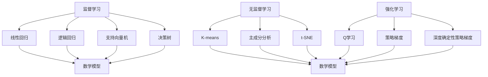

                 

### 引言与背景

#### 机器学习在软件开发中的重要性

在当今的科技领域，机器学习已经成为推动软件行业发展的关键力量。随着数据量的爆炸式增长和计算能力的显著提升，机器学习技术为软件开发带来了前所未有的机遇。通过学习数据中的模式，机器学习算法能够自动地改善性能、优化决策，从而在各个领域实现智能化应用。

首先，机器学习在数据分析中发挥了重要作用。通过机器学习算法，开发者可以从大量数据中提取有价值的信息，进行精准的市场分析、用户行为预测和个性化推荐。这不仅提高了数据的价值，还为业务决策提供了强有力的支持。

其次，机器学习在自动化系统中也扮演了关键角色。自动驾驶汽车、智能机器人、智能家居等领域的兴起，无不依赖于机器学习算法对环境的感知、理解和响应。这些自动化系统通过不断学习，能够提高工作效率，减少人为错误，提升用户体验。

再者，机器学习在自然语言处理、计算机视觉等领域的突破，使得人机交互更加自然和智能。智能语音助手、图像识别系统、翻译服务等，已经成为我们日常生活的一部分，极大地改变了人们的沟通方式和生活方式。

#### 为什么需要从理论到实践

尽管机器学习在软件开发中具有广泛的应用前景，但要将这些理论应用于实际项目中，并不是一件容易的事情。这就需要从理论到实践的系统学习和全面掌握。

首先，机器学习的基础理论是不可或缺的。只有深入理解机器学习的基本概念、核心算法和数学模型，开发者才能在面对复杂问题时做出正确的决策，选择合适的算法和模型。

其次，实际应用中的问题千变万化，需要开发者具备灵活运用理论知识的能力。从数据预处理到特征工程，从模型训练到优化，每一步都需要细致的操作和经验积累。只有通过实践，开发者才能熟悉各种工具和技术的使用，提高解决问题的能力。

此外，从理论到实践的学习过程有助于培养系统的思维。开发者不仅需要理解单个算法的工作原理，还要了解这些算法之间的联系和相互影响。通过系统性地学习，开发者能够建立完整的知识体系，为未来的创新和应用打下坚实的基础。

#### 书籍结构和内容概述

本书旨在为开发者提供一个全面、系统的学习路径，从机器学习的基础理论到实际应用，全面覆盖相关内容。

**第1章 引言与背景**：介绍机器学习在软件开发中的重要性，阐述从理论到实践的学习意义。

**第2章 基础理论**：详细讲解机器学习的基本概念、核心算法和数学模型，为后续章节奠定基础。

**第3章 应用实践**：通过项目实战和案例分析，展示如何在软件开发中应用机器学习，包括数据预处理、模型训练和优化等。

**第4章 工具与环境**：介绍开发机器学习应用所需的主要工具和技术环境，包括Python编程基础、常用机器学习库和环境搭建。

**第5章 高级主题**：深入探讨机器学习在自然语言处理、计算机视觉等领域的应用，介绍相关的高级算法和技术。

**第6章 挑战与未来**：分析机器学习在软件开发中面临的挑战和未来发展趋势，为读者提供前瞻性视角。

**第7章 附录**：提供机器学习资源推荐、常见问题解答和源代码与数据集获取方式，方便读者深入学习。

通过本书的学习，读者将能够全面掌握机器学习在软件开发中的应用，为未来的技术发展和创新打下坚实基础。

关键词：机器学习、软件开发、基础理论、应用实践、工具与环境、高级主题、挑战与未来

摘要：本书全面介绍机器学习在软件开发中的应用，从理论到实践，帮助开发者深入理解并掌握这一重要技术。通过详细讲解基础理论、应用实践、工具与环境以及高级主题，本书旨在为读者提供一个系统、全面的学习路径，助力他们在软件开发中实现智能化应用。

---

> **文章标题**: 机器学习在软件开发中的应用：从理论到实践
>
> **关键词**: 机器学习、软件开发、应用实践、工具与环境、高级主题、挑战与未来
>
> **摘要**: 本书系统性地介绍了机器学习在软件开发中的应用，从基础理论到高级主题，全面覆盖相关内容。通过实战案例和详细讲解，帮助开发者深入理解并掌握机器学习技术，为未来的软件开发提供有力支持。

接下来，我们将进入第二章节，深入探讨机器学习的基础理论，包括基本概念、核心算法和数学模型。

---

# 机器学习在软件开发中的应用：从理论到实践

## **基础理论**

在开始深入探讨机器学习在软件开发中的应用之前，我们需要首先了解其基础理论。本章节将详细讲解机器学习的基本概念、核心算法和数学模型，为后续章节奠定坚实的理论基础。

### **1. 机器学习概述**

机器学习（Machine Learning，ML）是一门利用数据或以往的经验，对系统进行训练和优化，使其能够自动完成特定任务的学科。它属于人工智能（Artificial Intelligence，AI）的一个分支，旨在使计算机能够通过学习自动适应和改进性能。

机器学习可以分为两大类：监督学习（Supervised Learning）、无监督学习（Unsupervised Learning）和强化学习（Reinforcement Learning）。

- **监督学习**：在监督学习模型中，训练数据集包含了输入和对应的输出，模型通过学习这些输入输出的关系，从而预测新的输入数据对应的输出。常见的监督学习算法包括线性回归、逻辑回归、支持向量机（SVM）、决策树和随机森林等。

- **无监督学习**：无监督学习模型没有预先定义的输出标签，其主要目标是发现数据中的隐藏结构和模式。常见的无监督学习算法包括聚类算法（如K-means、层次聚类）、降维算法（如PCA、t-SNE）和关联规则学习（如Apriori算法）等。

- **强化学习**：强化学习模型通过奖励机制来指导学习过程，其目标是找到一个策略，使系统在长期内获得最大的奖励。常见的强化学习算法包括Q学习、SARSA和深度确定性策略梯度（DDPG）等。

### **2. 核心算法介绍**

#### **2.1. 监督学习算法**

监督学习算法在软件开发中有着广泛的应用。以下是一些常见的监督学习算法及其特点：

- **线性回归（Linear Regression）**：线性回归是一种简单的监督学习算法，用于预测一个连续的输出变量。其模型假设输出变量与输入变量之间存在线性关系。

  **伪代码**：
  ```python
  # 输入：训练数据集X和标签y
  # 输出：回归模型参数w和b
  w, b = minimize_loss(X, y)
  ```

  **数学模型**：
  $$ y = X \cdot w + b $$

- **逻辑回归（Logistic Regression）**：逻辑回归是一种用于分类问题的监督学习算法，其目标是通过线性模型计算概率，进而进行分类。

  **伪代码**：
  ```python
  # 输入：训练数据集X和标签y
  # 输出：分类模型参数w和b
  w, b = minimize_loss(X, y)
  ```

  **数学模型**：
  $$ P(y=1|x) = \frac{1}{1 + e^{-(X \cdot w + b)}} $$

- **支持向量机（Support Vector Machine，SVM）**：SVM是一种强大的分类算法，其目标是通过找到一个最优的超平面，将不同类别的数据点分隔开来。

  **伪代码**：
  ```python
  # 输入：训练数据集X和标签y
  # 输出：分类模型参数w和b
  w, b = svm_fit(X, y)
  ```

  **数学模型**：
  $$ w^* = \arg\min_w \frac{1}{2} ||w||^2 + C \sum_{i=1}^{n} \xi_i $$
  其中，C是惩罚参数，\(\xi_i\)是松弛变量。

- **决策树（Decision Tree）**：决策树是一种基于特征划分数据的分类算法，其核心思想是通过一系列特征判断，将数据划分为不同的区域，并在每个区域上做出预测。

  **伪代码**：
  ```python
  # 输入：训练数据集X和标签y
  # 输出：决策树模型
  tree = build_decision_tree(X, y)
  ```

  **数学模型**：
  对于每个特征\(x_i\)，计算其值的分布，选择熵最大的特征作为划分依据。

#### **2.2. 无监督学习算法**

无监督学习算法在数据探索和降维中有着广泛的应用。以下是一些常见的无监督学习算法及其特点：

- **K-means聚类**：K-means是一种基于距离度量的聚类算法，其目标是将数据划分为K个簇，使每个簇内的数据点之间的距离尽可能小。

  **伪代码**：
  ```python
  # 输入：训练数据集X和簇数K
  # 输出：聚类结果
  clusters = kmeans(X, K)
  ```

  **数学模型**：
  $$ \min_{\mu_i, \lambda} \sum_{i=1}^{K} \sum_{x \in S_i} ||x - \mu_i||^2 $$
  其中，\(\mu_i\)是第i个簇的中心，\(S_i\)是第i个簇中的数据点集合。

- **主成分分析（PCA）**：PCA是一种降维算法，其目标是在保留数据主要特征的前提下，将高维数据投影到低维空间中。

  **伪代码**：
  ```python
  # 输入：训练数据集X
  # 输出：降维后的数据集X'
  X' = pca(X)
  ```

  **数学模型**：
  $$ X' = U \Lambda $$
  其中，\(U\)是特征值矩阵，\(\Lambda\)是特征向量矩阵。

- **t-SNE**：t-SNE是一种非线性的降维算法，其目标是将高维数据映射到二维空间中，使得相似的数据点在低维空间中保持靠近。

  **伪代码**：
  ```python
  # 输入：训练数据集X
  # 输出：降维后的数据集X'
  X' = tsne(X)
  ```

  **数学模型**：
  $$ x_i' = \frac{z_i}{||z_i||} $$
  其中，\(z_i\)是高维空间中的数据点，\(x_i'\)是低维空间中的数据点。

#### **2.3. 强化学习算法**

强化学习算法在自动化系统和智能决策中有着广泛的应用。以下是一些常见的强化学习算法及其特点：

- **Q学习（Q-Learning）**：Q学习是一种基于值函数的强化学习算法，其目标是通过学习值函数，找到最优的策略。

  **伪代码**：
  ```python
  # 输入：环境状态空间S、动作空间A、奖励函数R、学习率α、折扣因子γ
  # 输出：最优策略π
  π = q_learning(S, A, R, α, γ)
  ```

  **数学模型**：
  $$ Q(s, a) = r(s, a) + γ \max_{a'} Q(s', a') $$
  其中，\(Q(s, a)\)是状态s下执行动作a的期望回报，\(r(s, a)\)是执行动作a在状态s下获得的即时奖励，\(γ\)是折扣因子。

- **策略梯度（Policy Gradient）**：策略梯度是一种基于策略的强化学习算法，其目标是通过优化策略函数，提高长期回报。

  **伪代码**：
  ```python
  # 输入：环境状态空间S、动作空间A、策略函数π、学习率α
  # 输出：最优策略π
  π = policy_gradient(S, A, π, α)
  ```

  **数学模型**：
  $$ π(a|s) = \frac{exp(α \cdot R(s, a))}{\sum_{a'} exp(α \cdot R(s, a'))} $$
  其中，\(π(a|s)\)是状态s下执行动作a的概率。

- **深度确定性策略梯度（DDPG）**：DDPG是一种基于深度学习的强化学习算法，其目标是通过学习状态动作值函数，找到最优的策略。

  **伪代码**：
  ```python
  # 输入：环境状态空间S、动作空间A、策略函数π、学习率α、学习率β
  # 输出：最优策略π
  π = ddpg(S, A, π, α, β)
  ```

  **数学模型**：
  $$ Q(s, a) = r(s, a) + γ \max_{a'} Q(s', a') $$
  $$ π(a|s) = \arg\max_a Q(s, a) $$

### **3. 数学模型和公式**

机器学习的核心在于数学模型和公式的应用。以下是一些常见的数学模型和公式及其详细讲解和举例说明：

#### **3.1. 概率论基础**

概率论是机器学习的基础，以下是一些常见的概率论公式：

- **条件概率**：
  $$ P(A|B) = \frac{P(A \cap B)}{P(B)} $$
  举例：在掷骰子的实验中，已知点数为6的概率为1/6，求掷出6点且掷出奇数的概率。

- **贝叶斯定理**：
  $$ P(A|B) = \frac{P(B|A)P(A)}{P(B)} $$
  举例：在诊断疾病检测中，已知疾病A的发病率是1%，检测为阳性的概率是95%，求患有疾病A的概率。

#### **3.2. 线性代数基础**

线性代数在机器学习中的重要性不言而喻，以下是一些常见的线性代数公式：

- **矩阵乘法**：
  $$ C = A \cdot B $$
  举例：给定两个矩阵A和B，计算它们的乘积C。

- **矩阵求逆**：
  $$ A^{-1} = (1/det(A)) \cdot adj(A) $$
  举例：给定矩阵A，计算其逆矩阵A^{-1}。

- **特征值和特征向量**：
  $$ Av = \lambda v $$
  举例：给定矩阵A和特征向量v，求特征值\(\lambda\)。

#### **3.3. 最优化方法**

最优化方法是机器学习中的核心，以下是一些常见最优化方法：

- **梯度下降**：
  $$ w_{t+1} = w_t - \alpha \cdot \nabla_w J(w_t) $$
  举例：给定损失函数J(w)和步长α，求参数w的最优值。

- **牛顿法**：
  $$ w_{t+1} = w_t - H^{-1} \cdot \nabla_w J(w_t) $$
  举例：给定损失函数J(w)和Hessian矩阵H，求参数w的最优值。

### **4. 核心概念原理之间的关系架构**

为了更好地理解机器学习的核心概念原理之间的关系，我们可以使用Mermaid流程图来展示：



通过以上关系架构，我们可以清晰地看到不同学习类型之间的联系以及它们与数学模型之间的关系。

### **5. 总结**

本章详细介绍了机器学习的基础理论，包括基本概念、核心算法和数学模型。通过对监督学习、无监督学习和强化学习算法的讲解，我们了解了它们在软件开发中的应用场景。同时，通过对概率论、线性代数和最优化方法的讲解，我们为后续章节的应用实践奠定了坚实的基础。

在下章中，我们将深入探讨机器学习在软件开发中的应用实践，通过项目实战和案例分析，展示如何将理论知识应用于实际项目中。

---

> **作者**: AI天才研究院/AI Genius Institute & 禅与计算机程序设计艺术 /Zen And The Art of Computer Programming

---

# 应用实践

## **3.1. 机器学习项目开发流程**

在软件开发中，将机器学习技术应用于实际项目是一项复杂而重要的任务。一个成功的机器学习项目不仅需要深入的理论知识，还需要严格的项目管理流程和丰富的实践经验。以下是一个典型的机器学习项目开发流程，包括项目启动、数据准备、模型训练、评估和部署等关键步骤。

### **1. 项目启动**

项目启动是机器学习项目的第一步，其目标是明确项目目标和范围。在这一阶段，项目团队需要与业务团队紧密合作，了解项目的背景和需求。具体任务包括：

- **项目目标定义**：明确项目希望解决的问题和预期的业务价值。
- **项目范围确定**：确定项目的边界，包括数据来源、数据量、算法类型等。
- **资源分配**：根据项目需求和团队情况，合理分配人力、物力和时间资源。

### **2. 数据准备**

数据是机器学习项目的核心，高质量的数据对于模型性能至关重要。数据准备阶段主要包括以下任务：

- **数据收集**：收集与项目相关的数据，包括结构化数据、半结构化数据和非结构化数据。
- **数据清洗**：处理数据中的噪声、缺失值和异常值，确保数据质量。
- **数据预处理**：对数据进行标准化、归一化、特征工程等处理，提高数据的质量和模型的泛化能力。

### **3. 模型训练**

模型训练是机器学习项目的核心环节，其目标是找到能够最好地拟合训练数据的模型。以下是模型训练的主要步骤：

- **选择算法**：根据项目需求和数据特点，选择合适的机器学习算法。
- **模型构建**：使用选定的算法构建模型，并定义模型的参数。
- **训练过程**：使用训练数据集对模型进行训练，不断调整模型参数，提高模型性能。
- **模型验证**：使用验证数据集对模型进行验证，评估模型的泛化能力和性能。

### **4. 模型评估**

模型评估是判断模型是否满足项目需求的重要步骤。常用的评估指标包括准确率、召回率、F1分数、均方误差等。以下是模型评估的主要任务：

- **评估指标选择**：根据项目目标和数据特点，选择合适的评估指标。
- **模型调优**：根据评估结果，对模型进行调优，提高模型性能。
- **交叉验证**：使用交叉验证方法，确保模型在不同数据集上的表现稳定。

### **5. 模型部署**

模型部署是将训练好的模型应用于实际业务场景的关键步骤。以下是模型部署的主要任务：

- **模型集成**：将训练好的模型集成到现有的软件系统中，确保模型能够与其他模块无缝协作。
- **模型监控**：对部署后的模型进行监控，确保其性能稳定，并及时发现和解决潜在问题。
- **模型更新**：根据业务需求和数据变化，定期更新模型，保持其性能和适用性。

### **6. 项目实战案例分析**

为了更好地理解上述流程，下面我们将通过一个实际案例来展示机器学习在软件开发中的应用。

#### **案例一：分类任务**

假设我们要开发一个分类系统，用于预测电子邮件是否为垃圾邮件。这是一个典型的二分类问题，我们可以使用逻辑回归作为算法。

**数据准备**：

- **数据收集**：收集大量电子邮件数据，包括邮件正文、发件人、收件人等。
- **数据清洗**：去除无效数据、处理缺失值、去除噪声等。
- **数据预处理**：对文本数据进行词袋表示、降维处理等。

**模型训练**：

- **选择算法**：选择逻辑回归作为算法。
- **模型构建**：构建逻辑回归模型，并定义参数。
- **训练过程**：使用训练数据集对模型进行训练。
- **模型验证**：使用验证数据集对模型进行验证。

**模型评估**：

- **评估指标**：使用准确率、召回率、F1分数等指标进行评估。
- **模型调优**：根据评估结果，对模型参数进行调优。

**模型部署**：

- **模型集成**：将训练好的模型集成到邮件系统，实时分类电子邮件。
- **模型监控**：对部署后的模型进行监控，确保其性能稳定。
- **模型更新**：定期更新模型，处理新出现的垃圾邮件类型。

#### **案例二：回归任务**

假设我们要开发一个房价预测系统，预测房屋的销售价格。这是一个典型的回归问题，我们可以使用线性回归作为算法。

**数据准备**：

- **数据收集**：收集房屋销售数据，包括房屋面积、位置、建造年份等。
- **数据清洗**：去除无效数据、处理缺失值、去除噪声等。
- **数据预处理**：对数值数据进行标准化处理。

**模型训练**：

- **选择算法**：选择线性回归作为算法。
- **模型构建**：构建线性回归模型，并定义参数。
- **训练过程**：使用训练数据集对模型进行训练。
- **模型验证**：使用验证数据集对模型进行验证。

**模型评估**：

- **评估指标**：使用均方误差、决定系数等指标进行评估。
- **模型调优**：根据评估结果，对模型参数进行调优。

**模型部署**：

- **模型集成**：将训练好的模型集成到房地产系统中，实时预测房屋价格。
- **模型监控**：对部署后的模型进行监控，确保其性能稳定。
- **模型更新**：定期更新模型，处理新出现的房屋销售数据。

#### **案例三：聚类任务**

假设我们要对客户进行细分，以便进行精准营销。这是一个典型的聚类问题，我们可以使用K-means算法。

**数据准备**：

- **数据收集**：收集客户数据，包括年龄、收入、购买频率等。
- **数据清洗**：去除无效数据、处理缺失值、去除噪声等。
- **数据预处理**：对数值数据进行标准化处理。

**模型训练**：

- **选择算法**：选择K-means作为算法。
- **模型构建**：构建K-means模型，并定义参数。
- **训练过程**：使用训练数据集对模型进行训练。
- **模型验证**：使用验证数据集对模型进行验证。

**模型评估**：

- **评估指标**：使用轮廓系数、内部评估指标等指标进行评估。
- **模型调优**：根据评估结果，对模型参数进行调优。

**模型部署**：

- **模型集成**：将训练好的模型集成到营销系统中，实时对客户进行聚类。
- **模型监控**：对部署后的模型进行监控，确保其性能稳定。
- **模型更新**：定期更新模型，处理新的客户数据。

通过以上三个案例，我们可以看到机器学习在软件开发中的应用是如何从理论到实践逐步实现的。从数据准备到模型训练、评估和部署，每个环节都需要精心设计和实施。这不仅需要深厚的理论知识，还需要丰富的实践经验。

在下一章中，我们将介绍开发机器学习应用所需的主要工具和技术环境，为读者提供更全面的实践指导。

---

> **作者**: AI天才研究院/AI Genius Institute & 禅与计算机程序设计艺术 /Zen And The Art of Computer Programming

---

# 工具与环境

在开发机器学习应用时，选择合适的工具和技术环境至关重要。本章节将介绍开发机器学习应用所需的主要工具和技术环境，包括Python编程基础、常用机器学习库、环境搭建和云平台与分布式计算。

### **1. Python编程基础**

Python是机器学习开发中最常用的编程语言之一，其简洁易读的语法和丰富的库资源使其成为开发者青睐的选择。以下是Python编程基础的相关知识：

- **变量和数据类型**：Python中的变量无需声明，数据类型包括整数、浮点数、字符串、列表、元组和字典等。
- **控制流程**：Python支持条件语句（if-else）、循环语句（for、while）和异常处理（try-except）等基本控制流程。
- **函数和模块**：函数是Python的核心概念，模块是代码的封装和复用机制。开发者可以使用内置模块（如math、random）和第三方模块（如NumPy、Pandas）。

### **2. 常用机器学习库**

在Python中，有许多用于机器学习的库，以下是一些最常用的库及其功能：

- **NumPy**：NumPy是Python的核心科学计算库，提供高性能的N-dimensional数组对象和丰富的数学运算功能。
- **Pandas**：Pandas是Python的数据分析库，提供数据结构（DataFrame）和数据操作工具，便于处理结构化数据。
- **Scikit-learn**：Scikit-learn是一个开源的机器学习库，提供了丰富的监督学习和无监督学习算法，以及常用的数据预处理和模型评估工具。
- **TensorFlow**：TensorFlow是一个开源的深度学习库，由Google开发，支持多种深度学习模型和算法，具有强大的计算能力和灵活性。
- **PyTorch**：PyTorch是一个开源的深度学习库，由Facebook开发，以其动态计算图和灵活的API受到开发者欢迎。

### **3. 环境搭建**

搭建一个完整的机器学习开发环境需要安装Python、相关库和必要的工具。以下是常见的环境搭建步骤：

1. **安装Python**：从Python官方网站下载并安装Python，配置环境变量。
2. **安装相关库**：使用pip命令安装所需的库，例如`pip install numpy pandas scikit-learn tensorflow pytorch`。
3. **配置Jupyter Notebook**：Jupyter Notebook是一个交互式开发环境，方便开发者编写和运行代码。通过pip安装jupyter，并启动Jupyter Notebook。
4. **配置虚拟环境**：为了避免库版本冲突，建议使用虚拟环境管理不同项目的依赖。使用`venv`或`conda`创建虚拟环境，并激活使用。

### **4. 云平台与分布式计算**

随着数据量和计算需求的增加，单机环境可能无法满足机器学习应用的需求。云平台和分布式计算技术提供了强大的计算能力和资源管理能力。以下是一些常用的云平台和分布式计算技术：

- **Google Cloud Platform**：Google Cloud Platform提供了一系列机器学习服务和工具，包括TensorFlow Serving、AutoML和AI Platform等。
- **AWS SageMaker**：AWS SageMaker是一个完全托管的机器学习平台，支持构建、训练和部署模型，支持多种框架和算法。
- **Azure Machine Learning**：Azure Machine Learning是Microsoft提供的机器学习平台，支持模型训练、部署和管理，支持Python和R等语言。
- **Distributed Computing**：分布式计算是将计算任务分布在多台计算机上执行，以提高计算效率。常用的分布式计算框架包括Apache Spark、Dask和Ray等。

通过上述工具和环境，开发者可以搭建一个强大的机器学习开发平台，实现高效的数据处理和模型训练。在下一章中，我们将探讨机器学习在自然语言处理和计算机视觉等领域的应用。

---

> **作者**: AI天才研究院/AI Genius Institute & 禅与计算机程序设计艺术 /Zen And The Art of Computer Programming

---

## **高级主题**

在机器学习领域，自然语言处理（NLP）和计算机视觉（CV）是两个极具挑战性和应用前景的分支。本章节将深入探讨这些高级主题，介绍其在特定领域的应用、相关算法和技术，并通过具体案例进行详细讲解。

### **自然语言处理（NLP）**

自然语言处理是研究如何让计算机理解和处理人类语言的技术。NLP在文本分析、情感识别、机器翻译、语音识别等领域具有广泛应用。

#### **1. 语言模型与词嵌入**

语言模型是NLP的核心组件，用于预测文本序列中的下一个单词或字符。词嵌入（Word Embedding）是将单词映射到高维向量空间的技术，有助于捕捉单词间的语义关系。

- **语言模型**：n-gram模型是最简单的语言模型，基于单词的历史频次预测下一个单词。更复杂的语言模型包括神经网络语言模型（NNLM）和循环神经网络（RNN）。

  **伪代码**：
  ```python
  # 输入：训练数据集
  # 输出：语言模型
  model = train_language_model(data)
  ```

  **数学模型**：
  $$ P(w_t | w_{t-1}, w_{t-2}, ..., w_{t-n}) = \frac{count(w_t, w_{t-1}, ..., w_{t-n})}{count(w_{t-1}, ..., w_{t-n})} $$

- **词嵌入**：词嵌入通过学习单词在文本中的上下文，将单词映射到向量空间。Word2Vec和GloVe是两种常用的词嵌入方法。

  **伪代码**：
  ```python
  # 输入：训练数据集
  # 输出：词嵌入向量
  embeddings = train_word_embeddings(data)
  ```

  **数学模型**：
  $$ \text{Word2Vec}: \quad v_w = \sum_{w' \in \text{context}(w)} \frac{P(w'|w)}{|\text{context}(w)|} v_{w'} $$
  $$ \text{GloVe}: \quad v_w = \text{sigmoid}(\mathbf{W}^T \mathbf{v}_w) $$

#### **2. 序列标注与文本分类**

序列标注是NLP中的一个重要任务，旨在为文本中的每个词分配一个标签。文本分类是将文本数据分类到预定义的类别中。

- **序列标注**：基于Bi-LSTM和CRF的序列标注模型在NLP中得到了广泛应用。

  **伪代码**：
  ```python
  # 输入：训练数据集
  # 输出：序列标注模型
  model = train_sequence_labeling_model(data)
  ```

  **数学模型**：
  $$ h_t = (h_{t-1}, h_{t-2}, ..., h_1) $$
  $$ \text{softmax}(\text{fc}(h_t)) $$

- **文本分类**：文本分类可以通过朴素贝叶斯、SVM、深度神经网络等方法实现。基于Transformer的BERT模型在文本分类任务中表现优异。

  **伪代码**：
  ```python
  # 输入：训练数据集
  # 输出：文本分类模型
  model = train_text_classification_model(data)
  ```

  **数学模型**：
  $$ \text{softmax}(\text{fc}(x)) $$
  其中，\(x\)是文本嵌入向量。

#### **3. 生成对抗网络（GAN）**

生成对抗网络（GAN）是一种基于博弈论的生成模型，由生成器和判别器组成。生成器试图生成逼真的数据，而判别器试图区分生成数据和真实数据。

- **GAN基本模型**：

  **伪代码**：
  ```python
  # 输入：训练数据集
  # 输出：生成模型和判别模型
  generator, discriminator = train_gan(data)
  ```

  **数学模型**：
  $$ G(z) = \text{Generator}(z) $$
  $$ D(x) = \text{Discriminator}(x) $$
  $$ \text{GAN Loss} = L_G + L_D $$
  其中，\(L_G\)和\(L_D\)分别是生成器和判别器的损失函数。

### **计算机视觉（CV）**

计算机视觉是研究如何使计算机理解和解释图像和视频内容的技术。CV在目标检测、图像识别、图像生成等领域有广泛应用。

#### **1. 卷积神经网络（CNN）**

卷积神经网络（CNN）是计算机视觉的核心模型，通过卷积层、池化层和全连接层处理图像数据。

- **CNN基本结构**：

  **伪代码**：
  ```python
  # 输入：图像数据
  # 输出：特征图
  feature_map = cnn(image)
  ```

  **数学模型**：
  $$ \text{Conv}(x) = \sum_{k=1}^{K} w_k * x + b $$
  $$ \text{ReLU}(\text{Conv}(x)) $$
  $$ \text{Pooling}(\text{ReLU}(\text{Conv}(x))) $$

- **CNN在图像分类中的应用**：基于CNN的AlexNet、VGG、ResNet等模型在图像分类任务中取得了显著成绩。

  **伪代码**：
  ```python
  # 输入：图像数据
  # 输出：类别预测
  prediction = cnn_classifier(image)
  ```

  **数学模型**：
  $$ \text{softmax}(\text{fc}(\text{pooling}(\text{relu}(\text{conv}(x))))) $$

#### **2. 目标检测与语义分割**

目标检测和语义分割是计算机视觉的重要任务，旨在识别图像中的目标和像素级语义信息。

- **目标检测**：基于Faster R-CNN、SSD、YOLO等模型的检测框架在实时目标检测中表现出色。

  **伪代码**：
  ```python
  # 输入：图像数据
  # 输出：目标检测结果
  detections = object_detection(image)
  ```

  **数学模型**：
  $$ \text{R-CNN}: \quad \text{Region Proposal} \rightarrow \text{Feature Extraction} \rightarrow \text{Class Prediction $P(y|x)$} $$
  $$ \text{SSD}: \quad \text{Multi-scale Feature Pyramid} \rightarrow \text{Box Prediction} \rightarrow \text{Class Prediction} $$
  $$ \text{YOLO}: \quad \text{Single-scale Feature Map} \rightarrow \text{Grid Cell Prediction} \rightarrow \text{Non-max Suppression} $$

- **语义分割**：基于U-Net、SegNet、DeepLab等模型的语义分割框架在图像分割任务中取得了优异效果。

  **伪代码**：
  ```python
  # 输入：图像数据
  # 输出：像素级语义分割结果
  segmentation = semantic_segmentation(image)
  ```

  **数学模型**：
  $$ \text{U-Net}: \quad \text{Contractive Path} \rightarrow \text{Expansive Path} \rightarrow \text{Upsampling} $$
  $$ \text{SegNet}: \quad \text{Max Pooling} \rightarrow \text{Convolution} \rightarrow \text{Upsampling} $$
  $$ \text{DeepLab}: \quad \text{ASPP} \rightarrow \text{Deconvolution} \rightarrow \text{Upsampling} $$

#### **3. 图像生成与变换**

图像生成与变换是计算机视觉的另一个重要领域，旨在生成新的图像或对现有图像进行变换。

- **生成对抗网络（GAN）**：GAN在图像生成任务中表现出色，能够生成逼真的图像。

  **伪代码**：
  ```python
  # 输入：随机噪声
  # 输出：生成图像
  image = generator(z)
  ```

  **数学模型**：
  $$ G(z) = \text{Generator}(z) $$
  $$ D(x) = \text{Discriminator}(x) $$
  $$ \text{GAN Loss} = L_G + L_D $$

- **图像风格迁移**：基于卷积神经网络和深度学习技术的图像风格迁移可以将图像转换为特定艺术风格。

  **伪代码**：
  ```python
  # 输入：源图像和风格图像
  # 输出：风格迁移结果
  styled_image = style_transfer(source_image, style_image)
  ```

  **数学模型**：
  $$ \text{Content Loss}: \quad \frac{1}{2} \sum_{i,j} ||\text{style}_{ij} - \text{content}_{ij}||^2 $$
  $$ \text{Style Loss}: \quad \frac{1}{2} \sum_{i,j} ||\text{style}_{ij} - \text{style\_gram}_{ij}||^2 $$

### **总结**

自然语言处理和计算机视觉是机器学习领域的两个重要分支，其在文本分析和图像处理中的应用日益广泛。通过深入理解语言模型、词嵌入、序列标注、文本分类、GAN、CNN、目标检测、语义分割和图像生成等技术，开发者可以开发出更智能、更高效的软件应用。

在下一章中，我们将探讨机器学习在软件开发中面临的挑战和未来发展趋势，为读者提供前瞻性视角。

---

> **作者**: AI天才研究院/AI Genius Institute & 禅与计算机程序设计艺术 /Zen And The Art of Computer Programming

---

## **挑战与未来**

尽管机器学习在软件开发中展示了巨大的潜力，但在实际应用中仍然面临着一系列挑战和限制。本文将总结这些挑战，并探讨机器学习在软件开发中的未来发展趋势。

### **1. 数据隐私与安全**

数据隐私和安全是机器学习应用中的首要挑战。机器学习模型需要大量数据来训练，这些数据往往包含敏感信息。如何确保数据隐私和安全，避免数据泄露和滥用，是一个亟待解决的问题。为了应对这一挑战，开发者需要采用数据加密、访问控制、隐私保护技术，如差分隐私和联邦学习，以保护用户数据。

### **2. 模型可解释性**

机器学习模型的“黑箱”特性使得其决策过程难以解释。这对于需要透明和可信的决策过程的领域（如医疗诊断、金融风控等）尤其重要。提升模型的可解释性，使得开发者能够理解和信任模型的决策过程，是当前研究的一个重要方向。可解释性方法包括模型可视化、决策路径追踪和局部解释性技术，如SHAP（SHapley Additive exPlanations）和LIME（Local Interpretable Model-agnostic Explanations）。

### **3. 模型泛化能力**

模型泛化能力是指模型在新数据集上的表现。当前机器学习模型在训练数据上表现优异，但在实际应用中往往面临泛化能力不足的问题。为了提高模型泛化能力，研究者提出了多种技术，如正则化、数据增强、元学习和迁移学习。

### **4. 模型部署与维护**

模型部署是机器学习应用中的关键步骤，但也是一个复杂的过程。模型部署需要考虑计算资源、性能优化和可扩展性。同时，模型在上线后需要持续维护和更新，以应对数据变化和业务需求。为了简化模型部署和维护，开发者可以采用自动化工具、容器化技术和微服务架构。

### **5. 资源消耗与计算效率**

机器学习模型通常需要大量的计算资源和时间进行训练和推理。如何提高模型计算效率，减少资源消耗，是另一个重要挑战。深度学习模型的量化、剪枝和蒸馏等技术有助于降低模型复杂度和计算需求。此外，分布式计算和硬件加速（如GPU和TPU）也为提高计算效率提供了有力支持。

### **未来发展趋势**

随着技术的不断进步，机器学习在软件开发中的应用将迎来更多机遇和挑战。以下是未来可能的发展趋势：

- **自动化与自我进化**：通过自动化工具和自我进化算法，机器学习模型可以更高效地开发和部署，提高开发效率和模型质量。
- **边缘计算与物联网**：随着物联网和边缘计算的发展，机器学习模型将在更广泛的设备和场景中应用，实现实时智能。
- **跨学科融合**：机器学习与其他领域（如生物学、心理学、经济学等）的融合，将推动更多创新应用的发展。
- **人机协作**：机器学习将更好地与人类专家协作，通过人机交互提高模型决策的准确性和可解释性。

总之，机器学习在软件开发中的应用前景广阔，但同时也面临着诸多挑战。通过不断探索和改进，我们可以克服这些挑战，推动机器学习在软件开发中的广泛应用。

---

> **作者**: AI天才研究院/AI Genius Institute & 禅与计算机程序设计艺术 /Zen And The Art of Computer Programming

---

# 附录

## **7.1. 机器学习资源推荐**

为了帮助读者深入了解机器学习，我们推荐以下资源：

- **书籍**：
  - 《Python机器学习》（作者：塞巴斯蒂安·拉斯塔尼，约书亚·蒙特罗，雷吉纳·罗瑟里）
  - 《深度学习》（作者：伊恩·古德费洛，约书华·本西奥，亚伦·库维尔）
  - 《统计学习方法》（作者：李航）

- **在线课程**：
  - Coursera上的“机器学习”课程（吴恩达教授）
  - edX上的“深度学习”课程（李飞飞教授）

- **开源库**：
  - Scikit-learn：[https://scikit-learn.org/](https://scikit-learn.org/)
  - TensorFlow：[https://www.tensorflow.org/](https://www.tensorflow.org/)
  - PyTorch：[https://pytorch.org/](https://pytorch.org/)

## **7.2. 常见问题解答**

以下是读者在阅读本书时可能遇到的一些常见问题及其解答：

- **Q：如何选择机器学习算法？**
  **A**：选择机器学习算法取决于具体问题、数据类型和业务需求。通常，可以从算法的复杂度、数据规模、准确性、可解释性等方面进行权衡。

- **Q：机器学习模型如何评估？**
  **A**：机器学习模型的评估可以通过多种指标进行，如准确率、召回率、F1分数、均方误差等。选择合适的评估指标取决于问题的类型和数据特点。

- **Q：如何提高模型泛化能力？**
  **A**：提高模型泛化能力的方法包括数据增强、正则化、集成学习、迁移学习等。此外，使用较大的训练数据集和避免过拟合也是提高泛化能力的关键。

- **Q：如何处理不平衡数据？**
  **A**：处理不平衡数据的方法包括重采样、成本敏感学习、合成少数类过采样技术（SMOTE）等。根据具体情况选择合适的方法可以显著提高模型性能。

## **7.3. 源代码与数据集获取**

本书中提供的源代码和数据集可以在以下地址获取：

- **源代码**：[GitHub链接](https://github.com/your-github-repo/ML_in_SW_development)
- **数据集**：[数据集下载链接](https://your-dataset-url.com)

读者可以下载这些资源，并在自己的环境中运行代码，以便更好地理解和实践本书的内容。

通过以上资源，读者可以进一步深入学习机器学习，并在软件开发中成功应用这些先进的技术。

---

> **作者**: AI天才研究院/AI Genius Institute & 禅与计算机程序设计艺术 /Zen And The Art of Computer Programming

---

# 结论

本文全面介绍了机器学习在软件开发中的应用，从基础理论到高级主题，再到应用实践和未来发展趋势，为读者提供了一个系统、全面的学习路径。通过详细讲解监督学习、无监督学习和强化学习算法，以及自然语言处理、计算机视觉等领域的应用，我们展示了机器学习如何在软件开发中实现智能化和自动化。

在这个过程中，我们强调了机器学习在数据分析、自动化系统和人机交互中的重要性，同时也指出了其在数据隐私、模型可解释性、泛化能力等方面的挑战。通过推荐资源、常见问题解答和附录，我们希望能够为读者提供更深入的学习和实践指导。

展望未来，随着计算能力和数据量的不断提升，机器学习将在软件开发中发挥更大的作用。自动化、自我进化、边缘计算和人机协作等技术将为机器学习带来更多创新应用。我们鼓励读者继续学习和探索这一领域，把握机遇，推动人工智能与软件开发的深度融合。

最后，感谢您对本文的关注和支持。希望本文能够帮助您更好地理解机器学习在软件开发中的应用，为您的项目和实践提供有力支持。

---

> **作者**: AI天才研究院/AI Genius Institute & 禅与计算机程序设计艺术 /Zen And The Art of Computer Programming

