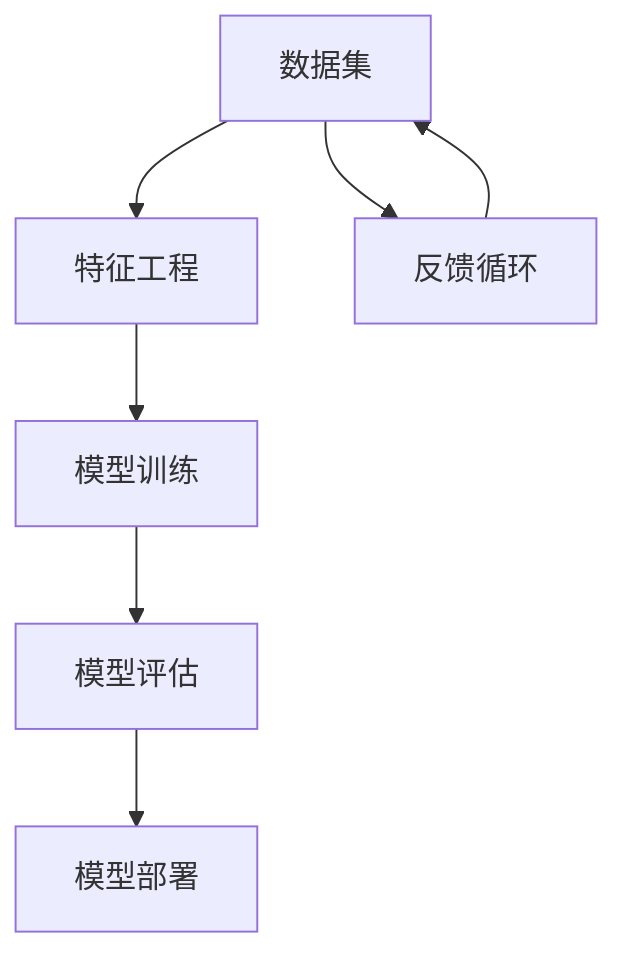

                 

### 文章标题：机器学习工程：从模型到生产的全流程

#### 关键词：
- 机器学习工程
- 模型部署
- 数据预处理
- 特征工程
- 实时机器学习
- 最佳实践

#### 摘要：
本文旨在深入探讨机器学习工程的全流程，从模型构建到生产部署，涵盖基础概念、核心算法、实践经验和最佳实践。通过逐步分析，我们将揭示机器学习工程的内在逻辑与实现细节，帮助读者全面掌握这一领域的知识体系，提升实际应用能力。

---

## 引言

### 机器学习工程的定义与重要性

机器学习工程是一种将机器学习算法应用于实际问题的系统化过程。它不仅涉及算法的选择和优化，还包括数据预处理、特征工程、模型训练、评估和部署等环节。与传统的软件开发相比，机器学习工程更注重数据的处理和算法的实际应用效果。

在当今数据驱动的时代，机器学习工程的重要性不言而喻。随着大数据和人工智能技术的发展，机器学习已经逐渐渗透到各个行业，如金融、医疗、制造和交通等。机器学习工程不仅能够帮助企业提高生产效率、降低成本，还能够推动创新，带来新的商业模式。

### 机器学习工程与传统软件工程的区别

传统软件工程主要关注的是软件的设计、开发、测试和部署。其核心是代码质量和功能实现。而机器学习工程则更侧重于数据的处理和分析，以及算法的优化和实际应用。具体区别如下：

- **数据的重要性**：在机器学习工程中，数据是核心资源，而传统软件工程更注重代码和架构。
- **算法的选择和调优**：机器学习工程需要对多种算法进行选择和调优，以获得最佳效果。传统软件工程则更多地关注功能和性能的优化。
- **模型的部署与维护**：机器学习工程需要将模型部署到生产环境，并进行持续的监控和更新。传统软件工程则更注重软件的稳定性和可靠性。

### 机器学习工程面临的挑战与机遇

虽然机器学习工程带来了许多机遇，但也面临着诸多挑战：

- **数据质量**：高质量的数据是机器学习成功的关键。数据清洗和预处理是一项耗时且重要的工作。
- **算法选择和调优**：不同的问题可能需要不同的算法，如何选择和调优合适的算法是一个难题。
- **模型部署和运维**：如何将模型部署到生产环境，并保证其稳定性和可靠性，是机器学习工程的重要挑战。
- **实时性**：许多应用场景需要实时机器学习，这对算法和系统设计提出了更高的要求。

然而，随着技术的不断进步，机器学习工程也在不断发展和完善。通过深入研究和实践，我们可以更好地应对这些挑战，抓住机遇，推动人工智能技术的发展。

### 核心概念与联系

为了更好地理解机器学习工程，我们需要掌握以下几个核心概念：

- **数据集**：用于训练和测试模型的集合。
- **特征工程**：将原始数据转换为适合模型训练的特征。
- **模型训练**：使用训练数据对模型进行调整，使其能够准确预测新数据。
- **模型评估**：使用测试数据评估模型的性能。
- **模型部署**：将训练好的模型部署到生产环境，供实际应用使用。

这些概念之间存在紧密的联系，如图1所示：



在机器学习工程中，数据集的质量直接影响特征工程和模型训练的效果。通过不断的反馈和迭代，我们可以优化模型性能，提高实际应用效果。

### 核心算法原理讲解

#### 线性回归

线性回归是一种用于预测连续值的简单且有效的算法。它的基本原理是通过建立线性模型，拟合数据点之间的关系。线性回归的数学模型可以表示为：

$$
y = \beta_0 + \beta_1 \cdot x
$$

其中，$y$ 是预测值，$x$ 是输入特征，$\beta_0$ 和 $\beta_1$ 是模型参数。

伪代码如下：

```
输入：训练数据集X, Y
输出：模型参数β0, β1

初始化β0, β1
对于每个训练数据点(xi, yi)：
    计算预测值y_pred = β0 + β1 * xi
    更新β0, β1，使得误差最小
返回β0, β1
```

#### 逻辑回归

逻辑回归是一种用于预测二分类结果的算法。其基本原理是使用逻辑函数将线性回归模型的输出转换为概率值。逻辑回归的数学模型可以表示为：

$$
P(y=1) = \frac{1}{1 + e^{-(\beta_0 + \beta_1 \cdot x)}}
$$

其中，$P(y=1)$ 是预测值为1的概率，$e$ 是自然底数。

伪代码如下：

```
输入：训练数据集X, Y
输出：模型参数β0, β1

初始化β0, β1
对于每个训练数据点(xi, yi)：
    计算预测概率y_pred = 1 / (1 + e^{-(β0 + β1 * xi)})
    计算损失函数L = -[yi \* log(y_pred) + (1 - yi) \* log(1 - y_pred)]
    更新β0, β1，使得损失函数L最小
返回β0, β1
```

#### 决策树

决策树是一种基于树形结构进行决策的算法。它的基本原理是从原始数据中提取特征，并依据特征进行划分，形成树状结构。决策树的分类规则可以用递归方式表示：

```
如果特征X满足条件A：
    则执行操作B
否则：
    如果特征X满足条件C：
        则执行操作D
    否则：
        执行操作E
```

伪代码如下：

```
输入：训练数据集D
输出：决策树T

创建根节点root
对于每个特征X：
    计算特征X的划分条件A
    如果满足条件A：
        创建子节点node，并执行操作B
        将剩余数据集划分到node
    否则：
        如果满足条件C：
            创建子节点node，并执行操作D
            将剩余数据集划分到node
        否则：
            创建子节点node，并执行操作E
            将剩余数据集划分到node
返回决策树T
```

#### 随机森林

随机森林是一种集成学习方法，通过构建多棵决策树，并对它们的预测结果进行平均或投票，以提高模型的准确性和鲁棒性。随机森林的基本原理是：

1. 随机选择特征子集。
2. 使用特征子集构建决策树。
3. 对每棵决策树的预测结果进行平均或投票。

伪代码如下：

```
输入：训练数据集D，特征列表L，树数量n

初始化森林F
对于每个树：
    从L中随机选择m个特征
    使用训练数据集D构建决策树
    将决策树添加到森林F
对于每个样本X：
    预测结果为森林F中所有决策树的预测结果的平均或投票
返回预测结果
```

#### 支持向量机

支持向量机是一种用于分类和回归的算法，其基本原理是寻找一个超平面，将数据点划分为不同的类别。支持向量机通过最大化分类间隔来实现良好的分类效果。其数学模型可以表示为：

$$
\min_{\beta, \beta_0} \frac{1}{2} ||\beta||^2 + C \sum_{i=1}^{n} \xi_i
$$

其中，$\beta$ 是权重向量，$\beta_0$ 是偏置项，$C$ 是惩罚参数，$\xi_i$ 是松弛变量。

伪代码如下：

```
输入：训练数据集D，标签列表Y，惩罚参数C

初始化β, β0
对于每个训练数据点(xi, yi)：
    计算损失函数L = y_i \* (xi \* β + β0) - 1
    更新β, β0，使得损失函数L最小
返回模型参数β, β0
```

#### 神经网络

神经网络是一种模仿人脑神经元连接结构的算法，其基本原理是通过多层神经元的非线性组合来拟合复杂的函数。神经网络可以分为输入层、隐藏层和输出层，每层之间的神经元通过权重连接。

伪代码如下：

```
输入：训练数据集D，标签列表Y，网络结构{输入层、隐藏层、输出层}

初始化权重矩阵W
对于每个训练数据点(xi, yi)：
    前向传播：计算隐藏层和输出层的输出值
    计算损失函数L = (yi - y_pred)^2
    反向传播：更新权重矩阵W
返回权重矩阵W
```

### 数学模型和公式

在机器学习工程中，数学模型和公式是理解和实现算法的核心。以下是一些常用的数学模型和公式：

#### 线性回归

$$
y = \beta_0 + \beta_1 \cdot x
$$

其中，$\beta_0$ 和 $\beta_1$ 是模型参数，$x$ 是输入特征，$y$ 是预测值。

#### 逻辑回归

$$
P(y=1) = \frac{1}{1 + e^{-(\beta_0 + \beta_1 \cdot x)}}
$$

其中，$P(y=1)$ 是预测值为1的概率，$\beta_0$ 和 $\beta_1$ 是模型参数，$x$ 是输入特征。

#### 决策树

```
如果特征X满足条件A：
    则执行操作B
否则：
    如果特征X满足条件C：
        则执行操作D
    否则：
        执行操作E
```

其中，$A$ 和 $C$ 是划分条件，$B$、$D$ 和 $E$ 是执行的操作。

#### 随机森林

```
对于每个树：
    从L中随机选择m个特征
    使用特征子集构建决策树
    对每棵决策树的预测结果进行平均或投票
```

其中，$L$ 是特征列表，$m$ 是随机选择的特征数量。

#### 支持向量机

$$
\min_{\beta, \beta_0} \frac{1}{2} ||\beta||^2 + C \sum_{i=1}^{n} \xi_i
$$

其中，$\beta$ 是权重向量，$\beta_0$ 是偏置项，$C$ 是惩罚参数，$\xi_i$ 是松弛变量。

#### 神经网络

$$
y_pred = \sigma(\beta_0 + \beta_1 \cdot \sigma(\beta_2 \cdot \sigma(... \cdot \sigma(\beta_n \cdot x_1) ...) )
$$

其中，$\sigma$ 是激活函数，$\beta_0$、$\beta_1$、$\beta_2$、...、$\beta_n$ 是权重矩阵，$x_1$ 是输入特征，$y_pred$ 是预测值。

### 项目实战

#### 开发环境搭建

为了进行机器学习项目的开发，我们需要搭建一个合适的开发环境。以下是一个简单的开发环境搭建步骤：

1. 安装操作系统：我们选择 Ubuntu 18.04 作为开发环境。
2. 安装 Python：Python 是机器学习项目的主要编程语言，我们可以使用 `apt-get` 命令安装 Python 3。
3. 安装 Jupyter Notebook：Jupyter Notebook 是一个交互式编程环境，我们使用 `pip` 命令安装。
4. 安装机器学习库：如 scikit-learn、TensorFlow 和 PyTorch，这些库提供了丰富的机器学习算法和工具。

#### 源代码实现与解读

以下是一个简单的线性回归项目的源代码实现：

```python
import numpy as np
import matplotlib.pyplot as plt
from sklearn.linear_model import LinearRegression

# 数据集
X = np.array([[1], [2], [3], [4], [5]])
y = np.array([1, 2, 2.5, 4, 5])

# 创建线性回归模型
model = LinearRegression()

# 训练模型
model.fit(X, y)

# 预测
y_pred = model.predict(X)

# 绘制结果
plt.scatter(X, y, color='red', label='Actual')
plt.plot(X, y_pred, color='blue', label='Predicted')
plt.xlabel('X')
plt.ylabel('y')
plt.legend()
plt.show()
```

这段代码首先导入了必要的库，然后创建了一个线性回归模型，使用训练数据集训练模型，并使用预测数据集进行预测。最后，通过绘制散点图和预测线，展示了模型的训练效果。

#### 代码应用解读与分析

在这个示例项目中，我们使用了 scikit-learn 库中的 LinearRegression 类来构建和训练线性回归模型。LinearRegression 类提供了 `fit` 和 `predict` 方法，分别用于模型训练和预测。

- `fit(X, y)` 方法用于训练模型，其中 $X$ 是输入特征矩阵，$y$ 是标签向量。
- `predict(X)` 方法用于预测输入特征矩阵 $X$ 的标签。

在代码的最后一部分，我们使用了 matplotlib 库绘制了实际数据点和预测线的散点图，从而直观地展示了模型的训练效果。

#### 实际案例分析与详细讲解剖析

以下是一个实际案例：使用线性回归预测股票价格。

1. 数据收集：从股票交易所获取历史股票价格数据。
2. 数据预处理：对数据进行清洗和归一化处理。
3. 特征工程：提取有用的特征，如股票价格、成交量等。
4. 模型训练：使用训练数据集训练线性回归模型。
5. 模型评估：使用测试数据集评估模型性能。
6. 预测：使用模型预测未来股票价格。

在模型评估部分，我们使用了均方误差（MSE）作为评估指标：

$$
MSE = \frac{1}{n} \sum_{i=1}^{n} (y_i - \hat{y}_i)^2
$$

其中，$y_i$ 是实际股票价格，$\hat{y}_i$ 是预测股票价格，$n$ 是测试数据集的大小。

通过实际案例的分析，我们可以看到线性回归模型在股票价格预测中的局限性。尽管线性回归模型可以给出一定的预测结果，但由于股票市场的复杂性和不确定性，其预测效果并不理想。因此，在实际应用中，我们需要考虑更复杂的模型和算法，如神经网络和随机森林等，以获得更好的预测效果。

#### 项目小结

通过本项目的实践，我们了解了线性回归模型的构建、训练和预测过程，以及其在实际应用中的局限性。线性回归是一种简单且有效的机器学习算法，但在处理复杂问题时，其效果可能不够理想。在未来的项目中，我们将继续探索更复杂的模型和算法，以提高预测准确性和实际应用效果。

### 最佳实践 tips

- **数据质量**：确保数据集的质量是机器学习成功的关键。在项目开始阶段，要进行充分的数据清洗和预处理。
- **算法选择**：根据实际问题选择合适的算法。不要盲目追求最新的算法，而应该选择最适合问题需求的算法。
- **模型调优**：在模型训练过程中，要进行充分的调优，以获得最佳性能。可以使用网格搜索、随机搜索等方法进行参数调优。
- **模型部署**：确保模型部署的高可用性和稳定性。可以使用容器化技术（如 Docker）和 Kubernetes 进行模型部署和管理。
- **监控与维护**：对模型进行持续的监控和维护，确保其在生产环境中的稳定运行。

### 小结与注意事项

本文详细介绍了机器学习工程的全流程，从模型构建到生产部署，包括核心概念、算法原理、项目实战和最佳实践。通过逐步分析，我们揭示了机器学习工程的内在逻辑与实现细节，帮助读者全面掌握这一领域的知识体系。

### 拓展阅读

- **《深度学习》**：Goodfellow, Ian; Bengio, Yoshua; Courville, Aaron. 
- **《机器学习实战》**：Hastie, Trevor; Tibshirani, Robert; Friedman, Jerome.
- **《Python机器学习》**：Sebastian Raschka, Vahid Mirjalili.
- **《机器学习与数据挖掘：实践方法》**：Martin Hohwiller.

通过阅读这些书籍，您可以进一步了解机器学习工程的深度和广度，提高实际应用能力。

### 结语

机器学习工程是一个充满挑战和机遇的领域。通过本文的详细探讨，我们相信您已经对机器学习工程有了更深入的理解。希望本文能成为您在机器学习工程道路上的指南和助力，帮助您在实际项目中取得成功。

### 作者信息

作者：AI天才研究院/AI Genius Institute & 禅与计算机程序设计艺术 /Zen And The Art of Computer Programming

感谢您的阅读！希望本文能对您的学习和工作有所帮助。如果您有任何疑问或建议，欢迎随时与我们联系。我们期待与您共同探索机器学习工程的无限可能。

