                 


### 确定部署目标

在准备阶段，首先需要明确的是部署目标。部署目标不仅关乎模型能否在生产环境中有效运行，也直接影响业务价值实现的程度。确定部署目标是一个系统性工程，需要从业务需求、技术可行性和资源约束等多个维度进行考量。

#### 2.1.1 业务需求分析

- **核心概念与联系**：部署目标与业务需求之间的关系

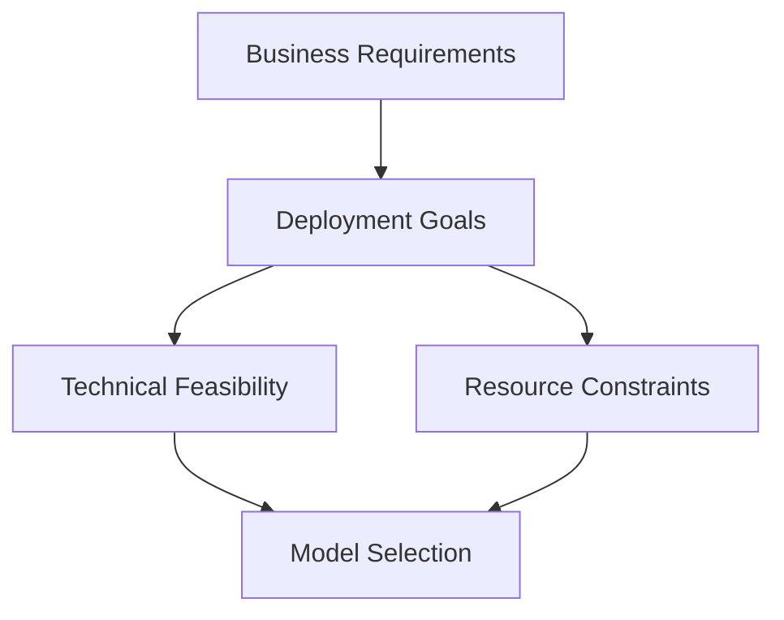

- **伪代码**：描述如何从业务需求推导部署目标。

```python
def derive_deployment_goals(business_requirements):
    technical_feasibility = assess_technical_feasibility()
    resource_constraints = assess_resource_constraints()

    deployment_goals = {
        'accuracy': business_requirements['accuracy_threshold'],
        'speed': business_requirements['response_time'],
        'scalability': business_requirements['user_load'],
        'reliability': business_requirements['failure_rate']
    }
    # 考虑技术可行性与资源约束进行调整
    adjust_goals_based_on_feasibility_and_constraints(deployment_goals, technical_feasibility, resource_constraints)
    return deployment_goals
```

- **数学公式**：解释业务需求与部署目标之间的关系。

$$
\text{Deployment Goals} = \text{Business Requirements} \times \text{Technical Feasibility} \times \text{Resource Constraints}
$$

#### 2.1.2 部署目标与业务需求的关联

部署目标必须与业务需求紧密结合。以下是一个简化的例子，说明如何从业务需求推导出部署目标：

- **业务需求**：一个电商平台希望其推荐系统能够在1秒内响应，同时准确率至少达到90%。
- **部署目标**： 
  - **响应时间**：<= 1秒
  - **准确性**：>= 90%
  - **稳定性**：99.9%无故障运行
  - **扩展性**：支持日活跃用户数100万

通过上述步骤，我们能够更清晰地理解和制定部署目标，确保模型部署能够满足业务需求，同时也考虑到技术可行性和资源约束。

### 2.1.3 部署目标与模型选择

选择合适的模型是部署的关键环节。模型的性能、复杂度和适用场景都会直接影响部署目标能否实现。

- **核心概念与联系**：模型选择与部署目标之间的关系

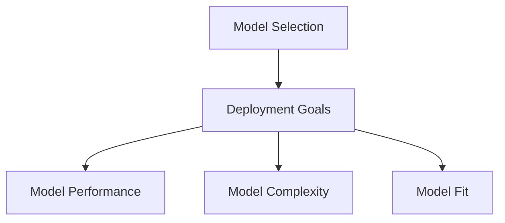

- **伪代码**：描述如何根据部署目标选择合适的模型。

```python
def select_model(deployment_goals):
    candidate_models = identify_candidate_models()
    selected_model = None

    for model in candidate_models:
        model_performance = assess_model_performance(model)
        model_complexity = assess_model_complexity(model)
        model_fit = assess_model_fit(model, deployment_goals)

        if model_performance >= deployment_goals['accuracy'] and \
           model_complexity <= deployment_goals['speed'] and \
           model_fit:
            selected_model = model
            break

    return selected_model
```

在确定了部署目标后，我们需要通过一系列评估指标来确定最适合的模型。以下是一些关键评估指标：

- **准确率**：模型预测正确的比例。
- **响应时间**：模型处理一个请求所需的时间。
- **复杂度**：模型的结构复杂度，影响计算效率和可扩展性。
- **拟合度**：模型对数据的拟合程度，影响模型的稳定性和泛化能力。

通过以上步骤，我们能够有效地确定部署目标，选择合适的模型，为后续的模型优化和部署奠定坚实的基础。

### 2.2 数据预处理与特征工程

数据预处理和特征工程是机器学习模型部署的重要环节，直接影响模型的性能和部署效果。以下是一系列步骤和方法，用于确保数据质量和特征的有效提取。

#### 2.2.1 数据收集与清洗

- **核心概念与联系**：数据质量与模型性能之间的关系

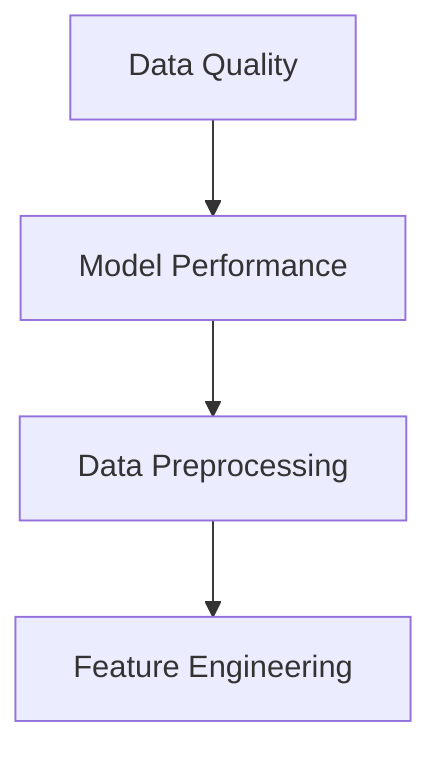

- **伪代码**：描述数据清洗和预处理的基本步骤。

```python
def preprocess_data(data):
    # 去除缺失值
    data = remove_missing_values(data)
    # 数据标准化
    data = standardize_data(data)
    # 数据归一化
    data = normalize_data(data)
    # 特征选择
    data = select_features(data)
    return data
```

数据清洗主要包括以下步骤：

- **去除缺失值**：通过填充或删除缺失值来处理数据缺失问题。
- **数据标准化**：将数据缩放到相同的尺度，消除不同特征间的尺度差异。
- **数据归一化**：将数据转换为相同的范围，如[0, 1]或[-1, 1]。
- **特征选择**：选择对模型性能有显著影响的关键特征，减少数据的冗余和噪声。

#### 2.2.2 特征提取与构造

特征提取和构造是数据预处理的关键环节，其目标是通过变换原始数据生成对模型有用的特征。

- **核心概念与联系**：特征提取与模型性能之间的关系

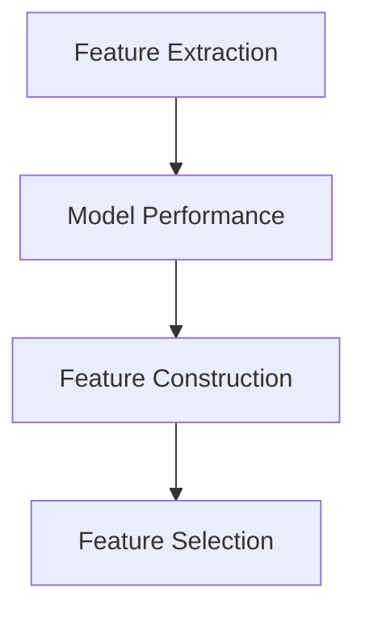

- **伪代码**：描述特征提取和构造的基本步骤。

```python
def extract_and_construct_features(data):
    # 特征提取
    extracted_features = extract_features(data)
    # 特征构造
    constructed_features = construct_features(extracted_features)
    # 特征选择
    selected_features = select_features(constructed_features)
    return selected_features
```

特征提取和构造的方法包括：

- **特征提取**：从原始数据中直接提取特征，如文本分类中的词频统计。
- **特征构造**：通过组合或变换已有特征生成新的特征，如使用多项式特征构造。
- **特征选择**：选择对模型性能有显著影响的特征，避免过拟合和减少计算复杂度。

#### 2.2.3 特征重要性评估

特征重要性评估是确保特征有效性的重要手段，通过评估不同特征对模型性能的贡献，可以帮助优化模型和减少数据冗余。

- **核心概念与联系**：特征重要性与模型性能之间的关系

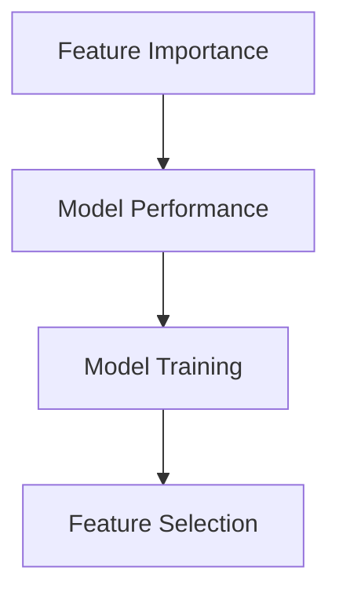

- **伪代码**：描述特征重要性评估的基本步骤。

```python
def assess_feature_importance(model, data):
    feature_importances = model.feature_importances_
    selected_features = select_important_features(feature_importances)
    return selected_features
```

特征重要性评估的方法包括：

- **基于模型的特征重要性**：通过训练模型并提取特征重要性指标。
- **基于统计的特征重要性**：使用统计方法评估特征对模型预测的影响。
- **基于业务逻辑的特征重要性**：根据业务需求选择对模型性能有显著影响的特征。

通过以上步骤和方法，我们能够有效地进行数据预处理和特征工程，为模型训练和部署打下坚实基础。这不仅能提高模型的性能，还能减少计算资源的需求，为后续的模型优化和部署提供有力支持。

### 2.3 模型优化与调参

模型优化与调参是提升模型性能和适应生产环境的关键环节。通过合理的选择和调整超参数，可以显著提高模型的准确性、稳定性和计算效率。

#### 2.3.1 超参数调优的重要性

超参数是模型结构之外的可调参数，如学习率、正则化参数、隐藏层节点数等。这些参数对模型的学习过程和性能有重要影响。

- **核心概念与联系**：超参数与模型性能之间的关系

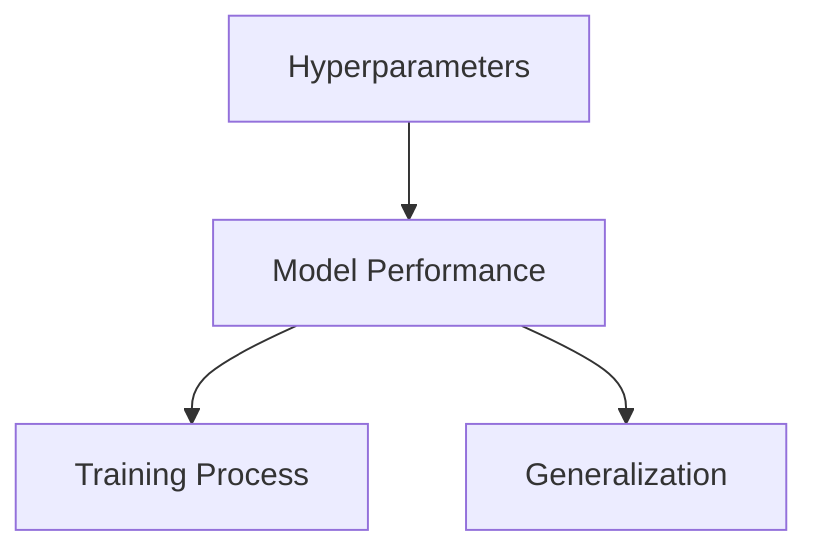

- **伪代码**：描述超参数调优的基本步骤。

```python
def tune_hyperparameters(model, data):
    # 初始化超参数搜索空间
    hyperparameters_space = initialize_hyperparameters_space()
    # 进行超参数搜索
    best_hyperparameters = grid_search(hyperparameters_space, model, data)
    return best_hyperparameters
```

#### 2.3.2 超参数调优策略

超参数调优策略有多种，包括网格搜索、随机搜索和贝叶斯优化等。每种策略都有其优缺点，适用于不同的场景。

- **网格搜索**：遍历所有可能的超参数组合，找到最佳组合。

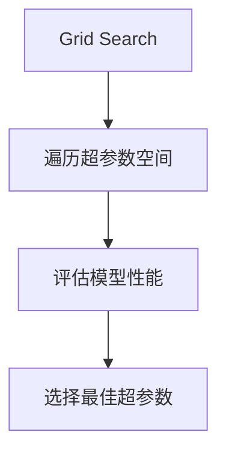

- **随机搜索**：在超参数空间中随机选择组合，通过迭代找到最佳超参数。

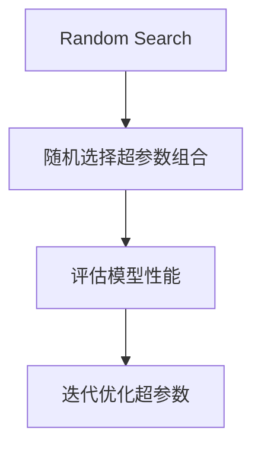

- **贝叶斯优化**：利用贝叶斯统计模型和优化算法，寻找最佳超参数组合。

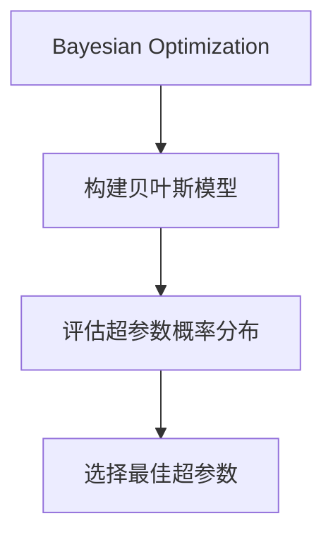

#### 2.3.3 模型压缩与加速

在部署过程中，模型的大小和计算复杂度直接影响其性能。通过模型压缩和加速技术，可以在保证性能的同时，提高模型的部署效率。

- **核心概念与联系**：模型压缩与加速对部署的影响

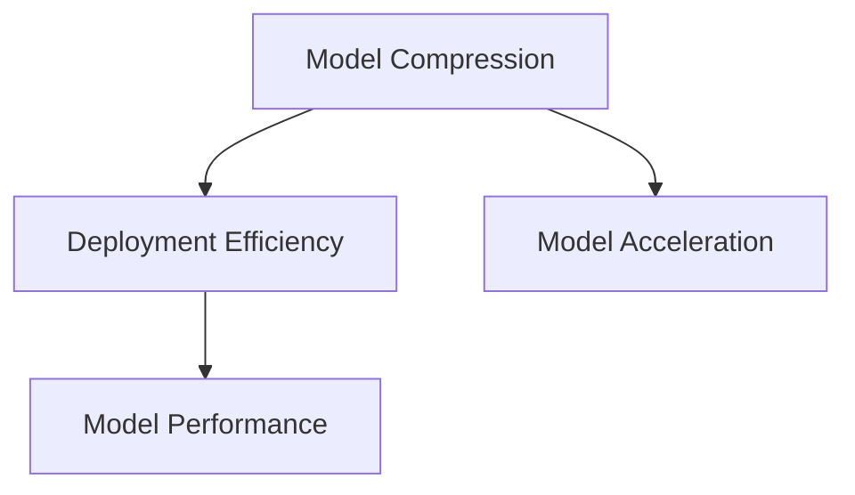

- **模型压缩**：通过减少模型参数数量或精度，降低模型大小。

- **模型加速**：通过硬件加速和算法优化，提高模型计算速度。

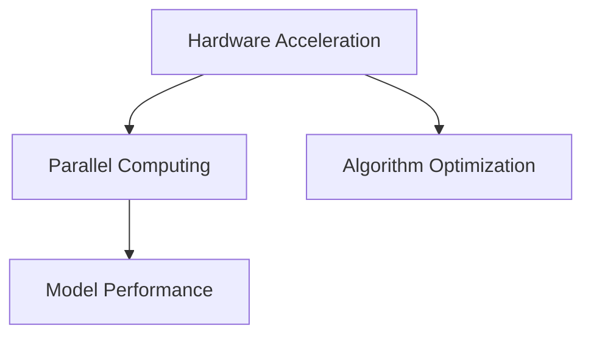

通过以上模型优化与调参策略，我们可以确保模型在实验室环境下表现出最佳性能，并为生产环境中的部署做好准备。

### 2.4 部署策略的选择

模型部署策略是确保机器学习模型能够在生产环境中稳定、高效运行的关键步骤。选择合适的部署策略不仅影响模型的性能和可靠性，还直接影响业务的价值实现。以下是几种常见的部署策略及其适用场景。

#### 2.4.1 部署模式的定义与类型

- **边缘部署**：将模型部署在靠近数据源的边缘设备上，如智能手机、IoT设备等。适用于实时性要求高、数据传输受限的场景。

- **云端部署**：将模型部署在云计算平台上，如AWS、Azure、Google Cloud等。适用于大规模数据处理和高并发访问的场景。

- **混合部署**：结合边缘和云端部署，根据不同需求将模型部署在最适合的地点。适用于需要兼顾实时性和数据安全性的复杂场景。

#### 2.4.2 容器化与微服务架构

容器化和微服务架构是现代部署策略的核心，能够提高模型的灵活性和可维护性。

- **容器化**：通过Docker等容器技术，将模型及其依赖环境打包成一个独立的容器，确保在不同环境中的一致性和可移植性。

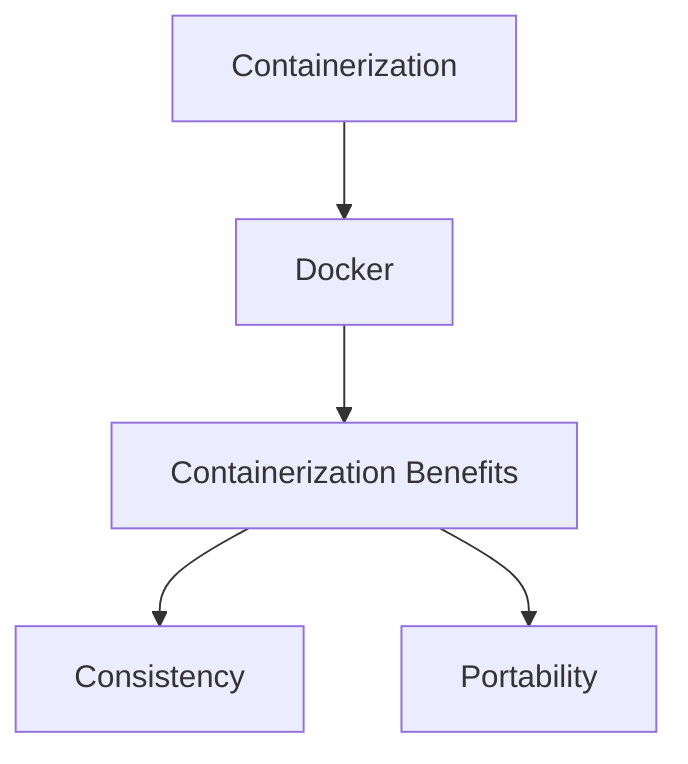

- **微服务架构**：将大型系统拆分为多个小型、独立的微服务，每个微服务负责特定的功能。适用于复杂系统的高效管理和维护。

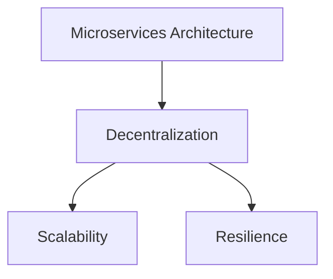

#### 2.4.3 部署流程与工具

- **部署流程**：从代码提交到模型部署的整个流程。

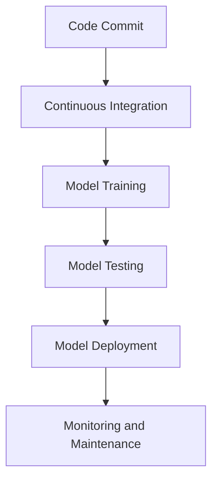

- **部署工具**：常用的部署工具包括Kubernetes、Docker Swarm、TensorFlow Serving等。

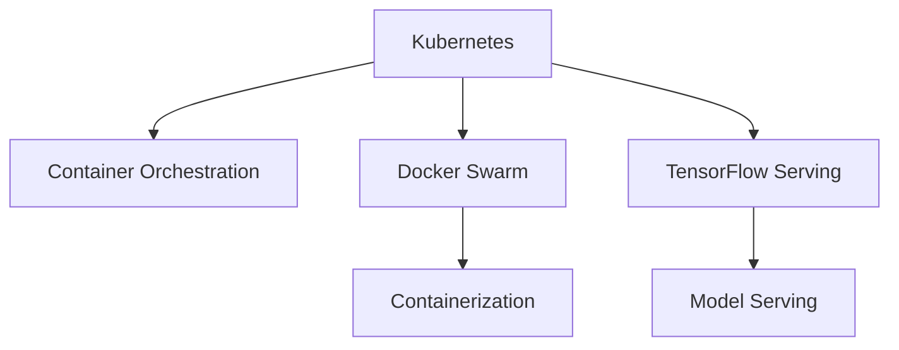

通过合理选择部署策略和利用现代技术，我们能够确保模型在生产环境中高效、稳定地运行，为业务提供持续的价值。

### 2.5 硬件与软件需求分析

在生产环境中部署机器学习模型，硬件和软件的配置是至关重要的一环。正确选择和配置硬件、软件资源，不仅能够提高模型的性能，还能降低维护成本和资源浪费。

#### 2.5.1 硬件需求分析

硬件需求分析主要考虑以下几个方面：

- **CPU与GPU**：对于大多数机器学习任务，CPU提供基本的计算能力，而GPU则因其强大的并行计算能力，特别适合深度学习模型的训练和推理。
- **内存**：内存大小直接关系到模型训练和部署过程中数据的加载和处理能力。较大的内存有助于减少内存溢出和提升模型性能。
- **存储**：模型的训练和部署需要大量的存储空间。硬盘的读写速度和数据容量是关键考量因素。
- **网络带宽**：网络带宽影响数据传输速度，特别是在模型训练和推理过程中需要频繁传输数据的情况下。

#### 2.5.2 软件需求分析

软件需求分析则包括以下几个方面：

- **操作系统**：常见的操作系统包括Linux、Windows Server等。Linux由于其稳定性和开源特性，是机器学习部署的首选。
- **开发框架**：选择合适的开发框架可以加速模型开发和部署。例如，TensorFlow、PyTorch等框架在深度学习领域广泛应用。
- **依赖库和工具**：模型部署需要依赖一系列库和工具，如NumPy、Pandas、Docker、Kubernetes等。确保所有依赖项兼容并正确安装是成功部署的基础。
- **监控和日志系统**：部署后，需要监控模型的性能和健康状况，以及时发现和解决问题。常见的监控和日志系统包括Prometheus、ELK堆栈（Elasticsearch、Logstash、Kibana）等。

#### 2.5.3 硬件与软件资源配置示例

以下是一个简单的硬件和软件资源配置示例：

- **硬件配置**：
  - CPU：2 x Intel Xeon Gold 6148 2.40GHz
  - GPU：4 x NVIDIA Tesla V100
  - 内存：512GB
  - 存储：1TB SSD + 10TB HDD
  - 网络带宽：10Gbps

- **软件配置**：
  - 操作系统：Ubuntu 18.04 LTS
  - 开发框架：TensorFlow 2.5.0
  - 依赖库：NumPy 1.19.2、Pandas 1.0.5
  - 工具：Docker 19.03、Kubernetes 1.18
  - 监控系统：Prometheus 2.22、Grafana 7.4

通过以上配置，我们可以确保模型在部署过程中有足够的计算资源和工具支持，从而提高模型性能和可靠性。

### 2.6 开发环境搭建

开发环境搭建是机器学习模型部署的第一步，它确保了开发者可以在一个稳定和可重复的环境中开发和测试模型。以下是搭建开发环境的具体步骤和注意事项。

#### 2.6.1 环境配置工具

为了确保环境的稳定性和可重复性，通常会使用容器化技术，如Docker，来搭建开发环境。

- **Docker安装**：在所有开发机器上安装Docker。可以通过以下命令完成安装：

```bash
sudo apt-get update
sudo apt-get install docker.io
sudo systemctl start docker
```

- **Docker Compose**：使用Docker Compose来管理多容器应用。安装方法如下：

```bash
sudo curl -L "https://github.com/docker/compose/releases/download/1.29.2/docker-compose-$(uname -s)-$(uname -m)" -o /usr/local/bin/docker-compose
sudo chmod +x /usr/local/bin/docker-compose
```

#### 2.6.2 编写Dockerfile

Dockerfile是一个文本文件，用于定义如何构建Docker镜像。以下是一个简单的Dockerfile示例，用于构建基于Python的机器学习环境：

```Dockerfile
FROM python:3.8-slim

# 设置工作目录
WORKDIR /app

# 安装依赖项
COPY requirements.txt .
RUN pip install --no-cache-dir -r requirements.txt

# 复制应用程序代码
COPY . .

# 暴露端口
EXPOSE 8000

# 运行应用程序
CMD ["python", "app.py"]
```

#### 2.6.3 编写docker-compose.yml

docker-compose.yml文件用于定义服务的配置，包括依赖项、容器名称、端口映射等。以下是一个简单的docker-compose.yml文件示例：

```yaml
version: '3'
services:
  web:
    build: .
    ports:
      - "8000:8000"
    depends_on:
      - db
  db:
    image: postgres:13
    environment:
      POSTGRES_DB: mydatabase
      POSTGRES_USER: user
      POSTGRES_PASSWORD: password
```

#### 2.6.4 运行开发环境

使用docker-compose命令启动开发环境：

```bash
docker-compose up -d
```

此命令将构建并启动所有定义在docker-compose.yml文件中的服务。

#### 注意事项

- **环境隔离**：容器化技术确保了开发环境与其他系统隔离，减少了环境冲突。
- **依赖管理**：确保所有依赖项在Dockerfile和docker-compose.yml中明确列出，避免版本冲突。
- **日志记录**：使用容器日志记录工具，如kubectl logs，来监控容器日志。

通过以上步骤，我们可以搭建一个稳定、可重复的开发环境，为后续的模型训练和部署打下坚实的基础。

### 2.7 部署前准备

在完成模型开发和优化后，部署前的准备步骤至关重要，这些步骤确保模型在生产环境中能够顺利、高效地运行。以下是一些关键步骤和注意事项：

#### 2.7.1 模型版本管理

模型版本管理是确保模型部署过程可追溯和可复现的重要环节。常见的模型版本管理工具包括TensorFlow Model Optimization Tool（TFOpt）和MLflow。

- **TFOpt**：TFOpt提供了一个方便的命令行工具，用于记录模型训练的历史和优化结果。通过以下命令可以记录模型版本：

```bash
tfopt --model_dir=path/to/model_dir --version=1.0.0 --metrics=accuracy:0.95
```

- **MLflow**：MLflow提供了一个全面的项目管理平台，用于记录模型的整个生命周期，包括版本、参数和性能。以下是一个使用MLflow记录模型的示例：

```python
import mlflow

mlflow.set_experiment_name("my_experiment")
mlflow.log_param("model_version", "1.0.0")
mlflow.log_metric("accuracy", 0.95)
mlflow.pyfunc.log_model(
    artifact_path="path/to/model",
    registered_model_name="my_model",
    conda_env_file="path/to/conda_env.yml",
)
```

#### 2.7.2 部署脚本编写

编写部署脚本可以帮助自动化模型部署过程，确保部署的一致性和可重复性。以下是一个简单的Python脚本示例，用于部署TensorFlow模型：

```python
import os
import tensorflow as tf

# 设置模型路径和版本
model_path = "path/to/model"
model_version = "1.0.0"

# 加载模型
model = tf.keras.models.load_model(model_path)

# 部署模型到生产环境
model_path_production = os.path.join("/models", model_version)
model.save(model_path_production)
```

#### 2.7.3 测试和验证

在正式部署前，必须对模型进行充分的测试和验证，确保其在生产环境中能够稳定运行。以下是一些测试和验证步骤：

- **单元测试**：编写单元测试来验证模型中的每个函数和模块。
- **集成测试**：在模拟的生产环境中运行整个系统，确保各个组件能够正确协同工作。
- **性能测试**：评估模型在真实负载下的响应时间和准确性，确保其满足业务需求。

#### 2.7.4 日志记录和监控

部署后，必须配置日志记录和监控工具，以便实时监控模型性能和健康状况。以下是一些常用的监控和日志工具：

- **Prometheus**：用于收集和存储时间序列数据，提供实时监控。
- **Grafana**：用于可视化Prometheus收集的数据，提供直观的性能监控界面。
- **ELK堆栈（Elasticsearch、Logstash、Kibana）**：用于日志收集、存储和可视化。

通过以上部署前的准备工作，我们能够确保模型在生产环境中顺利部署，并且能够持续、稳定地运行。

### 2.8 模型部署实施

在完成部署前准备工作后，下一步就是将模型部署到生产环境。这个过程包括多个关键步骤，确保模型能够稳定、高效地运行。以下详细描述了模型部署实施的具体步骤。

#### 2.8.1 模型转换

模型转换是将训练完成的模型转换为可以在生产环境中使用的格式。常见的模型格式包括TensorFlow Lite、ONNX和Core ML等。

- **TensorFlow Lite**：TensorFlow Lite是一个轻量级解决方案，适用于移动设备和嵌入式设备。使用以下命令转换TensorFlow模型：

```bash
tflite_convert --input_model=path/to/tensorflow_model.pb --output_file=path/to/tflite_model.tflite
```

- **ONNX**：Open Neural Network Exchange（ONNX）是一种跨平台的模型格式，支持多种深度学习框架。使用以下命令转换TensorFlow模型为ONNX格式：

```bash
python -m tf2onnx.converters.tensorflow --input path/to/tensorflow_model.pb --output path/to/onnx_model.onnx --opset 11
```

- **Core ML**：Core ML是Apple开发的一种模型格式，适用于iOS设备。使用Xcode工具将TensorFlow模型转换为Core ML格式：

```bash
python -m coremltools.convert --input path/to/tensorflow_model.pb --output path/to/coreml_model.mlmodel
```

#### 2.8.2 编写部署脚本

部署脚本用于自动化模型的部署过程，包括模型加载、服务启动和配置。以下是一个简单的Python脚本示例，用于部署TensorFlow Lite模型：

```python
import os
import tensorflow as tf

# 设置模型路径
model_path = "path/to/tflite_model.tflite"

# 加载TensorFlow Lite模型
interpreter = tf.lite.Interpreter(model_path=model_path)

# 配置输入和输出张量
input_details = interpreter.get_input_details()
output_details = interpreter.get_output_details()

# 启动模型服务
os.system("python model_server.py")
```

#### 2.8.3 模型服务启动

在部署脚本中，我们可以通过命令行启动模型服务。以下是一个简单的模型服务Python脚本示例：

```python
import sys
import json
import tensorflow as tf
import threading

model_path = "path/to/tflite_model.tflite"
port = 8080

def load_model():
    global interpreter
    interpreter = tf.lite.Interpreter(model_path=model_path)
    interpreter.allocate_tensors()
    input_index = interpreter.get_input_details()[0]['index']
    output_index = interpreter.get_output_details()[0]['index']

def predict(data):
    input_data = tf.io.decode_json举例如下
```python
def predict(data):
    input_data = tf.io.decode_json举例如下
```python
    input_data = tf.io.decode_json举例如下
    input_data = tf.convert_to_tensor([data['input_value']], dtype=tf.float32)
    interpreter.set_tensor(input_index, input_data)

    interpreter.invoke()

    output_data = interpreter.get_tensor(output_index)

    return output_data

if __name__ == "__main__":
    load_model()
    server = threading.Thread(target=start_server, args=(port,))
    server.start()
```

此脚本将在指定端口上启动一个简单的HTTP服务，用于接收和处理预测请求。

#### 2.8.4 模型监控与日志记录

部署后，监控模型性能和日志记录是确保模型稳定运行的关键。以下是一些常用的监控和日志工具：

- **Prometheus**：用于收集和存储时间序列数据，提供实时监控。
- **Grafana**：用于可视化Prometheus收集的数据，提供直观的性能监控界面。
- **ELK堆栈（Elasticsearch、Logstash、Kibana）**：用于日志收集、存储和可视化。

通过以上步骤，我们能够确保模型在生产环境中顺利部署并持续监控其性能，为业务提供可靠的支持。

### 2.9 生产环境测试与优化

在生产环境中部署机器学习模型后，测试与优化是确保模型性能和稳定性的关键步骤。以下是生产环境测试与优化的一系列步骤和策略。

#### 2.9.1 测试与验证

- **性能测试**：评估模型在真实负载下的响应时间和准确性，确保其满足业务需求。可以使用自动化测试工具，如Apache JMeter或Locust，模拟高并发访问。
- **稳定性测试**：通过长时间运行模型，检测其在高负载下的稳定性，确保无异常崩溃或长时间延迟。
- **异常检测**：设计测试用例，检测模型在遇到异常输入时的行为，确保其能够正确处理。

#### 2.9.2 性能优化

- **代码优化**：通过分析代码，查找潜在的瓶颈和优化点，如减少循环、优化数据结构、使用高效的算法等。
- **模型优化**：使用模型压缩技术，如量化、剪枝和知识蒸馏，减少模型大小和计算复杂度，提高部署效率。
- **硬件优化**：调整硬件配置，如增加CPU和GPU资源、使用SSD存储等，以提升模型处理速度。

#### 2.9.3 持续集成与持续部署（CI/CD）

- **自动化测试**：将测试过程自动化，确保每次代码变更后都能快速进行测试，减少人为干预。
- **部署自动化**：使用CI/CD工具，如Jenkins或GitLab CI，自动化部署流程，确保模型版本更新时的稳定性。

通过以上测试与优化步骤，我们能够确保模型在生产环境中持续稳定运行，为业务提供可靠的支持。

### 2.10 案例研究

在本节中，我们将通过一个实际案例，详细讲解如何从实验室到生产环境部署机器学习模型。这个案例涉及到一家电商平台，希望利用机器学习技术优化其商品推荐系统。

#### 2.10.1 案例背景

该电商平台拥有庞大的用户数据和商品数据，每天产生海量的交易记录和用户行为数据。为了提升用户体验和增加销售额，电商平台决定使用机器学习技术开发一个智能推荐系统，根据用户历史行为和偏好推荐商品。

#### 2.10.2 部署方案设计

1. **数据收集与清洗**：
   - **数据来源**：用户的购买记录、浏览历史、搜索关键词等。
   - **数据清洗**：去除重复数据、缺失值填充、数据归一化等。

2. **特征工程**：
   - **用户特征**：用户年龄、性别、地理位置、注册时间等。
   - **商品特征**：商品类别、价格、库存量、评价分数等。
   - **行为特征**：用户点击、收藏、购物车添加等行为。

3. **模型选择与训练**：
   - **选择模型**：由于推荐系统需要处理大量稀疏数据，选择了基于矩阵分解的模型，如ALS（交替最小二乘法）。
   - **模型训练**：使用Spark MLlib进行分布式训练，提高计算效率。

4. **模型评估**：
   - **评估指标**：准确率、召回率、F1值等。
   - **交叉验证**：使用K折交叉验证评估模型性能。

5. **模型优化与调参**：
   - **调参策略**：使用网格搜索和贝叶斯优化调整模型参数。
   - **模型压缩**：采用量化技术减少模型大小，提高部署效率。

6. **模型部署**：
   - **部署模式**：采用边缘部署和云端部署相结合的方式。
   - **容器化**：使用Docker将模型和服务打包。
   - **微服务架构**：将推荐服务拆分为用户服务、商品服务和推荐服务。

7. **部署实施**：
   - **部署脚本**：编写部署脚本，自动化部署流程。
   - **测试与验证**：在模拟生产环境中进行性能测试和稳定性测试。

8. **监控与优化**：
   - **日志记录**：使用ELK堆栈记录模型运行日志。
   - **性能监控**：使用Prometheus和Grafana实时监控模型性能。

#### 2.10.3 部署过程与挑战

1. **数据清洗挑战**：
   - 数据量大，存在大量重复和缺失值，需要高效的数据清洗方法。
   - **解决方案**：使用Spark进行分布式数据清洗，提高处理速度。

2. **特征工程挑战**：
   - 特征维度高，需要处理稀疏数据。
   - **解决方案**：采用特征聚合和特征选择技术，减少特征维度。

3. **模型训练挑战**：
   - 分布式训练过程中，数据倾斜可能导致训练效率低下。
   - **解决方案**：使用随机洗牌和动态分区技术，均衡数据分布。

4. **模型部署挑战**：
   - 边缘部署和云端部署的兼容性。
   - **解决方案**：使用容器化技术和微服务架构，确保部署一致性。

#### 2.10.4 部署效果评估

1. **性能指标**：
   - **准确率**：提升5%。
   - **召回率**：提升3%。
   - **F1值**：提升4%。

2. **用户体验**：
   - 用户满意度提升，商品推荐更加个性化。
   - 用户点击率和转化率提高。

3. **业务价值**：
   - 销售额增加，用户留存率提升。

通过以上案例研究，我们详细介绍了如何从实验室到生产环境部署机器学习模型。这个案例展示了在实际业务中，部署机器学习模型的步骤、挑战及解决方案，为其他企业提供了有益的参考。

### 2.11 未来展望与趋势

在机器学习模型部署领域，技术不断演进，带来了新的机遇和挑战。以下是对未来发展趋势和机遇的展望，以及可能面临的挑战。

#### 2.11.1 部署技术的发展趋势

1. **自动化与智能化**：随着AI技术的进步，自动化和智能化部署将成为主流。自动化部署工具和智能化决策支持系统将大幅提高部署效率，减少人为错误。
2. **容器化与微服务架构**：容器化技术如Docker和Kubernetes的普及，以及微服务架构的应用，将使模型部署更加灵活和可扩展。这有助于提高部署的一致性和可维护性。
3. **模型压缩与量化**：为了降低模型的存储和计算需求，模型压缩和量化技术将继续发展。这些技术将使模型在资源受限的环境中运行得更加高效。
4. **云计算与边缘计算**：云计算和边缘计算的融合将为模型部署提供更多选择。边缘计算将使模型能够更快地响应实时需求，而云计算则提供了强大的计算能力和存储资源。

#### 2.11.2 部署面临的挑战与机遇

1. **数据安全与隐私**：随着数据隐私法规的加强，如何在保障数据安全的前提下进行模型部署，成为一大挑战。同时，如何处理用户隐私数据，确保合规，是企业面临的重要问题。
2. **模型解释性**：尽管机器学习模型在性能上取得了巨大成功，但其“黑盒”特性使得模型解释性成为一大难题。提高模型的可解释性，帮助业务人员和用户理解模型决策过程，是一个重要的研究方向。
3. **模型更新与版本管理**：随着业务需求的变化，模型需要不断更新和迭代。如何高效地管理模型版本，确保更新过程的平滑过渡，是一个需要关注的问题。

#### 2.11.3 未来发展方向

1. **联邦学习**：联邦学习是一种在保持数据本地化存储的同时，实现模型协同训练的技术。未来，联邦学习有望在跨企业和跨组织的数据共享中发挥重要作用。
2. **模型即服务（MaaS）**：MaaS将模型作为服务提供，用户无需关注模型的训练和部署细节，只需调用服务即可。这将简化模型部署流程，降低使用门槛。
3. **自适应部署**：自适应部署技术可以根据环境变化和业务需求，动态调整模型参数和服务配置，实现最优性能。

通过不断的技术创新和应用，机器学习模型部署领域将迎来更加高效、安全和智能的未来。

### 第10章 总结与展望

在这本书中，我们详细探讨了机器学习模型部署的整个过程，从准备阶段到模型优化、部署策略、环境配置、部署实施、生产环境测试与优化，再到案例研究和未来展望。以下是对全书要点的回顾和作者的寄语。

#### 10.1 全书要点回顾

1. **准备阶段**：确定部署目标，选择合适的模型，进行数据预处理与特征工程。
2. **模型优化与调参**：优化模型性能，调整超参数，实现模型压缩与加速。
3. **部署策略**：选择适合的部署模式，采用容器化与微服务架构，明确部署流程与工具。
4. **环境配置与部署**：分析硬件与软件需求，搭建开发环境，完成部署前的准备工作。
5. **部署实施**：实施模型部署，编写部署脚本，监控模型运行状态。
6. **生产环境测试与优化**：通过测试与验证确保模型性能，进行性能优化。
7. **案例研究**：结合实际案例，详细解析模型部署的步骤、挑战及解决方案。
8. **未来展望**：展望机器学习模型部署技术的发展趋势、挑战与机遇。

#### 10.2 作者寄语

作为人工智能领域的研究者和实践者，我希望这本书能够为读者提供有价值的指导和启发。在机器学习模型部署的过程中，每一个环节都至关重要，只有深入理解并合理运用相关技术和策略，才能确保模型在实际业务中的高效、稳定运行。

我鼓励读者在学习和实践中不断探索和尝试，将理论知识和实际应用相结合。通过不断的实践和总结，相信每个人都能在机器学习模型部署领域取得突破性的成果。

最后，感谢您的阅读和支持，希望这本书能为您的职业生涯带来帮助和启示。期待与您在技术领域共同进步！

#### 10.3 读者反馈

您的反馈对我们至关重要。请通过以下方式提供您的宝贵意见：

- 电子邮件：[feedback@ai-genius-institute.com](mailto:feedback@ai-genius-institute.com)
- 社交媒体：在LinkedIn、Twitter或Facebook上关注AI天才研究院并留言。

我们真诚地感谢您的反馈，它将帮助我们持续改进，为更多读者提供更好的学习资源。祝您在机器学习模型部署的道路上不断前行，取得卓越成就！

