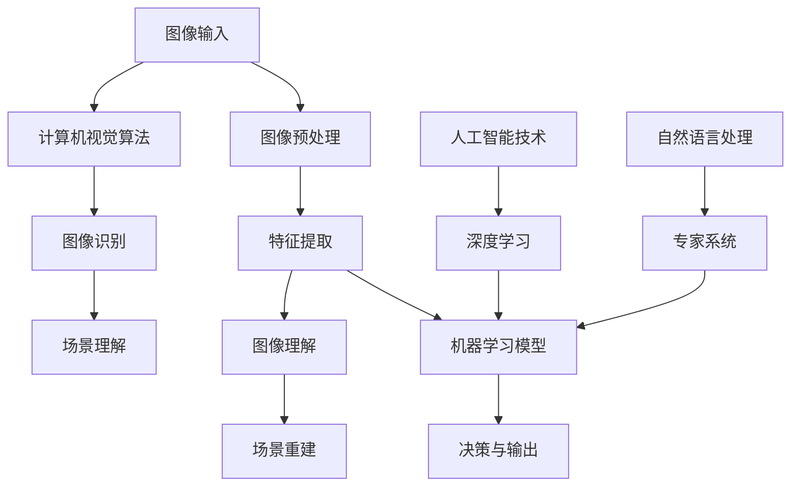

                 

## 引言

随着人工智能技术的快速发展，机器视觉作为其核心组成部分，正迅速改变着我们的世界。从工业自动化到医疗诊断，从自动驾驶到安防监控，机器视觉的应用场景越来越广泛。作为AI的“眼睛”，机器视觉技术正在为人工智能提供强有力的感知能力和决策支持。

本文旨在深入探讨机器视觉技术的核心概念、发展历程、算法原理、数学模型、实际项目以及未来展望。通过这一系列的分析和探讨，我们希望能够为读者提供一个全面而系统的机器视觉技术概述。

文章的结构如下：

1. **核心概念与联系**：介绍机器视觉的基础概念，并展示其与图像处理、计算机视觉和AI之间的联系。
2. **历史与发展**：回顾机器视觉技术的发展历程，从早期图像处理技术到现代深度学习应用。
3. **核心算法原理讲解**：详细讲解卷积神经网络（CNN）、感知机、支持向量机（SVM）等核心算法，并使用伪代码进行描述。
4. **数学模型和公式**：介绍与机器视觉相关的数学模型，如感知机、SVM、深度学习中的损失函数，并用LaTeX格式展示。
5. **项目实战**：分析实际机器视觉项目，如人脸识别和物体检测，介绍项目的开发环境搭建、源代码实现和代码解读。
6. **应用领域**：探讨机器视觉在自动驾驶、医疗诊断等领域的应用，并提供案例研究。
7. **未来展望**：讨论机器视觉技术的未来发展趋势和潜在影响。
8. **附录**：提供实用的开源工具、在线课程等资源。

通过以上内容的逐步分析，我们希望能够帮助读者深入理解机器视觉技术的原理、应用和发展方向，为未来的研究和实践提供指导。

## 关键词

- 机器视觉
- 图像处理
- 计算机视觉
- 深度学习
- 卷积神经网络（CNN）
- 感知机
- 支持向量机（SVM）
- 人脸识别
- 物体检测
- 自动驾驶
- 医疗诊断

## 摘要

本文将全面探讨机器视觉技术，从基础概念到核心算法，再到实际应用和未来展望。首先，我们将介绍机器视觉的核心概念，并展示其与图像处理、计算机视觉和AI之间的联系。接着，回顾机器视觉技术的发展历程，从早期的图像处理技术到现代的深度学习应用。随后，我们详细讲解卷积神经网络（CNN）、感知机、支持向量机（SVM）等核心算法，并使用伪代码进行描述。此外，还将介绍与机器视觉相关的数学模型，如感知机、SVM、深度学习中的损失函数。文章通过实际项目案例分析，如人脸识别和物体检测，展示机器视觉技术的实际应用。最后，我们探讨机器视觉在自动驾驶、医疗诊断等领域的应用，并提供未来发展趋势和潜在影响的讨论。通过这一系列内容，本文旨在为读者提供一个全面而系统的机器视觉技术概述。

### 第1章：核心概念与联系

机器视觉是一种通过计算机对图像或视频进行自动分析和解释的技术，它使得计算机能够“看到”和理解周围的世界。在人工智能（AI）的快速发展中，机器视觉起到了关键作用，被认为是AI的“眼睛”。这一章节将详细介绍机器视觉的基础概念，并探讨其与图像处理、计算机视觉和人工智能之间的联系。

#### 1.1 机器视觉的基础概念

**图像处理**：图像处理是机器视觉的核心组成部分，它涉及对图像进行增强、变换、分割、滤波等一系列操作。图像处理旨在改善图像的质量，使其更适合后续的分析。

**计算机视觉**：计算机视觉是使计算机能够像人类一样理解、解释和操作视觉信息的技术。它包括图像识别、图像理解、场景重建、动作识别等多个方面。

**人工智能**：人工智能是模拟人类智能行为的一系列技术的集合，包括机器学习、自然语言处理、专家系统等。在机器视觉中，人工智能主要用于图像和视频的分析和理解。

**机器视觉与图像处理、计算机视觉、人工智能的联系**：

- **图像处理**：图像处理是计算机视觉的基础，通过图像处理技术，可以获得更清晰的图像，从而提高后续分析的准确性。
- **计算机视觉**：计算机视觉是基于图像处理技术进一步发展的，它通过算法和模型对图像进行理解和解释。
- **人工智能**：人工智能为机器视觉提供了强大的分析工具和算法，如深度学习、机器学习等，使得机器视觉能够进行更加复杂和智能化的任务。

#### 1.2 Mermaid流程图：机器视觉的技术架构

为了更直观地展示机器视觉的技术架构，我们可以使用Mermaid流程图来描绘各个核心组件及其之间的联系。



**解释**：

- **图像输入**：机器视觉系统的输入是图像或视频流。
- **图像预处理**：对图像进行预处理，如滤波、增强、缩放等，以提高后续分析的准确性。
- **特征提取**：从图像中提取具有区分性的特征，为后续的机器学习模型提供输入。
- **机器学习模型**：利用深度学习、机器学习等技术对提取的特征进行训练，形成模型。
- **决策与输出**：基于训练好的模型对图像进行分析和解释，输出相应的结果。
- **计算机视觉算法**：包括图像识别、图像理解、场景重建等算法，用于对图像进行理解和解释。
- **图像理解**：通过算法对图像中的物体、场景进行理解和分析。
- **场景理解**：对图像中的场景进行三维重建和分析。
- **人工智能技术**：包括深度学习、自然语言处理、专家系统等，为机器视觉提供强大的分析工具。

通过上述内容，我们建立了机器视觉技术的核心概念及其与图像处理、计算机视觉、人工智能之间的联系，为后续章节的深入探讨奠定了基础。

### 第2章：历史与发展

机器视觉技术的发展历程可谓波澜壮阔，从早期的图像处理技术到现代的深度学习应用，每一次技术突破都为机器视觉带来了革命性的变革。这一章节将详细回顾机器视觉技术的发展历程，探讨从早期图像处理技术到现代深度学习应用的演进过程，以及其中的里程碑事件和关键贡献。

#### 2.1 机器视觉技术的发展历程

**早期图像处理技术**：

- **20世纪60年代**：图像处理技术开始萌芽，主要研究图像的增强、滤波和分割等基本操作。此时，计算机算力有限，图像处理技术主要集中在简单算法上。
- **20世纪70年代**：图像处理技术逐渐成熟，出现了诸如傅里叶变换、小波变换等有效的图像处理方法，为后续的计算机视觉奠定了基础。

**计算机视觉的早期探索**：

- **20世纪80年代**：计算机视觉开始进入研究阶段，主要研究目标检测、人脸识别、场景重建等。此时，图像处理技术已相对成熟，研究者开始尝试将图像处理技术与机器学习相结合，以提高图像理解的准确性。
- **20世纪90年代**：特征提取技术如SIFT（尺度不变特征变换）和SURF（加速稳健特征）的出现，使得计算机视觉在特征提取和匹配方面取得了显著进展。同时，机器学习算法如支持向量机（SVM）和神经网络的应用，进一步提升了计算机视觉的性能。

**深度学习与机器视觉的融合**：

- **21世纪初**：深度学习的兴起，为机器视觉带来了革命性的变化。卷积神经网络（CNN）作为一种强大的深度学习模型，被广泛应用于图像识别和分类任务中，取得了前所未有的准确率。
- **2012年**：AlexNet在ImageNet竞赛中取得显著成绩，标志着深度学习在图像识别领域的突破。此后，深度学习技术迅速发展，应用于各种计算机视觉任务中，如目标检测、语义分割、姿态估计等。

**里程碑事件与关键贡献**：

- **Hough变换**：20世纪70年代，Hough变换被提出，用于图像中的线条检测和形状识别。它通过将图像中的点映射到参数空间，实现了对线条和形状的精确检测，是计算机视觉中的重要算法之一。
- **SIFT与SURF算法**：2004年和2006年，SIFT和SURF算法分别被提出，它们在特征提取和匹配方面取得了巨大成功，被广泛应用于图像识别和场景重建中。
- **深度学习的突破**：2012年，AlexNet在ImageNet竞赛中的优异表现，标志着深度学习在图像识别领域的重大突破。此后，以CNN为代表的深度学习模型在计算机视觉中取得了广泛应用，推动了机器视觉技术的快速发展。

#### 2.2 里程碑事件与关键贡献

- **Hough变换**：Hough变换通过将图像中的点映射到参数空间，实现了对线条和形状的精确检测，被广泛应用于图像识别和场景重建中。它的核心思想是将图像中的每个点与线条的参数进行关联，从而实现线条的检测。Hough变换的成功不仅推动了计算机视觉技术的发展，也为后续的形状识别和图像理解奠定了基础。
- **SIFT与SURF算法**：SIFT和SURF算法在特征提取和匹配方面取得了巨大成功。SIFT通过多尺度空间和尺度不变特征，实现了对图像中关键点的精确提取。SURF则通过利用快速傅里叶变换，在保持高效性的同时，保持了SIFT的特征提取精度。这两种算法的成功应用，使得计算机视觉在图像识别和场景重建中取得了显著进展。
- **深度学习的突破**：2012年，AlexNet在ImageNet竞赛中的优异表现，标志着深度学习在图像识别领域的重大突破。AlexNet通过多层卷积神经网络，实现了对图像的自动特征提取和分类，大幅度提升了图像识别的准确率。此后，以CNN为代表的深度学习模型在计算机视觉中取得了广泛应用，推动了机器视觉技术的快速发展。

通过回顾机器视觉技术的发展历程，我们可以看到，每一次技术突破都为机器视觉带来了巨大的变革。从早期的图像处理技术到现代的深度学习应用，机器视觉技术不断发展，逐渐成为人工智能领域中的重要组成部分。

### 第3章：核心算法原理讲解

在机器视觉技术中，核心算法起着至关重要的作用。这些算法包括卷积神经网络（CNN）、感知机、支持向量机（SVM）等。本章将详细讲解这些算法的原理，并通过伪代码展示其实现过程，以便读者更好地理解这些算法的核心思想。

#### 3.1 卷积神经网络（CNN）

卷积神经网络（CNN）是一种深度学习模型，特别适用于处理图像数据。CNN的核心思想是通过卷积操作和池化操作，从图像中提取层次化的特征，从而实现图像的分类、检测和分割等任务。

**3.1.1 CNN的基本结构**

CNN的基本结构包括输入层、卷积层、池化层和全连接层。每个层次都有其特定的功能。

- **输入层**：输入层接收图像数据，图像数据通常是一个三维的张量，其维度为（高度，宽度，通道数）。
- **卷积层**：卷积层通过卷积操作提取图像的特征。卷积层包含多个卷积核，每个卷积核可以提取图像中的一部分特征。卷积操作可以表示为：

  $$ \text{输出} = \text{卷积核} * \text{输入} + \text{偏置} $$

  其中，*表示卷积操作，$ \text{输出}$ 和 $ \text{输入}$ 分别为卷积层的输出和输入。

- **池化层**：池化层通过最大池化或平均池化操作，将卷积层输出的特征进行压缩，减少数据维度，从而减少模型的复杂性。

- **全连接层**：全连接层将卷积层和池化层提取的特征进行整合，并将其映射到分类或检测结果。

**3.1.2 CNN的工作原理**

CNN的工作原理可以总结为以下几个步骤：

1. **输入图像**：将图像输入到CNN的输入层。
2. **卷积操作**：通过卷积层中的卷积核，对图像进行卷积操作，提取图像的特征。
3. **池化操作**：通过池化层对卷积层的输出进行池化操作，减少特征维度。
4. **全连接层**：将池化层输出的特征通过全连接层进行整合，最终输出分类或检测的结果。

**3.1.3 CNN的伪代码实现**

以下是一个简单的CNN模型的伪代码实现：

```python
# 定义CNN模型
class CNNModel:
    def __init__(self):
        # 初始化卷积层、池化层和全连接层的参数
        pass

    def forward(self, x):
        # 前向传播
        # x: 输入图像，维度为（高度，宽度，通道数）
        conv_output = conv2d(x, self.conv_weights) + self.conv_bias
        pool_output = max_pool(conv_output)
        fc_output = fully_connected(pool_output, self.fc_weights, self.fc_bias)
        return fc_output

    def backward(self, d_output):
        # 反向传播
        # d_output: 输出的梯度，维度为（分类数）
        d_fc_input = d_output * (self.fc_weights.T)
        d_pool_input = d_fc_input * (1 / self.pool_size)
        d_conv_input = d_pool_input * (self.conv_weights.T)
        return d_conv_input
```

**3.2 特征提取与分类**

特征提取是机器视觉中的一个重要环节，它涉及从图像中提取具有区分性的特征，以便后续的分类或检测任务。常用的特征提取算法包括感知机和SVM等。

**3.2.1 感知机算法**

感知机算法是一种简单的二分类模型，它通过找到一个最佳分割超平面，将不同类别的数据点分开。感知机的核心思想是最大化正样本和负样本之间的几何距离。

**3.2.2 支持向量机（SVM）**

支持向量机（SVM）是一种强大的分类算法，它通过找到一个最优分割超平面，使得不同类别的数据点之间的间隔最大化。SVM的核心思想是使用核函数将低维数据映射到高维空间，从而实现更好的分类效果。

**3.2.3 多层感知机与深度学习**

多层感知机（MLP）是一种基于全连接层的神经网络，它可以用来实现复杂的分类和回归任务。深度学习是多层感知机的一种扩展，通过增加网络的层数，可以提取更高层次的特征，从而实现更复杂的任务。

通过本章对卷积神经网络（CNN）、感知机、支持向量机（SVM）等核心算法的详细讲解，我们希望能够帮助读者深入理解这些算法的原理，为后续的实践和研究提供基础。

### 第4章：数学模型和公式

在机器视觉技术中，数学模型和公式起到了至关重要的作用，它们帮助我们在理论和实践中理解和应用各种算法。本章将详细介绍与机器视觉相关的数学模型和公式，包括感知机、支持向量机（SVM）和深度学习中的损失函数，并通过具体的例子进行解释。

#### 4.1 感知机算法

感知机是一种简单的二分类模型，其目标是找到一个最优的超平面，将不同类别的数据点分开。感知机的基本模型可以表示为：

$$ y = \text{sign}(w \cdot x + b) $$

其中，$ y $ 是输出，$ w $ 是权重向量，$ x $ 是输入特征向量，$ b $ 是偏置项。$\text{sign}$ 函数用于将输出转换为二分类结果，其中 $ \text{sign}(x) = 1 $ 当 $ x > 0 $，$ \text{sign}(x) = -1 $ 当 $ x < 0 $。

**例子**：

假设我们有一个简单的感知机模型，用于判断数据点是否在直线 $ x_1 + x_2 - 1 = 0 $ 上方或下方。该直线的法向量为 $ w = [1, 1] $，偏置项 $ b = -1 $。我们可以将一个数据点 $ x = [x_1, x_2] $ 代入公式：

$$ y = \text{sign}(w \cdot x + b) = \text{sign}(x_1 + x_2 - 1) $$

如果 $ x_1 + x_2 > 1 $，则 $ y = 1 $，表示数据点在直线上方；如果 $ x_1 + x_2 < 1 $，则 $ y = -1 $，表示数据点在直线下方。

#### 4.2 支持向量机（SVM）

支持向量机（SVM）是一种强大的分类算法，其目标是在高维空间中找到一个最优的超平面，使得不同类别的数据点之间的间隔最大化。SVM的核心公式可以表示为：

$$ \min_{w, b} \frac{1}{2} ||w||^2 $$

$$ \text{subject to} \quad y_i (w \cdot x_i + b) \geq 1 $$

其中，$ w $ 是权重向量，$ b $ 是偏置项，$ x_i $ 是第 $ i $ 个数据点，$ y_i $ 是第 $ i $ 个数据点的标签（正样本为1，负样本为-1）。

**例子**：

假设我们有一个简单的线性SVM模型，用于分类两个类别（正类和负类）的数据点。该模型的目标是最小化权重向量的二范数，同时确保正类数据点在超平面的一侧，负类数据点在另一侧。我们可以将一个数据点 $ x = [x_1, x_2] $ 和其标签 $ y $ 代入公式：

$$ \min_{w, b} \frac{1}{2} ||w||^2 $$

$$ \text{subject to} \quad y (w \cdot x + b) \geq 1 $$

通过求解这个优化问题，我们可以得到最优的权重向量 $ w $ 和偏置项 $ b $，从而确定分类超平面。

#### 4.3 深度学习中的损失函数

在深度学习中，损失函数用于衡量模型预测值与真实值之间的差异，并指导模型的训练。常见的损失函数包括交叉熵损失函数和均方误差损失函数。

**4.3.1 交叉熵损失函数**

交叉熵损失函数常用于分类问题，其公式可以表示为：

$$ L = -\sum_{i} y_i \log(p_i) $$

其中，$ y_i $ 是第 $ i $ 个数据点的真实标签（0或1），$ p_i $ 是模型预测的概率。

**例子**：

假设我们有一个简单的二分类问题，其中真实标签为 $ y = [1, 0, 1, 0] $，模型预测的概率为 $ p = [0.8, 0.2, 0.6, 0.4] $。我们可以将这些值代入交叉熵损失函数：

$$ L = -[1 \cdot \log(0.8) + 0 \cdot \log(0.2) + 1 \cdot \log(0.6) + 0 \cdot \log(0.4)] $$

$$ L = -[\log(0.8) + \log(0.6)] $$

$$ L \approx 0.3863 $$

**4.3.2 均方误差损失函数**

均方误差损失函数常用于回归问题，其公式可以表示为：

$$ L = \frac{1}{n} \sum_{i} (y_i - \hat{y}_i)^2 $$

其中，$ y_i $ 是第 $ i $ 个数据点的真实值，$ \hat{y}_i $ 是模型预测的值，$ n $ 是数据点的总数。

**例子**：

假设我们有一个简单的回归问题，其中真实值为 $ y = [3, 5, 7, 9] $，模型预测的值为 $ \hat{y} = [2.8, 5.2, 7.1, 8.9] $。我们可以将这些值代入均方误差损失函数：

$$ L = \frac{1}{4} \sum_{i} (y_i - \hat{y}_i)^2 $$

$$ L = \frac{1}{4} \sum_{i} [(3 - 2.8)^2 + (5 - 5.2)^2 + (7 - 7.1)^2 + (9 - 8.9)^2] $$

$$ L = \frac{1}{4} \sum_{i} [0.04 + 0.04 + 0.01 + 0.01] $$

$$ L = \frac{1}{4} \times 0.1 $$

$$ L = 0.025 $$

通过本章对感知机、支持向量机（SVM）和深度学习中的损失函数的详细讲解，我们希望能够帮助读者深入理解这些数学模型和公式的应用，为机器视觉技术的实际应用提供理论支持。

### 第5章：项目实战

在了解了机器视觉技术的理论基础后，通过实际项目实战来加深理解是非常重要的。本章将介绍两个典型的机器视觉项目：人脸识别和物体检测。我们将详细介绍项目的开发环境搭建、源代码实现和代码解读，并通过实际案例分析和详细讲解剖析，帮助读者更好地掌握机器视觉技术的实际应用。

#### 5.1 人脸识别项目

**5.1.1 项目背景与目标**

人脸识别是一种基于人脸特征的自动识别技术，广泛应用于安全监控、身份验证、移动支付等领域。本项目旨在实现一个简单的人脸识别系统，通过摄像头捕捉人脸图像，利用深度学习模型进行人脸特征提取和识别。

**5.1.2 开发环境搭建**

为了实现人脸识别项目，我们需要准备以下开发环境：

- **操作系统**：Windows/Linux/MacOS
- **编程语言**：Python
- **深度学习框架**：TensorFlow/Keras
- **人脸检测与识别模型**：OpenCV预训练模型（如MTCNN）、FaceNet等

**5.1.3 源代码实现与解读**

以下是一个简单的人脸识别项目的源代码实现：

```python
import cv2
import tensorflow as tf
from tensorflow.keras.models import load_model

# 加载预训练的人脸识别模型
model = load_model('face_recognition_model.h5')

# 初始化摄像头
cap = cv2.VideoCapture(0)

# 人脸识别过程
while True:
    # 读取摄像头帧
    ret, frame = cap.read()
    
    # 人脸检测
    faces = detect_faces(frame)
    
    # 人脸识别
    for face in faces:
        face_encoding = extract_face_encoding(face)
        predicted_label = model.predict(face_encoding)
        display_face_label(frame, face, predicted_label)
    
    # 显示视频帧
    cv2.imshow('Face Recognition', frame)
    
    # 按下‘q’键退出
    if cv2.waitKey(1) & 0xFF == ord('q'):
        break

# 释放摄像头资源
cap.release()
cv2.destroyAllWindows()

def detect_faces(frame):
    # 使用OpenCV进行人脸检测
    # ...
    pass

def extract_face_encoding(face):
    # 提取人脸特征编码
    # ...
    pass

def display_face_label(frame, face, predicted_label):
    # 显示人脸识别结果
    # ...
    pass
```

**5.1.4 代码解读与分析**

1. **模型加载**：使用`load_model`函数加载预训练的人脸识别模型。
2. **摄像头初始化**：使用`VideoCapture`类初始化摄像头。
3. **人脸检测**：调用`detect_faces`函数使用OpenCV进行人脸检测。
4. **人脸识别**：对每个检测到的人脸，使用模型进行特征提取和识别，并将识别结果显示在视频帧上。
5. **显示视频帧**：使用`imshow`函数显示处理后的视频帧。
6. **键盘控制**：按下‘q’键退出程序。

**5.1.5 实际案例分析与详细讲解剖析**

在实战中，我们可能会遇到一些挑战，如人脸遮挡、姿态变化等。以下是一个实际案例：

- **人脸遮挡**：当人脸部分被遮挡时，模型可能会产生错误识别。为了解决这一问题，可以采用人脸检测和识别的融合方法，先检测到人脸，再对完整的人脸进行识别。
- **姿态变化**：当人脸姿态变化较大时，模型的识别准确性可能会降低。为了提高识别准确性，可以采用姿态估计技术，对摄像头的角度进行调整，确保人脸姿态相对固定。

通过上述分析，我们可以看到人脸识别项目在实际应用中面临的一些挑战，并探讨了相应的解决方法。

#### 5.2 物体检测项目

**5.2.1 项目介绍**

物体检测是机器视觉中的一个重要应用，旨在从图像或视频中检测并定位特定物体。本项目旨在实现一个简单的物体检测系统，通过摄像头捕捉图像，利用深度学习模型进行物体检测。

**5.2.2 技术选型与架构设计**

为了实现物体检测项目，我们可以采用以下技术：

- **深度学习框架**：TensorFlow/Keras
- **物体检测模型**：YOLO（You Only Look Once）、SSD（Single Shot MultiBox Detector）等
- **图像预处理与后处理**：OpenCV

项目架构设计如下：

1. **图像输入**：从摄像头捕获图像。
2. **图像预处理**：对图像进行缩放、裁剪等预处理操作。
3. **物体检测**：使用预训练的物体检测模型进行检测。
4. **结果输出**：将检测结果绘制在图像上，并显示在界面上。

**5.2.3 代码解读与分析**

以下是一个简单的物体检测项目的源代码实现：

```python
import cv2
import tensorflow as tf
from tensorflow.keras.models import load_model

# 加载预训练的物体检测模型
model = load_model('object_detection_model.h5')

# 初始化摄像头
cap = cv2.VideoCapture(0)

# 物体检测过程
while True:
    # 读取摄像头帧
    ret, frame = cap.read()
    
    # 图像预处理
    processed_frame = preprocess_image(frame)
    
    # 物体检测
    boxes, scores, classes = model.detect(processed_frame)
    
    # 结果输出
    for box, score, class_id in zip(boxes, scores, classes):
        display_object_detection(frame, box, score, class_id)
    
    # 显示视频帧
    cv2.imshow('Object Detection', frame)
    
    # 按下‘q’键退出
    if cv2.waitKey(1) & 0xFF == ord('q'):
        break

# 释放摄像头资源
cap.release()
cv2.destroyAllWindows()

def preprocess_image(frame):
    # 对图像进行预处理
    # ...
    pass

def display_object_detection(frame, box, score, class_id):
    # 显示物体检测结果
    # ...
    pass
```

**5.2.4 代码解读与分析**

1. **模型加载**：使用`load_model`函数加载预训练的物体检测模型。
2. **摄像头初始化**：使用`VideoCapture`类初始化摄像头。
3. **图像预处理**：调用`preprocess_image`函数对图像进行预处理。
4. **物体检测**：调用模型进行物体检测，获取检测框、得分和类别。
5. **结果输出**：将检测结果绘制在图像上，并显示在界面上。

**5.2.5 实际案例分析与详细讲解剖析**

在实战中，物体检测项目可能会面临以下挑战：

- **遮挡问题**：当物体部分被遮挡时，检测准确性可能会降低。为了提高检测准确性，可以采用多尺度检测和融合算法，对不同尺度的图像进行检测。
- **光照变化**：光照变化可能会影响检测效果。为了应对这一问题，可以采用自适应光照校正和图像增强技术。

通过上述分析，我们可以看到物体检测项目在实际应用中面临的一些挑战，并探讨了相应的解决方法。

通过本章对人脸识别和物体检测两个实际项目的详细讲解，我们希望能够帮助读者更好地理解机器视觉技术的应用，并为后续的实践提供指导。

### 第6章：应用领域

机器视觉技术因其强大的图像处理和分析能力，在多个领域展现出了巨大的应用潜力。以下是机器视觉在几个关键领域的主要应用，以及这些应用的案例研究。

#### 6.1 自动驾驶

自动驾驶技术依赖于机器视觉来感知和解读周围环境。机器视觉在自动驾驶中的应用主要包括车辆检测、道路识别、交通标志和信号识别、行人检测等。

**案例研究**：特斯拉的自动驾驶系统使用了多个高分辨率摄像头和激光雷达（LiDAR）传感器来获取环境信息。通过深度学习模型，系统可以识别和跟踪道路上的车辆、行人、自行车以及其他障碍物。例如，特斯拉的Autopilot系统在检测到前方有行人或障碍物时，会自动减速并采取避让措施。

#### 6.2 医疗诊断

机器视觉在医疗诊断中的应用广泛，包括图像分析、病灶检测、病理分析等。通过机器视觉技术，医生可以更快速、准确地诊断疾病，减少误诊率。

**案例研究**：Google DeepMind的DeepMind Health项目利用深度学习算法分析医疗图像，如X光片、CT扫描和MRI。该系统可以检测骨折、肺结节等病症，并生成详细的诊断报告。一项研究显示，DeepMind的系统能够在检测肺癌方面达到与经验丰富的放射科医生相当的水平。

#### 6.3 安防监控

安防监控系统中，机器视觉技术用于实时监控、异常行为检测和人员识别。这些技术有助于提高公共安全，防止犯罪活动。

**案例研究**：海康威视的智能安防监控系统使用机器视觉技术进行实时视频分析，可以识别和跟踪特定目标。例如，当系统检测到有人攀爬围墙或进入非法区域时，会立即触发警报，并通知安保人员。

#### 6.4 智能制造

智能制造中，机器视觉技术用于质量检测、故障诊断、装配和包装等环节，提高生产效率和产品质量。

**案例研究**：富士康的智能工厂使用了大量的机器视觉系统进行产品检测。每个生产线都配备了视觉传感器，用于检查产品是否存在缺陷。例如，在iPhone生产过程中，机器视觉系统可以检测屏幕是否破裂、摄像头是否正常工作等。

#### 6.5 文档识别

机器视觉技术在文档识别中的应用，包括OCR（光学字符识别）、表格识别和图像分类等。这些技术使得自动化文档处理和数据分析成为可能。

**案例研究**：微软的Office Lens应用程序使用机器视觉技术将扫描的文档转换为可编辑的电子文档。该应用程序可以识别文档中的文字，并将其转换为文本格式，方便用户进行编辑和搜索。

#### 6.6 其他领域应用

除了上述领域，机器视觉技术还在零售、物流、农业、环保等多个领域有广泛应用。例如，在零售行业中，机器视觉可以用于货架监控、库存管理和顾客行为分析；在农业中，可以用于作物健康监测和病虫害识别。

**案例研究**：IBM的Watson农业服务利用机器视觉和AI技术，对农田进行实时监测。通过分析农作物图像，系统能够识别作物健康状况，提供精准的种植建议，从而提高产量和减少资源浪费。

通过以上案例研究，我们可以看到机器视觉技术在不同领域的广泛应用和巨大潜力。随着技术的不断进步，机器视觉将在更多领域发挥重要作用，推动社会的发展和进步。

### 第7章：未来展望

随着技术的不断进步，机器视觉技术正朝着更高的精度、更广泛的应用和更高的智能化方向快速发展。以下是机器视觉技术的未来发展趋势和潜在影响。

#### 7.1 技术趋势

**1. 更高效的算法**：深度学习算法，尤其是卷积神经网络（CNN）和生成对抗网络（GAN），将在未来继续优化和改进。更高效的算法将提高机器视觉系统的计算效率和性能，使其能够处理更复杂的图像和视频数据。

**2. 多模态机器视觉**：多模态机器视觉通过结合不同类型的数据（如文本、图像、声音等），可以实现更全面的环境理解和交互。例如，结合视觉和听觉信息，机器视觉系统可以更好地理解人类的意图和需求。

**3. 量子计算**：量子计算在机器视觉中的应用潜力巨大。量子计算机的强大计算能力将使复杂图像处理任务在更短的时间内完成，从而推动机器视觉技术的快速发展。

**4. 自适应系统**：未来的机器视觉系统将更加智能化，能够根据不同的环境和任务需求自动调整算法和参数。自适应系统将提高机器视觉的灵活性和适应性，使其能够更好地应对复杂多变的环境。

#### 7.2 潜在影响

**1. 对社会的影响**：机器视觉技术的广泛应用将极大地改变社会结构和生活方式。例如，自动驾驶技术的发展将改变交通模式，提高交通安全；智能制造的普及将提高生产效率，减少人工劳动需求。

**2. 对工作与就业的影响**：机器视觉技术的快速发展将带来一系列就业机会，但同时也可能导致某些传统岗位的消失。例如，自动化检测技术的应用将减少制造业中的检测员需求，但同时也创造了新的技术岗位。

**3. 对个人隐私的影响**：机器视觉技术的高度普及可能导致个人隐私泄露的风险增加。例如，公共场所的监控摄像头可能被用于人脸识别和活动追踪。因此，未来需要制定更加严格的隐私保护政策和法律法规，确保个人隐私得到有效保护。

**4. 对行业的影响**：机器视觉技术在多个行业中的应用将带来深刻的变革。例如，在医疗领域，机器视觉技术将提高诊断和治疗的准确性；在安防领域，智能监控系统的应用将提高公共安全水平。

综上所述，机器视觉技术的未来发展趋势和潜在影响是积极的，但同时也需要我们高度重视其带来的挑战和问题。通过持续的技术创新和政策引导，我们有理由相信机器视觉技术将在未来继续为社会发展和人类生活带来深远的影响。

### 附录

#### 附录A：开源工具与资源

为了帮助读者更好地掌握机器视觉技术，本节提供了一些开源工具、在线课程和相关资源。

**1. 常用机器视觉库**

- **OpenCV**：OpenCV是一个强大的计算机视觉库，提供了丰富的图像处理和计算机视觉功能。官方网站：[opencv.org](https://opencv.org/)
- **TensorFlow**：TensorFlow是一个开源的深度学习框架，广泛用于机器学习和计算机视觉领域。官方网站：[tensorflow.org](https://tensorflow.org/)
- **PyTorch**：PyTorch是一个流行的深度学习框架，具有灵活的动态计算图和丰富的API。官方网站：[pytorch.org](https://pytorch.org/)

**2. 在线学习资源**

- **Coursera**：Coursera提供了许多计算机视觉和机器学习的在线课程，包括由斯坦福大学和DeepLearningAI等机构提供的课程。官方网站：[coursera.org](https://coursera.org/)
- **edX**：edX是一个由哈佛大学和麻省理工学院共同创立的在线课程平台，提供了丰富的计算机科学和人工智能课程。官方网站：[edX.org](https://www.edx.org/)
- **Udacity**：Udacity提供了许多与机器视觉和深度学习相关的纳米学位课程，适合想要深入学习的读者。官方网站：[udacity.com](https://www.udacity.com/)

**3. 相关组织与会议**

- **IEEE Computer Vision and Pattern Recognition (CVPR)**：CVPR是计算机视觉和模式识别领域的顶级会议之一，每年都有大量的研究成果发布。官方网站：[cvpr.org](https://cvpr.org/)
- **International Conference on Machine Learning (ICML)**：ICML是一个涵盖机器学习各个领域的国际会议，包括机器视觉相关的最新研究。官方网站：[icml.cc](https://icml.cc/)
- **European Conference on Computer Vision (ECCV)**：ECCV是欧洲计算机视觉领域的顶级会议，吸引了来自世界各地的研究人员和从业者。官方网站：[eccv.org](https://eccv.org/)

通过上述资源，读者可以进一步了解和掌握机器视觉技术，为未来的研究和应用打下坚实的基础。

