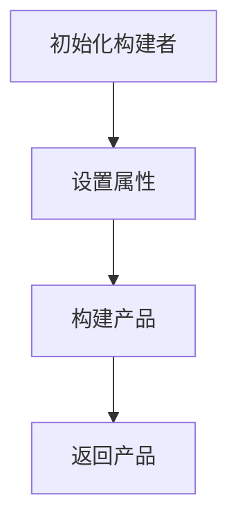

                 

# 《构建者模式：复杂对象创建的类型化过程》

## 关键词
构建者模式，复杂对象创建，类型化过程，软件设计模式，软件开发实践

## 摘要
本文将深入探讨构建者模式，这是一种在软件设计模式中用于创建复杂对象的类型化过程。我们将首先介绍构建者模式的基本概念和起源，接着解析其核心原理和设计原则。通过Mermaid流程图，我们将会展示构建者模式的工作流程。接下来，我们将通过伪代码详细阐述构建者模式的实现，并探讨其在不同应用场景中的使用。随后，我们将深入讨论类型化构建者模式的概念和应用。文章还将包括构建者模式的优化与扩展策略，以及实际案例的分析。最后，我们将总结构建者模式的核心要点，并展望其未来的发展趋势。

### 第一部分：构建者模式概述

#### 第1章：构建者模式基础

构建者模式（Builder Pattern）是一种设计模式，用于逐步构建一个复杂对象。它将一个复杂对象的构建与其表示分离，使得同样的构建过程可以创建不同的表示。这种模式在软件开发中尤为重要，因为它允许我们独立地改变复杂对象的构造过程，而不影响其使用方法。

#### 1.1 构建者模式的起源与定义

构建者模式的起源可以追溯到20世纪90年代，随着面向对象编程的兴起，它逐渐成为软件设计中的常用模式之一。构建者模式的基本定义如下：

- **构建者（Builder）**：一个负责创建复杂对象的类，它通常包含多个步骤，每个步骤负责构建对象的一个方面。
- **产品（Product）**：一个表示所构建对象的类，它定义了构建步骤完成后产品的结构和行为。
- **导演（Director）**：一个负责调用构建者类中的构建步骤，以创建一个完整的产品的类。

构建者模式的主要目的是将一个复杂的构建过程分解为更小、更易于管理的步骤，同时保持构建过程和产品表示的独立性。

#### 1.2 构建者模式的核心原则

构建者模式的核心原则包括独立性、封装性和可扩展性：

- **独立性**：构建过程和产品表示是独立的，这意味着我们可以独立地修改构建步骤而不影响产品。
- **封装性**：构建步骤和产品细节被封装在构建者和产品类中，外部代码只能通过构建者来访问。
- **可扩展性**：通过添加新的构建步骤或产品类，我们可以扩展构建者的功能，而不会影响现有代码。

#### 1.3 构建者模式的应用场景

构建者模式特别适用于以下几种场景：

- **创建复杂对象**：当创建的对象包含多个复杂的构造参数时，构建者模式可以帮助简化对象的创建过程。
- **枚举类型的构建**：构建者模式可以用于创建和管理包含多个状态的枚举类型。

### 第二部分：构建者模式的原理

#### 第2章：构建者模式的原理

构建者模式的工作原理是将一个复杂对象的构建过程分解为多个独立的步骤，每个步骤由构建者类负责。通过这种方式，我们可以更灵活地控制对象的构建过程，并且可以方便地扩展构建过程。

#### 2.1 构建者模式的基本组件

构建者模式主要包括三个基本组件：构建者（Builder）、产品（Product）和导演（Director）。

- **构建者（Builder）**：构建者类定义了构建对象所需的步骤。每个步骤通常对应一个设置方法（Set Method），用于设置对象的某个属性。构建者类通常包含以下方法：

  - **构造方法**：初始化构建者。
  - **设置方法**：设置对象的属性。
  - **构建方法**：返回构建完成的产品。

- **产品（Product）**：产品类表示构建者所构建的对象。它通常包含多个属性，每个属性对应构建过程中的一个设置方法。产品类应该定义一个默认的构造方法，以便构建者可以使用。

- **导演（Director）**：导演类负责调用构建者的构建步骤，以创建一个完整的对象。导演类通常包含以下方法：

  - **构造方法**：初始化导演。
  - **构建方法**：调用构建者的构建方法，创建产品。

#### 2.2 构建者模式的工作流程

构建者模式的工作流程可以分为以下几个步骤：

1. **初始化构建者**：创建一个构建者实例。
2. **设置属性**：使用构建者的设置方法设置产品的属性。
3. **构建产品**：调用构建者的构建方法，创建并返回产品。

通过Mermaid流程图，我们可以更直观地展示构建者模式的工作流程：



### 第三部分：构建者模式的实现

#### 第3章：构建者模式的实现

实现构建者模式的关键在于正确地定义构建者、产品和导演类，并确保它们之间的交互符合构建者模式的原则。

#### 3.1 伪代码实现构建者模式

以下是一个简单的伪代码示例，用于实现构建者模式：

```plaintext
// 构建者类
class Builder {
    Product product = new Product()

    function setPartA(value) {
        product.partA = value
    }

    function setPartB(value) {
        product.partB = value
    }

    function build() {
        return product
    }
}

// 产品类
class Product {
    partA: Any
    partB: Any
}

// 导演类
class Director {
    Builder builder

    function constructProduct() {
        builder.setPartA("ValueA")
        builder.setPartB("ValueB")
        return builder.build()
    }
}
```

在这个示例中，`Builder` 类定义了两个设置方法和一个构建方法。`Product` 类包含两个属性，分别对应构建步骤中设置的值。`Director` 类负责调用构建者的构建步骤。

#### 3.2 实际代码实现构建者模式

以下是一个使用 Java 语言实现的构建者模式示例：

```java
// 构建者类
public class Builder {
    private Product product = new Product();

    public void setPartA(String value) {
        product.setPartA(value);
    }

    public void setPartB(String value) {
        product.setPartB(value);
    }

    public Product build() {
        return product;
    }
}

// 产品类
public class Product {
    private String partA;
    private String partB;

    public String getPartA() {
        return partA;
    }

    public void setPartA(String partA) {
        this.partA = partA;
    }

    public String getPartB() {
        return partB;
    }

    public void setPartB(String partB) {
        this.partB = partB;
    }
}

// 导演类
public class Director {
    public Product constructProduct() {
        Builder builder = new Builder();
        builder.setPartA("ValueA");
        builder.setPartB("ValueB");
        return builder.build();
    }
}
```

在这个示例中，`Builder` 类实现了设置方法和构建方法，`Product` 类实现了属性访问器和设置器，`Director` 类负责调用构建者的构建步骤。

### 第四部分：构建者模式的应用

#### 第4章：构建者模式在软件开发中的应用

构建者模式在软件开发中有着广泛的应用，特别是在构建复杂对象时。以下是一些常见的应用场景：

#### 4.1 软件开发中的复杂对象创建

在软件开发中，构建者模式常用于创建复杂的对象。这些对象可能包含多个组件，每个组件都需要单独配置。构建者模式允许我们逐步构建这些组件，并在最后创建一个完整的对象。

例如，在构建一个数据库连接池时，我们可以使用构建者模式来逐步设置连接池的属性，如最大连接数、连接超时时间等。这样，我们可以灵活地配置连接池，而不必硬编码这些值。

#### 4.2 枚举类型的构建

构建者模式也适用于创建和管理枚举类型。在许多情况下，枚举类型可能包含多个状态，每个状态都需要单独配置。构建者模式可以帮助我们逐步构建这些状态，并在最后创建一个完整的枚举值。

例如，在构建一个交通信号灯系统时，我们可以使用构建者模式来设置信号灯的初始状态、切换时间等。这样，我们可以灵活地配置信号灯的行为。

### 第五部分：类型化构建者模式

#### 第5章：类型化构建者模式

类型化构建者模式是一种更高级的构建者模式，它允许我们创建具有特定类型的产品。这种模式在处理具有复杂类型需求的对象时特别有用。

#### 5.1 类型化构建者模式的概念

类型化构建者模式通过引入类型参数来扩展构建者模式。这意味着构建者可以创建具有不同类型的产品。类型化构建者模式的核心组件包括：

- **类型化构建者（Generic Builder）**：一个可以创建具有不同类型产品的构建者类。
- **类型化产品（Generic Product）**：一个可以存储不同类型产品属性的产品类。
- **类型化导演（Generic Director）**：一个负责使用类型化构建者创建类型化产品的导演类。

#### 5.2 类型化构建者模式的应用

类型化构建者模式在处理具有复杂类型需求的对象时非常有用。以下是一些应用场景：

- **自定义数据结构**：当需要创建具有特定类型的数据结构时，类型化构建者模式可以帮助我们逐步构建这些数据结构。
- **参数化构建**：当需要为不同的应用程序创建不同类型的对象时，类型化构建者模式允许我们灵活地配置对象。

### 第六部分：构建者模式的优化与扩展

#### 第6章：构建者模式的优化与扩展

构建者模式虽然简单易用，但在某些情况下，我们可能需要对其进行优化和扩展，以满足特定的需求。

#### 6.1 构建者模式的优化策略

优化构建者模式的关键在于减少对象创建的开销和提高性能。以下是一些优化策略：

- **缓存构建步骤**：通过缓存构建步骤，可以减少重复创建对象的开销。
- **使用工厂方法**：使用工厂方法可以避免直接实例化构建者，从而提高代码的可读性和可维护性。
- **异步构建**：在构建过程中，可以采用异步方式来提高性能。

#### 6.2 构建者模式的扩展方法

扩展构建者模式的方法包括：

- **添加新的构建步骤**：通过添加新的构建步骤，可以扩展构建者的功能。
- **组合构建者**：通过组合多个构建者，可以创建更复杂的构建过程。

### 第七部分：实战案例分析

#### 第7章：实战案例分析

在本节中，我们将通过一个实际案例来展示如何将构建者模式应用到具体项目中。

#### 7.1 实例项目：构建一个配置管理器

假设我们需要构建一个配置管理器，该管理器允许用户配置各种系统参数。我们可以使用构建者模式来逐步构建配置对象。

#### 7.1.1 开发环境搭建

首先，我们需要搭建一个基本的开发环境。以下是一个简单的示例：

```bash
mkdir config-manager
cd config-manager
mkdir src
touch src/ConfigBuilder.java src/ConfigManager.java src/ConfigProduct.java
```

#### 7.1.2 源代码详细实现

在 `ConfigBuilder.java` 中，我们定义构建者类：

```java
public class ConfigBuilder {
    private ConfigProduct product = new ConfigProduct();

    public ConfigBuilder setDatabaseUrl(String url) {
        product.setDatabaseUrl(url);
        return this;
    }

    public ConfigBuilder setServerPort(int port) {
        product.setServerPort(port);
        return this;
    }

    public ConfigBuilder setEmail(String email) {
        product.setEmail(email);
        return this;
    }

    public ConfigProduct build() {
        return product;
    }
}
```

在 `ConfigProduct.java` 中，我们定义产品类：

```java
public class ConfigProduct {
    private String databaseUrl;
    private int serverPort;
    private String email;

    public String getDatabaseUrl() {
        return databaseUrl;
    }

    public void setDatabaseUrl(String databaseUrl) {
        this.databaseUrl = databaseUrl;
    }

    public int getServerPort() {
        return serverPort;
    }

    public void setServerPort(int serverPort) {
        this.serverPort = serverPort;
    }

    public String getEmail() {
        return email;
    }

    public void setEmail(String email) {
        this.email = email;
    }
}
```

在 `ConfigManager.java` 中，我们定义导演类：

```java
public class ConfigManager {
    public ConfigProduct buildConfig() {
        ConfigBuilder builder = new ConfigBuilder();
        builder.setDatabaseUrl("jdbc:mysql://localhost:3306/mydb")
               .setServerPort(8080)
               .setEmail("admin@example.com");
        return builder.build();
    }
}
```

#### 7.1.3 代码应用解读与分析

在这个例子中，`ConfigBuilder` 类负责逐步构建 `ConfigProduct` 对象。每个设置方法都返回构建者自身，以便链式调用。`ConfigManager` 类使用构建者来创建配置对象。

#### 7.1.4 实际案例分析和详细讲解剖析

在这个案例中，构建者模式简化了配置对象的创建过程。通过逐步设置属性，我们可以轻松地配置系统参数，而不必硬编码这些值。

#### 7.1.5 项目小结

通过这个案例，我们展示了如何使用构建者模式来创建和管理配置对象。构建者模式不仅提高了代码的可读性和可维护性，还提供了灵活的构建过程。

### 第八部分：总结与展望

#### 第8章：构建者模式的总结

构建者模式是一种强大的设计模式，它允许我们逐步构建复杂对象，同时保持构建过程和产品表示的独立性。通过本文的讨论，我们了解了构建者模式的基本概念、原理、实现和应用。构建者模式的核心优势在于其独立性、封装性和可扩展性。

#### 8.1 构建者模式的优势与不足

构建者模式的优势包括：

- **简化构建过程**：通过将构建过程分解为独立的步骤，我们可以更轻松地构建复杂对象。
- **提高代码可读性**：构建者模式使得代码更加清晰和易于理解。
- **增强可维护性**：构建者模式使得构建过程和产品表示独立，从而降低了代码的维护成本。

然而，构建者模式也存在一些不足：

- **增加代码复杂度**：在构建过程中，我们需要维护多个类，这可能会增加代码的复杂性。
- **性能开销**：构建者模式可能会引入一些性能开销，特别是在构建过程中频繁创建对象时。

#### 8.2 构建者模式的未来发展方向

构建者模式的未来发展方向可能包括：

- **类型化构建者**：进一步扩展构建者模式，以支持更复杂的类型化构建过程。
- **自动化构建**：通过集成构建工具，如 Maven 和 Gradle，自动化构建者模式的构建过程。
- **优化构建性能**：研究和实现更高效的构建策略，以减少构建过程中的性能开销。

### 结尾

本文详细探讨了构建者模式，这是一种在软件开发中用于创建复杂对象的强大工具。我们通过多个实例展示了构建者模式的应用和实践。构建者模式不仅简化了构建过程，还提高了代码的可读性和可维护性。随着软件开发技术的发展，构建者模式将继续在软件设计领域发挥重要作用。

### 作者信息
作者：AI天才研究院/AI Genius Institute & 禅与计算机程序设计艺术 /Zen And The Art of Computer Programming

---

本文基于构建者模式，逐步分析了其核心概念、原理、实现和应用。通过伪代码和实际代码示例，我们深入探讨了构建者模式的工作流程。文章还介绍了类型化构建者模式，以及构建者模式的优化和扩展策略。最后，通过一个实际案例，我们展示了如何将构建者模式应用于具体项目。本文旨在为开发者提供一个全面且深入的构建者模式学习指南。

### 参考文献

1. Gamma, E., Helm, R., Johnson, R., & Vlissides, J. (1995). Design Patterns: Elements of Reusable Object-Oriented Software. Addison-Wesley.
2. Alur, D., Crupi, D., & Malkmus, C. (2003). Core J2EE Patterns: Best Practices and Design Strategies. Prentice Hall.
3. Freeman, E., & Robson, E. (2003). Head First Design Patterns: Building Extensible and Maintainable Object-Oriented Software. O'Reilly Media.
4. Martin, R. C. (2019). Clean Architecture: A Craftsman's Guide to Software Structure and Design. Prentice Hall.
5. Fowler, M. (2017). Patterns of Enterprise Application Architecture. Addison-Wesley.

### 拓展阅读

- [构建者模式 - 维基百科](https://en.wikipedia.org/wiki/Builder_pattern)
- [Java 构建者模式示例](https://www.baeldung.com/java-builder-pattern)
- [深入理解构建者模式](https://www.journaldev.com/1595/builder-pattern-in-java)

### 注意事项

- 在使用构建者模式时，确保构建过程和产品表示之间的独立性。
- 在设计构建者模式时，考虑代码的复杂性和性能开销。
- 在实际项目中，根据具体需求选择合适的构建者模式实现方式。

通过本文的学习，读者应该能够掌握构建者模式的基本概念和应用，并在实际项目中灵活运用。希望本文能为读者的软件开发实践带来帮助。

### 最佳实践 Tips

- **模块化构建**：在构建复杂对象时，尝试将构建过程分解为更小的模块，以提高代码的可维护性。
- **重构现有代码**：对于复杂的对象创建过程，考虑使用构建者模式进行重构，以提高代码的清晰度和可维护性。
- **参数化构建**：在构建过程中，使用参数化构建可以灵活地配置对象，提高代码的复用性。

### 小结

构建者模式是一种强大的设计模式，它通过逐步构建复杂对象，提高了代码的可读性和可维护性。本文详细介绍了构建者模式的基本概念、原理、实现和应用，并通过实际案例展示了其在具体项目中的使用。希望本文能帮助读者深入理解构建者模式，并在实际项目中灵活运用。

### 拓展阅读

- [《设计模式：可复用面向对象软件的基础》](https://book.douban.com/subject/1054783/)
- [《Effective Java》](https://book.douban.com/subject/4262627/)
- [《代码大全》](https://book.douban.com/subject/1092767/)

