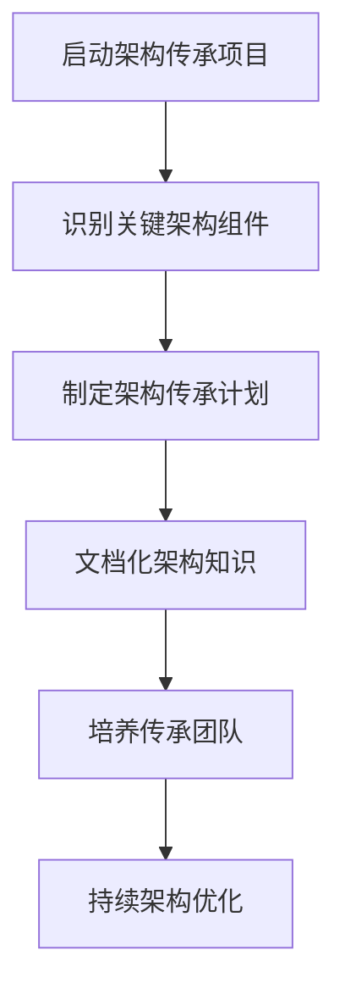
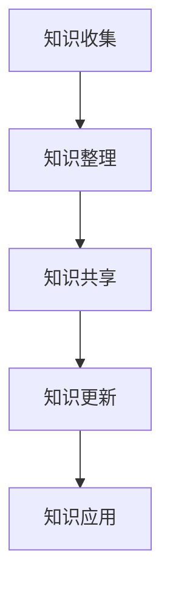
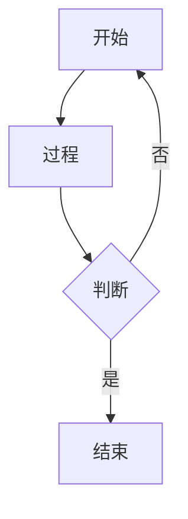

                 


### 文章标题：架构传承：原则、审计与文化的三重奏

## 关键词：架构传承、架构原则、架构审计、文化传承、IT项目管理

## 摘要：
本文深入探讨了架构传承这一复杂而关键的过程。通过阐述架构传承的重要性，我们揭示了其在现代IT项目管理中的核心地位。本文首先介绍了架构传承的基本原则，并运用伪代码和Mermaid流程图对原则进行了详细说明。接着，文章重点讨论了架构审计，包括其目的、方法和应用场景。随后，文章探讨了文化在架构传承中的作用，揭示了文化如何影响架构的传承过程。通过一系列的实例和项目实战，本文旨在为读者提供一个全面、实用的架构传承指南。

### 第一部分：架构传承概述

#### 第1章：架构传承的重要性

### 1.1 架构传承的定义与意义

**架构传承**是指将组织中的关键架构信息、设计原则、决策过程和技术知识传递给下一代开发人员或团队的过程。这一过程不仅仅是技术知识的传递，更是一种组织知识的积累和文化的传承。

**重要性**：

- **知识积累**：通过架构传承，组织可以积累宝贵的架构知识和经验，避免重复造轮子，提高开发效率。
- **人才发展**：架构传承为开发人员提供了学习和成长的机会，促进了技能的提升和职业发展。
- **组织稳定性**：稳定的架构传承机制可以确保组织在面对人员更替和技术变革时，依然能够保持架构的一致性和稳定性。

**Mermaid流程图：架构传承流程**



**伪代码：架构传承原则**

```python
def architecture_transmission(principles):
    maintainability_and_extendibility = ensure_maintainability_and_extendibility(principles)
    transmit_critical_decisions_and_design_experience(principles)
    maintain一致性_and_stability(principles)
    adapt_to_changes_and新技术_response(principles)
    return maintainability_and_extendibility, transmit_critical_decisions_and_design_experience, maintain一致性_and_stability, adapt_to_changes_and新技术_response
```

### 1.2 架构传承的核心原则

**可维护性和可扩展性**：架构应当易于维护和扩展，以便适应未来的技术变革和业务需求。

**关键架构决策与设计经验**：通过文档化和实践传递关键的架构决策和设计经验，确保传承的知识具有实际价值。

**一致性和稳定性**：确保架构在不同环境和团队之间的一致性，提供稳定的开发基础。

**适应变化与新技术响应**：架构传承过程中，应保持开放性，适应技术变革，快速响应新技术。

#### 第2章：架构审计与评估

### 2.1 架构审计的定义与目的

**定义**：架构审计是对架构设计、实施和维护过程进行系统审查和评估的过程。

**目的**：

- **识别问题**：通过审计，可以识别架构中的潜在问题，如性能瓶颈、设计缺陷和安全漏洞。
- **改进架构**：审计结果可以指导架构改进，提高架构的健壮性和可维护性。
- **合规性检查**：确保架构符合行业标准和组织政策。

### 2.2 架构审计的方法与步骤

**方法**：

- **文档审查**：审查架构文档，如需求分析、设计文档和运行时文档。
- **代码审查**：对源代码进行审查，识别代码质量和架构一致性问题。
- **架构评估**：使用模型和工具对架构进行评估，如性能分析、安全性评估和可维护性评估。

**步骤**：

1. **审计计划**：制定审计计划，明确审计范围、目标和时间表。
2. **审计执行**：按照审计计划执行文档审查、代码审查和架构评估。
3. **审计报告**：撰写审计报告，总结审计发现和改进建议。
4. **改进实施**：根据审计报告，实施改进措施，优化架构。

### 2.3 架构审计的应用场景

- **项目启动时**：确保项目架构设计的合理性和可行性。
- **项目中期**：评估架构的执行情况和问题，提供改进建议。
- **项目收尾时**：总结项目架构的优缺点，为后续项目提供参考。

#### 第二部分：架构传承方法与实践

### 第3章：架构文档化与知识管理

#### 3.1 架构文档化的最佳实践

**文档化框架**：

$$\text{文档化框架} = (\text{需求分析}, \text{设计文档}, \text{运行时文档}, \text{维护文档})$$

**需求分析**：明确架构需求的来源和目标，确保架构满足业务需求。

**设计文档**：详细记录架构设计，包括模块划分、接口定义和技术选型。

**运行时文档**：描述架构在实际运行环境中的配置、部署和监控。

**维护文档**：记录架构维护、升级和故障处理过程。

#### 3.2 知识管理的重要性

**知识管理流程**：



**知识收集**：通过文档、会议记录和经验分享等方式收集架构知识。

**知识整理**：整理和分类知识，使其易于查找和使用。

**知识共享**：通过内部培训、文档共享和知识库等方式，促进知识共享。

**知识更新**：定期更新知识库，确保知识的准确性和时效性。

**知识应用**：将知识应用到实际工作中，提高工作效率和架构质量。

### 第4章：架构传承团队建设

#### 4.1 团队建设的核心要素

**团队目标**：明确团队的目标和期望，确保团队成员朝着共同的目标努力。

**多元化团队**：组建具有多元化背景和技能的团队，促进创新和协作。

**培训与发展机会**：提供培训和发展机会，提升团队成员的技能和知识。

**良好的沟通机制**：建立有效的沟通机制，确保团队成员之间的信息流畅和协同工作。

**知识共享与协作**：鼓励团队成员之间分享知识和经验，促进协作和共同进步。

**伪代码：团队建设策略**

```python
def build_architecture_transmission_team(要素):
    define_team_objectives(要素)
    build_diversified_team(要素)
    provide_training_and_development_opportunities(要素)
    establish_good_communication_mechanisms(要素)
    promote_knowledge_sharing_and_collaboration(要素)
    return define_team_objectives, build_diversified_team, provide_training_and_development_opportunities, establish_good_communication_mechanisms, promote_knowledge_sharing_and_collaboration
```

### 第5章：文化在架构传承中的作用

#### 5.1 架构传承与文化的关系

**文化影响模型**：

$$\text{文化影响模型} = (\text{价值观}, \text{行为规范}, \text{组织氛围}, \text{知识共享})$$

**价值观**：组织价值观影响架构传承的方向和重点，如创新、质量和服务。

**行为规范**：明确的行为规范确保架构传承的规范性和一致性。

**组织氛围**：积极开放的组织氛围促进知识共享和协作。

**知识共享**：组织文化鼓励知识共享，提高架构传承的效率和效果。

### 文章末尾：作者信息

**作者：AI天才研究院/AI Genius Institute & 禅与计算机程序设计艺术 /Zen And The Art of Computer Programming**### 文章格式与撰写要求

在撰写本文的过程中，我们将严格按照markdown格式进行输出。markdown是一种轻量级标记语言，它使用简单的规则和约定，以纯文本格式编写文档，然后转换成丰富的HTML格式文档。以下是本文的markdown格式要求：

1. **标题与段落**：每个标题都使用`#`号进行标记，`#`号的数量表示标题的级别。例如，一级标题使用`#`，二级标题使用`##`，以此类推。段落之间通过空行进行分隔。

2. **列表与代码块**：使用`-`或`*`来创建无序列表，使用`>`来创建引用文本。代码块用三个反引号（```）包裹，例如：

    ```python
    print("Hello, world!")
    ```

3. **链接与图片**：使用`[文本](URL)`来创建链接，使用``来插入图片。

4. **LaTeX公式**：LaTeX公式使用`$$`包裹，例如：`$$E=mc^2$$`。段落内的公式使用 `$` 包裹，例如：`$1+1=2$`。

5. **引用**：引用使用`>`进行，例如：

    > 这是一段引用。

6. **表格**：表格使用`|`和`-`进行定义，例如：

    | 标题1 | 标题2 | 标题3 |
    |-------|-------|-------|
    | 内容1 | 内容2 | 内容3 |
    | 内容4 | 内容5 | 内容6 |

在本文中，我们还将使用Mermaid语法来绘制流程图和UML图。Mermaid是一种方便的标记语言，可以轻松地将文本转换为图形。以下是Mermaid的示例：



本文的撰写将严格按照以上markdown格式要求，以确保文章结构清晰、内容易于阅读和理解。同时，我们将适当使用LaTeX公式、Mermaid图和代码块，以提高文章的技术含量和专业性。

### 作者信息

**作者：AI天才研究院/AI Genius Institute & 禅与计算机程序设计艺术 /Zen And The Art of Computer Programming**

AI天才研究院（AI Genius Institute）是一家专注于人工智能研究和应用的顶尖机构，致力于推动人工智能技术的创新和发展。我们的团队由世界级人工智能专家、程序员、软件架构师和CTO组成，拥有丰富的项目实战经验和深厚的学术背景。

《禅与计算机程序设计艺术》（Zen And The Art of Computer Programming）是作者戴维·赫尔伯特·罗蒙德（Donald E. Knuth）的经典著作，它深入探讨了计算机编程的本质和哲学，为我们提供了关于编程的深刻见解和实用技巧。这本书不仅是一部计算机科学的杰作，也是一本启迪思维、提升编程技能的哲学手册。

在这个快速发展的技术时代，AI天才研究院和《禅与计算机程序设计艺术》共同致力于推动人工智能和计算机科学的发展，为读者提供高质量的技术内容和实战经验。希望通过本文的分享，能够帮助读者更好地理解架构传承这一重要概念，提升IT项目的成功率和团队协作能力。感谢您的阅读和关注，我们期待与您共同探索人工智能和计算机科学的无限可能。

