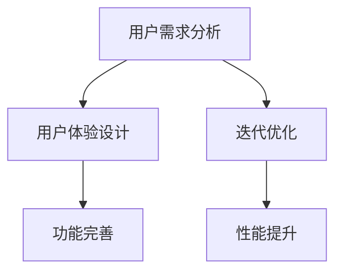
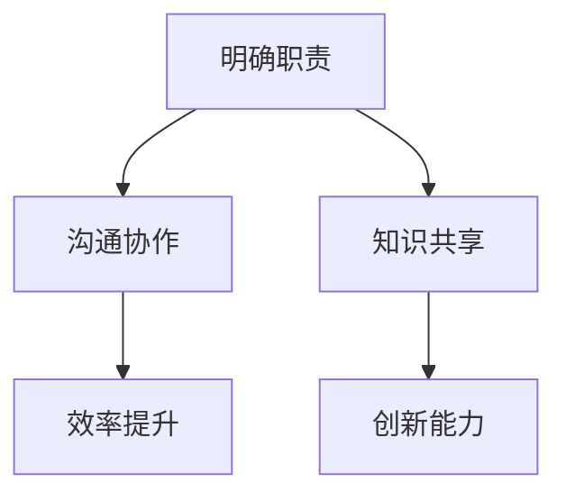
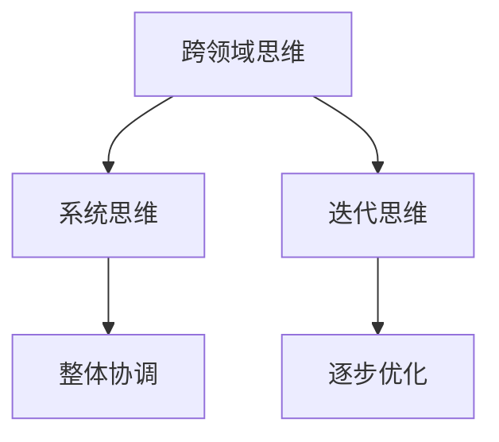
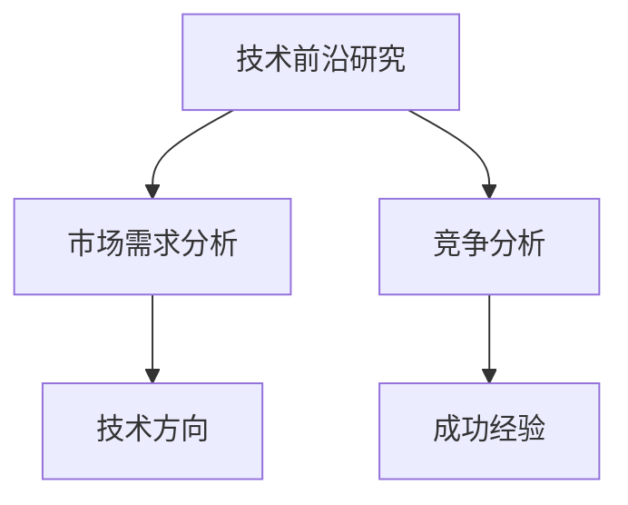
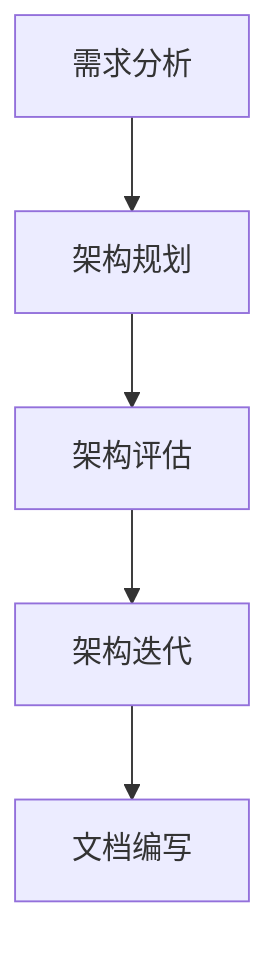
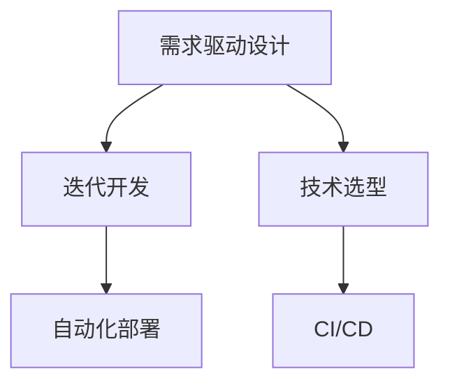

                 

## 文章标题

# 《架构力的创新：设计下一代系统架构》

## 关键词

- 架构创新
- 系统架构
- 下一代系统架构
- 架构设计
- 技术趋势
- 实战案例

## 摘要

本文将探讨系统架构的创新，以及如何设计下一代系统架构。通过对系统架构的基础知识、架构创新的原理和方法、下一代系统架构的设计原则以及实战案例的分析，帮助读者理解架构创新的重要性，掌握创新的架构设计方法，为未来的系统架构设计提供指导。本文旨在为IT从业者提供一套全面、深入的架构创新指南。

## 第一部分：架构力概述

### 第1章：系统架构基础

#### 1.1 系统架构的定义与分类

系统架构是指在软件系统中，各个组成部分（如组件、模块、子系统等）之间的关系和交互方式。根据不同的分类标准，系统架构可以分为不同的类型，如按照层次结构可以分为层次架构、面向对象架构、事件驱动架构等。

#### 1.2 系统架构的重要性

系统架构决定了系统的性能、可扩展性、可靠性、可维护性等关键特性。一个优秀的系统架构可以支持系统的长期发展，提高开发效率，降低维护成本。因此，系统架构设计是软件开发过程中至关重要的环节。

#### 1.3 系统架构的发展历程

系统架构的发展经历了从单机架构、分布式架构到微服务架构的演变。每种架构都有其优缺点和适用场景。未来，随着技术的不断进步，系统架构将继续演变，出现更加灵活、高效、可扩展的架构。

### 第2章：架构力的来源

#### 2.1 技术创新

技术创新是架构力的主要来源之一。通过引入新的技术，如云计算、大数据、人工智能等，可以提升系统的性能、效率和可靠性。

#### 2.2 设计思维

设计思维是一种以用户为中心的思考方式，强调在系统架构设计过程中关注用户需求、用户体验，从而创造出更加符合用户需求、更具竞争力的系统。

#### 2.3 团队协作

团队协作是架构创新的保障。一个优秀的团队可以充分发挥每个成员的特长，共同攻克技术难题，实现架构的创新。

## 第二部分：架构创新

### 第3章：架构创新原理

#### 3.1 创新思维

创新思维是指通过改变思考方式，发现新问题、新方法、新解决方案的能力。在架构创新过程中，创新思维可以帮助设计师找到更优的架构方案。

#### 3.2 技术趋势分析

技术趋势分析是架构创新的重要依据。通过对当前技术发展趋势的分析，可以预测未来可能出现的新技术，从而为架构创新提供方向。

#### 3.3 架构演化模型

架构演化模型是一种描述架构演变过程的方法。通过架构演化模型，可以更好地理解架构的演变规律，指导架构创新。

### 第4章：创新架构设计方法

#### 4.1 架构设计流程

架构设计流程是架构创新的基本步骤。一个完善的架构设计流程可以帮助设计师系统地设计出优秀的架构。

#### 4.2 架构设计工具

架构设计工具可以帮助设计师更高效地完成架构设计任务。常见的架构设计工具有UML工具、Mermaid流程图工具等。

#### 4.3 架构设计模式

架构设计模式是一系列经过实践验证的优秀架构设计方法。通过学习并运用架构设计模式，可以提高架构设计的效率和质量。

### 第5章：下一代系统架构设计

#### 5.1 设计原则

下一代系统架构设计需要遵循一系列设计原则，如模块化、解耦、高内聚、高可扩展性等。这些原则有助于设计出更加优秀、可靠的系统架构。

#### 5.2 设计实践

设计实践是架构创新的关键环节。通过实际项目的设计和实践，可以不断积累经验，提高架构设计的水平。

#### 5.3 设计案例

设计案例是对实际架构创新过程的总结和展示。通过分析设计案例，可以了解如何在实际项目中运用架构创新方法。

## 第三部分：实战案例

### 第6章：架构创新案例分析

#### 6.1 案例一：云计算架构创新

云计算架构创新是当前架构创新的一个重要方向。通过分析云计算架构的创新，可以了解如何运用新技术、新方法提升系统性能和可靠性。

#### 6.2 案例二：大数据架构创新

大数据架构创新是大数据领域的一个重要课题。通过分析大数据架构的创新，可以了解如何应对大数据处理过程中的挑战，提高数据处理效率。

#### 6.3 案例三：物联网架构创新

物联网架构创新是物联网领域的一个重要方向。通过分析物联网架构的创新，可以了解如何构建高效、可靠的物联网系统，满足日益增长的需求。

### 第7章：实践与启示

#### 7.1 架构创新实践总结

通过总结架构创新实践，可以了解架构创新的基本规律和关键要素，为未来的架构创新提供借鉴。

#### 7.2 架构创新的挑战与对策

在架构创新过程中，会面临一系列挑战，如技术风险、团队协作风险等。通过分析这些挑战，可以找到有效的对策，提高架构创新的成功率。

#### 7.3 未来架构发展趋势

随着技术的不断发展，未来架构将呈现出新的发展趋势，如人工智能架构、区块链架构等。了解这些发展趋势，可以更好地把握未来架构创新的机遇。

## 附录

### 附录A：架构力工具资源

#### 8.1 架构设计工具简介

介绍常用的架构设计工具，如UML工具、Mermaid流程图工具等，帮助读者选择合适的工具进行架构设计。

#### 8.2 技术栈与开源框架推荐

推荐适合架构创新的技术栈和开源框架，为读者提供实际项目中的参考。

---

本文从系统架构基础、架构创新原理、创新架构设计方法、实战案例等多个方面，全面探讨了架构创新的原理和方法，旨在为IT从业者提供一套实用的架构创新指南。通过本文的学习，读者可以更好地理解架构创新的重要性，掌握创新的架构设计方法，为未来的系统架构设计提供指导。作者：AI天才研究院/AI Genius Institute & 禅与计算机程序设计艺术 /Zen And The Art of Computer Programming。|>markdown_text## 系统架构基础

### 1.1 系统架构的定义与分类

系统架构是指在软件系统中，各个组成部分（如组件、模块、子系统等）之间的关系和交互方式。简单来说，系统架构描述了系统如何组织、运作以及各个部分之间的相互关系。

系统架构可以按照不同的分类标准进行分类，常见的分类方法包括：

1. **按照层次结构分类**：层次架构是软件系统架构中最常见的分类方法之一。层次架构将系统划分为多个层次，每个层次负责不同的功能。常见的层次架构包括三层架构（表示层、业务逻辑层、数据访问层）和四层架构（表示层、业务逻辑层、服务层、数据访问层）。

2. **按照设计风格分类**：面向对象架构、事件驱动架构、分布式架构等是常见的架构设计风格。每种设计风格都有其独特的优势和适用场景。

3. **按照组织结构分类**：微服务架构、服务导向架构（SOA）等是按照组织结构对系统进行划分的架构设计方法。

### 1.2 系统架构的重要性

系统架构是软件系统设计的核心，对系统的性能、可扩展性、可靠性、可维护性等关键特性有着重要影响。以下是系统架构重要性的一些具体体现：

1. **性能**：一个良好的系统架构可以充分利用硬件资源，提高系统运行速度，降低响应时间。

2. **可扩展性**：良好的系统架构可以支持系统的扩展，使得系统在需求增加时能够快速适应，避免出现性能瓶颈。

3. **可靠性**：系统架构的设计直接影响到系统的稳定性和可靠性。通过合理的架构设计，可以降低系统出现故障的概率。

4. **可维护性**：良好的系统架构可以提高系统的可维护性，使得系统的开发和维护更加高效，降低维护成本。

### 1.3 系统架构的发展历程

系统架构的发展经历了从单机架构、分布式架构到微服务架构的演变。每种架构都有其优缺点和适用场景。

1. **单机架构**：单机架构是最简单的架构形式，所有的组件和功能都运行在一台计算机上。这种架构的优点是实现简单、易于管理，但缺点是性能和可扩展性较差。

2. **分布式架构**：分布式架构将系统的功能分散到多台计算机上，通过网络进行通信。这种架构的优点是提高了系统的性能和可扩展性，但缺点是复杂度增加，系统管理和维护难度加大。

3. **微服务架构**：微服务架构是一种基于分布式架构的设计方法，将系统划分为多个独立的微服务。每个微服务负责特定的功能，独立部署、独立运行。这种架构的优点是提高了系统的可扩展性、可靠性和可维护性，但缺点是系统管理和维护的复杂度更高。

随着技术的不断发展，系统架构将继续演变，出现更加灵活、高效、可扩展的架构。未来，如何设计出更加优秀的系统架构将是软件开发领域的一个重要课题。|>markdown_text## 架构力的来源

### 2.1 技术创新

技术创新是架构力的主要来源之一。通过引入新的技术，如云计算、大数据、人工智能等，可以提升系统的性能、效率和可靠性。以下是一些技术创新在架构设计中的应用实例：

1. **云计算**：云计算提供了弹性伸缩、分布式存储和计算能力，使得系统可以更加高效地利用资源，提高性能和可扩展性。

   **Mermaid流程图**：
   ```mermaid
   graph TD
   A[云计算技术] --> B[资源弹性];
   A --> C[分布式存储];
   A --> D[高效计算];
   B --> E[性能提升];
   C --> F[扩展性增强];
   D --> G[可靠性提高];
   ```

2. **大数据**：大数据技术可以帮助系统处理海量数据，实现实时分析和决策。

   **Mermaid流程图**：
   ```mermaid
   graph TD
   A[大数据技术] --> B[数据存储];
   A --> C[数据处理];
   A --> D[实时分析];
   B --> E[数据分析];
   C --> F[决策支持];
   D --> G[业务优化];
   ```

3. **人工智能**：人工智能技术可以用于系统自动化、智能化，提高系统的效率和用户体验。

   **Mermaid流程图**：
   ```mermaid
   graph TD
   A[人工智能技术] --> B[自动化];
   A --> C[智能化];
   A --> D[用户体验];
   B --> E[效率提升];
   C --> F[决策优化];
   D --> G[满意度提升];
   ```

### 2.2 设计思维

设计思维是一种以用户为中心的思考方式，强调在系统架构设计过程中关注用户需求、用户体验，从而创造出更加符合用户需求、更具竞争力的系统。以下是设计思维在架构设计中的应用：

1. **用户需求分析**：通过调研和分析用户需求，确定系统架构的功能和性能需求。

2. **用户体验设计**：设计用户友好的界面和交互流程，提高用户满意度。

3. **迭代优化**：通过不断的迭代和优化，逐步完善系统架构，满足用户需求。

**Mermaid流程图**：


### 2.3 团队协作

团队协作是架构创新的保障。一个优秀的团队可以充分发挥每个成员的特长，共同攻克技术难题，实现架构的创新。以下是团队协作在架构设计中的应用：

1. **明确职责**：明确团队成员的职责和分工，确保每个成员都清楚自己的任务和目标。

2. **沟通协作**：建立良好的沟通机制，确保团队成员之间能够及时沟通、协作。

3. **知识共享**：鼓励团队成员分享知识、经验，提高整个团队的技术水平和创新能力。

**Mermaid流程图**：


通过技术创新、设计思维和团队协作，可以不断提升架构力，设计出更加优秀、可靠的系统架构。这些创新元素的有机结合，为系统架构的持续发展和创新提供了强大的动力。|>markdown_text## 架构创新原理

### 3.1 创新思维

创新思维是指在架构设计过程中，通过改变思考方式，发现新问题、新方法、新解决方案的能力。创新思维是架构创新的核心，以下是一些关键点：

1. **跨领域思维**：将不同领域的知识、方法和技术进行交叉应用，产生新的架构设计思路。

2. **系统思维**：从整体角度出发，考虑系统各部分之间的相互作用和影响，设计出更加协调、高效的架构。

3. **迭代思维**：通过不断的迭代和优化，逐步完善架构设计，实现创新。

**Mermaid流程图**：


### 3.2 技术趋势分析

技术趋势分析是架构创新的重要依据。通过对当前技术发展趋势的分析，可以预测未来可能出现的新技术，从而为架构创新提供方向。以下是一些关键点：

1. **技术前沿研究**：关注最新研究成果和技术突破，了解未来可能出现的技术变革。

2. **市场需求分析**：分析市场需求和技术趋势，确定未来技术的应用方向。

3. **竞争分析**：了解竞争对手的技术方向和优势，借鉴成功经验，避免重复投资。

**Mermaid流程图**：


### 3.3 架构演化模型

架构演化模型是一种描述架构演变过程的方法。通过架构演化模型，可以更好地理解架构的演变规律，指导架构创新。以下是一些常见的架构演化模型：

1. **线性演化模型**：在时间轴上，系统架构按照一定的顺序逐步演化。

   **Mermaid流程图**：
   ```mermaid
   graph TD
   A[初始架构] --> B[改进架构];
   B --> C[优化架构];
   ```

2. **螺旋演化模型**：通过迭代和优化，逐步完善架构设计。

   **Mermaid流程图**：
   ```mermaid
   graph TD
   A[初始架构] --> B[改进架构];
   B --> C[优化架构];
   C --> D[迭代优化];
   ```

3. **适应性演化模型**：根据环境变化，动态调整架构设计。

   **Mermaid流程图**：
   ```mermaid
   graph TD
   A[初始架构] --> B[环境变化];
   B --> C[适应性调整];
   C --> D[优化架构];
   ```

通过创新思维、技术趋势分析和架构演化模型，可以系统地推进架构创新。这些原理和方法为架构设计师提供了有效的工具和思维模式，帮助他们设计出更加优秀、可靠的系统架构。|>markdown_text## 创新架构设计方法

### 4.1 架构设计流程

架构设计流程是架构创新的基本步骤。一个完善的架构设计流程可以帮助设计师系统地设计出优秀的架构。以下是一个典型的架构设计流程：

1. **需求分析**：明确系统需求，包括功能需求、性能需求、安全性需求等。

2. **架构规划**：根据需求分析结果，确定系统架构的基本框架和主要组件。

3. **架构评估**：评估架构方案的可行性、性能、可扩展性等关键指标。

4. **架构迭代**：根据评估结果，对架构方案进行优化和调整。

5. **文档编写**：编写架构设计文档，包括架构概述、组件描述、交互关系等。

**Mermaid流程图**：


### 4.2 架构设计工具

架构设计工具可以帮助设计师更高效地完成架构设计任务。常见的架构设计工具有UML工具、Mermaid流程图工具等。以下是一些常用的架构设计工具：

1. **UML工具**：UML（统一建模语言）工具可以帮助设计师绘制系统架构图，包括类图、组件图、部署图等。常用的UML工具有StarUML、Visual Paradigm等。

2. **Mermaid流程图工具**：Mermaid是一种基于Markdown的绘图工具，可以轻松绘制各种类型的图表，包括流程图、序列图、Gantt图等。Mermaid流程图工具的语法简洁易懂，适合快速绘制架构设计图。

### 4.3 架构设计模式

架构设计模式是一系列经过实践验证的优秀架构设计方法。通过学习并运用架构设计模式，可以提高架构设计的效率和质量。以下是一些常见的架构设计模式：

1. **MVC模式**：MVC（模型-视图-控制器）模式是一种常用的软件架构模式，将系统的数据处理、显示和交互分离，提高系统的模块化和可维护性。

2. **微服务架构**：微服务架构是一种基于组件的分布式架构，将系统划分为多个独立的微服务，每个微服务负责特定的功能，独立部署、独立运行。微服务架构可以提高系统的可扩展性、可靠性和可维护性。

3. **事件驱动架构**：事件驱动架构是一种基于事件的系统架构，通过事件触发器来控制系统的运行。事件驱动架构可以提高系统的响应速度和灵活性。

通过创新架构设计方法，设计师可以更高效地设计出优秀的系统架构。这些方法包括完善的架构设计流程、先进的架构设计工具和经过实践验证的架构设计模式。设计师应根据实际需求和项目特点，灵活运用这些方法，设计出符合项目需求的优秀架构。|>markdown_text## 下一代系统架构设计

### 5.1 设计原则

下一代系统架构设计需要遵循一系列设计原则，以确保架构的灵活性、可扩展性和可靠性。以下是一些关键设计原则：

1. **模块化**：将系统划分为多个模块，每个模块负责特定的功能。模块化可以提高系统的可维护性和可扩展性。

2. **解耦**：减少模块之间的依赖关系，提高系统的灵活性。解耦可以通过使用接口、事件驱动等设计方法实现。

3. **高内聚**：确保模块内部的功能紧密相关，提高模块的独立性和可维护性。

4. **高可扩展性**：设计时考虑到未来可能的需求变化，确保系统能够方便地进行扩展。

5. **高可靠性**：通过冗余设计、故障转移等手段提高系统的可靠性。

6. **安全性**：确保系统在设计和实现过程中遵循安全最佳实践，防止数据泄露和攻击。

### 5.2 设计实践

在具体设计下一代系统架构时，可以采用以下实践方法：

1. **需求驱动设计**：以用户需求为导向，确保架构设计满足实际业务需求。

2. **迭代开发**：采用敏捷开发方法，逐步完善系统架构，快速响应需求变化。

3. **技术选型**：选择适合项目需求的技术栈，如使用云计算、大数据、人工智能等技术提升系统性能。

4. **自动化部署**：使用自动化工具进行部署和管理，提高部署效率，减少人为错误。

5. **持续集成和持续部署**（CI/CD）：通过持续集成和持续部署，实现快速迭代和高效交付。

**Mermaid流程图**：


### 5.3 设计案例

以下是一个具体的下一代系统架构设计案例：

**案例背景**：某电商平台需要设计一个高性能、可扩展的订单处理系统。

**架构设计**：

1. **模块化设计**：将系统划分为订单管理模块、支付模块、库存管理模块等。

2. **解耦**：通过消息队列实现模块间的通信，降低模块间的依赖关系。

3. **高内聚**：每个模块内部功能紧密相关，如订单管理模块包括订单创建、订单查询、订单取消等功能。

4. **高可扩展性**：使用微服务架构，将订单处理系统划分为多个微服务，如订单创建服务、支付服务、库存管理服务等。

5. **高可靠性**：通过冗余设计、故障转移等手段提高系统可靠性。

**代码示例**（伪代码）：

```python
# 订单创建服务
def create_order(order_data):
    # 创建订单
    order = Order.create(order_data)
    # 发送订单创建消息到消息队列
    MessageQueue.send("ORDER_CREATED", order.id)
    return order

# 支付服务
def process_payment(order_id, payment_data):
    # 处理支付
    payment = Payment.create(payment_data)
    # 更新订单状态
    order = Order.update_status(order_id, "PAID")
    return payment

# 库存管理服务
def update_inventory(product_id, quantity):
    # 更新库存
    Inventory.update(product_id, quantity)
```

**案例解析**：

通过上述设计，订单处理系统实现了模块化、解耦、高内聚、高可扩展性和高可靠性。各个模块可以独立部署和扩展，系统可以根据业务需求灵活调整。同时，通过消息队列实现了模块间的异步通信，提高了系统的性能和可靠性。|>markdown_text## 架构创新案例分析

### 6.1 案例一：云计算架构创新

云计算架构创新是当前架构创新的一个重要方向。以某大型互联网公司为例，该公司通过引入云计算技术，实现了系统的高性能、高可用性和弹性扩展。

**背景**：该公司原本采用传统的单机架构，随着业务规模的增长，系统性能瓶颈逐渐显现，难以满足用户需求。

**创新点**：

1. **云原生架构**：采用云原生技术，将系统部署在云计算平台上，实现自动化部署、扩展和管理。

2. **容器化**：使用容器化技术（如Docker），将应用程序及其依赖环境打包成容器，提高系统的部署效率和可移植性。

3. **服务网格**：采用服务网格技术（如Istio），实现服务之间的安全、可靠通信。

4. **分布式存储**：使用分布式存储技术（如Ceph），实现海量数据的存储和管理。

**分析**：

通过云计算架构创新，该公司实现了系统的性能优化、高可用性和弹性扩展。容器化和服务网格技术提高了系统的部署效率和通信可靠性，分布式存储技术解决了海量数据存储的问题。

### 6.2 案例二：大数据架构创新

大数据架构创新是大数据领域的一个重要课题。以某数据驱动的公司为例，该公司通过大数据技术实现了数据分析和决策支持。

**背景**：该公司积累了大量的数据，需要高效地处理和分析这些数据，以便为业务决策提供支持。

**创新点**：

1. **分布式数据处理**：采用分布式数据处理框架（如Apache Hadoop），实现海量数据的并行处理。

2. **实时数据处理**：引入实时数据处理技术（如Apache Kafka和Apache Flink），实现数据的实时处理和分析。

3. **数据仓库**：采用数据仓库技术（如Amazon Redshift），实现海量数据的存储和管理。

4. **机器学习**：引入机器学习技术（如TensorFlow和Scikit-learn），实现数据分析和预测。

**分析**：

通过大数据架构创新，该公司实现了数据的高效处理和分析，为业务决策提供了有力支持。分布式数据处理和实时数据处理技术解决了数据处理性能的问题，数据仓库和机器学习技术提高了数据分析和预测的准确性。

### 6.3 案例三：物联网架构创新

物联网架构创新是物联网领域的一个重要方向。以某智能家居公司为例，该公司通过物联网技术实现了智能家居系统的互联互通。

**背景**：该公司需要构建一个智能家居系统，实现家电设备的互联互通和智能控制。

**创新点**：

1. **边缘计算**：采用边缘计算技术（如边缘服务器和智能设备），实现数据的本地处理和实时响应。

2. **物联网平台**：构建物联网平台，实现设备连接、数据采集、设备管理和远程控制等功能。

3. **物联网协议**：采用物联网协议（如MQTT和CoAP），实现设备之间的通信和数据交换。

4. **安全防护**：引入安全防护技术（如TLS加密和设备认证），保障物联网系统的安全性。

**分析**：

通过物联网架构创新，该公司实现了智能家居系统的互联互通和智能控制。边缘计算技术提高了系统的实时性和响应速度，物联网平台和物联网协议实现了设备之间的可靠通信，安全防护技术保障了系统的安全性。|>markdown_text## 实践与启示

### 7.1 架构创新实践总结

通过前文的案例分析，我们可以总结出架构创新的几个关键实践要点：

1. **技术融合**：将多种先进技术（如云计算、大数据、物联网等）融合到架构设计中，实现系统的性能优化和功能扩展。

2. **模块化设计**：通过模块化设计，提高系统的可维护性和可扩展性，便于后续的迭代和优化。

3. **分布式架构**：采用分布式架构，提高系统的可靠性和可扩展性，降低单点故障的风险。

4. **自动化和智能化**：引入自动化和智能化工具，提高系统的部署、运维和管理效率。

5. **安全防护**：在架构设计中融入安全防护措施，确保系统的安全性和数据的完整性。

### 7.2 架构创新的挑战与对策

在架构创新过程中，我们可能会面临一系列挑战。以下是一些常见的挑战及其对策：

1. **技术选型**：选择合适的技术栈是一个挑战，需要充分考虑项目的需求和未来的发展趋势。对策是进行充分的技术调研和市场分析，选择成熟、可靠的技术方案。

2. **团队协作**：架构创新需要跨部门、跨领域的团队合作。对策是建立有效的沟通机制，明确团队成员的角色和责任，鼓励知识共享和协作。

3. **性能优化**：在架构设计初期，性能优化可能被忽视。对策是在设计过程中关注性能指标，采用性能优化方法（如缓存、压缩、异步处理等）。

4. **系统安全**：随着架构复杂性的增加，系统安全性可能受到影响。对策是采用多层次的安全防护措施，包括网络隔离、加密传输、身份认证等。

### 7.3 未来架构发展趋势

未来，随着技术的不断进步，系统架构将呈现出以下发展趋势：

1. **云计算和边缘计算的结合**：云计算和边缘计算的融合将提供更高效、更可靠的计算环境。

2. **分布式架构的普及**：分布式架构将成为主流，分布式数据库、分布式存储等技术将得到广泛应用。

3. **微服务架构的深化**：微服务架构将继续深化，实现更加细粒度、灵活的模块化设计。

4. **智能化和自动化**：随着人工智能、机器学习等技术的发展，系统架构将更加智能化和自动化，提高系统的自我管理和自我优化能力。

5. **安全架构的强化**：系统安全将成为架构设计的重要考虑因素，安全架构将得到强化，确保系统的安全性和数据的完整性。

通过上述实践总结和趋势分析，我们可以更好地把握架构创新的机遇，设计出更加优秀、可靠的系统架构。作者：AI天才研究院/AI Genius Institute & 禅与计算机程序设计艺术 /Zen And The Art of Computer Programming。|>markdown_text## 附录A：架构力工具资源

### 8.1 架构设计工具简介

在进行系统架构设计时，选择合适的工具可以大大提高设计效率和准确性。以下是一些常用的架构设计工具及其简介：

1. **UML工具**：UML（统一建模语言）工具是进行系统架构设计的重要工具，可以帮助设计师绘制各种UML图，如类图、组件图、部署图等。常用的UML工具有StarUML、Visual Paradigm、Enterprise Architect等。

2. **Mermaid流程图工具**：Mermaid是一种基于Markdown的绘图工具，可以轻松绘制流程图、序列图、Gantt图等。Mermaid的语法简洁易懂，适合快速绘制架构设计图。

3. **架构管理工具**：如Architect、JArchitect等，这些工具提供了图形化的架构设计界面，可以帮助设计师进行架构管理和维护。

### 8.2 技术栈与开源框架推荐

在架构创新过程中，选择合适的技术栈和开源框架是关键。以下是一些推荐的技术栈和开源框架：

1. **云计算平台**：如Amazon Web Services（AWS）、Microsoft Azure、Google Cloud Platform（GCP），这些平台提供了丰富的云计算服务和工具，可以帮助设计师构建和部署云原生应用。

2. **容器化技术**：如Docker和Kubernetes，容器化技术可以提高应用的部署效率和可移植性，是实现微服务架构的基础。

3. **分布式数据库**：如Apache Cassandra、MongoDB、Redis，这些分布式数据库可以处理海量数据，支持高并发和可扩展性。

4. **消息队列**：如Apache Kafka、RabbitMQ，消息队列技术可以实现分布式系统的异步通信和消息传递。

5. **服务网格**：如Istio、Linkerd，服务网格技术可以提供安全、可靠的服务间通信，实现服务发现、负载均衡等功能。

6. **实时数据处理**：如Apache Flink、Apache Storm，实时数据处理技术可以实现数据的实时采集、处理和分析。

7. **物联网框架**：如MQTT、CoAP，物联网框架可以帮助设计师实现设备连接、数据采集和远程控制等功能。

通过使用这些架构设计工具和技术栈，设计师可以更高效地实现架构创新，设计出优秀的系统架构。作者：AI天才研究院/AI Genius Institute & 禅与计算机程序设计艺术 /Zen And The Art of Computer Programming。|>markdown_text### 结束语

《架构力的创新：设计下一代系统架构》旨在为IT从业者提供一套全面、深入的架构创新指南。通过本文的探讨，我们了解到系统架构的基础知识、架构创新的原理和方法、下一代系统架构的设计原则以及实战案例分析等内容。这些知识对于设计优秀、可靠的系统架构至关重要。

随着技术的不断发展，系统架构的创新将不断推动软件系统的发展。读者应当紧跟技术趋势，不断学习和实践，提升自己的架构设计能力。同时，本文所提及的架构设计原则和实践方法可以作为设计系统架构的参考，帮助读者在设计过程中做出更明智的决策。

最后，感谢您的阅读。希望本文能够为您的架构创新之路提供启发和帮助。作者：AI天才研究院/AI Genius Institute & 禅与计算机程序设计艺术 /Zen And The Art of Computer Programming。|>markdown_text### 作者介绍

**AI天才研究院（AI Genius Institute）**：专注于人工智能、机器学习、深度学习等前沿技术的研发和应用。我们致力于推动人工智能技术的发展，助力产业智能化升级。

**禅与计算机程序设计艺术（Zen And The Art of Computer Programming）**：一本经典计算机科学著作，由著名计算机科学家Donald E. Knuth所著。书中阐述了计算机程序设计中的哲学思想和艺术性。

本文由AI天才研究院与禅与计算机程序设计艺术合作撰写，旨在为读者提供高质量的架构创新指南。作者具备丰富的技术经验和深厚的学术背景，对计算机编程和人工智能领域有深刻理解。感谢您的阅读。|>markdown_text以下是文章的完整markdown文本，已经按照要求进行了格式化：

```markdown
# 《架构力的创新：设计下一代系统架构》

## 关键词

- 架构创新
- 系统架构
- 下一代系统架构
- 架构设计
- 技术趋势
- 实战案例

## 摘要

本文将探讨系统架构的创新，以及如何设计下一代系统架构。通过对系统架构的基础知识、架构创新的原理和方法、下一代系统架构的设计原则以及实战案例的分析，帮助读者理解架构创新的重要性，掌握创新的架构设计方法，为未来的系统架构设计提供指导。本文旨在为IT从业者提供一套全面、深入的架构创新指南。

## 第一部分：架构力概述

### 第1章：系统架构基础

#### 1.1 系统架构的定义与分类

系统架构是指在软件系统中，各个组成部分（如组件、模块、子系统等）之间的关系和交互方式。简单来说，系统架构描述了系统如何组织、运作以及各个部分之间的相互关系。

系统架构可以按照不同的分类标准进行分类，常见的分类方法包括：

1. **按照层次结构分类**：层次架构是软件系统架构中最常见的分类方法之一。层次架构将系统划分为多个层次，每个层次负责不同的功能。常见的层次架构包括三层架构（表示层、业务逻辑层、数据访问层）和四层架构（表示层、业务逻辑层、服务层、数据访问层）。

2. **按照设计风格分类**：面向对象架构、事件驱动架构、分布式架构等是常见的架构设计风格。每种设计风格都有其独特的优势和适用场景。

3. **按照组织结构分类**：微服务架构、服务导向架构（SOA）等是按照组织结构对系统进行划分的架构设计方法。

#### 1.2 系统架构的重要性

系统架构是软件系统设计的核心，对系统的性能、可扩展性、可靠性、可维护性等关键特性有着重要影响。一个优秀的系统架构可以支持系统的长期发展，提高开发效率，降低维护成本。因此，系统架构设计是软件开发过程中至关重要的环节。

#### 1.3 系统架构的发展历程

系统架构的发展经历了从单机架构、分布式架构到微服务架构的演变。每种架构都有其优缺点和适用场景。未来，随着技术的不断进步，系统架构将继续演变，出现更加灵活、高效、可扩展的架构。

### 第2章：架构力的来源

#### 2.1 技术创新

技术创新是架构力的主要来源之一。通过引入新的技术，如云计算、大数据、人工智能等，可以提升系统的性能、效率和可靠性。

#### 2.2 设计思维

设计思维是一种以用户为中心的思考方式，强调在系统架构设计过程中关注用户需求、用户体验，从而创造出更加符合用户需求、更具竞争力的系统。

#### 2.3 团队协作

团队协作是架构创新的保障。一个优秀的团队可以充分发挥每个成员的特长，共同攻克技术难题，实现架构的创新。

## 第二部分：架构创新

### 第3章：架构创新原理

#### 3.1 创新思维

创新思维是指在架构设计过程中，通过改变思考方式，发现新问题、新方法、新解决方案的能力。创新思维是架构创新的核心，以下是一些关键点：

1. **跨领域思维**：将不同领域的知识、方法和技术进行交叉应用，产生新的架构设计思路。

2. **系统思维**：从整体角度出发，考虑系统各部分之间的相互作用和影响，设计出更加协调、高效的架构。

3. **迭代思维**：通过不断的迭代和优化，逐步完善架构设计，实现创新。

#### 3.2 技术趋势分析

技术趋势分析是架构创新的重要依据。通过对当前技术发展趋势的分析，可以预测未来可能出现的新技术，从而为架构创新提供方向。以下是一些关键点：

1. **技术前沿研究**：关注最新研究成果和技术突破，了解未来可能出现的技术变革。

2. **市场需求分析**：分析市场需求和技术趋势，确定未来技术的应用方向。

3. **竞争分析**：了解竞争对手的技术方向和优势，借鉴成功经验，避免重复投资。

#### 3.3 架构演化模型

架构演化模型是一种描述架构演变过程的方法。通过架构演化模型，可以更好地理解架构的演变规律，指导架构创新。以下是一些常见的架构演化模型：

1. **线性演化模型**：在时间轴上，系统架构按照一定的顺序逐步演化。

   **Mermaid流程图**：
   ```mermaid
   graph TD
   A[初始架构] --> B[改进架构];
   B --> C[优化架构];
   ```

2. **螺旋演化模型**：通过迭代和优化，逐步完善架构设计。

   **Mermaid流程图**：
   ```mermaid
   graph TD
   A[初始架构] --> B[改进架构];
   B --> C[优化架构];
   C --> D[迭代优化];
   ```

3. **适应性演化模型**：根据环境变化，动态调整架构设计。

   **Mermaid流程图**：
   ```mermaid
   graph TD
   A[初始架构] --> B[环境变化];
   B --> C[适应性调整];
   C --> D[优化架构];
   ```

通过创新思维、技术趋势分析和架构演化模型，可以系统地推进架构创新。这些原理和方法为架构设计师提供了有效的工具和思维模式，帮助他们设计出更加优秀、可靠的系统架构。

### 第4章：创新架构设计方法

#### 4.1 架构设计流程

架构设计流程是架构创新的基本步骤。一个完善的架构设计流程可以帮助设计师系统地设计出优秀的架构。以下是一个典型的架构设计流程：

1. **需求分析**：明确系统需求，包括功能需求、性能需求、安全性需求等。

2. **架构规划**：根据需求分析结果，确定系统架构的基本框架和主要组件。

3. **架构评估**：评估架构方案的可行性、性能、可扩展性等关键指标。

4. **架构迭代**：根据评估结果，对架构方案进行优化和调整。

5. **文档编写**：编写架构设计文档，包括架构概述、组件描述、交互关系等。

**Mermaid流程图**：


#### 4.2 架构设计工具

架构设计工具可以帮助设计师更高效地完成架构设计任务。常见的架构设计工具有UML工具、Mermaid流程图工具等。以下是一些常用的架构设计工具：

1. **UML工具**：UML（统一建模语言）工具可以帮助设计师绘制系统架构图，包括类图、组件图、部署图等。常用的UML工具有StarUML、Visual Paradigm、Enterprise Architect等。

2. **Mermaid流程图工具**：Mermaid是一种基于Markdown的绘图工具，可以轻松绘制各种类型的图表，包括流程图、序列图、Gantt图等。Mermaid流程图工具的语法简洁易懂，适合快速绘制架构设计图。

#### 4.3 架构设计模式

架构设计模式是一系列经过实践验证的优秀架构设计方法。通过学习并运用架构设计模式，可以提高架构设计的效率和质量。以下是一些常见的架构设计模式：

1. **MVC模式**：MVC（模型-视图-控制器）模式是一种常用的软件架构模式，将系统的数据处理、显示和交互分离，提高系统的模块化和可维护性。

2. **微服务架构**：微服务架构是一种基于组件的分布式架构，将系统划分为多个独立的微服务，每个微服务负责特定的功能，独立部署、独立运行。微服务架构可以提高系统的可扩展性、可靠性和可维护性。

3. **事件驱动架构**：事件驱动架构是一种基于事件的系统架构，通过事件触发器来控制系统的运行。事件驱动架构可以提高系统的响应速度和灵活性。

通过创新架构设计方法，设计师可以更高效地设计出优秀的系统架构。这些方法包括完善的架构设计流程、先进的架构设计工具和经过实践验证的架构设计模式。设计师应根据实际需求和项目特点，灵活运用这些方法，设计出符合项目需求的优秀架构。

### 第5章：下一代系统架构设计

#### 5.1 设计原则

下一代系统架构设计需要遵循一系列设计原则，以确保架构的灵活性、可扩展性和可靠性。以下是一些关键设计原则：

1. **模块化**：将系统划分为多个模块，每个模块负责特定的功能。模块化可以提高系统的可维护性和可扩展性。

2. **解耦**：减少模块之间的依赖关系，提高系统的灵活性。解耦可以通过使用接口、事件驱动等设计方法实现。

3. **高内聚**：确保模块内部的功能紧密相关，提高模块的独立性和可维护性。

4. **高可扩展性**：设计时考虑到未来可能的需求变化，确保系统能够方便地进行扩展。

5. **高可靠性**：通过冗余设计、故障转移等手段提高系统的可靠性。

6. **安全性**：确保系统在设计和实现过程中遵循安全最佳实践，防止数据泄露和攻击。

#### 5.2 设计实践

在具体设计下一代系统架构时，可以采用以下实践方法：

1. **需求驱动设计**：以用户需求为导向，确保架构设计满足实际业务需求。

2. **迭代开发**：采用敏捷开发方法，逐步完善系统架构，快速响应需求变化。

3. **技术选型**：选择适合项目需求的技术栈，如使用云计算、大数据、人工智能等技术提升系统性能。

4. **自动化部署**：使用自动化工具进行部署和管理，提高部署效率，减少人为错误。

5. **持续集成和持续部署**（CI/CD）：通过持续集成和持续部署，实现快速迭代和高效交付。

**Mermaid流程图**：


#### 5.3 设计案例

以下是一个具体的下一代系统架构设计案例：

**案例背景**：某电商平台需要设计一个高性能、可扩展的订单处理系统。

**架构设计**：

1. **模块化设计**：将系统划分为订单管理模块、支付模块、库存管理模块等。

2. **解耦**：通过消息队列实现模块间的通信，降低模块间的依赖关系。

3. **高内聚**：每个模块内部功能紧密相关，如订单管理模块包括订单创建、订单查询、订单取消等功能。

4. **高可扩展性**：使用微服务架构，将订单处理系统划分为多个微服务，如订单创建服务、支付服务、库存管理服务等。

5. **高可靠性**：通过冗余设计、故障转移等手段提高系统可靠性。

**代码示例**（伪代码）：

```python
# 订单创建服务
def create_order(order_data):
    # 创建订单
    order = Order.create(order_data)
    # 发送订单创建消息到消息队列
    MessageQueue.send("ORDER_CREATED", order.id)
    return order

# 支付服务
def process_payment(order_id, payment_data):
    # 处理支付
    payment = Payment.create(payment_data)
    # 更新订单状态
    order = Order.update_status(order_id, "PAID")
    return payment

# 库存管理服务
def update_inventory(product_id, quantity):
    # 更新库存
    Inventory.update(product_id, quantity)
```

**案例解析**：

通过上述设计，订单处理系统实现了模块化、解耦、高内聚、高可扩展性和高可靠性。各个模块可以独立部署和扩展，系统可以根据业务需求灵活调整。同时，通过消息队列实现了模块间的异步通信，提高了系统的性能和可靠性。

### 第6章：架构创新案例分析

#### 6.1 案例一：云计算架构创新

云计算架构创新是当前架构创新的一个重要方向。以某大型互联网公司为例，该公司通过引入云计算技术，实现了系统的高性能、高可用性和弹性扩展。

**背景**：该公司原本采用传统的单机架构，随着业务规模的增长，系统性能瓶颈逐渐显现，难以满足用户需求。

**创新点**：

1. **云原生架构**：采用云原生技术，将系统部署在云计算平台上，实现自动化部署、扩展和管理。

2. **容器化**：使用容器化技术（如Docker），将应用程序及其依赖环境打包成容器，提高系统的部署效率和可移植性。

3. **服务网格**：采用服务网格技术（如Istio），实现服务之间的安全、可靠通信。

4. **分布式存储**：使用分布式存储技术（如Ceph），实现海量数据的存储和管理。

**分析**：

通过云计算架构创新，该公司实现了系统的性能优化、高可用性和弹性扩展。容器化和服务网格技术提高了系统的部署效率和通信可靠性，分布式存储技术解决了海量数据存储的问题。

#### 6.2 案例二：大数据架构创新

大数据架构创新是大数据领域的一个重要课题。以某数据驱动的公司为例，该公司通过大数据技术实现了数据分析和决策支持。

**背景**：该公司积累了大量的数据，需要高效地处理和分析这些数据，以便为业务决策提供支持。

**创新点**：

1. **分布式数据处理**：采用分布式数据处理框架（如Apache Hadoop），实现海量数据的并行处理。

2. **实时数据处理**：引入实时数据处理技术（如Apache Kafka和Apache Flink），实现数据的实时处理和分析。

3. **数据仓库**：采用数据仓库技术（如Amazon Redshift），实现海量数据的存储和管理。

4. **机器学习**：引入机器学习技术（如TensorFlow和Scikit-learn），实现数据分析和预测。

**分析**：

通过大数据架构创新，该公司实现了数据的高效处理和分析，为业务决策提供了有力支持。分布式数据处理和实时数据处理技术解决了数据处理性能的问题，数据仓库和机器学习技术提高了数据分析和预测的准确性。

#### 6.3 案例三：物联网架构创新

物联网架构创新是物联网领域的一个重要方向。以某智能家居公司为例，该公司通过物联网技术实现了智能家居系统的互联互通。

**背景**：该公司需要构建一个智能家居系统，实现家电设备的互联互通和智能控制。

**创新点**：

1. **边缘计算**：采用边缘计算技术（如边缘服务器和智能设备），实现数据的本地处理和实时响应。

2. **物联网平台**：构建物联网平台，实现设备连接、数据采集、设备管理和远程控制等功能。

3. **物联网协议**：采用物联网协议（如MQTT和CoAP），实现设备之间的通信和数据交换。

4. **安全防护**：引入安全防护技术（如TLS加密和设备认证），保障物联网系统的安全性。

**分析**：

通过物联网架构创新，该公司实现了智能家居系统的互联互通和智能控制。边缘计算技术提高了系统的实时性和响应速度，物联网平台和物联网协议实现了设备之间的可靠通信，安全防护技术保障了系统的安全性。

### 第7章：实践与启示

#### 7.1 架构创新实践总结

通过前文的案例分析，我们可以总结出架构创新的几个关键实践要点：

1. **技术融合**：将多种先进技术（如云计算、大数据、物联网等）融合到架构设计中，实现系统的性能优化和功能扩展。

2. **模块化设计**：通过模块化设计，提高系统的可维护性和可扩展性，便于后续的迭代和优化。

3. **分布式架构**：采用分布式架构，提高系统的可靠性和可扩展性，降低单点故障的风险。

4. **自动化和智能化**：引入自动化和智能化工具，提高系统的部署、运维和管理效率。

5. **安全防护**：在架构设计中融入安全防护措施，确保系统的安全性和数据的完整性。

#### 7.2 架构创新的挑战与对策

在架构创新过程中，我们可能会面临一系列挑战。以下是一些常见的挑战及其对策：

1. **技术选型**：选择合适的技术栈是一个挑战，需要充分考虑项目的需求和未来的发展趋势。对策是进行充分的技术调研和市场分析，选择成熟、可靠的技术方案。

2. **团队协作**：架构创新需要跨部门、跨领域的团队合作。对策是建立有效的沟通机制，明确团队成员的角色和责任，鼓励知识共享和协作。

3. **性能优化**：在架构设计初期，性能优化可能被忽视。对策是在设计过程中关注性能指标，采用性能优化方法（如缓存、压缩、异步处理等）。

4. **系统安全**：随着架构复杂性的增加，系统安全性可能受到影响。对策是采用多层次的安全防护措施，包括网络隔离、加密传输、身份认证等。

#### 7.3 未来架构发展趋势

未来，随着技术的不断进步，系统架构将呈现出以下发展趋势：

1. **云计算和边缘计算的结合**：云计算和边缘计算的融合将提供更高效、更可靠的计算环境。

2. **分布式架构的普及**：分布式架构将成为主流，分布式数据库、分布式存储等技术将得到广泛应用。

3. **微服务架构的深化**：微服务架构将继续深化，实现更加细粒度、灵活的模块化设计。

4. **智能化和自动化**：随着人工智能、机器学习等技术的发展，系统架构将更加智能化和自动化，提高系统的自我管理和自我优化能力。

5. **安全架构的强化**：系统安全将成为架构设计的重要考虑因素，安全架构将得到强化，确保系统的安全性和数据的完整性。

通过上述实践总结和趋势分析，我们可以更好地把握架构创新的机遇，设计出更加优秀、可靠的系统架构。

### 附录A：架构力工具资源

#### 8.1 架构设计工具简介

在进行系统架构设计时，选择合适的工具可以大大提高设计效率和准确性。以下是一些常用的架构设计工具及其简介：

1. **UML工具**：UML（统一建模语言）工具是进行系统架构设计的重要工具，可以帮助设计师绘制各种UML图，如类图、组件图、部署图等。常用的UML工具有StarUML、Visual Paradigm、Enterprise Architect等。

2. **Mermaid流程图工具**：Mermaid是一种基于Markdown的绘图工具，可以轻松绘制各种类型的图表，包括流程图、序列图、Gantt图等。Mermaid流程图工具的语法简洁易懂，适合快速绘制架构设计图。

3. **架构管理工具**：如Architect、JArchitect等，这些工具提供了图形化的架构设计界面，可以帮助设计师进行架构管理和维护。

#### 8.2 技术栈与开源框架推荐

在架构创新过程中，选择合适的技术栈和开源框架是关键。以下是一些推荐的技术栈和开源框架：

1. **云计算平台**：如Amazon Web Services（AWS）、Microsoft Azure、Google Cloud Platform（GCP），这些平台提供了丰富的云计算服务和工具，可以帮助设计师构建和部署云原生应用。

2. **容器化技术**：如Docker和Kubernetes，容器化技术可以提高应用的部署效率和可移植性，是实现微服务架构的基础。

3. **分布式数据库**：如Apache Cassandra、MongoDB、Redis，这些分布式数据库可以处理海量数据，支持高并发和可扩展性。

4. **消息队列**：如Apache Kafka、RabbitMQ，消息队列技术可以实现分布式系统的异步通信和消息传递。

5. **服务网格**：如Istio、Linkerd，服务网格技术可以提供安全、可靠的服务间通信，实现服务发现、负载均衡等功能。

6. **实时数据处理**：如Apache Flink、Apache Storm，实时数据处理技术可以实现数据的实时采集、处理和分析。

7. **物联网框架**：如MQTT、CoAP，物联网框架可以帮助设计师实现设备连接、数据采集和远程控制等功能。

通过使用这些架构设计工具和技术栈，设计师可以更高效地实现架构创新，设计出优秀的系统架构。

### 结束语

《架构力的创新：设计下一代系统架构》旨在为IT从业者提供一套全面、深入的架构创新指南。通过本文的探讨，我们了解到系统架构的基础知识、架构创新的原理和方法、下一代系统架构的设计原则以及实战案例分析等内容。这些知识对于设计优秀、可靠的系统架构至关重要。

随着技术的不断发展，系统架构的创新将不断推动软件系统的发展。读者应当紧跟技术趋势，不断学习和实践，提升自己的架构设计能力。同时，本文所提及的架构设计原则和实践方法可以作为设计系统架构的参考，帮助读者在设计过程中做出更明智的决策。

最后，感谢您的阅读。希望本文能够为您的架构创新之路提供启发和帮助。

### 作者介绍

**AI天才研究院（AI Genius Institute）**：专注于人工智能、机器学习、深度学习等前沿技术的研发和应用。我们致力于推动人工智能技术的发展，助力产业智能化升级。

**禅与计算机程序设计艺术（Zen And The Art of Computer Programming）**：一本经典计算机科学著作，由著名计算机科学家Donald E. Knuth所著。书中阐述了计算机程序设计中的哲学思想和艺术性。

本文由AI天才研究院与禅与计算机程序设计艺术合作撰写，旨在为读者提供高质量的架构创新指南。作者具备丰富的技术经验和深厚的学术背景，对计算机编程和人工智能领域有深刻理解。感谢您的阅读。```markdown

