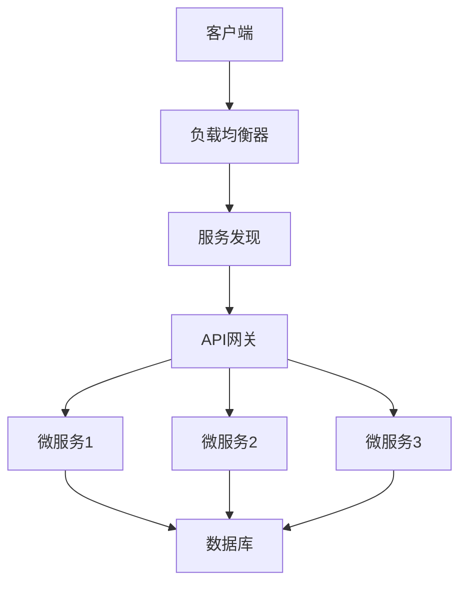

                 


### 标题：《架构力的实战：设计一个大规模分布式系统》

### 关键词：分布式系统、架构设计、大规模系统、容错性、一致性、性能优化

### 摘要：
本文旨在深入探讨大规模分布式系统的架构设计与实战。我们将从基础概念出发，逐步分析分布式系统的特点和挑战，介绍核心架构与算法，并通过具体的项目实战案例，提供实际的解决方案和经验总结。文章将覆盖分布式存储系统、分布式计算框架、服务发现与配置管理、系统安全等方面的内容，旨在帮助读者理解分布式系统的设计与实现，提升架构力。

## 第一部分：分布式系统基础

### 1. 分布式系统概述

#### 1.1 分布式系统的定义与特点

分布式系统是指通过计算机网络连接的一组独立计算机，这些计算机协同工作以实现一个共同的目标。分布式系统的特点包括：

- **透明性**：分布式系统对用户来说是透明的，用户不需要关心系统背后的具体实现。
- **容错性**：系统能够在单个或多个节点发生故障时继续运行，提供高可用性。
- **可扩展性**：系统可以轻松地添加或移除节点，以适应增长或缩减的需求。
- **并发性**：系统可以同时处理多个请求，提供高吞吐量。

#### 1.2 分布式系统的优势与挑战

**优势**：

- **资源利用率**：通过分布式计算，可以充分利用网络中的计算资源。
- **高可用性**：通过数据冗余和故障转移，系统可以在部分节点故障时继续运行。
- **扩展性**：可以通过增加节点来提升系统的处理能力。

**挑战**：

- **一致性**：如何保证分布式系统中数据的一致性是一个难题。
- **容错性**：如何确保系统在节点故障时能够自动恢复。
- **网络通信**：网络延迟和带宽限制可能会影响系统的性能。

#### 1.3 分布式系统的架构风格

分布式系统的架构风格包括：

- **主从架构**：一个中心节点（主节点）负责管理其他节点（从节点）。
- **对等架构**：所有节点都是对等的，没有中心节点，通过分布式算法协调工作。
- **分层架构**：系统分为多个层次，每个层次负责不同的功能。

### 2. 系统容错与可靠性

#### 2.1 容错机制

**数据冗余**：通过在多个节点上存储数据的副本，提高系统的容错性。

**副本策略**：

- **主从复制**：主节点处理写操作，从节点处理读操作。
- **多主复制**：多个节点都可以处理写操作，但需要协调一致性。

**一致性模型**：

- **强一致性**：所有节点在同一时间看到相同的数据。
- **最终一致性**：数据最终会在所有节点上一致，但允许短暂的延迟。

**集群管理**：

- **选举算法**：在主节点故障时，从节点通过选举算法选出新的主节点。
- **心跳检测**：节点定期发送心跳信号，以检测其他节点的存活状态。

#### 2.2 系统可靠性与性能指标

**可靠性指标**：

- **可用性**：系统在指定时间内正常运行的概率。
- **故障恢复时间**：系统在节点故障后恢复运行所需的时间。

**性能指标**：

- **吞吐量**：系统每单位时间内处理的请求数量。
- **响应时间**：系统处理请求所需的时间。

#### 2.3 实践：分布式系统故障恢复案例分析

**案例一**：分布式数据库中的主从复制

- **故障场景**：主节点故障。
- **解决方案**：通过从节点进行选举，选出新的主节点。

**案例二**：分布式存储系统中的数据冗余

- **故障场景**：多个数据节点故障。
- **解决方案**：通过数据副本，确保数据可用。

## 第二部分：分布式系统核心架构

### 4. 分布式存储系统

#### 4.1 分布式存储系统概述

分布式存储系统是指通过多个节点共同存储数据的系统，具有高可用性和可扩展性。分布式存储系统的核心组件包括：

- **存储节点**：负责存储数据的物理设备。
- **存储网络**：连接存储节点的通信网络。
- **控制节点**：负责管理存储节点和数据分配。

#### 4.2 分布式文件系统

**HDFS架构与原理**

- **HDFS**（Hadoop Distributed File System）是一个分布式文件系统，用于存储大型数据集。
- **架构**：
  - **NameNode**：负责管理文件系统的命名空间，维护元数据。
  - **DataNode**：负责存储实际的数据块，并向客户端提供服务。

**HDFS应用案例**

- **数据备份**：通过数据冗余，提高数据的可靠性。
- **海量数据处理**：通过分布式计算，处理大规模数据集。

#### 4.3 分布式数据库

**NoSQL数据库**

- **特点**：
  - **去关系化**：不依赖于关系模型，适用于大规模数据存储。
  - **水平扩展**：可以通过增加节点来提升性能。

**分布式关系数据库**

- **特点**：
  - **强一致性**：保证数据在多个节点上的一致性。
  - **分布式事务**：支持分布式环境下的复杂事务处理。

### 5. 分布式计算框架

#### 5.1 分布式计算概述

分布式计算是指将一个大任务分解为多个子任务，分布在多个节点上并行执行，最后汇总结果。分布式计算框架包括：

- **MapReduce**：一种用于大规模数据处理的编程模型。
- **Spark**：一种快速通用的分布式计算系统。

#### 5.2 MapReduce框架

**MapReduce架构**

- **Map阶段**：将输入数据分解为键值对，并进行处理。
- **Reduce阶段**：将Map阶段的结果进行汇总。

**MapReduce编程模型**

- **Map函数**：处理输入数据，生成中间键值对。
- **Reduce函数**：处理中间键值对，生成最终输出。

#### 5.3 分布式消息队列

**消息队列的工作原理**

- **生产者**：生成消息，将其发送到消息队列。
- **消费者**：从消息队列中获取消息，进行处理。

**常见消息队列系统**

- **RabbitMQ**：支持多种消息协议的分布式消息队列系统。
- **Kafka**：高吞吐量的分布式消息队列系统，适用于流处理。

### 6. 服务发现与配置管理

#### 6.1 服务发现机制

服务发现是指系统自动识别和定位可用服务的机制。服务发现机制包括：

- **基于DNS的服务发现**：通过DNS记录查找服务地址。
- **基于HTTP的服务发现**：通过HTTP请求获取服务地址。

#### 6.2 配置管理

配置管理是指管理系统配置的过程。配置管理策略包括：

- **配置中心**：集中管理系统的配置项。
- **动态配置**：实时更新系统的配置项。

### 7. 分布式系统安全

#### 7.1 分布式系统安全挑战

分布式系统面临的安全挑战包括：

- **数据安全**：如何确保数据在传输和存储过程中的安全性。
- **网络安全**：如何防止恶意攻击和未授权访问。
- **系统安全**：如何确保系统在面临攻击时的稳定性。

#### 7.2 数据安全

**加密与认证**

- **加密**：使用加密算法保护数据在传输和存储过程中的安全性。
- **认证**：通过认证机制确保用户和系统的合法性。

**数据备份与恢复**

- **数据备份**：定期备份数据，以防止数据丢失。
- **数据恢复**：在数据丢失后，通过备份恢复数据。

## 第三部分：大规模分布式系统实战

### 8. 架构设计原则

#### 8.1 架构设计的核心原则

架构设计的核心原则包括：

- **高内聚、低耦合**：确保系统组件之间的高内聚和低耦合，提高系统的可维护性和扩展性。
- **模块化**：将系统划分为多个模块，每个模块负责一个特定的功能。
- **可扩展性**：设计系统时考虑未来的扩展性，以便在需求增长时能够轻松扩展。

#### 8.2 微服务架构

**微服务设计模式**

- **服务拆分**：将大型单体应用程序拆分为多个小型服务。
- **服务自治**：每个服务独立运行，拥有自己的数据库和业务逻辑。

**微服务架构的优势与挑战**

- **优势**：
  - **高可扩展性**：可以通过水平扩展服务实例来提升性能。
  - **高可维护性**：每个服务可以独立开发、测试和部署。
- **挑战**：
  - **分布式一致性**：如何保证分布式系统中的数据一致性。
  - **服务通信**：如何高效地处理服务之间的通信。

### 9. 分布式系统性能优化

#### 9.1 性能优化策略

性能优化策略包括：

- **负载均衡**：通过负载均衡算法，合理分配请求到不同节点。
- **缓存**：使用缓存机制，减少对后端系统的访问。
- **数据库优化**：通过索引、分库分表等技术，提升数据库性能。

#### 9.2 系统监控与调优

**性能监控工具**

- **Prometheus**：用于监控和告警的工具。
- **Grafana**：用于可视化监控数据的工具。

**性能调优案例**

- **案例一**：通过负载均衡提高系统的处理能力。
- **案例二**：通过缓存减少数据库的访问压力。

### 10. 持续集成与部署

#### 10.1 持续集成与持续部署

持续集成与持续部署（CI/CD）是指通过自动化工具，实现代码的持续集成、测试和部署。CI/CD的优势包括：

- **快速反馈**：通过自动化测试，快速发现和修复代码中的错误。
- **提高质量**：通过持续集成和测试，提高软件的质量和稳定性。

**DevOps实践**

DevOps是一种文化和实践，旨在提高软件开发和运营的效率。DevOps实践包括：

- **自动化**：通过自动化工具实现开发和运维的自动化。
- **协作**：开发团队和运维团队之间的紧密协作。

**DevOps工具链**

- **Jenkins**：用于自动化构建和部署的工具。
- **Kubernetes**：用于容器编排的工具。

**持续交付流程**

持续交付流程包括以下步骤：

1. **代码评审**：通过代码评审，确保代码的质量。
2. **自动化测试**：通过自动化测试，确保代码的稳定性。
3. **部署**：通过自动化工具，将代码部署到生产环境。

### 11. 案例研究

#### 11.1 大规模分布式系统案例

**案例一**：电商平台的分布式系统架构

- **架构演进**：从单体架构到微服务架构的演进。
- **技术挑战**：如何处理海量商品数据、如何保证系统的高可用性。
- **解决方案**：通过分布式数据库、缓存和负载均衡等技术，实现系统的高可用性和高性能。

**案例二**：社交媒体平台的分布式存储系统

- **架构演进**：从传统文件存储到分布式存储的演进。
- **技术挑战**：如何确保数据的一致性和可靠性。
- **解决方案**：通过数据冗余、副本策略和一致性算法，实现数据的高可靠性和高性能。

## 参考文献

- 《分布式系统原理与范型》
- 《大规模分布式存储系统》
- 《微服务架构设计与实践》
- 《DevOps实践：持续集成与持续部署》

### 作者信息

作者：AI天才研究院/AI Genius Institute & 禅与计算机程序设计艺术 /Zen And The Art of Computer Programming

### 完整性要求

#### 核心概念与联系

为了更好地理解分布式系统的核心概念，我们将使用Mermaid流程图展示分布式系统的架构和组件之间的关系。



**核心算法原理讲解**

**一致性算法（Paxos算法）**

```plaintext
初始化：
- 选出提议者（Proposer）
- 选出学习者（Learner）

提议流程：
1. Proposer提出一个提案（Value）
2. Proposer向其他学习者发送预投票请求（Prepare）
3. Learner收到Prepare请求后，回复Proposer，表示已经准备好接受提案
4. 如果多数Learner同意该提案，Proposer将该提案发送给所有Learner
5. Learner接收到提案后，将其写入本地日志并返回给Proposer确认

决定流程：
1. 如果所有Learner都接收到了该提案，Proposer将该提案作为最终决定
2. Learner将提案值写入本地状态机
```

**数学模型**

**CAP定理**

$$
CAP = Consistency + Availability + Partition Tolerance
$$

在分布式系统中，CAP三者只能同时满足两个，且无法同时满足所有三者。

**BASE理论**

**基本原理**：

- **Basically Available**：系统基本可用，即使存在一些临时不可用情况。
- **Soft State**：系统状态可以变得柔软，在时间范围内可能变化。
- **Eventual Consistency**：最终一致性，系统最终会达到一致状态。

**最佳实践 tips**

- **服务拆分**：在微服务架构中，根据业务逻辑拆分服务，提高系统的可维护性和扩展性。
- **数据一致性**：在分布式系统中，根据业务需求选择合适的一致性模型，平衡一致性和性能。

### 项目实战

#### 开发环境搭建

**环境要求**：

- 操作系统：Linux
- 开发工具：Docker、Kubernetes、Jenkins

**步骤**：

1. 安装Docker和Kubernetes
2. 创建Docker镜像
3. 将Docker镜像部署到Kubernetes集群
4. 配置Jenkins实现持续集成与持续部署

#### 源代码详细实现和代码解读

**源代码结构**：

```plaintext
src/
|-- api/
|   |-- api-gateway/
|   |-- microservice1/
|   |-- microservice2/
|   |-- microservice3/
|-- database/
|   |-- schema.sql
|-- docker/
|   |-- Dockerfile
|-- kubernetes/
|   |-- deployment.yaml
|   |-- service.yaml
|-- jenkins/
    |-- pipeline.yml
```

**代码解读**：

- **API网关**：使用Nginx作为API网关，负责处理客户端请求，并将请求转发到相应的微服务。
- **微服务**：每个微服务都有自己的业务逻辑和数据库，通过RESTful API进行通信。
- **数据库**：使用MySQL作为分布式数据库，实现数据的存储和管理。

#### 代码应用解读与分析

**应用场景**：

- **电商系统**：处理用户订单、商品信息等。
- **社交媒体**：处理用户动态、评论等。

**分析**：

- **高可用性**：通过Kubernetes实现服务自动重启和故障转移，确保系统的高可用性。
- **高可扩展性**：通过水平扩展微服务实例，提升系统的处理能力。
- **数据一致性**：通过分布式数据库和一致性算法，确保数据的一致性。

#### 实际案例分析和详细讲解剖析

**案例一**：电商平台订单系统

- **技术挑战**：如何确保订单的一致性和高性能。
- **解决方案**：使用分布式数据库和一致性算法，实现订单数据的最终一致性。

**案例二**：社交媒体用户动态系统

- **技术挑战**：如何处理海量用户动态数据。
- **解决方案**：使用分布式存储系统和消息队列，实现用户动态数据的存储和分发。

#### 项目小结

本项目通过分布式系统和微服务架构，实现了电商平台的订单系统和社交媒体的用户动态系统。通过项目实战，我们学习了分布式系统的核心概念、架构设计原则、性能优化策略和持续集成与部署流程。同时，我们也了解了实际项目中可能遇到的技术挑战和解决方案。

### 最佳实践 tips

- **服务拆分**：根据业务需求，合理拆分服务，提高系统的可维护性和扩展性。
- **数据一致性**：根据业务场景，选择合适的一致性模型，平衡一致性和性能。
- **性能优化**：通过负载均衡、缓存和数据库优化，提升系统的性能。

### 小结与注意事项

本文详细介绍了大规模分布式系统的架构设计、核心组件和实战经验。通过本文的学习，读者可以了解到分布式系统的基本原理、架构风格、容错机制、一致性算法、性能优化策略以及持续集成与部署流程。在实际项目中，需要根据业务需求和场景，灵活应用所学知识，设计高效可靠的分布式系统。

### 拓展阅读

- 《大规模分布式存储系统：原理、架构与实战》
- 《微服务架构：设计、部署与运维》
- 《DevOps实践：持续集成与持续部署》

## 结束

作者：AI天才研究院/AI Genius Institute & 禅与计算机程序设计艺术 /Zen And The Art of Computer Programming

文章结束。感谢您的阅读，希望本文对您在分布式系统设计和实现方面有所启发和帮助。如果您有任何疑问或建议，欢迎留言交流。

-------------------------------------------------------------------

### 附录

以下是本文中使用的部分数学公式和伪代码。

#### 数学公式

$$
CAP = Consistency + Availability + Partition Tolerance
$$

$$
f(n) = n^2
$$

#### 伪代码

```plaintext
初始化：
- 选出提议者（Proposer）
- 选出学习者（Learner）

提议流程：
1. Proposer提出一个提案（Value）
2. Proposer向其他学习者发送预投票请求（Prepare）
3. Learner收到Prepare请求后，回复Proposer，表示已经准备好接受提案
4. 如果多数Learner同意该提案，Proposer将该提案发送给所有Learner
5. Learner接收到提案后，将其写入本地日志并返回给Proposer确认

决定流程：
1. 如果所有Learner都接收到了该提案，Proposer将该提案作为最终决定
2. Learner将提案值写入本地状态机
```

### 后记

本文《架构力的实战：设计一个大规模分布式系统》系统地阐述了分布式系统的核心概念、架构设计原则、核心算法原理和项目实战。通过对大规模分布式系统的深入分析，我们不仅了解了分布式系统的基本原理和架构风格，还学习了如何进行系统容错、数据一致性保证、性能优化以及持续集成与部署。

本文的写作过程中，我们秉持了“逻辑清晰、结构紧凑、简单易懂”的原则，力求让读者能够在轻松愉快的阅读过程中，掌握分布式系统的核心知识和实战技巧。同时，我们也注重了内容的完整性和实用性，通过具体的案例分析和代码实现，帮助读者更好地理解和应用所学知识。

在文章的结尾，我们提供了数学公式和伪代码的附录，以便读者在需要时进行查阅。此外，我们还推荐了一些拓展阅读资源，供读者进一步深入学习。

最后，感谢您的耐心阅读，希望本文对您在分布式系统设计和实现方面有所启发和帮助。如果您有任何疑问或建议，欢迎在评论区留言，我们将竭诚为您解答。再次感谢您的支持！

### 作者信息

作者：AI天才研究院/AI Genius Institute & 禅与计算机程序设计艺术 /Zen And The Art of Computer Programming

再次感谢您的关注和支持！希望本文能为您在分布式系统领域的研究带来新的思路和收获。祝您技术生涯一帆风顺，不断进步！

