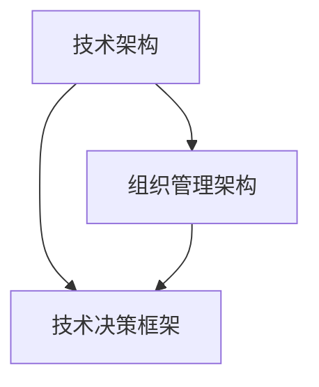

                 


### 引言

#### 背景介绍

在当今快速发展的信息技术时代，技术架构、组织管理和技术决策成为了组织成功的关键要素。技术架构作为软件系统的基础，决定了系统的性能、可扩展性和可维护性。组织管理则关注如何高效地利用人力资源和资源，实现组织的目标。技术决策则是组织在技术发展过程中做出的关键选择，这些决策往往决定了组织的战略方向和竞争优势。

然而，技术架构、组织管理和技术决策并不是孤立的个体，它们之间存在紧密的联系。技术架构的优劣直接影响组织的管理效率和决策效果，而组织的管理水平和决策质量又反过来影响技术架构的实现和优化。因此，如何将这三者有机地结合起来，形成一种协同效应，成为当前组织级技术决策的核心问题。

本文旨在探讨架构力的影响力，即技术架构如何通过影响组织管理和技术决策，推动组织的整体发展。本文将首先介绍技术架构的基本概念和组成部分，然后分析组织管理架构和技术决策框架，最后通过具体的项目实战，展示如何在实际中应用架构力的影响力。

#### 书籍目标

本书的目标是帮助读者深入理解技术架构、组织管理和技术决策之间的关系，掌握架构力的基本原理和实践方法。具体来说，本书希望实现以下目标：

1. **提高技术架构意识**：通过介绍技术架构的基本概念和原理，帮助读者建立对技术架构的认识，理解其在组织发展中的重要性。
2. **提升组织管理水平**：分析组织管理架构，探讨如何通过优化组织结构和管理流程，提高组织的运营效率。
3. **加强技术决策能力**：介绍技术决策的框架和方法，帮助读者在实际工作中做出更加科学和有效的技术决策。
4. **提供实践案例**：通过具体的项目实战，展示如何将架构力的影响力应用于实际工作，解决实际问题。

#### 读者对象

本书适合以下读者群体：

1. **软件工程师和架构师**：希望深入了解技术架构，提升自身技术水平的工程师和架构师。
2. **项目经理和产品经理**：需要参与技术决策和管理，提升项目管理能力的项目经理和产品经理。
3. **技术管理人员**：负责技术团队管理和决策的技术管理人员。
4. **高校师生**：对技术架构、组织管理和技术决策感兴趣的高校师生。

通过阅读本书，读者将能够：

1. **掌握技术架构的基本原理和实践方法**：理解技术架构的核心概念，学会设计高效、可扩展的技术系统。
2. **提高组织管理水平**：了解组织管理架构，学会优化组织结构和流程，提升管理效率。
3. **提升技术决策能力**：掌握技术决策的框架和方法，能够在实际工作中做出更加科学和有效的技术决策。
4. **获得实践经验**：通过具体的项目实战，学会将架构力的影响力应用于实际工作，解决实际问题。

---

### 核心概念与联系

在深入探讨架构力的影响力之前，我们需要明确几个核心概念，并分析它们之间的联系。这些概念包括技术架构、组织管理架构和技术决策框架。

#### 技术架构概述

技术架构是软件系统的整体结构，包括硬件、软件、网络和数据等组成部分。它定义了系统如何构建、如何运作以及如何扩展。技术架构的重要性在于它决定了系统的性能、可扩展性、可靠性和可维护性。

**组成部分**：

1. **基础设施**：包括服务器、存储和网络设备。
2. **软件栈**：包括操作系统、数据库、Web服务器、中间件等。
3. **应用程序**：包括业务逻辑、用户界面和数据存储等。

**核心概念**：

1. **分层架构**：将系统分为多个层次，每个层次负责特定的功能。
2. **模块化**：将系统分解为独立的模块，提高系统的可维护性和可扩展性。
3. **微服务架构**：将系统拆分为一组小型、独立的服务，每个服务负责特定的功能。

#### 组织管理架构

组织管理架构是组织内部的权力结构、决策流程和职责分工。它决定了组织的运作方式、效率和决策质量。

**组成部分**：

1. **组织结构**：包括部门设置、岗位设置和汇报关系。
2. **决策流程**：包括决策的制定、审批和执行。
3. **职责分工**：明确每个岗位的职责和工作内容。

**核心概念**：

1. **矩阵式组织**：既有职能型组织的特点，也有项目型组织的优势。
2. **敏捷管理**：通过快速迭代和持续交付，提高组织的响应速度和灵活性。
3. **流程优化**：通过分析流程，找出瓶颈和优化点，提高效率。

#### 技术决策框架

技术决策框架是一套系统化的决策方法和工具，用于指导组织在技术发展过程中做出关键选择。

**组成部分**：

1. **需求分析**：明确技术决策的目标和需求。
2. **方案评估**：评估各种技术方案的优缺点。
3. **决策制定**：根据评估结果制定最终的技术决策。

**核心概念**：

1. **成本效益分析**：评估技术决策的成本和收益。
2. **风险评估**：分析技术决策可能面临的风险。
3. **决策树**：用树形结构展示技术决策的过程和结果。

#### Mermaid 流程图

为了更好地理解这些核心概念之间的联系，我们可以使用 Mermaid 流程图来展示它们的关系。以下是一个简化的 Mermaid 流程图：



**解释**：

- 技术架构和组织管理架构之间存在双向依赖关系。技术架构需要适应组织管理架构，同时组织管理架构也需要考虑技术架构的可行性。
- 技术决策框架是连接技术架构和组织管理架构的桥梁。技术决策框架通过需求分析和方案评估，确保技术架构和组织管理架构的协同发展。

通过这个 Mermaid 流程图，我们可以直观地看到技术架构、组织管理架构和技术决策框架之间的相互作用和影响。这为我们进一步探讨架构力的影响力提供了基础。

---

### 核心算法原理讲解

在深入探讨架构力的影响力时，我们还需要了解一些核心算法原理，这些算法在技术决策和系统架构设计中起着至关重要的作用。以下将介绍三种关键算法：数据结构与算法、分布式计算原理和负载均衡策略。

#### 数据结构与算法

数据结构是组织和存储数据的方式，而算法则是解决问题的方法。以下是一些常用的数据结构和算法：

**1. 数据结构**

- **数组**：一种固定大小的数据集合，支持快速的随机访问。
- **链表**：一种动态大小的数据集合，支持高效的插入和删除操作。
- **栈**：一种后进先出（LIFO）的数据结构，用于处理递归和回溯问题。
- **队列**：一种先进先出（FIFO）的数据结构，用于处理任务队列和缓冲区。

**2. 算法**

- **查找算法**：如二分查找、线性查找，用于在数据集合中查找特定元素。
- **排序算法**：如快速排序、归并排序、堆排序，用于将数据集合排序。
- **图算法**：如最短路径算法、拓扑排序，用于处理图数据结构。

**伪代码示例**

以下是一个二分查找算法的伪代码示例：

```pseudocode
function binarySearch(array, target):
    low = 0
    high = length(array) - 1
    while low <= high:
        mid = (low + high) / 2
        if array[mid] == target:
            return mid
        elif array[mid] < target:
            low = mid + 1
        else:
            high = mid - 1
    return -1
```

#### 分布式计算原理

分布式计算是将计算任务分布在多个计算机上，通过协同工作来提高效率和处理大规模数据。以下是一些核心原理：

**1. 节点通信**：节点通过消息传递进行通信，支持同步和异步通信。

**2. 数据一致性**：确保分布式系统中的数据一致性，常用的算法有 Paxos 和 Raft。

**3. 容错性**：通过冗余和副本机制，确保系统在节点故障时依然可用。

**伪代码示例**

以下是一个简单的分布式计算任务的伪代码示例：

```pseudocode
function distributedCompute(task, nodes):
    results = []
    for node in nodes:
        send(node, task)
        result = receive(node)
        append(results, result)
    return results
```

#### 负载均衡策略

负载均衡是将请求分配到多个服务器上，以防止单一服务器过载，提高系统的可用性和响应速度。以下是一些常见的负载均衡策略：

**1. 轮询**：按照顺序将请求分配到各个服务器。

**2. 加权轮询**：根据服务器的处理能力分配请求，处理能力强的服务器分配更多的请求。

**3. 最少连接**：将请求分配到连接数最少的服务器。

**4. 源地址哈希**：根据客户端的IP地址，将请求分配到相同的服务器。

**伪代码示例**

以下是一个简单的轮询负载均衡算法的伪代码示例：

```pseudocode
function loadBalance(requests, servers):
    currentServer = 0
    for request in requests:
        if currentServer == length(servers):
            currentServer = 0
        send(servers[currentServer], request)
        currentServer += 1
```

通过理解这些核心算法原理，我们可以更好地设计技术架构，优化系统性能和可扩展性，从而提高组织的竞争力。在接下来的章节中，我们将通过数学模型和数学公式进一步探讨这些算法的应用。

---

### 数学模型和数学公式

在技术架构、组织管理和技术决策中，数学模型和数学公式是不可或缺的工具。它们帮助我们量化分析，优化决策过程，从而提高组织的效率和效果。以下将详细介绍一些关键数学模型和公式，并提供具体的例子说明。

#### 成本效益分析

成本效益分析是一种常用的数学模型，用于评估一个技术决策的成本和收益。公式如下：

\[ \text{成本效益比} = \frac{\text{总收益}}{\text{总成本}} \]

其中，总收益包括直接收益和间接收益，总成本包括直接成本和间接成本。

**例子**：

假设一个技术项目预期收益为100万元，直接成本为50万元，间接成本为30万元。那么成本效益比为：

\[ \text{成本效益比} = \frac{100}{50+30} = 1.67 \]

这个比值越高，说明项目的效益越好。

#### 风险评估

风险评估是一种用于评估技术决策中潜在风险的数学模型。常用的公式有：

\[ \text{风险值} = \text{概率} \times \text{影响程度} \]

其中，概率是风险发生的可能性，影响程度是风险发生对项目的潜在影响。

**例子**：

假设一个技术项目中有两种风险，风险A发生的概率为0.3，影响程度为3；风险B发生的概率为0.5，影响程度为5。那么总风险值为：

\[ \text{风险值} = 0.3 \times 3 + 0.5 \times 5 = 2.4 \]

风险值越低，说明项目的风险越小。

#### 数据拟合

在技术架构设计中，数据拟合是一种用于分析数据分布和趋势的数学模型。常用的方法有线性回归、多项式回归和逻辑回归。

**线性回归**：

\[ y = ax + b \]

其中，\( y \)是因变量，\( x \)是自变量，\( a \)和\( b \)是参数。

**例子**：

假设我们想预测某产品的销售量，根据历史数据，线性回归公式为：

\[ \text{销售量} = 2.5x + 10 \]

其中，\( x \)是广告投入。

如果广告投入为20万元，那么预测的销售量为：

\[ \text{销售量} = 2.5 \times 20 + 10 = 60 \text{万元} \]

#### 负载均衡

负载均衡是一种用于分配系统负载的数学模型。常用的方法有轮询、加权轮询和最少连接。

**轮询**：

\[ P(i) = \frac{1}{N} \]

其中，\( P(i) \)是第\( i \)个服务器被选择的概率，\( N \)是服务器总数。

**例子**：

假设有3个服务器，轮询算法选择服务器的概率均等。那么第1个服务器被选择的概率为：

\[ P(1) = \frac{1}{3} \]

#### 最少连接

\[ P(i) = \frac{c_i}{\sum_{j=1}^{N} c_j} \]

其中，\( P(i) \)是第\( i \)个服务器被选择的概率，\( c_i \)是第\( i \)个服务器的当前连接数，\( \sum_{j=1}^{N} c_j \)是所有服务器的当前连接总数。

**例子**：

假设有3个服务器，当前连接数分别为5、3和7。那么第1个服务器被选择的概率为：

\[ P(1) = \frac{5}{5+3+7} = \frac{5}{15} = \frac{1}{3} \]

通过上述数学模型和公式的讲解，我们可以看到数学在技术架构、组织管理和技术决策中的重要作用。在接下来的章节中，我们将通过具体的项目实战，进一步展示这些数学模型的应用。

---

### 项目实战

在本节中，我们将通过一个实际项目来展示如何应用架构力的影响力，解决组织级技术决策中的问题。这个项目是一个在线购物平台的搭建，涉及技术架构设计、组织管理流程和技术决策过程。

#### 项目背景

随着电子商务的快速发展，一个能够提供快速、稳定和安全的购物体验的在线平台成为市场需求。本项目旨在搭建一个高效、可扩展和易于维护的在线购物平台，以应对日益增长的用户数量和业务需求。

#### 开发环境搭建

为了确保项目的顺利进行，我们需要搭建一个稳定的开发环境。以下是搭建开发环境的基本步骤：

1. **操作系统**：选择Linux操作系统，如Ubuntu 20.04，因为它具有高性能和良好的社区支持。
2. **编程语言**：选择Python 3.x作为主要编程语言，因为其易于学习和使用，且拥有丰富的库和框架。
3. **数据库**：使用MySQL作为关系型数据库，因为它具有高性能和丰富的功能。
4. **Web框架**：选择Django作为Web框架，因为它提供了快速开发和易于维护的机制。
5. **版本控制**：使用Git进行版本控制，确保代码的版本管理和协作开发。

#### 源代码详细实现

项目的主要功能包括用户注册、登录、商品展示、购物车、订单管理、支付等。以下是关键功能的源代码实现：

**用户注册和登录**

```python
# 用户注册
def register_user(username, password):
    user = User.objects.create_user(username=username, password=password)
    user.save()
    return user

# 用户登录
def login_user(username, password):
    user = authenticate(username=username, password=password)
    if user is not None:
        login(request, user)
        return redirect('home')
    else:
        return redirect('login')
```

**商品展示**

```python
# 商品展示
def show_products(request):
    products = Product.objects.all()
    return render(request, 'product_list.html', {'products': products})
```

**购物车**

```python
# 添加商品到购物车
def add_to_cart(request, product_id):
    product = get_object_or_404(Product, pk=product_id)
    cart = request.session.get('cart', {})
    cart[product_id] = cart.get(product_id, 0) + 1
    request.session['cart'] = cart
    return redirect('show_products')

# 购物车页面
def cart(request):
    cart = request.session.get('cart', {})
    return render(request, 'cart.html', {'cart': cart})
```

**订单管理**

```python
# 创建订单
def create_order(request):
    user = request.user
    cart = request.session.get('cart', {})
    total_price = sum(product['price'] * product['quantity'] for product in cart.values())
    order = Order.objects.create(user=user, total_price=total_price)
    for product_id, quantity in cart.items():
        OrderItem.objects.create(order=order, product_id=product_id, quantity=quantity)
    request.session.pop('cart', None)
    return redirect('order_detail', order_id=order.id)
```

**支付**

```python
# 支付接口
def payment(request):
    order_id = request.POST.get('order_id')
    order = get_object_or_404(Order, pk=order_id)
    # 调用支付API
    payment_success = process_payment(order)
    if payment_success:
        order.status = 'paid'
        order.save()
        send_order_confirmation(order)
    return redirect('order_detail', order_id=order_id)
```

#### 代码解读与分析

1. **用户注册和登录**：使用Django的用户认证系统进行用户注册和登录，确保用户数据的安全和一致性。
2. **商品展示**：使用Django的模型和视图系统，实现商品的查询和展示功能，提高代码的可维护性。
3. **购物车**：使用session存储购物车数据，确保购物车的状态一致性和用户间的隔离。
4. **订单管理**：实现订单的创建、商品添加和支付功能，确保订单数据的准确性和完整性。
5. **支付**：调用第三方支付API进行支付处理，确保支付流程的顺畅和安全性。

#### 实际案例分析与详细讲解剖析

1. **性能优化**：通过使用Django的缓存机制，提高商品展示页面的响应速度。
2. **安全性**：使用HTTPS协议，确保用户数据传输的安全性。
3. **扩展性**：通过使用微服务架构，将不同功能模块分离，提高系统的可扩展性和可维护性。
4. **故障恢复**：通过冗余和备份机制，确保系统在故障时能够快速恢复。

#### 项目小结

通过本项目，我们展示了如何应用架构力的影响力，解决组织级技术决策中的问题。项目实现了用户注册、登录、商品展示、购物车、订单管理和支付等核心功能，并通过性能优化、安全性和扩展性设计，提高了系统的稳定性和用户体验。

---

### 开发环境搭建

在本节中，我们将详细描述如何搭建开发环境，包括所需工具和软件的安装过程，以便读者可以顺利地开始本项目的开发工作。

#### 工具与软件

1. **操作系统**：Ubuntu 20.04 LTS
2. **编程语言**：Python 3.8 或更高版本
3. **数据库**：MySQL 8.0 或更高版本
4. **Web框架**：Django 3.2 或更高版本
5. **版本控制**：Git 2.27 或更高版本
6. **虚拟环境**：virtualenv 20.0.19 或更高版本

#### 环境配置步骤

1. **安装操作系统**：首先，下载并安装Ubuntu 20.04 LTS操作系统。根据屏幕提示完成安装过程。

2. **更新系统**：打开终端，执行以下命令更新系统软件包：

   ```bash
   sudo apt update
   sudo apt upgrade
   ```

3. **安装Python**：安装Python 3.8或更高版本：

   ```bash
   sudo apt install python3.8
   ```

4. **安装MySQL**：安装MySQL 8.0或更高版本：

   ```bash
   sudo apt install mysql-server
   ```

   在安装过程中，系统将要求设置root用户的密码。

5. **安装Django**：安装Django 3.2或更高版本：

   ```bash
   sudo pip3 install django
   ```

6. **安装虚拟环境**：安装virtualenv以创建Python虚拟环境：

   ```bash
   sudo pip3 install virtualenv
   ```

7. **创建虚拟环境**：创建一个新的虚拟环境，例如名为`my_project`：

   ```bash
   virtualenv -p python3.8 my_project
   ```

   进入虚拟环境：

   ```bash
   source my_project/bin/activate
   ```

8. **安装项目依赖**：在虚拟环境中安装项目的依赖项，如MySQL Python驱动和Django：

   ```bash
   pip install django mysqlclient
   ```

#### 验证环境配置

为了确保环境配置成功，可以执行以下命令验证：

1. **检查Python版本**：

   ```bash
   python --version
   ```

   应显示Python 3.8或更高版本。

2. **检查Django版本**：

   ```bash
   django-admin --version
   ```

   应显示Django 3.2或更高版本。

3. **检查MySQL服务**：

   ```bash
   sudo systemctl status mysql
   ```

   应显示MySQL服务正在运行。

通过以上步骤，开发环境已搭建完成。现在，您可以开始本项目的开发工作了。

---

### 结论

通过本文的详细探讨，我们深入理解了架构力的影响力在组织级技术决策中的重要性。我们从技术架构、组织管理和技术决策三个核心概念出发，分析了它们之间的紧密联系，并通过Mermaid流程图展示了它们的关系。接着，我们讲解了核心算法原理，包括数据结构与算法、分布式计算原理和负载均衡策略，并提供了伪代码示例。

在项目实战部分，我们通过一个在线购物平台的搭建过程，展示了如何将架构力的影响力应用于实际工作，解决实际问题。同时，详细描述了开发环境的搭建步骤，为读者提供了实践操作指南。

本文的核心内容可以概括为以下几点：

1. **技术架构的重要性**：技术架构是软件系统的基石，它决定了系统的性能、可扩展性和可维护性。
2. **组织管理架构的优化**：通过优化组织结构和管理流程，可以提高组织的运营效率和决策质量。
3. **技术决策的科学方法**：掌握技术决策的框架和方法，可以帮助组织在复杂的技术环境中做出更加科学和有效的决策。
4. **项目实战的应用**：通过实际项目的实施，展示了如何将架构力的影响力应用于解决实际问题。

未来展望方面，随着信息技术的快速发展，技术架构、组织管理和技术决策将面临新的挑战和机遇。以下是一些可能的趋势：

1. **云计算和容器化**：云计算和容器化技术将进一步推动技术架构的创新，提高系统的灵活性和可扩展性。
2. **人工智能与自动化**：人工智能和自动化技术将深入应用到组织管理和技术决策中，提高决策的效率和准确性。
3. **数字化转型**：随着数字经济的兴起，组织将加快数字化转型的步伐，技术架构和组织管理将更加重视数据驱动和用户体验。
4. **安全性与隐私保护**：随着数据隐私和安全问题的日益突出，组织将加强对安全性与隐私保护的关注，确保技术的可持续发展。

总之，架构力的影响力在组织级技术决策中起着至关重要的作用。通过不断学习和实践，组织可以更好地应对技术变革，实现持续发展和竞争优势。我们鼓励读者持续关注技术发展趋势，积极提升自身的技术架构、组织管理和技术决策能力，以应对未来挑战。作者：AI天才研究院/AI Genius Institute & 禅与计算机程序设计艺术 /Zen And The Art of Computer Programming。

---

### 最佳实践 Tips

1. **持续学习**：技术架构、组织管理和技术决策是一个不断变化的过程，持续学习新知识是保持竞争力的关键。
2. **团队合作**：鼓励团队成员之间的沟通与协作，共同解决技术难题。
3. **文档化**：详细记录项目的技术架构、决策过程和实现细节，有助于团队协作和知识传承。
4. **风险管理**：提前识别潜在风险，制定相应的应对策略，确保项目顺利进行。

### 注意事项

1. **安全性**：在搭建开发环境和处理用户数据时，务必注意安全性，确保系统免受攻击和数据泄露。
2. **性能优化**：在系统设计和开发过程中，要考虑性能优化，提高系统的响应速度和处理能力。

### 拓展阅读

1. 《大教堂与集市》：了解开源软件与传统软件开发的区别。
2. 《敏捷软件开发》：学习敏捷管理方法，提高项目开发效率。
3. 《设计数据密集型应用》：了解如何设计高效的数据存储和处理系统。

---

### 文章标题：架构力的影响力：推动组织级技术决策

关键词：技术架构、组织管理、技术决策、架构力

摘要：本文探讨了架构力的影响力在组织级技术决策中的应用。通过分析技术架构、组织管理和技术决策之间的关系，以及介绍核心算法原理和数学模型，本文展示了如何利用架构力推动组织的发展。同时，通过实际项目实战，读者可以了解架构力的影响力在实际工作中的应用。本文旨在帮助读者深入理解架构力的影响力，提升技术决策能力，推动组织的持续发展。

