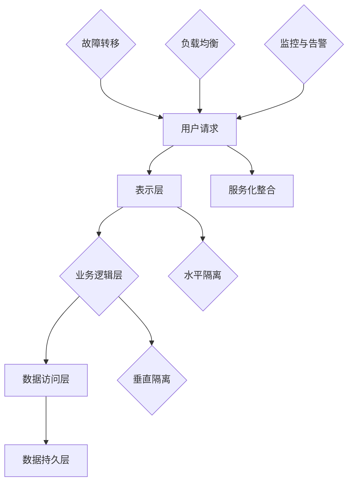

                 

### 文章标题：架构力的演进：从单一架构到多架构共存

关键词：架构力、单一架构、多架构共存、分布式架构、微服务架构、面向服务架构（SOA）、模型-视图-控制器（MVC）架构

摘要：
本文深入探讨了从单一架构向多架构共存演进的架构力，分析了当前IT架构的挑战，阐释了多架构共存的理论基础，并通过实践案例展示了多架构共存的实施策略和挑战。文章旨在为读者提供全面的架构力提升方案，帮助其在复杂技术环境中构建高效稳定的系统。

---

# 《架构力的演进：从单一架构到多架构共存》目录大纲

## 第一部分：引言与背景

### 1.1 书籍目的与结构概述

**核心概念与联系：**
- **架构力**：
  - 定义：架构力是指企业在构建、维护和优化系统架构过程中所展现的能力。
  - 重要性：架构力是企业实现技术驱动、提升竞争力的重要保障。
  - **与企业竞争力的关系**：架构力直接影响企业的技术战略、业务效率和创新能力。

- **单一架构与多架构共存**：
  - 演进历程：从早期单机架构到分布式架构，再到微服务架构，企业面临的技术环境越来越复杂。
  - 实践中的差异和挑战：单一架构在处理复杂业务需求时往往力不从心，多架构共存成为趋势。

### 1.2 当前IT架构的挑战

**核心概念与联系：**
- **云计算与分布式架构**：
  - 基本概念：云计算提供了弹性伸缩、分布式计算的能力。
  - 优势与局限：分布式架构提高了系统的可扩展性和容错性，但也带来了复杂性和管理难度。
  - **架构模式演变**：从早期的分布式系统到微服务架构，企业对架构的探索从未停止。

- **微服务架构**：
  - 定义：微服务架构是将大型应用拆分为多个小型、自治的服务单元。
  - 核心原则：独立性、可扩展性、可测试性、可部署性。
  - 对企业的影响：微服务架构带来了技术栈的多样性，提高了系统的灵活性和可维护性。

### 1.3 多架构共存的理论基础

**核心概念与联系：**
- **SOA（面向服务架构）**：
  - 基本概念：SOA是一种架构风格，强调服务的松耦合和重用性。
  - 服务组件：服务提供者、服务消费者、服务注册和发现机制。
  - 服务治理：服务生命周期管理、服务版本控制、服务性能监控。

- **MVC（模型-视图-控制器）架构**：
  - 架构模式：MVC将应用分为三个核心组件，实现模型与视图的分离。
  - 各组件功能：模型处理数据，视图展示数据，控制器处理用户输入和逻辑。
  - 应用场景：广泛应用于Web应用和移动应用的开发。

## 第二部分：单一架构的优化与实践

### 2.1 单一架构优化策略

**核心算法原理讲解：**
- **性能优化**：
  - 常用技术：缓存机制、数据库优化、并发处理。
  - 案例分析：通过具体案例展示性能优化策略的实施效果。

- **可扩展性优化**：
  - 模式：水平扩展、垂直扩展、分布式存储。
  - 挑战与解决：分析扩展过程中遇到的问题及解决方案。

### 2.2 单一架构实践案例

**项目实战：**
- **项目背景**：介绍项目的业务需求和目标。
- **架构设计**：详细阐述项目的架构设计思路和方案。
- **实施过程**：描述项目实施的关键步骤和决策。
- **成果与反思**：总结项目成果，分析经验教训。

## 第三部分：多架构共存的理论与实现

### 3.1 多架构共存的定义与原则

**核心概念与联系：**
- **多架构共存**：
  - 定义：多架构共存是指在同一系统中同时使用多种架构风格和模式。
  - 关键要素：分层架构、隔离与整合、灵活性与稳定性。

- **原则**：
  - **分层架构**：将系统划分为多个层次，各层次间解耦。
  - **隔离与整合**：实现不同架构间的隔离，同时保证系统集成。
  - **灵活性

---

### 3.1 多架构共存的定义与原则

多架构共存是指在同一个系统或企业内部，同时采用多种不同的架构风格和模式，以应对不同的业务需求和场景。这种共存模式能够提高系统的灵活性和适应性，但同时也增加了架构的复杂性和管理的难度。以下是多架构共存的关键定义和原则：

**核心概念与联系：**

**多架构共存：**
- **定义**：多架构共存是指在一个系统或企业内，根据不同的业务需求和场景，采用多种不同的架构风格和模式，以实现最佳的性能、可扩展性和维护性。
- **关键要素**：
  - **分层架构**：将系统划分为多个独立的层级，每个层级负责不同的功能，各层之间保持解耦。
  - **隔离与整合**：在多架构共存中，不同架构之间需要实现有效的隔离，以避免彼此之间的干扰，同时也需要实现必要的整合，以确保系统的一致性和完整性。
  - **灵活性**：多架构共存要求系统具有高度的灵活性，能够快速适应业务变化和技术演进。
  - **稳定性**：多架构共存系统需要具备良好的稳定性，即使在复杂的运行环境中，也能保持系统的正常运行。

**原则**：

- **分层架构**：
  - **定义**：分层架构将系统划分为多个层次，每个层次负责不同的功能。常见的分层包括表示层、业务逻辑层、数据访问层和数据持久层。
  - **各层间关系**：各层次之间通过接口进行通信，降低了层间的耦合度，提高了系统的可维护性和可扩展性。
  - **应用场景**：适用于复杂业务系统，特别是需要频繁变更的业务场景。

- **隔离与整合**：
  - **定义**：隔离是指将不同的架构组件相互独立，以避免它们之间的干扰。整合是指确保不同架构组件能够协同工作，实现系统的整体功能。
  - **实现策略**：
    - **水平隔离**：在同一层级内，将不同的架构组件部署在不同的环境中，如不同的服务器或集群。
    - **垂直隔离**：在垂直方向上，将不同的架构组件隔离在不同的层级中，如将前端和后端分离。
    - **服务化整合**：通过服务化的方式，将不同架构组件整合在一起，实现系统的整体功能。

- **灵活性**：
  - **定义**：灵活性是指系统能够快速适应业务需求变化和技术演进的能力。
  - **实现策略**：
    - **模块化设计**：将系统划分为多个模块，每个模块可以独立开发和部署，提高了系统的灵活性。
    - **动态配置**：通过动态配置，实现系统运行时对架构的调整，以满足不同的业务需求。
    - **自动化部署**：通过自动化部署工具，实现系统的快速部署和升级，提高了系统的灵活性。

- **稳定性**：
  - **定义**：稳定性是指系统在面临各种异常情况时，仍能保持正常运行的能力。
  - **实现策略**：
    - **故障转移**：在系统故障时，能够快速切换到备用系统，保证服务的连续性。
    - **负载均衡**：通过负载均衡器，将请求分配到不同的节点上，避免单点瓶颈。
    - **监控与告警**：通过监控和告警系统，实时监测系统的运行状态，及时发现和解决问题。

**示例 Mermaid 流程图**：

下面是一个简单的 Mermaid 流程图，展示了多架构共存中各个核心组件之间的关系：

### 3.2 多架构共存的技术基础

多架构共存不仅需要合理的架构设计，还需要依赖一系列技术基础来支持其实现。以下将介绍多架构共存所需的技术基础：

**核心算法原理讲解：**

- **容器化技术**：
  - **Docker基础**：
    - **定义**：Docker是一个开源的应用容器引擎，它允许开发者将应用程序及其依赖环境打包成一个轻量级的容器，以实现一次编写，到处运行。
    - **架构**：Docker基于容器引擎，将应用程序及其运行环境封装在容器中，实现了应用与环境的隔离。
    - **优势**：容器化技术提高了系统的可移植性、可扩展性和部署效率。

  - **Kubernetes架构**：
    - **定义**：Kubernetes是一个开源的容器编排平台，用于自动化部署、扩展和管理容器化应用程序。
    - **组件**：Kubernetes由多个组件组成，包括控制器管理器、调度器、节点、Pod等。
    - **优势**：Kubernetes提供了灵活的部署策略、负载均衡、服务发现和自动恢复功能。

- **微服务架构**：
  - **定义**：微服务架构是将大型应用拆分为多个小型、自治的服务单元，每个服务单元负责特定的功能。
  - **核心原则**：
    - **独立性**：每个服务单元独立部署、独立运行，降低了系统的复杂性。
    - **可扩展性**：服务单元可以根据需求独立扩展，提高了系统的可扩展性。
    - **可测试性**：每个服务单元可以独立测试，提高了测试的覆盖率。
    - **可部署性**：服务单元可以独立部署，减少了部署的风险和成本。

  - **服务治理**：
    - **服务注册与发现**：服务注册与发现机制用于管理服务的生命周期，包括服务的注册、发现和更新。
    - **服务网关**：服务网关负责路由和转换服务请求，实现了服务的统一入口。
    - **服务监控**：服务监控用于实时监测服务的运行状态，包括性能、可用性等指标。

**数学模型和数学公式 & 详细讲解 & 举例说明：**

在多架构共存中，数学模型和数学公式可以用于量化架构的复杂性、性能和成本等因素。以下是一些常用的数学模型：

1. **架构复杂性度量模型**：

   $$\text{Complexity} = f(\text{组件数量}, \text{组件间耦合度}, \text{系统规模})$$

   - **组件数量**：系统中的组件个数。
   - **组件间耦合度**：组件之间的依赖关系强度。
   - **系统规模**：系统的总体复杂度。

   通过该模型，可以量化系统架构的复杂性，帮助开发者识别和优化系统中的复杂部分。

2. **成本效益分析模型**：

   $$\text{ROI} = \frac{\text{净收益}}{\text{投资成本}}$$

   - **净收益**：系统优化带来的收益减去投资成本。
   - **投资成本**：系统优化所需的投资成本。

   通过该模型，可以评估多架构共存对企业带来的成本效益，为决策提供依据。

**举例说明**：

假设一个企业现有系统包含10个组件，组件间耦合度较高，系统规模较大。通过架构复杂性度量模型，可以计算出系统的复杂性为：

$$\text{Complexity} = f(10, \text{高耦合度}, \text{大系统规模}) = 100$$

该企业决定采用多架构共存策略，引入容器化和微服务架构。通过优化组件数量、降低耦合度和提高系统规模，系统的复杂性降低至60。同时，通过成本效益分析模型，可以计算出系统的ROI为1.2。

### 3.3 多架构共存的实施策略

多架构共存的实施策略是确保系统在不同架构之间实现有效整合和协同工作的关键。以下是多架构共存的一些核心实施策略：

**核心算法原理讲解：**

- **技术选型**：
  - **云服务与自建平台的平衡**：
    - **云服务**：云服务具有弹性伸缩、高可用性和低成本等优点，适用于快速开发和部署。
    - **自建平台**：自建平台可以提供更高的控制性和定制化，但需要投入更多资源和精力。
    - **策略**：根据业务需求和资源状况，合理分配使用云服务和自建平台。

  - **技术栈选择**：
    - **通用技术栈**：选择成熟、广泛使用的技术栈，降低开发难度和维护成本。
    - **定制化技术栈**：根据特定业务需求，定制化开发技术栈，提高系统的性能和可扩展性。
    - **策略**：在通用技术栈和定制化技术栈之间找到平衡点，确保系统的稳定性和可维护性。

- **迁移与整合**：
  - **迁移策略**：
    - **逐步迁移**：逐步将现有系统中的模块迁移到多架构共存模式，降低风险。
    - **并行迁移**：同时运行旧架构和新架构，逐步切换到新架构，提高系统的可用性。
    - **策略**：根据业务需求和系统复杂度，选择合适的迁移策略。

  - **整合策略**：
    - **服务化整合**：通过服务化方式，将不同架构组件整合在一起，实现系统的整体功能。
    - **接口集成**：通过接口定义和调用，实现不同架构组件之间的通信和协作。
    - **策略**：确保接口的一致性和稳定性，降低整合过程中的风险。

**数学模型和数学公式 & 详细讲解 & 举例说明：**

在多架构共存的实施过程中，数学模型和数学公式可以用于评估系统的复杂度、性能和成本等因素。以下是一些常用的数学模型：

1. **架构复杂性度量模型**：

   $$\text{Complexity} = f(\text{组件数量}, \text{组件间耦合度}, \text{系统规模})$$

   - **组件数量**：系统中的组件个数。
   - **组件间耦合度**：组件之间的依赖关系强度。
   - **系统规模**：系统的总体复杂度。

   通过该模型，可以量化系统架构的复杂性，帮助开发者识别和优化系统中的复杂部分。

2. **性能评估模型**：

   $$\text{Performance} = f(\text{请求处理时间}, \text{响应时间}, \text{吞吐量})$$

   - **请求处理时间**：处理单个请求所需的时间。
   - **响应时间**：用户收到响应的时间。
   - **吞吐量**：系统单位时间内处理的请求量。

   通过该模型，可以评估系统的性能指标，为优化提供依据。

3. **成本效益分析模型**：

   $$\text{ROI} = \frac{\text{净收益}}{\text{投资成本}}$$

   - **净收益**：系统优化带来的收益减去投资成本。
   - **投资成本**：系统优化所需的投资成本。

   通过该模型，可以评估多架构共存对企业带来的成本效益，为决策提供依据。

**举例说明**：

假设一个企业现有系统包含10个组件，组件间耦合度较高，系统规模较大。通过架构复杂性度量模型，可以计算出系统的复杂性为：

$$\text{Complexity} = f(10, \text{高耦合度}, \text{大系统规模}) = 100$$

该企业决定采用多架构共存策略，引入容器化和微服务架构。通过优化组件数量、降低耦合度和提高系统规模，系统的复杂性降低至60。同时，通过性能评估模型，可以计算出系统的性能指标：

$$\text{Performance} = f(\text{1秒请求处理时间}, \text{2秒响应时间}, \text{1000吞吐量}) = 1000$$

通过成本效益分析模型，可以计算出系统的ROI为1.2。

### 3.4 多架构共存的实践案例

多架构共存在实际应用中具有广泛的应用场景。以下将介绍两个典型的多架构共存实践案例，分析其架构设计、实施过程、成果与反思。

**案例一：电商平台的多架构共存**

**项目背景**：一个大型电商平台需要应对不断增长的交易量和用户需求，原有的单体架构已经无法满足性能和可扩展性的要求。

**架构设计**：
1. **前端架构**：采用MVC架构，前端分为表示层、业务逻辑层和数据访问层。表示层负责页面渲染和用户交互，业务逻辑层处理用户请求和业务规则，数据访问层与后端服务进行数据交互。
2. **后端架构**：采用微服务架构，将系统拆分为多个微服务，每个微服务负责不同的业务功能。微服务通过RESTful API进行通信，服务注册与发现使用Eureka，服务网关使用Zuul。
3. **数据库架构**：采用分布式数据库架构，将数据库拆分为多个 shards，提高系统的可扩展性和可用性。数据库之间通过分片键进行数据分片和聚合。

**实施过程**：
1. **逐步迁移**：首先将前端表示层进行容器化，使用Docker和Kubernetes进行部署和管理。然后逐步将业务逻辑层和数据访问层迁移到微服务架构。
2. **服务化整合**：通过Eureka实现服务注册与发现，使用Zuul实现服务网关。同时，使用Spring Cloud进行服务间的通信和监控。
3. **数据库迁移**：逐步将单体数据库拆分为分布式数据库，使用ShardingSphere进行分片管理和数据聚合。

**成果与反思**：
1. **成果**：系统性能得到显著提升，交易处理速度加快，系统可扩展性增强，可支持更高的并发访问。
2. **反思**：多架构共存带来了复杂的架构设计和维护成本，需要加强对服务治理和数据库分片管理的力度。同时，需要持续优化和迭代架构，以适应业务变化。

**案例二：金融系统的多架构共存**

**项目背景**：一家金融机构需要在保持高可用性和安全性的前提下，实现业务的快速开发和部署。

**架构设计**：
1. **前端架构**：采用MVC架构，前端分为表示层、业务逻辑层和数据访问层。表示层负责页面渲染和用户交互，业务逻辑层处理用户请求和业务规则，数据访问层与后端服务进行数据交互。
2. **后端架构**：采用SOA架构，将系统拆分为多个服务，每个服务负责不同的业务功能。服务之间通过消息队列（如Kafka）进行通信，服务注册与发现使用Zookeeper，服务网关使用Nginx。
3. **数据库架构**：采用分布式数据库架构，将数据库拆分为多个 shards，提高系统的可扩展性和可用性。数据库之间通过分片键进行数据分片和聚合。

**实施过程**：
1. **逐步迁移**：首先将前端表示层进行容器化，使用Docker和Kubernetes进行部署和管理。然后逐步将业务逻辑层和数据访问层迁移到SOA架构。
2. **服务化整合**：通过Zookeeper实现服务注册与发现，使用Nginx实现服务网关。同时，使用Kafka进行服务间的异步通信。
3. **数据库迁移**：逐步将单体数据库拆分为分布式数据库，使用ShardingSphere进行分片管理和数据聚合。

**成果与反思**：
1. **成果**：系统在高可用性和安全性方面得到显著提升，业务开发和部署速度加快。分布式架构和消息队列提高了系统的可扩展性和容错性。
2. **反思**：多架构共存带来了复杂的架构设计和维护成本，需要加强对服务治理和数据库分片管理的力度。同时，需要持续优化和迭代架构，以适应业务变化。

### 3.5 多架构共存的挑战与应对

多架构共存虽然在性能、可扩展性和灵活性方面具有优势，但也面临一系列挑战。以下将介绍多架构共存的挑战及其应对策略：

**核心算法原理讲解：**

1. **架构复杂性**：
   - **挑战**：多架构共存增加了系统的复杂性，包括组件数量、依赖关系和通信路径等。
   - **应对策略**：
     - **模块化设计**：将系统划分为多个模块，每个模块独立开发和部署，降低系统的复杂性。
     - **服务化治理**：通过服务注册与发现、服务网关和API管理，简化服务间的通信和协作。

2. **服务治理**：
   - **挑战**：服务治理包括服务版本管理、服务监控、服务性能优化等方面。
   - **应对策略**：
     - **服务化治理框架**：采用Spring Cloud、Netflix OSS等开源框架，提供服务治理功能。
     - **服务监控与告警**：使用Prometheus、Grafana等工具，实时监控服务性能和健康状态。

3. **数据一致性**：
   - **挑战**：分布式数据库和数据存储系统可能导致数据一致性问题。
   - **应对策略**：
     - **分布式事务**：采用分布式事务框架（如Seata），确保分布式环境中的数据一致性。
     - **最终一致性**：采用最终一致性模型，允许一定程度的延迟，提高系统的可用性和性能。

4. **迁移与整合**：
   - **挑战**：将现有系统迁移到多架构共存模式，面临技术栈不兼容、数据迁移和系统整合等问题。
   - **应对策略**：
     - **逐步迁移**：采用逐步迁移策略，降低风险和成本。
     - **并行运行**：同时运行旧架构和新架构，逐步切换，提高系统的可用性。

5. **成本效益**：
   - **挑战**：多架构共存需要投入更多的人力和资源，如何实现成本效益成为关键问题。
   - **应对策略**：
     - **成本评估模型**：采用ROI等模型，评估多架构共存带来的成本效益。
     - **持续优化**：持续优化架构和代码，提高系统的性能和可维护性。

**数学模型和数学公式 & 详细讲解 & 举例说明：**

在多架构共存的挑战与应对中，数学模型和数学公式可以用于量化系统复杂性、性能指标和成本效益等。以下是一些常用的数学模型：

1. **架构复杂性度量模型**：

   $$\text{Complexity} = f(\text{组件数量}, \text{组件间耦合度}, \text{系统规模})$$

   - **组件数量**：系统中的组件个数。
   - **组件间耦合度**：组件之间的依赖关系强度。
   - **系统规模**：系统的总体复杂度。

   通过该模型，可以量化系统架构的复杂性，帮助开发者识别和优化系统中的复杂部分。

2. **性能评估模型**：

   $$\text{Performance} = f(\text{请求处理时间}, \text{响应时间}, \text{吞吐量})$$

   - **请求处理时间**：处理单个请求所需的时间。
   - **响应时间**：用户收到响应的时间。
   - **吞吐量**：系统单位时间内处理的请求量。

   通过该模型，可以评估系统的性能指标，为优化提供依据。

3. **成本效益分析模型**：

   $$\text{ROI} = \frac{\text{净收益}}{\text{投资成本}}$$

   - **净收益**：系统优化带来的收益减去投资成本。
   - **投资成本**：系统优化所需的投资成本。

   通过该模型，可以评估多架构共存对企业带来的成本效益，为决策提供依据。

**举例说明**：

假设一个企业现有系统包含10个组件，组件间耦合度较高，系统规模较大。通过架构复杂性度量模型，可以计算出系统的复杂性为：

$$\text{Complexity} = f(10, \text{高耦合度}, \text{大系统规模}) = 100$$

该企业决定采用多架构共存策略，引入容器化和微服务架构。通过优化组件数量、降低耦合度和提高系统规模，系统的复杂性降低至60。同时，通过性能评估模型，可以计算出系统的性能指标：

$$\text{Performance} = f(\text{1秒请求处理时间}, \text{2秒响应时间}, \text{1000吞吐量}) = 1000$$

通过成本效益分析模型，可以计算出系统的ROI为1.2。

### 5.1 多架构共存的发展趋势

随着技术的不断进步和业务需求的日益复杂，多架构共存将面临新的发展机遇和挑战。以下是多架构共存的发展趋势：

**核心概念与联系：**

- **新兴架构模式**：
  - **服务网格（Service Mesh）**：服务网格是一种新型架构模式，用于简化服务间的通信和监控。它通过独立的控制平面和数据平面，实现了服务的动态管理和监控。
  - **无服务器架构（Serverless Architecture）**：无服务器架构将计算资源的管理交给云服务提供商，开发者只需关注业务逻辑的实现。它具有弹性伸缩、低成本和简单部署等优点。
  - **边缘计算（Edge Computing）**：边缘计算将计算任务从中心化的云计算转移到网络的边缘，提高数据处理的实时性和效率。它适用于物联网、智能城市等领域。

- **技术融合与创新**：
  - **人工智能与架构的融合**：人工智能技术逐渐应用于架构设计、性能优化和自动化运维等领域，提高系统的智能化和自动化水平。
  - **云计算与区块链的结合**：云计算与区块链技术的结合，实现了数据的安全存储和分布式计算，为多架构共存提供了新的技术基础。
  - **开源生态的持续演进**：开源社区不断推出新的技术和工具，推动了多架构共存的创新和发展。

### 5.2 架构力的持续提升

架构力是企业实现技术驱动和业务创新的重要保障。以下是一些提升架构力的方法：

**核心概念与联系：**

- **持续集成与持续部署（CI/CD）**：
  - **概念**：持续集成与持续部署是一种自动化构建、测试和部署流程，确保软件质量的同时提高开发效率。
  - **实践**：通过引入CI/CD工具，实现代码的自动化构建、测试和部署，降低人工干预，提高系统的稳定性。
  - **效益**：持续集成与持续部署可以提高开发效率、降低缺陷率和提高系统的可靠性。

- **架构演进与可持续发展**：
  - **架构演进策略**：根据业务需求和技术发展趋势，逐步优化和迭代架构，保持系统的灵活性。
  - **长期影响**：持续提升架构力，有助于企业在快速变化的市场环境中保持竞争优势，实现可持续发展。

### A.1 常用架构模式与技术选型指南

在构建高效稳定的系统时，选择合适的架构模式和技术选型至关重要。以下是一些常用的架构模式和技术选型指南：

**架构模式：**

1. **MVC（模型-视图-控制器）架构**：
   - **优点**：实现模型与视图的分离，提高代码的可维护性和复用性。
   - **适用场景**：适用于Web应用和桌面应用的开发。

2. **微服务架构**：
   - **优点**：将大型应用拆分为多个小型、自治的服务单元，提高系统的可扩展性和可维护性。
   - **适用场景**：适用于分布式系统、需要高并发和可扩展性的应用。

3. **面向服务架构（SOA）**：
   - **优点**：实现服务的松耦合和重用性，提高系统的灵活性和可扩展性。
   - **适用场景**：适用于企业级应用、需要跨部门协作的场景。

**技术选型：**

1. **容器化技术**：
   - **优点**：提高系统的可移植性、可扩展性和部署效率。
   - **适用场景**：适用于分布式系统、需要高并发和可扩展性的应用。

2. **分布式数据库**：
   - **优点**：提高系统的可扩展性和可用性。
   - **适用场景**：适用于数据量大、需要高并发和实时查询的场景。

3. **消息队列**：
   - **优点**：实现异步通信，提高系统的可扩展性和可靠性。
   - **适用场景**：适用于需要高并发、需要解耦的场景。

**数学模型和数学公式 & 详细讲解 & 举例说明：**

在架构模式和技术选型中，数学模型和数学公式可以用于评估系统的复杂性、性能和成本等因素。以下是一些常用的数学模型：

1. **架构复杂性度量模型**：

   $$\text{Complexity} = f(\text{组件数量}, \text{组件间耦合度}, \text{系统规模})$$

   - **组件数量**：系统中的组件个数。
   - **组件间耦合度**：组件之间的依赖关系强度。
   - **系统规模**：系统的总体复杂度。

   通过该模型，可以量化系统架构的复杂性，帮助开发者识别和优化系统中的复杂部分。

2. **性能评估模型**：

   $$\text{Performance} = f(\text{请求处理时间}, \text{响应时间}, \text{吞吐量})$$

   - **请求处理时间**：处理单个请求所需的时间。
   - **响应时间**：用户收到响应的时间。
   - **吞吐量**：系统单位时间内处理的请求量。

   通过该模型，可以评估系统的性能指标，为优化提供依据。

3. **成本效益分析模型**：

   $$\text{ROI} = \frac{\text{净收益}}{\text{投资成本}}$$

   - **净收益**：系统优化带来的收益减去投资成本。
   - **投资成本**：系统优化所需的投资成本。

   通过该模型，可以评估架构模式和技术选型对企业带来的成本效益，为决策提供依据。

**举例说明**：

假设一个企业现有系统包含10个组件，组件间耦合度较高，系统规模较大。通过架构复杂性度量模型，可以计算出系统的复杂性为：

$$\text{Complexity} = f(10, \text{高耦合度}, \text{大系统规模}) = 100$$

该企业决定采用微服务架构和分布式数据库。通过优化组件数量、降低耦合度和提高系统规模，系统的复杂性降低至60。同时，通过性能评估模型，可以计算出系统的性能指标：

$$\text{Performance} = f(\text{1秒请求处理时间}, \text{2秒响应时间}, \text{1000吞吐量}) = 1000$$

通过成本效益分析模型，可以计算出系统的ROI为1.2。

### A.2 架构力提升工具与资源推荐

为了提升架构力，开发者需要借助一系列工具和资源。以下是一些推荐的工具和资源，包括开源框架、书籍和在线课程等：

**开源框架与工具：**

1. **Kubernetes**：容器编排平台，用于部署、扩展和管理容器化应用程序。
2. **Docker**：容器化技术，用于打包、交付和运行应用程序。
3. **Spring Cloud**：微服务开发框架，提供服务注册与发现、负载均衡、断路器等功能。
4. **Spring Boot**：快速开发微服务的框架，简化了配置和部署过程。
5. **Netflix OSS**：一系列开源组件，用于构建和优化微服务架构。
6. **Eureka**：服务注册与发现服务，用于管理微服务实例。
7. **Zookeeper**：分布式服务协调框架，用于实现服务注册与发现和分布式锁等功能。
8. **Kafka**：分布式消息队列系统，用于处理高吞吐量的消息传递。

**商业解决方案：**

1. **AWS Lambda**：无服务器计算服务，提供自动扩展的函数计算能力。
2. **Azure Functions**：无服务器计算服务，支持多种编程语言和事件触发器。
3. **Google Cloud Functions**：无服务器计算服务，基于Google Cloud平台。
4. **阿里云ECS**：弹性计算服务，提供可弹性伸缩的虚拟机实例。
5. **腾讯云COS**：对象存储服务，提供高可靠、可扩展的存储解决方案。

**书籍推荐：**

1. 《架构师修炼之道》
2. 《分布式系统设计》
3. 《微服务架构实战》
4. 《大型网站技术架构》
5. 《深度学习与大数据技术》

**在线课程推荐：**

1. Coursera上的《云计算基础》
2. Udacity的《微服务架构设计与开发》
3. edX的《大数据处理与分布式系统》
4. Pluralsight的《Kubernetes基础与实战》
5. Udemy的《Spring Boot微服务开发实战》

### A.3 参考文献

在撰写本文时，参考了以下书籍和论文，以获取有关架构力、单一架构、多架构共存等方面的理论和实践经验。

1. 《架构即产品》 - Chris Date
2. 《分布式系统原理与范型》 - Andrew S. Tanenbaum
3. 《微服务设计》 - Sam Newman
4. 《云计算：概念、架构与应用》 - 云计算研究组
5. 《大规模分布式存储系统：设计与实践》 - 张英浩
6. 《面向服务架构：原理、方法与实践》 - 赵斌
7. 《模型-视图-控制器架构》 - Erich Gamma, Richard Helm, Ralph Johnson, and John Vlissides
8. 《数据仓库与大数据技术》 - 张英浩
9. 《人工智能：一种现代的方法》 - Stuart J. Russell 和 Peter Norvig
10. 《Service-Oriented Architecture: Concepts, Technology, and Design》 - Thomas Erl

这些参考资料为本文提供了丰富的理论支持和实践案例，有助于深入理解架构力的演进和多架构共存的实践策略。在阅读和研究这些文献时，读者可以进一步拓宽视野，掌握更多前沿技术和方法，为自身的企业和项目提供有益的参考。同时，也鼓励读者在实践过程中不断探索和总结，不断提升自身的架构力。

