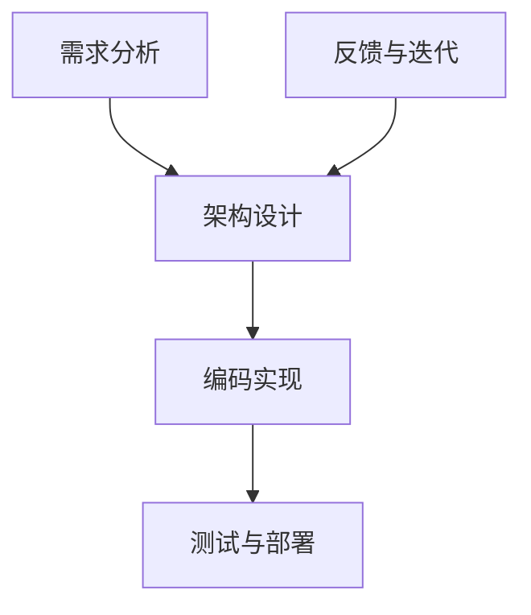

                 

### 《架构力的误区：过度设计 vs 简单实用》

#### 文章标题：**架构力的误区：过度设计 vs 简单实用**

> **关键词：** 架构力、过度设计、简单实用、软件设计、软件开发

> **摘要：** 本文深入探讨了软件架构设计中的两个常见误区：过度设计和简单实用。通过分析这些误区的原因和影响，本文提出了实用的设计原则和实践指南，旨在帮助开发者构建稳定、高效且易于维护的软件系统。

---

# 《架构力的误区：过度设计 vs 简单实用》

## 引言

在软件工程领域，架构力是构建成功软件的关键因素之一。然而，随着技术的发展和项目的复杂性增加，开发者往往会陷入两个极端：过度设计（Over-engineering）和简单实用（Under-engineering）。本文将深入探讨这两个误区，分析其背后的原因和影响，并提供实用的设计原则和实践指南，以帮助开发者避免这些误区，提高软件架构的质量。

### 架构力误区解析

### 1. 过度设计的误区

#### 1.1 误区表现

过度设计通常表现为过度复杂的系统架构、过度精细的模块划分、过度冗长的文档和代码，以及过度依赖高级技术和工具。这种设计往往导致以下几个问题：

- **可维护性降低**：复杂的架构使得代码变得难以理解和修改，增加了维护成本。
- **开发效率下降**：为了支持复杂的架构，需要投入更多时间和精力，导致开发效率降低。
- **性能瓶颈**：复杂的系统架构可能会引入不必要的性能开销，导致系统运行缓慢。

#### 1.2 误区原因

过度设计的原因多种多样，包括：

- **技术崇拜**：开发者过分追求使用最新的技术和工具，忽视了实际需求。
- **需求不确定性**：在需求不明确的情况下，开发者可能会过度设计以应对未来可能的需求变化。
- **个人偏好**：一些开发者倾向于使用复杂的解决方案，以满足个人的技术兴趣。

#### 1.3 误区影响

过度设计不仅会增加开发成本和维护难度，还可能导致项目延期和资源浪费。此外，它还可能影响系统的可扩展性和可维护性，最终影响项目的成功。

### 2. 简单实用的误区

#### 2.1 误区表现

简单实用通常表现为对系统的需求理解不足、过度简化系统设计、使用过于简单或不合适的解决方案。这种设计可能带来以下几个问题：

- **系统脆弱性**：简单的设计可能无法应对实际需求的变化，导致系统出现故障或崩溃。
- **可扩展性不足**：系统设计过于简单，可能无法支持未来的扩展需求。
- **性能不足**：简单的设计可能无法充分利用现有资源，导致系统性能不佳。

#### 2.2 误区原因

简单实用误区的原因包括：

- **对需求理解不足**：开发者可能没有充分理解系统的实际需求，导致设计过于简单。
- **经验不足**：新手开发者可能没有足够的经验来设计复杂的系统，因此选择简单的设计。
- **时间压力**：在时间紧迫的情况下，开发者可能会选择简单的设计以尽快完成项目。

#### 2.3 误区影响

简单实用误区可能导致系统质量下降、性能不足和扩展性不足，从而影响项目的长期成功。

### 3. 误区背后的原因

无论是过度设计还是简单实用，其背后的原因往往与以下几个因素有关：

- **对技术的盲目追求**：开发者过分关注技术本身，而忽视了实际需求。
- **缺乏经验**：新手开发者可能没有足够的经验来设计复杂的系统。
- **项目管理不善**：项目管理不善可能导致开发者在设计和实现过程中偏离实际需求。
- **沟通不畅**：开发者与需求方之间的沟通不畅可能导致设计失误。

### 架构力的核心概念与联系

为了更好地理解架构力，我们需要了解其核心概念和它们之间的联系。以下是一个Mermaid流程图示例：



在这个流程图中，需求分析是架构设计的起点，架构设计决定了编码实现的方向，编码实现之后进行测试与部署，最终的反馈与迭代又反过来影响架构设计。

### 设计原则与最佳实践

为了在软件开发过程中避免过度设计和简单实用误区，我们可以遵循以下设计原则和最佳实践：

1. **需求驱动设计**：始终以实际需求为导向，避免盲目追求技术。
2. **适度设计**：在满足需求的前提下，保持设计简洁、清晰、高效。
3. **模块化**：将系统划分为独立的模块，以便于维护和扩展。
4. **可重用性**：设计可重用的组件，以提高开发效率。
5. **性能优化**：在满足功能需求的基础上，关注系统性能。
6. **文档化**：及时编写和更新文档，确保代码的可读性和可维护性。

### 核心算法原理讲解

在本节中，我们将使用伪代码详细阐述一个常见的算法原理——排序算法。

```python
// 伪代码：排序算法
Algorithm SortArray(arr) {
    // 初始化参数
    n = length(arr)
    // 选择排序
    for i = 0 to n-1 {
        minIndex = i
        for j = i+1 to n {
            if arr[j] < arr[minIndex] {
                minIndex = j
            }
        }
        // 交换最小元素到当前位置
        temp = arr[i]
        arr[i] = arr[minIndex]
        arr[minIndex] = temp
    }
    // 输出结果
    return arr
}
```

### 数学模型和公式讲解

在本节中，我们将使用数学模型和公式来解释如何计算系统的复杂度。

$$
// 数学公式：系统复杂度计算
Complexity = \sum_{i=1}^{n} \frac{1}{i} + \log_2(n)
$$

### 项目实战

在本节中，我们将通过一个实际项目来展示如何遵循设计原则和最佳实践，构建一个简单的Web应用程序。

#### 1. 项目背景

我们计划开发一个基于Python的Web应用程序，用于用户管理、信息展示和数据统计。该应用程序应具有良好的扩展性和可维护性。

#### 2. 开发环境搭建

为了开发该应用程序，我们需要安装以下工具：

- Python 3.8
- Flask 框架
- SQLAlchemy 数据库工具

安装步骤如下：

```bash
pip install flask
pip install flask_sqlalchemy
```

#### 3. 源代码实现

以下是一个简单的 Flask 应用程序示例：

```python
# app.py

from flask import Flask, render_template, request
from flask_sqlalchemy import SQLAlchemy

app = Flask(__name__)
app.config['SQLALCHEMY_DATABASE_URI'] = 'sqlite:///users.db'
db = SQLAlchemy(app)

class User(db.Model):
    id = db.Column(db.Integer, primary_key=True)
    username = db.Column(db.String(80), unique=True, nullable=False)
    email = db.Column(db.String(120), unique=True, nullable=False)

@app.route('/')
def index():
    users = User.query.all()
    return render_template('index.html', users=users)

@app.route('/add', methods=['POST'])
def add_user():
    username = request.form['username']
    email = request.form['email']
    new_user = User(username=username, email=email)
    db.session.add(new_user)
    db.session.commit()
    return redirect(url_for('index'))

if __name__ == '__main__':
    db.create_all()
    app.run(debug=True)
```

#### 4. 代码解读与分析

在上面的代码中，我们首先导入了 Flask 和 SQLAlchemy 模块。然后，我们定义了一个 User 类，表示用户表。接下来，我们创建了两个路由：主页路由（/）和添加用户路由（/add）。

主页路由返回一个包含所有用户的列表，而添加用户路由处理用户输入，并将其保存到数据库中。

#### 5. 实际案例分析和详细讲解剖析

在实际开发中，我们可能需要考虑以下因素：

- **用户认证与权限管理**：为用户提供登录和注册功能，并根据权限进行资源访问控制。
- **数据验证与处理**：对用户输入进行验证，以防止 SQL 注入等安全风险。
- **错误处理与日志记录**：处理异常情况，并记录日志以便调试。

#### 6. 项目小结

通过本项目的实战，我们可以看到如何遵循设计原则和最佳实践，构建一个简单的 Web 应用程序。在后续开发过程中，我们可以根据实际需求逐步完善和扩展功能。

### 实践指南

在软件开发过程中，为了避免过度设计和简单实用误区，我们可以遵循以下实践指南：

- **明确需求**：在开始设计之前，确保对需求有充分的了解。
- **适度设计**：在满足需求的前提下，保持设计简洁、清晰、高效。
- **迭代开发**：采用迭代开发方法，逐步完善系统功能。
- **代码审查**：定期进行代码审查，确保代码质量和设计合理性。
- **持续学习**：关注技术发展趋势，不断学习和应用新技术。

### 最佳实践 Tips、小结、注意事项、拓展阅读

- **最佳实践 Tips**：在软件开发过程中，始终遵循最佳实践，以提高开发效率和代码质量。
- **小结**：本文深入探讨了软件架构设计中的两个常见误区：过度设计和简单实用，并提供了解决方案和实践指南。
- **注意事项**：在设计系统时，要充分考虑系统的可扩展性和可维护性。
- **拓展阅读**：对于进一步了解软件架构设计的相关内容，读者可以参考以下书籍和资源：
  - 《架构师的思维》
  - 《设计模式：可复用面向对象软件的基础》
  - 《软件架构设计：面向对象、服务导向和模型驱动方法》

### 附录

- **附录 1：常用工具与资源**
  - Python 开发环境搭建
  - Flask 框架文档
  - SQLAlchemy 文档
- **附录 2：参考文献**
  - 《软件架构：实践者的研究方法》
  - 《软件架构设计原则：创建可靠、适应性和可扩展的系统》

### 作者信息

- 作者：AI天才研究院/AI Genius Institute & 禅与计算机程序设计艺术 /Zen And The Art of Computer Programming

