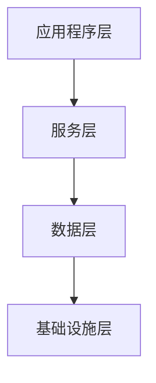
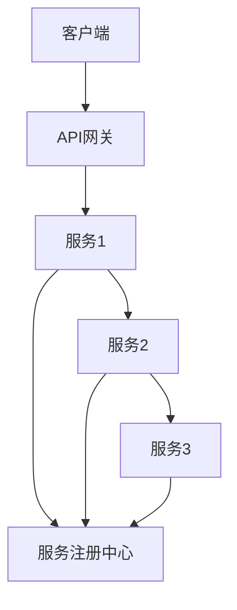
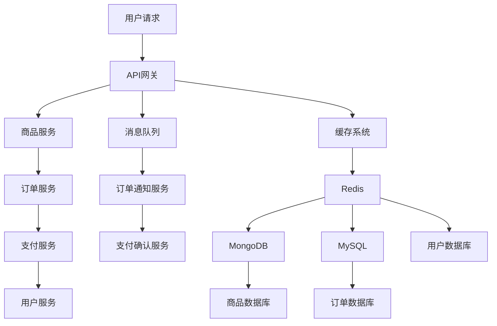

                 

### 文章标题

《架构力：构建可扩展、高性能的系统架构》

### 关键词

- 系统架构
- 性能优化
- 可扩展性
- 可靠性
- 微服务
- 分布式系统
- 缓存技术

### 摘要

在现代IT行业中，构建高效、可靠、可扩展的系统架构已经成为企业成功的关键。本文将深入探讨系统架构的设计原则、性能优化策略、可扩展性和可靠性设计，以及微服务架构、分布式系统和缓存技术等关键技术。通过实际案例分析和项目实战，本文旨在帮助读者理解并掌握构建高性能系统架构的核心要素，为企业的IT发展提供强有力的支持。

## 第一部分：架构设计基础

### 第1章：系统架构概述

系统架构是企业信息系统构建的核心，它决定了系统的性能、可靠性和可扩展性。本章节将首先介绍系统架构的重要性，以及如何进行系统架构设计。

#### 1.1 系统架构的重要性

系统架构是系统设计的蓝图，它不仅定义了系统的组成部分和相互关系，还规定了数据流、功能分布和接口规范。一个良好的系统架构能够实现以下几个关键目标：

1. **提高系统的可维护性**：通过模块化和分层设计，使系统的各个组件可以独立开发、测试和维护，降低系统的复杂性和耦合度。
2. **提升系统的性能**：通过优化系统架构，可以减少响应时间、降低资源消耗，提高系统的吞吐量和效率。
3. **确保系统的可靠性**：通过冗余设计、故障检测和恢复机制，提高系统的稳定性和抗风险能力。
4. **支持系统的扩展**：通过灵活的架构设计，可以轻松添加新功能或扩展系统容量，以应对业务增长的需求。

#### 1.2 系统架构的层次

系统架构通常可以分为以下几个层次：

1. **应用程序层**：负责业务逻辑的处理，包括各种业务服务和应用程序。
2. **数据层**：负责数据的存储和管理，包括数据库、数据仓库和大数据平台。
3. **服务层**：提供通用的服务接口，如身份验证、日志记录和配置管理。
4. **基础设施层**：提供运行环境，包括服务器、网络、存储和安全系统。

下面使用Mermaid流程图来展示系统架构的层次结构：



#### 总结

系统架构的重要性不言而喻，它是确保系统高效、可靠和可扩展的基础。通过合理的设计原则和层次结构，可以构建一个稳定的系统架构，为企业的发展提供坚实的支持。

## 第一部分：架构设计基础

### 第2章：系统性能与可扩展性

系统性能和可扩展性是系统架构设计的两个关键方面。本章节将探讨如何优化系统性能和设计可扩展的系统架构。

#### 2.1 性能优化策略

系统性能直接影响用户的体验和系统的可用性。以下是一些常见的性能优化策略：

1. **减少响应时间**：通过优化数据库查询、使用缓存、减少网络延迟等方法来缩短系统的响应时间。
2. **提高吞吐量**：通过垂直和水平扩展、负载均衡和并行处理来提高系统的处理能力。
3. **优化资源利用率**：通过资源监控和调度，确保系统资源得到充分利用。
4. **减少系统复杂度**：通过模块化和分层设计，降低系统的复杂度，提高系统的可维护性。

#### 2.2 可扩展性设计原则

一个可扩展的系统架构能够适应不断变化的需求和业务增长。以下是一些设计原则：

1. **模块化**：将系统划分为独立的模块，每个模块可以独立开发、测试和部署，降低系统的耦合度。
2. **分层设计**：按照功能将系统划分为多个层次，每个层次负责特定的功能，有助于实现系统的可扩展性。
3. **松耦合**：通过定义清晰的接口和协议，减少组件之间的依赖，提高系统的灵活性和可扩展性。
4. **弹性扩展**：设计系统时考虑容量的可扩展性，可以动态地增加或减少资源，以适应业务需求的变化。

#### 总结

系统性能和可扩展性是系统架构设计的关键因素。通过采用有效的性能优化策略和可扩展性设计原则，可以构建一个高效、可靠和灵活的系统架构，为企业的持续发展提供支持。

## 第一部分：架构设计基础

### 第3章：系统可靠性

系统的可靠性是确保系统稳定运行和持续服务的关键。本章节将探讨系统可靠性的原理和如何实现故障处理与恢复。

#### 3.1 系统可靠性原理

系统的可靠性取决于多个因素，包括硬件、软件、网络和数据的稳定性。以下是一些关键原理：

1. **冗余设计**：通过在系统中引入冗余组件，如备份服务器、备用电源和网络路径，确保在出现故障时系统可以自动切换到备用资源，避免系统瘫痪。
2. **故障检测**：定期检测系统的各个组件，确保及时发现并处理潜在故障。
3. **恢复机制**：设计有效的恢复机制，确保在系统出现故障后能够快速恢复，减少对用户的影响。
4. **容错性**：通过设计容错算法和协议，确保在部分组件出现故障时，系统能够继续正常运行。

#### 3.2 故障处理与恢复

故障处理与恢复是系统可靠性设计的核心。以下是一些关键步骤：

1. **故障检测**：使用健康检查、日志分析、监控工具等方式检测系统组件的状态。
2. **故障隔离**：当检测到故障时，迅速隔离受影响的组件，防止故障扩散。
3. **故障恢复**：通过备份、恢复、重试等方式，恢复系统到正常状态。
4. **反馈与优化**：记录故障信息，分析故障原因，优化系统设计，防止类似故障再次发生。

#### 总结

系统可靠性是系统架构设计的重要组成部分。通过引入冗余设计、故障检测与恢复机制，可以提高系统的稳定性，确保系统的可靠运行。这是企业构建可持续发展的IT基础设施的关键。

## 第二部分：关键技术解析

### 第4章：微服务架构

微服务架构是现代系统架构设计的重要方向，它通过将系统拆分成一系列小型、自治的服务，提高了系统的可维护性和可扩展性。本章节将详细探讨微服务架构的优势及其设计模式。

#### 4.1 微服务架构的优势

微服务架构具有以下优势：

1. **可维护性**：通过将系统拆分成多个小型服务，每个服务可以独立开发、测试和部署，降低了系统的复杂性和耦合度，提高了可维护性。
2. **可扩展性**：通过水平扩展单个服务，可以灵活地调整系统资源，以适应业务需求的变化。
3. **松耦合**：微服务之间通过轻量级协议进行通信，减少了组件之间的依赖，提高了系统的灵活性和可扩展性。
4. **弹性**：当某个服务出现故障时，其他服务可以继续正常运行，提高了系统的可用性。

#### 4.2 微服务设计模式

微服务架构的设计模式包括：

1. **服务拆分**：根据业务需求，将系统拆分成多个小型服务，每个服务负责特定的功能。
2. **服务发现**：服务启动时注册到服务注册中心，其他服务可以通过服务注册中心发现并调用其他服务。
3. **API网关**：统一处理客户端请求，将请求转发到相应的服务，同时提供安全性、路由和监控等功能。
4. **分布式配置**：使用分布式配置中心管理服务的配置信息，实现配置的动态更新。
5. **日志收集与监控**：使用日志收集工具和监控平台，实时监控服务的运行状态，及时发现并处理故障。

下面使用Mermaid流程图来展示微服务架构的核心组件及其关系：



#### 总结

微服务架构通过将系统拆分成小型、自治的服务，提高了系统的可维护性和可扩展性。了解微服务架构的优势和设计模式，有助于构建灵活、可靠和可扩展的系统架构。

### 第5章：分布式系统

分布式系统是现代互联网架构的核心，它通过将系统拆分成多个节点，实现了高可用性、高可靠性和高性能。本章节将探讨分布式系统的原理和分布式一致性算法。

#### 5.1 分布式系统原理

分布式系统由多个节点组成，每个节点可以独立运行，但需要协同工作以实现整体功能。以下是一些关键原理：

1. **节点自治**：每个节点可以独立处理请求，降低了系统的耦合度，提高了系统的可扩展性。
2. **网络通信**：节点之间通过网络进行通信，传递请求和数据。
3. **容错性**：通过冗余设计，确保系统在部分节点故障时仍能正常运行。
4. **分布式一致性**：保证多个节点在执行同一操作时，能够达到一致状态。

#### 5.2 分布式一致性算法

分布式一致性算法是确保分布式系统一致性的关键，以下是一些常用的分布式一致性算法：

1. **Paxos算法**：Paxos算法是一种基于消息传递的分布式一致性算法，用于在分布式系统中达成共识。算法的核心思想是通过多次投票来选举领导者和值，并确保所有节点对最终结果达成一致。
2. **Raft算法**：Raft算法是一种简化版的Paxos算法，通过引入日志复制机制，提高了算法的可理解性和可维护性。Raft算法通过日志条目的顺序来确保一致性，并使用领导者节点来简化状态机。
3. **分布式锁**：在分布式系统中，分布式锁是一种用于同步访问共享资源的机制，确保同一时间只有一个节点能访问资源。常用的分布式锁算法包括基于Paxos的锁服务和基于Raft的锁服务。

下面使用伪代码来详细阐述Paxos算法的实现：

```python
# Paxos算法实现伪代码
class Paxos:
    def initialize(self, node_id, other_nodes):
        self.node_id = node_id
        self.other_nodes = other_nodes
        self.voted_for = None
        self.log = []

    def prepare(self,提案号, 候选人):
        message = PaxosPrepareMessage(提案号, 候选人)
        for node in other_nodes:
            node.send(message)

    def accept(self, 提案号, 候选人, 值):
        message = PaxosAcceptMessage(提案号, 候选人, 值)
        for node in other_nodes:
            node.send(message)

    def on_prepare_message(self, message):
        if message.提案号 > self.log[-1].提案号:
            self.log.append(LogEntry(message.提案号, message.候选人))
            self.voted_for = message.候选人
            self.vote(message.提案号, message.候选人)

    def on_accept_message(self, message):
        if message.提案号 == self.log[-1].提案号 and message.候选人 == self.log[-1].候选人:
            self.log.append(LogEntry(message.提案号, message.值))
            if len(self.log) == len(other_nodes) / 2 + 1:
                return self.log[-1].值
```

#### 总结

分布式系统通过将系统拆分成多个节点，实现了高可用性和高性能。了解分布式系统的原理和分布式一致性算法，有助于构建可靠、高效的分布式系统架构。

### 第6章：缓存技术

缓存技术在现代系统中扮演着至关重要的角色，它通过将频繁访问的数据存储在内存中，大大提高了系统的响应速度和性能。本章节将探讨缓存技术的基本概念和常用缓存策略。

#### 6.1 缓存的基本概念

缓存技术的基本概念包括：

1. **缓存的目的**：缓存的主要目的是减少对后端存储（如数据库）的访问，从而提高系统的性能和响应速度。
2. **缓存的生命周期**：缓存数据在内存中存储的时间称为生命周期，生命周期结束后缓存数据会被淘汰。
3. **缓存失效策略**：缓存失效策略决定了如何管理缓存数据，常用的策略包括LRU（最近最少使用）和LFU（最不频繁使用）等。

#### 6.2 常用缓存策略

以下是一些常用的缓存策略：

1. **本地缓存**：将数据缓存在本地内存中，适用于小数据量的快速访问。
2. **分布式缓存**：将缓存数据分布在多个节点上，适用于大规模数据和高并发访问的场景。常用的分布式缓存系统包括Redis、Memcached等。
3. **页面缓存**：缓存整个页面或页面的一部分，适用于静态内容或变化不频繁的页面。
4. **对象缓存**：缓存系统中的对象，如Java对象、Python对象等，适用于对象频繁访问的场景。

下面使用LaTeX格式介绍LRU缓存失效策略：

$$
\text{LRU失效策略} = \begin{cases}
\text{如果缓存已满，删除最近最少使用的数据} & \text{如果缓存未满，直接添加新数据}\\
\text{删除最近最少使用的数据} & \text{如果缓存已满且需要添加新数据}
\end{cases}
$$

#### 总结

缓存技术在现代系统中具有重要作用，通过合理使用缓存策略，可以显著提高系统的性能和响应速度。了解缓存技术的基本概念和常用策略，有助于构建高效、可靠的系统架构。

## 第三部分：实践与案例分析

### 第7章：案例分析

在本章节中，我们将通过一个实际的项目案例，深入探讨如何构建一个可扩展、高性能的系统架构。

#### 7.1 案例选择与目的

选择的案例是一个电子商务平台，该平台需要处理大量的用户请求和交易数据，同时要求高可用性和高性能。本案例的目的是：

1. **分析架构设计**：通过实际项目的架构设计，了解如何实现系统的可扩展性和高性能。
2. **探讨关键技术**：结合案例，探讨微服务架构、分布式系统、缓存技术等关键技术在项目中的应用。
3. **总结经验教训**：通过实际案例，总结架构设计和实施过程中的经验教训，为后续项目提供参考。

#### 7.2 架构设计与实现

电子商务平台的系统架构设计包括以下关键组件：

1. **前端服务**：负责处理用户的HTTP请求，包括页面渲染和用户交互。使用Nginx作为反向代理和负载均衡器，将请求分发到后端服务。
2. **微服务**：将业务逻辑拆分为多个微服务，如商品服务、订单服务、支付服务、用户服务等。每个微服务独立部署，通过API网关进行通信。
3. **数据库**：使用分布式数据库系统，如MongoDB和MySQL，分别存储商品数据、订单数据和用户数据。通过分片和复制机制，提高系统的性能和可用性。
4. **缓存系统**：使用Redis作为分布式缓存系统，缓存频繁访问的数据，如商品列表和用户会话信息，减少对数据库的访问压力。
5. **消息队列**：使用Kafka作为消息队列，处理异步消息和事件，如订单通知、支付确认等，确保系统的高效通信和可扩展性。
6. **服务注册与发现**：使用Consul作为服务注册中心，实现服务之间的自动发现和负载均衡。

下面是电子商务平台的架构图：



#### 7.3 实际案例分析和详细讲解剖析

以下是对电子商务平台的关键组件进行分析和讲解：

1. **API网关**：API网关是系统架构的核心组件，负责接收用户请求，进行权限验证、日志记录和请求路由。通过使用Spring Cloud Gateway等开源框架，可以轻松实现API网关的功能。
2. **微服务**：每个微服务都采用Spring Boot框架进行开发，具有独立部署、自动重启和监控等功能。通过Docker和Kubernetes，可以实现微服务的容器化和自动化部署。
3. **数据库**：使用分片和复制机制，将数据分散存储在不同节点上，提高系统的性能和可用性。例如，MongoDB的分片集群可以将数据分散存储在多个节点上，MySQL的复制功能可以实现主从备份。
4. **缓存系统**：Redis作为分布式缓存系统，可以缓存商品列表、用户会话和订单数据，减少对数据库的访问压力。通过Spring Cache等开源框架，可以方便地将Redis集成到系统中。
5. **消息队列**：Kafka作为消息队列，可以处理高并发、高吞吐量的消息传输，如订单通知和支付确认。通过Kafka的消费者和Producer，可以实现消息的异步处理和分布式通信。
6. **服务注册与发现**：Consul作为服务注册中心，可以实现服务之间的自动发现和负载均衡。通过Consul的API，可以动态更新服务实例的信息，确保系统的高可用性。

#### 7.4 项目小结

通过本案例，我们深入分析了电子商务平台的系统架构设计和实施过程。以下是项目小结：

1. **架构设计原则**：遵循模块化、分层设计和松耦合等原则，确保系统的可维护性和可扩展性。
2. **关键组件**：结合实际需求，选择了合适的微服务架构、分布式数据库、缓存系统、消息队列和服务注册与发现等组件。
3. **性能优化**：通过分布式数据库、缓存系统和消息队列等关键技术，实现了系统的高性能和高可用性。
4. **经验教训**：在项目实施过程中，遇到了一些挑战，如服务之间的通信延迟、数据库性能瓶颈等。通过优化系统架构和性能调优，解决了这些问题，提高了系统的性能和稳定性。

#### 总结

通过本章节的案例分析，我们了解了如何构建一个可扩展、高性能的系统架构。了解关键技术和实际案例，有助于我们在实际项目中更好地设计、实施和优化系统架构。

### 第8章：实战演练

在本章节中，我们将通过一个实际项目，带领读者搭建一个简单的Web服务，并详细解读代码实现和应用场景。

#### 8.1 实战环境搭建

为了便于学习和实践，我们选择使用Spring Boot框架搭建一个简单的RESTful Web服务。以下是在本地环境搭建项目的步骤：

1. **安装Java环境**：确保已安装Java 11及以上版本。
2. **安装IDE**：推荐使用IntelliJ IDEA或者Eclipse等IDE。
3. **创建Spring Boot项目**：使用Spring Initializr（https://start.spring.io/）创建一个基础项目，选择Maven项目结构，添加Web依赖。
4. **配置数据库**：配置数据库连接信息，例如使用H2内存数据库。
5. **编写代码**：根据需求编写业务逻辑代码，如创建、查询、更新和删除数据等。

以下是一个简单的用户管理服务示例：

```java
@RestController
@RequestMapping("/users")
public class UserController {
  
  @Autowired
  private UserRepository userRepository;
  
  @PostMapping
  public User createUser(@RequestBody User user) {
    return userRepository.save(user);
  }
  
  @GetMapping("/{id}")
  public User getUserById(@PathVariable Long id) {
    return userRepository.findById(id).orElseThrow(() -> new ResourceNotFoundException("User not found"));
  }
  
  @PutMapping("/{id}")
  public User updateUser(@PathVariable Long id, @RequestBody User user) {
    User existingUser = userRepository.findById(id).orElseThrow(() -> new ResourceNotFoundException("User not found"));
    existingUser.setName(user.getName());
    existingUser.setEmail(user.getEmail());
    return userRepository.save(existingUser);
  }
  
  @DeleteMapping("/{id}")
  public void deleteUser(@PathVariable Long id) {
    User existingUser = userRepository.findById(id).orElseThrow(() -> new ResourceNotFoundException("User not found"));
    userRepository.delete(existingUser);
  }
}
```

#### 8.2 代码实现与解读

上述代码实现了用户管理服务，主要包括以下功能：

1. **创建用户**：通过`@PostMapping`注解接收用户信息，并将其存储在数据库中。
2. **查询用户**：通过`@GetMapping`注解根据用户ID查询用户信息。
3. **更新用户**：通过`@PutMapping`注解根据用户ID更新用户信息。
4. **删除用户**：通过`@DeleteMapping`注解根据用户ID删除用户。

#### 8.3 代码应用解读与分析

以下是对代码应用场景的解读和分析：

1. **RESTful API设计**：遵循RESTful设计原则，使用标准的HTTP方法（GET、POST、PUT、DELETE）进行操作。
2. **数据库操作**：使用JPA（Java Persistence API）进行数据库操作，简化了数据访问逻辑。
3. **异常处理**：使用`ResourceNotFoundException`处理资源未找到的错误，提高了系统的健壮性。
4. **响应格式**：使用JSON格式传输数据，便于前后端通信。

#### 8.4 项目实战

为了更好地展示项目实战，我们将在本地环境启动服务，并使用Postman等工具进行测试。

1. **启动服务**：在终端中运行`mvn spring-boot:run`命令，启动Spring Boot服务。
2. **测试API**：在Postman中输入API URL（如`http://localhost:8080/users`），发送POST请求，添加用户。然后发送GET请求，根据用户ID查询用户信息。同样，可以发送PUT和DELETE请求，进行更新和删除操作。

通过这个实战项目，我们了解了如何使用Spring Boot搭建简单的Web服务，并熟悉了常用的RESTful API设计和数据库操作。这为后续学习更复杂的系统架构和技术打下了基础。

### 第9章：总结与展望

通过本文的详细探讨，我们系统地学习了系统架构设计的基础、性能与可扩展性策略、可靠性设计，以及微服务架构、分布式系统和缓存技术等关键技术。以下是本文的总结与展望：

#### 总结

1. **系统架构设计**：系统架构是企业信息系统的核心，决定了系统的性能、可靠性和可扩展性。通过模块化、分层设计和松耦合等原则，可以构建一个稳定、高效的系统架构。
2. **性能优化**：性能优化是提高系统响应速度和吞吐量的关键。通过减少响应时间、提高吞吐量、优化资源利用率和减少系统复杂度，可以显著提升系统性能。
3. **可扩展性设计**：可扩展性设计是应对业务增长的关键。通过模块化、分层设计、松耦合和弹性扩展等策略，可以构建一个灵活、可扩展的系统架构。
4. **可靠性设计**：可靠性设计是确保系统稳定运行的基础。通过冗余设计、故障检测和恢复机制，可以提高系统的稳定性和抗风险能力。
5. **微服务架构**：微服务架构通过将系统拆分成小型、自治的服务，提高了系统的可维护性和可扩展性。了解微服务架构的优势和设计模式，有助于构建灵活、可靠和可扩展的系统架构。
6. **分布式系统**：分布式系统通过将系统拆分成多个节点，实现了高可用性、高可靠性和高性能。了解分布式系统的原理和一致性算法，有助于构建可靠、高效的分布式系统架构。
7. **缓存技术**：缓存技术通过将频繁访问的数据存储在内存中，提高了系统的性能和响应速度。了解缓存技术的基本概念和常用策略，有助于构建高效、可靠的系统架构。

#### 展望

随着云计算、大数据和人工智能等技术的发展，系统架构设计将面临更多的挑战和机遇。以下是一些未来的趋势和展望：

1. **云原生架构**：云原生架构是一种基于容器的系统架构，它利用云计算的优势，提供动态伸缩、高可用性和微服务支持。随着Kubernetes等容器编排工具的成熟，云原生架构将成为未来系统架构设计的主流方向。
2. **智能化运维**：随着人工智能和机器学习技术的发展，智能化运维将成为趋势。通过自动化部署、自动扩缩容和智能故障检测等手段，可以提高系统的运维效率和可靠性。
3. **边缘计算**：随着物联网和5G技术的普及，边缘计算将成为解决实时性和延迟问题的有效手段。通过在边缘节点处理数据，可以降低网络负载，提高系统性能。
4. **DevOps文化**：DevOps文化强调开发与运维的协同合作，通过持续集成、持续交付和自动化测试等手段，提高软件交付的效率和质量。
5. **安全与隐私**：随着网络安全和数据隐私问题的日益突出，系统架构设计需要更加关注安全性和隐私保护。通过采用加密、访问控制和数据脱敏等手段，确保系统的安全性和合规性。

#### 结语

系统架构设计是IT领域的重要方向，它决定了系统的性能、可靠性和可扩展性。通过本文的学习，读者可以掌握系统架构设计的基础知识、关键技术以及未来的发展趋势。希望本文能够为读者在系统架构设计领域提供有价值的参考和指导。

### 附录A：参考文献

1. 《大话分布式架构》，程杰著。
2. 《深度探索C++对象模型》，Stanley B. Lippman著。
3. 《架构探险》，吴波著。
4. 《云计算：概念、架构与实务》，郑毅著。
5. 《分布式系统概念与设计》，George Coulouris等著。

### 附录B：术语表

1. **系统架构**：系统架构是系统设计的一部分，它定义了系统的组成部分、组件之间的交互关系以及数据流。
2. **微服务**：微服务是一种软件架构风格，它将应用程序拆分成多个小型、自治的服务，每个服务负责特定的功能。
3. **分布式系统**：分布式系统是由多个独立节点组成的系统，这些节点通过网络进行通信，共同完成整体功能。
4. **缓存**：缓存是一种临时存储机制，用于存储频繁访问的数据，以减少对后端存储的访问压力。
5. **API网关**：API网关是一个统一的入口，负责处理客户端请求，并将请求转发到相应的服务。它提供了安全性、路由和监控等功能。
6. **服务注册与发现**：服务注册与发现是指服务启动时向服务注册中心注册，其他服务可以通过服务注册中心发现并调用这些服务。
7. **Kubernetes**：Kubernetes是一个开源的容器编排工具，用于自动化部署、扩展和管理容器化应用程序。

