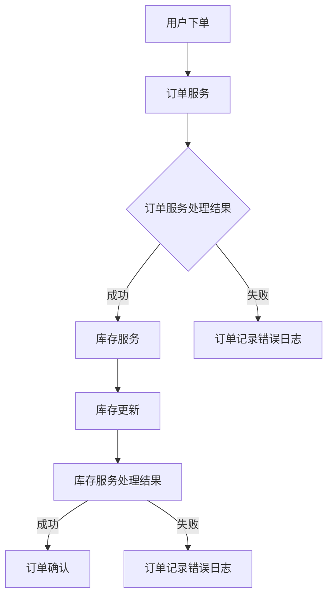

                 


### 文章标题
《架构设计能力：P9工程师的核心竞争力》

### 关键词
- 架构设计
- P9工程师
- 软件架构
- 技术竞争力
- 高级编程
- 分布式系统
- 微服务
- 云计算

### 摘要
本文深入探讨了架构设计能力对于P9级别工程师的重要性。我们首先回顾了软件架构的基本概念和核心原则，然后逐步介绍了高级架构设计技巧，包括微服务架构、云计算与容器化架构等。通过大型系统和分布式系统架构的实践案例，我们展示了如何将理论知识应用到实际项目中。最后，本文讨论了架构评估方法以及如何提升P9工程师的架构设计能力，为读者提供了全面的架构设计知识体系和发展路径。

----------------------------------------------------------------

# 引言

在当今的软件行业，架构设计能力已经成为P9工程师的核心竞争力之一。P9工程师，通常指的是在技术领域有着深厚积累和卓越能力的顶尖工程师，他们在企业中承担着技术架构设计、团队领导和技术决策的关键角色。架构设计能力不仅决定了系统的可扩展性、可维护性和可靠性，更是企业技术竞争力的重要体现。

然而，架构设计能力并不是一蹴而就的，它需要工程师们具备深厚的理论基础、丰富的实践经验以及不断的自我提升。本文将围绕架构设计能力的核心要素，逐步展开讨论。我们首先回顾软件架构的基本概念和核心原则，然后深入介绍高级架构设计技巧，如微服务架构、云计算与容器化架构等。接着，通过大型系统和分布式系统架构的实践案例，展示如何将理论知识应用到实际项目中。最后，本文将讨论架构评估方法以及如何提升P9工程师的架构设计能力。

本文的目标是为P9工程师们提供一套系统的架构设计知识体系和发展路径，帮助他们在不断变化的技术环境中保持竞争力，为企业创造更大的价值。

## 架构设计基础

### 软件架构的基本概念

软件架构是软件开发过程中至关重要的一个环节，它决定了系统的整体结构、功能分布、性能指标以及可维护性。简单来说，软件架构是关于如何将一个复杂的软件系统分解为更小的、易于管理和维护的部分，同时确保这些部分能够有效地协同工作。

在软件架构中，有几个基本概念需要我们了解：

1. **模块（Module）**：
   模块是软件系统中的一个独立部分，它通常包含一组功能相关的代码和数据结构。模块的独立性使得开发者可以在不干扰其他模块的情况下，单独开发、测试和部署模块。

2. **组件（Component）**：
   组件是比模块更高级的概念，它可能由多个模块组成，用于实现特定的功能。组件之间的交互通常通过定义良好的接口进行，从而降低了组件之间的耦合度。

3. **层次结构（Hierarchy）**：
   软件架构通常采用层次结构，从高层到低层分为多个层次，每个层次都有其特定的职责和功能。常见的层次结构包括表示层、业务逻辑层、数据访问层等。

4. **架构风格（Architecture Style）**：
   架构风格是指系统中组件和模块组织与交互的通用模式。常见的架构风格包括客户端-服务器（Client-Server）、三层架构（Three-Tier）、微服务（Microservices）等。

### 软件架构的发展历程

软件架构的发展历程可以追溯到20世纪60年代，当时计算机系统相对简单，软件架构的设计主要集中在如何高效地组织代码和数据结构。随着计算机技术和软件行业的不断发展，软件架构也在不断演进。

1. **面向过程架构（Procedural Architecture）**：
   20世纪60年代到70年代，软件架构主要以过程为中心，强调函数和过程的组合。这一时期的代表性架构风格是模块化编程。

2. **面向对象架构（Object-Oriented Architecture）**：
   20世纪80年代到90年代，面向对象编程成为主流，软件架构逐渐转向面向对象架构。面向对象架构通过将数据和操作封装在对象中，实现了数据和行为的一致性，提高了代码的可重用性和可维护性。

3. **分布式架构（Distributed Architecture）**：
   20世纪90年代，随着互联网的兴起，分布式系统成为软件架构的新趋势。分布式架构通过将系统划分为多个节点，实现了高可用性、可扩展性和容错性。

4. **微服务架构（Microservices Architecture）**：
   进入21世纪，微服务架构逐渐成为主流。微服务架构通过将系统划分为多个独立的服务，每个服务负责特定的功能，通过轻量级的通信协议（如REST、gRPC）进行交互。微服务架构提高了系统的灵活性和可扩展性，但同时也带来了分布式系统的复杂性。

### 架构设计的关键原则

在进行架构设计时，有一些关键原则可以帮助我们构建高质量、可扩展、易维护的系统。以下是几个重要的架构设计原则：

1. **模块化（Modularity）**：
   模块化是将系统划分为多个独立模块，每个模块都有明确的职责和边界。模块化可以提高代码的可重用性、可测试性和可维护性。

2. **解耦（Decoupling）**：
   解耦是指降低组件之间的依赖关系，从而提高系统的灵活性和可扩展性。通过定义良好的接口和通信协议，组件可以在不互相依赖的情况下独立开发、测试和部署。

3. **可扩展性（Scalability）**：
   可扩展性是指系统能够适应不断增长的用户需求和负载。在设计架构时，需要考虑如何通过水平扩展（增加节点数量）和垂直扩展（增加节点资源）来提高系统的性能。

4. **可靠性（Reliability）**：
   可靠性是指系统能够在各种故障情况下保持正常运行。为了提高系统的可靠性，可以采用冗余设计、故障转移和自我修复等技术。

5. **安全性（Security）**：
   安全性是软件架构设计中不可忽视的一个方面。在设计架构时，需要考虑如何保护系统不受恶意攻击、数据泄露和滥用等安全风险。

6. **易维护性（Maintainability）**：
   易维护性是指系统在运行过程中能够方便地进行更新和维护。通过良好的文档、代码规范和自动化测试，可以提高系统的可维护性。

### 总结

软件架构设计是软件开发过程中不可或缺的一环，它不仅决定了系统的性能和可靠性，也直接影响到了系统的可扩展性和可维护性。通过理解软件架构的基本概念、发展历程和关键原则，P9工程师可以为构建高质量、可靠的软件系统奠定坚实的基础。在接下来的部分，我们将进一步探讨高级架构设计技巧，如微服务架构、云计算与容器化架构等，帮助P9工程师应对复杂多变的技术环境。

## 高级架构设计技巧

### 微服务架构

微服务架构是近年来软件架构领域的一个重要趋势，它将传统的单体应用拆分成多个小型、独立的服务。每个服务都有自己的业务逻辑和数据库，可以独立部署、扩展和升级。微服务架构的优点包括高可扩展性、高可维护性和高灵活性，但同时也带来了分布式系统的复杂性。

**微服务架构的概念**

微服务架构的核心思想是将一个复杂的单体应用拆分为多个独立的、小型的服务。这些服务通常围绕特定的业务功能进行组织，例如用户管理、订单处理、库存管理等。每个服务都是独立的，具有自己的数据库、API接口和业务逻辑。

微服务架构的关键特征包括：

- **独立性**：每个服务都是独立的，可以独立部署和升级，不会影响其他服务的运行。
- **轻量级通信**：服务之间通常通过轻量级的通信协议（如REST、gRPC）进行通信，提高了系统的性能和可扩展性。
- **容器化**：微服务通常运行在容器中，例如Docker，使得服务可以在不同的环境中快速部署和扩展。

**微服务架构的优势与挑战**

**优势**

1. **高可扩展性**：由于每个服务都是独立的，可以根据需求单独扩展，从而提高了系统的可扩展性。
2. **高可维护性**：微服务架构使得代码更加模块化，便于维护和升级，减少了系统中的耦合度。
3. **高灵活性**：服务可以根据业务需求灵活地开发、部署和扩展，适应快速变化的市场需求。
4. **技术多样性**：每个服务可以采用不同的编程语言和技术栈，从而提高了系统的技术多样性。

**挑战**

1. **分布式复杂性**：微服务架构增加了系统的分布式复杂性，例如服务发现、负载均衡、容错处理等。
2. **数据一致性**：在分布式系统中，数据一致性是一个重要的挑战，需要采用分布式事务管理、最终一致性等技术来确保数据的一致性。
3. **集成难度**：由于服务之间的独立性，集成测试和系统测试变得相对复杂，需要设计良好的API接口和文档。

**微服务架构设计实践**

在设计微服务架构时，可以遵循以下原则：

1. **单一职责**：每个服务都应该只负责一个业务功能，保持服务的最小化和独立性。
2. **定义清晰的接口**：服务之间通过定义良好的API接口进行通信，确保接口的稳定性和兼容性。
3. **独立部署**：服务应该能够独立部署和升级，避免影响其他服务的运行。
4. **自动化测试**：对每个服务进行充分的自动化测试，确保服务的质量和稳定性。
5. **服务治理**：采用服务治理框架，如Istio、Kubernetes，来管理服务的生命周期、性能监控和安全策略。

### 云计算与容器化架构

云计算和容器化技术为现代软件架构带来了革命性的变化，使得系统更加灵活、可扩展和可靠。

**云计算基础**

云计算是指通过互联网提供可伸缩的计算资源，用户可以根据需求动态地调整资源规模。云计算主要分为以下几种服务模式：

1. **基础设施即服务（IaaS）**：用户可以租用虚拟机、存储和网络资源，自行管理和配置操作系统和应用程序。
2. **平台即服务（PaaS）**：用户可以在平台上开发、部署和管理应用程序，无需关心底层基础设施的维护。
3. **软件即服务（SaaS）**：用户通过互联网使用应用程序，无需关心底层基础设施和平台的维护。

**容器化技术介绍**

容器化技术通过将应用程序及其依赖打包到轻量级的容器中，实现了应用程序的标准化和可移植性。Docker是最常用的容器化技术之一，它提供了创建、运行和管理容器的工具。

**容器化架构设计**

容器化架构设计的关键在于如何高效地利用容器技术来构建和管理系统。以下是几个关键点：

1. **容器化部署**：将应用程序和依赖打包到容器中，实现快速部署和弹性扩展。
2. **容器编排**：使用容器编排工具（如Kubernetes），自动化管理容器的部署、扩展和监控。
3. **微服务与容器化**：将微服务与容器化技术结合，实现微服务的灵活部署和管理。
4. **持续集成与持续部署（CI/CD）**：通过自动化流水线实现应用程序的快速迭代和部署。

### 高级架构设计技巧的应用案例

以下是一个应用案例，展示了如何使用微服务架构和云计算与容器化技术来构建一个高可扩展、高可靠性的电子商务系统。

**案例描述**：一个电子商务系统需要支持大量用户的访问和交易，同时需要快速响应用户需求，确保系统的稳定性和可靠性。

**解决方案**：

1. **微服务架构**：将系统拆分为多个微服务，包括用户管理、商品管理、订单管理、支付处理等，每个服务独立部署和扩展。
2. **容器化部署**：使用Docker将每个微服务打包到容器中，使用Kubernetes进行容器编排和管理。
3. **分布式数据库**：使用分布式数据库（如MongoDB、Cassandra）来存储用户数据和商品数据，确保数据的可靠性和可扩展性。
4. **负载均衡**：使用负载均衡器（如Nginx、HAProxy）来分配用户请求，确保系统的性能和稳定性。
5. **监控与日志**：使用监控工具（如Prometheus、Grafana）来实时监控系统的性能和健康状态，使用日志收集和分析工具（如ELK Stack）来记录和分析系统日志。

通过上述解决方案，电子商务系统不仅能够快速响应大量用户请求，还能够保证系统的稳定性和可靠性，同时方便进行系统的维护和升级。

### 总结

高级架构设计技巧，如微服务架构和云计算与容器化技术，为现代软件系统带来了巨大的灵活性、可扩展性和可靠性。P9工程师需要掌握这些高级架构设计技巧，并将其应用到实际项目中，以应对复杂多变的技术环境。在下一部分，我们将探讨如何将高级架构设计技巧应用到大型系统和分布式系统架构中，帮助P9工程师构建高质量、可靠的软件系统。

## 大型系统架构设计

### 大型系统的特点

大型系统通常是指具有大量用户、大量数据和复杂业务逻辑的系统。这些系统往往需要处理大规模的数据流、高并发请求以及复杂的业务流程。大型系统的特点包括：

1. **高并发性**：大型系统需要同时处理成千上万的用户请求，确保系统在高并发情况下仍然能够高效运行。
2. **高可用性**：系统需要具备较高的可用性，确保在硬件故障、网络故障等异常情况下能够快速恢复。
3. **可扩展性**：系统需要能够根据业务需求进行水平扩展，以应对不断增长的用户量和数据量。
4. **高安全性**：系统需要具备严格的安全措施，防止数据泄露、恶意攻击等安全风险。
5. **高可维护性**：系统需要具有良好的可维护性，便于开发者进行调试、优化和更新。

### 大型系统架构设计方法

为了构建大型系统，工程师们需要采用一系列架构设计方法，以确保系统的稳定、可靠和高效运行。以下是几种常见的大型系统架构设计方法：

1. **分层架构**：
   分层架构是将系统划分为多个层次，每个层次负责不同的功能。常见的分层包括表示层、业务逻辑层、数据访问层和数据持久层。分层架构有助于降低系统的复杂度，提高代码的可维护性。

2. **分布式架构**：
   分布式架构通过将系统划分为多个独立的节点，每个节点负责一部分功能，通过分布式通信机制（如消息队列、远程过程调用）进行协作。分布式架构提高了系统的可扩展性和容错性。

3. **服务化架构**：
   服务化架构是将系统划分为多个服务，每个服务负责特定的业务功能。服务之间通过定义良好的接口进行通信，服务化架构提高了系统的灵活性和可重用性。

4. **微服务架构**：
   微服务架构是分布式架构的一种实现方式，它通过将系统划分为多个小型、独立的服务，每个服务都有自己的数据库和业务逻辑。微服务架构提高了系统的可扩展性和可维护性。

### 大型系统架构案例分析

以下是一个大型系统架构案例分析，展示如何将上述架构设计方法应用到实际项目中。

**案例描述**：某电商平台的系统需要支持数百万用户的购物需求，包括商品浏览、下单、支付、物流跟踪等功能。

**解决方案**：

1. **分层架构**：
   - **表示层**：前端系统采用Vue.js框架，提供用户界面和交互功能。
   - **业务逻辑层**：后端系统采用Spring Boot框架，处理用户的业务请求，包括商品搜索、下单、支付等。
   - **数据访问层**：使用MyBatis框架与MySQL数据库进行数据交互。
   - **数据持久层**：使用Hibernate框架进行数据持久化。

2. **分布式架构**：
   - **用户服务**：负责用户认证、用户信息管理等，采用分布式部署，以提高系统的并发性和可用性。
   - **商品服务**：负责商品信息管理、商品搜索等，采用分布式部署。
   - **订单服务**：负责订单处理、支付等，采用分布式部署。

3. **服务化架构**：
   - **商品微服务**：负责商品信息的创建、更新和查询，独立部署和扩展。
   - **订单微服务**：负责订单的创建、查询和支付，独立部署和扩展。
   - **支付服务**：负责处理支付请求，与第三方支付平台进行集成。

4. **微服务架构**：
   - **订单微服务**：使用Spring Cloud框架，实现服务注册与发现、负载均衡、熔断器等机制。
   - **商品微服务**：使用Spring Cloud框架，实现服务注册与发现、负载均衡、熔断器等机制。

**系统部署**：
- **前端部署**：使用Nginx进行负载均衡，将用户请求分发到多个前端服务器。
- **后端部署**：使用Kubernetes进行容器编排，将后端服务部署在多个节点上，实现自动扩展和故障转移。

**监控与日志**：
- **监控**：使用Prometheus进行系统性能监控，使用Grafana进行监控数据的可视化。
- **日志**：使用ELK Stack进行日志收集和分析，及时发现和解决问题。

### 总结

大型系统架构设计是软件架构领域的一个重要挑战，需要工程师们综合考虑系统的可扩展性、高可用性、安全性和可维护性。通过采用分层架构、分布式架构、服务化架构和微服务架构等方法，工程师们可以构建出高效、可靠和灵活的大型系统。在下一部分，我们将探讨分布式系统架构，帮助P9工程师更好地应对复杂多变的分布式环境。

## 分布式系统架构

### 分布式系统的基本原理

分布式系统是由多个节点组成的系统，这些节点通过通信网络进行连接，共同协作完成系统任务。分布式系统的核心思想是将计算和存储分散到多个节点上，以提高系统的性能、可靠性和可扩展性。

**分布式系统的关键特性**：

1. **高可用性**：分布式系统通过冗余设计、故障转移和自我修复等技术，确保在部分节点故障时系统仍然能够正常运行。
2. **可扩展性**：分布式系统可以根据需求动态地增加或减少节点数量，从而提高系统的处理能力和存储容量。
3. **容错性**：分布式系统通过复制、备份和一致性协议等技术，确保数据在节点故障时不会丢失，并能够自动恢复。
4. **分布式一致性**：分布式系统需要处理数据一致性问题，例如如何在多个节点之间保持数据同步和一致性。

**常见的分布式一致性协议**：

1. **强一致性（Strong Consistency）**：强一致性是指多个节点在写入操作后能够立即看到最新的数据，这种协议保证了数据的一致性，但可能牺牲一定的性能和可用性。
2. **最终一致性（Eventual Consistency）**：最终一致性是指多个节点在一段时间后能够达到数据的一致性，但允许在短时间内存在不一致的情况。最终一致性协议通常用于高可用性场景，可以提高系统的性能和可靠性。
3. **一致性模型**：一致性模型用于描述分布式系统中的数据一致性，常见的模型包括CAP定理（一致性、可用性、分区容错性三者不可同时满足）和BASE定理（基本可用性、软状态、最终一致性）。

### 分布式系统的常见模式

分布式系统架构可以根据不同的需求和应用场景采用不同的模式。以下是一些常见的分布式系统模式：

1. **主从模式（Master-Slave）**：
   主从模式是指系统中的一个节点作为主节点，其他节点作为从节点。主节点负责处理主要业务逻辑，从节点负责分担部分业务负载和备份主节点。主从模式可以提高系统的可用性和容错性，但可能降低系统的性能。

2. **去中心化模式（Decentralized）**：
   去中心化模式是指系统中没有固定的主节点，所有节点都是对等的，通过分布式算法（如Raft、Paxos）进行协作和决策。去中心化模式提高了系统的可靠性和容错性，但可能降低系统的性能和可用性。

3. **数据分片模式（Sharding）**：
   数据分片模式是将数据分布存储在多个节点上，每个节点负责一部分数据。通过分片，分布式系统可以水平扩展，提高系统的性能和可扩展性。常见的分片策略包括基于哈希的分片、基于范围的分片和基于列表的分片。

4. **流处理模式（Stream Processing）**：
   流处理模式是指使用分布式流处理框架（如Apache Kafka、Apache Flink）处理实时数据流。流处理模式可以实时处理和分析大规模数据，提高系统的实时性和响应速度。

### 分布式系统架构设计实践

以下是一个分布式系统架构设计实践案例，展示如何将分布式一致性协议和常见模式应用到实际项目中。

**案例描述**：一个社交媒体平台需要处理海量的用户数据、消息和活动流，并确保数据的实时性和一致性。

**解决方案**：

1. **分布式一致性协议**：
   - **最终一致性**：采用最终一致性协议，确保数据在一段时间后达到一致性，以提高系统的性能和可用性。
   - **分片一致性**：采用基于哈希的分片策略，确保每个分片的数据具有一致性，从而提高系统的可扩展性。

2. **分布式数据存储**：
   - **数据库分片**：使用分布式数据库（如MongoDB、Cassandra），将数据分片存储在多个节点上，以提高系统的性能和可扩展性。
   - **消息队列**：使用消息队列（如Apache Kafka），将用户消息和活动流传输到不同的处理节点，实现实时数据流处理。

3. **分布式计算**：
   - **计算分片**：使用分布式计算框架（如Apache Spark、Apache Flink），将计算任务分配到多个节点上，实现并行计算。

4. **分布式缓存**：
   - **缓存一致性**：使用分布式缓存（如Redis Cluster），确保缓存数据的一致性，提高系统的响应速度。

**系统部署**：
- **前端部署**：使用Nginx进行负载均衡，将用户请求分发到多个前端服务器。
- **后端部署**：使用Kubernetes进行容器编排，将后端服务部署在多个节点上，实现自动扩展和故障转移。
- **数据库部署**：使用分布式数据库集群，将数据分片存储在多个节点上，实现数据的横向扩展。

**监控与日志**：
- **监控**：使用Prometheus进行系统性能监控，使用Grafana进行监控数据的可视化。
- **日志**：使用ELK Stack进行日志收集和分析，及时发现和解决问题。

### 总结

分布式系统架构设计是软件架构领域的一个重要挑战，需要工程师们综合考虑系统的性能、可靠性和可扩展性。通过采用分布式一致性协议和常见模式，工程师们可以构建出高效、可靠和灵活的分布式系统。在下一部分，我们将探讨如何进行架构评估，以确保系统的设计质量和性能。

## 架构评估方法

### 架构评估的重要性

在软件系统开发过程中，架构评估是一个至关重要的环节。良好的架构评估可以帮助开发者及时发现和解决潜在问题，确保系统设计的质量和性能。架构评估的重要性主要体现在以下几个方面：

1. **确保系统设计符合需求**：通过架构评估，可以确保系统设计满足业务需求和用户需求，避免后期出现需求变更或系统无法满足预期的情况。
2. **提高系统可维护性**：架构评估可以帮助开发者识别代码和设计中的潜在问题，提高系统的可维护性，降低维护成本。
3. **优化系统性能**：通过评估系统的性能和可扩展性，可以找到性能瓶颈和可优化点，提高系统的响应速度和处理能力。
4. **确保系统可靠性**：架构评估可以帮助开发者识别系统的潜在风险和故障点，采取相应的措施来提高系统的可靠性。
5. **支持持续集成和持续部署**：通过架构评估，可以确保系统的设计符合持续集成和持续部署的要求，提高开发效率。

### 常见的架构评估方法

在进行架构评估时，可以采用以下几种常见的方法：

1. **代码审查（Code Review）**：
   代码审查是一种通过人工方式对代码进行评估的方法。开发者们可以集体审查代码，识别潜在的问题，如代码质量、逻辑错误、性能瓶颈等。代码审查有助于提高代码的可维护性和一致性，但需要消耗一定的时间和人力资源。

2. **静态代码分析（Static Code Analysis）**：
   静态代码分析是一种使用工具对代码进行自动化评估的方法。静态代码分析工具可以识别代码中的潜在问题，如语法错误、逻辑错误、性能问题等。这种方法可以节省时间，提高评估效率，但可能无法完全替代人工审查。

3. **性能测试（Performance Testing）**：
   性能测试是一种通过模拟实际负载对系统进行测试的方法。性能测试可以帮助开发者识别系统的性能瓶颈和可优化点，如响应时间、吞吐量、资源利用率等。常见的性能测试工具包括JMeter、LoadRunner等。

4. **负载测试（Load Testing）**：
   负载测试是一种通过模拟大量用户请求对系统进行测试的方法。负载测试可以帮助开发者识别系统在高负载情况下的性能和稳定性，如并发用户数、响应时间、资源利用率等。常见的负载测试工具包括JMeter、Gatling等。

5. **安全性评估（Security Assessment）**：
   安全性评估是一种对系统进行安全测试的方法，以识别潜在的安全漏洞和风险。安全性评估可以包括代码审查、静态代码分析、渗透测试等。安全性评估对于保护系统不受恶意攻击和数据泄露至关重要。

### 架构评估案例分析

以下是一个架构评估案例分析，展示如何使用不同的评估方法来确保系统设计质量和性能。

**案例描述**：一个电子商务平台在进行架构评估时，采用了多种评估方法来识别和解决潜在问题。

**解决方案**：

1. **代码审查**：
   - **开发阶段**：在代码开发过程中，采用代码审查机制，确保代码的质量和一致性。
   - **提交前**：在代码提交前，由经验丰富的开发人员进行审查，识别潜在的问题，如代码逻辑错误、性能瓶颈等。

2. **静态代码分析**：
   - **工具选择**：采用SonarQube等静态代码分析工具，对代码进行自动化评估，识别潜在的问题，如未使用的代码、潜在的性能问题等。
   - **定期评估**：定期运行静态代码分析工具，确保代码质量持续提升。

3. **性能测试**：
   - **测试环境**：搭建与生产环境相似的测试环境，确保测试结果的准确性。
   - **测试用例**：编写多种测试用例，包括典型业务场景、极端场景等，对系统进行性能测试。
   - **性能指标**：测试系统的响应时间、吞吐量、资源利用率等性能指标，识别性能瓶颈。

4. **负载测试**：
   - **用户模拟**：使用工具模拟大量用户的请求，模拟实际场景，测试系统的负载能力。
   - **性能指标**：测试系统的并发用户数、响应时间、资源利用率等性能指标，识别系统在高负载情况下的性能和稳定性。

5. **安全性评估**：
   - **代码审查**：对代码进行安全性审查，识别潜在的安全漏洞。
   - **渗透测试**：使用专业的渗透测试工具，对系统进行安全性测试，识别和修复潜在的安全漏洞。

**评估结果**：
- 通过代码审查和静态代码分析，识别并解决了多个代码质量和性能问题。
- 通过性能测试和负载测试，识别了系统的性能瓶颈和可优化点，采取了相应的优化措施。
- 通过安全性评估，识别并修复了多个潜在的安全漏洞，提高了系统的安全性。

### 总结

架构评估是确保软件系统设计质量和性能的关键环节。通过采用多种评估方法，如代码审查、静态代码分析、性能测试、负载测试和安全性评估，开发者可以及时发现和解决潜在问题，提高系统的可维护性、性能和安全性。在下一部分，我们将探讨如何提升P9工程师的架构设计能力，为他们在技术领域的长远发展奠定基础。

## 架构设计在P9工程师中的角色

### P9工程师的职业发展路径

P9工程师，通常指的是在技术领域具备深厚积累和卓越能力的顶尖工程师。他们的职业发展路径可以分为以下几个阶段：

1. **初级工程师**：在这个阶段，工程师们主要专注于学习编程语言、框架和工具，积累实际编程经验。
2. **中级工程师**：在这个阶段，工程师们开始承担更多的责任，如设计和开发中小型项目，了解系统的整体架构。
3. **高级工程师**：在这个阶段，工程师们具备丰富的实战经验，能够独立设计和实现复杂的系统，成为团队的技术核心。
4. **P9工程师**：作为技术领域的顶尖人才，P9工程师不仅具备深厚的技术功底，还具备出色的领导能力和战略规划能力，能够在企业中承担技术决策和团队领导的角色。

### 架构设计能力对P9工程师的重要性

架构设计能力是P9工程师的核心竞争力之一，它对P9工程师的职业发展具有深远的影响：

1. **技术深度**：良好的架构设计能力能够帮助工程师深入理解系统的各个方面，包括业务逻辑、技术选型、性能优化等，从而提升技术深度。
2. **系统观**：架构设计能力使工程师具备全局观念，能够从整体上把握系统的结构和运行机制，从而提高系统观。
3. **领导力**：架构设计能力是团队领导的重要基石，P9工程师需要具备优秀的架构设计能力，以便指导团队成员，共同推进项目进展。
4. **战略规划**：架构设计能力使工程师能够从战略角度考虑企业技术发展，制定长期的技术规划和战略，为企业创造价值。
5. **创新能力**：良好的架构设计能力有助于工程师发现系统中的潜在问题，并提出创新的解决方案，推动技术的持续进步。

### 如何提升P9工程师的架构设计能力

为了提升P9工程师的架构设计能力，可以采取以下措施：

1. **持续学习**：P9工程师需要持续学习最新的技术趋势和最佳实践，不断更新自己的知识体系。
2. **实战经验**：通过参与复杂项目的实际开发，积累丰富的实战经验，提高解决问题的能力。
3. **技术交流**：积极参加技术会议、研讨会和培训，与其他工程师交流心得，拓宽视野。
4. **代码审查**：积极参与代码审查，从他人的设计中学习，不断提高自己的架构设计水平。
5. **系统架构培训**：参加系统架构相关的培训课程，系统地学习架构设计的方法和技巧。
6. **项目规划**：在项目规划阶段，注重架构设计，确保项目能够顺利进行，达到预期目标。

### 总结

架构设计能力是P9工程师的核心竞争力之一，它不仅决定了工程师的技术深度和系统观，还影响了其领导力和战略规划能力。通过持续学习、实战经验、技术交流和系统架构培训，P9工程师可以不断提升自己的架构设计能力，为职业发展奠定坚实的基础。

## 结束语

在本文中，我们深入探讨了架构设计能力对于P9工程师的重要性。从软件架构的基本概念、高级架构设计技巧，到大型系统和分布式系统架构设计，再到架构评估方法，我们逐步揭示了架构设计的核心要素和实际应用。通过这些探讨，我们希望P9工程师们能够更好地理解架构设计的重要性，掌握高级架构设计技巧，并在实际项目中运用这些知识，提升自己的技术竞争力。

架构设计不仅是P9工程师的核心竞争力，更是推动技术进步和企业发展的关键因素。希望本文能为P9工程师们提供有价值的指导，帮助他们在技术领域不断前行，为企业创造更大的价值。

最后，让我们再次回顾本文的核心内容：

- **架构设计基础**：介绍了软件架构的基本概念和发展历程，以及架构设计的关键原则。
- **高级架构设计技巧**：探讨了微服务架构、云计算与容器化架构等高级架构设计技巧。
- **大型系统架构设计**：展示了如何设计大型系统的架构，包括分层架构、分布式架构和服务化架构。
- **分布式系统架构**：介绍了分布式系统的基本原理、常见模式以及分布式一致性协议。
- **架构评估方法**：讨论了架构评估的重要性以及常见的评估方法，如代码审查、性能测试和安全性评估。
- **架构设计在P9工程师中的角色**：探讨了架构设计能力对P9工程师的重要性以及如何提升架构设计能力。

让我们共同努力，不断提升自己的架构设计能力，为技术领域的发展贡献自己的力量。

### 作者信息

- **作者：AI天才研究院/AI Genius Institute & 禅与计算机程序设计艺术 /Zen And The Art of Computer Programming**
  
  - **AI天才研究院（AI Genius Institute）** 是一家专注于人工智能和机器学习领域的研究机构，致力于推动人工智能技术的创新和发展。
  - **《禅与计算机程序设计艺术》** 是著名计算机科学家Donald E. Knuth的著作，深入探讨了计算机程序设计中的哲学和艺术。

**附录：技术细节与代码示例**

### Mermaid 流程图

以下是一个简单的Mermaid流程图示例，展示了一个电子商务平台中用户下单流程的架构设计。



### 伪代码示例

以下是一个简单的伪代码示例，用于解释分布式一致性协议中的一种常见算法——Paxos算法的基本思想。

```pseudo
// Paxos算法伪代码
class Paxos {
    int value; // 当前值
    int proposedValue; // 提议的值

    // 提议一个值
    propose(value) {
        proposedValue = value;
        // 向其他节点发送提案
        broadcastProposal();
    }

    // 接收提案
    receiveProposal(proposedValue) {
        if (proposedValue > value) {
            value = proposedValue;
            // 回应其他节点
            broadcastAccept();
        }
    }

    // 接收接受消息
    receiveAccept(proposedValue) {
        if (proposedValue == proposedValue) {
            // 更新值
            value = proposedValue;
        }
    }
}
```

### 数学公式

以下是一些重要的数学公式，用于描述系统性能指标和算法效率。

```latex
$$
C = \frac{N}{T}
$$

$$
\alpha = \frac{S}{L}
$$

$$
A = \pi r^2
$$
```

### 实际案例分析与代码解读

以下是一个简单的实际案例，展示了一个使用Spring Boot和Spring Cloud构建的微服务架构，包括服务注册与发现、负载均衡和断路器等关键组件。

```java
// User微服务
@SpringBootApplication
@EnableDiscoveryClient
public class UserApplication {
    public static void main(String[] args) {
        SpringApplication.run(UserApplication.class, args);
    }
}
```

```java
// UserService类
@RestController
@RequestMapping("/users")
public class UserService {
    @Autowired
    private UserRepository userRepository;

    @GetMapping("/{id}")
    public User getUserById(@PathVariable Long id) {
        return userRepository.findById(id).orElseThrow(() -> new ResourceNotFoundException("User not found"));
    }
}
```

```java
// 集成断路器
@EnableCircuitBreaker
public class CircuitBreakerConfig {
    @Bean
    public RibbonClientConfiguration ribbonClientConfiguration() {
        return new RibbonClientConfiguration();
    }
}
```

### 项目实战与最佳实践

在项目实战中，我们通常需要搭建开发环境、配置相关工具和框架，并进行详细的代码实现和解读。以下是一些关键步骤：

1. **开发环境搭建**：安装Java、Maven、Spring Boot等开发工具和框架。
2. **项目初始化**：使用Spring Initializr生成项目结构，并添加所需的依赖。
3. **服务注册与发现**：配置Eureka服务器，实现服务注册与发现。
4. **负载均衡与熔断器**：使用Ribbon和Hystrix实现负载均衡和断路器功能。
5. **数据库配置**：配置MySQL数据库，实现数据持久化。
6. **日志记录**：使用Logback或Log4j2进行日志记录。
7. **性能优化**：进行数据库查询优化、缓存配置和代码调优。

### 注意事项与拓展阅读

在进行架构设计时，需要注意以下几点：

- **模块化与解耦**：确保系统模块化，降低组件之间的依赖关系。
- **性能与安全性**：优化系统性能，并采取严格的安全措施，如加密、身份验证和授权等。
- **可维护性**：编写清晰的文档和规范的代码，确保系统的可维护性。
- **持续集成与部署**：采用CI/CD流水线，实现快速迭代和自动化部署。

拓展阅读推荐：

- 《设计模式：可复用面向对象软件的基础》
- 《大型系统架构设计与实践》
- 《微服务设计》
- 《分布式系统设计》

通过深入学习这些书籍，P9工程师可以进一步提升自己的架构设计能力，为企业的发展贡献更多的价值。

