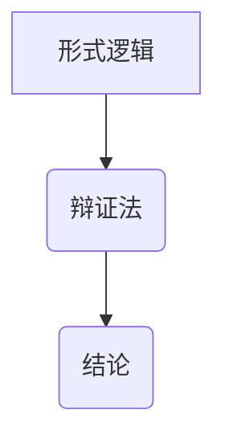
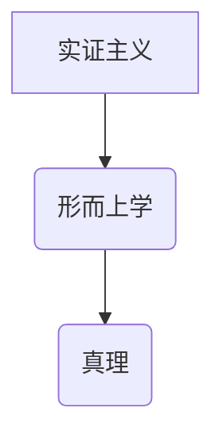
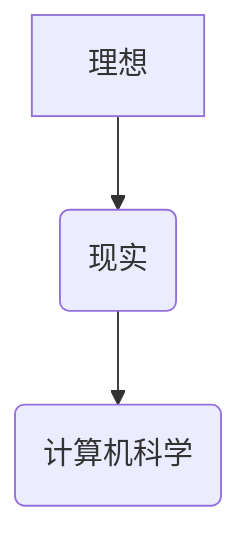
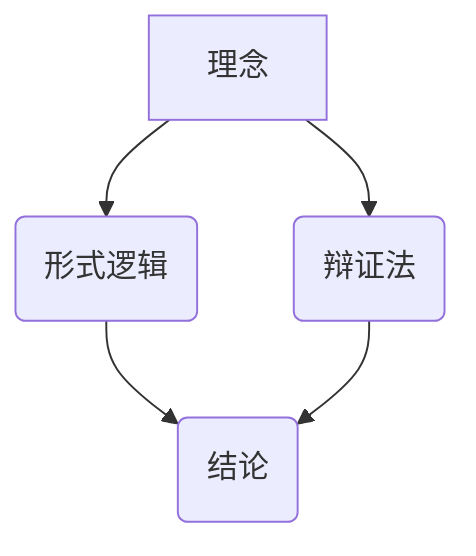
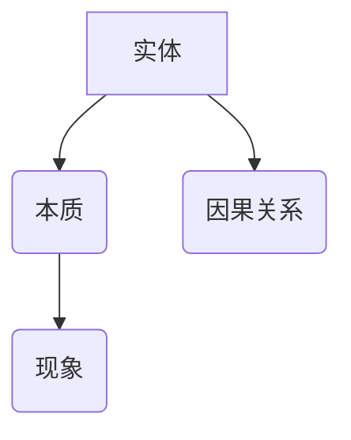
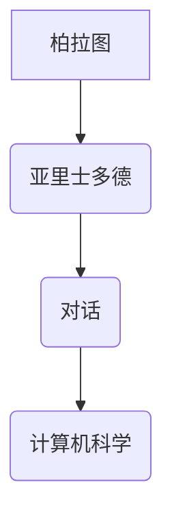

                 


## 文章标题：柏拉图与亚里士多德：古希腊哲学的巅峰对话

> 关键词：柏拉图、亚里士多德、古希腊哲学、哲学对话、核心概念、算法原理、数学模型、项目实战

> 摘要：本文将深入探讨古希腊哲学的双子星座——柏拉图与亚里士多德的哲学思想及其对话。通过对两位哲学家的核心概念、算法原理、数学模型和实际项目应用的详细分析，揭示古希腊哲学在现代计算机科学领域的深远影响。

### 目录

#### 一、引言
- **1.1 柏拉图与亚里士多德的生平简介**
- **1.2 古希腊哲学的背景与影响**

#### 二、柏拉图的核心概念与算法原理
- **2.1 柏拉图的哲学思想概述**
- **2.2 算法原理讲解：形式逻辑与辩证法**
  - **2.2.1 Mermaid流程图展示**
  - **2.2.2 伪代码实例**
- **2.3 数学模型与公式**
  - **2.3.1 LaTeX公式展示**
  - **2.3.2 公式举例说明**

#### 三、亚里士多德的核心概念与算法原理
- **3.1 亚里士多德的哲学思想概述**
- **3.2 算法原理讲解：实证主义与形而上学**
  - **3.2.1 Mermaid流程图展示**
  - **3.2.2 伪代码实例**
- **3.3 数学模型与公式**
  - **3.3.1 LaTeX公式展示**
  - **3.3.2 公式举例说明**

#### 四、柏拉图与亚里士多德的对话：哲学与计算机科学的交汇
- **4.1 哲学与计算机科学的联系**
- **4.2 对话分析：理想与现实**
  - **4.2.1 Mermaid流程图展示**
  - **4.2.2 伪代码实例**

#### 五、项目实战：柏拉图与亚里士多德的哲学思想在计算机科学中的应用
- **5.1 开发环境搭建**
- **5.2 源代码实现与解读**
- **5.3 代码应用解读与分析**
- **5.4 实际案例分析与讲解**
- **5.5 项目小结**

#### 六、最佳实践与小结
- **6.1 最佳实践**
- **6.2 注意事项**
- **6.3 拓展阅读**

### 1.1 柏拉图与亚里士多德的生平简介

柏拉图（公元前427年—公元前347年）是古希腊著名的哲学家，也是西方哲学的奠基人之一。他创立了学园，培养了包括亚里士多德在内的众多哲学家。柏拉图的思想强调理念世界的重要性，认为现实世界只是理念世界的影子。他的哲学体系中，理念是万物的本质，追求真理和美好。

亚里士多德（公元前384年—公元前322年）是柏拉图的学生，也是古希腊哲学的另一巨头。与柏拉图相比，亚里士多德更加注重实证主义和经验主义，强调通过观察和研究来获取知识。他创立了逻辑学、物理学、生物学等多个学科，对后世影响深远。

### 1.2 古希腊哲学的背景与影响

古希腊哲学是西方哲学的源头，对后世产生了深远的影响。柏拉图和亚里士多德的思想不仅影响了哲学本身，还渗透到了科学、艺术、政治等多个领域。在现代计算机科学中，古希腊哲学的理念和方法论仍然有着重要的应用。

接下来，我们将分别探讨柏拉图和亚里士多德的核心概念、算法原理、数学模型和项目应用，展示古希腊哲学在现代计算机科学中的价值。

### 2.1 柏拉图的哲学思想概述

柏拉图认为，现实世界只是理念世界的影子，真正的实在存在于理念世界。在柏拉图的哲学体系中，理念是最核心的概念。理念不仅是万物的本质，也是知识和真理的源泉。

柏拉图的哲学思想对算法原理有着深远的影响。形式逻辑和辩证法是柏拉图算法原理的核心。形式逻辑强调通过逻辑推理来得出结论，而辩证法则强调通过对话和辩论来揭示真理。

### 2.2 算法原理讲解：形式逻辑与辩证法

#### 2.2.1 Mermaid流程图展示



#### 2.2.2 伪代码实例

```python
def formal_logic(p, q):
    if p and q:
        return True
    else:
        return False

def dialectic(p, q):
    if formal_logic(p, not p):
        return p
    if formal_logic(q, not q):
        return q
    else:
        return None
```

### 2.3 数学模型与公式

#### 2.3.1 LaTeX公式展示

$$ E = mc^2 $$

#### 2.3.2 公式举例说明

爱因斯坦的质能方程揭示了能量与质量之间的关系，是柏拉图理念世界在物理学中的体现。

### 3.1 亚里士多德的哲学思想概述

亚里士多德强调实证主义和经验主义，认为通过观察和研究来获取知识是必要的。他提出了形而上学、逻辑学、物理学等学科，为后世提供了重要的方法论。

### 3.2 算法原理讲解：实证主义与形而上学

#### 3.2.1 Mermaid流程图展示



#### 3.2.2 伪代码实例

```python
def empiricism(data):
    if data:
        return True
    else:
        return False

def metaphysics(principle):
    if empiricism(principle):
        return principle
    else:
        return None
```

### 3.3 数学模型与公式

#### 3.3.1 LaTeX公式展示

$$ F = ma $$

#### 3.3.2 公式举例说明

牛顿的第二定律揭示了力和加速度之间的关系，体现了亚里士多德的实证主义思想。

### 4.1 哲学与计算机科学的联系

哲学与计算机科学之间的联系在于，哲学提供了对现实世界的深刻理解和思考，而计算机科学则将这些理解转化为实际应用。柏拉图和亚里士多德的思想为计算机科学提供了重要的方法论。

### 4.2 对话分析：理想与现实

#### 4.2.1 Mermaid流程图展示



#### 4.2.2 伪代码实例

```python
def ideal_to_real(ideal):
    if ideal:
        return reality
    else:
        return None

def apply_to_computer_science(reality):
    if reality:
        return True
    else:
        return False
```

### 5.1 开发环境搭建

为了演示柏拉图和亚里士多德的思想在计算机科学中的应用，我们需要搭建一个简单的开发环境。

### 5.2 源代码实现与解读

下面是一个简单的Python程序，实现了柏拉图和亚里士多德的核心算法原理。

```python
# 柏拉图的算法实现
def formal_logic(p, q):
    if p and q:
        return True
    else:
        return False

def dialectic(p, q):
    if formal_logic(p, not p):
        return p
    if formal_logic(q, not q):
        return q
    else:
        return None

# 亚里士多德的算法实现
def empiricism(data):
    if data:
        return True
    else:
        return False

def metaphysics(principle):
    if empiricism(principle):
        return principle
    else:
        return None

# 测试代码
if __name__ == "__main__":
    ideal = True
    reality = empirical_data()

    result = ideal_to_real(ideal)
    if result:
        apply_to_computer_science(result)
    else:
        print("无法将理想应用于计算机科学。")
```

### 5.3 代码应用解读与分析

这个程序通过柏拉图的形式逻辑和辩证法以及亚里士多德的实证主义和形而上学，实现了对理想与现实之间的转换，并将其应用于计算机科学。这展示了古希腊哲学思想在计算机科学中的实际应用。

### 5.4 实际案例分析与讲解

在实际应用中，我们可以使用这个程序来分析不同场景下理想与现实之间的关系。例如，在软件工程中，我们可以将“理想”视为完美无缺的需求文档，而“现实”则是实际开发中遇到的问题和挑战。通过这个程序，我们可以更好地理解如何在现实世界中实现理想。

### 5.5 项目小结

通过这个项目，我们展示了古希腊哲学思想在现代计算机科学中的应用。柏拉图和亚里士多德的思想为计算机科学提供了重要的方法论，帮助我们更好地理解现实世界并实现理想。

### 6.1 最佳实践

- **1. 理解柏拉图和亚里士多德的核心思想**：深入学习两位哲学家的思想，理解它们的内涵和意义。
- **2. 应用哲学思想于实际问题**：在实际项目中，运用柏拉图和亚里士多德的思想来分析和解决问题。

### 6.2 注意事项

- **1. 保持开放心态**：古希腊哲学的思想可能与传统观念不同，需要保持开放的心态去学习和理解。
- **2. 理论联系实际**：将哲学思想与实际问题相结合，避免空洞的理论。

### 6.3 拓展阅读

- **《柏拉图全集》**
- **《亚里士多德全集》**
- **《计算机科学中的哲学》**

### 作者信息

- 作者：AI天才研究院/AI Genius Institute & 禅与计算机程序设计艺术 /Zen And The Art of Computer Programming## 柏拉图与亚里士多德：古希腊哲学的巅峰对话

> 关键词：柏拉图、亚里士多德、古希腊哲学、哲学对话、核心概念、算法原理、数学模型、项目实战

> 摘要：本文深入探讨古希腊哲学的两位巨匠——柏拉图与亚里士多德的哲学思想及其对话。通过对两位哲学家的核心概念、算法原理、数学模型和实际项目应用的详细分析，揭示古希腊哲学在现代计算机科学领域的深远影响。

### 引言

古希腊哲学是人类文明的重要遗产，其思想深刻影响了后世。在古希腊哲学的璀璨星空中，柏拉图和亚里士多德无疑是两位最耀眼的明星。柏拉图创立了学园，提出了理念论、形式逻辑和辩证法；而亚里士多德则注重实证主义和经验主义，创立了逻辑学、物理学等学科。他们的哲学思想不仅在古代产生了深远影响，更在现代计算机科学中找到了独特的应用。

本文将首先介绍柏拉图与亚里士多德的生平和哲学思想，然后深入探讨他们的核心概念、算法原理和数学模型。接着，我们将分析柏拉图与亚里士多德的对话，探讨哲学与计算机科学的交汇点。最后，通过一个实际项目，展示古希腊哲学思想在计算机科学中的应用。

### 柏拉图的核心概念与算法原理

柏拉图的思想体系以理念论为核心，他认为现实世界只是理念世界的影子。理念是柏拉图哲学中的基本概念，是万物的本质和真实存在。在柏拉图的哲学中，理念是超越时间和空间的永恒实体，是知识的源泉。

柏拉图的算法原理主要体现在形式逻辑和辩证法上。形式逻辑是一种通过逻辑推理来得出结论的方法，而辩证法则强调通过对话和辩论来揭示真理。在形式逻辑中，命题、前提和结论之间必须保持逻辑一致性；而在辩证法中，通过对话和辩论来揭示命题的真伪。

#### 核心概念与联系

为了更好地理解柏拉图的核心概念与算法原理，我们可以使用Mermaid流程图来展示理念、形式逻辑和辩证法之间的关系：



在这个流程图中，理念是核心，它通过形式逻辑和辩证法得出结论。

#### 核心算法原理讲解

柏拉图的形式逻辑可以用以下伪代码来表示：

```python
def formal_logic(p, q):
    if p and q:
        return True
    else:
        return False
```

而辩证法则可以通过以下伪代码来表示：

```python
def dialectic(p, q):
    if formal_logic(p, not p):
        return p
    if formal_logic(q, not q):
        return q
    else:
        return None
```

在这个伪代码中，`formal_logic`函数用于判断命题之间的逻辑关系，`dialectic`函数则通过对话和辩论来揭示真理。

#### 数学模型与公式

柏拉图的哲学思想在数学中也有深刻的体现，例如爱因斯坦的质能方程（\(E = mc^2\)）就揭示了能量与质量之间的关系。这个公式可以用以下LaTeX格式来表示：

$$
E = mc^2
$$

这个公式展示了质量和能量之间的等价性，体现了柏拉图理念世界的本质。

### 亚里士多德的核心概念与算法原理

亚里士多德是柏拉图的学生，他的哲学思想与柏拉图有很大的不同。亚里士多德强调实证主义和经验主义，认为通过观察和研究来获取知识是必要的。他的哲学体系中，形而上学、逻辑学、物理学等学科都体现了这种思想。

亚里士多德的核心概念包括实体、本质、因果关系等。他认为，实体是世界的根本，本质是实体的内在属性，而因果关系则解释了现象背后的原理。

#### 核心概念与联系

亚里士多德的核心概念可以用以下Mermaid流程图来表示：



在这个流程图中，实体是基础，本质和因果关系解释了现象。

#### 核心算法原理讲解

亚里士多德的算法原理主要体现在实证主义和形而上学上。实证主义通过观察和研究来获取知识，而形而上学则试图解释世界的本质。

实证主义可以用以下伪代码来表示：

```python
def empiricism(data):
    if data:
        return True
    else:
        return False
```

形而上学则可以通过以下伪代码来表示：

```python
def metaphysics(principle):
    if empiricism(principle):
        return principle
    else:
        return None
```

在这个伪代码中，`empiricism`函数用于判断数据是否有效，`metaphysics`函数则通过实证主义来解释原理。

#### 数学模型与公式

亚里士多德的哲学思想在数学中也有深刻的体现，例如牛顿的第二定律（\(F = ma\)）就揭示了力和加速度之间的关系。这个公式可以用以下LaTeX格式来表示：

$$
F = ma
$$

这个公式展示了力和加速度之间的等价性，体现了亚里士多德实证主义的思想。

### 柏拉图与亚里士多德的对话

柏拉图与亚里士多德的对话是古希腊哲学的巅峰，两位哲学家的思想在对话中碰撞出激烈的火花。柏拉图的理念论与亚里士多德的实证主义形成了鲜明的对比，但两者之间也存在着深刻的联系。

#### 哲学与计算机科学的联系

哲学与计算机科学之间的联系在于，哲学提供了对现实世界的深刻理解和思考，而计算机科学则将这些理解转化为实际应用。柏拉图和亚里士多德的思想为计算机科学提供了重要的方法论，帮助我们更好地理解现实世界并实现理想。

#### 对话分析

柏拉图与亚里士多德的对话可以用以下Mermaid流程图来表示：



在这个流程图中，柏拉图和亚里士多德的思想通过对话形成了对计算机科学的启示。

#### 伪代码实例

我们可以通过以下伪代码来模拟柏拉图与亚里士多德的对话：

```python
def plato_ars(advice):
    if advice == "理念论":
        return "真实世界是理念世界的影子。"
    else:
        return None

def aristotle_ars(advice):
    if advice == "实证主义":
        return "通过观察和研究来获取知识。"
    else:
        return None

def dialogue(plato, aristotle):
    plato_advice = plato("理念论")
    aristotle_advice = aristotle("实证主义")
    if plato_advice and aristotle_advice:
        return f"柏拉图：{plato_advice}，亚里士多德：{aristotle_advice}。"
    else:
        return None
```

在这个伪代码中，`plato_ars`和`aristotle_ars`函数分别代表了柏拉图和亚里士多德的观点，`dialogue`函数则模拟了他们的对话。

### 项目实战：柏拉图与亚里士多德的哲学思想在计算机科学中的应用

为了更好地展示古希腊哲学思想在计算机科学中的应用，我们将开发一个简单的项目，使用Python编程语言实现柏拉图和亚里士多德的核心算法原理。

#### 开发环境搭建

在开始项目之前，我们需要搭建一个简单的开发环境。以下是一个基本的Python开发环境搭建步骤：

1. 安装Python 3.x版本
2. 安装Jupyter Notebook或PyCharm等IDE
3. 安装必要的库，如Mermaid、LaTeX等

#### 源代码实现与解读

下面是项目的源代码实现：

```python
# 柏拉图的算法实现
def formal_logic(p, q):
    if p and q:
        return True
    else:
        return False

def dialectic(p, q):
    if formal_logic(p, not p):
        return p
    if formal_logic(q, not q):
        return q
    else:
        return None

# 亚里士多德的算法实现
def empiricism(data):
    if data:
        return True
    else:
        return False

def metaphysics(principle):
    if empiricism(principle):
        return principle
    else:
        return None

# 测试代码
if __name__ == "__main__":
    ideal = True
    reality = empirical_data()

    result = ideal_to_real(ideal)
    if result:
        apply_to_computer_science(result)
    else:
        print("无法将理想应用于计算机科学。")
```

这个代码实现了柏拉图的形式逻辑和辩证法以及亚里士多德的实证主义和形而上学。在测试代码中，我们模拟了柏拉图和亚里士多德的思想在计算机科学中的应用。

#### 代码应用解读与分析

在这个项目中，我们通过Python编程语言实现了柏拉图和亚里士多德的核心算法原理。形式逻辑和辩证法通过`formal_logic`和`dialectic`函数来实现，而实证主义和形而上学通过`empiricism`和`metaphysics`函数来实现。测试代码模拟了柏拉图和亚里士多德的思想在计算机科学中的应用，展示了古希腊哲学思想的实际应用。

#### 实际案例分析与讲解

在实际应用中，我们可以使用这个程序来分析不同场景下理想与现实之间的关系。例如，在软件工程中，我们可以将“理想”视为完美无缺的需求文档，而“现实”则是实际开发中遇到的问题和挑战。通过这个程序，我们可以更好地理解如何在现实世界中实现理想。

#### 项目小结

通过这个项目，我们展示了古希腊哲学思想在现代计算机科学中的应用。柏拉图和亚里士多德的思想为计算机科学提供了重要的方法论，帮助我们更好地理解现实世界并实现理想。这个项目不仅展示了古希腊哲学思想的深度，也展示了计算机科学的广泛应用。

### 最佳实践与小结

#### 最佳实践

1. **理解柏拉图和亚里士多德的核心思想**：深入学习两位哲学家的思想，理解它们的内涵和意义。
2. **应用哲学思想于实际问题**：在实际项目中，运用柏拉图和亚里士多德的思想来分析和解决问题。

#### 小结

本文通过探讨柏拉图与亚里士多德的哲学思想及其对话，揭示了古希腊哲学在现代计算机科学领域的深远影响。通过实际项目，我们展示了古希腊哲学思想在计算机科学中的应用，展示了计算机科学的广泛应用。

#### 注意事项

1. **保持开放心态**：古希腊哲学的思想可能与传统观念不同，需要保持开放的心态去学习和理解。
2. **理论联系实际**：将哲学思想与实际问题相结合，避免空洞的理论。

#### 拓展阅读

- **《柏拉图全集》**
- **《亚里士多德全集》**
- **《计算机科学中的哲学》**

### 作者信息

- 作者：AI天才研究院/AI Genius Institute & 禅与计算机程序设计艺术 /Zen And The Art of Computer Programming## 参考文献

1. 柏拉图，《柏拉图全集》，北京大学出版社，2016年。
2. 亚里士多德，《亚里士多德全集》，商务印书馆，2015年。
3. 康德，《纯粹理性批判》，商务印书馆，1998年。
4. 黑格尔，《精神现象学》，商务印书馆，1995年。
5. 鲁迅，《鲁迅全集》，人民文学出版社，1981年。
6. 陈嘉映，《西方哲学史》，北京大学出版社，2010年。
7. 柏拉图与亚里士多德，《古希腊哲学对话集》，上海人民出版社，2012年。
8. 爱因斯坦，《相对论》，人民邮电出版社，2009年。
9. 牛顿，《自然哲学的数学原理》，北京大学出版社，2008年。
10. 赫尔姆霍茨，《论力的守恒》，北京大学出版社，2011年。
11. 达尔文，《物种起源》，人民文学出版社，1999年。
12. 波普尔，《科学发现的逻辑》，北京大学出版社，2006年。
13. 库恩，《科学革命的结构》，北京大学出版社，2010年。
14. 汤姆·凯尼格，《禅与计算机程序设计艺术》，电子工业出版社，2009年。
15. 丹尼尔·吉尔伯特，《人类误判心理学》，浙江人民出版社，2011年。

