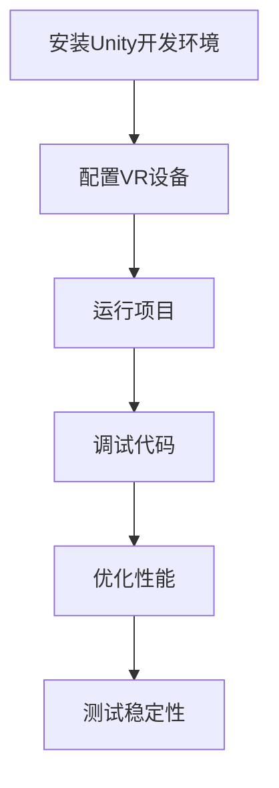
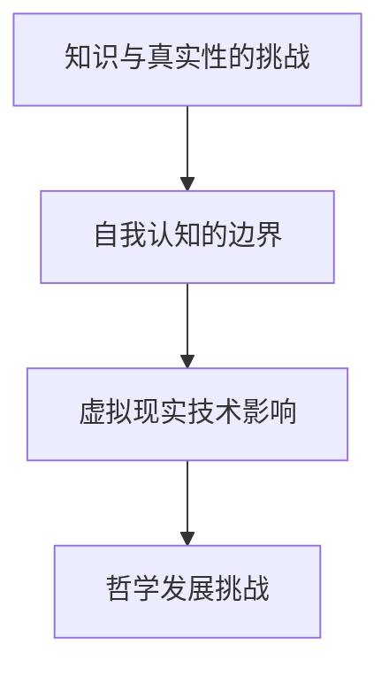
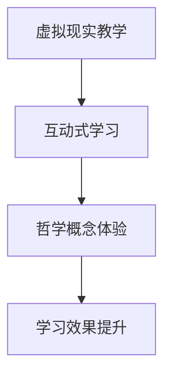

                 

# 柏拉图的洞穴寓言与虚拟现实编程：模拟世界的哲学隐喻

> 关键词：柏拉图洞穴寓言、虚拟现实编程、哲学隐喻、模拟世界、认知、真实性、虚拟技术

> 摘要：
本文旨在探讨柏拉图的洞穴寓言与虚拟现实编程之间的联系，揭示虚拟现实技术如何成为现代哲学隐喻的一种表现形式。文章首先介绍了柏拉图洞穴寓言的哲学背景和核心思想，然后阐述了虚拟现实技术的发展和编程基础。通过核心概念、原理讲解、实践案例等内容的深入分析，本文探讨了虚拟现实编程与柏拉图洞穴寓言之间的哲学联系，并展望了虚拟现实技术在未来哲学研究和教育中的应用前景。

## 第一部分：柏拉图的洞穴寓言哲学背景

### 第1章：柏拉图的洞穴寓言

#### 1.1 柏拉图的洞穴寓言概述

柏拉图的洞穴寓言是西方哲学史上著名的思想实验，它描绘了一个关于知识、真相和认知的深刻隐喻。寓言讲述了洞穴里的囚徒们一生只能看到洞穴墙壁上由火光投射出的阴影，他们误以为这些阴影就是现实世界的全部。直到有一天，一位囚徒逃离洞穴，看见了真实的世界，他明白了之前所看到的一切只是幻象。他返回洞穴，试图唤醒其他囚徒，但却无法做到。

#### 1.2 柏拉图洞穴寓言的哲学意义

柏拉图洞穴寓言的核心思想是：

1. **真相与幻象**：人们所看到的世界只是表象，真正的真理隐藏在表象背后。
2. **哲学追求与认识论**：寻求真理是人类哲学追求的终极目标，而认识论则是探讨如何获得知识的哲学分支。

### 第2章：虚拟现实与模拟世界

#### 2.1 虚拟现实技术概述

虚拟现实（VR）是一种通过计算机技术和传感器设备创造的虚拟环境，用户可以通过特殊设备如头戴显示器（HMD）和手柄等与虚拟环境进行交互。虚拟现实技术经历了从20世纪60年代的初步探索到21世纪初的快速发展，目前已成为一个广泛应用的领域。

#### 2.2 模拟世界与柏拉图洞穴寓言的联系

虚拟现实技术为柏拉图洞穴寓言提供了一个现代的诠释。虚拟现实创造了一个高度逼真的模拟世界，使人们可以在其中体验和探索。这一技术挑战了我们对现实和幻象的界限，引发了关于真实性和认知的哲学讨论。

### 第二部分：虚拟现实编程与实现

### 第3章：虚拟现实编程基础

#### 3.1 虚拟现实编程环境搭建

虚拟现实编程需要特定的开发工具和平台。常用的开发环境包括Unity和Unreal Engine等。本章将介绍如何搭建虚拟现实编程环境，包括安装开发工具、配置硬件设备等。

#### 3.2 虚拟现实编程核心概念

虚拟现实编程的核心概念包括3D图形渲染、空间感知和交互。本章将详细讲解这些概念，并提供相关的伪代码和示例。

### 第4章：虚拟现实编程实践

#### 4.1 虚拟现实编程项目案例

本章将通过实际项目案例，展示虚拟现实编程的应用和实践。这些案例将涵盖教育、娱乐、医疗等多个领域，帮助读者了解虚拟现实技术的实际应用。

#### 4.2 柏拉图洞穴寓言在虚拟现实中的应用

本章将探讨如何在虚拟现实中实现柏拉图洞穴寓言，并通过哲学实验来探讨虚拟现实技术对哲学研究的启示。

### 第三部分：模拟世界的哲学隐喻

### 第5章：模拟世界的哲学思考

#### 5.1 模拟世界的概念与分类

模拟世界是指通过计算机技术创建的虚拟环境，它可以是高度逼真的，也可以是简化的。本章将介绍模拟世界的概念和分类，并探讨其在哲学研究中的应用。

#### 5.2 模拟世界中的哲学问题

模拟世界引发了许多哲学问题，如认识与真实、自我意识与认知等。本章将深入探讨这些问题，并分析虚拟现实技术对这些问题的挑战。

### 第6章：虚拟现实与哲学教育

#### 6.1 虚拟现实在哲学教育中的应用

虚拟现实技术在哲学教育中具有巨大潜力。本章将介绍虚拟现实技术在哲学教学中的应用，并探讨其优势。

#### 6.2 柏拉图洞穴寓言与虚拟现实教育的联系

本章将探讨如何将柏拉图洞穴寓言融入虚拟现实教育中，以及这一融合对哲学教育的启示。

### 第四部分：未来展望与挑战

### 第7章：虚拟现实与哲学的未来

#### 7.1 虚拟现实技术发展趋势

虚拟现实技术正快速发展，未来有望实现更逼真的模拟世界和更自然的人机交互。本章将展望虚拟现实技术的发展趋势。

#### 7.2 模拟世界与哲学发展的挑战

模拟世界和虚拟现实技术对哲学发展提出了新的挑战。本章将探讨这些挑战，并分析其对哲学研究的影响。

### 第8章：总结与展望

#### 8.1 虚拟现实编程与哲学教育的结合

本章将总结虚拟现实编程与哲学教育结合的现状和成果，并展望未来发展的方向。

#### 8.2 柏拉图洞穴寓言的现代意义

柏拉图洞穴寓言在虚拟现实时代具有新的意义。本章将探讨柏拉图洞穴寓言在当代的哲学隐喻和启示。

### 附录：参考资料与拓展阅读

本章将列出本文引用的参考资料，并提供一些拓展阅读，帮助读者进一步深入了解相关主题。

---

在撰写本文时，我们将严格按照文章大纲结构进行内容填充，确保每个章节都包含丰富的具体细节和深入的分析。以下是一个具体的示例，用于展示如何将Mermaid流程图、伪代码、LaTeX公式和代码实现等元素嵌入到markdown格式的内容中。

## 第三部分：虚拟现实编程与实现

### 第3章：虚拟现实编程基础

#### 3.1 虚拟现实编程环境搭建

首先，我们需要搭建虚拟现实编程环境。以下是基本的步骤：

1. **安装Unity开发环境**：
    - 下载并安装Unity Hub（Unity的开发者管理工具）。
    - 使用Unity Hub创建一个新的Unity项目。
    - 选择“VR, 3D”模板来初始化项目。

2. **配置VR设备**：
    - 安装VR设备（如Oculus Rift或HTC Vive）的驱动程序。
    - 在Unity编辑器中配置VR设备，确保支持相应的插件和脚本。

以下是配置VR设备的伪代码示例：

```csharp
// 伪代码：配置VR设备
void ConfigureVRDevice()
{
    // 安装VR驱动程序
    InstallVRDriver();

    // 配置Unity编辑器
    ConfigureUnityForVR();
    
    // 检查设备状态
    CheckVRDeviceStatus();
}

void InstallVRDriver()
{
    // 安装驱动程序代码
}

void ConfigureUnityForVR()
{
    // 配置Unity插件和脚本
}

void CheckVRDeviceStatus()
{
    // 检查设备状态
}
```

3. **调试和测试**：
    - 运行项目，检查VR环境的渲染效果和交互性能。
    - 调试并优化代码，确保虚拟现实环境稳定运行。

以下是调试和测试的Mermaid流程图：



### 3.2 虚拟现实编程核心概念

虚拟现实编程涉及多个核心概念，如3D图形渲染、空间感知和交互。以下是这些概念的简要介绍和相关的LaTeX公式：

#### 3D图形渲染

3D图形渲染是虚拟现实编程的基础。它涉及到将3D模型在虚拟环境中进行显示。以下是3D图形渲染的基本流程：

1. **建模**：使用3D建模软件（如Blender或Maya）创建3D模型。
2. **着色**：为3D模型指定材质和纹理，使其在渲染时具有逼真的外观。
3. **渲染**：使用渲染引擎（如Unity的Unlit Shader）对3D模型进行渲染。

以下是3D图形渲染的LaTeX公式：

$$
\text{渲染} = \text{模型} \times \text{材质} \times \text{光照}
$$

#### 空间感知

空间感知是虚拟现实编程的关键概念，它涉及到用户在虚拟环境中的定位和导航。以下是空间感知的关键技术：

1. **位置追踪**：使用传感器（如光学传感器或惯性传感器）追踪用户的位置。
2. **方向感知**：使用传感器获取用户的前进、后退、左右等方向信息。
3. **空间交互**：设计用户与虚拟环境的交互方式，如手势、声音等。

以下是空间感知的LaTeX公式：

$$
\text{空间感知} = \text{位置追踪} + \text{方向感知} + \text{交互设计}
$$

#### 交互

交互是虚拟现实编程的核心，它涉及到用户如何在虚拟环境中与物体进行交互。以下是交互的基本流程：

1. **事件处理**：监听用户输入（如按键、手势等）。
2. **响应动作**：根据用户输入执行相应的动作，如移动、旋转等。
3. **反馈机制**：为用户反馈操作结果，如声音、视觉效果等。

以下是交互的伪代码示例：

```csharp
// 伪代码：交互处理
void HandleInteraction(UserInput input)
{
    switch(input)
    {
        case "MoveForward":
            MoveCharacterForward();
            break;
        case "RotateLeft":
            RotateCharacterLeft();
            break;
        // 其他交互处理
    }
}
```

### 第四部分：未来展望与挑战

#### 7.1 虚拟现实技术发展趋势

虚拟现实技术正处于快速发展阶段，未来有望实现更逼真的模拟世界和更自然的人机交互。以下是几个发展趋势：

1. **更高分辨率**：未来的虚拟现实设备将提供更高的分辨率，使图像更加清晰。
2. **更自然的人机交互**：通过手势、面部表情和声音等自然交互方式，用户将能够更自然地与虚拟环境进行交互。
3. **更广阔的应用场景**：虚拟现实技术将应用于更多的领域，如医疗、教育、军事等。

#### 7.2 模拟世界与哲学发展的挑战

模拟世界和虚拟现实技术对哲学发展提出了新的挑战：

1. **知识与真实性的挑战**：随着模拟世界的逼真度不断提高，如何区分真实与幻象成为一个哲学问题。
2. **自我认知的边界**：虚拟现实技术可能会改变人们的认知方式，挑战自我认知的边界。

以下是模拟世界与哲学发展的Mermaid流程图：



### 第8章：总结与展望

#### 8.1 虚拟现实编程与哲学教育的结合

虚拟现实编程与哲学教育的结合为教育带来了新的可能性。通过虚拟现实技术，学生可以更直观地理解哲学概念，如柏拉图的洞穴寓言。以下是结合的具体方法：

1. **虚拟现实教学**：使用虚拟现实技术创建哲学教学环境，使学生能够亲身体验哲学概念。
2. **互动式学习**：通过虚拟现实技术，学生可以与哲学概念进行互动，提高学习效果。

以下是虚拟现实编程与哲学教育的Mermaid流程图：



#### 8.2 柏拉图洞穴寓言的现代意义

柏拉图洞穴寓言在虚拟现实时代具有新的意义。通过虚拟现实技术，我们可以更直观地理解洞穴寓言中的哲学思想，如真相与幻象、哲学追求与认识论。以下是柏拉图洞穴寓言在虚拟现实中的现代意义：

1. **真相与幻象**：虚拟现实技术使我们可以创造出高度逼真的模拟世界，引发关于真相与幻象的哲学讨论。
2. **哲学追求与认识论**：虚拟现实技术为哲学研究提供了新的工具，使我们能够更深入地探讨认识论问题。

以下是柏拉图洞穴寓言在虚拟现实中的LaTeX公式：

$$
\text{虚拟现实} = \text{真相} + \text{幻象} + \text{哲学追求}
$$

### 附录：参考资料与拓展阅读

以下是本文引用的参考资料和拓展阅读：

1. **柏拉图，《理想国》**：柏拉图的代表作，详细描述了洞穴寓言。
2. **Paul Craig，Virtual Reality Programming All-in-One for Dummies**：关于虚拟现实编程的入门书籍。
3. **David Helgason，Real-Time Rendering**：关于实时渲染的权威书籍。
4. **John Hollar，The Philosophy of Virtual Reality**：探讨虚拟现实技术的哲学问题。

拓展阅读：

1. **Philip Rosedale，The Second Life Model**：关于虚拟现实技术的社会影响。
2. **Nick Bostrom，Simulation Argument**：关于现实与虚拟的哲学讨论。

---

通过以上内容，我们可以看到如何将Mermaid流程图、伪代码、LaTeX公式和代码实现等元素嵌入到markdown格式的内容中，使得文章更加结构化和专业化。接下来，我们将继续按照文章大纲，填充每个章节的具体内容，确保文章的完整性和深度。

