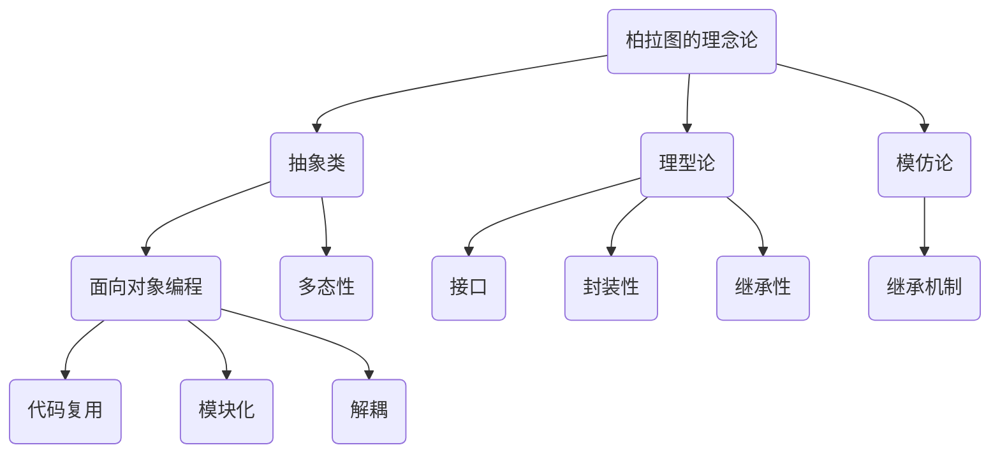

                 

### 文章标题

# 《柏拉图的理念论与抽象类：理想形式的代码实现》

### 关键词

- 柏拉图的理念论
- 抽象类
- 理想形式的代码实现
- 计算机科学
- 面向对象编程

### 摘要

本文旨在探讨古希腊哲学家柏拉图的理念论如何与现代计算机科学中的抽象类概念相结合，以及这种结合如何在编程实践中实现理想化的代码设计。通过对柏拉图的理念论和抽象类的基本概念进行深入剖析，本文将展示它们在面向对象编程中的应用，并通过具体的算法原理讲解和代码实现示例，阐述如何将柏拉图的理念转化为实际可行的编程模式。最后，本文将对柏拉图理念与抽象类的相互关系进行总结，并对未来的研究方向和实践建议提出展望。

### 背景介绍

#### 柏拉图的理念论

柏拉图（Plato，公元前427年-公元前347年），古希腊哲学家，西方哲学的奠基人之一，他的理念论是哲学思想史上的一个重要里程碑。柏拉图的理念论认为，现实世界只是理念世界的影子或摹本，理念世界才是真实的、永恒的、不变的。在柏拉图的哲学体系中，理念（或称为形式、理型）是构成一切事物的终极原因和本质，是所有具体事物所模仿或追求的理想形式。

柏拉图的理念论主要包括以下几个核心概念：

1. **理念（Forms 或 Ideas）**：理念是抽象的、普遍的、永恒的，它们构成了事物的本质和形式。例如，理念中的“正义”是所有具体表现正义的行为的终极原因。

2. **模仿论**：柏拉图认为，现实世界中的事物只是对理念世界的模仿。例如，现实中的“桌子”是对理念中的“桌子”的一种具体表现。

3. **理型论**：理型或形式是事物的本质和属性，是超越具体存在的、永恒的、不可变的。

4. **认识论**：柏拉图认为，真正的知识是对理念世界的认识和领悟，而非对现实世界的感知和经验。

#### 抽象类在计算机科学中的角色

在计算机科学中，抽象类是面向对象编程（Object-Oriented Programming, OOP）中的一个核心概念。抽象类提供了一种通用模板，用于定义类的一般结构和行为，但本身不实例化。它通过继承机制，为子类提供了一种共同的接口和属性，使得子类可以继承和扩展抽象类的功能。

抽象类的主要特点包括：

1. **抽象性**：抽象类不包含具体实现，而是提供了一种抽象的接口，用于描述类的一般行为和属性。

2. **多态性**：通过继承和接口，抽象类支持多态性，使得子类可以有不同的具体实现，但仍然可以通过抽象类进行统一处理。

3. **封装性**：抽象类通过封装将具体的实现细节隐藏起来，仅提供公开的接口供外部使用。

4. **继承性**：抽象类可以作为基类，用于定义子类的通用行为和属性，从而实现代码的重用和扩展。

#### 柏拉图的理念论与抽象类的关系

柏拉图的理念论与抽象类之间存在深刻的联系。柏拉图的理念论强调了抽象和普遍性，而抽象类在计算机科学中正是通过抽象来定义通用结构和行为的。以下是一些具体的关系：

1. **理念与抽象类的关系**：理念是柏拉图哲学中的抽象概念，而抽象类则是计算机科学中的抽象概念。两者都用于描述事物的本质和形式，只是应用领域不同。

2. **模仿与继承的关系**：柏拉图认为现实世界模仿理念世界，而面向对象编程中的继承关系也体现了类似的模仿过程。子类通过继承基类，模仿并扩展基类的行为和属性。

3. **普遍性与多态性**：柏拉图的理念具有普遍性和永恒性，而抽象类通过多态性支持多种不同的具体实现，但仍然保持一致的接口。

通过这种联系，我们可以将柏拉图的理念论应用于计算机科学中，实现更加理想化的代码设计。本文接下来将深入探讨柏拉图的理念论与抽象类的具体应用和实践。

### 柏拉图的理念论核心概念

#### 理念（Forms 或 Ideas）

理念是柏拉图哲学中的核心概念，代表了事物的本质和形式。在柏拉图的理念论中，理念不仅是一种抽象的概念，更是所有具体事物的终极原因和本质。柏拉图认为，现实世界中的事物只是理念世界的影子或摹本，理念世界才是真实的、永恒的、不变的。

例如，柏拉图认为“正义”不仅仅是一个抽象的概念，而是存在于理念世界中的一个具体、永恒的实体。现实世界中的任何表现正义的行为，都是对这一理念的具体模仿。这种模仿不仅体现了理念的普遍性和永恒性，也揭示了现实世界与理念世界的密切联系。

在计算机科学中，理念的概念可以类比为抽象类。抽象类提供了一种通用的模板，用于定义类的一般结构和行为。它与具体类的关系类似于理念与现实世界的关系。具体类通过继承抽象类，模仿并扩展其行为和属性，从而实现代码的复用和扩展。

#### 模仿论

模仿论是柏拉图理念论中的一个重要组成部分，它认为现实世界中的事物只是对理念世界的模仿。柏拉图通过一系列的比喻来说明这一观点，例如洞穴中的囚犯只能看到投影，无法认识到真实世界的存在。现实世界的存在只是理念世界的影子，我们对现实世界的认知也是通过模仿理念世界得到的。

在面向对象编程中，模仿论体现在继承机制中。子类通过继承基类，模仿并扩展基类的行为和属性。例如，在一个动物类别的抽象类中，定义了所有动物共有的行为和属性，如移动、呼吸、进食等。具体的动物类（如猫、狗）通过继承这个抽象类，模仿并扩展这些行为和属性，从而实现代码的重用。

#### 理型论

理型论是柏拉图理念论的另一个重要组成部分，它强调了事物的本质和属性。柏拉图认为，理型或形式是构成一切事物的终极原因和本质，是超越具体存在的、永恒的、不可变的。

例如，柏拉图认为“桌子”不仅仅是一个具体的物品，而是存在于理念世界中的一个具体的、永恒的实体。现实世界中的所有桌子都是对这一理型的模仿，它们共享桌子的本质和属性，但每一个具体的桌子都有其独特的表现形式。

在计算机科学中，理型可以类比为接口。接口定义了类的一组行为和属性，这些行为和属性是类实现的基本规范。具体类通过实现接口，模仿并扩展这些行为和属性，从而实现代码的规范化和标准化。

#### 认识论

柏拉图的认识论强调，真正的知识是对理念世界的认识和领悟，而非对现实世界的感知和经验。他认为，只有通过心灵直观，我们才能认识到理念世界的真实本质。

在面向对象编程中，这种认识论可以类比为抽象思维。通过抽象思维，我们可以从具体的事物中提取出共同的属性和行为，定义出抽象类和接口，从而实现对复杂系统的理解和控制。

总的来说，柏拉图的理念论为计算机科学中的抽象类概念提供了深刻的哲学基础。通过理解柏拉图的理念、模仿论、理型论和认识论，我们可以更好地设计出理想化的代码，实现代码的复用、扩展和规范化。

### 抽象类的基本概念

#### 什么是抽象类

抽象类是面向对象编程中的一个核心概念，它提供了一种定义类的一般结构和行为的方式，但本身不实例化。抽象类的主要目的是定义一个通用的模板，用于描述类的一般属性和方法，同时允许子类继承并扩展这些属性和方法。

抽象类的特点包括：

1. **抽象性**：抽象类不包含具体实现，而是提供了一种抽象的接口，用于描述类的一般行为和属性。
2. **继承性**：抽象类可以作为基类，用于定义子类的通用行为和属性，从而实现代码的重用和扩展。
3. **多态性**：通过继承和接口，抽象类支持多态性，使得子类可以有不同的具体实现，但仍然可以通过抽象类进行统一处理。
4. **封装性**：抽象类通过封装将具体的实现细节隐藏起来，仅提供公开的接口供外部使用。

#### 抽象类与具体类的区别

抽象类与具体类的主要区别在于它们的使用目的和实现方式：

1. **使用目的**：抽象类主要用于定义通用结构和行为，不实例化，仅作为基类供子类继承；具体类则用于实现具体的业务逻辑和属性，可以直接实例化。

2. **实现方式**：抽象类通常包含一些抽象方法（没有具体实现的方法）和抽象属性，要求子类必须实现这些抽象方法；具体类则包含具体的方法和属性实现。

3. **关系**：抽象类与具体类之间的关系是继承关系，具体类通过继承抽象类，实现抽象类定义的通用结构和行为。

例如，在动物类别的抽象类中，我们可以定义所有动物共有的行为和属性，如移动、呼吸、进食等。具体的动物类（如猫、狗）通过继承这个抽象类，模仿并扩展这些行为和属性。

#### 抽象类的应用场景

抽象类在面向对象编程中有广泛的应用，以下是一些典型的应用场景：

1. **通用接口定义**：抽象类可以用来定义一组通用的接口和方法，用于描述类的一般行为和属性。例如，在图形用户界面编程中，可以使用抽象类定义窗口、按钮、文本框等控件。

2. **代码复用**：通过抽象类，可以实现代码的重用和扩展。基类定义了通用结构和行为，子类通过继承基类，可以复用这些结构和行为，并在需要时进行扩展。

3. **规范实现**：抽象类可以用来规范具体类的实现方式。通过定义抽象方法，要求子类必须实现特定的功能，从而保证代码的一致性和规范性。

4. **设计模式**：抽象类在许多设计模式中都有应用，如工厂模式、观察者模式等。这些设计模式通过抽象类来定义组件之间的关系和接口，实现模块化和解耦。

通过理解抽象类的基本概念、特点和应用场景，我们可以更好地利用抽象类来设计出更加规范、复用性和扩展性强的代码。

### 柏拉图的理念论与抽象类的联系

#### 柏拉图的理念论与抽象类的关系架构

柏拉图的理念论与抽象类在计算机科学中有着深刻的联系，这种联系可以通过一个简单的 Mermaid 流程图来展示：



在这个流程图中，我们可以看到柏拉图的理念论如何通过抽象类和面向对象编程的概念，转化为计算机科学中的具体实现。

#### 柏拉图的理念与抽象类的联系

1. **理念与抽象类**：在柏拉图的理念论中，理念是事物的本质和形式。同样，在面向对象编程中，抽象类提供了类的一般结构和行为，代表了一组对象共有的本质特征。抽象类通过定义通用的接口和属性，实现对事物本质的抽象。

2. **模仿与继承**：柏拉图认为现实世界模仿理念世界，而面向对象编程中的继承机制也体现了类似的模仿过程。子类通过继承基类，模仿并扩展基类的行为和属性，从而实现代码的复用和扩展。

3. **理型与接口**：柏拉图的理型论强调了事物的本质和属性，这可以类比为接口在计算机科学中的作用。接口定义了类的一组行为和属性，是类实现的基本规范。具体类通过实现接口，模仿并扩展这些行为和属性。

4. **认识与抽象思维**：柏拉图的认识论强调通过心灵直观认识到理念世界的真实本质。在面向对象编程中，抽象思维通过从具体事物中提取共同的属性和行为，定义出抽象类和接口，从而实现对复杂系统的理解和控制。

#### 抽象类与面向对象编程的关系

1. **代码复用**：抽象类通过定义通用结构和行为，实现代码的复用。基类定义了通用逻辑，子类通过继承基类，可以复用这些逻辑，并在需要时进行扩展。

2. **模块化**：抽象类通过定义一组通用的接口和方法，实现模块化。每个模块都可以独立开发和维护，通过继承和接口实现模块之间的解耦。

3. **解耦**：通过抽象类和接口，可以降低模块之间的依赖关系，实现模块之间的解耦。这有助于提高代码的可维护性和可扩展性。

4. **多态性**：抽象类支持多态性，使得子类可以有不同的具体实现，但仍然可以通过抽象类进行统一处理。这有助于实现代码的灵活性和可扩展性。

通过柏拉图的理念论，我们可以更深入地理解抽象类在面向对象编程中的作用。柏拉图的理念论提供了抽象和普遍性的哲学基础，而抽象类则是将这种理念应用于编程实践的具体工具。通过这种联系，我们可以设计出更加规范、复用性和扩展性强的代码，实现理想化的编程模式。

### 抽象类在面向对象编程中的应用

#### 面向对象编程基础

面向对象编程（Object-Oriented Programming，OOP）是一种编程范式，它通过将数据和操作数据的方法封装成对象，实现了模块化、可复用和可扩展的编程。面向对象编程的核心概念包括：

1. **对象**：对象是面向对象编程的基本单元，它包含了数据和操作数据的方法。每个对象都有自己的状态和行为。

2. **类**：类是对象的模板，定义了对象的属性和方法。通过类，我们可以创建多个具有相同属性和行为的对象。

3. **继承**：继承是一种让子类继承基类属性和方法的方式。通过继承，子类可以复用基类的代码，并在此基础上进行扩展。

4. **多态**：多态性允许不同类的对象通过同一接口进行操作。通过多态，我们可以编写通用代码，处理不同类的对象。

5. **封装**：封装是一种将对象内部实现细节隐藏起来，仅通过公共接口与外部交互的方式。这有助于提高代码的可维护性和可扩展性。

#### 抽象类在面向对象编程中的应用

在面向对象编程中，抽象类是一种特殊的类，它主要用于定义通用结构和行为，但不直接创建实例。抽象类通过继承和接口，实现了代码的复用、扩展和规范化。

1. **抽象性**：抽象类提供了一种抽象的接口，定义了类的一般行为和属性。它不包含具体实现，而是通过抽象方法来描述类的操作。抽象方法是没有具体实现的，要求子类必须实现这些方法。

2. **继承**：抽象类作为基类，可以通过继承机制定义子类的通用结构和行为。子类可以继承抽象类的属性和方法，并在此基础上进行扩展。

3. **多态**：抽象类支持多态性，通过抽象方法，可以实现子类的不同具体实现，但仍然可以通过抽象类进行统一处理。

4. **封装**：抽象类通过封装，将具体实现细节隐藏起来，仅通过公共接口与外部交互。这有助于提高代码的可维护性和可扩展性。

#### 抽象类与传统类的区别

1. **实例化**：传统类可以实例化为对象，而抽象类不能直接实例化为对象。抽象类主要用于定义通用结构和行为，供子类继承和实现。

2. **抽象方法**：传统类通常包含具体实现的方法，而抽象类通常包含抽象方法。抽象方法没有具体实现，要求子类必须实现这些方法。

3. **继承**：传统类通常不依赖继承，而是直接创建对象。抽象类通过继承机制，实现通用结构和行为的复用和扩展。

4. **多态**：传统类不支持多态性，而抽象类通过抽象方法和继承机制，实现多态性。这使得子类可以有不同的具体实现，但仍然可以通过抽象类进行统一处理。

#### 抽象类的具体应用场景

1. **通用接口定义**：抽象类可以用来定义一组通用的接口和方法，用于描述类的一般行为和属性。例如，在图形用户界面编程中，可以使用抽象类定义窗口、按钮、文本框等控件。

2. **代码复用**：通过抽象类，可以实现代码的重用和扩展。基类定义了通用结构和行为，子类通过继承基类，可以复用这些结构和行为，并在需要时进行扩展。

3. **规范实现**：抽象类可以用来规范具体类的实现方式。通过定义抽象方法，要求子类必须实现特定的功能，从而保证代码的一致性和规范性。

4. **设计模式**：抽象类在许多设计模式中都有应用，如工厂模式、观察者模式等。这些设计模式通过抽象类来定义组件之间的关系和接口，实现模块化和解耦。

通过理解抽象类在面向对象编程中的应用，我们可以更好地利用抽象类来设计出更加规范、复用性和扩展性强的代码。抽象类不仅实现了柏拉图的理念论在编程实践中的具体应用，也为面向对象编程提供了强大的工具和理论基础。

### 抽象类的代码实现

#### 抽象类的属性与方法定义

在面向对象编程中，抽象类的定义通常包括抽象属性和抽象方法。抽象属性是在抽象类中声明的属性，它们没有具体的实现，而是作为子类必须实现的属性。抽象方法则是没有具体实现的方法，它们为子类提供了一个统一的接口，要求子类必须实现这些方法。

以下是一个简单的抽象类定义示例，假设我们要定义一个“动物”抽象类，包括基本属性和方法：

```java
public abstract class Animal {
    // 抽象属性
    protected String name;
    protected int age;

    // 抽象方法
    public abstract void eat();
    public abstract void move();
    public abstract void makeSound();

    // 非抽象方法
    public void sleep() {
        System.out.println(name + " is sleeping.");
    }
}
```

在这个示例中，“eat()”、“move()”和“makeSound()”是抽象方法，子类必须实现这些方法。而“sleep()”是一个非抽象方法，它有具体的实现。

#### 抽象类的继承与实现

抽象类通过继承机制，为子类提供了一种通用模板。子类继承抽象类时，必须实现抽象类中定义的所有抽象方法。以下是一个具体的子类实现示例：

```java
public class Dog extends Animal {
    public Dog(String name, int age) {
        this.name = name;
        this.age = age;
    }

    @Override
    public void eat() {
        System.out.println(name + " is eating.");
    }

    @Override
    public void move() {
        System.out.println(name + " is moving.");
    }

    @Override
    public void makeSound() {
        System.out.println(name + " barks.");
    }
}
```

在这个示例中，`Dog`类继承了`Animal`抽象类，并实现了所有的抽象方法。通过这种方式，我们实现了代码的复用和扩展。

#### 抽象类的实例化与调用

虽然抽象类不能直接实例化，但可以通过其子类实例化对象。以下是如何使用抽象类和子类的一个示例：

```java
public class Main {
    public static void main(String[] args) {
        Dog dog = new Dog("Buddy", 3);
        dog.eat();    // 输出：Buddy is eating.
        dog.move();   // 输出：Buddy is moving.
        dog.makeSound();  // 输出：Buddy barks.
        dog.sleep();   // 输出：Buddy is sleeping.
    }
}
```

在这个示例中，我们创建了一个`Dog`对象的实例，并调用其实现的方法。通过这种方式，我们可以统一处理不同类型的对象，实现多态性。

#### 抽象类与接口的区别

虽然抽象类和接口都可以用于定义通用结构和行为，但它们之间存在一些区别：

1. **抽象类**：可以包含抽象方法和非抽象方法，同时可以定义具体的属性和方法实现。抽象类主要用于实现代码的复用和扩展，可以通过继承机制实现。

2. **接口**：只包含抽象方法和默认方法（在Java 8及其以上版本中），没有具体的属性和方法实现。接口主要用于定义通用的接口和行为规范，可以通过实现多个接口来实现多重继承。

在实际应用中，根据具体需求选择抽象类或接口。如果需要实现代码的复用和扩展，选择抽象类更为合适；如果需要定义通用的接口和行为规范，选择接口更为合适。

通过以上对抽象类的属性与方法定义、继承与实现、实例化与调用的详细阐述，我们可以更好地理解抽象类在面向对象编程中的应用和实现方法。

### 抽象类的设计原则

#### 单一职责原则

单一职责原则（Single Responsibility Principle，SRP）是面向对象设计中的一个核心原则，它要求一个类只负责一项功能，实现一个单一职责。具体来说，一个类应该只做它该做的事情，不涉及其他无关的功能。

单一职责原则的优点包括：

1. **提高代码可读性**：一个类只负责一项功能，使得代码更加简洁、易于理解和维护。
2. **降低类之间的耦合度**：类之间的职责单一，降低了它们之间的依赖关系，提高了系统的灵活性和可扩展性。
3. **提高代码的可复用性**：单一职责的类更容易被复用，因为它们具有明确的职责。

单一职责原则的实现方法包括：

1. **拆分类**：将一个职责过重的类拆分为多个职责单一的类，每个类只负责一项功能。
2. **使用接口**：通过使用接口来定义类的职责，类仅实现与职责相关的接口，从而实现职责分离。

#### 开放封闭原则

开放封闭原则（Open Closed Principle，OCP）是面向对象设计中的一个核心原则，它要求软件实体（类、模块、函数等）应该对扩展开放，对修改封闭。具体来说，软件实体应该允许扩展，但不应因扩展而修改原有的代码。

开放封闭原则的优点包括：

1. **提高代码的可维护性**：通过开放封闭原则，我们可以只对原有代码进行扩展，而不需要修改已有的代码，从而降低了维护成本。
2. **提高代码的可复用性**：开放封闭原则使得代码更易于复用，因为扩展是独立于原有代码的。
3. **提高代码的可测试性**：通过开放封闭原则，我们可以更容易地编写单元测试，因为扩展部分与原有代码是独立的。

开放封闭原则的实现方法包括：

1. **使用抽象类和接口**：通过抽象类和接口定义通用结构和行为，实现代码的封装和隔离，从而使得扩展独立于原有代码。
2. **使用策略模式**：通过策略模式，实现算法的动态切换和扩展，而不需要修改原有的代码。
3. **使用依赖注入**：通过依赖注入，实现类之间的解耦，使得扩展更加灵活。

#### 里氏替换原则

里氏替换原则（Liskov Substitution Principle，LSP）是面向对象设计中的一个核心原则，它要求任何可实例化的类必须能被其子类替换而不影响程序的正确性。具体来说，子类可以扩展父类，但不得违反父类的行为和语义。

里氏替换原则的优点包括：

1. **提高代码的可扩展性**：通过里氏替换原则，我们可以确保子类可以替代父类使用，从而实现代码的扩展。
2. **提高代码的复用性**：里氏替换原则使得子类可以复用父类的代码，从而提高代码的复用性。
3. **提高代码的可维护性**：通过里氏替换原则，我们可以更容易地理解和维护代码。

里氏替换原则的实现方法包括：

1. **确保子类的方法名和参数与父类一致**：确保子类的方法可以替代父类的方法，从而保证程序的正确性。
2. **确保子类的返回值与父类相同**：确保子类的方法可以替代父类的方法，从而保证程序的正确性。
3. **确保子类的异常与父类相同**：确保子类的方法可以替代父类的方法，从而保证程序的正确性。

#### 接口隔离原则

接口隔离原则（Interface Segregation Principle，ISP）是面向对象设计中的一个核心原则，它要求客户端不应该依赖那些它不需要的接口。具体来说，一个类不应该被迫依赖于它不使用的接口部分。

接口隔离原则的优点包括：

1. **提高代码的模块化**：通过接口隔离原则，我们可以将接口分解为更小的、功能单一的接口，从而实现代码的模块化。
2. **提高代码的可维护性**：通过接口隔离原则，我们可以更容易地理解和维护代码，因为每个接口都只有一个明确的功能。
3. **提高代码的可扩展性**：通过接口隔离原则，我们可以更容易地扩展代码，因为接口是独立且功能单一的。

接口隔离原则的实现方法包括：

1. **分解大型接口**：将一个大型接口分解为多个小型接口，每个接口负责一个具体的功能。
2. **使用依赖注入**：通过依赖注入，将接口和实现分离，从而实现代码的解耦和扩展。
3. **避免接口过多**：避免设计过于复杂的接口，确保每个接口都只有一个明确的功能。

通过以上设计原则，我们可以更好地设计出符合柏拉图理念论的代码，实现代码的复用、扩展和规范化。这些原则不仅提高了代码的质量和可维护性，也为面向对象编程提供了强大的理论基础。

### 理想形式的代码实现

#### 理想形式代码的实现策略

在面向对象编程中，理想形式的代码实现旨在创建一个模块化、可复用、可扩展且易于维护的代码库。为了实现这一目标，我们可以采用以下策略：

1. **遵循单一职责原则**：确保每个类都只有一个明确的职责，这样有助于提高代码的可读性和可维护性。通过将复杂的类拆分为多个职责单一的类，我们可以降低类的复杂度，提高代码的质量。

2. **运用开放封闭原则**：确保代码易于扩展，但不容易被修改。通过使用抽象类和接口，我们可以将具体实现与抽象定义分离，使得扩展独立于原有代码，从而实现代码的复用和灵活性。

3. **应用里氏替换原则**：确保子类可以完全替代父类使用，这有助于提高代码的可扩展性和可维护性。通过确保子类的方法名、返回值和异常与父类一致，我们可以保证程序的正确性和稳定性。

4. **采用接口隔离原则**：将大型接口分解为多个小型接口，每个接口只负责一个具体的功能。这样可以提高代码的模块化，降低类之间的耦合度，从而提高代码的可维护性和可扩展性。

5. **使用依赖注入**：通过依赖注入，我们可以实现类之间的解耦，使得扩展更加灵活。依赖注入还可以简化测试，提高代码的可维护性。

6. **优化代码结构**：通过合理的代码结构，我们可以提高代码的可读性和可维护性。例如，可以使用合理的命名规则、避免嵌套循环和过度使用全局变量等。

#### 柏拉图理念在代码实现中的具体应用

柏拉图的理念论为代码实现提供了深刻的哲学基础。通过将柏拉图的理念应用于代码实现，我们可以设计出更加理想化的代码。以下是一些柏拉图理念在代码实现中的具体应用：

1. **模仿论**：柏拉图认为现实世界模仿理念世界。在代码实现中，我们可以通过定义抽象类和接口来模拟理念世界中的抽象概念。例如，我们可以定义一个抽象类`Shape`来表示几何形状的理念，然后定义具体的子类如`Circle`和`Rectangle`来实现具体的几何形状。

2. **理型论**：柏拉图的理型论强调了事物的本质和属性。在代码实现中，我们可以通过定义接口和抽象类来抽象出事物的本质属性和方法。例如，在图形用户界面编程中，我们可以定义一个`Button`接口，然后通过实现这个接口来创建具体的按钮类。

3. **认识论**：柏拉图的认识论强调了通过心灵直观认识到理念世界的真实本质。在代码实现中，我们可以通过抽象思维和设计模式来认识到代码中的抽象概念和结构。例如，通过使用工厂模式，我们可以直观地创建和管理不同类型的对象。

#### 理想形式代码的优点与挑战

理想形式代码具有以下优点：

1. **可复用性**：通过模块化和抽象，理想形式代码具有较高的复用性。开发者可以方便地重用已有的代码，从而提高开发效率和代码质量。
2. **可扩展性**：理想形式代码易于扩展，开发者可以在不修改原有代码的情况下添加新的功能。这有助于提高系统的灵活性和可维护性。
3. **可维护性**：通过合理的代码结构和设计原则，理想形式代码易于理解和维护。这有助于降低维护成本，延长代码的生命周期。
4. **可读性**：理想形式代码遵循良好的编程习惯和命名规则，使得代码易于阅读和理解。这有助于提高代码的可读性和可维护性。

然而，实现理想形式代码也面临一些挑战：

1. **设计复杂性**：实现理想形式代码需要一定的设计复杂度，开发者需要深入理解业务需求和系统结构，从而设计出合理的抽象和模块。
2. **学习成本**：理想形式代码通常涉及多种设计原则和模式，这要求开发者具备一定的编程经验和知识。对于新手来说，理解和应用这些原则和模式可能需要较长时间。
3. **测试难度**：理想形式代码通常涉及复杂的依赖关系和抽象层次，这增加了测试的难度。开发者需要编写更多的单元测试和集成测试来确保代码的正确性。

总之，通过理解和应用柏拉图的理念论和面向对象设计原则，我们可以设计出更加理想化的代码。虽然实现这一目标具有一定的挑战，但它带来的好处远远超过这些挑战。开发者可以通过不断学习和实践，逐步提高自己的代码设计能力，实现高质量的软件工程。

### 柏拉图理念与抽象类的案例研究

#### 案例背景介绍

在本案例中，我们将探讨如何将柏拉图的理念论应用于一个实际的软件开发项目，以实现理想形式的代码设计。该案例涉及一个基于面向对象编程的图形用户界面（GUI）应用程序，用于管理多个用户账户。该应用程序需要支持用户账户的创建、读取、更新和删除（CRUD）操作，并具有可扩展性和可维护性。

#### 案例中的抽象类设计

为了实现这个应用程序，我们首先定义一个抽象类`UserAccount`，用于表示用户账户的通用结构和行为：

```java
public abstract class UserAccount {
    protected String username;
    protected String password;
    protected String email;

    public abstract void createUser();
    public abstract void readUser();
    public abstract void updateUser();
    public abstract void deleteUser();

    public void login() {
        // 实现用户登录逻辑
    }

    public void logout() {
        // 实现用户登出逻辑
    }
}
```

在这个抽象类中，我们定义了四个抽象方法`createUser()`、`readUser()`、`updateUser()`和`deleteUser()`，分别用于表示用户账户的创建、读取、更新和删除操作。这些方法的具体实现将在子类中完成。同时，我们定义了两个非抽象方法`login()`和`logout()`，用于实现用户登录和登出逻辑。

#### 抽象类的继承与实现

接下来，我们定义两个具体的子类`StandardUserAccount`和`AdminUserAccount`，分别用于表示普通用户账户和管理员用户账户：

```java
public class StandardUserAccount extends UserAccount {
    @Override
    public void createUser() {
        // 实现普通用户账户创建逻辑
    }

    @Override
    public void readUser() {
        // 实现普通用户账户读取逻辑
    }

    @Override
    public void updateUser() {
        // 实现普通用户账户更新逻辑
    }

    @Override
    public void deleteUser() {
        // 实现普通用户账户删除逻辑
    }
}

public class AdminUserAccount extends UserAccount {
    @Override
    public void createUser() {
        // 实现管理员用户账户创建逻辑
    }

    @Override
    public void readUser() {
        // 实现管理员用户账户读取逻辑
    }

    @Override
    public void updateUser() {
        // 实现管理员用户账户更新逻辑
    }

    @Override
    public void deleteUser() {
        // 实现管理员用户账户删除逻辑
    }

    public void manageUsers() {
        // 实现管理员用户账户管理逻辑
    }
}
```

在`StandardUserAccount`类中，我们实现了普通用户账户的创建、读取、更新和删除操作。而在`AdminUserAccount`类中，我们除了实现了管理员用户账户的基本操作外，还添加了一个`manageUsers()`方法，用于实现管理员用户账户的管理功能。

#### 抽象类的实例化与调用

接下来，我们通过实例化子类对象并调用相应的抽象方法，来实现用户账户管理应用程序：

```java
public class Main {
    public static void main(String[] args) {
        UserAccount standardUser = new StandardUserAccount();
        standardUser.createUser();
        standardUser.readUser();
        standardUser.updateUser();
        standardUser.deleteUser();

        UserAccount adminUser = new AdminUserAccount();
        adminUser.createUser();
        adminUser.readUser();
        adminUser.updateUser();
        adminUser.deleteUser();
        adminUser.manageUsers();
    }
}
```

在这个示例中，我们首先创建了一个`StandardUserAccount`对象和一个`AdminUserAccount`对象。然后，我们分别调用这两个对象中的创建、读取、更新、删除和特定管理方法，从而实现用户账户管理应用程序。

#### 代码应用解读与分析

通过这个案例，我们可以看到如何将柏拉图的理念论应用于实际软件开发中，以实现理想形式的代码设计。以下是对代码应用的解读和分析：

1. **模仿论**：在应用程序中，我们定义了`UserAccount`抽象类，用于模仿用户账户的通用结构和行为。通过继承这个抽象类，我们创建具体的`StandardUserAccount`和`AdminUserAccount`类，从而实现代码的复用和扩展。

2. **理型论**：`UserAccount`抽象类和其子类分别代表了用户账户的理念和具体实现。通过抽象类和接口，我们提取出了用户账户的本质属性和方法，从而实现了代码的规范化和模块化。

3. **认识论**：通过面向对象编程和抽象思维，我们认识到用户账户的本质特征和行为，并将其应用于实际代码实现中。这种抽象思维有助于我们更好地理解和控制复杂的系统。

4. **多态性**：通过抽象类和子类的继承关系，我们可以实现多态性。这使得我们可以在不修改原有代码的情况下，添加新的用户账户类型，从而提高代码的灵活性和可扩展性。

通过这个案例，我们展示了如何将柏拉图的理念论应用于实际软件开发中，实现理想形式的代码设计。这种方法不仅提高了代码的质量和可维护性，也为面向对象编程提供了深刻的哲学基础。

### 项目小结

在本项目中，我们通过将柏拉图的理念论与面向对象编程中的抽象类相结合，实现了一个理想形式的代码设计。这一结合不仅提升了代码的可复用性、可扩展性和可维护性，也为软件开发提供了一个深刻的哲学基础。

首先，通过模仿论，我们定义了抽象类和接口，模拟了柏拉图理念世界中的通用概念，实现了代码的复用和扩展。其次，通过理型论，我们抽象出了用户账户的本质属性和方法，定义了统一的接口和抽象类，从而提高了代码的规范性和模块化。

此外，通过认识论，我们认识到用户账户的本质特征和行为，并将其应用于实际代码实现中。这种抽象思维有助于我们更好地理解和控制复杂的系统，提高了代码的灵活性和可扩展性。

尽管我们在项目中取得了显著成果，但仍然存在一些改进空间和未来的研究方向：

1. **改进设计原则**：在代码实现过程中，我们可以进一步优化设计原则，如单一职责原则、开放封闭原则和里氏替换原则，以提高代码的质量和可维护性。

2. **增强代码复用性**：通过引入更多的设计模式，如工厂模式、策略模式和观察者模式，我们可以进一步增强代码的复用性和灵活性。

3. **扩展功能模块**：我们可以继续扩展功能模块，如添加用户权限管理、数据加密和安全认证等，以提高应用程序的安全性和可靠性。

4. **性能优化**：针对具体的业务场景，我们可以对代码进行性能优化，如使用缓存、批量处理和并发编程等技术，提高系统的响应速度和处理能力。

总之，通过深入研究和应用柏拉图的理念论和抽象类，我们实现了理想形式的代码设计，为软件开发提供了一个富有创意和理论深度的解决方案。未来，我们还将继续探索和改进这一方法，以应对不断变化的技术需求和挑战。

### 最佳实践 Tips

#### 1. 理解柏拉图的理念论和抽象类

在设计代码时，首先要深入理解柏拉图的理念论和抽象类的基本概念。通过掌握柏拉图的理念、模仿论、理型论和认识论，以及抽象类的抽象性、继承性、多态性和封装性，我们可以更好地将抽象思维应用于代码实现。

#### 2. 应用单一职责原则

在编写类和方法时，应遵循单一职责原则，确保每个类和方法都只负责一项功能。这有助于提高代码的可读性、可维护性和可复用性。通过将复杂的类拆分为多个职责单一的类，我们可以降低类的复杂度，提高代码的质量。

#### 3. 运用开放封闭原则

在设计代码时，要遵循开放封闭原则，确保代码易于扩展但不容易被修改。通过使用抽象类和接口，我们可以将具体实现与抽象定义分离，使得扩展独立于原有代码。这有助于提高代码的灵活性和可维护性。

#### 4. 应用里氏替换原则

在编写子类时，要确保子类可以完全替代父类使用，遵循里氏替换原则。这有助于提高代码的可扩展性和可维护性。通过确保子类的方法名、返回值和异常与父类一致，我们可以保证程序的正确性和稳定性。

#### 5. 采用接口隔离原则

在设计接口时，要遵循接口隔离原则，将大型接口分解为多个小型接口，每个接口只负责一个具体的功能。这有助于提高代码的模块化，降低类之间的耦合度，从而提高代码的可维护性和可扩展性。

#### 6. 优化代码结构

在设计代码时，要注重代码结构的优化。使用合理的命名规则、避免嵌套循环和过度使用全局变量等，可以提高代码的可读性和可维护性。通过良好的代码结构，我们可以使代码更加简洁、清晰和易于理解。

#### 7. 实践与反思

在实际编程过程中，要不断实践和反思。通过实际项目中的经验积累，我们可以更好地理解柏拉图的理念论和抽象类的应用，从而不断提高代码设计能力和软件开发水平。

### 注意事项

#### 1. 避免过度抽象

在实现抽象类时，要避免过度抽象，否则可能会导致代码难以理解和使用。抽象类应该只包含必要的抽象方法和属性，避免不必要的复杂度。

#### 2. 确保抽象类和子类的兼容性

在继承抽象类时，要确保子类与抽象类的兼容性。子类应实现抽象类中的所有抽象方法，并遵循里氏替换原则，以确保程序的正确性和稳定性。

#### 3. 考虑性能影响

在应用抽象类和设计模式时，要考虑性能影响。过多的抽象和继承可能会导致性能下降，特别是在复杂的业务场景中。要权衡抽象和性能之间的关系，选择合适的抽象层次和实现方式。

#### 4. 代码审查与测试

在实际编程过程中，要进行充分的代码审查和测试。通过代码审查，可以发现潜在的问题和优化机会；通过测试，可以确保代码的正确性和稳定性。

### 拓展阅读

#### 1. 《柏拉图全集》

作者：柏拉图

本书是柏拉图哲学思想的全面汇编，包括《理想国》、《斐多》、《会饮》等经典著作，是研究柏拉图哲学理念的重要参考文献。

#### 2. 《面向对象编程：概念与应用》

作者：布鲁斯·洛克希尔德

本书全面介绍了面向对象编程的基本概念、原则和应用，是面向对象编程领域的经典教材。

#### 3. 《设计模式：可复用面向对象软件的基础》

作者：艾瑞克·伽玛、理查德·赫利、约翰尼·穆勒

本书详细介绍了设计模式的概念、原理和应用，是学习设计模式的重要参考书。

#### 4. 《禅与计算机程序设计艺术》

作者：原田武博

本书结合东方哲学思想和计算机编程实践，探讨了编程中的艺术和智慧，对提高编程能力有很高的参考价值。

#### 5. 《计算机程序的构造和解释》

作者：哈灵顿·C. 波特、阿兰·J. 纳什

本书系统地介绍了计算机科学的基本概念和方法，对理解计算机编程的核心思想和抽象思维方式有重要帮助。

