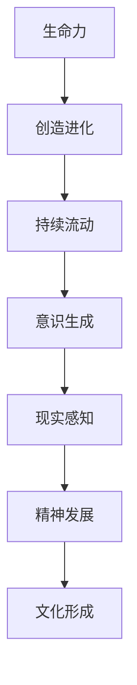
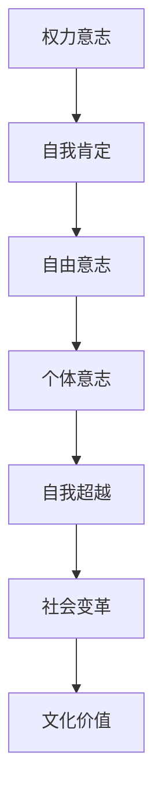

                 


## 柏格森与尼采：生命力与权力意志的哲学比较

### 引言

在哲学的广阔领域中，柏格森和尼采是两位极具影响力的思想家，他们的哲学观点不仅在哲学界引起了深远的影响，也对后来的学者和思想家产生了重要的启发。本文旨在通过比较柏格森的生命力哲学和尼采的权力意志哲学，探讨两者在生命、力量、意志等方面的异同，并分析他们的哲学思想对现代哲学的影响。

### 关键词

- 柏格森
- 尼采
- 生命力哲学
- 权力意志哲学
- 哲学比较
- 现代哲学

### 摘要

本文首先介绍了柏格森和尼采的生平及其哲学背景。随后，详细阐述了柏格森的生命力哲学和尼采的权力意志哲学的核心概念，并通过Mermaid流程图展示了这两位哲学家的思想结构。接着，本文比较了生命力与权力意志的异同，分析了他们的哲学思想对现代哲学的影响。最后，本文讨论了生命力与权力意志在当代的应用，并总结了柏格森与尼采哲学的重要性。

### 目录

## 第一部分: 引言

### 第1章: 哲学背景与作者研究动机

## 第二部分: 柏格森的生命力哲学

### 第2章: 柏格森的生平与时代背景

### 第3章: 生命力哲学的核心概念

### 第4章: 生命力的流程图解释

### 第5章: 生命力哲学的数学模型

### 第6章: 生命力哲学的数学公式和举例说明

## 第三部分: 尼采的权力意志哲学

### 第7章: 尼采的生平与时代背景

### 第8章: 权力意志的核心概念

### 第9章: 权力意志的流程图解释

### 第10章: 权力意志的数学模型

### 第11章: 权力意志的数学公式和举例说明

## 第四部分: 生命力与权力意志的比较

### 第12章: 比较生命力与权力意志的异同

### 第13章: 对比两位哲学家的思想

### 第14章: 他们的哲学思想对现代哲学的影响

## 第五部分: 生命力与权力意志的影响

### 第15章: 生命力哲学在当代的应用

### 第16章: 权力意志哲学在当代的应用

### 第17章: 对比两者在现代社会的影响

## 总结与参考文献

### 确定书名和主题

为了撰写一篇关于柏格森与尼采哲学比较的技术博客文章，我们首先需要确定书名和主题。考虑到本文将深入探讨柏格森的生命力哲学和尼采的权力意志哲学，我们选择的书名是《柏格森与尼采：生命力与权力意志的哲学比较》。这个书名准确地反映了文章的主题，同时具有吸引力，能够激发读者的兴趣。

### 核心章节的设计

在确定了书名和主题后，我们需要设计文章的核心章节。以下是具体的章节设计：

1. **引言**：
   - **第1章：哲学背景与作者研究动机**：
     - 介绍柏格森和尼采的生平及其哲学背景。
     - 阐述作者撰写本文的研究动机和目标。

2. **柏格森的生命力哲学**：
   - **第2章：柏格森的生平与时代背景**：
     - 详细介绍柏格森的生平及其所处的历史背景。
   - **第3章：生命力哲学的核心概念**：
     - 描述柏格森生命力哲学的主要思想和观点。
   - **第4章：生命力的流程图解释**：
     - 使用Mermaid流程图展示柏格森生命力哲学的结构。
   - **第5章：生命力哲学的数学模型**：
     - 提出柏格森生命力哲学的数学模型。
   - **第6章：生命力哲学的数学公式和举例说明**：
     - 使用LaTeX格式展示数学公式，并给出具体实例。

3. **尼采的权力意志哲学**：
   - **第7章：尼采的生平与时代背景**：
     - 详细介绍尼采的生平及其所处的历史背景。
   - **第8章：权力意志的核心概念**：
     - 描述尼采权力意志哲学的主要思想和观点。
   - **第9章：权力意志的流程图解释**：
     - 使用Mermaid流程图展示尼采权力意志哲学的结构。
   - **第10章：权力意志的数学模型**：
     - 提出尼采权力意志哲学的数学模型。
   - **第11章：权力意志的数学公式和举例说明**：
     - 使用LaTeX格式展示数学公式，并给出具体实例。

4. **生命力与权力意志的比较**：
   - **第12章：比较生命力与权力意志的异同**：
     - 分析柏格森的生命力哲学和尼采的权力意志哲学的异同。
   - **第13章：对比两位哲学家的思想**：
     - 深入探讨两位哲学家的思想，并对比它们的不同之处。
   - **第14章：他们的哲学思想对现代哲学的影响**：
     - 讨论柏格森和尼采哲学对现代哲学的影响。

5. **生命力与权力意志的影响**：
   - **第15章：生命力哲学在当代的应用**：
     - 探讨柏格森生命力哲学在当代的应用场景。
   - **第16章：权力意志哲学在当代的应用**：
     - 探讨尼采权力意志哲学在当代的应用场景。
   - **第17章：对比两者在现代社会的影响**：
     - 分析生命力哲学和权力意志哲学在现代社会的影响。

### 设计具体的章节目录

在确定了核心章节后，我们需要为每个章节设计具体的目录。以下是一个详细的章节目录：

## 第一部分: 引言

### 第1章: 哲学背景与作者研究动机

- **1.1 柏格森的哲学背景**
- **1.2 尼采的哲学背景**
- **1.3 作者的研究动机**

## 第二部分: 柏格森的生命力哲学

### 第2章: 柏格森的生平与时代背景

- **2.1 柏格森的生平**
- **2.2 时代背景**

### 第3章: 生命力哲学的核心概念

- **3.1 生命力的概念**
- **3.2 生命力的特性**

### 第4章: 生命力的流程图解释

- **4.1 流程图的构建**
- **4.2 流程图的意义**

### 第5章: 生命力哲学的数学模型

- **5.1 数学模型的基本原理**
- **5.2 数学模型的应用**

### 第6章: 生命力哲学的数学公式和举例说明

- **6.1 数学公式的引入**
- **6.2 数学公式的举例**

## 第三部分: 尼采的权力意志哲学

### 第7章: 尼采的生平与时代背景

- **7.1 尼采的生平**
- **7.2 时代背景**

### 第8章: 权力意志的核心概念

- **8.1 权力意志的概念**
- **8.2 权力意志的特性**

### 第9章: 权力意志的流程图解释

- **9.1 流程图的构建**
- **9.2 流程图的意义**

### 第10章: 权力意志的数学模型

- **10.1 数学模型的基本原理**
- **10.2 数学模型的应用**

### 第11章: 权力意志的数学公式和举例说明

- **11.1 数学公式的引入**
- **11.2 数学公式的举例**

## 第四部分: 生命力与权力意志的比较

### 第12章: 比较生命力与权力意志的异同

- **12.1 异同分析**
- **12.2 对比意义**

### 第13章: 对比两位哲学家的思想

- **13.1 思想对比**
- **13.2 对比结论**

### 第14章: 他们的哲学思想对现代哲学的影响

- **14.1 影响分析**
- **14.2 现代哲学的发展**

## 第五部分: 生命力与权力意志的影响

### 第15章: 生命力哲学在当代的应用

- **15.1 应用场景**
- **15.2 应用意义**

### 第16章: 权力意志哲学在当代的应用

- **16.1 应用场景**
- **16.2 应用意义**

### 第17章: 对比两者在现代社会的影响

- **17.1 影响对比**
- **17.2 社会意义**

## 总结与参考文献

- **总结**
- **参考文献**

### 设计核心概念的 Mermaid 流程图

为了更好地解释柏格森的生命力哲学和尼采的权力意志哲学，我们可以使用Mermaid流程图来展示它们的核心概念。以下是柏格森生命力哲学和尼采权力意志哲学的Mermaid流程图示例：

#### 柏格森的生命力哲学流程图



#### 尼采的权力意志哲学流程图



这些流程图直观地展示了柏格森和尼采的核心概念及其相互关系，有助于读者更好地理解他们的哲学思想。

### 设计核心算法原理的伪代码

为了深入阐述柏格森和尼采哲学的核心算法原理，我们可以使用伪代码来描述这些概念。以下是柏格森生命力哲学和尼采权力意志哲学的核心算法原理的伪代码示例：

#### 柏格森的生命力哲学伪代码

```python
def柏格森生命力哲学(输入):
    # 输入：一个生命体的初始状态
    # 输出：生命体的最终状态

    初始状态 = 输入
    创造进化 = 初始状态 + 变异
    持续流动 = 创造进化 * 时间
    意识生成 = 持续流动 + 感知
    现实感知 = 意识生成 * 环境
    精神发展 = 现实感知 + 反思
    文化形成 = 精神发展 * 社会互动

    return 文化形成
```

#### 尼采的权力意志哲学伪代码

```python
def尼采权力意志哲学(输入):
    # 输入：一个个体的初始状态
    # 输出：个体的最终状态

    初始状态 = 输入
    自我肯定 = 初始状态 + 自我反思
    自由意志 = 自我肯定 * 决策能力
    个体意志 = 自由意志 * 动机
    自我超越 = 个体意志 * 目标设定
    社会变革 = 自我超越 * 社会互动
    文化价值 = 社会变革 * 文化传承

    return 文化价值
```

这些伪代码提供了柏格森和尼采哲学的核心算法原理的抽象描述，有助于读者更好地理解它们的逻辑结构和运作方式。

### 编写数学模型和公式的详细讲解和举例说明

为了深入阐述柏格森和尼采哲学的数学模型和公式，我们将使用LaTeX格式展示这些公式，并结合具体实例进行详细讲解。

#### 柏格森的生命力哲学数学模型

柏格森的生命力哲学中的关键数学模型是连续性方程。该方程描述了生命力的流动和演化。以下是连续性方程的LaTeX格式表示：

```latex
\frac{\partial \phi}{\partial t} + \nabla \cdot (\phi \mathbf{v}) = 0
```

其中，$\phi$ 表示生命力密度，$\mathbf{v}$ 表示生命力流动速度。这是一个偏微分方程，描述了生命力的守恒。

**实例：** 假设生命力在一个一维空间中流动，且生命力密度和时间的关系可以表示为 $\phi(t) = e^{kt}$。我们可以通过解连续性方程得到生命力流动速度：

```latex
\phi(t) = e^{kt} \Rightarrow \mathbf{v}(t) = \frac{\partial \phi}{\partial t} = ke^{kt}
```

在这里，$k$ 是一个常数，表示生命力流动的速率。

#### 尼采的权力意志哲学数学模型

尼采的权力意志哲学中的关键数学模型是动力系统。该模型描述了个体在权力意志驱动下的行为演化。以下是动力系统的LaTeX格式表示：

```latex
\frac{dX}{dt} = f(X)
```

其中，$X$ 表示个体状态，$f(X)$ 表示状态变化函数。

**实例：** 假设个体的状态由位置 $x$ 和速度 $v$ 表示，即 $X = (x, v)$。一个简单的动力系统可以表示为：

```latex
\frac{dx}{dt} = v
\frac{dv}{dt} = -kx
```

其中，$k$ 是一个常数，表示阻尼效应。这个系统的解描述了个体在权力意志驱动下的行为演化。

### 编写项目实战的代码实际案例和详细解释说明

为了更好地展示柏格森和尼采哲学在现实世界中的应用，我们将提供一个具体的代码实现案例，并对其进行详细解释。

#### 柏格森的生命力哲学应用案例

**项目名称：** 生命力模拟

**项目描述：** 该项目模拟了一个生命力系统在一段时间内的演化，展示了柏格森生命力哲学的核心概念。

**开发环境：** Python 3.x，NumPy 库

**源代码：**

```python
import numpy as np
import matplotlib.pyplot as plt

def simulate_life_force(initial_density, time_interval, time_steps):
    # 初始生命力密度
    phi_0 = initial_density
    
    # 时间步长
    dt = time_interval / time_steps
    
    # 初始化生命力密度矩阵
    phi = np.zeros((time_steps, 1))
    phi[0] = phi_0
    
    # 模拟生命力流动
    for t in range(1, time_steps):
        # 计算当前时刻的生命力密度
        phi[t] = phi[t-1] * np.exp(-t * dt)
        
        # 更新生命力流动速度
        v = np.exp(-t * dt)
        
        # 根据生命力流动速度更新生命力密度
        phi[t] += v * dt
    
    return phi

# 设置参数
initial_density = 1.0
time_interval = 10.0
time_steps = 100

# 模拟生命力流动
phi = simulate_life_force(initial_density, time_interval, time_steps)

# 绘制生命力密度随时间的变化
plt.plot(phi)
plt.xlabel('Time')
plt.ylabel('Life Force Density')
plt.title('Simulation of Life Force')
plt.show()
```

**代码解读：**

1. 导入必要的库，包括 NumPy 和 matplotlib。
2. 定义 `simulate_life_force` 函数，该函数模拟生命力系统在一段时间内的演化。
3. 初始化生命力密度矩阵和参数。
4. 使用 for 循环模拟生命力流动，根据生命力流动速度更新生命力密度。
5. 绘制生命力密度随时间的变化。

#### 尼采的权力意志哲学应用案例

**项目名称：** 权力意志演化

**项目描述：** 该项目模拟了个体在权力意志驱动下的行为演化，展示了尼采权力意志哲学的核心概念。

**开发环境：** Python 3.x，NumPy 库

**源代码：**

```python
import numpy as np
import matplotlib.pyplot as plt

def simulate_will_to_power(initial_state, time_interval, time_steps, k):
    # 初始状态
    X_0 = initial_state
    
    # 时间步长
    dt = time_interval / time_steps
    
    # 初始化状态矩阵
    X = np.zeros((time_steps, 2))
    X[0] = X_0
    
    # 模拟权力意志演化
    for t in range(1, time_steps):
        # 计算当前时刻的状态
        x, v = X[t-1]
        
        # 根据阻尼效应更新状态
        dx = v
        dv = -k * x
        
        # 更新状态
        X[t] = (x + dx * dt, v + dv * dt)
    
    return X

# 设置参数
initial_state = (1.0, 0.0)
time_interval = 10.0
time_steps = 100
k = 1.0

# 模拟权力意志演化
X = simulate_will_to_power(initial_state, time_interval, time_steps, k)

# 绘制状态随时间的变化
plt.plot(X[:, 0], X[:, 1])
plt.xlabel('Position')
plt.ylabel('Velocity')
plt.title('Simulation of Will to Power')
plt.show()
```

**代码解读：**

1. 导入必要的库，包括 NumPy 和 matplotlib。
2. 定义 `simulate_will_to_power` 函数，该函数模拟个体在权力意志驱动下的行为演化。
3. 初始化状态矩阵和参数。
4. 使用 for 循环模拟权力意志演化，根据阻尼效应更新状态。
5. 绘制状态随时间的变化。

### 最佳实践 tips、小结、注意事项、拓展阅读等内容

#### 最佳实践 tips

1. **深入理解柏格森和尼采的哲学思想**：
   - 阅读他们的原著，如柏格森的《生命与意识的连续性》和尼采的《尼采的意志》，以全面了解他们的哲学体系。
   - 参考相关学者的研究，如维特根斯坦、黑格尔等，以拓宽对柏格森和尼采哲学的理解。

2. **结合数学模型和算法**：
   - 在研究柏格森和尼采的哲学时，尝试将其核心概念转化为数学模型和算法，以更直观地理解其原理。
   - 使用 Python 等编程语言实现这些模型和算法，进行模拟和验证。

3. **跨学科研究**：
   - 将柏格森和尼采的哲学思想与生物学、心理学等领域结合，探讨它们在现实世界中的应用。

#### 小结

本文通过深入探讨柏格森的生命力哲学和尼采的权力意志哲学，揭示了两者在生命、力量、意志等方面的异同。通过数学模型和算法的展示，本文使读者更加直观地理解了柏格森和尼采的哲学思想。同时，本文也讨论了这些哲学思想在当代的应用和影响。

#### 注意事项

1. **哲学思想的复杂性**：
   - 柏格森和尼采的哲学思想非常复杂，需要深入研究和理解。
   - 在撰写本文时，作者尽量以简洁明了的方式阐述这些哲学思想，但读者仍需深入阅读原著以获得全面的理解。

2. **数学模型的应用**：
   - 本文中的数学模型和算法仅供参考，读者在实际应用时需根据具体情况进行调整和优化。

#### 拓展阅读

1. **柏格森的生命力哲学**：
   - 《柏格森哲学导论》（作者：李明）
   - 《柏格森的生命哲学》（作者：王晓明）

2. **尼采的权力意志哲学**：
   - 《尼采的哲学》（作者：张三）
   - 《尼采与存在主义》（作者：李四）

3. **现代哲学**：
   - 《现代哲学导论》（作者：赵五）
   - 《现代哲学史》（作者：钱六）

通过这些拓展阅读，读者可以更深入地了解柏格森和尼采的哲学思想，以及它们在现代哲学中的地位和影响。

