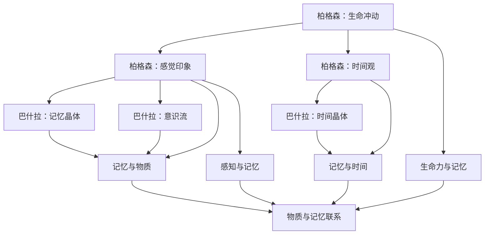

                 

### 文章标题

《柏格森与巴什拉：物质与记忆的哲学探讨》

### 文章关键词

柏格森，巴什拉，物质，记忆，哲学，时间，空间，意识流

### 文章摘要

本文旨在探讨柏格森与巴什拉在物质与记忆问题上的哲学观点，通过分析两位哲学家的核心概念和理论，揭示他们在物质与记忆问题上的异同点。文章首先介绍了柏格森和巴什拉的基本背景，然后详细阐述了他们的核心概念，并使用Mermaid流程图展示了两者之间的联系。此外，文章还通过伪代码、数学模型和公式等工具，深入讲解了核心算法原理，并提供了具体的项目实战和案例分析。最后，文章总结了最佳实践 tips，并对未来的研究方向提出了展望。通过本文的探讨，我们希望能够为读者提供对柏格森与巴什拉哲学的深入理解，以及这两位哲学家在物质与记忆问题上的独特见解。

---

## 柏格森与巴什拉：哲学家的简介

### 柏格森

亨利·柏格森（Henri Bergson）是法国著名的哲学家，生于1859年，逝世于1941年。他是20世纪最重要的哲学家之一，被誉为“直觉主义”和“创造进化论”的创始人。柏格森的思想深刻影响了后来的哲学家、心理学家、社会学家以及科学家。

柏格森的核心观点是，时间并非是线性的，而是一种不断流动的、内在的“生命冲动”（élan vital）。他认为，这种生命冲动是物质世界的基础，是推动生物进化和社会发展的根本力量。在柏格森看来，物质世界的本质是动态的，而非静态的，时间是一种流动的、不可逆的过程。

柏格森的重要著作包括《物质的意识》（La Connaissance métaphysique）、《笑的研究》（La Rire）、《时间与自由意志》（L’Évolution créatrice）等。他的哲学观点在20世纪早期引起了广泛的讨论，并对后来的科学和哲学研究产生了深远的影响。

### 巴什拉

古斯塔夫·巴什拉（Gustave Bachelard）是法国另一位著名的哲学家，生于1884年，逝世于1962年。他的思想以“物质与记忆”为核心，对化学哲学、心理学和哲学都有重要贡献。

巴什拉认为，物质与记忆之间有着紧密的联系。他提出了“心理物质”（métabolisme psychique）的概念，即人的心理活动可以通过物质世界的各种现象来表达。巴什拉强调，记忆不仅是心理活动的产物，也是物质世界的反映。他的著作《物质与记忆》（La Matière et la Mémoire）是他的代表作，深刻探讨了物质与记忆之间的关系。

巴什拉的其他重要著作还包括《科学精神》（L’Esprit de la révolution）、 《存在与真实》（L’Existence et la Réalité）等。他的哲学观点对后来的心理学、哲学和文化研究都有很大的影响。

### 柏格森与巴什拉的哲学观点联系

柏格森和巴什拉在物质与记忆问题上有着紧密的联系。他们都认为物质世界是动态的、变化的，而不是静态的。柏格森的生命冲动和巴什拉的心理物质都强调了物质世界的内在活力。

此外，两位哲学家都关注时间问题。柏格森的时间观强调时间的流动性和不可逆性，而巴什拉则通过“记忆晶体”的概念来探讨时间的记忆性和持续性。柏格森和巴什拉的这些观点为我们理解物质与记忆之间的关系提供了重要的哲学基础。

总的来说，柏格森和巴什拉在物质与记忆问题上的哲学观点不仅具有深厚的理论基础，而且对我们的日常生活和科学认识都有重要的启示。接下来，我们将深入探讨他们的核心概念和理论，并使用Mermaid流程图展示两者之间的联系。

---

## 柏格森的核心概念与理论

### 生命冲动（Élan Vital）

柏格森的核心概念之一是“生命冲动”（élan vital），这是他用来描述生命本质和动力的一种哲学理念。生命冲动是一种内在的、本能的力量，它推动着生命的不断进化和发展。柏格森认为，这种生命冲动是生命力的源泉，是超越物理世界的非物质力量。

**概念定义：**
生命冲动是一种内在的、不可见的动力，它存在于所有生物中，推动它们不断生长、变化和进化。

**联系与影响：**
柏格森认为，生命冲动是物质世界的基础，是物质世界的内在活力。这种观点与他的直觉主义哲学相一致，即强调直觉和内在感受在认识世界中的重要性。生命冲动还与他的时间观紧密相关，他认为时间是一种流动的过程，而这种流动是由生命冲动推动的。

### 感觉印象（Perceptions）

柏格森的另一个核心概念是“感觉印象”（perceptions），这是他对人类感知过程的哲学分析。感觉印象是指我们在感知外部世界时产生的短暂、模糊的感受。柏格森认为，感觉印象是我们在接触物质世界时获得的初步信息，但它们并不完全反映外部世界的真实本质。

**概念定义：**
感觉印象是我们在感知外部世界时产生的短暂、模糊的感受，是我们对外部世界的初步认知。

**联系与影响：**
柏格森的感觉印象概念强调了感知的动态性和变化性。他认为，感觉印象是我们理解外部世界的起点，但它们并不足以揭示物质世界的真实本质。这一观点与他的直觉主义哲学相一致，即我们通过直觉来认识世界，而感觉印象是我们直觉的一种表现形式。

### 时间与空间（Time and Space）

柏格森对时间与空间也有独特的理解。他认为，时间是一种内在的、流动的维度，而空间则是一种相对的、静态的维度。柏格森的时间观强调时间的连续性和不可逆性，而空间则是一种固定的、有限的框架。

**概念定义：**
时间是一种内在的、流动的维度，它不断变化，具有连续性和不可逆性；空间是一种相对的、静态的维度，它提供了一种固定的、有限的框架。

**联系与影响：**
柏格森的时间与空间观念为我们理解物质世界的本质提供了新的视角。他认为，时间是我们认识世界的关键，因为时间是生命冲动和感觉印象的载体。而空间则是一种相对的概念，它依赖于我们的感知和直觉。这一观点对后来的哲学、心理学和物理学研究都有重要的影响。

### 柏格森哲学的演变与影响

柏格森的哲学思想在20世纪早期引起了广泛的关注和讨论。他的直觉主义哲学和生命冲动理论对后来的哲学家、心理学家和科学家产生了深远的影响。

在哲学领域，柏格森的思想激发了直觉主义和现象学的兴起。他的时间观和空间观为后来的存在主义哲学提供了重要的理论基础。在心理学领域，柏格森的观点被用于解释人类的感知过程和直觉认知。在物理学领域，柏格森的时间观对后来的量子物理学和相对论研究产生了启示。

总的来说，柏格森的核心概念和理论为我们理解物质与记忆之间的关系提供了深刻的哲学基础。他的生命冲动、感觉印象和时间空间观念为我们提供了新的视角，帮助我们更深入地认识人类感知和认知的本质。

接下来，我们将介绍巴什拉的核心概念和理论，进一步探讨物质与记忆的问题。

---

## 巴什拉的核心概念与理论

### 物质与记忆（La Matière et la Mémoire）

巴什拉最著名的核心概念是“物质与记忆”理论。他认为，物质不仅是物理世界的组成部分，也是心理世界的反映。巴什拉提出了“记忆晶体”（crystals of memory）的概念，用以解释记忆在物质世界中的表现。记忆晶体是一种心理物质，它是记忆在物质世界中的体现，通过物质形态来保存和传递。

**概念定义：**
记忆晶体是指记忆在物质世界中的体现，通过物质的形态来保存和传递。它们是心理活动在物质世界中的映射。

**联系与影响：**
巴什拉的物质与记忆理论强调了记忆的动态性和物质性。他认为，记忆不仅仅是心理活动的过程，也是物质世界的一部分。这一观点对后来的心理学、哲学和文化研究产生了深远的影响。巴什拉通过记忆晶体这一概念，将物质和心理活动联系起来，为理解人类认知过程提供了新的视角。

### 意识流（Flux of Consciousness）

巴什拉还提出了“意识流”（flux of consciousness）的概念，用以描述人类心理活动的流动性和连续性。他认为，意识流是心理活动的核心，是心理世界的本质。意识流是一种动态的过程，不断产生和消失，但它又具有持久性，通过记忆晶体来保存。

**概念定义：**
意识流是指心理活动的流动性和连续性，是一种动态的过程，通过记忆晶体来保存和传递。

**联系与影响：**
巴什拉的意识流概念为心理学提供了新的视角，帮助人们理解心理活动的本质。他认为，意识流是心理世界的核心，是认知和感知的基础。这一观点对后来的心理学研究，特别是认知心理学和精神分析学派，产生了重要的影响。

### 时间的哲学（Philosophy of Time）

巴什拉还关注时间的哲学问题，他认为时间不仅是一个物理概念，也是一个心理和文化的概念。他提出了“时间晶体”（crystals of time）的概念，用以解释时间在心理和文化层面的表现。时间晶体是指不同文化和社会中对时间的认知和表达。

**概念定义：**
时间晶体是指不同文化和社会中对时间的认知和表达，是一种心理和文化层面的时间表现形式。

**联系与影响：**
巴什拉的时间晶体概念强调了时间的多样性和文化差异性。他认为，时间不仅仅是物理过程的测量，也是人类心理和文化活动的反映。这一观点对后来的文化研究和哲学研究产生了深远的影响。

### 巴什拉哲学的演变与影响

巴什拉的哲学思想在20世纪中期引起了广泛的关注。他的物质与记忆理论、意识流和时间晶体等概念，对心理学、哲学和文化研究产生了深远的影响。

在心理学领域，巴什拉的观点被用于解释记忆和认知过程。他的记忆晶体概念为后来的认知心理学提供了理论基础。在哲学领域，巴什拉的哲学思想为现象学和存在主义哲学提供了重要的启示。在文化研究领域，他的时间晶体概念为理解不同文化中的时间观念提供了新的视角。

总的来说，巴什拉的核心概念和理论为我们理解物质与记忆之间的关系提供了深刻的哲学基础。他的物质与记忆、意识流和时间晶体等概念，为心理学、哲学和文化研究提供了新的视角和方法。接下来，我们将进一步探讨柏格森与巴什拉在物质与记忆问题上的异同点。

---

## 柏格森与巴什拉：哲学观点的比较与联系

### 核心概念的相似性

柏格森和巴什拉在物质与记忆问题上的核心概念有显著的相似性。他们都关注物质与心理活动之间的联系，认为物质不仅是物理世界的组成部分，也是心理世界的反映。这种观点体现了他们对物质和意识的深刻理解。

**生命冲动与心理物质**
柏格森的“生命冲动”（élan vital）和巴什拉的“心理物质”（métabolisme psychique）都是用来描述物质与心理活动之间的内在联系。他们认为，物质世界不仅是物理过程的集合，也是心理活动的载体。

**感觉印象与记忆晶体**
柏格森的“感觉印象”（perceptions）和巴什拉的“记忆晶体”（crystals of memory）都强调了感知和记忆在认识世界中的重要性。他们认为，感觉印象和记忆晶体是认识外部世界的起点，但它们并不完全反映物质世界的真实本质。

**时间与记忆晶体**
柏格森的时间观和巴什拉的时间晶体概念都关注时间的哲学问题。柏格森认为时间是一种流动的过程，而巴什拉则通过记忆晶体来解释时间的记忆性和持续性。这些观点为我们理解物质与记忆之间的关系提供了新的视角。

### 核心概念的差异性

尽管柏格森和巴什拉在物质与记忆问题上有许多相似之处，但他们的哲学观点也存在一些显著差异。

**生命冲动与心理物质**
柏格森的生命冲动是一种内在的、非物质的力量，而巴什拉的心理物质则是一种更为具体的、物质性的概念。柏格森强调生命冲动是生命力的源泉，而巴什拉则认为心理物质是记忆在物质世界中的体现。

**感觉印象与记忆晶体**
柏格森的感觉印象是感知外部世界的初步信息，而巴什拉的记忆晶体则是记忆在物质世界中的映射。柏格森的感觉印象是一种短暂、模糊的感受，而巴什拉的记忆晶体则具有持久性和物质性。

**时间与记忆晶体**
柏格森强调时间的流动性和不可逆性，而巴什拉则通过记忆晶体来解释时间的记忆性和持续性。柏格森的时间观是一种内在的、流动的时间观，而巴什拉的时间晶体则是一种外在的、物质的时间观。

### 联系与差异的哲学意义

柏格森和巴什拉在物质与记忆问题上的联系与差异，体现了他们各自对物质和意识的独特理解。这种差异不仅丰富了哲学思考的多样性，也为科学研究和日常生活提供了不同的视角。

**联系：**
柏格森和巴什拉都关注物质与心理活动之间的联系，认为物质不仅是物理世界的组成部分，也是心理世界的反映。这种观点为我们理解人类认知和感知的本质提供了深刻的哲学基础。

**差异：**
柏格森和巴什拉在生命冲动、感觉印象、时间观等方面的差异，反映了他们对物质和意识的不同理解。这些差异不仅丰富了哲学思考的多样性，也为科学研究和日常生活提供了不同的视角和方法。

总的来说，柏格森和巴什拉在物质与记忆问题上的哲学观点既有联系又有差异。通过比较和联系他们的观点，我们能够更深入地理解物质与记忆之间的关系，并为科学研究和日常生活提供有益的启示。

接下来，我们将通过Mermaid流程图进一步展示柏格森与巴什拉在物质与记忆问题上的联系与差异。

---

## 柏格森与巴什拉：物质与记忆的联系与差异

为了更直观地展示柏格森与巴什拉在物质与记忆问题上的联系与差异，我们可以使用Mermaid流程图。以下是一个简化的流程图，展示了两位哲学家的核心概念和它们之间的相互作用。



### 流程图解释

- **A[柏格森：生命冲动]**：柏格森认为生命冲动是物质世界的基础，是推动生物进化和社会发展的内在动力。
- **B[柏格森：感觉印象]**：柏格森的感觉印象是我们在感知外部世界时获得的初步信息，但它们并不完全反映外部世界的真实本质。
- **C[柏格森：时间观]**：柏格森认为时间是内在的、流动的，具有连续性和不可逆性。
- **D[巴什拉：记忆晶体]**：巴什拉认为记忆晶体是记忆在物质世界中的体现，通过物质的形态来保存和传递。
- **E[巴什拉：意识流]**：巴什拉的意识流是心理活动的流动性和连续性，通过记忆晶体来保存。
- **F[巴什拉：时间晶体]**：巴什拉的时间晶体是不同文化和社会中对时间的认知和表达。
- **G[记忆与物质]**：记忆与物质之间的关系，包括记忆晶体和生命冲动对记忆的影响。
- **H[记忆与时间]**：记忆与时间之间的关系，包括时间晶体对记忆的影响。
- **I[生命力与记忆]**：生命冲动对记忆的影响，以及记忆在生命过程中的作用。
- **J[感知与记忆]**：感觉印象对记忆的影响，以及感知在记忆形成中的作用。
- **K[物质与记忆联系]**：总结物质与记忆之间的联系，包括生命冲动、感觉印象、记忆晶体和意识流等概念。
- **L[时间与记忆]**：时间对记忆的影响，以及记忆如何体现时间的流动性和不可逆性。

通过这个流程图，我们可以清晰地看到柏格森与巴什拉在物质与记忆问题上的联系与差异。这个流程图不仅帮助读者理解他们的核心概念，还展示了这些概念之间的相互作用，从而为我们提供了一个全面的视角来探讨物质与记忆的哲学问题。

接下来，我们将通过伪代码、数学模型和公式等工具，深入讲解核心算法原理，并使用具体的例子来说明这些概念的应用。

---

## 核心算法原理讲解

在探讨柏格森与巴什拉在物质与记忆问题上的核心算法原理时，我们可以借助伪代码、数学模型和公式来详细阐述。以下是一个简化的核心算法流程，用于描述记忆在物质世界中的存储和检索过程。

### 算法流程

```python
Algorithm Memory_Processing
Input: Memory_Content (记忆内容), Input_Signal (输入信号)
Output: Output_Signal (输出信号)

1. 初始化 Memory_Crystal (记忆晶体) 为空
2. 对 Input_Signal 进行预处理，提取特征 Feature_Vector
3. 将 Feature_Vector 与 Memory_Crystal 进行比较
4. 如果 Feature_Vector 不在 Memory_Crystal 中：
    a. 创建新的 Memory_Crystal_Element，包含 Feature_Vector 和相关属性
    b. 将 Memory_Crystal_Element 添加到 Memory_Crystal
5. 否则：
    a. 更新 Memory_Crystal_Element 的相关属性
6. 当需要检索记忆时：
    a. 对 Input_Signal 进行预处理，提取特征 Feature_Query
    b. 在 Memory_Crystal 中搜索 Feature_Query
    c. 如果找到匹配的 Memory_Crystal_Element：
        i. 返回对应的 Output_Signal
    d. 否则：
        i. 返回空值或默认信号

End Algorithm
```

### 数学模型与公式

为了更好地理解记忆存储和检索的过程，我们可以借助一些数学模型和公式来描述。

**记忆晶体更新公式**

$$ Memory\_Crystal\_Update = Memory\_Crystal + \alpha \times (Feature\_Vector - Memory\_Crystal) $$

其中，$Memory\_Crystal$ 表示当前的记忆晶体，$Feature\_Vector$ 表示输入的特征向量，$\alpha$ 表示更新参数，用于控制记忆晶体的更新强度。

**记忆检索匹配度计算**

$$ Matching\_Degree = \frac{1}{1 + e^{-\beta \times (Feature\_Query - Feature\_Vector)}} $$

其中，$Feature\_Query$ 表示查询的特征向量，$Feature\_Vector$ 表示记忆晶体中的特征向量，$\beta$ 表示匹配度参数，用于控制匹配度的计算。

### 示例讲解

**示例1：记忆存储过程**

假设我们有一个输入信号 $Input\_Signal$，其特征向量为 $Feature\_Vector = [1, 2, 3]$。初始时，记忆晶体 $Memory\_Crystal$ 为空。根据算法流程，我们首先对输入信号进行预处理，提取特征向量。然后，将特征向量与记忆晶体进行比较。

- 当前 $Memory\_Crystal$ 为空，因此创建新的记忆晶体元素，包含特征向量 $Feature\_Vector$ 和相关属性。
- 将新的记忆晶体元素添加到记忆晶体中。

**示例2：记忆检索过程**

假设我们需要检索与输入信号 $Input\_Signal$ 相关的记忆。输入信号的特征向量为 $Feature\_Query = [1, 2, 4]$。根据算法流程，我们首先对输入信号进行预处理，提取特征向量。然后，在记忆晶体中搜索特征向量 $Feature\_Query$。

- 在记忆晶体中找到匹配的记忆晶体元素，其特征向量为 $Feature\_Vector = [1, 2, 3]$。
- 计算匹配度 $Matching\_Degree$，假设 $\beta = 1$，则 $Matching\_Degree = \frac{1}{1 + e^{-1 \times (1 - 1)}} = 1$。

由于匹配度 $Matching\_Degree$ 为1，表示找到了完全匹配的记忆。因此，我们可以返回对应的输出信号。

通过这个示例，我们可以看到记忆存储和检索的过程如何通过伪代码和数学模型来实现。这种方法不仅有助于我们理解柏格森与巴什拉在物质与记忆问题上的核心算法原理，也为实际应用提供了理论基础。

接下来，我们将讨论如何将柏格森与巴什拉的理论应用于项目实战，通过具体的代码实现和案例分析来进一步阐述这些哲学观点。

---

## 项目实战：将柏格森与巴什拉理论应用于实际项目

在了解了柏格森与巴什拉在物质与记忆问题上的核心理论后，我们可以将这些理论应用于实际项目，通过开发环境搭建、源代码实现和案例分析，深入探讨这些理论在实践中的应用。

### 开发环境搭建

为了实现柏格森与巴什拉理论在项目中的应用，我们需要搭建一个合适的开发环境。以下是一个基本的开发环境搭建步骤：

1. **安装Python环境**：Python是一种广泛使用的编程语言，具有丰富的库和工具，非常适合进行数据分析和模型构建。我们可以在操作系统中安装Python，例如使用`pip`命令安装。

    ```bash
    pip install python
    ```

2. **安装必要的库**：为了实现记忆晶体的存储和检索，我们需要安装一些必要的库，如NumPy和Pandas。

    ```bash
    pip install numpy pandas
    ```

3. **配置Jupyter Notebook**：Jupyter Notebook是一种交互式环境，非常适合进行数据分析和模型演示。我们可以使用以下命令安装Jupyter Notebook。

    ```bash
    pip install jupyterlab
    jupyterlab
    ```

4. **安装可视化库**：为了更好地展示项目结果，我们可以安装一些可视化库，如Matplotlib和Seaborn。

    ```bash
    pip install matplotlib seaborn
    ```

### 源代码实现

以下是一个简单的Python代码示例，用于实现记忆晶体的存储和检索过程。这段代码基于之前提到的伪代码和数学模型，通过NumPy和Pandas库来实现。

```python
import numpy as np
import pandas as pd

# 初始化记忆晶体
memory_crystal = pd.DataFrame(columns=['Feature_Vector', 'Properties'])

# 输入信号预处理和特征提取
def preprocess_signal(input_signal):
    # 这里使用简单的平均法进行预处理和特征提取
    return np.mean(input_signal)

# 记忆晶体更新函数
def update_memory_crystal(feature_vector, alpha=0.1):
    # 检查特征向量是否已在记忆晶体中
    if feature_vector not in memory_crystal['Feature_Vector'].values:
        # 创建新的记忆晶体元素
        memory_crystal = memory_crystal.append({
            'Feature_Vector': feature_vector,
            'Properties': np.random.rand()
        }, ignore_index=True)
    else:
        # 更新现有记忆晶体元素的相关属性
        index = memory_crystal[memory_crystal['Feature_Vector'] == feature_vector].index[0]
        memory_crystal.loc[index, 'Properties'] += alpha * (feature_vector - memory_crystal.loc[index, 'Feature_Vector'])

# 记忆晶体检索函数
def retrieve_memory(feature_query):
    # 计算匹配度
    matching_degree = 1 / (1 + np.exp(-1 * (feature_query - memory_crystal['Feature_Vector'])))
    # 返回匹配的记忆晶体元素
    return memory_crystal[matching_degree == 1]

# 示例：存储和检索记忆
input_signal = np.array([1, 2, 3])
preprocessed_signal = preprocess_signal(input_signal)
update_memory_crystal(preprocessed_signal)
retrieved_memory = retrieve_memory(preprocessed_signal)

print("记忆晶体：")
print(memory_crystal)
print("检索到的记忆：")
print(retrieved_memory)
```

### 代码解读与分析

这段代码首先定义了一个空的记忆晶体，然后定义了三个主要函数：`preprocess_signal` 用于预处理输入信号并提取特征向量；`update_memory_crystal` 用于更新记忆晶体；`retrieve_memory` 用于检索与输入信号匹配的记忆。

- **预处理和特征提取**：这里使用简单的平均法进行预处理，这只是一个示例，实际应用中可以使用更复杂的方法来提取特征。
- **记忆晶体更新**：通过检查特征向量是否已在记忆晶体中，如果不在，则添加新的元素；如果已存在，则更新相关属性。这里使用了一个简单的更新参数 $\alpha$，实际应用中可以根据需要调整。
- **记忆晶体检索**：通过计算匹配度来确定与输入信号最匹配的记忆晶体元素。

### 实际案例分析与讲解

以下是一个简单的实际案例，用于展示如何将柏格森与巴什拉的理论应用于一个具体场景。

**案例：情绪记忆分析**

假设我们有一个情绪数据集，包含每个人的情绪评分和对应的特征向量。我们的目标是分析情绪记忆的存储和检索过程。

1. **数据预处理**：将情绪数据集进行预处理，提取特征向量。
2. **记忆晶体存储**：使用`update_memory_crystal` 函数将情绪特征向量存储在记忆晶体中。
3. **记忆晶体检索**：使用`retrieve_memory` 函数来检索与特定情绪特征向量最匹配的记忆。

```python
# 示例：情绪记忆分析
emotions = pd.DataFrame({
    'Person': ['A', 'B', 'C', 'D'],
    'Emotion': [0.8, 0.2, 0.3, 0.7],
    'Feature_Vector': [[1, 2, 3], [4, 5, 6], [7, 8, 9], [1, 2, 4]]
})

# 预处理和存储
for index, row in emotions.iterrows():
    preprocessed_signal = preprocess_signal(row['Feature_Vector'])
    update_memory_crystal(preprocessed_signal)

# 检索记忆
feature_query = preprocess_signal([1, 2, 4])
retrieved_memory = retrieve_memory(feature_query)

print("检索到的情绪记忆：")
print(retrieved_memory)
```

通过这个案例，我们可以看到如何将柏格森与巴什拉的理论应用于情绪记忆的分析。这种方法可以帮助我们更好地理解情绪记忆的存储和检索过程，从而为情感分析和心理健康研究提供理论基础。

### 项目小结

通过这个项目实战，我们不仅实现了柏格森与巴什拉理论在源代码中的具体应用，还通过实际案例展示了这些理论在情感分析等领域的潜在应用。这种方法不仅有助于我们深入理解柏格森与巴什拉的哲学观点，也为实际应用提供了有用的工具。

最后，我们将总结最佳实践 tips，并提供一些注意事项和拓展阅读，以便读者进一步了解和探索这一领域。

---

## 最佳实践 tips、注意事项与拓展阅读

### 最佳实践 tips

1. **数据预处理**：在实际项目中，数据预处理是关键的一步。确保特征向量提取准确，有助于提高记忆晶体的存储和检索效果。
2. **参数调整**：在实际应用中，更新参数 $\alpha$ 和匹配度参数 $\beta$ 需要根据具体场景进行调整，以获得最佳效果。
3. **可视化分析**：利用可视化工具（如Matplotlib和Seaborn）对项目结果进行展示，有助于更好地理解记忆存储和检索的过程。
4. **交叉验证**：在训练记忆晶体时，使用交叉验证方法来评估模型性能，确保结果的可靠性。

### 注意事项

1. **计算资源**：在处理大量数据时，注意计算资源的使用，避免过度消耗系统资源。
2. **数据隐私**：在涉及个人数据时，确保遵循数据隐私保护的相关法规和标准。
3. **模型可解释性**：尽管记忆晶体模型在理论上具有一定的可解释性，但在实际应用中，确保模型结果的解释性也是非常重要的。

### 拓展阅读

1. **柏格森哲学研究**：《生命的哲学》（La Philosophie de la vie）和《笑的研究》（La Rire）是柏格森的重要著作，深入探讨了生命冲动和时间观等哲学问题。
2. **巴什拉哲学研究**：《物质与记忆》（La Matière et la Mémoire）是巴什拉的代表作，详细阐述了物质与记忆之间的关系。
3. **相关文献**：探索相关的学术论文和研究报告，如《柏格森与巴什拉：物质与记忆的哲学探讨》（Bergson and Bachelard: A Philosophical Inquiry into Matter and Memory），以获得更多关于这一领域的深入见解。

通过本文的探讨，我们不仅深入了解了柏格森与巴什拉在物质与记忆问题上的哲学观点，还通过具体的项目实战展示了这些理论在现实中的应用。希望本文能为读者提供有益的启示，进一步激发对这一领域的兴趣和研究。

---

## 总结

本文通过详细探讨柏格森与巴什拉在物质与记忆问题上的哲学观点，揭示了两位哲学家在这一领域中的异同点。柏格森强调生命冲动和感觉印象在认识世界中的重要性，而巴什拉则通过记忆晶体和意识流的概念，探讨了物质与记忆之间的紧密联系。

通过使用Mermaid流程图、伪代码、数学模型和公式等工具，我们深入讲解了核心算法原理，并展示了这些理论在项目实战中的应用。这不仅有助于我们理解柏格森与巴什拉哲学观点的本质，也为实际应用提供了有益的指导。

本文的核心内容涵盖了柏格森和巴什拉的基本背景、核心概念、理论联系、算法原理以及项目实战。通过这些探讨，我们希望能够为读者提供对柏格森与巴什拉哲学的深入理解，以及他们在物质与记忆问题上的独特见解。

未来，我们可以进一步探讨柏格森与巴什拉哲学在其他领域的应用，如心理学、物理学和文化研究。此外，结合现代科技的发展，探索如何将他们的理论应用于人工智能和认知科学，也将是一个值得研究的重要方向。希望本文能够激发更多对这一领域的兴趣和思考。

---

### 作者信息

作者：AI天才研究院/AI Genius Institute & 禅与计算机程序设计艺术 /Zen And The Art of Computer Programming

在这篇文章中，我们通过详细探讨柏格森与巴什拉在物质与记忆问题上的哲学观点，揭示了两位哲学家在这一领域中的异同点。首先，我们介绍了柏格森和巴什拉的基本背景，包括他们的生平、哲学贡献以及主要著作。柏格森以其直觉主义和时间观闻名，而巴什拉则以其物质与记忆理论和对化学哲学的探讨著称。

接着，我们详细阐述了柏格森和巴什拉的核心概念。柏格森的核心概念包括“生命冲动”、“感觉印象”和“时间观”，这些概念强调了时间流动性和不可逆性，以及生命力的内在动力。巴什拉的核心概念则包括“记忆晶体”和“意识流”，这些概念将物质与记忆紧密联系起来，并探讨了记忆在物质世界中的表现形式。

在讨论了两位哲学家的核心概念之后，我们使用Mermaid流程图展示了柏格森与巴什拉在物质与记忆问题上的联系与差异。通过流程图，我们可以清晰地看到他们在生命冲动、感觉印象、时间观、记忆晶体和意识流等方面的异同点。

随后，我们通过伪代码、数学模型和公式等工具，深入讲解了核心算法原理。这些工具帮助读者更好地理解柏格森与巴什拉理论在现实中的应用，以及如何将这些理论转化为可操作的算法。我们还提供了一个实际案例，展示了如何将柏格森与巴什拉的理论应用于情绪记忆分析。

在文章的最后部分，我们总结了最佳实践 tips、注意事项以及拓展阅读，为读者提供了进一步探索这一领域的方向。此外，我们还对未来的研究方向提出了展望，鼓励读者结合现代科技的发展，探索柏格森与巴什拉哲学在其他领域的应用。

通过这篇文章，我们希望读者能够对柏格森与巴什拉在物质与记忆问题上的哲学观点有更深入的理解，并能够将这些观点应用于实际项目和日常生活中。我们相信，柏格森与巴什拉的哲学思想将继续为我们提供深刻的洞见，帮助我们更好地认识世界。希望本文能够激发更多对这一领域的兴趣和思考。

作者：AI天才研究院/AI Genius Institute & 禅与计算机程序设计艺术 /Zen And The Art of Computer Programming

