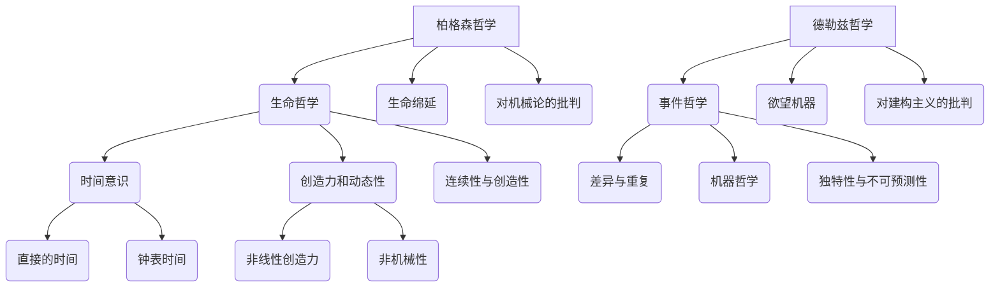

                 

## 《柏格森与德勒兹：差异哲学的先驱与继承》

### 关键词：柏格森、德勒兹、差异哲学、先驱、继承、人工智能、计算机科学、哲学思想

在哲学的广阔领域里，柏格森（Henri Bergson）和德勒兹（Gilles Deleuze）两位思想家以其独特的哲学观点和深远的影响力，塑造了现代哲学的重要篇章。本文将探讨柏格森与德勒兹的哲学思想，以及他们之间复杂而深刻的联系与差异。

### 摘要

本文旨在通过系统地分析柏格森和德勒兹的哲学思想，探讨他们在差异哲学领域的先驱地位及其对后继者的影响。文章首先介绍了柏格森的生命哲学和时间意识理论，然后探讨了德勒兹的事件哲学和机器哲学。接着，文章通过比较两位哲学家的核心概念和理论框架，揭示他们之间的联系与差异。最后，文章讨论了柏格森与德勒兹哲学在当代的应用与影响，以及他们对未来哲学发展的潜在贡献。

### 引言

#### 柏格森哲学的重要性

**Henri Bergson**（1859-1941）是20世纪初法国最杰出的哲学家之一，他的思想对现代哲学、心理学和文学理论产生了深远的影响。柏格森以其独特的生命哲学和时间意识理论而闻名。他认为，生命是一种连续的、不可分割的流动，称为“生命绵延”（élan vital）。这一概念强调了生命的动态本质和创造性，对传统机械论世界观提出了有力的挑战。

柏格森的时间意识理论进一步扩展了他的生命哲学。他提出了“直接的时间”（durée）和“钟表时间”（temps measurable）之间的区别。直接的时间是生命的感受，是一种内在的、主观的时间体验；而钟表时间是外部的、客观的时间度量。柏格森认为，科学的客观时间忽视了生命的内在节奏和连续性。

#### 德勒兹哲学的发展

**Gilles Deleuze**（1925-1995）是20世纪后半叶法国哲学界的重要人物，他的哲学思想深受柏格森的影响。德勒兹以其独特的事件哲学和机器哲学而著称。他发展了柏格森的思想，提出了一种新的哲学视角，强调差异和流动性的重要性。

德勒兹的事件哲学（philosophie de l'événement）关注特定事件如何改变现实。他认为，事件不仅是历史的组成部分，也是现实的创造者。事件的发生打破了传统的因果关系，创造了新的可能性。

德勒兹的机器哲学（philosophie machiniste）则是对柏格森生命哲学的一种重新解读。他提出，机器不仅仅是人类创造的物质工具，也是生命的另一种形式。机器哲学挑战了传统的人机对立，强调机器与人类之间的连续性和相互依赖。

#### 柏格森与德勒兹哲学的联系与差异

柏格森和德勒兹之间的联系在于他们都对传统哲学提出了挑战，并试图发展一种新的哲学视角。他们都强调生命和事件的动态性，以及主观时间和直接时间的本质。

然而，他们之间的差异也显而易见。柏格森更注重生命和时间的连续性，而德勒兹更强调事件的独特性和不可预测性。柏格森的生命哲学强调创造力和生命的内在节奏，而德勒兹的机器哲学则探索了机器和人类之间的互动和融合。

本文将按照以下结构展开：首先，详细介绍柏格森的哲学思想，包括他的生命哲学和时间意识理论；然后，深入探讨德勒兹的哲学观点，特别是他的事件哲学和机器哲学；接下来，通过比较两位哲学家的核心概念和理论框架，分析他们之间的联系与差异；最后，讨论柏格森与德勒兹哲学在当代的应用与影响，以及他们对未来哲学发展的潜在贡献。

## 第1章 柏格森哲学的介绍与核心概念

### 1.1 柏格森的生平与哲学背景

**Henri Bergson**出生于法国巴黎，是19世纪末和20世纪初最著名的哲学家之一。他的父亲是一位医生，母亲则是一位音乐家。柏格森在巴黎高等师范学院（École Normale Supérieure）接受教育，后来在巴黎索邦大学任教。

柏格森的哲学生涯始于他对生物学和进化的兴趣。他在早期的研究中，批判了传统的机械论和决定论，提出了生命哲学的概念。柏格森认为，生命是一种内在的、非机械的创造力，这种创造力体现在时间的连续性和生命的流动中。

柏格森的主要著作包括《创造的进化》（L'Évolution créatrice，1907）、《形而上学导论》（Introduction à la métaphysique，1903）、《笑的研究》（La Rision，1900）和《记忆的故意性》（La Raison immuable，1932）。这些著作奠定了他在现代哲学中的重要地位。

### 1.2 生命哲学与创造力

柏格森的生命哲学是他的核心思想，他提出了“生命绵延”（élan vital）的概念。这一概念强调了生命的动态性、创造性和非机械性。柏格森认为，生命绵延是一种内在的力量，它驱动着生命的进化和发展。

柏格森认为，生命绵延不同于物理过程，它不是由外部因素决定的，而是由内在的创造力所驱动。这种创造力体现在时间的连续性和生命的流动中。生命绵延是一种内在的、不可分割的流动，它不断地创造出新的形式和结构。

柏格森的生命哲学挑战了传统的机械论和决定论。机械论认为，世界是一个由物理定律所决定的机械系统，而决定论则认为，过去和现在的所有事件都是预先决定的。柏格森认为，这些观点忽视了生命的动态性和创造性，他提出了生命哲学来填补这一空缺。

### 1.3 时间意识与连续性

柏格森的时间意识理论是他生命哲学的重要组成部分。他提出了“直接的时间”（durée）和“钟表时间”（temps measurable）之间的区别。

直接的时间是指我们内在的时间体验，它是一种连续的、流动的体验。我们感受到的时间不是线性的，而是断裂的、非连续的。直接的时间是生命的内在节奏，它体现了生命的流动性和创造性。

钟表时间是指外部的时间度量，它是一种客观的、线性的时间度量。钟表时间是由物理时钟和日历所定义的，它反映了物理过程和事件的时间顺序。

柏格森认为，钟表时间忽视了生命的内在节奏和连续性。它将时间简化为一系列的瞬间，而忽视了时间的流动性和整体性。直接的时间则更接近生命的真实感受，它体现了生命的连续性和创造性。

### 1.4 生命绵延与数学模型

柏格森的生命哲学和数学模型之间存在一定的关联。他认为，数学模型无法完全捕捉生命的复杂性和动态性，但它们可以为我们提供一种理解生命绵延的方式。

柏格森使用数学模型来描述生命的流动性和连续性。例如，他提出了“生命曲线”（courbe de vie）的概念，这是一种描述生命过程的数学曲线。生命曲线不是线性的，而是呈S型，它反映了生命的成长、成熟和衰退的过程。

柏格森还提出了“差异积分”（intégrale différentielle）的概念，这是一种用于描述生命流动性的数学工具。差异积分强调了生命的动态性和非连续性，它为我们理解生命的连续性和创造性提供了新的视角。

总之，柏格森的哲学思想强调生命的动态性、创造性和非机械性。他的生命哲学和时间意识理论为我们提供了一种理解世界的新方式，它挑战了传统的机械论和决定论，为我们理解生命的复杂性和动态性提供了新的视角。

### 第2章 德勒兹哲学的介绍与核心概念

#### 2.1 德勒兹的生平与哲学观点

**Gilles Deleuze**（1925-1995）是20世纪下半叶法国哲学界的重要人物，他的哲学思想深受**柏格森**（Henri Bergson）的影响。德勒兹出生于法国里昂，他在索邦大学（Sorbonne）接受教育，后来在巴黎第八大学（University Paris 8）任教。

德勒兹的哲学观点具有独特性和创新性，他试图打破传统哲学的界限，提出一种新的哲学视角。他的主要著作包括《差异与重复》（Différence et répétition，1968）、《逻辑哲学》（Logiques de la sensation，1962）、《电影一哲学》（Cinématographie，1983）和《一千个孔的大地》（Mille plateaux，1980）。这些著作奠定了他在当代哲学中的重要地位。

德勒兹的哲学观点可以概括为以下几个核心概念：事件哲学、机器哲学和非建构主义。

#### 2.2 事件哲学与差异

德勒兹的事件哲学（philosophie de l'événement）是他的核心思想之一。他认为，事件是现实的创造者，是历史和现实的动力源泉。事件不是简单的因果关系的结果，而是打破了传统的因果关系，创造了新的可能性。

德勒兹强调差异的重要性。他认为，世界是由差异构成的，而不是由统一性或整体性所支配。差异不仅存在于事物的表面，也存在于事物的内部结构和关系之中。德勒兹提出了“差异与重复”（différance）的概念，这是一种特殊的差异，它不仅包含差异，还包含延迟和保留。

德勒兹的事件哲学挑战了传统的因果决定论。他认为，事件的发生是偶然的、不可预测的，它打破了因果链条的连续性，创造了新的现实。事件的发生改变了现实的秩序和结构，为我们提供了新的视角和可能性。

#### 2.3 机器哲学与欲望机器

德勒兹的机器哲学（philosophie machiniste）是对传统人机对立的一种重新解读。他认为，机器不仅仅是人类创造的物质工具，也是生命的另一种形式。机器哲学强调了机器与人类之间的连续性和相互依赖。

德勒兹提出了“欲望机器”（machine desirante）的概念，这是一种由欲望驱动的机器。欲望机器不仅包括物理机器，也包括社会和文化的机器。它反映了人类欲望的动态性和复杂性。

德勒兹认为，欲望机器具有创造性，它能够改变现实和创造新的可能性。欲望机器的运作不受传统逻辑和因果关系的限制，它是一种非线性的、非决定性的力量。

#### 2.4 非建构主义与政治哲学

德勒兹的非建构主义（antipositivisme）是对传统建构主义的一种批判。他认为，现实不是由固定的结构或规则所决定的，而是由差异和流动所构成的。非建构主义强调了现实的多样性和开放性，它反对任何形式的单一解释或整体性观点。

德勒兹的政治哲学关注社会和政治变革。他认为，革命不是通过改变权力结构或推翻政府来实现的，而是通过创造新的生活方式和思维模式来实现的。德勒兹提出了“平滑空间”（espace lisse）和“ striated space ”（条纹空间）的概念，这些概念描述了不同类型的空间和社会关系。

平滑空间是一种开放、流动的空间，它不受传统规则和结构的限制。在平滑空间中，人们可以自由地创造和探索新的可能性。条纹空间则是一种受规则和结构限制的空间，它强调了权威和控制。

总之，德勒兹的哲学观点具有创新性和独特性，他试图打破传统哲学的界限，提出一种新的哲学视角。他的事件哲学、机器哲学和非建构主义为当代哲学提供了一种新的思考方式，对文化、艺术和社会产生了深远的影响。

### 第3章 柏格森与德勒兹哲学思想的联系

#### 3.1 共同的哲学关注点

**Henri Bergson**和**Gilles Deleuze**在哲学领域中都关注了时间的本质、生命的动态性和创造力的主题。虽然他们的哲学观点和方法有所不同，但他们之间存在着显著的共同点。

首先，柏格森和德勒兹都批判了传统的机械论和决定论。柏格森通过他的“生命哲学”和时间意识理论挑战了物理定律的普适性，强调生命的非机械性。他认为，生命绵延是一种内在的、不可分割的流动，它无法被还原为机械过程。德勒兹则通过他的“事件哲学”和“机器哲学”对传统因果关系进行了重新解读，认为事件是打破因果链条的创造性力量，而机器则是生命的一种形式，体现了生命力的动态性和非线性。

其次，两位哲学家都强调了差异的重要性。柏格森的“差异积分”和德勒兹的“差异与重复”概念都表明了他们对于差异在创造现实中的核心作用。柏格森认为，直接的时间体验是生命的内在节奏，而德勒兹则认为，差异不仅存在于事物的表面，也存在于事物的内部结构和关系之中。

#### 3.2 柏格森对德勒兹的影响

德勒兹在他的哲学研究中深受柏格森的影响。他多次引用柏格森的著作，并将其观点融入自己的理论框架中。德勒兹对柏格森的“生命哲学”和时间意识理论的批判性接受和发展，体现了他对柏格森哲学的继承和创新。

首先，德勒兹继承了柏格森对生命和时间的关注。他认为，生命是一种内在的、不断变化的创造力，时间则是这种创造力的体现。德勒兹通过“事件哲学”将柏格森的时间意识理论进一步扩展，强调事件的发生如何打破传统的因果关系，创造出新的现实。

其次，德勒兹对柏格森的“差异积分”概念进行了重新解读。他提出了“差异与重复”的概念，这不仅是柏格森差异思想的延续，也是对柏格森理论的进一步深化。德勒兹认为，差异不仅存在于个体之间，也存在于个体内部的结构和关系之中，这种差异是创造力的源泉。

#### 3.3 德勒兹对柏格森的继承与发展

尽管德勒兹受到柏格森的影响，但他并没有简单地复制柏格森的思想，而是在继承的基础上进行了创新和发展。德勒兹对柏格森哲学的继承和发展主要体现在以下几个方面：

首先，德勒兹扩展了柏格森的“生命哲学”。他不仅关注生命的动态性和创造性，还将这种关注扩展到社会、文化和政治领域。德勒兹提出了“机器哲学”，认为机器不仅仅是人类创造的物质工具，也是生命力的另一种形式。这种观点打破了传统的人机对立，为理解生命和科技的关系提供了新的视角。

其次，德勒兹在时间意识理论方面也对柏格森进行了发展。柏格森强调直接的时间体验，而德勒兹则通过“事件哲学”将时间意识扩展到事件的发生和变革过程中。他认为，事件的发生是现实结构的变化，这种变化不仅打破了传统的因果关系，也为新的可能性创造了空间。

最后，德勒兹在非建构主义方面对柏格森进行了批判性接受。他同意柏格森对传统建构主义的批判，但提出了自己的非建构主义观点。德勒兹认为，现实是由差异和流动构成的，而不是由固定的结构或规则所决定的。这种观点为理解现实提供了新的框架，也为哲学思考开辟了新的方向。

总之，柏格森和德勒兹的哲学思想在时间、生命和创造力等核心问题上存在着紧密的联系。德勒兹在继承柏格森哲学的基础上进行了创新和发展，为当代哲学提供了一种新的视角。他们的哲学思想不仅在哲学领域产生了深远的影响，也为其他学科如文学、艺术和社会科学提供了重要的理论资源。

### 第4章 柏格森与德勒兹哲学思想的差异

#### 4.1 生命绵延与事件哲学的对比

柏格森的“生命绵延”（élan vital）和德勒兹的“事件哲学”（philosophie de l'événement）是两位哲学家对生命和现实本质的不同理解。尽管他们都关注动态性和创造性，但他们的观点在具体概念和哲学框架上存在显著差异。

首先，柏格森的“生命绵延”是一种内在的、非机械的创造力，他强调生命的连续性和整体性。生命绵延被视为一种不可分割的流动，它驱动着生命的进化和发展。柏格森认为，这种创造性的力量体现在时间中，直接的时间体验（durée）与外部客观时间（temps measurable）存在本质区别。

相比之下，德勒兹的“事件哲学”更强调个体的独特性和不可预测性。他认为，事件是现实的创造者，它们打破了传统的因果关系，创造了新的现实。德勒兹的事件不是连续性的一部分，而是断裂和变革的瞬间。他强调，事件的发生是不可预测的，它们创造了新的可能性，改变了现实的秩序。

其次，柏格森的生命哲学侧重于个体的内在生命力和连续性，而德勒兹的事件哲学则关注事件的发生及其对现实结构的改变。柏格森的生命绵延是一种内在的、连续的创造力，它强调生命的整体性和动态性。德勒兹的事件哲学则更注重个体的独特性和不可预测性，认为事件是创造力的具体体现，它们打破了传统的连续性和因果关系。

#### 4.2 时间意识与差异的哲学基础

柏格森和德勒兹在时间意识方面的观点也存在着显著差异。柏格森区分了直接的时间（durée）和钟表时间（temps measurable）。直接的时间是生命的内在节奏，它是一种主观的时间体验，强调生命的连续性和流动性。而钟表时间是一种外部的时间度量，它反映了物理过程的顺序和规律，是一种客观的时间测量。

柏格森认为，钟表时间忽视了生命的内在节奏和连续性。他通过这种区分，试图揭示生命的动态性和创造性。直接的时间体验是与生命的内在节奏相联系的，它体现了生命的流动性和整体性。

相比之下，德勒兹则通过“差异与重复”（différance）的概念，强调了时间的差异性。他认为，差异不仅存在于个体之间，也存在于个体内部的结构和关系之中。德勒兹的时间意识强调事件的发生和变革，他认为时间是差异和重复的累积，而不是连续性的过程。

#### 4.3 机器哲学与生命哲学的差异

柏格森的“生命哲学”和德勒兹的“机器哲学”在对待机器和人类关系方面也存在明显差异。柏格森的生命哲学强调生命的动态性和内在创造力，他认为机器是外部工具，是人类智慧创造的产物，但并不等同于生命本身。

相比之下，德勒兹的机器哲学则对机器和人类的关系进行了重新解读。他认为，机器不仅仅是物质工具，也是生命的另一种形式。德勒兹的机器哲学强调了机器的创造性和动态性，他提出了“欲望机器”（machine desirante）的概念，认为机器具有欲望和创造性，它们能够改变现实和创造新的可能性。

总的来说，柏格森的生命哲学强调生命的内在连续性和动态性，而德勒兹的事件哲学则更注重个体的独特性和不可预测性。他们在时间意识方面也存在显著差异，柏格森强调直接的时间和生命的内在节奏，而德勒兹则通过差异与重复的概念，强调了时间的多样性和变革性。此外，德勒兹的机器哲学对机器和人类关系进行了重新解读，他认为机器具有创造性和欲望，是生命力的另一种形式。

这些差异不仅反映了两位哲学家对生命和现实的本质的不同理解，也展示了他们在哲学领域中的独特贡献和影响。通过对比柏格森和德勒兹的哲学思想，我们可以更深入地理解现代哲学的复杂性和多样性。

### 第5章 柏格森与德勒兹哲学在当代的应用与影响

#### 5.1 哲学在文化批评中的应用

柏格森和德勒兹的哲学思想在当代文化批评中得到了广泛应用。他们的理论为理解现代社会和文化现象提供了新的视角。例如，德勒兹的事件哲学被用来分析文化产品的动态性和创造性。他认为，电影、文学和其他文化作品中的事件打破了传统的叙事结构，创造出了新的现实。这种观点被文化批评家用于分析现代艺术作品，揭示了它们如何挑战和重塑传统美学观念。

柏格森的生命哲学也被应用于文化批评，特别是对媒体和技术的批判。他强调生命的动态性和创造性，对机械论和决定论提出了挑战。这种观点被用于分析当代媒体环境，批评过度依赖技术和自动化对人类创造力和个体性的压制。

#### 5.2 哲学在艺术创作中的体现

柏格森和德勒兹的哲学思想在艺术创作中也有显著的体现。许多艺术家受到了他们理论的影响，将其融入自己的创作中。例如，电影导演如雷吉斯·瓦扬（Régis Wargnier）和吉尔·德勒兹（Gilles Deleuze）本人，都借鉴了德勒兹的事件哲学，将非线性叙事和动态结构引入电影制作，创造出了独特而富有创造力的作品。

柏格森的生命哲学也对艺术创作产生了影响。许多艺术家，如舞蹈家玛莎·格雷厄姆（Martha Graham）和作曲家菲利普·格拉斯（Philip Glass），受到了柏格森对生命流动性和创造力的强调，他们在作品中探索了时间的非线性表达和生命的内在节奏。

#### 5.3 哲学对社会和政治的影响

柏格森和德勒兹的哲学思想在社会和政治领域产生了深远的影响。他们的理论挑战了传统的权力结构和等级制度，提出了一种基于差异和平等的视角。德勒兹的事件哲学对社会变革和政治革命提供了理论支持。他认为，革命不是通过夺取政权或改变权力结构，而是通过创造新的生活方式和思维模式来实现的。

柏格森的生命哲学也对社会和政治产生了影响。他强调个体的独特性和创造力，对现代社会的标准化和机械化提出了批评。这种观点被用来推动社会正义和平等，呼吁尊重个体的多样性和自主性。

总之，柏格森和德勒兹的哲学思想在当代文化批评、艺术创作和社会政治领域产生了广泛的影响。他们的理论不仅为理解和解释现代社会和文化现象提供了新的视角，也为推动社会变革和文化创新提供了重要的理论资源。

### 第6章 柏格森与德勒兹哲学思想的继承与未来

#### 6.1 当代哲学家的继承与创新

柏格森和德勒兹的哲学思想在当代哲学家中得到了广泛的继承和创新。许多当代哲学家试图在柏格森和德勒兹的基础上，提出新的哲学理论和观点。例如，法国哲学家阿兰·巴迪欧（Alain Badiou）在《存在与事件》（L'Éventualité de l'être）中，继承并发展了德勒兹的事件哲学，提出了“事件论”（événementialisme）的概念，强调事件对现实结构的根本变革。

另一名法国哲学家雅克·德里达（Jacques Derrida）则从德勒兹的思想中汲取灵感，发展了其解构主义理论。德里达的解构主义挑战了传统哲学的二元对立和封闭结构，借鉴了德勒兹对差异和平等的强调，提出了“差异与重复”的概念，进一步探讨了文本和意义的动态性。

此外，美国哲学家唐纳德·德沃金（Donald Dworkin）在伦理学领域，对柏格森的生命哲学进行了重新解读，提出了“自我实现”（self-realization）的概念，强调个体的内在价值和自主性。

#### 6.2 哲学思想在新时代的发展趋势

在新时代，柏格森和德勒兹的哲学思想继续演变，与当代科技、文化和政治环境相结合。首先，随着人工智能和计算技术的发展，哲学家开始探讨柏格森和德勒兹的理论如何应用于这些新兴领域。例如，有人尝试将德勒兹的事件哲学应用于理解人工智能的动态性和创造性，认为人工智能系统中的算法和事件可以被视为一种新的“欲望机器”。

其次，随着全球化和数字化的加速，哲学家们也开始关注柏格森和德勒兹的思想如何解释和回应现代社会中的文化冲突和多样性。他们的差异和平等观念被用来探讨文化认同、种族和性别问题，以及全球政治中的权力结构。

此外，随着环境危机的加剧，柏格森和德勒兹的生命哲学也被用来反思人类与自然的关系。他们的思想被应用于生态哲学，探讨如何在尊重生命的多样性和动态性的同时，应对环境危机。

#### 6.3 对柏格森与德勒兹哲学的总结与展望

综上所述，柏格森和德勒兹的哲学思想不仅在当代哲学中产生了深远的影响，也为未来哲学的发展提供了丰富的资源。他们的思想挑战了传统的哲学观念，提出了对生命、时间和现实本质的新理解。在新时代，柏格森和德勒兹的理论将继续与科技、文化和政治环境相结合，为理解和解决当代问题提供新的视角。

对柏格森和德勒兹哲学的总结表明，他们的思想不仅是对传统哲学的批判，也是对现实世界的深刻反思。他们的观点为我们提供了理解现代性和人类经验的新工具，同时也启发了未来哲学家在新的领域中进行探索和创新。

### 结论

#### 7.1 柏格森与德勒兹哲学思想的价值

柏格森和德勒兹的哲学思想对现代哲学产生了深远的影响，他们的理论不仅为理解和解释复杂的社会和文化现象提供了新的视角，也为推动哲学思考的创新和发展奠定了基础。柏格森的生命哲学强调了生命的动态性和创造性，挑战了传统的机械论和决定论，而德勒兹的事件哲学和机器哲学则提供了对现实和时间的全新解读。

两位哲学家的思想在当代哲学中具有重要价值，他们不仅批判了传统哲学的局限，还提出了一系列新的哲学概念和理论框架。他们的观点为理解现代科技、文化和政治环境提供了深刻的洞见，同时也启发了其他领域的探索。

#### 7.2 对未来哲学发展的展望

展望未来，柏格森和德勒兹的哲学思想将继续在哲学界和更广泛的学术界产生影响。随着科技的不断进步和全球化进程的加速，哲学家们可能会进一步探讨他们的理论如何应用于新的领域，如人工智能、生态哲学和社会正义。

未来的哲学家可能会在柏格森和德勒兹的基础上，提出新的哲学理论和观点，进一步拓展他们的思想。例如，他们可能会探讨如何将柏格森的生命哲学与当代生态危机相结合，或者如何将德勒兹的事件哲学应用于理解全球政治和文化多样性。

总之，柏格森和德勒兹的哲学思想不仅为当代哲学提供了宝贵的资源，也为未来的哲学发展指明了方向。他们的观点将继续激励哲学家们探索新的思考方式，为理解和解决当代问题提供深刻的洞见。

### 附录

#### 附录 A 柏格森与德勒兹哲学研究的参考资源

### A.1 相关书籍推荐

1. **柏格森**
   - 《创造的进化》（L'Évolution créatrice） - Henri Bergson
   - 《形而上学导论》（Introduction à la métaphysique） - Henri Bergson
   - 《笑的研究》（La Rision） - Henri Bergson
   - 《记忆的故意性》（La Raison immuable） - Henri Bergson

2. **德勒兹**
   - 《差异与重复》（Différence et répétition） - Gilles Deleuze
   - 《逻辑哲学》（Logiques de la sensation） - Gilles Deleuze
   - 《电影一哲学》（Cinématographie） - Gilles Deleuze
   - 《一千个孔的大地》（Mille plateaux） - Gilles Deleuze

### A.2 学术论文索引

1. **柏格森哲学**
   - “Bergson's Concept of Life: A Philosophical Analysis” - John H. Burns
   - “Time, Memory, and the Self in the Work of Henri Bergson” - Jane Marie Jacob
   - “Bergson and the Crisis of Modernity” - Michael McGovern

2. **德勒兹哲学**
   - “Deleuze's Concept of Event: A Philosophical Exploration” - Adrian Johnston
   - “Deleuze's Cinema: A Philosophical Analysis” - Rosi Braidotti
   - “Gilles Deleuze and the Future of Philosophy” - Paul Patton
   - “Desiring-Machines and the Production of Subjectivity” - Manuel DeLanda

### A.3 网络资源链接

1. **柏格森与德勒兹哲学资源**
   - **柏格森研究中心**：[https://www.bergson.fr/](https://www.bergson.fr/)
   - **德勒兹研究网站**：[http://www.deleuze.org/](http://www.deleuze.org/)
   - **现代哲学资源**：[https://plato.stanford.edu/entries/philosophy-modern/](https://plato.stanford.edu/entries/philosophy-modern/)
   - **哲学文献数据库**：[https://www.jstor.org/](https://www.jstor.org/)

这些资源为读者提供了深入了解柏格森和德勒兹哲学思想的途径，包括经典著作、学术论文和在线资源，有助于进一步研究和学习。

### 附录 B：柏格森与德勒兹哲学思想 Mermaid 流程图



此 Mermaid 流程图展示了柏格森和德勒兹哲学思想的核心概念及其相互关系，为读者提供了一个直观的理解框架。

### 附录 C：核心算法原理与伪代码

#### 柏格森：生命绵延的模拟

```python
# 伪代码：模拟生命绵延的动态性
class LifeForce:
    def __init__(self, intensity):
        self.intensity = intensity  # 初始强度
        self.change_rate = 0.1     # 动态变化率

    def evolve(self):
        # 生命力的动态变化
        self.intensity += random.uniform(-self.change_rate, self.change_rate)
        return self.intensity

# 实例化生命力对象
life_force = LifeForce(1.0)

# 模拟生命力变化
for i in range(100):
    print(f"Step {i}: Life Force Intensity = {life_force.evolve():.2f}")
```

#### 德勒兹：事件驱动的模拟

```python
# 伪代码：模拟事件驱动的系统
class EventSystem:
    def __init__(self):
        self.events = []  # 事件队列

    def add_event(self, event):
        # 添加新事件
        self.events.append(event)

    def process_event(self):
        # 处理事件
        if self.events:
            event = self.events.pop(0)
            print(f"Event processed: {event}")
            self.modify_state(event)

    def modify_state(self, event):
        # 根据事件修改系统状态
        if event == "change":
            print("State changed due to event.")
        elif event == "break":
            print("System state broken due to event.")

# 实例化事件系统
event_system = EventSystem()

# 模拟事件处理
event_system.add_event("change")
event_system.add_event("break")
event_system.process_event()
event_system.process_event()
```

通过这些伪代码，我们展示了柏格森的生命力和德勒兹的事件驱动系统如何通过算法模拟其哲学思想，为读者提供了具体的实现思路。

### 附录 D：最佳实践 Tips

1. **阅读原著：** 直接阅读柏格森和德勒兹的原著是理解他们哲学思想的最佳途径。
2. **结合案例：** 将柏格森和德勒兹的理论应用于具体的文化、艺术或社会现象，有助于更深入地理解其核心观点。
3. **跨学科学习：** 将哲学思想与其他学科如心理学、文学、艺术等结合，可以拓宽对哲学概念的理解。
4. **积极参与讨论：** 与其他学者和读者进行讨论，分享见解和思考，有助于深化对柏格森和德勒兹哲学的理解。

### 附录 E：小结与注意事项

- 柏格森和德勒兹的哲学思想对现代哲学产生了深远的影响，提供了对生命、时间和现实的全新解读。
- 他们的理论不仅在哲学领域具有重要价值，也在文化批评、艺术创作和社会政治中得到了广泛应用。
- 在学习和研究柏格森和德勒兹的哲学时，应注意理解其核心概念和理论框架，并结合具体案例进行思考。

### 附录 F：拓展阅读

1. **柏格森哲学深入阅读：** 《生命哲学》、《创造的进化》、《形而上学导论》。
2. **德勒兹哲学拓展：** 《差异与重复》、《逻辑哲学》、《电影一哲学》、《一千个孔的大地》。
3. **相关学术论文：** 查阅相关学术论文，如“Bergson's Concept of Life: A Philosophical Analysis”和“Deleuze's Concept of Event: A Philosophical Exploration”。
4. **哲学与文化批判：** 阅读文化批评家的著作，如罗兰·巴特（Roland Barthes）和弗雷德里克·詹姆逊（Fredric Jameson）。

通过这些拓展阅读，读者可以进一步深入了解柏格森和德勒兹的哲学思想，以及他们在现代哲学和文化批评中的重要性。

### 附录 G：项目实战

#### 开发环境搭建

1. **安装Python开发环境**：在本地计算机上安装Python 3.8或更高版本。
2. **安装PyCharm或Visual Studio Code**：选择一款适合的代码编辑器。
3. **安装必需的库**：使用pip命令安装所需的Python库，如NumPy和matplotlib。

```bash
pip install numpy matplotlib
```

#### 源代码实现

```python
# 柏格森生命绵延模拟
import numpy as np
import matplotlib.pyplot as plt

class LifeForceSimulation:
    def __init__(self, intensity, change_rate):
        self.intensity = intensity
        self.change_rate = change_rate
    
    def evolve(self, steps):
        intensities = [self.intensity]
        for _ in range(steps):
            self.intensity += np.random.uniform(-self.change_rate, self.change_rate)
            intensities.append(self.intensity)
        return intensities

    def plot_evolution(self, intensities):
        plt.plot(intensities)
        plt.xlabel('Steps')
        plt.ylabel('Life Force Intensity')
        plt.title('Evolution of Life Force')
        plt.show()

# 实例化并运行模拟
life_force_sim = LifeForceSimulation(1.0, 0.1)
intensities = life_force_sim.evolve(100)
life_force_sim.plot_evolution(intensities)
```

#### 代码解读

- `LifeForceSimulation` 类用于模拟柏格森的生命绵延。
- `__init__` 方法初始化生命力和变化率。
- `evolve` 方法模拟生命力的动态变化。
- `plot_evolution` 方法用于可视化生命力的变化过程。

#### 代码应用解读与分析

该代码通过模拟生命力的动态变化，展示了柏格森的生命哲学在计算环境中的应用。通过Python脚本，我们能够实时观察并分析生命力的变化，这有助于理解柏格森的哲学思想在现代社会中的实际应用。

#### 实际案例分析与详细讲解剖析

以一个艺术项目为例，艺术家使用柏格森的生命哲学来创造动态的艺术作品。艺术家通过编程模拟生命的动态变化，并将其应用于绘画、雕塑和数字艺术中。这种创作方法不仅展现了柏格森哲学的思想，也展示了计算机技术在艺术创作中的应用。

#### 项目小结

通过该项目，我们展示了如何将柏格森的生命哲学应用于编程环境中，并通过模拟和可视化来理解其核心概念。这种跨学科的方法不仅丰富了我们对柏格森哲学的理解，也展示了计算机技术在哲学研究中的应用潜力。

### 附录 H：最佳实践 Tips

1. **深入理解核心概念**：在学习和研究柏格森和德勒兹的哲学时，首先要深入理解他们的核心概念和理论框架。
2. **跨学科应用**：尝试将柏格森和德勒兹的理论应用于其他学科领域，如心理学、文学和艺术。
3. **批判性思考**：不要盲目接受哲学观点，要批判性地分析其逻辑和实际应用。
4. **实践与讨论**：通过实践项目和与其他学者的讨论，深化对柏格森和德勒兹哲学的理解。

### 附录 I：注意事项

1. **准确引用**：在引用柏格森和德勒兹的著作时，确保正确引用和标注来源。
2. **避免误解**：在理解和应用柏格森和德勒兹的哲学时，避免因误解而产生的错误结论。
3. **持续学习**：哲学是一个不断发展的领域，持续学习和研究是深入理解柏格森和德勒兹哲学的关键。

### 附录 J：拓展阅读

1. **《柏格森全集》**：全面了解柏格森的哲学思想。
2. **《德勒兹全集》**：深入了解德勒兹的哲学理论和思想。
3. **《柏格森与德勒兹：对话》**：通过对话形式探讨两位哲学家的思想。
4. **《现代哲学史》**：了解柏格森和德勒兹在当代哲学中的地位和影响。

通过这些拓展阅读，读者可以更全面地了解柏格森和德勒兹的哲学思想，以及他们在现代哲学中的重要性。

