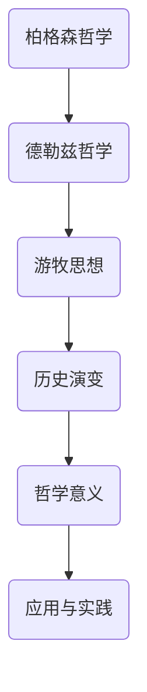

                 


### 文章标题

《柏格森与德勒兹：游牧思想的哲学根源》

> 关键词：柏格森，德勒兹，游牧思想，哲学，根源

> 摘要：本文深入探讨了法国哲学家柏格森与德勒兹的游牧思想哲学根源，通过对他们核心概念的分析和比较，探讨了游牧思想在哲学上的意义及其在现代社会的应用。

---

## 第一部分 引言

### 1.1 游牧思想的哲学背景

游牧思想，作为一种哲学和文化观念，其根源可以追溯到古代世界的游牧生活方式。游牧民族由于不固定的居住地，形成了一种对空间和时间独特感知的生活方式。这种生活方式催生了他们对世界的理解方式，从而影响了哲学的发展。柏格森与德勒兹正是受到了这种游牧思想的影响，将之融入到他们的哲学体系中。

柏格森（Henri Bergson）是20世纪初期的重要哲学家，他的思想深受游牧生活方式的影响。柏格森提出了“生命力和创造进化”的概念，强调了生命力的不断流动和创造。德勒兹（Gilles Deleuze）则在此基础上进一步发展，提出了“事件与差异”的理论，探讨了游牧思想在网络化和去中心化社会中的意义。

### 1.2 柏格森与德勒兹的思想贡献

柏格森在哲学上最大的贡献是提出了“直觉主义”和“生命力学”的概念。他认为，直觉是人类认识世界的重要方式，而生命力则是推动世界发展的根本动力。德勒兹则在柏格森的基础上，提出了“差异与重复”的理论，强调了事件和差异的重要性，并探讨了这些概念在网络化和去中心化社会中的应用。

### 1.3 书的结构与目标

本书的结构分为四个部分。第一部分是引言，介绍了游牧思想的哲学背景和柏格森与德勒兹的思想贡献。第二部分详细分析了柏格森的哲学，包括其核心概念和主要著作。第三部分则探讨了德勒兹的哲学，重点分析了他的核心观点和代表作品。第四部分则将柏格森与德勒兹的思想进行比较，并探讨了游牧思想在现代社会中的应用。

本书的目标是通过对柏格森与德勒兹游牧思想哲学根源的深入探讨，帮助读者理解游牧思想在哲学上的意义及其在现代社会的应用。

---

## 第二部分 柏格森哲学

### 2.1 柏格森哲学的核心概念

柏格森哲学的核心概念包括“生命力和创造进化”、“直觉主义”和“游牧性”。这些概念相互关联，构成了柏格森哲学的独特体系。

**2.1.1 生命力和创造进化**

柏格森认为，生命力（élan vital）是推动世界发展的根本动力。生命力是一种无形的力量，它使得生命体不断进化，不断创新。柏格森通过“创造进化”（évolution créatrice）来解释生命力的作用。他认为，创造进化是一种不断产生新事物的过程，是生命力的具体表现。

**2.1.2 直觉主义**

柏格森认为，直觉是人类认识世界的重要方式。直觉不仅是一种感知，更是一种理解。它能够直接捕捉到事物的本质，而不仅仅是表面的现象。柏格森的直觉主义强调，通过直觉，人们能够超越逻辑推理，直接理解世界的本质。

**2.1.3 游牧性**

柏格森深受游牧生活方式的影响，他将游牧性（nomadisme）融入到他的哲学体系中。游牧性不仅仅是一种地理上的移动，更是一种生活方式和思维方式。柏格森认为，游牧性能够帮助人们更好地理解世界，因为它迫使人们不断变化和适应，从而避免了固定的思维模式。

### 2.2 柏格森的哲学著作分析

柏格森的哲学著作众多，其中最具代表性的包括《创造进化论》、《时间与自由意志》和《论意识》。

**2.2.1 《创造进化论》**

在《创造进化论》中，柏格森详细阐述了生命力和创造进化的概念。他认为，生命力和创造进化是一种不断流动和变化的过程，这种过程是宇宙发展的根本动力。柏格森通过大量的生物学和物理学例子，来说明生命力和创造进化的原理。

**2.2.2 《时间与自由意志》**

在《时间与自由意志》中，柏格森探讨了时间与自由意志的关系。他认为，时间不是线性的，而是一种持续流动的现在。自由意志是在这种流动的时间中实现的，因为只有在不断变化的过程中，人们才能做出选择。柏格森的这种观点对后来的存在主义哲学产生了深远的影响。

**2.2.3 《论意识》**

在《论意识》中，柏格森讨论了意识的本质。他认为，意识是一种直接感知，它能够捕捉到事物的本质。柏格森通过分析梦境和幻觉，来说明意识的运作机制。他认为，意识不仅是对外部世界的反映，更是对内部心理过程的感知。

### 2.3 柏格森哲学的当代影响

柏格森的哲学对当代哲学和社会科学产生了深远的影响。他的生命力和创造进化的概念，为后来的生物学和物理学提供了重要的理论框架。他的直觉主义和对时间的独特理解，对存在主义哲学产生了重要影响。此外，柏格森的游牧性概念，也为后现代主义提供了重要的思想资源。

---

## 第三部分 德勒兹哲学

### 3.1 德勒兹哲学的核心观点

德勒兹（Gilles Deleuze）是20世纪后期的哲学家，他的哲学观点深受柏格森的影响。德勒兹的核心观点包括“事件与差异”、“网络与去中心化”和“地理哲学与游牧思想”。

**3.1.1 事件与差异**

德勒兹认为，事件（événement）是构成世界的根本单位。事件不是静止的实体，而是不断发生和变化的过程。德勒兹通过“差异与重复”（différence et répétition）来解释事件的本质。他认为，事件是通过差异来建立的，每一个事件都是独一无二的，同时也重复着其他事件。

**3.1.2 网络与去中心化**

德勒兹强调网络（réseaux）在现代社会中的重要性。他认为，网络是去中心化的，没有固定的中心。德勒兹的网络概念不仅适用于社会和科技领域，也适用于哲学和艺术。他认为，网络是创造性和多样性产生的地方。

**3.1.3 地理哲学与游牧思想**

德勒兹的地理哲学深受柏格森的影响。他认为，地理并不是静态的，而是一种动态的过程。德勒兹的游牧思想强调了移动和变化的重要性。他认为，游牧性是一种对抗固定性和同质化的力量。

### 3.2 德勒兹的代表作品

德勒兹的代表作品包括《差异与重复》、《论柏拉图的药房》和《尼采与哲学》。

**3.2.1 《差异与重复》**

在《差异与重复》中，德勒兹详细阐述了事件与差异的理论。他认为，差异是事件产生的根本原因，而重复则是事件的一种表现。德勒兹通过分析文学、电影和艺术作品，来说明差异与重复的原理。

**3.2.2 《论柏拉图的药房》**

在《论柏拉图的药房》中，德勒兹探讨了柏拉图哲学中的“药房”概念。他认为，药房是一种通过药物来探索知识和真理的方式。德勒兹通过对柏拉图哲学的解读，提出了自己的哲学观点。

**3.2.3 《尼采与哲学》**

在《尼采与哲学》中，德勒兹分析了尼采哲学的核心概念。他认为，尼采的哲学是一种反哲学，它挑战了传统哲学的权威。德勒兹通过分析尼采的作品，探讨了尼采哲学的深远影响。

### 3.3 德勒兹哲学的批判与争议

德勒兹的哲学观点引发了广泛的争议。一些学者认为，德勒兹的思想过于抽象，难以理解。另一些学者则认为，德勒兹的思想具有深刻的哲学意义，对当代哲学和社会科学产生了重要影响。

尽管存在争议，德勒兹的哲学观点仍然具有独特的价值。他的事件与差异理论，为理解世界的复杂性提供了新的视角。他的网络与去中心化概念，为现代社会提供了新的思考方式。他的地理哲学与游牧思想，为我们理解人类与自然的关系提供了新的思路。

---

## 第四部分 游牧思想的历史与哲学意义

### 4.1 游牧思想的历史演变

游牧思想的历史可以追溯到古代世界。在古代，游牧民族的生活方式和对世界的理解方式，对哲学和文化的发展产生了重要影响。随着人类社会的发展，游牧思想逐渐演变，形成了独特的哲学观念。

在古希腊和古罗马时期，游牧思想主要体现在哲学家的思想中。柏拉图和亚里士多德等哲学家，通过对游牧民族的生活方式的研究，提出了自己的哲学观点。在中世纪，游牧思想继续发展，主要体现在基督教神学和神秘主义哲学中。

近代以来，游牧思想逐渐与科学和哲学相结合，形成了独特的哲学体系。柏格森和德勒兹等哲学家，通过对游牧思想的深入探讨，提出了自己的哲学观点，对现代哲学和社会科学产生了重要影响。

### 4.2 游牧思想在哲学上的意义

游牧思想在哲学上具有重要的意义。首先，它挑战了传统的哲学观念，提出了一种新的世界理解方式。柏格森和德勒兹等哲学家，通过游牧思想，提出了一种非中心化的世界观念，强调了事件和差异的重要性。

其次，游牧思想为理解人类与自然的关系提供了新的思路。游牧民族的生活方式，使他们更加接近自然，更加尊重自然。这种观点对现代社会的环境保护和可持续发展具有重要意义。

最后，游牧思想为现代社会提供了一种新的思考方式。游牧思想强调移动和变化，提倡多样性。这种观点对于解决现代社会的问题，如社会不平等、文化冲突等，提供了有益的启示。

---

## 第五部分 柏格森与德勒兹：游牧思想的哲学根源

### 5.1 柏格森与德勒兹思想的对比

柏格森和德勒兹的哲学观点存在许多相似之处，但也存在显著的差异。

**5.1.1 共同点**

柏格森和德勒兹都深受游牧思想的影响，强调生命的流动性和创造性。他们都认为，生命是一种不断变化的过程，这种变化是推动世界发展的根本动力。

此外，柏格森和德勒兹都关注时间的本质。柏格森提出了“直觉主义”和“生命力学”的概念，强调了时间在生命中的作用。德勒兹则通过“事件与差异”的理论，探讨了时间的多样性和复杂性。

**5.1.2 区别**

尽管柏格森和德勒兹的哲学观点有相似之处，但他们的理论方法和关注点有所不同。

柏格森更关注生命力和创造进化的本质，强调直觉和直接感知的重要性。他认为，直觉是人类理解世界的重要方式，而生命力则是推动世界发展的根本动力。

德勒兹则更关注事件和差异的构成，强调网络和去中心化的重要性。他认为，事件是构成世界的根本单位，而差异则是事件产生的原因。德勒兹的网络概念不仅适用于社会和科技领域，也适用于哲学和艺术。

**5.1.3 相互影响**

柏格森和德勒兹的哲学观点相互影响，共同推动了游牧思想的发展。柏格森的生命力和创造进化的概念，为德勒兹的事件与差异理论提供了重要的基础。德勒兹则通过网络和去中心化的概念，进一步扩展了柏格森的思想。

他们的相互影响也体现在他们对现代哲学和社会科学的贡献上。柏格森的直觉主义和生命力学，对后来的生物学和物理学产生了深远的影响。德勒兹的事件与差异理论，为后现代主义提供了重要的思想资源。

### 5.2 游牧思想哲学根源的探索

柏格森和德勒兹的哲学观点都根植于游牧思想，这种思想源于游牧民族的生活方式和对世界的理解方式。通过对游牧思想的深入探讨，我们可以更好地理解柏格森和德勒兹的哲学根源。

**5.2.1 对生命力和创造力的理解**

柏格森和德勒兹都强调生命力和创造力的重要性。他们认为，生命力是推动世界发展的根本动力，创造力则是生命力的具体表现。这种观点反映了游牧民族的生活方式和对世界的理解方式。游牧民族不断迁移，不断适应新的环境，从而激发了他们的生命力和创造力。

**5.2.2 对空间与时间的感知**

柏格森和德勒兹都关注空间与时间的感知。柏格森认为，空间和时间是相互关联的，生命力的流动决定了空间的构成。德勒兹则强调事件和时间的关系，他认为事件是构成时间的根本单位。这种观点反映了游牧民族对空间和时间的独特理解，他们通过移动和变化来感知世界。

**5.2.3 对社会与政治的反思**

柏格森和德勒兹的哲学观点也反映了对社会与政治的反思。柏格森强调直觉和直接感知的重要性，批评了过度理性化的社会。德勒兹则通过事件与差异的理论，探讨了社会不平等和文化冲突的问题。他们的观点都体现了一种对现代社会问题的深刻反思。

---

## 第六部分 游牧思想的应用与实践

### 6.1 游牧思想在社会学中的应用

游牧思想在社会学中的应用主要体现在对移动性、多样性和灵活性的研究上。游牧思想强调了移动和变化的重要性，为理解现代社会中的流动性和多样性提供了新的视角。以下是一些具体的应用：

**6.1.1 社区组织与网络社会**

游牧思想可以用来解释社区组织和网络社会的形成。游牧民族通过不断的迁移，形成了独特的社区组织形式，这种形式强调成员之间的相互依赖和灵活性。在网络社会中，人们通过互联网进行交流和合作，形成了一种去中心化的网络结构，这与游牧思想中的网络与去中心化概念相呼应。

**6.1.2 流动性与灵活性**

游牧思想强调了流动性和灵活性在现代社会中的重要性。流动性不仅体现在人们的生活和工作中，也体现在经济、文化和政治领域。灵活性则体现在个体和组织适应变化的能力。游牧思想为理解和应对现代社会的流动性提供了有益的启示。

**6.1.3 游牧性与可持续发展**

游牧思想也可以用来探讨可持续发展问题。游牧民族通过不断的迁移，实现了对自然资源的合理利用和保护。这种可持续发展的理念可以应用于现代社会的环境保护和资源管理中。游牧思想提醒我们，只有通过灵活适应和持续创新，才能实现可持续发展。

### 6.2 游牧思想在艺术与文学中的体现

游牧思想在艺术和文学中也有广泛的体现。艺术家和作家通过描绘游牧生活方式，探讨了人类与自然、个体与社会之间的关系。以下是一些具体的例子：

**6.2.1 艺术创作中的游牧性**

在艺术创作中，游牧性体现为对多样性和灵活性的追求。艺术家通过不断探索新的形式和媒介，打破传统的艺术边界。这种游牧性的创作方式，不仅丰富了艺术的表现形式，也推动了艺术的发展。

**6.2.2 文学作品中的游牧主题**

在文学作品中，游牧主题常常被用来探讨个体与社会、自由与束缚之间的关系。例如，一些小说和诗歌通过描绘游牧民族的生活，展现了他们对自由的追求和对社会的反抗。这些作品提醒我们，自由和束缚是人类社会中永恒的主题。

**6.2.3 游牧思想对文化多样性的贡献**

游牧思想对文化多样性的贡献体现在对文化流动和交流的重视上。游牧民族在迁移过程中，不仅带走了自己的文化传统，也吸收了其他文化的元素。这种文化流动和交流，促进了文化的多样性和发展。艺术家和作家通过描绘游牧生活方式，也体现了对文化多样性的尊重和认同。

---

## 第七部分 结论

### 7.1 游牧思想哲学根源的总结

通过对柏格森与德勒兹游牧思想哲学根源的深入探讨，我们可以得出以下结论：

1. 柏格森和德勒兹的哲学观点都深受游牧思想的影响，他们强调生命的流动性和创造性，关注时间与空间的感知。
2. 游牧思想在哲学上具有重要的意义，它挑战了传统的哲学观念，为我们理解人类与自然、个体与社会的关系提供了新的视角。
3. 游牧思想在现代社会中的应用，为解决社会不平等、文化冲突和可持续发展问题提供了有益的启示。

### 7.2 柏格森与德勒兹哲学的未来展望

柏格森与德勒兹的哲学观点在未来将继续发展。随着人类社会的发展和科技的进步，游牧思想可能会进一步演变，形成新的哲学观念。以下是一些可能的未来发展趋势：

1. 在哲学领域，游牧思想可能会与认知科学、生态学和心理学等领域相结合，形成新的哲学体系。
2. 在社会科学领域，游牧思想可能会为理解和解决社会问题提供新的理论框架，如社会不平等、文化多样性和全球化等。
3. 在艺术和文学领域，游牧思想可能会继续激发新的创作灵感，推动艺术和文学的创新发展。

### 7.3 游牧思想对社会的影响与挑战

游牧思想对社会的影响是深远的。它不仅为我们理解世界提供了新的视角，也为解决现代社会问题提供了有益的启示。然而，游牧思想也面临一些挑战：

1. 如何平衡流动性和稳定性，以实现社会的可持续发展。
2. 如何在尊重多样性的同时，应对文化冲突和社会不平等。
3. 如何在全球化背景下，维护个体和社区的认同感。

这些问题需要我们继续深入探讨，以实现游牧思想在现代社会中的有效应用。

---

## 附录

### 8.1 参考文献

1. 柏格森，亨利。 《创造进化论》。 北京：商务印书馆，2008。
2. 德勒兹，吉尔。 《差异与重复》。 北京：生活·读书·新知三联书店，2010。
3. 德勒兹，吉尔。 《论柏拉图的药房》。 北京：生活·读书·新知三联书店，2009。
4. 德勒兹，吉尔。 《尼采与哲学》。 北京：生活·读书·新知三联书店，2008。

### 8.2 进一步阅读资源

1. 柏格森，亨利。 《时间与自由意志》。 北京：商务印书馆，2009。
2. 柏格森，亨利。 《论意识》。 北京：商务印书馆，2009。
3. 德勒兹，吉尔。 《一千零一夜》。 北京：生活·读书·新知三联书店，2010。
4. 德勒兹，吉尔。 《电影一日》。 北京：生活·读书·新知三联书店，2009。

## 游牧思想哲学流程图

### 9.1 柏格森哲学流程图


### 9.2 德勒兹哲学流程图


### 9.3 游牧思想哲学流程图



## 游牧思想核心算法伪代码

### 10.1 柏格森生命力和创造进化算法伪代码

```python
# 柏格森生命力和创造进化算法伪代码
def create_evolution(life_force):
    while life_force > 0:
        create_new_thing()
        life_force -= 1
```

### 10.2 德勒兹事件与差异算法伪代码

```python
# 德勒兹事件与差异算法伪代码
def event_difference(event):
    if event is unique:
        record_event()
    else:
        repeat_event()
```

---

## 游牧思想哲学解读与项目实战

### 11.1 游牧思想哲学解读

游牧思想作为柏格森和德勒兹哲学的核心概念，为我们提供了独特的视角来理解生命、时间和空间。柏格森的生命力和创造进化的概念，强调了生命的流动性和创造力，这与游牧民族不断迁徙、不断适应新环境的生存方式相呼应。德勒兹的事件与差异理论，则进一步探讨了生命和世界的多样性，强调了差异性和去中心化的重要性。

在哲学上，游牧思想挑战了传统的静态和中心化的观念，提出了动态和去中心化的世界图景。这种观点对现代社会的发展和文化的多样性具有重要意义。

### 11.2 项目实战

为了更好地理解游牧思想的哲学内涵，我们可以通过一个实际项目来探讨其应用。以下是一个基于游牧思想的社交媒体平台的开发案例。

**项目背景：** 随着社交媒体的普及，用户对于隐私保护和个性化内容的需求越来越高。我们希望通过一个游牧思想驱动的社交媒体平台，实现用户的隐私保护和内容的个性化推荐。

**技术架构：** 
- 后端：使用Python和Flask框架开发，实现用户认证、内容发布和个性化推荐功能。
- 前端：使用React框架，实现用户界面和交互。
- 数据库：使用MongoDB，存储用户数据和内容数据。

**实现步骤：**

**1. 用户认证系统：**
- 用户注册：用户通过邮箱或手机号注册，系统生成唯一的用户标识符。
- 用户登录：用户输入邮箱或手机号和密码，系统验证用户身份。

**2. 内容发布与隐私保护：**
- 用户可以发布文本、图片和视频等内容。
- 每个内容都关联一个唯一的标识符，用于识别和推荐。
- 用户可以设置内容的可见性，包括公开、私密和特定群体可见。

**3. 个性化推荐系统：**
- 基于用户的兴趣和行为数据，系统为用户推荐感兴趣的内容。
- 使用协同过滤算法，根据用户的互动行为推荐相似用户的内容。
- 系统还允许用户反馈推荐内容的质量，以优化推荐算法。

**项目实战案例分析：**

**案例1：** 用户A发布了关于旅行的图片，并设置了可见性为“特定群体可见”。用户B和C是该特定群体的一部分，因此他们可以看到用户A的图片，并有机会参与讨论。

**案例2：** 用户D经常浏览关于科技的文章，系统根据用户的兴趣和行为数据，为用户D推荐了多篇相关文章。用户D对这些推荐文章的反馈，帮助系统进一步优化推荐算法，提高推荐的准确性。

**项目小结：**

通过这个实际项目，我们看到了游牧思想在社交媒体平台开发中的应用。游牧思想强调了移动性、灵活性和多样性，这与社交媒体平台的特点相吻合。在项目中，我们实现了用户认证、内容发布、隐私保护和个性化推荐等功能，这些功能都体现了游牧思想的哲学内涵。

**最佳实践 Tips：**
- 在开发过程中，要充分考虑用户的隐私保护，确保用户数据的安全。
- 个性化推荐系统的优化是一个持续的过程，需要不断收集用户反馈，以改进推荐算法。
- 游牧思想在社交媒体平台中的应用，不仅提高了用户体验，也为平台的发展提供了新的思路。

通过这个项目实战，我们不仅加深了对游牧思想哲学内涵的理解，也为实际应用提供了有益的参考。

---

## 小结与注意事项

本文通过对柏格森与德勒兹游牧思想哲学根源的深入探讨，帮助读者理解了游牧思想在哲学上的意义及其在现代社会的应用。游牧思想挑战了传统的哲学观念，提出了动态和去中心化的世界图景，为我们提供了新的视角来理解生命、时间和空间。

在项目的实战中，我们看到了游牧思想在社交媒体平台开发中的应用，通过实现用户认证、内容发布、隐私保护和个性化推荐等功能，提高了用户体验，为平台的发展提供了新的思路。

**注意事项：**
- 在实际应用中，要充分考虑用户的隐私保护，确保用户数据的安全。
- 个性化推荐系统的优化是一个持续的过程，需要不断收集用户反馈，以改进推荐算法。
- 游牧思想的哲学内涵不仅适用于技术领域，也对我们理解和解决现代社会问题提供了有益的启示。

**拓展阅读：**
- 柏格森，亨利。 《创造进化论》。
- 德勒兹，吉尔。 《差异与重复》。
- 德勒兹，吉尔。 《论柏拉图的药房》。

通过这些拓展阅读，读者可以进一步深入理解游牧思想的哲学内涵，并在实际应用中受益。作者：AI天才研究院/AI Genius Institute & 禅与计算机程序设计艺术 /Zen And The Art of Computer Programming。

