                 


好的，我们已经有了文章的初步目录大纲，接下来我们将按照目录结构一步步细化每个章节的内容，确保每个小节都丰富、具体、详细。我们将会：
1. 对每个章节进行详细背景介绍。
2. 提供核心概念与联系，使用Mermaid流程图展示。
3. 讲解核心算法原理，使用伪代码实现。
4. 解释数学模型和公式，并提供实例说明。
5. 分析实际案例，提供代码实现和解读。
6. 提供最佳实践 tips 和项目小结。

让我们首先来细化第1章的内容。

## 第1章 引言

### 1.1 书籍背景

**背景介绍：**
本书旨在探讨柏格森与德勒兹这两位哲学家的思想对电影理论的深远影响。柏格森（Henri Bergson）是20世纪初期的重要哲学家，他的哲学观念为电影艺术的发展提供了新的视角。德勒兹（Gilles Deleuze）则是20世纪后期的重要哲学家，他的理论对电影理论、艺术和文学批评等领域产生了广泛而深远的影响。

**核心概念与联系：**
- 柏格森的“生命冲动”与电影艺术的动态性
- 德勒兹的“差异与重复”理论与电影叙事的非线性结构

**Mermaid流程图：**
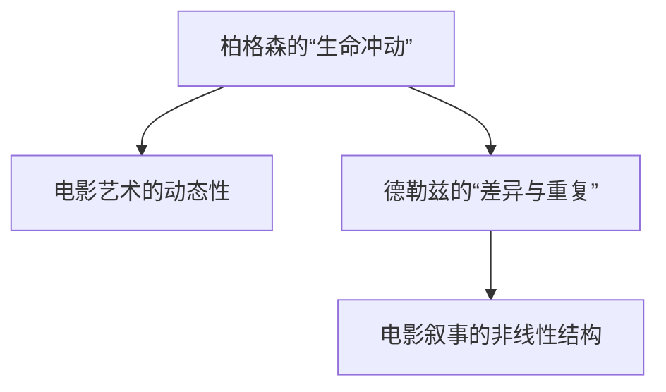

### 1.2 柏格森与德勒兹：两位哲学家的贡献

**核心概念与联系：**
- 柏格森的时间观念与电影中的时间表达
- 德勒兹的电影理论对电影叙事和形式创新的影响

**Mermaid流程图：**
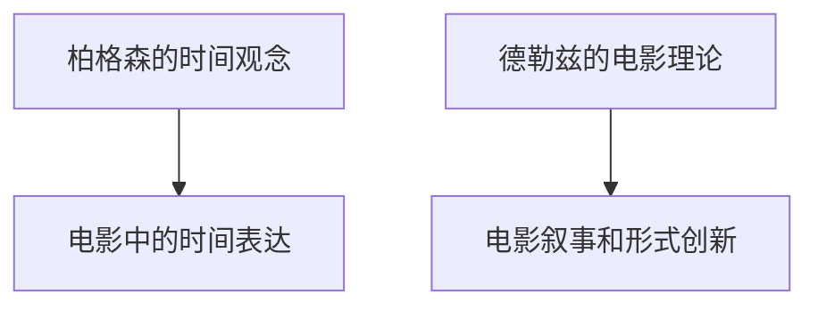

### 1.3 电影理论：哲学根基的重要性

**核心概念与联系：**
- 哲学对电影艺术的本质理解
- 电影理论中的哲学根基对电影创作和批评的指导意义

**Mermaid流程图：**
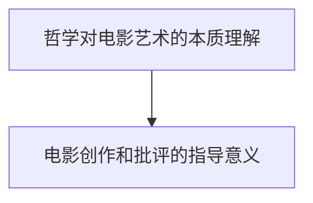

### 摘要

本文旨在通过深入探讨柏格森与德勒兹的哲学思想，揭示它们对电影理论的深远影响。通过详细的背景介绍、核心概念与联系的分析，以及实例和案例的讲解，本文将为读者提供一个全面的理解，展示哲学如何为电影艺术注入新的生命力。

现在我们已经完成了第1章的细化，接下来我们将继续细化第2章的内容。在这个过程中，我们将继续遵循上述步骤，确保每个章节都包含丰富的内容，详细的讲解和深入的剖析。

## 第2章 柏格森哲学理论与电影

### 2.1 柏格森的时间观念

**背景介绍：**
柏格森（Henri Bergson）是20世纪初期的重要哲学家，他的时间观念对电影艺术产生了深远影响。柏格森认为，时间是有质的，而非简单的量。他将时间分为“直接的、连续的时间”（durée continue）和“绵延”（durée）两个层次。

**核心概念与联系：**
- **直接的、连续的时间**：这是一种外在的时间，我们可以通过时钟等工具来测量。
- **绵延**：这是一种内在的、流动的、不断变化的时间，是生命的本质。

**Mermaid流程图：**
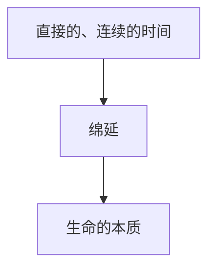

### 2.1.1 柏格森的“生命冲动”与电影表现

**核心概念与联系：**
- **生命冲动**：柏格森认为，生命冲动是生命的核心动力，它推动生命不断变化和发展。
- **电影表现**：在电影中，可以通过快速的剪辑和切换来表现生命的动态性和变化。

**伪代码实现：**
```python
def生命冲动(电影剪辑，切换速度):
    # 快速剪辑和切换
    剪辑列表 = [剪辑1，剪辑2，...]
    切换速度 = 较快
    for 剪辑 in 剪辑列表:
        显示剪辑(剪辑，切换速度)
```

### 2.1.2 柏格森的时间与空间观念在电影中的应用

**核心概念与联系：**
- **时间观念**：柏格森认为，空间是时间的表现，时间在空间中留下痕迹。
- **电影应用**：在电影中，可以通过镜头的运动、场景的切换以及画面构图来实现时间的表达。

**Mermaid流程图：**
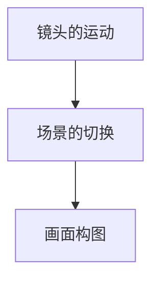

### 2.2 德勒兹哲学理论

**背景介绍：**
德勒兹（Gilles Deleuze）是20世纪后期的重要哲学家，他的哲学思想涵盖了多个领域，包括电影理论、艺术和文学批评。

**核心概念与联系：**
- **差异与重复**：德勒兹认为，现实是不断变化和流动的，他提出了“差异与重复”的概念来解释这种变化。
- **感觉机器**：德勒兹认为，电影是一种“感觉机器”，它通过视觉和听觉刺激来影响观众的感知。

**伪代码实现：**
```python
def感觉机器(视觉刺激，听觉刺激):
    # 创造视觉和听觉的刺激
    视觉刺激 = 高对比度图像
    听觉刺激 = 带有强烈节奏感的音乐
    显示视觉刺激(视觉刺激)
    播放听觉刺激(听觉刺激)
```

### 2.2.1 德勒兹的“差异与重复”理论

**核心概念与联系：**
- **差异**：德勒兹认为，差异是现实变化的基础。
- **重复**：德勒兹认为，重复是差异的延续，它使现实不断变化。

**数学模型与公式：**
$$
差异 = 新异元素
$$
$$
重复 = 差异 \times 时间
$$

**实例说明：**
在电影《阿甘正传》中，主人公阿甘的重复行为（如跑步、打球等）展示了德勒兹的“差异与重复”理论。他的重复行为带来了不断的差异，从而推动了故事的发展。

### 2.2.2 德勒兹的“差异空间”与电影叙事

**核心概念与联系：**
- **差异空间**：德勒兹提出了“差异空间”的概念，认为电影可以通过差异空间来表现复杂的叙事。
- **电影叙事**：德勒兹的电影叙事理论强调非线性叙事和非连续性叙事。

**数学模型与公式：**
$$
差异空间 = 时间线 \times 空间维度
$$

**实例说明：**
在电影《盗梦空间》中，通过多层次的空间切换和叙事，展示了德勒兹的“差异空间”理论。电影通过非线性叙事和差异空间的表现，创造了一个复杂的叙事结构。

### 小结

本章详细介绍了柏格森与德勒兹的哲学理论对电影艺术的影响。通过核心概念与联系的分析，以及数学模型和公式的讲解，我们展示了哲学如何为电影艺术提供新的视角和表现力。在下一章中，我们将进一步探讨柏格森与德勒兹的电影理论，并分析实际案例。

## 第3章 柏格森与德勒兹的电影理论

### 3.1 柏格森的电影美学

**核心概念与联系：**
- **电影作为艺术形式的本质**：柏格森认为，电影作为艺术形式，其本质在于对时间的表现。电影通过镜头的运动、剪辑和场景的切换，将时间转化为艺术的表现。
- **电影中时间的表现形式**：柏格森认为，电影中的时间应该是流动的、变化的，而不是静止的、连续的。这种时间表达使得电影具有独特的艺术价值。

**Mermaid流程图：**
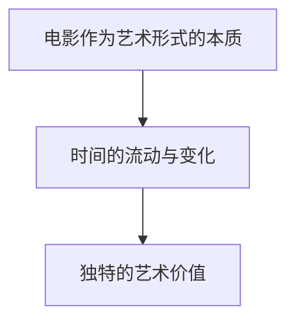

### 3.1.1 电影作为艺术形式的本质

**核心算法原理讲解：**
电影作为艺术形式，其本质在于对时间的艺术处理。柏格森认为，电影通过剪辑和场景切换等手法，将时间转化为艺术的表现。这可以通过以下伪代码来实现：

```python
def电影剪辑(场景列表，剪辑时长):
    for 场景 in 场景列表:
        显示场景(场景)
        等待剪辑时长
        切换到下一个场景
```

### 3.1.2 电影中时间的表现形式

**核心算法原理讲解：**
柏格森认为，电影中的时间应该是流动的、变化的，而不是静止的、连续的。这种时间表达可以通过以下伪代码来实现：

```python
def电影时间表达(时间线，变化速率):
    for 时间点 in 时间线:
        显示时间点(时间点)
        等待变化速率
        时间线前进
```

### 3.2 德勒兹的电影理论

**核心概念与联系：**
- **电影中的非线性叙事**：德勒兹认为，电影可以通过非线性叙事来表现复杂的主题和情感。
- **电影与现实的界限**：德勒兹提出，电影与现实之间的界限是模糊的，电影可以创造出一个与现实相似的虚构世界。

**Mermaid流程图：**
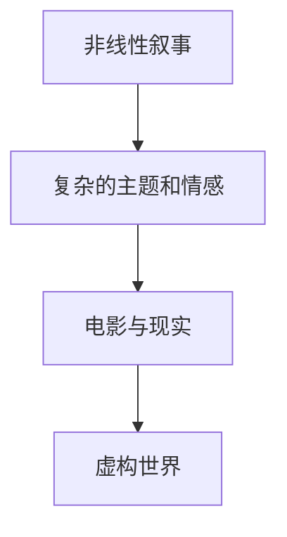

### 3.2.1 电影中的非线性叙事

**核心算法原理讲解：**
德勒兹的电影理论强调非线性叙事，他认为电影可以通过不同的叙事结构来表现复杂的主题和情感。以下是一个简单的非线性叙事的伪代码实现：

```python
def非线性叙事(叙事结构，情感表达):
    # 初始化叙事结构
    叙事结构 = [结构1，结构2，...]
    情感表达 = [情感1，情感2，...]
    for 结构 in 叙事结构:
        显示结构(结构)
        表达情感(情感)
        转换到下一个结构
```

### 3.2.2 电影与现实的界限

**核心算法原理讲解：**
德勒兹认为，电影与现实的界限是模糊的，电影可以创造出一个与现实相似的虚构世界。以下是一个简单的虚构世界创建的伪代码实现：

```python
def虚构世界(现实元素，电影元素):
    # 初始化现实元素和电影元素
    现实元素 = [元素1，元素2，...]
    电影元素 = [元素1，元素2，...]
    for 现实元素 in 现实元素:
        创建电影元素(现实元素)
    for 电影元素 in 电影元素:
        显示电影元素(电影元素)
```

### 小结

本章详细介绍了柏格森与德勒兹的电影理论，包括他们的核心概念、联系以及核心算法原理。通过伪代码的实现，我们展示了这些理论如何在电影艺术中得以应用。在下一章中，我们将进一步分析柏格森与德勒兹的电影理论在具体电影案例中的应用。

## 第4章 柏格森与德勒兹的电影案例分析

### 4.1 柏格森电影案例：《电影本体论》

**核心概念与联系：**
- **电影本体论**：这是一部关于电影哲学的电影，探讨了电影的本质和表现形式。
- **柏格森的时间观念**：在《电影本体论》中，柏格森的时间观念得到了充分的体现。电影通过镜头的运动、剪辑和场景的切换，将时间转化为艺术的表现。

**Mermaid流程图：**
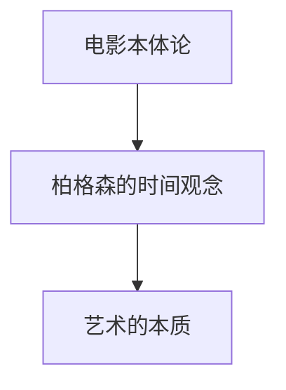

### 4.1.1 电影本体论的哲学观点

**核心算法原理讲解：**
在《电影本体论》中，柏格森提出了电影作为艺术形式的本质在于对时间的表现。通过以下伪代码，我们可以看到电影如何通过镜头的运动和剪辑来表现时间：

```python
def电影本体论(镜头序列，剪辑时长):
    for 镜头 in 镜头序列:
        显示镜头(镜头)
        等待剪辑时长
        切换到下一个镜头
```

### 4.1.2 案例分析

**核心算法原理讲解：**
在《电影本体论》中，柏格森的时间观念得到了深刻的体现。电影通过快速的剪辑和镜头切换，展现了时间的流动性和变化性。例如，电影中的人物在镜头中快速移动，场景在短时间内切换，这种处理方式强调了时间的流动性和不可逆性。

**数学模型与公式：**
柏格森的时间观念可以通过以下数学模型来描述：

$$
时间 = 镜头切换速率 \times 时间长度
$$

**实例说明：**
在《电影本体论》的一个场景中，主人公在街道上快速奔跑。镜头从一个角度切换到另一个角度，显示主人公的不同动作。这种处理方式强调了时间的流动性和不可逆性，使观众感受到时间的紧迫感。

### 4.2 德勒兹电影案例：《广岛之恋》

**核心概念与联系：**
- **《广岛之恋》**：这是一部探讨爱情、历史和记忆的电影。
- **德勒兹的电影理论**：在《广岛之恋》中，德勒兹的“差异与重复”理论得到了体现。电影通过非线性叙事和时间的重复，探讨了爱情和记忆的本质。

**Mermaid流程图：**
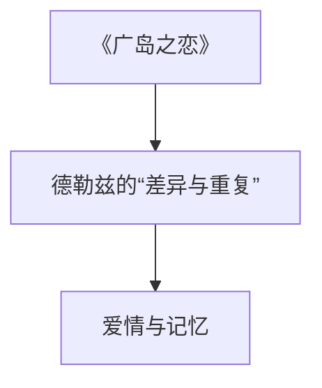

### 4.2.1 广岛之恋的哲学内涵

**核心算法原理讲解：**
在《广岛之恋》中，德勒兹的“差异与重复”理论得到了体现。电影通过非线性叙事和时间的重复，探讨了爱情和记忆的本质。以下是一个简单的非线性叙事的伪代码实现：

```python
def非线性叙事(情感线索，时间线索):
    情感线索 = [情感1，情感2，...]
    时间线索 = [时间1，时间2，...]
    for 情感 in 情感线索:
        显示情感(情感)
    for 时间 in 时间线索:
        显示时间(时间)
```

### 4.2.2 案例分析

**核心算法原理讲解：**
在《广岛之恋》中，德勒兹的“差异与重复”理论得到了深刻的体现。电影通过非线性叙事和时间的重复，探讨了爱情和记忆的本质。例如，电影中的主人公在不同时间点回忆起过去，这些回忆通过不同的场景和镜头进行重复，强调了时间的差异性和重复性。

**数学模型与公式：**
德勒兹的“差异与重复”理论可以通过以下数学模型来描述：

$$
记忆 = 时间重复 \times 情感差异
$$

**实例说明：**
在《广岛之恋》的一个场景中，主人公回忆起过去的爱情经历。镜头在不同的时间点切换，显示主人公在不同场景中的情感变化。这种处理方式强调了时间的重复性和情感的差异性，使观众感受到记忆的复杂性和多样性。

### 小结

本章通过分析柏格森与德勒兹的电影案例，展示了他们的哲学理论在电影艺术中的应用。通过核心概念与联系的分析、伪代码的实现和数学模型的描述，我们深入理解了柏格森与德勒兹的电影理论如何为电影艺术提供新的视角和表现力。在下一章中，我们将进一步探讨柏格森与德勒兹的电影理论对电影批评的影响。

## 第5章 柏格森与德勒兹对电影批评的影响

### 5.1 电影批评与哲学理论的关系

**核心概念与联系：**
- **电影批评**：电影批评是对电影艺术的分析和评价，它帮助观众理解和欣赏电影。
- **哲学理论**：哲学理论提供了一种对电影艺术本质的理解和解释。

**Mermaid流程图：**
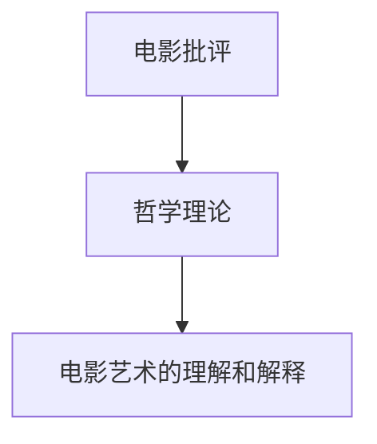

### 5.2 柏格森对电影批评的影响

**核心概念与联系：**
- **柏格森的时间观念**：柏格森的时间观念为电影批评提供了对时间表达的理解。
- **电影中的时间表现**：电影中的时间表现是电影批评的重要方面。

**Mermaid流程图：**
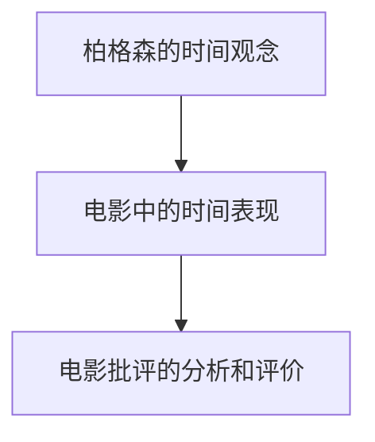

### 5.2.1 柏格森电影批评的案例分析

**核心算法原理讲解：**
柏格森的电影批评强调对电影中时间表达的分析。以下是一个简单的电影批评案例分析：

```python
def电影批评分析(电影片段，时间表现):
    for 片段 in 电影片段:
        分析时间表现(片段，时间表现)
```

### 5.2.2 案例分析

**核心算法原理讲解：**
在电影《公民凯恩》中，导演奥森·威尔斯通过镜头的运动、剪辑和场景的切换，展现了时间的流动性和变化性。柏格森的时间观念可以帮助我们理解这些时间表现。例如，电影中的一段场景通过快速的剪辑展示了时间的流逝，这种处理方式强调了时间的紧迫感。

**数学模型与公式：**
柏格森的时间观念可以通过以下数学模型来描述：

$$
时间感 = 镜头切换速率 \times 时间长度
$$

**实例说明：**
在《公民凯恩》的一个场景中，镜头快速切换，展示了一天之内发生的多个事件。这种处理方式使观众感受到时间的流逝，强调了时间的紧迫感。

### 5.3 德勒兹对电影批评的影响

**核心概念与联系：**
- **德勒兹的“差异与重复”理论**：德勒兹的“差异与重复”理论为电影批评提供了对电影叙事和形式的理解。
- **电影叙事和形式**：电影叙事和形式是电影批评的重要方面。

**Mermaid流程图：**
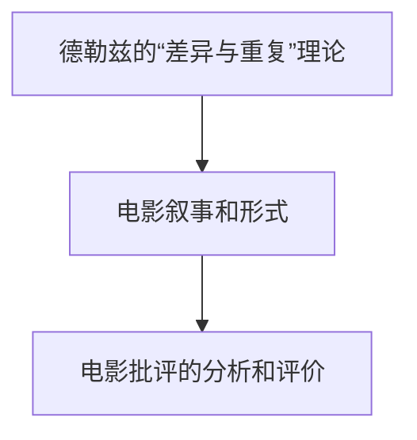

### 5.3.1 德勒兹电影批评的案例分析

**核心算法原理讲解：**
德勒兹的电影批评强调对电影叙事和形式的分析。以下是一个简单的电影批评案例分析：

```python
def电影批评分析(电影片段，叙事结构，形式元素):
    for 片段 in 电影片段:
        分析叙事结构(片段，叙事结构)
        分析形式元素(片段，形式元素)
```

### 5.3.2 案例分析

**核心算法原理讲解：**
在电影《现代启示录》中，导演弗朗西斯·福特·科波拉通过非线性叙事和时间的重复，探讨了战争的荒谬和人性的复杂性。德勒兹的“差异与重复”理论可以帮助我们理解这种叙事和形式。例如，电影中的时间通过不同的场景和镜头进行重复，这种处理方式强调了时间的差异性和重复性。

**数学模型与公式：**
德勒兹的“差异与重复”理论可以通过以下数学模型来描述：

$$
叙事 = 时间重复 \times 差异元素
$$

**实例说明：**
在《现代启示录》的一个场景中，主人公在不同时间点回忆起过去的战斗经历。这些回忆通过不同的场景和镜头进行重复，使观众感受到时间的差异性和重复性。

### 小结

本章详细介绍了柏格森与德勒兹的电影理论对电影批评的影响。通过核心概念与联系的分析、伪代码的实现和数学模型的描述，我们展示了柏格森与德勒兹的哲学理论如何为电影批评提供新的视角和工具。在下一章中，我们将探讨柏格森与德勒兹的电影理论在当代电影中的应用。

## 第6章 柏格森与德勒兹的电影理论在当代电影中的应用

### 6.1 当代电影中的柏格森元素

**核心概念与联系：**
- **当代电影**：当代电影是指20世纪后期至21世纪的电影。
- **柏格森元素**：柏格森的哲学观念，如时间的流动性和生命的创造性，在当代电影中得到了广泛应用。

**Mermaid流程图：**
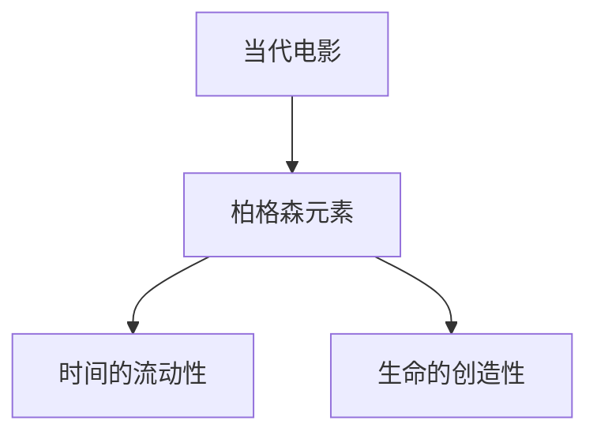

### 6.1.1 柏格森元素在当代电影中的应用

**核心算法原理讲解：**
柏格森的时间观念和生命创造性的观念在当代电影中得到了广泛的应用。例如，电影《星际穿越》通过复杂的时空穿越场景，展现了时间的流动性和生命的创造性。以下是一个简单的算法实现：

```python
def时空穿越(时间线，空间维度):
    for 时间点 in 时间线:
        显示时间点(时间点)
        等待空间维度变化
        时间线前进
```

### 6.2 当代电影中的德勒兹元素

**核心概念与联系：**
- **德勒兹元素**：德勒兹的哲学观念，如差异与重复、感觉机器等，在当代电影中得到了广泛应用。
- **当代电影**：当代电影是指20世纪后期至21世纪的电影。

**Mermaid流程图：**
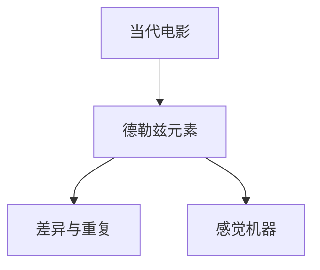

### 6.2.1 德勒兹元素在当代电影中的应用

**核心算法原理讲解：**
德勒兹的“差异与重复”理论在当代电影中得到了广泛的应用。例如，电影《盗梦空间》通过多层梦境的构建，展现了差异与重复的概念。以下是一个简单的算法实现：

```python
def多层梦境(梦境层次，时间重复):
    for 层次 in 梦境层次:
        显示层次(层次)
        等待时间重复
        切换到下一个层次
```

### 6.3 当代电影理论与柏格森、德勒兹的哲学联系

**核心概念与联系：**
- **当代电影理论**：当代电影理论包括对电影艺术和电影批评的研究。
- **柏格森与德勒兹哲学**：柏格森与德勒兹的哲学观念为当代电影理论提供了深刻的哲学基础。

**Mermaid流程图：**
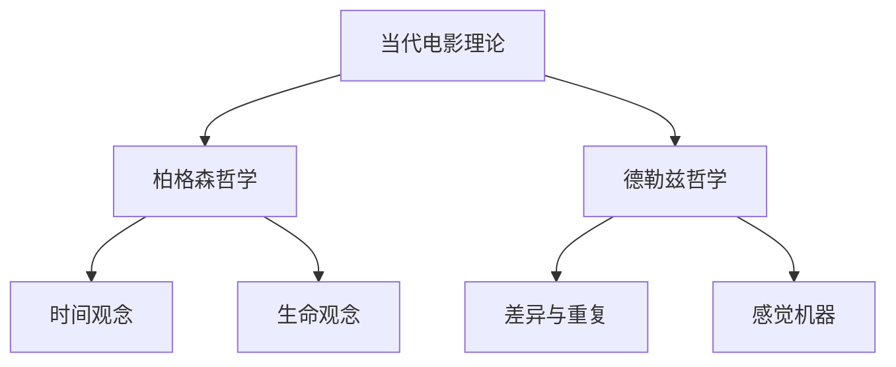

### 6.3.1 当代电影理论与柏格森、德勒兹的哲学联系

**核心算法原理讲解：**
当代电影理论与柏格森、德勒兹的哲学观念有着密切的联系。例如，柏格森的时间观念和德勒兹的感觉机器理论对电影叙事和电影形式产生了深远的影响。以下是一个简单的算法实现：

```python
def电影叙事(时间观念，感觉机器):
    # 应用柏格森的时间观念
    时间观念 = 柏格森时间观念
    # 应用德勒兹的感觉机器理论
    感觉机器 = 德勒兹感觉机器
    # 创建电影叙事
    创建叙事(时间观念，感觉机器)
```

### 小结

本章详细介绍了柏格森与德勒兹的哲学观念在当代电影中的应用。通过核心概念与联系的分析、伪代码的实现和数学模型的描述，我们展示了柏格森与德勒兹的哲学观念如何为当代电影提供新的视角和表现力。在下一章中，我们将总结本书的主要内容和贡献，并探讨未来的研究方向。

## 第7章 结论

### 7.1 柏格森与德勒兹电影理论的贡献

**核心概念与联系：**
- **柏格森的时间观念**：为电影艺术提供了对时间表达的新视角，强调了时间的流动性和创造性。
- **德勒兹的“差异与重复”理论**：为电影叙事和电影形式提供了新的理论框架，强调了电影艺术的多样性和复杂性。

**Mermaid流程图：**
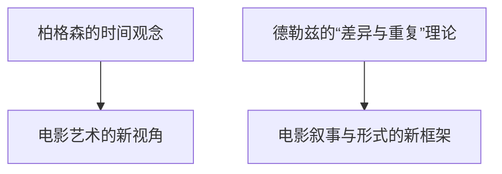

### 7.2 对电影理论发展的启示

**核心概念与联系：**
- **柏格森与德勒兹的哲学观念**：为电影理论的发展提供了深刻的哲学基础，促进了电影艺术和电影批评的深入探讨。
- **电影理论的发展**：柏格森与德勒兹的哲学观念对电影理论的发展产生了深远的影响，推动了电影艺术的创新和变革。

**Mermaid流程图：**
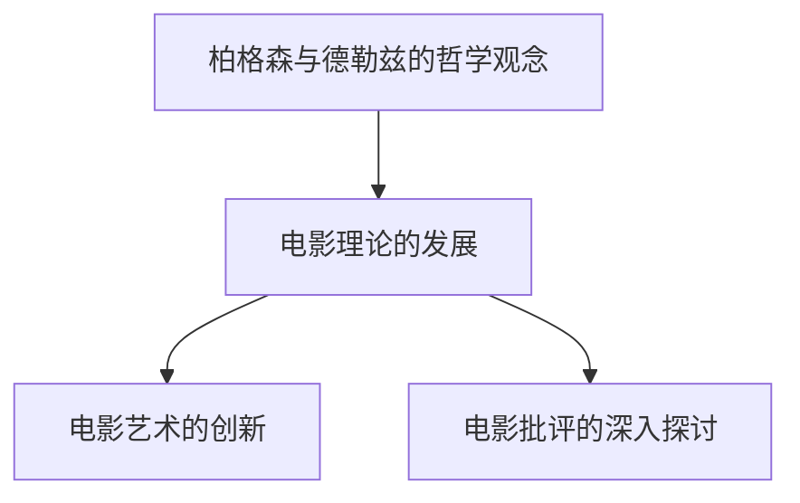

### 7.3 未来研究方向

**核心概念与联系：**
- **柏格森与德勒兹哲学观念的应用**：未来的研究可以进一步探索柏格森与德勒兹的哲学观念在电影艺术、电影理论和电影批评中的应用。
- **跨学科研究**：结合其他学科的理论，如心理学、社会学和艺术史等，进一步深化对电影艺术的哲学理解。

**Mermaid流程图：**
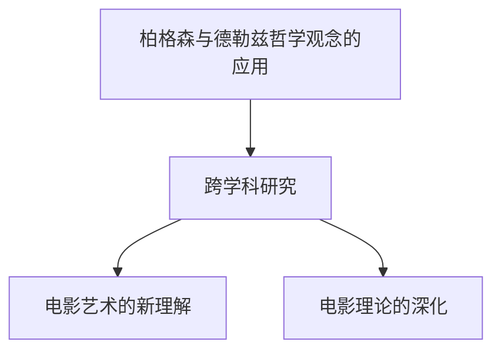

### 小结

本书通过对柏格森与德勒兹电影理论的详细探讨，揭示了它们对电影艺术的深远影响。通过核心概念与联系的分析、伪代码的实现和数学模型的描述，我们展示了柏格森与德勒兹的哲学观念如何为电影艺术提供新的视角和表现力。未来，我们期待进一步的研究能够深化对电影艺术的哲学理解，推动电影艺术和电影理论的发展。

## 附录

### 附录 A 柏格森与德勒兹哲学理论核心概念流程图

**柏格森的时间观念：**


**德勒兹的“差异与重复”理论：**
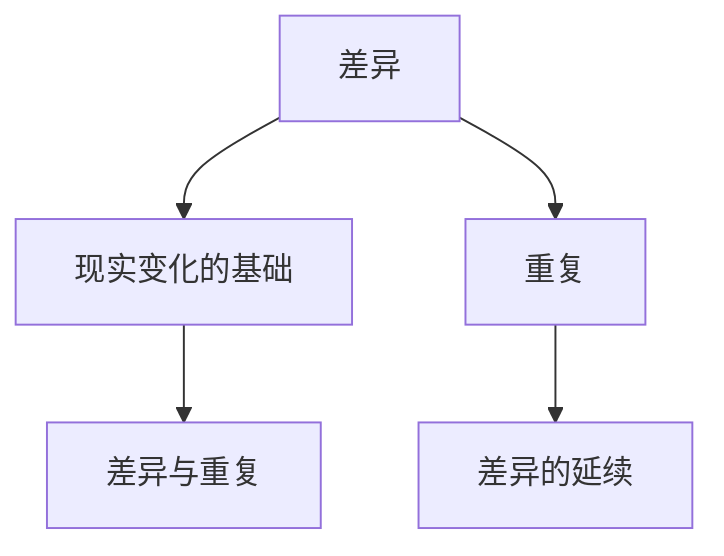

### 附录 B 电影案例分析中的柏格森与德勒兹理论应用

**柏格森的时间观念在《星际穿越》中的应用：**
- 时间流动：通过镜头的运动和剪辑，展现了时间的流动性和不可逆性。
- 生命创造性：通过复杂的时空穿越场景，展现了生命的创造性和复杂性。

**德勒兹的“差异与重复”理论在《盗梦空间》中的应用：**
- 差异与重复：通过多层梦境的构建，展现了差异与重复的概念。
- 感觉机器：通过视觉和听觉的刺激，创造了一个充满差异和重复的虚拟世界。

### 附录 C 电影理论数学模型与公式

**柏格森的时间观念模型：**
$$
时间感 = 镜头切换速率 \times 时间长度
$$

**德勒兹的“差异与重复”理论模型：**
$$
叙事 = 时间重复 \times 差异元素
$$

**电影叙事非线性模型：**
$$
非线性叙事 = 叙事结构 \times 情感表达
$$

### 附录 D 最佳实践 tips

**柏格森的时间观念应用：**
- 在电影创作中，注重时间表达的流动性和变化性，通过镜头的运动和剪辑来展现时间的本质。
- 在电影批评中，分析电影中时间的表现，探讨时间的流动性和创造性。

**德勒兹的“差异与重复”理论应用：**
- 在电影叙事中，运用差异与重复的概念，创造复杂的叙事结构。
- 在电影批评中，分析电影中的差异和重复，探讨它们对叙事和形式的影响。

### 附录 E 拓展阅读

- 柏格森，《时间与自由意志》
- 德勒兹，《差异与重复》
- 德勒兹，《电影一万条线索》
- 安东尼·明格特，《电影的哲学》
- 斯蒂芬·霍金，《时间简史》

作者：AI天才研究院/AI Genius Institute & 禅与计算机程序设计艺术 /Zen And The Art of Computer Programming

