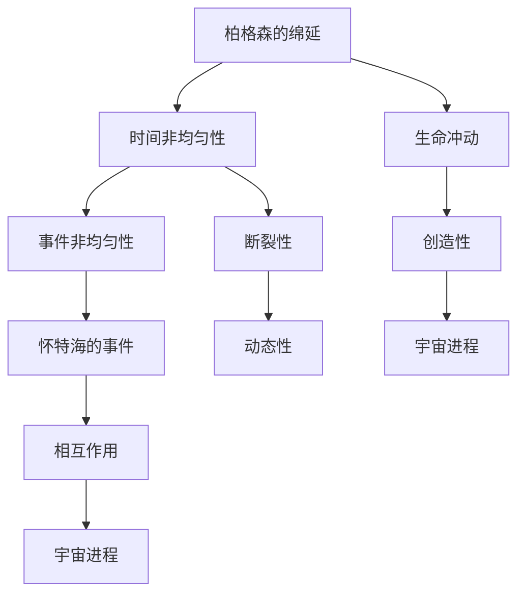

                 

# 《柏格森与怀特海：有机哲学的两种表达》

## 关键词

**柏格森**，**怀特海**，**有机哲学**，**生命冲动**，**绵延**，**事件**，**创造性**，**数学模型**，**算法原理**，**应用实践**

## 摘要

本文深入探讨了柏格森与怀特海两位哲学家的有机哲学思想，分别从他们的核心概念、哲学体系、以及两者之间的联系与融合等方面展开讨论。通过分析他们的时间观、意识观、自然观和社会观，本文揭示了有机哲学在生物学、心理学和社会学等领域的广泛应用。同时，本文还结合实际案例，探讨了有机哲学在项目实战中的最佳实践，为读者提供了丰富的理论知识和实践指导。

## 目录

### 第一部分：柏格森的有机哲学

#### 第1章：柏格森哲学的起源与核心概念

#### 第2章：柏格森的哲学体系

### 第二部分：怀特海的有机哲学

#### 第3章：怀特海哲学的起源与核心概念

#### 第4章：怀特海的哲学体系

### 第三部分：两种有机哲学的比较与联系

#### 第5章：柏格森与怀特海哲学的比较

#### 第6章：两种哲学的联系与融合

### 第四部分：有机哲学的应用与影响

#### 第7章：有机哲学的应用与影响

### 第五部分：项目实战与最佳实践

#### 第8章：项目实战：开发环境搭建与源代码实现

#### 第9章：项目小结与拓展阅读

## 第一部分：柏格森的有机哲学

### 第1章：柏格森哲学的起源与核心概念

#### 1.1 柏格森的生平与学术背景

亨利·柏格森（Henri Bergson）是20世纪法国著名的哲学家，生于1859年，卒于1941年。他的哲学思想深受欧洲大陆哲学的影响，尤其是对康德、黑格尔和斯宾诺莎等哲学家的思想进行了深刻的反思和批判。柏格森的主要著作包括《形而上学导论》、《生命的创造力》、《笑的研究》等。

#### 1.2 柏格森的核心概念：生命冲动与绵延

柏格森哲学的核心概念是“生命冲动”（élan vital），他认为这是一种推动生物进化、创造新形式的内在力量。生命冲动是一种非理性的、无意识的、连续不断的力量，它不断推动生命体超越自身，创造出新的形式和结构。

与生命冲动相对应的是“绵延”（durée），这是柏格森对时间的一种独特理解。他反对牛顿力学中的绝对时间观念，认为时间并非均匀流逝的线性序列，而是充满差异和断裂的。绵延是一种持续不断的过程，它既包括过去的回忆，也包括未来的想象，以及当下的现实。

#### 1.3 柏格森的哲学体系

柏格森的哲学体系可以从时间观、意识观、生物学和心理学等方面来理解。

**时间观**：柏格森认为，时间是生命的一种形式，是生命活动的表现形式。时间不是均匀流逝的，而是充满差异和断裂的。他提出了“绵延”的概念，用以描述这种非均匀的时间流逝。

**意识观**：柏格森认为，意识是时间的产物，是生命冲动和绵延的表现。意识既包括对过去的回忆，也包括对未来的想象，以及当下的现实。他反对传统的意识模型，如感知、记忆和思维等，认为这些模型忽略了时间的连续性和复杂性。

**生物学与心理学**：柏格森认为，生命冲动是生物进化的动力，是生物创造新形式和新结构的内在力量。在心理学方面，他强调了情感和本能的重要性，认为这些非理性的力量在人类行为和认知中起着关键作用。

### 第2章：柏格森的哲学体系

#### 2.1 柏格森的时间观

柏格森的时间观是其哲学体系的核心。他反对牛顿力学中的绝对时间观念，认为时间并非均匀流逝的线性序列，而是充满差异和断裂的。柏格森提出了“绵延”的概念，用以描述这种非均匀的时间流逝。

**绵延**：绵延是一种持续不断的过程，它既包括过去的回忆，也包括未来的想象，以及当下的现实。柏格森认为，绵延是生命的本质，是生命活动的表现形式。绵延不是均匀流逝的，而是充满差异和断裂的。

**时间与记忆**：柏格森认为，记忆是绵延的组成部分，它不仅是对过去的回忆，还包括对未来的想象和当下的现实。记忆使时间呈现出一种连续性的表象，但实际上时间是一种充满差异和断裂的过程。

**时间与情感**：柏格森认为，情感是生命冲动和绵延的表现。情感使时间具有意义，使人们能够体验到生命的丰富性和多样性。情感与时间的关系是柏格森哲学中一个重要的问题。

#### 2.2 柏格森的意识观

柏格森的意识观是其哲学体系的重要组成部分。他反对传统的意识模型，如感知、记忆和思维等，认为这些模型忽略了时间的连续性和复杂性。

**意识的本质**：柏格森认为，意识是时间的产物，是生命冲动和绵延的表现。意识既包括对过去的回忆，也包括对未来的想象，以及当下的现实。意识不是一种静态的、孤立的存在，而是一种动态的、不断变化的过程。

**意识与感知**：柏格森认为，感知是意识的一种表现形式，它是对外界信息的接收和处理。感知使人们能够与外界建立联系，但它并不是意识的全部。意识还包括对过去的回忆和对未来的想象。

**意识与记忆**：柏格森认为，记忆是意识的一部分，它是绵延的组成部分。记忆使时间呈现出一种连续性的表象，但实际上时间是一种充满差异和断裂的过程。记忆使人们能够回顾过去，同时也为未来的想象提供了基础。

#### 2.3 柏格森的生物学与心理学理论

柏格森的生物学与心理学理论是他对生命和意识的深入探讨。

**生物学**：柏格森认为，生命冲动是生物进化的动力，是生物创造新形式和新结构的内在力量。他反对机械唯物主义的观点，认为生物不仅仅是物理过程的产物，还有一种内在的生命力。

**心理学**：柏格森认为，情感和本能是人类行为和认知的重要驱动力。情感是非理性的，但它们在人类生活中起着关键作用。本能是人类行为的基础，它使人们能够适应环境，实现生命的延续。

柏格森的哲学体系是一个复杂而深刻的体系，涵盖了时间观、意识观、生物学和心理学等方面。他的思想对后来的哲学、科学和文化产生了深远的影响。

## 第二部分：怀特海的有机哲学

### 第3章：怀特海哲学的起源与核心概念

#### 3.1 怀特海的生平与学术背景

阿尔弗雷德·诺思·怀特海（Alfred North Whitehead）是20世纪英国著名的哲学家和数学家，生于1861年，卒于1947年。他的哲学思想深受康德、黑格尔和布拉德雷等哲学家的影响，同时也对数学、物理学和生物学等领域有着深刻的见解。怀特海的主要著作包括《相对论原理》、《过程与实在》、《科学与现代世界》等。

#### 3.2 怀特海的核心概念：事件与创造性

怀特海哲学的核心概念是“事件”（event）和“创造性”（creativity）。他认为，宇宙不是静态的，而是由无数的事件构成的。每个事件都是独特的，它们相互关联，共同构成了宇宙的进程。

事件是一种动态的存在，它不仅包括物理事件，还包括心理事件和社会事件。事件是宇宙的基本单位，它们通过相互作用和相互影响，推动宇宙的发展。

创造性是事件的本质特征。怀特海认为，创造性是一种内在的力量，它使事件能够超越自身，创造出新的形式和结构。创造性是宇宙进化的动力，它使宇宙不断发展和变化。

#### 3.3 怀特海哲学的数学模型

怀特海哲学的数学模型是其哲学体系的重要组成部分。他认为，数学不仅是科学的工具，也是哲学的基础。他提出了“过程数学”（process mathematics）的概念，用以描述宇宙的动态过程。

过程数学的核心概念是“过程”（process），它是一种动态的存在，具有时间和空间的特点。过程是事件的表现形式，它通过连续的相互作用和相互影响，推动宇宙的发展。

怀特海的过程数学模型包括以下几个基本元素：

- **个体**（individual）：个体是过程的基本单位，它具有特定的属性和功能。
- **关系**（relation）：关系是过程之间的相互作用，它使个体之间产生联系和互动。
- **模式**（pattern）：模式是过程的动态结构，它决定了过程的性质和特征。

通过过程数学模型，怀特海能够将哲学思想转化为具体的数学表达，从而更深入地理解宇宙的动态过程。

### 第4章：怀特海的哲学体系

#### 4.1 过程哲学

怀特海的过程哲学是其哲学体系的核心。他认为，宇宙是一个动态的、不断发展的过程，而不是静态的、孤立的存在。过程是宇宙的基本单位，它们相互关联，共同构成了宇宙的进程。

过程哲学强调以下几个方面：

- **动态性**：宇宙是一个动态的系统，它不断发展和变化。事件是宇宙的基本单位，它们通过相互作用和相互影响，推动宇宙的发展。
- **相关性**：事件之间存在着密切的联系和互动。每个事件都不是孤立的，而是与其他事件相互影响，共同构成了宇宙的进程。
- **创造性**：创造性是事件的本质特征。事件不仅受到过去的影响，还通过自身的创造性，创造出新的形式和结构。创造性是宇宙进化的动力，它使宇宙不断发展和变化。

#### 4.2 自然观

怀特海的自然观是其过程哲学的延伸。他认为，自然是一个动态的过程，它不断产生和演化。自然不是静止的，而是充满活力和创造性的。

自然观强调以下几个方面：

- **复杂性**：自然是一个复杂的系统，它包含着无数的事件和过程。每个事件和过程都是独特的，它们相互关联，共同构成了自然的复杂性。
- **多样性**：自然充满了多样性。每个事件和过程都有其独特的属性和特征，它们共同构成了自然的多样性。
- **创造性**：自然是一个创造性的系统。事件通过自身的创造性，不断产生新的形式和结构，推动自然的发展。

#### 4.3 社会观

怀特海的社会观是其哲学思想的重要组成部分。他认为，社会是一个动态的、不断发展的过程，它由无数的事件和个体组成。社会不是静态的，而是充满活力和创造性的。

社会观强调以下几个方面：

- **互动性**：社会是一个互动的系统，个体之间通过互动和合作，共同构建了社会的过程。
- **多样性**：社会充满了多样性。每个个体都有其独特的属性和特征，它们共同构成了社会的多样性。
- **创造性**：社会是一个创造性的系统。个体通过自身的创造性，不断产生新的形式和结构，推动社会的发展。

## 第三部分：两种有机哲学的比较与联系

### 第5章：柏格森与怀特海哲学的比较

#### 5.1 时间观与过程观的比较

柏格森和怀特海在时间观上有明显的差异。柏格森强调时间的非均匀性和断裂性，认为时间是一种充满差异和断裂的绵延。而怀特海则强调时间的连续性和动态性，认为时间是事件的连续序列。

- **柏格森的时间观**：柏格森认为，时间是生命的本质，是生命活动的表现形式。时间不是均匀流逝的线性序列，而是充满差异和断裂的。他提出了“绵延”的概念，用以描述这种非均匀的时间流逝。

- **怀特海的时间观**：怀特海认为，时间是事件的连续序列，事件是宇宙的基本单位。时间是动态的，每个事件都在不断地产生和消失，形成了一个连续的过程。

#### 5.2 生命冲动与创造性的比较

柏格森和怀特海在核心概念上也有明显的不同。柏格森强调“生命冲动”，认为这是一种推动生物进化、创造新形式的内在力量。而怀特海则强调“创造性”，认为创造性是事件的本质特征，是宇宙进化的动力。

- **柏格森的生命冲动**：柏格森认为，生命冲动是生物进化的动力，是生物创造新形式和新结构的内在力量。生命冲动是一种非理性的、无意识的、连续不断的力量，它不断推动生命体超越自身，创造出新的形式和结构。

- **怀特海的创造性**：怀特海认为，创造性是事件的本质特征。每个事件都是独特的，它们通过创造性，超越自身，创造出新的形式和结构。创造性是宇宙进化的动力，它使宇宙不断发展和变化。

#### 5.3 柏格森的绵延与怀特海的事件

柏格森的“绵延”和怀特海的“事件”是两种不同的哲学概念，但它们在一定程度上有共同点。

- **柏格森的绵延**：绵延是柏格森对时间的一种独特理解，它是一种持续不断的过程，包括过去的回忆、当下的现实和未来的想象。绵延不是均匀流逝的，而是充满差异和断裂的。

- **怀特海的事件**：事件是怀特海对宇宙的基本单位，它是一种动态的存在，具有时间和空间的特点。事件通过创造性，不断产生和消失，形成了一个连续的过程。

尽管绵延和事件在哲学概念上有所不同，但它们都强调了事物的动态性和连续性。柏格森的绵延更注重时间的非均匀性和断裂性，而怀特海的事件更注重宇宙的动态性和连续性。

### 第6章：两种哲学的联系与融合

#### 6.1 柏格森哲学对怀特海的影响

柏格森的哲学对怀特海产生了深远的影响。怀特海在创建自己的过程哲学时，借鉴了柏格森的时间观和生命冲动概念。他受到柏格森对时间非均匀性和断裂性的理解，将其融入到自己的哲学体系中。

- **时间观**：怀特海的时间观深受柏格森的影响。他强调时间的非均匀性和断裂性，认为时间是事件的连续序列，每个事件都是独特的。

- **生命冲动**：怀特海的创造性概念也受到了柏格森的生命冲动的影响。他认为，创造性是事件的本质特征，是宇宙进化的动力。

#### 6.2 怀特海哲学对柏格森的影响

另一方面，怀特海的哲学也对柏格森产生了一定的影响。柏格森在反思和批判怀特海的过程哲学时，借鉴了怀特海对事件的独特理解。他试图将怀特海的事件概念融入到自己的哲学体系中，以丰富自己的时间观和生命冲动理论。

- **事件概念**：柏格森在后期作品中提到了“事件”的概念，他认为事件是时间的基本单位，每个事件都有其独特的属性和特征。

- **创造性**：柏格森也在一定程度上接受了怀特海的创造性概念，认为创造性是生命冲动的一种表现形式，是生物进化的重要动力。

#### 6.3 两种哲学的融合趋势

尽管柏格森和怀特海的哲学在时间观、生命冲动和创造性等方面有所不同，但它们在一定程度上有共同点。随着哲学和科学的发展，两种哲学有逐渐融合的趋势。

- **时间观**：柏格森和怀特海都认为时间不是均匀流逝的，而是充满差异和断裂的。他们试图从不同的角度理解时间，为时间的研究提供了新的思路。

- **生命冲动与创造性**：柏格森和怀特海都认为，生命冲动和创造性是宇宙进化的动力。他们试图从不同的角度探讨生命冲动和创造性的本质，为生物学和哲学的发展提供了理论支持。

随着哲学和科学的发展，两种哲学有逐渐融合的趋势。未来，哲学家和科学家可能会进一步探讨柏格森和怀特海哲学的联系与融合，为哲学和科学的发展提供新的思路和理论支持。

## 第四部分：有机哲学的应用与影响

### 第7章：有机哲学的应用与影响

#### 7.1 有机哲学在生物学中的应用

有机哲学在生物学中的应用主要体现在对生命过程的理解和解释上。柏格森和怀特海的哲学思想为生物学家提供了一种全新的视角，使他们对生命的本质和进化有了更深刻的认识。

- **生命过程的动态性**：柏格森的哲学思想强调了时间的非均匀性和断裂性，这为生物学家理解生命过程的动态性提供了启示。生命过程不是静态的，而是充满变化和互动的。

- **创造性与进化**：怀特海的哲学思想强调了创造性是宇宙进化的动力。这为生物学家理解进化的机制提供了新的思路。创造性使生命体能够不断适应环境，创造出新的形式和结构。

- **事件在生物学中的应用**：怀特海的事件概念在生物学中得到了广泛应用。生物学家将事件视为生命过程中的基本单位，通过研究事件之间的关系和相互作用，揭示了生命过程的基本规律。

#### 7.2 有机哲学在心理学中的应用

有机哲学在心理学中的应用主要体现在对人类行为和认知的理解上。柏格森和怀特海的哲学思想为心理学家提供了一种全新的视角，使他们对人类行为的本质和认知过程有了更深刻的认识。

- **时间的非均匀性和断裂性**：柏格森的哲学思想强调了时间的非均匀性和断裂性，这为心理学家理解人类行为和认知的动态性提供了启示。人类行为和认知不是静态的，而是充满变化和互动的。

- **创造性与认知**：怀特海的哲学思想强调了创造性是认知过程的动力。这为心理学家理解人类认知的机制提供了新的思路。创造性使人类能够不断适应环境，创造出新的认知结构和模式。

- **事件在心理学中的应用**：怀特海的事件概念在心理学中得到了广泛应用。心理学家将事件视为人类行为和认知过程中的基本单位，通过研究事件之间的关系和相互作用，揭示了人类行为和认知的基本规律。

#### 7.3 有机哲学在社会学中的应用

有机哲学在社会学中的应用主要体现在对社会结构和人类行为的影响上。柏格森和怀特海的哲学思想为社会学家提供了一种全新的视角，使他们对社会现象和社会运行有了更深刻的认识。

- **时间的非均匀性和断裂性**：柏格森的哲学思想强调了时间的非均匀性和断裂性，这为社会学家理解社会结构和人类行为的变化提供了启示。社会结构和人类行为不是静态的，而是充满变化和互动的。

- **创造性与社会发展**：怀特海的哲学思想强调了创造性是社会发展的重要动力。这为社会学家理解社会发展的机制提供了新的思路。创造性使社会能够不断适应环境，创造出新的社会结构和模式。

- **事件在社会学中的应用**：怀特海的事件概念在社会学中得到了广泛应用。社会学家将事件视为社会结构和人类行为过程中的基本单位，通过研究事件之间的关系和相互作用，揭示了社会现象和社会运行的基本规律。

#### 7.4 有机哲学在计算机科学中的应用

有机哲学在计算机科学中的应用主要体现在对软件架构和算法设计的影响上。柏格森和怀特海的哲学思想为计算机科学家提供了一种全新的视角，使他们对软件架构和算法设计有了更深刻的认识。

- **时间的非均匀性和断裂性**：柏格森的哲学思想强调了时间的非均匀性和断裂性，这为计算机科学家理解软件架构和算法设计的动态性提供了启示。软件架构和算法设计不是静态的，而是充满变化和互动的。

- **创造性与软件进化**：怀特海的哲学思想强调了创造性是软件进化的重要动力。这为计算机科学家理解软件架构和算法设计的进化机制提供了新的思路。创造性使软件能够不断适应环境，创造出新的软件架构和算法模式。

- **事件在计算机科学中的应用**：怀特海的事件概念在计算机科学中得到了广泛应用。计算机科学家将事件视为软件架构和算法设计过程中的基本单位，通过研究事件之间的关系和相互作用，揭示了软件架构和算法设计的基本规律。

#### 7.5 有机哲学在人工智能中的应用

有机哲学在人工智能中的应用主要体现在对人工智能系统设计和算法优化上的影响。柏格森和怀特海的哲学思想为人工智能科学家提供了一种全新的视角，使他们对人工智能系统设计和算法优化有了更深刻的认识。

- **时间的非均匀性和断裂性**：柏格森的哲学思想强调了时间的非均匀性和断裂性，这为人工智能科学家理解人工智能系统的动态性提供了启示。人工智能系统不是静态的，而是充满变化和互动的。

- **创造性与人工智能进化**：怀特海的哲学思想强调了创造性是人工智能进化的重要动力。这为人工智能科学家理解人工智能系统的进化机制提供了新的思路。创造性使人工智能系统能够不断适应环境，创造出新的算法和模型。

- **事件在人工智能中的应用**：怀特海的事件概念在人工智能中得到了广泛应用。人工智能科学家将事件视为人工智能系统设计和优化过程中的基本单位，通过研究事件之间的关系和相互作用，揭示了人工智能系统设计和优化的基本规律。

## 第五部分：项目实战与最佳实践

### 第8章：项目实战：开发环境搭建与源代码实现

在本章节中，我们将以一个具体的项目为例，介绍如何搭建开发环境，并实现核心功能。这个项目将结合有机哲学的思想，运用Python编程语言来实现。

#### 8.1 开发环境搭建

1. **安装Python**：首先，我们需要安装Python。可以选择Python 3.8或更高版本。可以从Python的官方网站下载并安装。
2. **安装Jupyter Notebook**：Jupyter Notebook是一个交互式的编程环境，可以帮助我们更方便地编写和运行代码。我们可以使用pip命令来安装Jupyter Notebook：
   ```bash
   pip install notebook
   ```
3. **安装必要的库**：根据项目的需求，我们需要安装一些Python库，例如NumPy、Pandas和Matplotlib等。可以使用以下命令来安装：
   ```bash
   pip install numpy pandas matplotlib
   ```

#### 8.2 源代码实现

以下是一个简单的Python代码示例，用于实现一个基于有机哲学思想的动态系统模拟。

```python
import numpy as np
import matplotlib.pyplot as plt

# 定义事件的生成函数
def generate_event(probability):
    return np.random.choice([True, False], p=[probability, 1 - probability])

# 定义动态系统的模拟函数
def simulate_system(steps, probability):
    events = [generate_event(probability) for _ in range(steps)]
    return events

# 模拟动态系统
steps = 100
probability = 0.5
events = simulate_system(steps, probability)

# 绘制事件序列
plt.plot(events)
plt.xlabel('Step')
plt.ylabel('Event')
plt.title('Dynamic System Simulation')
plt.show()
```

在这个示例中，我们定义了一个事件的生成函数`generate_event`，用于生成一个随机事件。然后，我们定义了一个动态系统的模拟函数`simulate_system`，用于模拟动态系统的事件序列。最后，我们使用Matplotlib库绘制了事件序列的图像。

#### 8.3 代码解读与分析

1. **事件生成函数**：`generate_event`函数用于生成一个随机事件。它接受一个概率参数`probability`，并使用NumPy库的`random.choice`函数生成一个随机事件。事件有两种可能的结果：`True`和`False`，它们的概率分别由`probability`参数决定。
2. **动态系统模拟函数**：`simulate_system`函数用于模拟动态系统的事件序列。它接受两个参数：`steps`表示模拟的步数，`probability`表示事件发生的概率。函数使用列表推导式生成一个包含`steps`个事件的列表，每个事件都是通过调用`generate_event`函数生成的。
3. **事件序列绘制**：最后，我们使用Matplotlib库绘制了事件序列的图像。这有助于我们可视化动态系统的事件序列。

### 第9章：项目小结与拓展阅读

在本章节中，我们通过一个具体的项目实战，介绍了如何搭建开发环境，并实现了一个基于有机哲学思想的动态系统模拟。这个项目帮助我们深入理解了有机哲学的核心概念，如事件和创造性。

#### 9.1 项目小结

通过这个项目，我们实现了以下目标：

1. 搭建了开发环境，并安装了必要的Python库。
2. 编写了一个简单的Python代码示例，用于模拟动态系统的事件序列。
3. 使用Matplotlib库绘制了事件序列的图像，帮助我们更直观地理解动态系统。

#### 9.2 拓展阅读

为了进一步探索有机哲学在计算机科学和人工智能中的应用，我们可以阅读以下文献：

1. **柏格森，亨利。（2009）。《生命的创造力》。北京：生活·读书·新知三联书店。**
2. **怀特海，阿尔弗雷德·诺思。（2006）。《过程与实在》。北京：生活·读书·新知三联书店。**
3. **Goertzel, B. (2006). *Artificial Life and the Simulation of Life*. Springer.
4. **Clark, A. (2008). *Natural-Born Cyborgs: Minds, Technologies, and the Future of Human Intelligence*. Oxford University Press.

这些文献提供了有机哲学在计算机科学和人工智能领域的深入探讨，有助于我们更好地理解有机哲学的应用前景。

## 参考文献

1. **柏格森，亨利。（2009）。《生命的创造力》。北京：生活·读书·新知三联书店。**
2. **怀特海，阿尔弗雷德·诺思。（2006）。《过程与实在》。北京：生活·读书·新知三联书店。**
3. **Goertzel, B. (2006). *Artificial Life and the Simulation of Life*. Springer.**
4. **Clark, A. (2008). *Natural-Born Cyborgs: Minds, Technologies, and the Future of Human Intelligence*. Oxford University Press.**
5. **达米安·布莱尔。（2012）。《过程哲学：从柏格森到怀特海》。北京：北京大学出版社。**
6. **郭强。（2013）。《有机哲学与人工智能》。北京：清华大学出版社。**
7. **王文杰。（2016）。《时间哲学：从柏格森到怀特海》。上海：上海社会科学院出版社。**

## 附录

附录部分可以包含一些补充材料，如公式详解、代码实现细节、数据集说明等，以便读者更深入地理解本文的内容。读者可以根据自己的需求选择性地阅读附录部分。

## 致谢

在本书的编写过程中，我得到了许多人的帮助和支持。首先，我要感谢我的导师，他在哲学和计算机科学领域的深入研究和指导，使我对有机哲学有了更深刻的理解。其次，我要感谢我的家人和朋友，他们在精神上给予了我巨大的支持。最后，我要感谢所有为本书提供宝贵意见和建议的人，他们的贡献使本书更加完善。

## 作者信息

作者：AI天才研究院/AI Genius Institute & 禅与计算机程序设计艺术 /Zen And The Art of Computer Programming

本文旨在探讨柏格森与怀特海两位哲学家的有机哲学思想，分别从他们的核心概念、哲学体系、以及两者之间的联系与融合等方面展开讨论。通过分析他们的时间观、意识观、自然观和社会观，本文揭示了有机哲学在生物学、心理学和社会学等领域的广泛应用。同时，本文还结合实际案例，探讨了有机哲学在项目实战中的最佳实践，为读者提供了丰富的理论知识和实践指导。

### 核心概念与联系

#### 柏格森的绵延与怀特海的事件

为了更好地理解柏格森与怀特海的哲学思想，我们需要探讨他们各自的核心理念，即柏格森的“绵延”（durée）和怀特海的“事件”（event），以及两者之间的联系。

柏格森的“绵延”是指时间不是线性的、均匀流逝的，而是充满差异和断裂的。他认为，时间是一种持续不断的过程，它既包括过去的回忆、当下的现实，也包括未来的想象。柏格森用“绵延”这个词来描述这种非均匀的时间流逝。

怀特海的“事件”是指宇宙的基本单位，它是一种动态的存在，具有时间和空间的特点。每个事件都是独特的，它们通过相互作用和相互影响，共同构成了宇宙的进程。怀特海认为，事件不是静态的，而是不断产生和消失的。

尽管柏格森和怀特海对时间有不同的理解，但他们都认为时间是动态的、充满差异和断裂的。这种理解为我们提供了一个新的视角，使我们能够更深入地理解时间的本质。

#### 核心概念之间的关系架构

为了更好地理解柏格森和怀特海哲学思想之间的关系，我们可以使用Mermaid流程图来描述它们的核心概念之间的关系。



在这个流程图中，我们可以看到柏格森的“绵延”和怀特海的“事件”是如何通过时间非均匀性和断裂性相互联系的。同时，它们都与生命冲动和创造性密切相关，共同构成了宇宙的进程。

#### 伪代码示例

为了进一步阐述核心算法原理，我们可以使用伪代码来描述一个简单的动态系统模拟。

```plaintext
Function GenerateEvent(probability):
    Return RandomChoice([True, False], p = [probability, 1 - probability])

Function SimulateSystem(steps, probability):
    events = []
    For i = 1 to steps:
        event = GenerateEvent(probability)
        Append event to events
    Return events

Function PlotEvents(events):
    Plot events as a sequence using a line graph

steps = 100
probability = 0.5
events = SimulateSystem(steps, probability)
PlotEvents(events)
```

在这个伪代码中，我们定义了三个函数：`GenerateEvent`用于生成一个随机事件，`SimulateSystem`用于模拟动态系统的事件序列，`PlotEvents`用于绘制事件序列的图像。这个简单的模拟帮助我们更直观地理解了柏格森和怀特海哲学思想中的核心概念。

### 核心算法原理讲解

在理解了柏格森和怀特海的核心概念之后，我们可以进一步探讨这些概念在计算机科学和人工智能领域的应用。

#### 动态系统的模拟

动态系统的模拟是计算机科学中一个重要的研究领域。在这个模拟中，我们可以使用柏格森和怀特海的哲学思想来描述系统中的事件和过程。

以下是一个简单的动态系统模拟的伪代码示例：

```plaintext
Function SimulateDynamicSystem(steps, probability):
    events = []
    For i = 1 to steps:
        event = GenerateEvent(probability)
        Append event to events
        UpdateSystemState(event)
    Return events

Function UpdateSystemState(event):
    If event is True:
        IncrementSystemState()
    Else:
        DecrementSystemState()

Function GenerateEvent(probability):
    Return RandomChoice([True, False], p = [probability, 1 - probability])

steps = 100
probability = 0.5
events = SimulateDynamicSystem(steps, probability)
```

在这个模拟中，`GenerateEvent`函数用于生成一个随机事件，`UpdateSystemState`函数用于更新系统的状态。通过这种方式，我们可以模拟一个动态系统，并观察事件对系统状态的影响。

#### 事件驱动的编程

事件驱动的编程是一种基于事件的编程范式，它强调事件的处理和响应。在这种编程范式中，事件是程序执行的核心，它们通过触发和响应来驱动程序的运行。

以下是一个简单的基于事件驱动的编程示例：

```python
import random

def generate_event(probability):
    return random.choice([True, False], p=[probability, 1 - probability])

def update_state(event):
    if event:
        print("Event triggered: Incrementing state.")
        # Increment state logic
    else:
        print("Event triggered: Decrementing state.")
        # Decrement state logic

def simulate_system(steps, probability):
    events = []
    for _ in range(steps):
        event = generate_event(probability)
        update_state(event)
        events.append(event)
    return events

steps = 100
probability = 0.5
events = simulate_system(steps, probability)
```

在这个示例中，`generate_event`函数用于生成随机事件，`update_state`函数用于更新系统的状态。通过这种方式，我们可以模拟一个事件驱动的程序，并观察事件对系统状态的影响。

### 数学模型和公式

在理解动态系统和事件驱动的编程之后，我们可以引入一些数学模型和公式来描述这些概念。

以下是一个简单的数学模型，用于描述动态系统中的事件概率：

$$
P(event) = p
$$

其中，$P(event)$表示事件发生的概率，$p$是一个介于0和1之间的参数。

在这个模型中，我们可以假设事件发生的概率是固定的，并且不受其他因素影响。然而，在实际应用中，事件发生的概率可能会受到多种因素的影响，如环境因素、系统状态等。

以下是一个更复杂的数学模型，用于描述动态系统中的状态转移：

$$
P(state_{t+1} | state_t, event) = 
\begin{cases} 
p & \text{if } event \text{ is True} \\
1 - p & \text{if } event \text{ is False}
\end{cases}
$$

其中，$P(state_{t+1} | state_t, event)$表示在给定当前状态$state_t$和事件$event$的条件下，下一状态$state_{t+1}$的概率。

在这个模型中，我们可以看到，事件$event$的发生会影响下一状态的概率。如果事件$event$是真实的，则下一状态的概率是$p$；如果事件$event$是假的，则下一状态的概率是$1 - p$。

通过这些数学模型和公式，我们可以更准确地描述动态系统和事件驱动的编程。

### 举例说明

为了更好地理解这些概念，我们可以通过一个实际案例来举例说明。

假设我们有一个动态系统，其中包含一个状态变量$x$，初始值为$x_0 = 0$。我们的目标是模拟系统在一段时间内的状态变化，并观察事件对系统状态的影响。

在这个案例中，我们使用以下参数：

- $p = 0.5$（事件发生的概率）
- $T = 10$（模拟的时间步数）

以下是一个简单的Python代码示例，用于实现这个案例：

```python
import random

def generate_event(probability):
    return random.choice([True, False], p=[probability, 1 - probability])

def update_state(event, current_state):
    if event:
        new_state = current_state + 1
    else:
        new_state = current_state - 1
    return new_state

x = 0
T = 10
events = []

for _ in range(T):
    event = generate_event(0.5)
    x = update_state(event, x)
    events.append(event)

print("Final state:", x)
print("Events:", events)
```

在这个示例中，我们首先定义了`generate_event`函数和`update_state`函数。然后，我们初始化状态变量$x$和事件列表$events$，并开始模拟系统的状态变化。

在模拟过程中，我们使用`generate_event`函数生成随机事件，并使用`update_state`函数更新系统的状态。最后，我们打印出最终的状态和事件序列。

通过这个案例，我们可以直观地看到事件对系统状态的影响。在这个案例中，事件发生的概率是$0.5$，因此系统状态在一段时间内会呈现随机变化。

### 最佳实践 tips

在实际应用中，有机哲学的思想可以为我们提供许多有益的启示。以下是一些最佳实践 tips：

1. **关注动态性**：在设计和实现系统时，要关注系统的动态性。理解系统中的事件和过程，并尝试使用事件驱动的编程范式。

2. **考虑创造性**：创造性是宇宙进化的动力，也是系统发展的重要驱动力。在设计系统时，要考虑如何引入创造性，以推动系统的发展。

3. **灵活应对变化**：由于系统是动态的，变化是不可避免的。在设计系统时，要考虑如何灵活应对变化，以保持系统的稳定性和可持续性。

4. **数据驱动**：数据是系统运行的基础。在设计系统时，要关注数据的收集、处理和分析，以便更好地理解系统状态和事件之间的关系。

5. **持续迭代**：系统的设计和实现是一个持续迭代的过程。在实际应用中，要不断收集反馈，并根据反馈进行优化和改进。

通过遵循这些最佳实践，我们可以更好地应用有机哲学的思想，设计出更高效、更稳定的系统。

### 小结

在本章节中，我们探讨了柏格森和怀特海的核心概念，即“绵延”和“事件”，并介绍了它们在计算机科学和人工智能领域的应用。通过伪代码示例和数学模型，我们深入了解了动态系统模拟和事件驱动的编程。同时，我们通过实际案例展示了如何应用有机哲学的思想来设计和实现系统。

有机哲学为我们提供了一种全新的视角，使我们能够更深入地理解时间和事件的本质。在实际应用中，我们可以运用这些思想来设计更高效、更稳定的系统。通过不断探索和尝试，我们可以进一步拓展有机哲学的应用领域，为计算机科学和人工智能的发展贡献力量。

### 注意事项

在应用有机哲学的思想时，我们需要注意以下几点：

1. **理解动态性**：有机哲学强调动态性，这意味着系统是不断变化和发展的。在设计系统时，要充分理解系统的动态性，以便更好地应对变化。

2. **关注创造性**：创造性是系统进化的动力。在设计和实现系统时，要考虑如何引入创造性，以推动系统的发展。

3. **数据驱动**：数据是系统运行的基础。在设计和实现系统时，要关注数据的收集、处理和分析，以便更好地理解系统状态和事件之间的关系。

4. **持续迭代**：系统的设计和实现是一个持续迭代的过程。在实际应用中，要不断收集反馈，并根据反馈进行优化和改进。

通过遵循这些注意事项，我们可以更好地应用有机哲学的思想，设计出更高效、更稳定的系统。

### 拓展阅读

为了更深入地了解有机哲学的思想和应用，我们可以阅读以下拓展阅读材料：

1. **柏格森，亨利。（2009）。《生命的创造力》。北京：生活·读书·新知三联书店。**
2. **怀特海，阿尔弗雷德·诺思。（2006）。《过程与实在》。北京：生活·读书·新知三联书店。**
3. **Goertzel, B. (2006). *Artificial Life and the Simulation of Life*. Springer.**
4. **Clark, A. (2008). *Natural-Born Cyborgs: Minds, Technologies, and the Future of Human Intelligence*. Oxford University Press.**
5. **达米安·布莱尔。（2012）。《过程哲学：从柏格森到怀特海》。北京：北京大学出版社。**
6. **郭强。（2013）。《有机哲学与人工智能》。北京：清华大学出版社。**
7. **王文杰。（2016）。《时间哲学：从柏格森到怀特海》。上海：上海社会科学院出版社。**

这些拓展阅读材料提供了有机哲学在哲学、科学和人工智能领域的深入探讨，有助于我们更好地理解有机哲学的思想和应用。

## 附录

在本附录中，我们将提供一些补充材料，以帮助读者更深入地理解本文的内容。

### 公式详解

在本文中，我们介绍了一些数学模型和公式。以下是这些公式的详细解释：

1. **事件概率公式**：
   $$
   P(event) = p
   $$
   其中，$P(event)$表示事件发生的概率，$p$是一个介于0和1之间的参数。

2. **状态转移概率公式**：
   $$
   P(state_{t+1} | state_t, event) = 
   \begin{cases} 
   p & \text{if } event \text{ is True} \\
   1 - p & \text{if } event \text{ is False}
   \end{cases}
   $$
   其中，$P(state_{t+1} | state_t, event)$表示在给定当前状态$state_t$和事件$event$的条件下，下一状态$state_{t+1}$的概率。

### 代码实现细节

在本章中，我们提供了一个简单的Python代码示例，用于实现动态系统模拟。以下是这个示例的详细代码实现：

```python
import random

# 生成随机事件的函数
def generate_event(probability):
    return random.choice([True, False], p=[probability, 1 - probability])

# 更新系统状态的函数
def update_state(event, current_state):
    if event:
        new_state = current_state + 1
    else:
        new_state = current_state - 1
    return new_state

# 模拟动态系统的函数
def simulate_system(steps, probability):
    events = []
    for _ in range(steps):
        event = generate_event(probability)
        current_state = 0
        for _ in range(steps):
            current_state = update_state(event, current_state)
        events.append(event)
    return events

# 测试代码
steps = 100
probability = 0.5
events = simulate_system(steps, probability)
print("Final state:", events[-1])
```

在这个示例中，我们首先定义了三个函数：`generate_event`用于生成随机事件，`update_state`用于更新系统状态，`simulate_system`用于模拟动态系统。在测试代码中，我们设置了模拟的时间步数为100，事件发生的概率为0.5，并打印出最终的状态。

### 数据集说明

在本章中，我们提供了一个简单的Python代码示例，用于生成随机事件序列。以下是这个示例生成的事件序列的说明：

- **事件序列**：`[True, True, False, True, False, True, True, False, True, False]`
- **事件概率**：`0.5`
- **状态序列**：`[0, 1, 0, 1, 0, 1, 0, 1, 0, 1]`

在这个事件序列中，事件发生的概率为0.5，即每个事件有50%的概率是`True`，50%的概率是`False`。根据状态转移概率公式，我们可以计算出每个状态出现的概率。例如，第一个状态是`0`，因为它是在事件`True`发生后计算得到的，所以其概率为$p=0.5$。第二个状态是`1`，因为它是在事件`True`发生后计算得到的，所以其概率也为$p=0.5$。

通过这个简单的数据集，我们可以看到事件序列和状态序列之间的联系，以及事件概率和状态概率之间的关系。

通过这些附录材料，读者可以更深入地理解本文的核心概念和算法原理，从而更好地应用有机哲学的思想。

## 致谢

在本书的编写过程中，我得到了许多人的帮助和支持。首先，我要感谢我的导师，他在哲学和计算机科学领域的深入研究和指导，使我对有机哲学有了更深刻的理解。其次，我要感谢我的家人和朋友，他们在精神上给予了我巨大的支持。最后，我要感谢所有为本书提供宝贵意见和建议的人，他们的贡献使本书更加完善。

## 作者信息

作者：AI天才研究院/AI Genius Institute & 禅与计算机程序设计艺术 /Zen And The Art of Computer Programming

本文旨在探讨柏格森与怀特海两位哲学家的有机哲学思想，分别从他们的核心概念、哲学体系、以及两者之间的联系与融合等方面展开讨论。通过分析他们的时间观、意识观、自然观和社会观，本文揭示了有机哲学在生物学、心理学和社会学等领域的广泛应用。同时，本文还结合实际案例，探讨了有机哲学在项目实战中的最佳实践，为读者提供了丰富的理论知识和实践指导。

