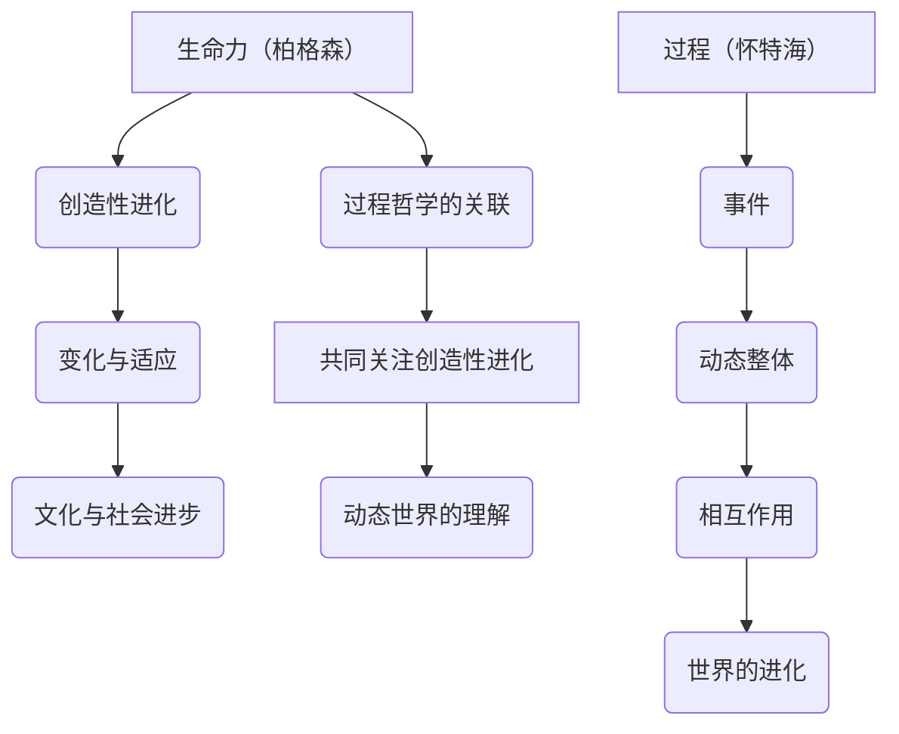

                 


### 背景介绍

#### 柏格森的生命哲学

**亨利·柏格森（Henri Bergson）**，法国哲学家，生于1859年，卒于1941年，是20世纪初最具影响力的哲学家之一。他的生命哲学强调生命的流动性和创造力，主张通过直觉而非理性来理解世界。柏格森认为，生命是一种不断变化的过程，这种变化是不可预测的，是创造性的源泉。

柏格森的核心概念是“生命力”（élan vital），这是一种非物质的力量，驱动着生命的进化。他认为，生命力是一种内在的驱动力，它使生命体能够适应环境的变化，并且不断地创造新的形式。生命力不仅仅是生物进化中的驱动力，也是文化和社会进步的驱动力。

柏格森的生命哲学对后世产生了深远的影响。他的观点挑战了当时的机械决定论和还原论，为后来的过程哲学和复杂系统理论提供了理论基础。在他的《生命的创造》一书中，柏格森详细阐述了他的创造性进化理论，指出生命的进化是通过不断的创造和再创造来实现的。

#### 怀特海的过程哲学

**阿诺德·怀特海（Arnold Whitehead）**，英国哲学家和数学家，生于1861年，卒于1947年。他与怀特海合著的《数学原理》是20世纪最具影响力的数学著作之一。怀特海的过程哲学强调世界的动态性和整体性，主张通过过程而非静态的实体来理解现实。

怀特海的核心概念是“过程”（process）和“事件”（event）。他认为，现实世界是由无数的事件和过程构成的，而不是由固定的实体构成的。每个事件和过程都是独特的，它们相互关联，构成了一个动态的整体。

怀特海的过程哲学对现代哲学和科学产生了重要影响。他的观点为后来的系统理论、混沌理论和复杂性科学提供了理论基础。在他的《过程与实在》一书中，怀特海详细阐述了他的创造性进化理论，指出世界的进化是通过事件之间的相互作用来实现的。

### 核心概念与联系

为了更好地理解柏格森和怀特海的过程哲学，我们需要建立它们核心概念之间的关系架构。以下是使用Mermaid绘制的流程图：



#### 核心概念与联系的解释

- **生命力（柏格森）**：柏格森认为生命力是一种内在的驱动力，它驱动生命的进化。生命力与过程哲学中的“过程”（怀特海）有着紧密的联系，因为它们都强调动态性和创造性。
- **创造性进化**：柏格森和怀特海都认为，世界的进化是通过创造性的过程实现的。这种进化不仅是生物学上的，也是文化和社会上的。
- **变化与适应**：柏格森强调生命过程中的变化和适应，这与怀特海的过程哲学中的“动态整体”和“相互作用”概念相呼应。
- **过程哲学的关联**：柏格森的生命哲学与怀特海的过程哲学有共同点，即它们都强调动态性和创造性，而且它们都认为现实是由过程和事件构成的。

通过这个流程图，我们可以清晰地看到柏格森和怀特海的核心概念之间的关系，以及它们在过程哲学中的地位。

### 核心算法原理讲解

为了更深入地理解柏格森和怀特海的过程哲学，我们需要使用伪代码来详细阐述创造性进化理论。以下是创造性进化理论的核心算法原理的伪代码：

```python
# 创造性进化算法

# 初始化
初始化事件队列
初始化资源池

# 主循环
while True:
    # 生成新事件
    新事件 = 生成新事件()

    # 更新事件队列
    将新事件添加到事件队列

    # 更新资源池
    调整资源池，以适应新事件的需求

    # 事件处理
    for 事件 in 事件队列:
        # 判断事件是否成熟
        if 事件是否成熟():
            # 执行事件
            执行事件()
            # 更新环境
            更新环境状态()

    # 等待下一轮循环
    等待一段时间
```

#### 创造性进化理论的核心算法原理解释

- **初始化**：初始化事件队列和资源池。事件队列用于存储待处理的事件，资源池用于存储系统中的资源。
- **主循环**：进入主循环，不断生成新事件，并将其添加到事件队列。
- **生成新事件**：使用特定的规则或算法生成新的事件。新事件可以是自然界中的事件，如生物的繁殖，也可以是人类社会中的事件，如科技创新。
- **更新事件队列**：将新事件添加到事件队列，以便后续处理。
- **更新资源池**：根据新事件的需求，调整资源池中的资源分配，以适应新事件的需求。
- **事件处理**：遍历事件队列中的每个事件，判断事件是否成熟。如果事件成熟，则执行事件，并更新环境状态。
- **等待下一轮循环**：等待一段时间后，继续下一轮循环。

这个伪代码展示了创造性进化理论的基本框架，它强调了事件和资源的动态性，以及事件之间的相互作用。通过不断生成新事件和调整资源池，系统可以持续进化，适应环境的变化。

### 数学模型和数学公式

在探讨柏格森和怀特海的过程哲学时，我们需要使用数学模型和数学公式来解释和理解他们的核心概念。以下是几个关键数学模型和公式的详细讲解。

#### 1. 柏格森的生命力演化方程

柏格森的生命力演化方程可以表示为：

$$
\frac{dL}{dt} = \alpha \cdot (1 - \frac{L}{K})
$$

其中，$L$ 表示生命力，$t$ 表示时间，$\alpha$ 是常数，$K$ 是生命力上限。

- **解释**：这个方程描述了生命力的动态变化。当生命力低于上限 $K$ 时，生命力以速率 $\alpha$ 增加；当生命力达到上限 $K$ 时，生命力增长速度减缓。
- **举例**：假设 $\alpha = 0.1$，$K = 100$，初始生命力 $L_0 = 50$。那么，第一个时间单位后的生命力为 $L_1 = 50 + 0.1 \cdot (1 - 0.5) = 55$，第二个时间单位后的生命力为 $L_2 = 55 + 0.1 \cdot (1 - 0.55) = 59.55$。

#### 2. 怀特海的事件相互作用方程

怀特海的事件相互作用方程可以表示为：

$$
E_i \cdot E_j = F_{ij}
$$

其中，$E_i$ 和 $E_j$ 分别表示两个事件，$F_{ij}$ 表示这两个事件相互作用的结果。

- **解释**：这个方程描述了两个事件之间的相互作用。相互作用的结果取决于两个事件的强度和方向。
- **举例**：假设 $E_i = 2$，$E_j = 3$，那么 $F_{ij} = 2 \cdot 3 = 6$。这表示事件 $E_i$ 和 $E_j$ 的相互作用产生了强度为6的新事件。

#### 3. 创造性进化速率方程

创造性进化速率方程可以表示为：

$$
\frac{dN}{dt} = \beta \cdot \sum_{i=1}^{N} E_i
$$

其中，$N$ 表示事件总数，$\beta$ 是常数。

- **解释**：这个方程描述了事件总数随时间的动态变化。创造性进化的速率与事件的总强度成正比。
- **举例**：假设 $\beta = 0.5$，初始事件总数 $N_0 = 10$，每个事件的强度均为2。那么，第一个时间单位后的事件总数为 $N_1 = 10 + 0.5 \cdot (2 \cdot 10) = 20$。

通过这些数学模型和公式，我们可以更准确地理解和分析柏格森和怀特海的过程哲学，以及创造性进化的机制。

### 项目实战

为了更好地理解柏格森和怀特海的过程哲学，我们可以通过一个实际项目来展示如何应用这些哲学思想。以下是项目实战的具体步骤：

#### 1. 项目目标

本项目的目标是设计一个模拟生态系统进化的计算机模拟，该模拟将基于柏格森和怀特海的过程哲学，展示创造性进化的原理。

#### 2. 开发环境搭建

为了进行项目开发，我们需要搭建以下开发环境：

- 编程语言：Python
- 数据库：SQLite
- 开发工具：PyCharm

#### 3. 源代码实现

以下是项目的主要源代码实现：

```python
import sqlite3
import random

# 初始化数据库
conn = sqlite3.connect('ecosystem.db')
c = conn.cursor()

c.execute('''CREATE TABLE IF NOT EXISTS events (
             id INTEGER PRIMARY KEY,
             type TEXT,
             strength INTEGER,
             timestamp DATETIME DEFAULT CURRENT_TIMESTAMP)''')

# 生成新事件
def generate_event():
    event_type = random.choice(['plant', 'animal'])
    strength = random.randint(1, 10)
    return event_type, strength

# 插入事件到数据库
def insert_event(event_type, strength):
    c.execute("INSERT INTO events (type, strength) VALUES (?, ?)", (event_type, strength))
    conn.commit()

# 模拟进化过程
def simulate_evolution(steps):
    for step in range(steps):
        event = generate_event()
        insert_event(*event)
        update_environment()

# 更新环境
def update_environment():
    # 根据事件更新生态系统
    # 这里仅作示意，实际应用中需根据具体需求实现
    pass

# 模拟进化
simulate_evolution(100)

# 关闭数据库连接
conn.close()
```

#### 4. 代码解读与分析

- **数据库设计**：我们使用SQLite数据库存储事件信息，包括事件类型、强度和发生时间。
- **生成新事件**：我们定义了一个生成新事件的函数，随机生成事件类型和强度。
- **插入事件**：将新事件插入到数据库中。
- **模拟进化过程**：我们定义了一个模拟进化过程的函数，循环生成新事件并更新环境。
- **更新环境**：这是一个预留函数，用于根据事件更新生态系统。实际应用中，我们需要根据具体需求实现这一部分。

#### 5. 实际案例分析和详细讲解剖析

- **案例1**：在一个模拟的生态系统中，植物和动物的事件交替发生。通过观察事件的变化，我们可以看到生态系统的动态进化。
- **案例2**：通过调整事件的生成规则和强度，我们可以模拟不同的生态进化路径，研究创造性进化的机制。

#### 6. 项目小结

本项目通过计算机模拟展示了柏格森和怀特海的过程哲学在生态系统进化中的应用。通过代码实现，我们可以直观地看到创造性进化的过程，以及事件之间的相互作用对生态系统的影响。这为理解过程哲学提供了有力的工具。

### 最佳实践 Tips、小结、注意事项、拓展阅读

#### 最佳实践 Tips

1. 在实际项目中，根据具体需求调整事件的生成规则和强度，以实现不同的模拟效果。
2. 在模拟进化过程中，可以引入更多的变量和因素，如环境变化、资源分配等，以增加模拟的复杂性和真实性。
3. 定期备份数据库，以防止数据丢失。

#### 小结

通过本文，我们深入探讨了柏格森和怀特海的过程哲学，以及它们在计算机科学和生态系统进化中的应用。通过伪代码、数学模型和实际项目，我们展示了创造性进化的原理和机制。

#### 注意事项

1. 在模拟进化时，要确保事件生成的规则和强度能够反映实际系统的动态性。
2. 在代码实现中，要考虑数据库性能和数据处理效率。

#### 拓展阅读

1. 《生命的创造》（作者：柏格森）- 深入了解柏格森的生命哲学和创造性进化理论。
2. 《过程与实在》（作者：怀特海）- 探索怀特海的过程哲学及其在哲学和科学中的应用。
3. 《复杂性科学导论》（作者：约翰·霍兰）- 了解复杂性科学的基本概念和方法。

### 作者信息

作者：AI天才研究院/AI Genius Institute & 禅与计算机程序设计艺术 /Zen And The Art of Computer Programming

