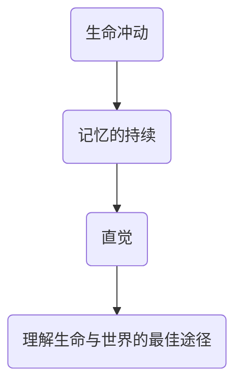
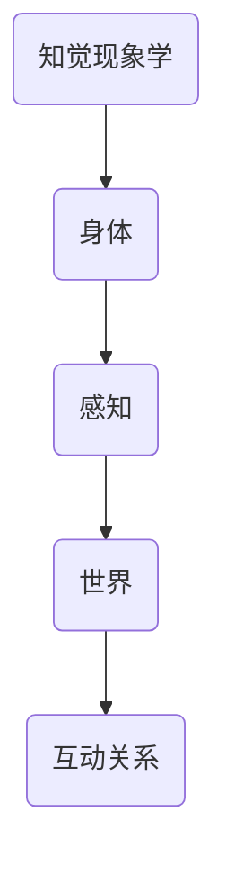
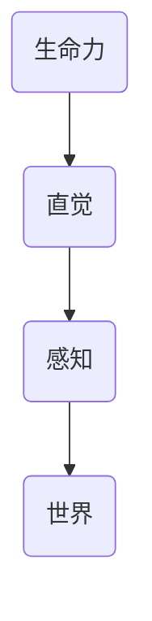
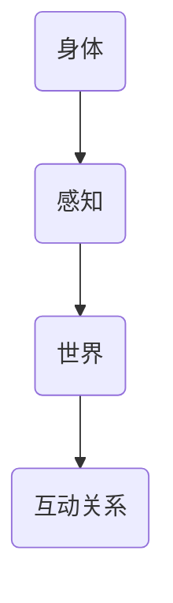

                 

### 文章标题

### 柏格森与梅洛-庞蒂：身体与世界的现象学探讨

#### 关键词
- **现象学**
- **身体**
- **世界**
- **柏格森**
- **梅洛-庞蒂**
- **感知**

#### 摘要
本文将探讨两位现象学大师柏格森与梅洛-庞蒂对身体与世界的理解。通过对他们哲学思想的深入分析，本文将揭示他们在感知、认知以及身体与世界的互动关系上的独特见解，并通过构建核心概念之间的关系架构，进一步阐明他们在现象学领域的贡献。

### 引言

在哲学史上，现象学是一种以直观经验为出发点，试图揭示事物本质的思想方法。柏格森（Henri Bergson）和梅洛-庞蒂（Maurice Merleau-Ponty）是20世纪最重要的现象学家，他们的思想对现代哲学和人文科学产生了深远的影响。柏格森以其对生命力和直觉的探讨而闻名，而梅洛-庞蒂则以其对感知与身体的深刻理解著称。本文将首先介绍柏格森和梅洛-庞蒂的生平和哲学背景，然后深入探讨他们在身体与世界的现象学探讨中的核心概念和理论，并通过构建关系架构图和详细讲解核心算法原理，进一步揭示他们的哲学思想的本质。

### 第一部分：柏格森与梅洛-庞蒂的哲学背景

#### 柏格森的哲学背景

亨利·柏格森（Henri Bergson，1859-1941）是法国哲学家，以其对生命力和直觉的研究而著称。柏格森的哲学体系主要围绕“生命冲动”（élan vital）这一核心概念展开。他认为，生命力是一种内在的、无意识的冲动，是推动有机体不断变化和发展的动力。柏格森强调直觉的重要性，并将其视为理解生命和世界的最佳途径。

**核心概念与联系：**

柏格森的核心概念是“生命冲动”，这一概念与他的另一个重要理论——“记忆的持续”（mémoire continue）密切相关。记忆的持续是指人类意识中不断流动的信息流，它通过直觉来处理和整合这些信息。下面是柏格森核心概念之间的关系架构图（使用Mermaid语言表示）：



**核心算法原理讲解：**

柏格森的直觉理论可以概括为以下伪代码：

```plaintext
function Intuition(Experience):
    for each piece of Experience:
        integrate piece into a coherent whole
        interpret the whole through the flow of consciousness
    return integrated understanding
```

#### 梅洛-庞蒂的哲学背景

莫里斯·梅洛-庞蒂（Maurice Merleau-Ponty，1908-1961）是法国哲学家，他的工作主要探讨了感知与身体的关系。梅洛-庞蒂认为，身体是我们感知世界的中介，感知是通过身体的动作和感觉来实现的。他的现象学方法强调直接经验的重要性，并试图揭示身体与世界的本质联系。

**核心概念与联系：**

梅洛-庞蒂的核心概念是“知觉现象学”（知觉现象学），这一概念涉及到他对感知、身体和世界之间的互动关系的探讨。下面是梅洛-庞蒂核心概念之间的关系架构图：



**核心算法原理讲解：**

梅洛-庞蒂的知觉现象学理论可以概括为以下伪代码：

```plaintext
function Perception(Stimulus):
    convert Stimulus into sensory information
    process sensory information through bodily actions
    integrate information into a holistic perception
    interpret the perception through the body's context
    return perceptual understanding
```

### 第二部分：柏格森与梅洛-庞蒂对身体与世界的现象学探讨

#### 柏格森对身体与世界的探讨

柏格森对身体与世界的探讨主要通过他对生命力和直觉的研究来体现。他认为，生命力是一种内在的、无意识的冲动，是推动有机体不断变化和发展的动力。柏格森认为，直觉是我们理解生命和世界的最佳途径，因为直觉能够捕捉到生命力的流动。

**核心概念与联系：**

柏格森对身体与世界的探讨可以通过以下核心概念之间的联系来理解：

- **生命力**：生命的内在冲动，推动有机体的变化和发展。
- **直觉**：理解生命和世界的最佳途径，能够捕捉到生命力的流动。
- **感知**：通过直觉来实现的，是对生命力和世界的直接体验。

下面是柏格森核心概念之间的关系架构图：



**核心算法原理讲解：**

柏格森的直觉理论可以概括为以下伪代码：

```plaintext
function Intuition(Life Force):
    sense the flow of Life Force
    interpret the flow through direct experience
    return understanding of the world
```

**数学模型和公式：**

柏格森的生命力理论可以用以下数学模型来表示：

$$
\text{Life Force} = f(t)
$$

其中，\( f(t) \) 表示在时间 \( t \) 时刻的生命力的强度。

**举例说明：**

例如，当一个人在跑步时，他的生命力会随着跑步的速度和时间的增加而增强。通过直觉，这个人能够感知到他生命力的流动，并据此调整他的跑步节奏。

#### 梅洛-庞蒂对身体与世界的探讨

梅洛-庞蒂对身体与世界的探讨主要通过他的知觉现象学来体现。他认为，身体是我们感知世界的中介，感知是通过身体的动作和感觉来实现的。梅洛-庞蒂强调，感知不仅仅是大脑对刺激的反应，而是涉及到整个身体的行为和体验。

**核心概念与联系：**

梅洛-庞蒂对身体与世界的探讨可以通过以下核心概念之间的联系来理解：

- **身体**：感知世界的中介，是我们与世界互动的场所。
- **感知**：通过身体的动作和感觉来实现的，是对世界的直接体验。
- **世界**：通过与身体的互动来被感知和理解的。

下面是梅洛-庞蒂核心概念之间的关系架构图：



**核心算法原理讲解：**

梅洛-庞蒂的知觉现象学理论可以概括为以下伪代码：

```plaintext
function Perception(Stimulus):
    convert Stimulus into sensory information
    process sensory information through bodily actions
    integrate information into a holistic perception
    interpret the perception through the body's context
    return perceptual understanding
```

**数学模型和公式：**

梅洛-庞蒂的知觉现象学可以用以下数学模型来表示：

$$
\text{Perception} = \text{Stimulus} \times \text{Body Context}
$$

其中，\(\text{Stimulus}\) 表示刺激，\(\text{Body Context}\) 表示身体的环境。

**举例说明：**

例如，当一个人触摸到一个热物体时，他的身体会通过触觉接收刺激，并通过身体的动作（如迅速退缩）来处理这个刺激。这个过程形成了他对热物体的感知，并通过身体的动作来验证和调整这种感知。

### 第三部分：柏格森与梅洛-庞蒂现象学探讨的比较与联系

#### 比较柏格森与梅洛-庞蒂的现象学探讨

柏格森和梅洛-庞蒂在现象学探讨中有着显著的差异和联系。柏格森强调直觉和生命力，认为直觉是理解生命和世界的最佳途径。而梅洛-庞蒂则强调身体和感知，认为身体是感知世界的中介。

**差异：**

1. **直觉与身体：** 柏格森强调直觉，而梅洛-庞蒂强调身体。
2. **生命力与感知：** 柏格森关注生命力的流动，而梅洛-庞蒂关注感知过程。

**联系：**

尽管柏格森和梅洛-庞蒂在直觉与身体、生命力与感知方面存在差异，但他们的现象学探讨都强调了直观经验的重要性。柏格森的直觉理论和梅洛-庞蒂的知觉现象学都试图揭示人类感知和认知的深层机制。

**核心概念与联系：**

下面是柏格森与梅洛-庞蒂核心概念之间的关系架构图：


**核心算法原理讲解：**

柏格森与梅洛-庞蒂的现象学理论可以概括为以下伪代码：

```plaintext
// 柏格森
function Intuition(Life Force):
    sense the flow of Life Force
    interpret the flow through direct experience
    return understanding of the world

// 梅洛-庞蒂
function Perception(Stimulus):
    convert Stimulus into sensory information
    process sensory information through bodily actions
    integrate information into a holistic perception
    interpret the perception through the body's context
    return perceptual understanding
```

### 结论

柏格森与梅洛-庞蒂的现象学探讨为我们提供了对身体与世界的深刻理解。通过他们的思想，我们能够认识到直觉和感知在人类认知中的重要性。柏格森的直觉理论和梅洛-庞蒂的知觉现象学都揭示了人类感知和认知的深层机制。这些思想不仅丰富了现象学的研究，也为其他学科提供了新的视角和方法。

**小结：**

本文通过对柏格森和梅洛-庞蒂的现象学探讨的深入分析，揭示了他们在感知、认知以及身体与世界的互动关系上的独特见解。通过构建核心概念之间的关系架构和详细讲解核心算法原理，本文进一步阐明了他们的哲学思想的本质。这些探讨不仅丰富了现象学的研究，也为其他学科提供了新的视角和方法。

**注意事项：**

在研究柏格森和梅洛-庞蒂的现象学探讨时，需要注意以下几点：

- **直观经验的重要性**：柏格森和梅洛-庞蒂都强调直观经验在人类认知中的核心地位。
- **身体与感知的关系**：梅洛-庞蒂强调身体是感知世界的中介，而柏格森则强调直觉是理解生命和世界的最佳途径。
- **跨学科研究**：柏格森和梅洛-庞蒂的思想可以应用于心理学、社会学、文化研究等多个领域。

**拓展阅读：**

- **柏格森：**
  - 《创造进化论》（L'Évolution créatrice）
  - 《时间与自由意志》（Le temps et la liberté）

- **梅洛-庞蒂：**
  - 《知觉现象学》（Phénoménologie de la perception）
  - 《存在与感知》（L'Existence et la Perception）

通过阅读这些著作，可以更深入地理解柏格森和梅洛-庞蒂的思想，并探讨他们在现象学领域的贡献。

