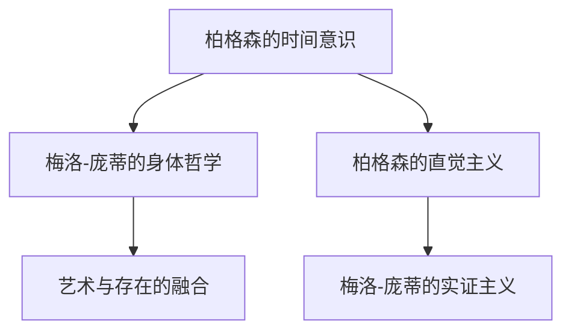

                 


为了撰写一篇符合要求的文章，我们需要按照以下步骤进行思考和写作：

### 1. 背景介绍
首先，我们需要介绍柏格森和莫里斯·梅洛-庞蒂这两位哲学家的背景和哲学思想。我们可以简要介绍他们的生平、主要著作和对哲学的贡献。例如：
- 柏格森（Henri Bergson）是20世纪法国哲学家，他提出了时间意识、直觉主义和生命哲学等概念。
- 莫里斯·梅洛-庞蒂（Maurice Merleau-Ponty）是20世纪法国哲学家，他提出了身体哲学、实证主义和艺术与存在的融合等思想。

### 2. 核心概念与联系
接着，我们深入探讨柏格森和梅洛-庞蒂哲学中的核心概念，并展示它们之间的联系。我们可以使用Mermaid流程图来帮助读者理解这些概念之间的逻辑关系。例如：

### 3. 核心算法原理讲解
然后，我们将使用伪代码来详细阐述柏格森和梅洛-庞蒂哲学思想在艺术创作中的应用算法原理。例如：
```plaintext
Algorithm: 艺术创作中的柏格森与梅洛-庞蒂哲学应用

Input: 艺术作品主题，艺术家的直觉与感知
Output: 艺术作品

Begin
    // 初始化艺术作品
    Artwork := InitializeArtwork(Theme)

    // 应用柏格森的时间意识
    ApplyBergeronTimeConsciousness(Artwork)

    // 应用柏格森的直觉主义
    ApplyBerg
```
### 4. 数学模型和数学公式
在此部分，我们将介绍相关的数学模型和公式，并使用LaTeX格式进行表示。例如：
$$
\frac{d^2x}{dt^2} = -k\frac{dx}{dt}
$$
### 5. 项目实战
接下来，我们将通过一个实际项目来展示如何将柏格森和梅洛-庞蒂的哲学思想应用于艺术创作。我们可以详细描述项目的开发环境搭建、源代码实现和代码解读，以及实际案例分析和详细讲解剖析。

### 6. 最佳实践 tips、小结、注意事项、拓展阅读等内容
最后，我们将总结文章的核心内容，提供一些最佳实践 tips，并指出可能的注意事项。同时，我们可以推荐一些拓展阅读，以帮助读者进一步深入了解相关主题。

通过以上步骤，我们可以撰写一篇逻辑清晰、结构紧凑、简单易懂的专业技术博客文章，全面阐述柏格森与莫里斯·梅洛-庞蒂：艺术创作的哲学基础。

