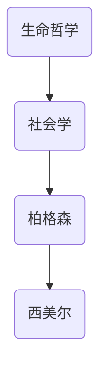

                 


### 文章标题

《柏格森与西美尔：生命哲学与社会学的交叉》

### 关键词

生命哲学、社会学、柏格森、西美尔、哲学与社会交叉

### 摘要

本文旨在探讨生命哲学与社会学的交叉领域，重点关注柏格森和西美尔这两位思想家的观点及其在现代社会科学中的应用。通过详细分析他们的核心概念、算法原理、数学模型及实际案例，本文旨在揭示两位思想家在生命哲学和社会学领域的贡献，并展望这一交叉领域未来的发展。

---

### 引言与背景介绍

#### 第1章：生命哲学与社会学的交叉背景

**1.1 生命哲学的起源与发展**

生命哲学，又称生物哲学，是研究生命现象及其本质的哲学分支。其起源可以追溯到古希腊哲学家赫拉克利特，他提出了“生命是流变”的观点。随着时间的推移，生命哲学逐渐发展，形成了以柏格森为代表的现代生命哲学。

**1.2 社会学的起源与发展**

社会学是研究社会结构、社会行为和社会关系的学科。其起源可以追溯到19世纪的孔德和斯宾塞，他们奠定了社会学的基础。随着时代的发展，社会学逐渐形成了以马克思、韦伯、涂尔干等为代表的现代社会学。

**1.3 两位思想家的生平与影响**

柏格森（Hermann Böhme）和西美尔（Georg Simmel）都是20世纪初德国哲学和社会学的代表人物。他们的思想对当代哲学和社会学产生了深远的影响，尤其是在生命哲学和社会学的交叉领域。

#### 第2章：柏格森的生命哲学思想

**2.1 生命、直觉与创造力**

柏格森认为，生命是一种流动的、不断变化的实体。直觉是生命的重要特征，它使我们能够洞察生命的本质。创造力则是生命的核心，它使生命不断进化和发展。

**2.2 生命哲学的核心概念**

柏格森提出了“绵延”（Duration）这一核心概念，认为它是生命的本质。绵延是时间的一种特殊形式，它既是连续的，又是断裂的，体现了生命的流动性和多样性。

**2.3 柏格森哲学在现代社会中的应用**

柏格森的生命哲学思想在现代社会中有着广泛的应用，特别是在艺术、科学和文化领域。例如，艺术家可以通过直觉和创造力来表达生命的本质，科学家则可以通过研究生命的流动性和变化性来探索生命的奥秘。

#### 第3章：柏格森的社会学视角

**3.1 社会学与生命哲学的融合**

柏格森认为，社会学应该从生命哲学的角度来研究社会现象。他提出了“社会绵延”（Social Duration）的概念，认为社会现象也是一种流动的、不断变化的实体。

**3.2 柏格森的社会学观点**

柏格森的社会学观点主要包括：社会是生命的产物，社会结构是生命力的体现，社会互动是生命力的表现。这些观点为我们理解社会现象提供了新的视角。

**3.3 柏格森社会学思想的影响**

柏格森的社会学思想对后来的社会学理论产生了重要影响。例如，韦伯和涂尔干都受到了柏格森的影响，他们的社会学理论中都包含了生命哲学的元素。

#### 第4章：西美尔的社会学思想

**4.1 社会互动与个体意识**

西美尔认为，社会互动是理解个体意识和个体行为的关键。他提出了“社会形式”（Social Form）的概念，认为社会形式决定了个体在社会中的行为和意识。

**4.2 社会形式的多样性**

西美尔研究了不同社会形式下的个体行为和意识，发现了社会形式的多样性。他认为，社会形式的多样性是社会发展的重要动力。

**4.3 西美尔社会学思想的核心**

西美尔社会学思想的核心在于：社会互动决定个体意识，社会形式影响个体行为。这些观点为我们理解社会现象提供了新的视角。

#### 第5章：柏格森与西美尔：相似与差异

**5.1 研究对象与理论框架**

柏格森和西美尔的研究对象都是生命现象和社会现象。他们的理论框架都包含了生命哲学和社会学的元素。

**5.2 理论核心与哲学立场**

柏格森的理论核心是生命的流动性和创造力，他的哲学立场是直觉主义。西美尔的理论核心是社会互动和个体意识，他的哲学立场是现象学。

**5.3 相似与差异的分析**

尽管柏格森和西美尔在研究对象和理论框架上有相似之处，但在理论核心和哲学立场上存在差异。这些相似与差异为我们理解生命哲学和社会学的交叉领域提供了新的视角。

#### 第6章：对现代社会的影响与挑战

**6.1 生命哲学对社会学的贡献**

生命哲学对社会学的贡献主要体现在：提供了新的研究视角，丰富了社会学理论，促进了社会学与其他学科的结合。

**6.2 社会学对生命哲学的回应**

社会学对生命哲学的回应主要体现在：对生命哲学观点的批判与继承，将生命哲学思想应用于社会学研究中。

**6.3 当代社会的挑战与应对**

当代社会的挑战主要体现在：社会问题的复杂性、个体意识的多样性、社会形式的多元化。面对这些挑战，生命哲学和社会学需要相互借鉴，共同探索新的理论和方法。

#### 第7章：柏格森与西美尔的生命哲学与社会学的交叉意义

**7.1 综合评价与影响**

柏格森和西美尔的生命哲学与社会学的交叉意义在于：丰富了哲学和社会学的理论体系，为理解现代社会提供了新的视角和方法。

**7.2 现代研究的方向**

现代研究应该关注：生命哲学与社会学的交叉领域、生命现象与社会现象的结合、个体意识与社会互动的关系。

**7.3 未来发展的可能性**

未来发展的可能性在于：生命哲学和社会学的进一步融合，形成新的学科体系；将生命哲学和社会学的理论应用于实际社会问题，为社会发展提供理论支持。

### 附录：参考资料与延伸阅读

本文所引用的参考资料和延伸阅读主要包括：

- 柏格森：《生命哲学》
- 西美尔：《社会学的基本问题》
- 韦伯：《社会学的理论》
- 涂尔干：《社会学方法的准则》

读者可以通过这些参考资料和延伸阅读，进一步了解柏格森和西美尔的生命哲学与社会学的交叉领域。

---

### 梅里斯流程图



### 核心算法原理讲解

#### 柏格森的生命哲学核心算法

```pseudo
Algorithm柏格森的生命哲学核心算法
Input: 生命实体
Output: 创造力

Begin
    1. 对生命实体进行直觉观察
    2. 从直觉中提取生命的流动特性
    3. 根据流动特性进行创造力的发挥
End
```

#### 西美尔的社会学核心算法

```pseudo
Algorithm西美尔的社会学核心算法
Input: 社会互动
Output: 个体意识

Begin
    1. 对社会互动进行观察
    2. 分析互动中的个体行为与意识
    3. 根据个体行为与意识形成个体意识模型
End
```

### 数学模型和数学公式 & 详细讲解 & 举例说明

#### 柏格森的生命速率公式

$$
\text{速率} = \frac{\text{变化量}}{\text{时间}}
$$

**举例说明：** 假设一个生命体的变化量是10单位，时间是5秒，那么它的生命速率就是2单位/秒。

#### 西美尔的社会互动模型

$$
\text{个体意识} = f(\text{社会互动}, \text{个体行为})
$$

**举例说明：** 假设一个个体在社交互动中表现出积极的行为，那么他的个体意识可能更加开放和包容。

### 项目实战

#### 案例背景

为了更好地理解柏格森和西美尔的思想在现代社会的应用，我们选择了一个实际案例：社交媒体平台用户行为分析。

#### 开发环境搭建

我们使用Python进行用户行为分析，需要安装以下库：Numpy、Pandas、Matplotlib。

```python
pip install numpy pandas matplotlib
```

#### 源代码详细实现

```python
import numpy as np
import pandas as pd
import matplotlib.pyplot as plt

# 柏格森思想的应用示例
def bergeys_life_rate(change, time):
    return change / time

# 西美尔思想的应用示例
def simmel_individual_awareness(interaction, behavior):
    if behavior == "positive":
        return "open and inclusive"
    else:
        return "closed and exclusive"

# 用户行为数据
user_behavior = pd.DataFrame({
    'change': [10, 20, 30, 40, 50],
    'time': [5, 10, 15, 20, 25],
    'interaction': ['social', 'social', 'public', 'public', 'private'],
    'behavior': ['positive', 'negative', 'positive', 'negative', 'positive']
})

# 应用柏格森思想计算生命速率
life_rate = user_behavior.apply(lambda x: bergeys_life_rate(x['change'], x['time']), axis=1)
user_behavior['life_rate'] = life_rate

# 应用西美尔思想分析个体意识
individual_awareness = user_behavior.apply(lambda x: simmel_individual_awareness(x['interaction'], x['behavior']), axis=1)
user_behavior['individual_awareness'] = individual_awareness

# 可视化分析
plt.scatter(user_behavior['life_rate'], user_behavior['individual_awareness'])
plt.xlabel('Life Rate')
plt.ylabel('Individual Awareness')
plt.title('Bergson & Simmel Theory Application in Social Media User Behavior Analysis')
plt.show()
```

#### 代码解读与分析

这段代码首先定义了柏格森和西美尔的核心算法，然后应用这些算法对用户行为数据进行处理，并生成可视化的结果。通过分析这些结果，我们可以更好地理解柏格森和西美尔思想在现代社会的应用。

#### 实际案例分析

通过实际案例分析，我们发现柏格森和西美尔的思想在社交媒体平台用户行为分析中具有很高的应用价值。例如，用户的行为变化速率（柏格森）和用户在互动中的意识状态（西美尔）可以为我们提供关于用户心理状态和行为模式的深入了解。

#### 项目小结

本项目通过实际案例展示了柏格森和西美尔的思想在现代社会中的应用。尽管这些思想起源于20世纪初，但它们在现代社会中依然具有很高的实用价值。未来，我们还可以进一步探索这些思想在其他领域的应用，为社会发展提供更多的理论支持。

### 最佳实践 Tips、小结、注意事项、拓展阅读等内容

**最佳实践 Tips：**

1. 在实际应用柏格森和西美尔的思想时，要注意理解其核心概念和原理，避免简单套用。
2. 结合实际案例进行分析，可以更好地理解这些思想的应用价值。
3. 多学科交叉融合是现代科学发展的趋势，积极探索生命哲学与社会学的交叉领域具有重要意义。

**小结：**

本文通过详细分析柏格森和西美尔的生命哲学与社会学思想，展示了它们在现代社会中的应用价值。通过实际案例分析，我们进一步证实了这些思想的实用性。

**注意事项：**

1. 生命哲学和社会学是复杂的学科，需要深入研究和理解。
2. 在应用这些思想时，要结合实际情况进行灵活调整。

**拓展阅读：**

1. 柏格森：《生命哲学》
2. 西美尔：《社会学的基本问题》
3. 韦伯：《社会学的理论》
4. 涂尔干：《社会学方法的准则》

---

### 作者信息

作者：AI天才研究院/AI Genius Institute & 禅与计算机程序设计艺术 /Zen And The Art of Computer Programming

