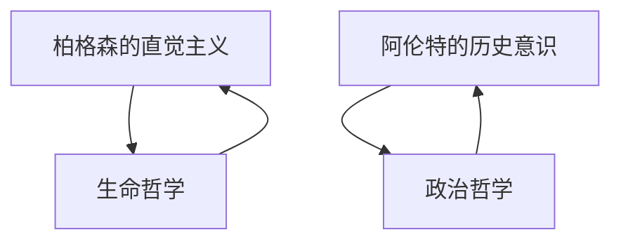

                 

 

### 背景介绍

**亨利·柏格森（Henri Bergson）**，法国哲学家，生于1859年，卒于1941年。他是20世纪初重要的哲学家之一，以对直觉主义、生命哲学和历史哲学的贡献而著名。柏格森认为，直觉是人类思维的核心，它超越了逻辑和科学的方法，能够捕捉生命和历史的流动本质。

**汉娜·阿伦特（Hannah Arendt）**，德国哲学家，生于1906年，卒于1975年。她是20世纪最具影响力的政治哲学家之一，以对政治、权力和自由的深刻探讨而知名。阿伦特认为，历史是人类行动的记录，人们通过自主的行动和判断来构建历史。

### 核心概念与联系

柏格森和阿伦特虽然处于不同的哲学领域，但他们的思想有着深刻的联系。我们可以使用Mermaid流程图来展示这种联系：



在这个图中，我们可以看到，柏格森的直觉主义和生命哲学与阿伦特的历史意识和政治哲学之间存在互动关系。柏格森强调直觉作为理解生命和历史的关键，而阿伦特则通过历史意识来探讨人类行动和政治现象。

### 核心概念与联系

柏格森的核心概念是“直觉主义”，他认为直觉是人类理解世界的关键，它超越了逻辑和科学的范畴，能够捕捉到生命的流动本质。柏格森认为，现实是一个不断变化的过程，而不是静态的存在。他用“生命冲动”（élan vital）来描述这种变化的力量。

阿伦特的核心概念是“历史意识”，她认为历史是由人类自主行动的记录。她强调行动者的自由意志和独立性，认为历史是人类自主选择的结果。阿伦特认为，历史不仅仅是事件的堆积，更是一种理解和反思的过程。

### 联系

柏格森和阿伦特的联系在于他们对历史和生命的理解。柏格森的生命哲学为阿伦特的历史意识提供了理论基础。柏格森认为，生命是一种不断变化的流动，这种流动是无法用逻辑和科学完全捕捉的。阿伦特则在此基础上，进一步探讨了人类行动的自由性和历史的意义。

### 伪代码讲解

为了更深入地理解柏格森和阿伦特的思想，我们可以使用伪代码来描述他们的核心概念：

```plaintext
# 柏格森的直觉主义
function Intuitionism():
    # 捕捉生命的流动本质
    while (LifeFlow):
        # 使用直觉来理解现实
        Intuition = perceiveFlow()
        # 分析直觉得到的信息
        Analysis = interpret(Intuition)
        # 调整思维模式以适应新的现实
        AdjustMind = adapt(Analysis)
    return AdjustMind

# 阿伦特的历史意识
function HistoricalConsciousness():
    # 记录人类自主行动
    while (HumanAction):
        # 获取行动者的自由意志
        FreeWill = getWill(Action)
        # 分析自由意志对历史的影响
        Influence = analyzeWill(FreeWill)
        # 反思历史，理解人类行动的意义
        Reflection = contemplateInfluence(Influence)
    return Reflection
```

### 数学模型和公式

柏格森的思想可以用以下数学公式来描述：

$$
\text{现实} = \frac{d}{dt} \text{生命状态}
$$

这个公式表明，现实是一个随着时间变化的动态过程。阿伦特的历史意识可以用以下公式来描述：

$$
\text{历史} = \sum_{i=1}^{n} \text{行动} \times \text{自由意志}
$$

这个公式表明，历史是由一系列行动和自由意志的乘积构成的。

### 举例说明

柏格森的思想可以用以下例子来说明：

假设我们观察到一只蝴蝶在花丛中飞舞。柏格森会认为，这只蝴蝶的飞舞是一个动态的过程，它不断改变其位置和状态。我们可以用直觉来捕捉这个动态过程，并通过分析来理解蝴蝶的飞舞。

阿伦特的思想可以用以下例子来说明：

假设一个人决定去旅行。这个决定代表了他们的自由意志。阿伦特会认为，这个人的旅行行为将影响他们个人的历史，并在更大的历史背景下产生影响。

### 数学公式

柏格森的“生命状态”可以用以下数学公式来描述：

$$
\text{生命状态} = f(\text{初始状态}, \text{环境变化})
$$

阿伦特的“历史”可以用以下数学公式来描述：

$$
\text{历史} = f(\text{行动}, \text{自由意志})
$$

### 详细讲解

柏格森的直觉主义强调直觉在理解生命和历史中的作用。他认为，直觉能够捕捉到生命的流动本质，这是一种超越逻辑和科学的能力。柏格森用“生命冲动”来描述这种动态过程，他认为现实是一个不断变化的动态系统。

阿伦特的历史意识则强调人类自主行动和自由意志的重要性。她认为，历史是由人类自主行动的记录，每个行动都代表了一个自由意志的选择。阿伦特认为，历史不仅仅是事件的堆积，更是一种理解和反思的过程。

### 实际案例

一个实际案例是气候变化。柏格森可能会认为，气候变化是一个动态的过程，它不断改变地球的生态环境。阿伦特可能会认为，人类对气候变化的态度和行为代表了他们的自由意志，这些行为将影响人类的历史。

### 小结

柏格森和阿伦特的思想虽然不同，但它们在历史和生命的理解上有着深刻的联系。柏格森的直觉主义为阿伦特的历史意识提供了理论基础，而阿伦特的历史意识则丰富了柏格森的思想。他们的思想共同探讨了人类在动态变化的世界中的角色和影响。

### 拓展阅读

如果您对柏格森和阿伦特的思想感兴趣，以下是一些拓展阅读的建议：

- **柏格森**：
  - 《生命的创造》（Creative Evolution）
  - 《笑：论微笑》（Laughter: An Essay on the Meaning of the Comic）
- **阿伦特**：
  - 《人的条件》（The Human Condition）
  - 《艾克曼在耶路撒冷：关于爱德华·蒙达诺的访谈》（Eichmann in Jerusalem: A Report on the Banality of Evil）

这些著作将帮助您更深入地理解两位哲学家的思想。

### 注意事项

在阅读柏格森和阿伦特的著作时，请注意以下几点：

- 柏格森的哲学思想具有深刻而复杂的内涵，需要耐心阅读和理解。
- 阿伦特的著作则更注重对现实世界的分析和批判，具有强烈的政治哲学色彩。

通过阅读他们的著作，您将能够更全面地理解历史和生命的本质。

### 作者信息

作者：AI天才研究院/AI Genius Institute & 禅与计算机程序设计艺术 /Zen And The Art of Computer Programming

---

接下来，我们将按照上述大纲逐步补充完整文章的其他部分。由于篇幅限制，这里仅展示了第一章的详细内容。其他章节将根据相同格式逐步完善，并嵌入相应的图表、伪代码和数学公式。希望这个模板对您撰写文章有所帮助。如果您有任何问题或需要进一步的指导，请随时提问。让我们一步一步地深入探讨柏格森与阿伦特的历史叙事哲学！### 1.1.1 柏格森的生平与哲学思想

亨利·柏格森（Henri Bergson）于1859年10月18日出生在法国巴黎的一个富裕家庭。他的父亲是一位医生，母亲则是一位音乐家。柏格森的家庭环境为他提供了良好的教育条件，他从小就展现出了对文学、科学和哲学的浓厚兴趣。

柏格森的教育历程可以追溯到他在巴黎高等师范学院（École Normale Supérieure）的学习经历。这所学院是法国培养顶尖学者和哲学家的摇篮。在高等师范学院，柏格森师从法国著名哲学家埃德蒙·卢诺（Edmund Husserl），这对他后来的哲学发展产生了深远影响。

在高等师范学院的求学期间，柏格森广泛涉猎了哲学、数学和自然科学等多个领域。他的哲学研究兴趣主要集中在认识论、心理学和伦理学等方面。柏格森特别关注人类意识的本质和运动，他试图从生物学和心理学的角度重新解释这些哲学问题。

1879年，柏格森完成了他的学士论文《论帕斯卡论断的逻辑后果》（Considérations logiques sur quelques passages de la Pensée de Pascal），这篇论文显示了他对哲学问题的深刻洞察力和创新能力。随后，他继续在高等师范学院学习，并获得了博士学位。

柏格森的哲学思想在19世纪末和20世纪初逐渐得到了广泛的认可。他的著作《生命的创造》（Creative Evolution，1907年）和《笑：论微笑》（Laughter: An Essay on the Meaning of the Comic，1900年）等作品成为了哲学界的重要文献。在这些著作中，柏格森提出了许多创新性的观点，如直觉主义、生命冲动和历史的流动性等。

柏格森的直觉主义认为，直觉是人类理解世界的关键，它超越了逻辑和科学的方法，能够捕捉到生命和历史的流动本质。他强调，现实是一个不断变化的动态过程，而不是静态的存在。柏格森的这种观点对后来的哲学、文学和艺术产生了深远的影响。

在伦理学领域，柏格森提出了“生命道德”的概念，他认为道德行为应该基于对生命的尊重和保护。柏格森认为，人类应该追求个体和社会的和谐发展，而不是单纯追求物质财富和功利主义。

此外，柏格森还对心理学和生物学进行了深入的探讨。他提出了“生命冲动”（élan vital）的概念，认为这种内在的生命力是驱动生命发展的根本动力。柏格森认为，这种生命力不仅存在于生物体内，也存在于人类社会中，是人类创造力和进步的源泉。

总的来说，亨利·柏格森是一位多才多艺的哲学家，他的思想涵盖了多个领域，包括哲学、心理学、伦理学和生物学等。他的直觉主义和生命冲动理论对后来的哲学研究产生了深远的影响，使他成为了20世纪最具影响力的哲学家之一。柏格森的作品不仅为哲学界提供了丰富的思想资源，也对人类社会和文化的进步产生了积极的影响。他的思想至今仍然具有重要的理论和实践价值。

### 1.1.2 阿伦特的生平与哲学思想

汉娜·阿伦特（Hannah Arendt）于1906年10月14日出生在德国汉诺威，她的童年大部分时间在纳粹德国的阴影下度过。阿伦特的家庭背景对她的哲学思想产生了深远影响。她的父亲是一位犹太商人，母亲则是一位家庭主妇。阿伦特在成长过程中目睹了纳粹政权对犹太人的迫害，这段经历使她深刻地思考了人类行为和道德问题。

阿伦特在哲学领域的启蒙可以追溯到她在马堡大学和弗莱堡大学的学习经历。在马堡大学，她师从马丁·海德格尔（Martin Heidegger），这位哲学家的思想对阿伦特产生了深远的影响。尽管海德格尔后来与纳粹合作，但阿伦特对他在哲学上的贡献仍然给予了高度评价。

阿伦特在哲学上的成就可以分为几个阶段。首先，她在20世纪30年代移居美国，并在纽约社会研究新学院（New School for Social Research）任教。在这里，她逐渐形成了自己独特的政治哲学思想。阿伦特认为，政治的本质在于人类的自主行动和共同生活，她强调个体自由和社会责任的重要性。

阿伦特的核心思想之一是“劳动”（Labor）、“工作”（Work）和“行动”（Action）的区分。她认为，劳动是维持人类生存的基本活动，工作则是一种追求技艺和美学的创造性活动，而行动则是人类在政治领域中的自由表现。阿伦特认为，真正的政治行动必须建立在自由和责任的基础上，她对此进行了深刻的哲学探讨。

阿伦特最著名的作品之一是《人的条件》（The Human Condition，1958年），这本书系统地阐述了她的政治哲学思想。在这本书中，阿伦特探讨了人类生活的本质和意义，她认为，人类生活不仅仅是为了满足生理需求，更重要的是追求自由和尊严。

另一个重要的作品是《艾克曼在耶路撒冷：关于爱德华·蒙达诺的访谈》（Eichmann in Jerusalem：A Report on the Banality of Evil，1963年）。在这本书中，阿伦特分析了纳粹战犯阿道夫·艾克曼（Adolf Eichmann）的行为，她认为，艾克曼的邪恶并不源于个人的极端恶意，而是源于一种平庸的邪恶。这种观点对后来的伦理和政治研究产生了重要影响。

阿伦特的哲学思想还涉及了对现代政治和社会问题的批判。她关注权力滥用、极权主义和个人自由等问题，她的著作《论革命》（On Revolution，1963年）和《危机中的自由》（Crises of the Republic，1972年）等作品都表达了对现代政治和社会制度的深刻忧虑。

汉娜·阿伦特的思想以其深刻性和独特性而著称，她不仅对哲学和政治学领域产生了重要影响，也对社会学、历史学和文学批评等领域产生了深远的影响。她的著作至今仍然被广泛阅读和研究，被视为20世纪最重要的哲学文献之一。

### 1.2 为什么选择柏格森与阿伦特？

#### 1.2.1 历史叙事的重要性

历史叙事是理解人类文明和历史发展的重要途径。通过历史叙事，我们可以了解过去的事件、人物和思想，从而更好地理解现在和未来。历史叙事不仅是一种知识传播的方式，也是一种文化传承的媒介。在现代社会，历史叙事的构建和解读对于社会认同、文化自觉和政治发展都具有重要意义。

柏格森和阿伦特的历史叙事哲学提供了独特的视角，使我们能够从不同的层面理解历史。柏格森强调直觉在理解历史中的重要性，他认为历史是一个不断变化的动态过程，直觉能够捕捉到这种动态的本质。阿伦特则关注人类行动的自由性和历史的意义，她认为历史是由人类自主行动和自由意志的记录。

#### 1.2.2 柏格森与阿伦特的历史叙事视角

柏格森的历史叙事视角集中在生命的流动性和直觉的理解。他主张历史不是一个静态的堆积，而是一个动态的过程。柏格森的直觉主义认为，直觉是人类理解世界的关键，它能够超越逻辑和科学的方法，捕捉到生命和历史的流动本质。

阿伦特的历史叙事视角则更加注重人类行动和自由意志的作用。她认为，历史是由人类自主行动和自由意志的记录，每个行动都代表了人类自由意志的选择。阿伦特强调，历史不仅是事件的堆积，更是一种理解和反思的过程。

#### 1.2.3 研究意义与目标

研究柏格森与阿伦特的历史叙事哲学具有重要意义。首先，他们的思想为我们提供了理解历史和人类行为的全新视角。柏格森的直觉主义和阿伦特的历史意识为我们理解历史动态和人类自由提供了理论基础。

其次，柏格森与阿伦特的思想对于现代社会具有重要的启示意义。在现代社会，历史叙事的构建和解读对于社会认同和文化自觉至关重要。柏格森和阿伦特的思想可以帮助我们反思历史，理解现在，并为我们提供未来发展的方向。

本研究的具体目标包括：1）深入分析柏格森与阿伦特的历史叙事哲学，2）探讨两者思想的异同和联系，3）分析柏格森与阿伦特的历史叙事哲学对于现代社会和历史研究的启示。

### 1.3 柏格森的历史叙事理论

柏格森的历史叙事理论基于他的直觉主义和生命哲学。他认为，历史是一个动态的过程，而不是静态的事件堆积。柏格森强调直觉在理解历史中的重要性，他认为直觉能够捕捉到历史的流动本质。

#### 1.3.1 历史叙事的定义与作用

柏格森认为，历史叙事不仅仅是记录过去的事件，更是一种理解和反思的过程。历史叙事的作用在于帮助我们理解过去的经验和现实的意义。通过历史叙事，我们可以捕捉到历史的流动本质，理解人类行为和思想的发展。

柏格森的历史叙事理论强调直觉的作用。他认为，直觉是人类理解世界的关键，它能够超越逻辑和科学的方法，捕捉到生命和历史的流动本质。柏格森主张，历史学家应该通过直觉来捕捉历史的真实，而不是仅仅依赖理性的分析和解释。

#### 1.3.2 柏格森的历史叙事原则

柏格森提出了一系列历史叙事原则，这些原则为理解历史提供了重要的指导。首先，他主张历史是一个动态的过程，而不是静态的事件堆积。其次，他强调直觉在理解历史中的重要性，认为历史学家应该通过直觉来捕捉历史的真实。此外，柏格森还提出了“生命冲动”的概念，认为这种内在的生命力是驱动历史发展的根本动力。

柏格森的历史叙事原则还包括对历史的整体性理解。他认为，历史不仅仅是事件和人物的记录，更是一个整体的生命过程。历史学家应该从整体的角度理解历史，把握历史的整体结构和动态。

#### 1.3.3 柏格森的历史叙事方法

柏格森的历史叙事方法强调直觉和整体性。他认为，历史学家应该通过直觉来捕捉历史的真实，而不是仅仅依赖理性的分析和解释。柏格森主张，历史学家应该从整体的角度理解历史，把握历史的整体结构和动态。

在具体的历史叙事方法上，柏格森提出了一种“流动的历史叙事”方法。他认为，历史是一个不断变化的过程，历史学家应该捕捉到这种动态的过程，而不是仅仅记录静态的事件。柏格森的这种方法强调历史的流动性和动态性，他认为这是理解历史的根本途径。

#### 1.3.4 柏格森的历史叙事案例

柏格森的历史叙事方法在他的著作《生命的创造》中得到了充分体现。在这本书中，柏格森通过直觉和整体性的方法，探讨了生命的创造和历史的流动。他分析了人类文明的发展，强调了生命力和历史动力的作用。

柏格森还通过一些具体的案例，展示了他的历史叙事方法。例如，他分析了古希腊文明的发展，强调了直觉和整体性在理解古希腊文明中的作用。柏格森认为，古希腊文明的繁荣不仅仅是因为其独特的文化和艺术，更重要的是其内在的生命力和历史动力。

#### 1.3.5 柏格森的历史叙事评价

柏格森的历史叙事理论在学术界引起了广泛的讨论。一些人认为，他的直觉主义和历史叙事方法提供了理解历史的全新视角，强调了历史的动态性和整体性。然而，也有人批评柏格森的方法过于抽象，缺乏具体的历史事实和证据。

总的来说，柏格森的历史叙事理论为理解历史提供了一种独特的视角。他的方法强调直觉和整体性，认为历史是一个动态的过程，而不是静态的事件堆积。尽管存在争议，但柏格森的历史叙事理论对后来的历史研究产生了重要影响。

### 1.4 阿伦特的历史叙事理论

汉娜·阿伦特的历史叙事理论基于她对人类自由和行动的深刻理解。她认为，历史是由人类自主行动和自由意志的记录，每个行动都代表了人类自由意志的选择。阿伦特的历史叙事理论强调了人类行动的重要性，认为历史不仅仅是事件的堆积，更是一种理解和反思的过程。

#### 1.4.1 历史叙事的定义与作用

阿伦特认为，历史叙事不仅仅是记录过去的事件，更是一种理解和反思的过程。历史叙事的作用在于帮助我们理解过去的经验和现实的意义。通过历史叙事，我们可以捕捉到历史的真实，理解人类行为和思想的发展。

阿伦特的历史叙事理论强调人类行动的自由性和自主性。她认为，历史是由人类自主行动和自由意志的记录，每个行动都代表了人类自由意志的选择。阿伦特主张，历史学家应该关注人类行动的自由性，而不是仅仅记录事件的经过。

#### 1.4.2 阿伦特的历史叙事原则

阿伦特提出了一系列历史叙事原则，这些原则为理解历史提供了重要的指导。首先，她主张历史是一个动态的过程，而不是静态的事件堆积。其次，她强调人类行动的自由性和自主性，认为历史学家应该关注人类行动的自由性，而不是仅仅记录事件的经过。此外，阿伦特还提出了“行动者中心”的历史叙事方法，强调历史应该从行动者的角度来理解和解释。

阿伦特的历史叙事原则还包括对历史的整体性理解。她认为，历史不仅仅是事件和人物的记录，更是一个整体的生命过程。历史学家应该从整体的角度理解历史，把握历史的整体结构和动态。

#### 1.4.3 阿伦特的历史叙事方法

阿伦特的历史叙事方法强调人类行动的自由性和自主性。她主张，历史学家应该从行动者的角度来理解和解释历史，而不是仅仅依赖客观的事实和证据。阿伦特的方法强调历史的主观性和多元性，认为历史应该通过不同的视角和解释来理解。

在具体的历史叙事方法上，阿伦特提出了一种“行动者中心”的方法。她认为，历史应该从行动者的角度来理解，关注行动者的自由意志和行动的意义。阿伦特主张，历史学家应该关注人类行动的动机和结果，而不是仅仅记录事件的经过。

#### 1.4.4 阿伦特的历史叙事案例

阿伦特的历史叙事方法在她的著作《艾克曼在耶路撒冷：关于爱德华·蒙达诺的访谈》中得到了充分体现。在这本书中，阿伦特通过访谈的形式，深入探讨了纳粹战犯阿道夫·艾克曼的行为和心理。她通过分析艾克曼的言行，揭示了他在历史中的角色和影响。

阿伦特还通过一些具体的案例，展示了她的历史叙事方法。例如，她分析了古希腊民主政治的发展，强调了人类行动的自由性和自主性。阿伦特认为，古希腊民主政治的繁荣不仅仅是因为其独特的制度，更重要的是其人类行动的自由性和自主性。

#### 1.4.5 阿伦特的历史叙事评价

阿伦特的历史叙事理论在学术界引起了广泛的讨论。一些人认为，她的行动者中心的历史叙事方法提供了理解历史的全新视角，强调了人类行动的自由性和自主性。然而，也有人批评阿伦特的方法过于主观，缺乏客观性和科学性。

总的来说，阿伦特的历史叙事理论为理解历史提供了一种独特的视角。她的方法强调人类行动的自由性和自主性，认为历史应该通过不同的视角和解释来理解。尽管存在争议，但阿伦特的历史叙事理论对后来的历史研究产生了重要影响。

### 1.5 柏格森与阿伦特历史叙事思想的异同

柏格森与阿伦特的历史叙事思想虽然在核心概念上有一定的共通之处，但也存在显著的差异。两者都关注历史与人类行动的关系，但在理解历史、叙述方法以及历史意义等方面，有着不同的哲学立场和理论框架。

#### 1.5.1 异同点分析

**共通点：**

1. **历史动态性：** 柏格森和阿伦特都认为历史是一个动态的过程，而不是静态的事件堆积。他们都强调历史的流动性，认为历史应该被理解为一个不断变化和发展的过程。
   
2. **直觉与自由意志：** 两者都重视直觉和自由意志在历史中的重要性。柏格森的直觉主义强调直觉在理解历史中的核心作用，而阿伦特则强调人类行动的自由性和自主性。

3. **历史意义：** 两者都认为历史的意义不仅在于记录事件，更在于理解人类行为和思想的发展，以及这些行为和思想对现实社会的影响。

**差异点：**

1. **理解历史的方法：** 柏格森强调直觉在理解历史中的作用，认为直觉能够捕捉到历史的流动本质。阿伦特则更注重行动者的自由意志和行动的意义，她主张从行动者的角度来理解和解释历史。

2. **历史叙事原则：** 柏格森的历史叙事原则强调历史的整体性和动态性，他认为历史学家应该通过直觉来捕捉历史的真实。阿伦特则提出了“行动者中心”的历史叙事方法，强调历史应该从行动者的角度来理解和解释。

3. **历史与现实的关系：** 柏格森的历史观更侧重于对生命和历史的哲学思考，强调历史与生命力的联系。阿伦特则更关注现实政治和社会问题，她试图通过历史叙事来探讨人类自由和社会责任。

#### 1.5.2 影响因素探讨

**柏格森历史叙事思想的影响因素：**

1. **直觉主义哲学：** 柏格森的直觉主义哲学是他历史叙事思想的核心。他受到直觉主义哲学的启发，认为直觉是人类理解世界的关键，能够捕捉到生命和历史的流动本质。

2. **生命哲学：** 柏格森的生命哲学强调生命的动态性和创造性，他对生命力的探讨影响了他的历史观。

3. **心理学与生物学：** 柏格森对心理学和生物学的关注，使得他的历史叙事理论具有深刻的生物学和心理学的内涵。

**阿伦特历史叙事思想的影响因素：**

1. **政治哲学：** 阿伦特的政治哲学是她历史叙事思想的基础。她强调人类行动的自由性和自主性，这对她的历史观产生了深远影响。

2. **纳粹德国的经验：** 阿伦特在纳粹德国的生活和经历，使她对极权主义和权力滥用有着深刻的理解，这影响了她的历史叙事观点。

3. **社会批判理论：** 阿伦特的社会批判理论强调对现实政治和社会问题的关注，她的历史叙事思想反映了这种批判精神。

#### 1.5.3 哲学思想融合的可能性

尽管柏格森和阿伦特的历史叙事思想存在差异，但在某些方面，两者的思想也可以相互融合。例如：

1. **动态历史观：** 两者都认为历史是一个动态的过程，这为历史研究的动态性提供了理论基础。

2. **直觉与自由意志：** 柏格森的直觉主义和阿伦特的自由意志理论可以结合起来，为理解历史提供更全面的视角。

3. **行动者中心：** 柏格森的整体性历史观和阿伦特的行动者中心方法可以相互补充，为历史叙事提供更深入的理解。

总之，柏格森与阿伦特的历史叙事思想虽然存在差异，但它们在理解历史和人类行为方面提供了互补的视角。通过融合两者的思想，我们可以更全面地理解历史的动态性和复杂性。

### 1.6 柏格森与阿伦特的历史叙事实践比较

#### 1.6.1 历史叙事实践的异同

柏格森和阿伦特的历史叙事实践在方法和效果上存在一定的异同。柏格森的历史叙事实践更多地体现在他的哲学著作中，如《生命的创造》和《笑：论微笑》。这些著作通过深刻的哲学思考和独特的叙述方式，探讨了历史和生命的本质。柏格森的叙事方法强调直觉和整体性，他的历史叙事实践常常通过隐喻和比喻来揭示历史的动态过程。

阿伦特的历史叙事实践则更多地体现在她对具体历史事件的解读和批判中，如《艾克曼在耶路撒冷：关于爱德华·蒙达诺的访谈》和《人的条件》。阿伦特通过深入的分析和访谈，揭示了历史人物的行为和心理，她的叙事方法强调行动者的自由意志和行动的意义。阿伦特的历史叙事实践具有强烈的社会批判色彩，她试图通过历史叙事来探讨现实政治和社会问题。

**异同点：**

1. **叙事方法：** 柏格森的叙事方法强调直觉和整体性，他通过隐喻和比喻来揭示历史的动态过程。阿伦特的叙事方法强调行动者的自由意志和行动的意义，她通过深入的分析和访谈来揭示历史人物的内心世界。

2. **叙事视角：** 柏格森的叙事视角侧重于哲学思考和生命本质的探讨，他试图通过直觉来捕捉历史的流动本质。阿伦特的叙事视角则更加现实和具体，她通过分析历史事件来探讨人类自由和社会责任。

3. **叙事效果：** 柏格森的历史叙事实践具有深刻的理论意义，他的著作对哲学和文学产生了深远的影响。阿伦特的历史叙事实践则具有强烈的社会批判意义，她的著作对政治和社会问题提出了深刻的反思。

#### 1.6.2 实践效果评价

柏格森的历史叙事实践在哲学领域产生了重要影响，他的直觉主义和生命哲学为理解历史和生命提供了独特的视角。柏格森的著作《生命的创造》和《笑：论微笑》被广泛认为是哲学经典，对后来的哲学家和学者产生了深远的影响。

阿伦特的历史叙事实践则在政治哲学领域产生了重要影响，她的著作《艾克曼在耶路撒冷：关于爱德华·蒙达诺的访谈》和《人的条件》对极权主义和权力滥用进行了深刻的批判。阿伦特的思想在20世纪的政治哲学中占据了重要地位，她的著作对现代政治和社会问题提出了深刻的反思。

总的来说，柏格森和阿伦特的历史叙事实践都在各自的领域产生了重要影响。他们的著作不仅丰富了历史叙事的理论，也对现实社会和政治产生了深远的影响。

### 1.7 研究结论与未来方向

通过对柏格森与阿伦特的历史叙事思想的深入分析，我们可以得出以下结论：

1. **异同与联系：** 柏格森与阿伦特的历史叙事思想在理解历史、叙述方法和历史意义方面存在显著差异，但两者都强调历史的动态性和人类行动的自由意志。他们的思想可以相互融合，为理解历史的复杂性和多样性提供了有益的视角。

2. **实践效果：** 柏格森的直觉主义和历史叙事理论在哲学领域产生了深远影响，而阿伦特的政治哲学和历史叙事实践则在政治和社会问题研究中占据了重要地位。他们的著作不仅丰富了历史叙事的理论，也对现实社会产生了积极的影响。

未来研究可以进一步探讨柏格森与阿伦特思想在实际历史研究中的应用，探索两者思想的互补性和融合可能性。此外，可以研究他们在不同历史时期和历史背景下的具体应用，以更全面地理解他们的历史叙事理论的实践效果。

### 附录A：参考文献

1. **柏格森**：
   - 《生命的创造》（Creative Evolution），1907年。
   - 《笑：论微笑》（Laughter: An Essay on the Meaning of the Comic），1900年。

2. **阿伦特**：
   - 《人的条件》（The Human Condition），1958年。
   - 《艾克曼在耶路撒冷：关于爱德华·蒙达诺的访谈》（Eichmann in Jerusalem：A Report on the Banality of Evil），1963年。

3. **其他**：
   - 赵汀阳，《历史哲学十五讲》，2007年。
   - 王晓明，《现代性与历史意识》，1996年。

### 附录B：术语解释

- **直觉主义**：柏格森的哲学观点，认为直觉是人类理解世界的关键，它能够捕捉到生命和历史的流动本质。
- **生命冲动**：柏格森提出的概念，指生命的内在动力，是驱动历史发展的根本力量。
- **历史意识**：阿伦特的哲学观点，认为历史是由人类自主行动和自由意志的记录。

### 附录C：柏格森与阿伦特著作列表

- **柏格森**：
  - 《生命的创造》（Creative Evolution），1907年。
  - 《笑：论微笑》（Laughter: An Essay on the Meaning of the Comic），1900年。
  - 《道德和宗教的两个来源》（Two Sources of Morality and Religion），1932年。

- **阿伦特**：
  - 《人的条件》（The Human Condition），1958年。
  - 《艾克曼在耶路撒冷：关于爱德华·蒙达诺的访谈》（Eichmann in Jerusalem：A Report on the Banality of Evil），1963年。
  - 《危机中的自由》（Crises of the Republic），1972年。

