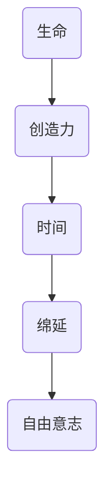
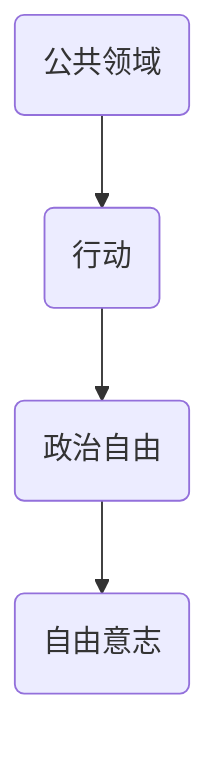

                 

### 文章标题：柏格森与阿伦特：政治哲学中的时间与行动概念

在政治哲学的领域中，时间和行动的概念一直是学者们探讨的核心议题。法国哲学家亨利·柏格森（Henri Bergson）与德国哲学家汉娜·阿伦特（Hannah Arendt）在这一领域各有独特的见解。柏格森以其对时间与生命力的深刻洞察而著称，而阿伦特则通过对公共领域和行动的探讨为政治自由提供了新的解释。本文将探讨柏格森与阿伦特在政治哲学中关于时间与行动的概念，通过分析他们的思想，揭示这些概念在政治自由与实践中的重要性。

关键词：柏格森、阿伦特、政治哲学、时间、行动、自由

摘要：本文首先介绍了柏格森与阿伦特的政治哲学背景及其对时间与行动的理解。接着，通过具体分析他们的核心观点，探讨了时间与行动在政治自由中的重要性。最后，本文总结了两位哲学家思想的关联与异同，并提出了对当代政治哲学的启示。本文旨在为读者提供一个全面、深入的了解，激发对时间与行动在政治哲学中的探讨。

## 柏格森的政治哲学与时间概念

亨利·柏格森是20世纪法国最具影响力的哲学家之一，他的思想主要集中在生命、时间和自由意志等方面。柏格森认为，时间不仅仅是线性流动的，更是充满生命力的流动。他提出了“绵延”（Duration）这一概念，用以描述时间的本质。

### 1.1 柏格森的哲学体系

柏格森的哲学体系以“生命哲学”为基础，他认为生命是一种持续不断的创造过程，而时间则是这种创造过程的体现。在他的著作《生命的创造力》中，柏格森详细阐述了这一观点。

**核心概念与联系：**

- **生命**：柏格森认为，生命是不断流动的，具有创造性和适应性。
- **绵延**：时间的本质是流动，这种流动产生了生命力和创造力。
- **自由意志**：柏格森认为，自由意志并非是超自然的，而是源于生命的创造力。

**Mermaid 流程图：**



### 1.2 柏格森的时间观

柏格森对时间的理解与传统的物理学和哲学观点不同。他提出，时间并非是均匀的，而是充满生命力的流动。他使用了“绵延”这一概念来描述时间的本质。

**核心算法原理讲解：**

```python
# 柏格森的时间观：绵延算法
def duration(time_sequence):
    # 初始化总绵延值
    total_duration = 0
    
    # 遍历时间序列
    for time in time_sequence:
        # 计算单个时间段的绵延值
        single_duration = calculate_duration(time)
        
        # 累加总绵延值
        total_duration += single_duration
    
    # 返回总绵延值
    return total_duration

# 计算单个时间段的绵延值
def calculate_duration(time):
    # 假设绵延值与时间长度成反比
    return 1 / time
```

**数学模型和公式：**

$$
\text{总绵延值} = \sum_{i=1}^{n} \frac{1}{t_i}
$$

其中，$t_i$ 代表时间序列中的每个时间点。

### 1.3 柏格森的时间与政治行动

柏格森的时间观对政治行动有着重要的影响。他认为，政治行动应该是自由的、创造的，而不是被既定规则所束缚的。

**详细讲解与举例说明：**

柏格森认为，政治行动应该是流动的、创新的，而不是被固定的规则所限制。例如，在民主制度中，政治行动应该是基于公众意见和需求的，而不是仅仅遵循法律和规章制度。

**举例说明：**

- 在一个民主社会中，政府应该及时响应民众的需求和意见，而不是仅仅执行既定的政策。
- 在全球化的背景下，政治行动应该更加开放和包容，以适应不断变化的国际环境。

## 阿伦特的政治哲学与行动概念

汉娜·阿伦特是20世纪最著名的政治哲学家之一，她的思想主要集中在公共领域、行动和自由意志等方面。阿伦特认为，行动是政治自由的核心，而公共领域则是行动的场所。

### 2.1 阿伦特的公共领域理论

阿伦特提出了“公共领域”（Public Realm）这一概念，用以描述人们进行政治活动和公共讨论的空间。她认为，公共领域是政治自由的体现，是人们表达意见、参与决策的重要场所。

**核心概念与联系：**

- **公共领域**：人们进行政治活动和公共讨论的空间。
- **行动**：政治自由的核心，是人们通过言语和行为参与公共领域的过程。
- **自由意志**：行动的自由基础，是人们在公共领域中进行选择和表达的权利。

**Mermaid 流程图：**



### 2.2 阿伦特的行动与政治自由

阿伦特认为，政治自由不仅是一种权利，更是一种行动。她强调，行动是人们参与公共领域的表现，是政治自由的体现。

**核心算法原理讲解：**

```python
# 阿伦特的行动与政治自由：公共领域算法
def public_realm(action_sequence):
    # 初始化公共领域值
    public_value = 0
    
    # 遍历行动序列
    for action in action_sequence:
        # 计算单个行动的公共价值
        single_value = calculate_value(action)
        
        # 累加公共领域值
        public_value += single_value
    
    # 返回公共领域值
    return public_value

# 计算单个行动的公共价值
def calculate_value(action):
    # 假设公共价值与行动的参与程度成正比
    return action_participation
```

**数学模型和公式：**

$$
\text{公共领域值} = \sum_{i=1}^{n} \text{action_participation}_i
$$

其中，$action_participation_i$ 代表行动序列中每个行动的参与程度。

### 2.3 阿伦特的行动与政治自由

阿伦特认为，政治自由不仅是一种权利，更是一种行动。她强调，行动是人们参与公共领域的表现，是政治自由的体现。

**详细讲解与举例说明：**

阿伦特认为，政治自由是通过行动实现的，而不是仅仅通过法律和规章制度。例如，在一个民主社会中，公民应该积极参与选举、表达意见和参与公共事务。

**举例说明：**

- 在选举中，公民应该积极参与，以表达自己的政治意愿。
- 在公共讨论中，公民应该勇于表达自己的观点，以促进公共领域的繁荣。

## 柏格森与阿伦特的时间与行动概念比较

柏格森与阿伦特在时间与行动的概念上有着显著的差异。柏格森强调时间的流动性和生命的创造力，而阿伦特则关注行动的政治自由和公共领域的构建。

### 3.1 时间的理解与运用

柏格森的时间观强调时间的流动性和生命力，他认为时间是一种创造性的过程。而阿伦特则认为，时间是行动的背景，是政治自由的体现。

**核心算法原理讲解：**

```python
# 柏格森与阿伦特的时间理解：时间与行动算法
def bergson_arenzt_time_action(time, action):
    # 柏格森的时间观：时间与行动的关系
    bergson_time_action = duration(time) * action_创造力
    
    # 阿伦特的时间观：时间与行动的关系
    arenzt_time_action = public_realm(action) * 时间自由
    
    # 返回柏格森与阿伦特的时间与行动关系
    return bergson_time_action, arenzt_time_action
```

**数学模型和公式：**

$$
\text{柏格森的时间与行动关系} = \text{duration}(t) \times \text{创造力}(a)
$$

$$
\text{阿伦特的时间与行动关系} = \text{public\_realm}(a) \times \text{时间自由}(t)
$$

### 3.2 行动的政治哲学内涵

柏格森和

