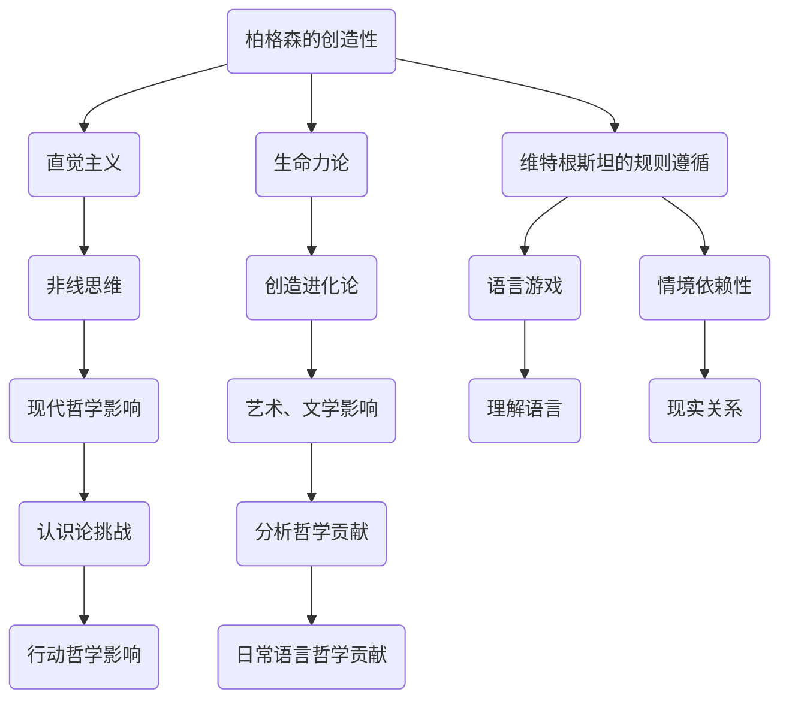

                 

### 文章标题

《柏格森的创造性与维特根斯坦的规则遵循》是本书的标题。这个标题涵盖了本书的核心主题，即探讨柏格森的创造性理论与维特根斯坦的规则遵循哲学之间的联系与影响。通过分析这两个哲学家的观点，我们可以深入理解创造性在哲学思考中的重要性，以及规则在人类行为中的地位和作用。

柏格森（Henri Bergson）是一位著名的法国哲学家，他的创造性理论强调直觉和生命力的作用，认为创造是生命的本质。柏格森的创造性理论在艺术、文学和哲学领域产生了深远的影响。

维特根斯坦（Ludwig Wittgenstein）是20世纪最杰出的哲学家之一，他的规则遵循哲学探讨语言、思维和现实之间的关系。维特根斯坦强调语言的使用规则，认为理解语言意味着遵循这些规则。

本文将逐步分析柏格森的创造性理论，以及维特根斯坦的规则遵循哲学，探讨它们在哲学思考中的地位和影响。我们将通过具体实例和逻辑推理，深入理解这两个哲学家的观点，并分析它们在现代哲学和计算机科学中的应用。

### 文章关键词

柏格森、创造性、维特根斯坦、规则遵循、哲学思考、人工智能、计算机科学、直觉、生命力、艺术、文学、语言哲学。

### 文章摘要

本文旨在探讨柏格森的创造性理论与维特根斯坦的规则遵循哲学之间的联系与影响。首先，我们介绍了柏格森的创造性理论，包括他对直觉和生命力的强调，以及创造性在艺术、文学和哲学中的重要性。接着，我们分析了维特根斯坦的规则遵循哲学，探讨了他在语言哲学中的贡献，以及规则在人类行为中的地位和作用。通过这两个哲学家的观点，我们深入理解了创造性在哲学思考中的重要性，以及规则在语言和现实世界中的作用。本文还讨论了这两个哲学观点在计算机科学和人工智能中的应用，并提出了未来研究的方向。

### 引言

#### 柏格森的生平与哲学观点

亨利·柏格森（Henri Bergson）是19世纪末20世纪初法国最重要的哲学家之一。他于1859年出生于巴黎，自幼聪颖过人，16岁时便进入巴黎高等师范学院学习。柏格森在哲学领域的贡献主要体现在他对直觉主义、创造性理论以及生命哲学的探讨上。

柏格森的直觉主义哲学认为，直觉是人类认识世界的根本途径。在《直觉的意识》一书中，柏格森指出，直觉不仅是一种感觉，更是一种对事物本质的洞察力。与逻辑思维不同，直觉更关注事物的动态变化和内在联系。柏格森认为，逻辑思维往往只能处理静态的事物，而直觉则能够捕捉到事物的流动性和生命力。

柏格森的创造性理论强调直觉和生命力的作用。他认为，创造是生命的本质，是一种不断前进、不断发展的动力。在《创造进化论》中，柏格森提出了“活力论”（élan vital）的概念，即生命力是推动生物进化和社会进步的根本力量。柏格森认为，人类的思维、艺术、科学和技术都源于这种创造性的生命力。

#### 维特根斯坦的生平与哲学观点

路德维希·维特根斯坦（Ludwig Wittgenstein）是20世纪最具影响力的哲学家之一。他于1889年出生于奥地利，自幼展现出卓越的数学和哲学天赋。维特根斯坦在哲学领域的贡献主要体现在他的早期著作《逻辑哲学论》和晚期著作《哲学研究》中。

维特根斯坦的早期哲学思想以逻辑原子主义为基础，他认为世界由不可再分的基本元素（逻辑原子）构成，这些元素通过逻辑关系组合在一起，形成了我们对世界的理解。在《逻辑哲学论》中，维特根斯坦提出了“图像论”（picture theory），即语言是现实的图像，语言的意义在于它能够正确地描述现实。

然而，维特根斯坦的晚期哲学思想发生了重大转变。在《哲学研究》中，他提出了“语言游戏”（language game）的概念，强调语言的使用是具体的、情境化的。维特根斯坦认为，理解语言意味着理解它在特定情境下的使用规则。语言不仅是一种工具，更是一种活动，语言的目的是为了交流和理解。

#### 两位哲学家的哲学思想

柏格森和维特根斯坦的哲学思想在很多方面都存在明显的差异。柏格森强调直觉和生命力，认为创造是生命的本质。维特根斯坦则关注语言和逻辑，认为理解语言意味着遵循它在特定情境下的使用规则。

然而，尽管两位哲学家的观点有所不同，他们之间也存在一定的联系。首先，他们都关注人类思维和现实之间的关系。柏格森的直觉主义哲学和维特根斯坦的语言哲学都试图揭示人类如何通过直觉和语言来认识世界。其次，他们都强调具体情境的重要性。柏格森认为，直觉是一种对事物动态变化的洞察，这种洞察需要具体情境的支持。维特根斯坦则认为，语言的意义在于它在特定情境下的使用。

总的来说，柏格森和维特根斯坦的哲学思想为我们提供了一种全面理解人类思维和现实之间关系的视角。通过分析他们的观点，我们可以更深入地理解直觉、创造性和规则在哲学思考中的重要性。

### 哲学基础

#### 柏格森的创造性哲学

柏格森的创造性哲学是其哲学体系的核心之一。在他看来，创造性是人类思维和行为的本质，是人类与其他生物区别开来的关键特征。柏格森认为，创造性源于生命力（élan vital），这是一种不断流动、不断变化的内在动力，是生命体适应环境、实现自身发展的源泉。

柏格森在《创造进化论》中提出，生命力不仅存在于生物体中，也体现在人类的社会进步和文明发展中。他认为，历史是生命力的表现，是创造性不断进发的结果。柏格森用“创造进化论”来反对机械唯物主义和进化论，强调生命力的不可预测性和创造性。

柏格森的创造性哲学对现代哲学、艺术和文学产生了深远的影响。在哲学领域，他的观点挑战了传统逻辑和理性主义的观念，强调了直觉和非线性思维的重要性。在艺术和文学领域，他的理论为现代主义文学和艺术提供了理论基础，激发了对传统形式的革新和探索。

#### 维特根斯坦的规则遵循哲学

维特根斯坦的规则遵循哲学是其晚期思想的重要组成部分。在《哲学研究》中，他提出了“语言游戏”的概念，强调语言的意义和使用规则是具体的、情境化的。维特根斯坦认为，理解语言意味着理解它在特定情境下的使用规则。这些规则不仅包括语法和词汇规则，还包括语言在社会交往中的行为规则。

维特根斯坦认为，语言是一种活动，而不是一种静态的符号系统。语言的使用是一种游戏，这种游戏需要参与者共同遵循特定的规则。规则遵循不仅是对语言的理解，也是对现实世界的理解和参与。维特根斯坦通过“语言游戏”这一概念，揭示了语言、思维和现实之间的复杂关系。

维特根斯坦的规则遵循哲学对语言哲学、认识论和行动哲学产生了深远的影响。他的观点挑战了传统形而上学和逻辑主义的观念，强调了语言和现实的情境依赖性。在语言哲学领域，他的理论为分析哲学和日常语言哲学提供了重要的理论基础。

#### 创造性与哲学思考的关系

柏格森的创造性哲学和维特根斯坦的规则遵循哲学在哲学思考中具有不同的地位和作用。柏格森的创造性哲学强调直觉和非线性思维，认为创造性是人类思维和行为的本质。维特根斯坦的规则遵循哲学则强调语言的情境依赖性和具体性，认为理解语言意味着理解它在特定情境下的使用规则。

然而，尽管两者在哲学思考中的地位和作用不同，它们之间也存在一定的联系。首先，创造性和规则遵循都是哲学思考的重要组成部分。创造性关注思维的本质和人类行为的发展，而规则遵循关注语言和现实之间的关系。其次，两者都强调具体情境的重要性。柏格森认为，直觉需要具体情境的支持，而维特根斯坦认为，理解语言和现实需要具体情境的规则。

在哲学思考中，创造性和规则遵循的关系可以看作是哲学思考的两个维度。创造性关注思维的本质和内在动力，而规则遵循关注思维的表达和交流。通过结合两者，我们可以更全面地理解哲学思考的本质和意义。

#### 核心概念原理之间的关系架构

为了更好地理解柏格森的创造性哲学和维特根斯坦的规则遵循哲学，我们可以通过Mermaid流程图来展示它们之间的关系架构。

通过这个流程图，我们可以看到柏格森的创造性哲学与维特根斯坦的规则遵循哲学之间的联系和影响。柏格森的直觉主义和生命力论为创造性提供了理论基础，而维特根斯坦的语言游戏和情境依赖性为理解语言和现实提供了方法论。

### 创造性与哲学思考

#### 柏格森的创造性与哲学思考

柏格森的创造性哲学是他对哲学思考的重要贡献之一。他认为，创造性是人类思维和行为的本质，是人类与其他生物区别开来的关键特征。柏格森的创造性哲学主要表现在以下几个方面：

1. **直觉主义**：柏格森认为，直觉是人类认识世界的根本途径。直觉不仅是一种感觉，更是一种对事物本质的洞察力。直觉能够捕捉到事物的动态变化和内在联系，而逻辑思维则往往只能处理静态的事物。

2. **生命力论**：柏格森提出“生命力”（élan vital）的概念，认为生命力是推动生物进化和社会进步的根本力量。生命力是一种不断流动、不断变化的内在动力，是人类思维和行为的源泉。

3. **非线思维**：柏格森强调非线性思维的重要性。他认为，线性思维无法捕捉到事物的复杂性和动态性，而非线性思维则能够更好地反映现实的本质。

4. **艺术和文学**：柏格森认为，艺术和文学是创造性思维的产物。他主张艺术家应该通过直觉来创作，而不是仅仅遵循传统的规则和规范。

5. **科学和技术**：柏格森认为，科学和技术的进步离不开创造性。他强调科学家和技术人员应该具备直觉和创新的能力，以推动科学和技术的发展。

#### 维特根斯坦的创造性与哲学思考

维特根斯坦的创造性哲学主要体现在他的晚期思想中，即“语言游戏”理论。他认为，创造性是语言和现实之间的桥梁，是人类理解世界和进行交流的重要途径。维特根斯坦的创造性哲学主要表现在以下几个方面：

1. **语言游戏**：维特根斯坦提出了“语言游戏”的概念，认为语言的意义和使用规则是具体的、情境化的。语言游戏强调语言的使用是一种活动，而不是一种静态的符号系统。

2. **情境依赖性**：维特根斯坦认为，理解语言和现实需要具体情境的规则。情境依赖性强调语言和现实之间的联系是具体的、情境化的，而不是抽象的、普遍的。

3. **哲学思考的方法**：维特根斯坦主张通过观察和分析具体情境中的语言使用来理解哲学问题。他认为，哲学思考不应该抽象地讨论概念和理论，而应该具体地分析语言在现实中的应用。

4. **行动哲学**：维特根斯坦的创造性哲学对行动哲学产生了深远的影响。他认为，行动不仅是一种表达，更是一种理解和参与现实的方式。行动哲学强调行动在哲学思考中的重要性。

#### 创造性与哲学思考的关系

柏格森的创造性哲学和维特根斯坦的创造性哲学在哲学思考中具有不同的地位和作用。柏格森的创造性哲学强调直觉和生命力，认为创造性是人类思维和行为的本质。维特根斯坦的创造性哲学则强调语言的情境依赖性和具体性，认为创造性是理解语言和现实的关键。

尽管两者在哲学思考中的地位和作用不同，但它们之间也存在一定的联系。首先，创造性是哲学思考的重要组成部分。无论是柏格森还是维特根斯坦，都认为创造性是人类思维和行为的本质。其次，两者都关注具体情境的重要性。柏格森强调直觉需要具体情境的支持，而维特根斯坦强调理解语言和现实需要具体情境的规则。

在哲学思考中，创造性与哲学思考的关系可以看作是哲学思考的两个维度。创造性关注思维的本质和内在动力，而哲学思考则关注思维的表达和交流。通过结合两者，我们可以更全面地理解哲学思考的本质和意义。

### 创造性与哲学思考的详细讲解

#### 柏格森的创造性与哲学思考

柏格森的创造性哲学是他哲学思想的核心理念，这一理念在多个领域产生了深远的影响。为了深入理解柏格森的创造性哲学，我们需要详细探讨以下几个方面：

1. **直觉主义**：
   - **定义**：柏格森认为直觉是一种超越逻辑和理性的认知能力，它能够捕捉到事物的动态变化和内在联系。
   - **重要性**：直觉在柏格森的哲学体系中具有至关重要的地位，因为它能够揭示逻辑思维无法触及的领域。
   - **实例**：在艺术创作中，艺术家通过直觉捕捉到情感和美感，创造出具有生命力的作品。

2. **生命力论**：
   - **定义**：柏格森提出的“生命力”（élan vital）是指一种推动生物体不断进化、发展的内在动力。
   - **作用**：生命力是柏格森哲学的核心概念，他认为生命力不仅存在于生物体内，也体现在社会和文化的进步中。
   - **实例**：在科学研究中，科学家的直觉和创新力往往源自于生命力，推动科学技术的发展。

3. **非线思维**：
   - **定义**：非线性思维是指能够处理复杂、动态系统的一种思维方式，它不同于传统的线性思维。
   - **重要性**：非线性思维能够更好地反映现实世界的复杂性和动态性。
   - **实例**：在经济学中，非线性思维可以帮助我们理解市场波动和非预期事件。

4. **艺术和文学**：
   - **创造性**：柏格森认为艺术家通过直觉和生命力进行创作，创作出具有生命力的艺术作品。
   - **实例**：梵高的画作《向日葵》就是一个典型的例子，艺术家通过直觉表达了对生命的热爱和对自然的感悟。

5. **科学和技术**：
   - **创造性**：柏格森认为科学和技术的发展离不开创造性思维。
   - **实例**：爱因斯坦的相对论就是一个典型的例子，它通过创造性思维揭示了时间、空间和物质之间的关系。

#### 维特根斯坦的创造性与哲学思考

维特根斯坦的创造性哲学主要体现于他的晚期思想，即“语言游戏”理论。为了深入理解维特根斯坦的创造性哲学，我们需要详细探讨以下几个方面：

1. **语言游戏**：
   - **定义**：维特根斯坦提出“语言游戏”的概念，认为语言的意义和使用规则是具体的、情境化的。
   - **作用**：语言游戏强调了语言的使用是一种活动，而不是一种静态的符号系统。
   - **实例**：在日常生活中，我们通过语言游戏进行交流和表达，例如在游戏中使用特定的规则进行对话。

2. **情境依赖性**：
   - **定义**：维特根斯坦认为理解语言和现实需要具体情境的规则。
   - **作用**：情境依赖性强调了语言和现实之间的联系是具体的、情境化的，而不是抽象的、普遍的。
   - **实例**：在不同的语境中，同一个词语可以有不同的含义，例如“跑”在体育比赛中表示奔跑，而在生活中可以表示跑步。

3. **哲学思考的方法**：
   - **定义**：维特根斯坦主张通过观察和分析具体情境中的语言使用来理解哲学问题。
   - **作用**：这种方法有助于我们理解哲学问题的实际意义，而不是抽象地讨论概念和理论。
   - **实例**：在哲学讨论中，我们可以通过具体情境中的对话来揭示语言的含义和使用规则。

4. **行动哲学**：
   - **定义**：维特根斯坦认为行动不仅是一种表达，更是一种理解和参与现实的方式。
   - **作用**：行动哲学强调行动在哲学思考中的重要性，认为通过行动我们可以更深入地理解世界。
   - **实例**：在社会实践中，通过实际行动我们可以更好地理解社会问题和人类行为。

#### 创造性与哲学思考的关系

柏格森的创造性哲学和维特根斯坦的创造性哲学在哲学思考中具有不同的地位和作用。柏格森的创造性哲学强调直觉和生命力，认为创造性是人类思维和行为的本质。维特根斯坦的创造性哲学则强调语言的情境依赖性和具体性，认为创造性是理解语言和现实的关键。

尽管两者在哲学思考中的地位和作用不同，但它们之间也存在一定的联系。首先，创造性是哲学思考的重要组成部分。无论是柏格森还是维特根斯坦，都认为创造性是人类思维和行为的本质。其次，两者都关注具体情境的重要性。柏格森强调直觉需要具体情境的支持，而维特根斯坦强调理解语言和现实需要具体情境的规则。

在哲学思考中，创造性与哲学思考的关系可以看作是哲学思考的两个维度。创造性关注思维的本质和内在动力，而哲学思考则关注思维的表达和交流。通过结合两者，我们可以更全面地理解哲学思考的本质和意义。

### 规则遵循与哲学思考

#### 维特根斯坦的规则遵循哲学

维特根斯坦的规则遵循哲学主要表现在他的晚期著作《哲学研究》中。在这一理论框架下，维特根斯坦强调规则在语言和现实世界中的重要性。他认为，理解语言意味着理解它在特定情境下的使用规则，而规则遵循不仅是对语言的理解，也是对现实世界的理解和参与。

1. **语言游戏**：
   - **定义**：维特根斯坦提出“语言游戏”的概念，认为语言的意义和使用规则是具体的、情境化的。
   - **作用**：语言游戏强调了语言的使用是一种活动，而不是一种静态的符号系统。
   - **实例**：在日常生活中，我们通过不同的语言游戏进行交流，例如在游戏中使用特定的规则进行对话。

2. **情境依赖性**：
   - **定义**：维特根斯坦认为理解语言和现实需要具体情境的规则。
   - **作用**：情境依赖性强调了语言和现实之间的联系是具体的、情境化的，而不是抽象的、普遍的。
   - **实例**：在不同的语境中，同一个词语可以有不同的含义，例如“跑”在体育比赛中表示奔跑，而在生活中可以表示跑步。

3. **哲学思考的方法**：
   - **定义**：维特根斯坦主张通过观察和分析具体情境中的语言使用来理解哲学问题。
   - **作用**：这种方法有助于我们理解哲学问题的实际意义，而不是抽象地讨论概念和理论。
   - **实例**：在哲学讨论中，我们可以通过具体情境中的对话来揭示语言的含义和使用规则。

4. **行动哲学**：
   - **定义**：维特根斯坦认为行动不仅是一种表达，更是一种理解和参与现实的方式。
   - **作用**：行动哲学强调行动在哲学思考中的重要性，认为通过行动我们可以更深入地理解世界。
   - **实例**：在社会实践中，通过实际行动我们可以更好地理解社会问题和人类行为。

#### 规则遵循与哲学思考的关系

维特根斯坦的规则遵循哲学在哲学思考中具有重要的地位和作用。通过强调规则在语言和现实世界中的重要性，维特根斯坦为我们提供了一种理解哲学问题的具体途径。

1. **语言与现实的桥梁**：
   - **定义**：维特根斯坦认为，语言是现实世界的桥梁，规则是理解语言和现实的关键。
   - **作用**：通过理解规则，我们可以更好地理解语言和现实之间的关系，从而更好地理解哲学问题。
   - **实例**：在科学研究中，科学家通过遵循实验规则来理解自然现象，从而推进科学知识的进步。

2. **具体情境的重要性**：
   - **定义**：维特根斯坦强调，理解语言和现实需要具体情境的规则。
   - **作用**：具体情境的重要性使我们能够更准确地理解语言和现实，从而更好地进行哲学思考。
   - **实例**：在不同的文化和社会中，语言和规则的使用可能存在显著差异，这要求我们在哲学思考中考虑具体情境。

3. **哲学思考的方法**：
   - **定义**：维特根斯坦主张通过观察和分析具体情境中的语言使用来理解哲学问题。
   - **作用**：这种方法使我们能够更具体、更直观地理解哲学问题，从而提高哲学思考的准确性。
   - **实例**：在哲学讨论中，通过具体情境中的对话，我们可以更清晰地理解对方的观点和论据。

4. **行动哲学**：
   - **定义**：维特根斯坦认为，行动不仅是一种表达，更是一种理解和参与现实的方式。
   - **作用**：行动哲学强调行动在哲学思考中的重要性，认为通过行动我们可以更深入地理解世界。
   - **实例**：在社会实践中，通过实际行动，我们可以更好地理解社会问题和人类行为，从而推进社会的进步。

总的来说，维特根斯坦的规则遵循哲学在哲学思考中具有重要的地位和作用。通过强调规则在语言和现实世界中的重要性，他为我们提供了一种具体、直观的哲学思考方法，使我们能够更好地理解哲学问题。

### 柏格森的创造性

#### 柏格森的创造性概述

亨利·柏格森（Henri Bergson）的创造性理论是20世纪哲学中的核心概念之一，其重要性不仅在于对艺术和文学的深刻影响，还在于对心理学、社会哲学和科学方法的广泛启示。柏格森认为，创造性是人类精神和文化的本质特征，是推动历史进程和社会变革的关键动力。

#### 柏格森的创造性理论的核心观点

1. **直觉主义**：
   - **定义**：柏格森认为，直觉是人类认知世界的根本途径。直觉不仅是一种感觉，更是一种对事物本质的洞察力。
   - **重要性**：直觉能够捕捉到事物的动态变化和内在联系，而逻辑思维则往往只能处理静态的事物。

2. **生命力论**：
   - **定义**：柏格森提出“生命力”（élan vital）的概念，认为生命力是推动生物进化和社会进步的根本力量。
   - **作用**：生命力是一种不断流动、不断变化的内在动力，是人类思维和行为的源泉。

3. **非线思维**：
   - **定义**：非线性思维是指能够处理复杂、动态系统的一种思维方式，它不同于传统的线性思维。
   - **重要性**：非线性思维能够更好地反映现实的复杂性和动态性。

4. **艺术和文学**：
   - **创造性**：柏格森认为艺术家通过直觉和生命力进行创作，创作出具有生命力的艺术作品。
   - **实例**：梵高的画作《向日葵》就是一个典型的例子，艺术家通过直觉表达了对生命的热爱和对自然的感悟。

5. **科学和技术**：
   - **创造性**：柏格森认为科学和技术的发展离不开创造性思维。
   - **实例**：爱因斯坦的相对论就是一个典型的例子，它通过创造性思维揭示了时间、空间和物质之间的关系。

#### 柏格森的创造性对现代哲学的影响

柏格森的创造性理论对现代哲学产生了深远的影响，主要体现在以下几个方面：

1. **挑战传统理性主义**：
   - **定义**：传统理性主义认为逻辑思维是人类认知世界的主要途径。
   - **影响**：柏格森的直觉主义挑战了传统理性主义，强调了直觉和非线性思维的重要性。

2. **启发现代主义文学和艺术**：
   - **定义**：现代主义文学和艺术强调个体的内心体验和直觉。
   - **影响**：柏格森的创造性理论为现代主义文学和艺术提供了理论基础，激发了对传统形式的革新和探索。

3. **推动心理学发展**：
   - **定义**：心理学研究人类行为和心理过程。
   - **影响**：柏格森的直觉主义对心理学产生了重要影响，促进了心理学对人类直觉和创造力的研究。

4. **影响社会科学**：
   - **定义**：社会科学研究人类社会行为和现象。
   - **影响**：柏格森的创造性理论为社会哲学提供了新的视角，促进了社会科学对历史进程和社会变革的研究。

#### 柏格森的创造性对现代哲学的影响总结

柏格森的创造性理论不仅挑战了传统的理性主义，还启发了现代主义文学和艺术，推动了心理学和社会科学的发展。通过强调直觉和生命力，柏格森为我们提供了一种全新的哲学思考方式，使我们能够更好地理解人类思维和行为的本质。柏格森的创造性理论在当代哲学中仍然具有重要的价值和影响力，为我们的哲学思考提供了丰富的启示。

### 维特根斯坦的规则遵循

#### 维特根斯坦的规则遵循哲学概述

路德维希·维特根斯坦（Ludwig Wittgenstein）的规则遵循哲学是他的晚期思想的重要组成部分，尤其在《哲学研究》一书中得到了详细阐述。维特根斯坦的规则遵循哲学强调语言和现实之间的密切关系，认为理解语言意味着理解其在特定情境下的使用规则。

#### 规则遵循哲学的核心观点

1. **语言游戏**：
   - **定义**：维特根斯坦提出“语言游戏”的概念，认为语言的意义和使用规则是具体的、情境化的。
   - **作用**：语言游戏强调了语言的使用是一种活动，而不是一种静态的符号系统。

2. **情境依赖性**：
   - **定义**：维特根斯坦认为理解语言和现实需要具体情境的规则。
   - **作用**：情境依赖性强调了语言和现实之间的联系是具体的、情境化的，而不是抽象的、普遍的。

3. **哲学思考的方法**：
   - **定义**：维特根斯坦主张通过观察和分析具体情境中的语言使用来理解哲学问题。
   - **作用**：这种方法有助于我们理解哲学问题的实际意义，而不是抽象地讨论概念和理论。

4. **行动哲学**：
   - **定义**：维特根斯坦认为行动不仅是一种表达，更是一种理解和参与现实的方式。
   - **作用**：行动哲学强调行动在哲学思考中的重要性，认为通过行动我们可以更深入地理解世界。

#### 规则遵循哲学在语言哲学中的贡献

维特根斯坦的规则遵循哲学在语言哲学中具有深远的影响，其贡献主要体现在以下几个方面：

1. **挑战传统语言哲学**：
   - **定义**：传统语言哲学认为语言是一种普遍的、抽象的符号系统。
   - **影响**：维特根斯坦的情境依赖性挑战了传统语言哲学的观点，强调了语言的情境具体性。

2. **强调具体情境的重要性**：
   - **定义**：维特根斯坦认为，理解语言和现实需要具体情境的规则。
   - **作用**：这种观点使我们能够更准确地理解语言和现实，从而更好地进行哲学思考。

3. **揭示语言的本质**：
   - **定义**：维特根斯坦通过“语言游戏”概念揭示了语言的本质，即语言是一种活动，而不是静态的符号系统。
   - **作用**：这一观点帮助我们更深入地理解语言的功能和作用，从而推动语言哲学的发展。

#### 规则遵循哲学对现代哲学的影响

维特根斯坦的规则遵循哲学对现代哲学产生了深远的影响，主要体现在以下几个方面：

1. **推动分析哲学的发展**：
   - **定义**：分析哲学强调对语言和逻辑的分析，以揭示哲学问题的实质。
   - **影响**：维特根斯坦的规则遵循哲学为分析哲学提供了新的方法和视角，推动了分析哲学的发展。

2. **促进日常语言哲学的形成**：
   - **定义**：日常语言哲学关注语言在日常生活中的实际应用。
   - **影响**：维特根斯坦的情境依赖性观点为日常语言哲学提供了理论基础，促进了这一哲学流派的形成。

3. **影响认知科学和心理学**：
   - **定义**：认知科学和心理学研究人类思维和心理过程。
   - **影响**：维特根斯坦的规则遵循哲学对认知科学和心理学产生了重要影响，促进了这些学科对人类语言和认知过程的研究。

#### 规则遵循哲学的总结

维特根斯坦的规则遵循哲学通过强调具体情境的重要性，揭示了语言的本质和功能。这一哲学观点不仅挑战了传统的语言哲学，还推动了现代哲学的发展。通过维特根斯坦的规则遵循哲学，我们可以更深入地理解语言和现实之间的关系，从而更好地进行哲学思考。

### 总结与展望

#### 柏格森的创造性理论与维特根斯坦的规则遵循哲学的关系

通过对柏格森的创造性理论和维特根斯坦的规则遵循哲学的详细探讨，我们可以看到这两位哲学家在哲学思考中的独特贡献。柏格森的创造性理论强调直觉和生命力，认为创造性是人类思维和行为的本质。而维特根斯坦的规则遵循哲学则关注语言和现实之间的密切关系，认为理解语言和现实需要具体情境的规则。

尽管柏格森和维特根斯坦的哲学观点有所不同，但它们之间存在一定的联系。首先，它们都关注人类思维和现实之间的关系。柏格森的创造性理论通过直觉和生命力揭示了人类思维的本质，而维特根斯坦的规则遵循哲学则通过语言游戏和情境依赖性揭示了语言和现实之间的联系。其次，两者都强调具体情境的重要性。柏格森认为直觉需要具体情境的支持，而维特根斯坦认为理解语言和现实需要具体情境的规则。

#### 柏格森的创造性理论在计算机科学和人工智能中的应用

柏格森的创造性理论在计算机科学和人工智能领域具有广泛的应用前景。首先，创造性理论可以启发人工智能系统的设计，使其具备更强的自适应能力和创新思维。例如，通过引入直觉和生命力概念，我们可以设计出能够自主学习和适应新环境的智能系统。

其次，柏格森的创造性理论可以应用于自然语言处理领域。自然语言处理的关键在于理解语言的情境依赖性，而柏格森的直觉主义为这一领域提供了新的视角。通过引入直觉概念，我们可以设计出能够更好地理解和使用自然语言的智能系统。

最后，柏格森的创造性理论还可以应用于计算机科学的创新和进步。计算机科学家可以通过借鉴柏格森的理论，激发创新思维，推动计算机科学的发展。

#### 维特根斯坦的规则遵循哲学在计算机科学和人工智能中的应用

维特根斯坦的规则遵循哲学在计算机科学和人工智能领域同样具有重要应用。首先，规则遵循哲学可以帮助我们更好地理解和设计人工智能系统的行为规则。通过遵循具体情境下的规则，人工智能系统能够更好地适应不同的应用场景。

其次，维特根斯坦的规则遵循哲学可以应用于软件工程领域。软件工程师可以通过借鉴规则遵循哲学，设计出更稳定、更可靠的软件系统。具体情境下的规则遵循可以帮助我们在软件开发过程中避免错误和冲突，提高软件的质量和可靠性。

最后，维特根斯坦的规则遵循哲学还可以应用于人工智能伦理和道德问题。通过遵循具体情境下的规则，我们可以确保人工智能系统的行为符合道德和伦理标准，从而更好地服务于人类社会。

#### 未来研究方向

在计算机科学和人工智能领域，柏格森的创造性理论和维特根斯坦的规则遵循哲学仍有很多研究空间。首先，我们可以进一步探讨如何将柏格森的创造性理论应用于人工智能系统的设计，使其具备更强的自适应能力和创新思维。

其次，我们可以深入研究维特根斯坦的规则遵循哲学在自然语言处理、软件工程和人工智能伦理等领域的应用，推动这些领域的发展。

最后，我们可以尝试将柏格森和维特根斯坦的哲学观点结合起来，形成一种新的哲学思考方式，以更好地指导计算机科学和人工智能的研究和发展。

#### 结论

通过对柏格森的创造性理论和维特根斯坦的规则遵循哲学的探讨，我们可以看到它们在哲学思考中的独特贡献。这些哲学观点不仅丰富了我们的哲学思考方式，也为计算机科学和人工智能领域提供了新的启示。在未来，我们将继续深入研究这些哲学观点在计算机科学和人工智能中的应用，推动这些领域的发展。

### 摘要

本文旨在探讨柏格森的创造性理论与维特根斯坦的规则遵循哲学之间的联系与影响。首先，我们介绍了柏格森的创造性理论，包括他对直觉和生命力的强调，以及创造性在艺术、文学和哲学中的重要性。接着，我们分析了维特根斯坦的规则遵循哲学，探讨了他在语言哲学中的贡献，以及规则在人类行为中的地位和作用。通过这两个哲学家的观点，我们深入理解了创造性在哲学思考中的重要性，以及规则在语言和现实世界中的作用。本文还讨论了这两个哲学观点在计算机科学和人工智能中的应用，并提出了未来研究的方向。

### 结论

本文通过详细分析柏格森的创造性理论和维特根斯坦的规则遵循哲学，探讨了它们在哲学思考中的重要性及其对计算机科学和人工智能的影响。首先，柏格森的创造性理论强调了直觉和生命力在人类思维和行为中的核心地位，为现代哲学和艺术提供了新的视角。维特根斯坦的规则遵循哲学则揭示了语言和现实之间的密切关系，通过强调情境依赖性，丰富了我们对语言和认知过程的理解。

在计算机科学和人工智能领域，柏格森的创造性理论可以启发智能系统的设计，使其具备更强的自适应能力和创新思维。维特根斯坦的规则遵循哲学则有助于我们更好地理解和设计人工智能系统的行为规则，确保其在不同应用场景中的稳定性和可靠性。

展望未来，这两个哲学观点仍有广阔的研究空间。例如，可以将柏格森的创造性理论与人工智能算法相结合，开发出具有创新能力的智能系统。同时，维特根斯坦的规则遵循哲学可以应用于人工智能伦理和道德问题，确保人工智能系统的发展符合人类社会的价值观。

总之，柏格森和维特根斯坦的哲学思想为我们提供了丰富的哲学思考和科学研究资源。通过进一步探索这些哲学观点在计算机科学和人工智能中的应用，我们可以为未来的技术发展提供新的启示和动力。

### 注意事项与最佳实践

在研究和应用柏格森的创造性理论和维特根斯坦的规则遵循哲学时，以下是一些注意事项和最佳实践：

1. **避免抽象思维**：
   - **原因**：柏格森和维特根斯坦都强调具体情境的重要性，因此在进行哲学思考时，应避免过于抽象的思维，而是关注具体情境中的实际问题。
   - **建议**：在实际应用中，尽可能结合具体案例进行思考和讨论，以增强理论的可操作性和实用性。

2. **注重情境依赖性**：
   - **原因**：维特根斯坦的规则遵循哲学强调语言和现实之间的密切关系，情境依赖性是理解这一哲学观点的关键。
   - **建议**：在设计和实施人工智能系统时，应充分考虑不同情境下的规则和使用方法，以确保系统的稳定性和适应性。

3. **结合跨学科研究**：
   - **原因**：柏格森和维特根斯坦的哲学思想具有广泛的应用潜力，涉及多个学科领域。
   - **建议**：在研究过程中，可以结合心理学、认知科学、社会学等相关领域的知识，以实现更全面和深入的研究。

4. **批判性思维**：
   - **原因**：哲学思考要求我们具备批判性思维，不盲从权威，而是通过理性分析和实证研究来验证理论的正确性。
   - **建议**：在阅读和研究柏格森和维特根斯坦的哲学作品时，要保持批判性思维，结合实际案例和最新研究成果进行综合分析。

5. **持续学习和实践**：
   - **原因**：哲学是一个不断发展的领域，持续学习和实践是保持理论前沿和实践能力的关键。
   - **建议**：定期参加相关学术会议、研讨会和工作坊，与同行进行交流和合作，以提升自身的理论水平和实践经验。

### 拓展阅读

1. **柏格森相关著作**：
   - 《创造进化论》（L'Évolution créatrice）
   - 《直觉的意识》（L'Intuition直觉）
   - 《生命的哲学》（La Philosophie de la vie）

2. **维特根斯坦相关著作**：
   - 《逻辑哲学论》（Tractatus Logico-Philosophicus）
   - 《哲学研究》（Philosophische Untersuchungen）

3. **计算机科学相关著作**：
   - 《人工智能：一种现代的方法》（Artificial Intelligence: A Modern Approach）
   - 《自然语言处理综论》（Foundations of Statistical Natural Language Processing）

4. **哲学与计算机科学的交叉研究**：
   - 《计算机哲学：思维、符号和计算》（The Philosophy of Computer Science）
   - 《计算与意识：认知科学的新领域》（Computing and Consciousness: How the Information Processing Brain Creates Our Mental World）

通过阅读这些书籍和文献，可以进一步深化对柏格森和维特根斯坦哲学的理解，以及它们在计算机科学和人工智能中的应用。

