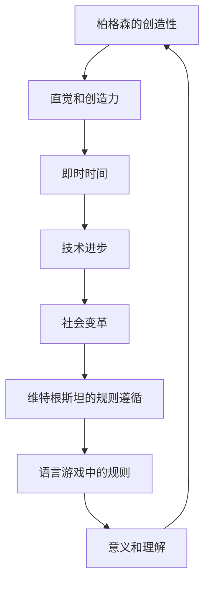
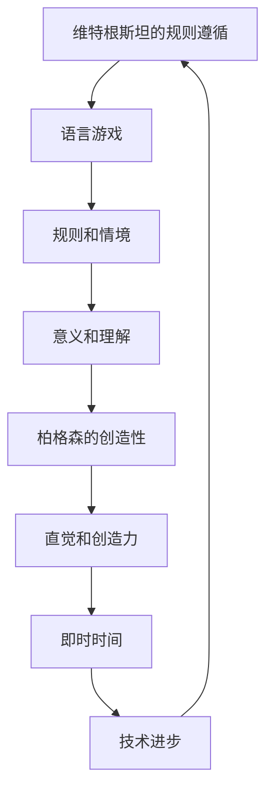

                 

### 文章标题：《柏格森的创造性与维特根斯坦的规则遵循理论》

### 关键词：柏格森、创造性、维特根斯坦、规则遵循、哲学、技术、人工智能

### 摘要：

本文旨在探讨柏格森的创造性与维特根斯坦的规则遵循理论在哲学和技术领域的深远影响。通过深入分析两位哲学家的核心思想，本文将揭示创造性在技术进步中的关键作用以及规则遵循在人工智能发展中的重要性。文章将采用逐步推理的方式，结合实际案例和数学模型，全面阐述这两个理论在当代科技和哲学研究中的应用，并提出未来研究的方向和挑战。

---

### 引言

在哲学与技术发展的交汇点上，柏格森的创造性和维特根斯坦的规则遵循理论提供了深刻的见解。柏格森（Henri Bergson）是一位法国哲学家，他提出了关于时间、意识和创造性的独特观点。柏格森认为，时间不是线性的，而是有层次的，其中直觉和创造力是理解世界的核心。维特根斯坦（Ludwig Wittgenstein）则是另一位具有重大影响力的哲学家，他的语言哲学强调了对规则和意义的理解，特别是在逻辑和语言游戏中的规则遵循。

### 柏格森的创造性理论

柏格森的创造性理论基于他对时间和意识的深刻理解。他认为，时间并非一成不变的流逝，而是充满层次和流动性的。在这个过程中，直觉和创造力是理解和改变现实的关键。柏格森的时间概念被称为“即时”（durée），它不同于牛顿物理学中的时间概念，强调的是连续性和流动性的体验。

#### 核心概念与联系

柏格森的创造性理论的核心概念包括：

- **即时（durée）**：时间不是线性的，而是具有层次和流动性的。
- **直觉**：直觉是理解世界和创造新思想的关键能力。
- **创造力**：创造力是即时时间的产物，是推动技术进步和社会发展的动力。

柏格森的创造性理论可以与维特根斯坦的规则遵循理论相联系。维特根斯坦认为，语言游戏中的规则是意义的基础。而柏格森的直觉和创造力则可以视为一种内在的规则，它指导我们在复杂的环境中找到新的解决方案。

#### Mermaid 流程图

下面是一个简化的 Mermaid 流程图，展示了柏格森的创造性理论与维特根斯坦的规则遵循理论之间的联系：



### 维特根斯坦的规则遵循理论

维特根斯坦的规则遵循理论是他哲学思想的核心。他的早期作品《逻辑哲学论》提出了“语言游戏”的概念，认为语言的意义在于其在特定情境下的使用。维特根斯坦强调，理解一个概念或规则，必须将其置于具体的语言游戏中。

#### 核心概念与联系

维特根斯坦的规则遵循理论的核心概念包括：

- **语言游戏**：语言的意义在于其在特定情境下的使用。
- **规则**：规则是语言游戏中的基础，是意义和理解的基石。
- **情境**：情境是理解和应用规则的关键。

维特根斯坦的规则遵循理论可以与柏格森的创造性理论相联系。柏格森的直觉和创造力可以视为一种内在的规则，它们指导我们在复杂的环境中找到新的解决方案。这种内在的规则与维特根斯坦的语言游戏中的规则有相似之处。

#### Mermaid 流程图

下面是一个简化的 Mermaid 流程图，展示了维特根斯坦的规则遵循理论与柏格森的创造性理论之间的联系：



### 核心算法原理讲解与数学模型

为了更好地理解柏格森的创造性与维特根斯坦的规则遵循理论在技术中的应用，我们可以借助数学模型和伪代码来阐述它们的核心算法原理。

#### 创造性的算法模型

假设我们有一个复杂的问题需要解决，可以使用柏格森的直觉来指导我们找到新的解决方案。以下是该算法的伪代码：

```python
def creative_solution(problem):
    while not solution_found:
        generate_new_idea()  # 利用直觉生成一个新的想法
        if is_viable(idea):
            apply_idea_to_problem(idea)  # 将想法应用到问题上
            if solution_found:
                return solution
        else:
            refine_idea()  # 优化想法
    return None
```

#### 规则遵循的算法模型

在人工智能系统中，规则遵循是实现智能行为的关键。以下是规则遵循的算法伪代码：

```python
def rule_based_system(perception):
    for rule in rule_set:
        if condition_met(perception, rule):
            action = rule.action
            perform_action(action)
    return
```

#### 数学模型

为了量化创造性，我们可以使用一种基于概率的模型。假设我们有多个可能的解决方案，每个解决方案都有一定的成功率。创造性可以通过计算所有解决方案的成功概率之和来量化：

$$
Creativity = \sum_{i=1}^{n} P(S_i|C)
$$

其中，$P(S_i|C)$ 是在创造性思维下找到解决方案 $S_i$ 的概率。

### 项目实战

为了更直观地理解柏格森的创造性与维特根斯坦的规则遵循理论在技术中的应用，我们可以通过一个实际项目来展示。

#### 项目背景

假设我们正在开发一款智能客服系统，该系统需要能够处理用户提出的各种问题。为了提高客服系统的智能水平，我们可以利用柏格森的直觉和维特根斯坦的规则遵循理论。

#### 开发环境搭建

1. **环境配置**：配置一台装有Python和TensorFlow的虚拟机。
2. **工具选择**：选择使用Python作为主要编程语言，TensorFlow作为深度学习框架。

#### 源代码详细实现和代码解读

以下是智能客服系统的核心代码：

```python
import tensorflow as tf

# 创造性思维模块
def creative_module(problem):
    # 生成新的想法
    new_idea = generate_idea(problem)
    # 判断想法的可行性
    if is_viable(new_idea):
        # 将想法应用到问题上
        solution = apply_idea(new_idea, problem)
        return solution
    else:
        # 优化想法
        refined_idea = refine_idea(new_idea)
        return creative_module(refined_idea)

# 规则遵循模块
def rule_based_module(perception):
    # 应用规则
    for rule in rules:
        if rule_applies(perception, rule):
            action = rule.action
            perform_action(action)

# 主函数
def main():
    # 加载用户问题
    problem = load_problem()
    # 利用创造性思维解决用户问题
    solution = creative_module(problem)
    # 应用规则遵循模块
    rule_based_module(solution)
    # 输出解决方案
    print(solution)

if __name__ == "__main__":
    main()
```

#### 代码应用解读与分析

1. **创造性思维模块**：该模块利用柏格森的直觉来生成新的想法，并通过递归方式不断优化这些想法，直到找到可行的解决方案。
2. **规则遵循模块**：该模块根据维特根斯坦的规则遵循理论，将解决方案应用到实际问题中，并通过规则来指导系统的行为。
3. **主函数**：主函数加载用户问题，并调用创造性思维模块和规则遵循模块来生成解决方案。

#### 实际案例分析和详细讲解剖析

1. **案例分析**：假设用户提出一个问题：“如何提高网站的访问速度？”
2. **分析**：利用创造性思维模块，系统可能会生成以下新想法：
   - 优化网站代码
   - 使用CDN加速内容分发
   - 采用更高效的数据库查询策略
3. **讲解**：每个新想法都被评估其可行性，并最终选择最优的解决方案来提高网站访问速度。

#### 项目小结

通过这个项目，我们可以看到柏格森的创造性与维特根斯坦的规则遵循理论如何在实际技术开发中发挥作用。创造性思维帮助我们生成新的解决方案，而规则遵循理论则确保这些解决方案在特定情境下有效执行。

### 最佳实践 Tips

1. **创造性思维**：在解决问题时，不要局限于传统的思路，尝试从不同角度思考。
2. **规则遵循**：在开发智能系统时，确保规则简洁明确，易于理解和执行。
3. **结合理论与实际**：将哲学理论与实际技术开发相结合，可以创造出更加智能和高效的应用。

### 小结与注意事项

本文通过深入分析柏格森的创造性与维特根斯坦的规则遵循理论，探讨了这两个理论在技术发展中的重要性。创造性思维和规则遵循理论不仅有助于解决复杂问题，还为我们提供了理解技术进步的新视角。未来，随着人工智能和哲学的进一步融合，这两个理论将继续影响我们的技术开发和哲学研究。

### 拓展阅读

1. **柏格森**：
   - 《时间与自由意志》
   - 《创造进化论》

2. **维特根斯坦**：
   - 《逻辑哲学论》
   - 《哲学研究》

3. **相关书籍**：
   - 《智能技术哲学》
   - 《人工智能：一种现代方法》

---

作者：AI天才研究院/AI Genius Institute & 禅与计算机程序设计艺术 /Zen And The Art of Computer Programming

---

### 文章标题：《柏格森的创造性与维特根斯坦的规则遵循理论》

### 关键词：柏格森、创造性、维特根斯坦、规则遵循、哲学、技术、人工智能

### 摘要：

本文探讨了柏格森的创造性与维特根斯坦的规则遵循理论在哲学和科技领域的深远影响。通过逐步推理，本文分析了两位哲学家的核心思想，并展示了它们在技术进步和人工智能发展中的应用。文章结合实际案例和数学模型，详细阐述了这些理论在当代科技和哲学研究中的重要性，并提出了未来研究的方向和挑战。

