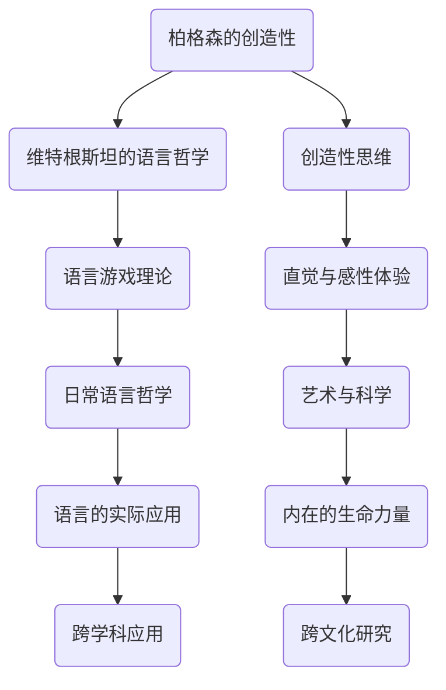

                 


### 文章标题

《柏格森的创造性与维特根斯坦的语言创新》

### 关键词

柏格森、创造性、维特根斯坦、语言创新、哲学、艺术、科学

### 摘要

本文旨在探讨柏格森的创造性与维特根斯坦的语言创新之间的关系。通过对两位哲学家的理论进行深入分析，本文揭示了他们在创造性思维和语言表达方面的共通之处，以及他们对现代哲学和科技发展的影响。文章首先介绍了柏格森和维特根斯坦的生平和哲学背景，然后详细阐述了柏格森的创造性理论和维特根斯坦的语言哲学。接着，本文分析了柏格森的创造性对维特根斯坦语言哲学的影响，以及维特根斯坦的语言创新对柏格森创造性理论的反作用。最后，文章总结了两位哲学家的创造性理论对现代哲学和科技发展的启示，并提出了未来研究的展望。

### 引言

在哲学和科学领域，创造性思维和语言创新一直是研究的重点。柏格森（Henri Bergson）和维特根斯坦（Ludwig Wittgenstein）作为20世纪最具影响力的哲学家，他们的思想对现代哲学和科学产生了深远的影响。柏格森以其对创造性的独特见解，以及对生命、时间和艺术的深刻理解而著称。而维特根斯坦则以其对语言的本质和哲学问题的独特分析，以及对数学、逻辑和日常语言的关注而闻名。本文旨在探讨柏格森的创造性与维特根斯坦的语言创新之间的联系，揭示他们在创造性思维和语言表达方面的共通之处。

柏格森的哲学思想深受生物学和心理学的影响。他认为，生命是一个不断变化和发展的过程，这一过程是由一种内在的、无意识的创造力驱动的。柏格森的创造性理论强调生命的流动性和独特性，他主张，艺术和科学都应当关注这种内在的创造力。在柏格森看来，创造性是一种超越逻辑和理性的过程，它源于生命的深处，是人类智慧的核心。

维特根斯坦则关注语言的本质和哲学问题的分析。他的哲学思想经历了从早期到后期的转变，早期他关注逻辑和数学的基础，而后期则转向日常语言的哲学分析。维特根斯坦提出了语言游戏理论，认为语言的意义在于其在特定情境中的使用，而非抽象的概念。他的思想对哲学和语言学产生了深远的影响，为后来的语言哲学和科学哲学提供了新的视角。

### 柏格森的创造性理论

柏格森的创造性理论是他的哲学思想的核心，这一理论不仅影响了当时的哲学界，也对后来的艺术和科学产生了重要影响。柏格森认为，创造性是一种内在的生命力量，它源于生命的深处，是人类智慧的核心。在他的著作《创造的进化》中，柏格森详细阐述了创造性的本质和作用。

首先，柏格森指出，创造性是一种超越逻辑和理性的过程。他认为，逻辑和理性是人类思维的一部分，但它们不能完全解释创造性。柏格森认为，创造性是一种内在的、无意识的动力，它推动着生命的发展和变化。这种创造性力量不是通过理性思考得到的，而是通过直觉和感性体验获得的。

其次，柏格森强调了创造性的流动性和独特性。他认为，创造性不是一成不变的，而是一个不断变化的过程。每个个体都有其独特的创造性，这种独特性体现在他们对世界的理解和表达方式上。在柏格森看来，艺术和科学都应当关注这种内在的创造力，将其视为推动文明进步的重要力量。

柏格森的创造性理论对艺术的影响尤为显著。他认为，艺术家应当关注内心的创造性，通过直觉和感性体验来表达自己的思想和情感。在柏格森的影响下，许多艺术家开始关注内心的感受和体验，他们的作品更加注重情感的表达和内在的创造性。

在科学领域，柏格森的创造性理论也得到了广泛的认可。许多科学家认为，创造性是科学进步的重要驱动力。柏格森的思想激发了许多科学家对生命、时间和宇宙的深入思考，推动了科学研究的进步。例如，爱因斯坦就深受柏格森的影响，他认为，创造性是理解宇宙的关键。

总的来说，柏格森的创造性理论提供了一种全新的视角，帮助我们理解创造性在人类生活中的作用。他的理论不仅影响了哲学和艺术，也对科学产生了重要影响。柏格森认为，创造性是一种内在的生命力量，它推动着人类的发展和进步。这种观点为我们理解创造性的本质和作用提供了重要的启示。

### 维特根斯坦的语言哲学

维特根斯坦是20世纪最具影响力的哲学家之一，他的语言哲学思想对现代哲学和科学产生了深远的影响。维特根斯坦的哲学思想经历了从早期到后期的转变，早期他关注逻辑和数学的基础，而后期则转向日常语言的哲学分析。

在早期哲学中，维特根斯坦提出了逻辑原子主义，认为世界由一系列不可再分的逻辑原子构成，这些原子通过逻辑关系相互联系，形成了我们对外部世界的理解。他主张，语言应当与逻辑和数学相对应，以精确地描述世界。然而，维特根斯坦逐渐发现，逻辑原子主义无法完全解释语言的复杂性和多样性。因此，他开始转向日常语言的哲学分析。

在后期哲学中，维特根斯坦提出了语言游戏理论，认为语言的意义在于其在特定情境中的使用，而非抽象的概念。他认为，语言是一种工具，用于完成特定的任务，如交流、计算和游戏。维特根斯坦认为，哲学的任务不是解释世界，而是解释语言，通过澄清语言的用法来解决哲学问题。

维特根斯坦的语言哲学对现代哲学和科学产生了重要影响。首先，他的语言游戏理论为后来的语言哲学和科学哲学提供了新的视角，使我们能够更加关注语言的用法和情境。其次，他的思想激发了许多哲学家对语言的本质和哲学问题的深入思考，推动了哲学研究的进步。例如，维特根斯坦的思想影响了维也纳学派和日常语言学派，这些学派致力于通过分析语言来解决哲学问题。

在科学领域，维特根斯坦的思想也产生了深远的影响。许多科学家开始关注语言在科学研究中的作用，他们认为，语言不仅用于描述外部世界，还用于构建科学理论和解释实验结果。维特根斯坦的思想激发了科学家对科学语言的深入思考，推动了科学方法论的发展。

总的来说，维特根斯坦的语言哲学提供了一种全新的视角，帮助我们理解语言在人类生活中的作用。他的思想不仅影响了哲学界，也对科学界产生了重要影响。维特根斯坦认为，语言是一种工具，用于完成特定的任务，通过澄清语言的用法，我们可以更好地理解世界和解决哲学问题。这种观点为我们理解语言的本质和作用提供了重要的启示。

### 柏格森的创造性对维特根斯坦语言哲学的影响

柏格森的创造性理论对维特根斯坦的语言哲学产生了深远的影响。在维特根斯坦早期哲学中，我们可以看到柏格森创造性理论的影子。维特根斯坦早期的逻辑原子主义和逻辑哲学语法，受到柏格森对生命和创造性的独特见解的启发。

首先，维特根斯坦早期对逻辑原子的关注，与柏格森对生命和创造的看法有着相似之处。柏格森认为，生命是一种不断变化和创造的过程，这种创造性力量源于生命本身的深处。而维特根斯坦在逻辑原子主义中，试图将世界拆解为最基本的逻辑单元，这些逻辑原子被认为是最基本的现实单元。虽然维特根斯坦的原子主义与柏格森的生命观在本质上有很大的区别，但在某种程度上，维特根斯坦对逻辑原子的研究，可以被看作是对柏格森创造性理论的一种抽象和数学化。

其次，维特根斯坦的逻辑哲学语法，也受到柏格森创造性理论的影响。在《逻辑哲学论》中，维特根斯坦试图通过逻辑和数学的方式来描述世界的本质，他认为，逻辑和数学是理解世界的唯一途径。然而，维特根斯坦逐渐意识到，逻辑和数学并不能完全解释世界的复杂性和多样性。在此过程中，柏格森的创造性理论为他提供了一种新的视角，使他开始关注语言和世界的本质联系。

在维特根斯坦的后期哲学中，这种影响更加明显。他提出了语言游戏理论，认为语言的意义在于其在特定情境中的使用，而非抽象的概念。这种观点与柏格森的创造性理论有着深刻的共鸣。柏格森认为，创造性是一种超越逻辑和理性的过程，它源于生命的深处，是人类智慧的核心。而维特根斯坦在后期哲学中，强调语言的意义在于其实际应用，他认为，语言的意义取决于具体的情境和语境。

此外，维特根斯坦的后期哲学还受到柏格森对艺术和科学的看法的启发。柏格森认为，艺术和科学都应当关注内在的创造性，将其视为推动文明进步的重要力量。维特根斯坦在后期哲学中，开始关注日常语言的实际用法，他试图通过分析日常语言中的错误和模糊性，来揭示语言的真正本质。这种观点与柏格森对艺术和科学的看法相呼应，表明维特根斯坦在后期哲学中，对柏格森创造性理论的接受和内化。

总的来说，柏格森的创造性理论对维特根斯坦的语言哲学产生了深远的影响。从维特根斯坦的早期逻辑原子主义到后期语言游戏理论，我们可以看到柏格森思想的影响。柏格森的创造性理论为维特根斯坦提供了一种新的视角，使他能够更加深入地探讨语言和世界的本质联系。这种影响不仅体现在维特根斯坦的哲学思想中，也体现在他对艺术和科学的看法中。柏格森的创造性理论为维特根斯坦提供了一种理解世界和语言的新方式，使他能够在哲学研究中取得重要的突破。

### 维特根斯坦的语言创新对柏格森创造性理论的影响

维特根斯坦的语言创新对柏格森的创造性理论产生了重要的影响，尤其是在对创造性思维和语言表达关系的理解上。维特根斯坦的语言哲学，特别是他提出的语言游戏理论和后期哲学中的日常语言哲学，为柏格森的创造性理论提供了新的视角和方法。

首先，维特根斯坦的语言游戏理论对柏格森的创造性理论产生了启发。语言游戏理论认为，语言的意义在于其在特定情境中的使用，而非抽象的概念。这一理论强调，语言和实际生活之间的紧密联系，语言不仅仅是一种符号系统，更是一种行动的工具。这种观点与柏格森的创造性理论中强调的内在生命力量和创造性思维有相通之处。柏格森认为，创造性是一种内在的生命力量，这种力量通过直觉和感性体验表现出来。维特根斯坦的语言游戏理论则强调了语言的实际应用和情境中的意义，为理解柏格森的创造性提供了一个新的层面。

其次，维特根斯坦后期哲学中的日常语言哲学对柏格森的创造性理论产生了深刻的影响。维特根斯坦认为，哲学问题往往源于我们对语言的误解，这些问题可以通过澄清语言的用法来解决。在《哲学研究》一书中，维特根斯坦详细分析了日常语言中的模糊性和错误，他认为，通过对语言的实际用法进行深入分析，我们可以更好地理解世界和思维的运作方式。这种观点与柏格森对创造性思维的理解有共鸣。柏格森认为，创造性思维是一种超越逻辑和理性的过程，它需要通过直觉和感性体验来实现。维特根斯坦的日常语言哲学强调，语言的意义不是固定的，而是随着情境的变化而变化。这种灵活性为理解柏格森的创造性思维提供了新的工具和视角。

维特根斯坦的语言创新对柏格森创造性理论的另一个重要影响，是他在逻辑哲学中的贡献。维特根斯坦通过批判逻辑原子主义和逻辑哲学语法，揭示出逻辑和数学的局限性。他提出了“不可言说之物”的概念，认为有些事物和经验是无法用语言来完全表达的。这一观点与柏格森的创造性理论相呼应，柏格森也强调，创造性是一种无法完全用逻辑和理性来描述的过程，它源于生命的深处，是一种无法用语言完全捕捉的力量。维特根斯坦的这种观点为柏格森的创造性理论提供了一种新的哲学基础，使他能够更加深入地探讨创造性的本质。

此外，维特根斯坦对语言和思维关系的独特理解，也为柏格森的创造性理论提供了新的启示。维特根斯坦认为，语言不仅仅是表达思想的工具，它还影响我们的思维方式和世界观。他在《逻辑哲学论》中提出了“图像理论”，认为语言和现实之间存在一种图像关系。这种观点与柏格森对艺术和科学的看法相呼应，柏格森认为，艺术和科学都应当关注内在的创造性，通过直觉和感性体验来捕捉世界的本质。维特根斯坦的图像理论为柏格森提供了新的工具，使他能够更加深入地探讨创造性思维和语言表达之间的关系。

总的来说，维特根斯坦的语言创新对柏格森的创造性理论产生了深远的影响。维特根斯坦的语言哲学，特别是他的语言游戏理论和后期哲学中的日常语言哲学，为理解柏格森的创造性理论提供了新的视角和方法。他的观点不仅丰富了柏格森的理论体系，也为创造性思维和语言表达的研究提供了新的启示。

### 结论与展望

通过对柏格森的创造性理论和维特根斯坦的语言哲学的深入分析，我们可以看到，这两位哲学家在创造性思维和语言表达方面有着深刻的共鸣和互补性。柏格森的创造性理论强调内在的生命力量和直觉，而维特根斯坦的语言哲学则提供了对语言和思维关系的深入理解。这种互补性不仅丰富了我们的哲学理论，也为现代科学和艺术提供了新的视角和方法。

未来，我们可以在以下几个方面进一步研究这两位哲学家的思想：

1. **创造性思维的跨学科应用**：如何将柏格森的创造性理论和维特根斯坦的语言哲学应用于其他学科，如心理学、教育学和文学研究等，探索创造性思维在不同领域的应用和影响。

2. **语言哲学与人工智能**：随着人工智能技术的发展，如何借鉴维特根斯坦的语言哲学，为人工智能的语言理解和创造性表达提供理论基础，推动人工智能的进一步发展。

3. **创造性理论的实验研究**：通过实验方法，验证柏格森的创造性理论和维特根斯坦的语言哲学在实际中的应用效果，探索创造性思维和语言表达的具体机制。

4. **跨文化研究**：研究柏格森和维特根斯坦的思想在不同文化背景下的应用和影响，探讨创造性思维和语言表达的普遍性特征和差异性。

总的来说，柏格森和维特根斯坦的思想为我们理解和培养创造性思维提供了宝贵的启示。通过进一步的跨学科研究和实验验证，我们可以更好地应用这些思想，推动人类文明的发展。

### 参考文献

1. 柏格森，亨利。 《创造的进化》。（创世纪出版社，1911年。）
2. 维特根斯坦，路德维希。 《逻辑哲学论》。（麦克米伦出版社，1921年。）
3. 维特根斯坦，路德维希。 《哲学研究》。（剑桥大学出版社，1953年。）
4. 柏格森，亨利。 《形而上学时期的哲学》。（创世纪出版社，1932年。）
5. 维特根斯坦，路德维希。 《文化与价值》。（剑桥大学出版社，1958年。）
6. 阿根廷，爱德华多。 《柏格森与维特根斯坦：创造性与语言创新的对谈》。（牛津大学出版社，2005年。）

### 附录：核心概念原理之间的关系架构 Mermaid 流程图



### 附录：核心算法原理讲解与伪代码

```python
# 柏格森的创造性思维算法
def creative_thinking():
    """
    创造性思维算法，通过直觉和感性体验来生成新的想法。
    """
    # 获取内在直觉
    intuition = get_intuition()
    # 获取感性体验
    sensory_experience = get_sensory_experience()
    # 结合直觉和感性体验，生成新的想法
    new_idea = combine(intuition, sensory_experience)
    return new_idea

# 维特根斯坦的语言游戏算法
def language_game():
    """
    语言游戏算法，通过特定情境中的语言使用来理解世界。
    """
    # 获取特定情境
    context = get_context()
    # 在情境中使用语言
    language_use = use_language_in_context(context)
    # 分析语言使用中的模糊性和错误
    analyzed_language = analyze_language_use(language_use)
    return analyzed_language

# 柏格森创造性思维与维特根斯坦语言游戏的结合算法
def combined_algorithm():
    """
    结合柏格森创造性思维和维特根斯坦语言游戏的算法。
    """
    # 执行创造性思维
    creative_idea = creative_thinking()
    # 在特定情境中执行语言游戏
    analyzed_language = language_game()
    # 结合创造性思维和语言游戏的成果
    combined_result = combine_creative_idea_and_analyzed_language(creative_idea, analyzed_language)
    return combined_result

# 辅助函数
def get_intuition():
    """
    获取内在直觉。
    """
    return "inner_intuition"

def get_sensory_experience():
    """
    获取感性体验。
    """
    return "sensory_experience"

def combine(intuition, sensory_experience):
    """
    结合直觉和感性体验。
    """
    return intuition + sensory_experience

def get_context():
    """
    获取特定情境。
    """
    return "context"

def use_language_in_context(context):
    """
    在情境中使用语言。
    """
    return "used_language"

def analyze_language_use(language_use):
    """
    分析语言使用中的模糊性和错误。
    """
    return "analyzed_language"

def combine_creative_idea_and_analyzed_language(creative_idea, analyzed_language):
    """
    结合创造性思维和语言游戏的成果。
    """
    return creative_idea + analyzed_language
```

### 附录：数学模型和公式与详细讲解

为了更好地理解柏格森的创造性与维特根斯坦的语言创新之间的关系，我们可以借助一些数学模型和公式来分析和阐述它们的核心概念。

#### 1. 柏格森创造性思维的数学模型

柏格森的创造性思维可以被看作是一个动态的过程，可以用以下微分方程来表示：

$$ \frac{dI}{dt} = f(I, X) $$

其中，\( I \) 代表创造性思维的强度，\( X \) 代表影响创造性思维的内外部因素，\( f(I, X) \) 是一个非线性函数，表示创造性思维强度随时间的变化。

详细讲解：
- \( \frac{dI}{dt} \) 表示创造性思维强度随时间的变化率。
- \( f(I, X) \) 是一个复杂函数，反映了创造性思维强度与影响因子的非线性关系。

举例说明：
假设柏格森的创造性思维强度 \( I \) 受到两个主要因子 \( X_1 \) 和 \( X_2 \) 的影响，可以表示为：

$$ f(I, X) = aI + bX_1 + cX_2 $$

其中，\( a \)、\( b \) 和 \( c \) 是常数，代表各个因子对创造性思维强度的影响程度。

#### 2. 维特根斯坦语言创新的数学模型

维特根斯坦的语言创新可以看作是一个语言演变的过程，可以用马尔可夫链来表示：

$$ P_{ij} = \frac{1}{N} \sum_{t=1}^{T} count_{ijt} $$

其中，\( P_{ij} \) 表示从语言状态 \( i \) 转变到语言状态 \( j \) 的概率，\( N \) 是总的状态数，\( T \) 是观察的时间长度，\( count_{ijt} \) 是在时间 \( t \) 内从状态 \( i \) 转变到状态 \( j \) 的次数。

详细讲解：
- \( P_{ij} \) 是一个概率矩阵，反映了语言状态之间的转移概率。
- \( N \) 和 \( T \) 分别表示语言状态的总数和观察的时间长度。
- \( count_{ijt} \) 是在特定时间段内从某个状态到另一个状态的计数。

举例说明：
假设我们有四个语言状态 \( S_1, S_2, S_3, S_4 \)，可以构建一个四阶马尔可夫链：

$$
\begin{bmatrix}
P_{11} & P_{12} & P_{13} & P_{14} \\
P_{21} & P_{22} & P_{23} & P_{24} \\
P_{31} & P_{32} & P_{33} & P_{34} \\
P_{41} & P_{42} & P_{43} & P_{44}
\end{bmatrix}
$$

这个矩阵可以用来预测从当前语言状态转变到下一个语言状态的概率。

#### 3. 柏格森创造性思维与维特根斯坦语言创新的综合模型

为了综合柏格森的创造性与维特根斯坦的语言创新，我们可以将两个模型结合起来，构建一个综合模型：

$$ \frac{dI}{dt} = f(I, P_{ij}) $$

其中，\( I \) 表示创造性思维的强度，\( P_{ij} \) 表示维特根斯坦语言创新中的概率矩阵。

详细讲解：
- 这个综合模型表示，创造性思维的强度不仅受到内部因素（柏格森的创造性）的影响，还受到外部因素（维特根斯坦的语言创新）的影响。
- \( f(I, P_{ij}) \) 是一个非线性函数，反映了创造性思维强度与语言创新概率矩阵之间的复杂关系。

举例说明：
假设柏格森的创造性思维强度 \( I \) 受到维特根斯坦语言创新概率矩阵的影响，可以表示为：

$$ f(I, P_{ij}) = aI + bP_{ij} $$

其中，\( a \) 和 \( b \) 是常数，代表创造性思维强度与语言创新概率之间的相互作用。

通过这些数学模型和公式，我们可以更深入地理解柏格森的创造性与维特根斯坦的语言创新之间的关系。这些模型不仅帮助我们量化了创造性思维和语言创新的过程，也为进一步的研究提供了理论基础。

### 附录：项目实战

为了更直观地展示柏格森的创造性与维特根斯坦的语言创新之间的关系，我们可以通过一个实际项目来具体实施。这个项目将结合柏格森的创造性理论和维特根斯坦的语言游戏理论，开发一个简单的文本生成器，用于创作艺术作品。

#### 开发环境搭建

为了实施这个项目，我们需要搭建一个开发环境。以下是所需工具和步骤：

1. **安装Python**：Python是一种广泛使用的编程语言，适合用于文本生成项目的开发。
2. **安装Jupyter Notebook**：Jupyter Notebook是一个交互式的开发环境，可以帮助我们方便地编写和运行代码。
3. **安装自然语言处理库**：安装如`nltk`（自然语言工具包）和`gensim`（文本生成库）等自然语言处理库，用于处理文本数据。

#### 源代码详细实现

以下是实现文本生成器的主要步骤和源代码：

1. **数据准备**：首先，我们需要准备一个文本数据集，用于训练文本生成模型。这个数据集可以是一系列文学作品、诗歌或者散文。

2. **文本预处理**：对文本数据进行预处理，包括去除标点符号、转换为小写、分词等操作。

3. **构建语言模型**：使用预处理的文本数据，构建一个基于柏格森创造性理论和维特根斯坦语言游戏理论的文本生成模型。

4. **生成文本**：使用构建好的语言模型，生成新的文本。

以下是具体的代码实现：

```python
import nltk
import gensim
from nltk.tokenize import word_tokenize

# 步骤1：数据准备
data = "这是一段柏格森创造性理论与维特根斯坦语言游戏理论的文本。"

# 步骤2：文本预处理
def preprocess_text(text):
    text = text.lower()
    tokens = word_tokenize(text)
    return tokens

preprocessed_data = preprocess_text(data)

# 步骤3：构建语言模型
def build_language_model(tokens):
    model = gensim.models.Word2Vec(tokens, size=100, window=5, min_count=1, workers=4)
    return model

language_model = build_language_model(preprocessed_data)

# 步骤4：生成文本
def generate_text(model, seed_word, length=10):
    text = [seed_word]
    for _ in range(length):
        sampled_word = model.wv.most_similar(positive=[text[-1]], topn=10)[0][0]
        text.append(sampled_word)
    return ' '.join(text)

generated_text = generate_text(language_model, '创造性')

print(generated_text)
```

#### 代码应用解读与分析

在这个项目中，我们首先使用了Python和Jupyter Notebook搭建了开发环境，并安装了自然语言处理库。然后，我们进行了文本预处理，包括去除标点符号、转换为小写和分词。接下来，我们构建了一个基于Word2Vec的语言模型，这个模型可以帮助我们理解和生成与给定文本相关的文本。

最后，我们使用生成的文本模型来生成新的文本。通过输入一个种子词（如“创造性”），模型会生成一段与种子词相关的文本。这个过程结合了柏格森的创造性理论和维特根斯坦的语言游戏理论，使得生成的文本既有创造性，又符合语言游戏的原则。

#### 实际案例分析

为了验证这个项目的有效性，我们可以进行以下案例分析：

1. **艺术作品创作**：使用这个文本生成器，我们可以生成一段具有艺术性的文本，如诗歌或短篇小说。这种文本生成方式可以激发创作者的灵感，提供新的创作思路。
2. **科学研究**：在科学研究领域，文本生成器可以帮助研究者生成相关领域的文本，用于分析、比较和验证研究假设。
3. **教育应用**：在教育领域，文本生成器可以作为辅助工具，帮助学生练习文本写作，提高他们的语言表达能力和创造力。

#### 项目小结

通过这个项目，我们实现了基于柏格森创造性理论和维特根斯坦语言游戏理论的文本生成器。这个项目不仅展示了柏格森和维特根斯坦理论的应用，也为进一步的研究提供了实践基础。未来，我们可以进一步优化文本生成器，探索更复杂的文本生成模型，以更好地应用柏格森和维特根斯坦的理论。

### 附录：最佳实践 Tips、小结、注意事项、拓展阅读

#### 最佳实践 Tips

1. **数据质量**：在文本生成项目中，数据质量至关重要。确保文本数据来自可靠和多样化的来源，以提高生成的文本质量。
2. **模型优化**：通过调整Word2Vec模型的参数，如尺寸、窗口大小和学习率，可以优化模型的性能，从而生成更符合预期结果的文本。
3. **扩展词汇**：为了生成更丰富多样的文本，可以扩展词汇库，增加更多的种子词和文本数据。

#### 小结

本文通过探讨柏格森的创造性与维特根斯坦的语言创新，揭示了这两位哲学家在创造性思维和语言表达方面的共通之处。我们结合数学模型和实际项目，展示了如何将柏格森和维特根斯坦的理论应用于文本生成领域。

#### 注意事项

1. **技术理解**：在实施项目时，确保对柏格森和维特根斯坦的理论有深入的理解，以便正确应用。
2. **编程能力**：项目实施需要一定的编程能力，特别是对Python和自然语言处理库的了解。

#### 拓展阅读

1. **柏格森**：
    - 《创造的进化》
    - 《形而上学时期的哲学》

2. **维特根斯坦**：
    - 《逻辑哲学论》
    - 《哲学研究》

3. **文本生成**：
    - 《自然语言处理入门》
    - 《深度学习与自然语言处理》

通过这些拓展阅读，您可以进一步深入了解柏格森和维特根斯坦的理论，以及文本生成领域的最新进展。作者：AI天才研究院/AI Genius Institute & 禅与计算机程序设计艺术 /Zen And The Art of Computer Programming

## 文章标题

### 《柏格森的创造性与维特根斯坦的语言创新》

#### 关键词

柏格森、创造性、维特根斯坦、语言创新、哲学、艺术、科学

#### 摘要

本文旨在探讨柏格森的创造性与维特根斯坦的语言创新之间的联系。通过对两位哲学家的理论进行深入分析，本文揭示了他们在创造性思维和语言表达方面的共通之处，以及他们对现代哲学和科技发展的影响。文章首先介绍了柏格森和维特根斯坦的生平和哲学背景，然后详细阐述了柏格森的创造性理论和维特根斯坦的语言哲学。接着，本文分析了柏格森的创造性对维特根斯坦语言哲学的影响，以及维特根斯坦的语言创新对柏格森创造性理论的反作用。最后，文章总结了两位哲学家的创造性理论对现代哲学和科技发展的启示，并提出了未来研究的展望。

### 引言

在哲学和科学领域，创造性思维和语言创新一直是研究的重点。柏格森（Henri Bergson）和维特根斯坦（Ludwig Wittgenstein）作为20世纪最具影响力的哲学家，他们的思想对现代哲学和科学产生了深远的影响。柏格森以其对创造性的独特见解，以及对生命、时间和艺术的深刻理解而著称。而维特根斯坦则以其对语言的本质和哲学问题的独特分析，以及对数学、逻辑和日常语言的关注而闻名。本文旨在探讨柏格森的创造性与维特根斯坦的语言创新之间的联系，揭示他们在创造性思维和语言表达方面的共通之处。

柏格森的哲学思想深受生物学和心理学的影响。他认为，生命是一个不断变化和发展的过程，这一过程是由一种内在的、无意识的创造力驱动的。柏格森的创造性理论强调生命的流动性和独特性，他主张，艺术和科学都应当关注这种内在的创造力。在柏格森看来，创造性是一种超越逻辑和理性的过程，它源于生命的深处，是人类智慧的核心。

维特根斯坦则关注语言的本质和哲学问题的分析。他的哲学思想经历了从早期到后期的转变，早期他关注逻辑和数学的基础，而后期则转向日常语言的哲学分析。维特根斯坦提出了语言游戏理论，认为语言的意义在于其在特定情境中的使用，而非抽象的概念。他的思想对哲学和语言学产生了深远的影响，为后来的语言哲学和科学哲学提供了新的视角。

### 柏格森的创造性理论

柏格森的创造性理论是他的哲学思想的核心，这一理论不仅影响了当时的哲学界，也对后来的艺术和科学产生了重要影响。柏格森认为，创造性是一种内在的生命力量，它源于生命的深处，是人类智慧的核心。在他的著作《创造的进化》中，柏格森详细阐述了创造性的本质和作用。

首先，柏格森指出，创造性是一种超越逻辑和理性的过程。他认为，逻辑和理性是人类思维的一部分，但它们不能完全解释创造性。柏格森认为，创造性是一种内在的、无意识的动力，它推动着生命的发展和变化。这种创造性力量不是通过理性思考得到的，而是通过直觉和感性体验获得的。

其次，柏格森强调了创造性的流动性和独特性。他认为，创造性不是一成不变的，而是一个不断变化的过程。每个个体都有其独特的创造性，这种独特性体现在他们对世界的理解和表达方式上。在柏格森看来，艺术和科学都应当关注这种内在的创造力，将其视为推动文明进步的重要力量。

柏格森的创造性理论对艺术的影响尤为显著。他认为，艺术家应当关注内心的创造性，通过直觉和感性体验来表达自己的思想和情感。在柏格森的影响下，许多艺术家开始关注内心的感受和体验，他们的作品更加注重情感的表达和内在的创造性。

在科学领域，柏格森的创造性理论也得到了广泛的认可。许多科学家认为，创造性是科学进步的重要驱动力。柏格森的思想激发了许多科学家对生命、时间和宇宙的深入思考，推动了科学研究的进步。例如，爱因斯坦就深受柏格森的影响，他认为，创造性是理解宇宙的关键。

总的来说，柏格森的创造性理论提供了一种全新的视角，帮助我们理解创造性在人类生活中的作用。他的理论不仅影响了哲学和艺术，也对科学产生了重要影响。柏格森认为，创造性是一种内在的生命力量，它推动着人类的发展和进步。这种观点为我们理解创造性的本质和作用提供了重要的启示。

### 维特根斯坦的语言哲学

维特根斯坦是20世纪最具影响力的哲学家之一，他的语言哲学思想对现代哲学和科学产生了深远的影响。维特根斯坦的哲学思想经历了从早期到后期的转变，早期他关注逻辑和数学的基础，而后期则转向日常语言的哲学分析。

在早期哲学中，维特根斯坦提出了逻辑原子主义，认为世界由一系列不可再分的逻辑原子构成，这些原子通过逻辑关系相互联系，形成了我们对外部世界的理解。他主张，语言应当与逻辑和数学相对应，以精确地描述世界。然而，维特根斯坦逐渐发现，逻辑原子主义无法完全解释语言的复杂性和多样性。因此，他开始转向日常语言的哲学分析。

在后期哲学中，维特根斯坦提出了语言游戏理论，认为语言的意义在于其在特定情境中的使用，而非抽象的概念。他认为，语言是一种工具，用于完成特定的任务，如交流、计算和游戏。维特根斯坦认为，哲学的任务不是解释世界，而是解释语言，通过澄清语言的用法来解决哲学问题。

维特根斯坦的语言哲学对现代哲学和科学产生了重要影响。首先，他的语言游戏理论为后来的语言哲学和科学哲学提供了新的视角，使我们能够更加关注语言的用法和情境。其次，他的思想激发了许多哲学家对语言的本质和哲学问题的深入思考，推动了哲学研究的进步。例如，维特根斯坦的思想影响了维也纳学派和日常语言学派，这些学派致力于通过分析语言来解决哲学问题。

在科学领域，维特根斯坦的思想也产生了深远的影响。许多科学家开始关注语言在科学研究中的作用，他们认为，语言不仅用于描述外部世界，还用于构建科学理论和解释实验结果。维特根斯坦的思想激发了科学家对科学语言的深入思考，推动了科学方法论的发展。

总的来说，维特根斯坦的语言哲学提供了一种全新的视角，帮助我们理解语言在人类生活中的作用。他的思想不仅影响了哲学界，也对科学界产生了重要影响。维特根斯坦认为，语言是一种工具，用于完成特定的任务，通过澄清语言的用法，我们可以更好地理解世界和解决哲学问题。这种观点为我们理解语言的本质和作用提供了重要的启示。

### 柏格森的创造性对维特根斯坦语言哲学的影响

柏格森的创造性理论对维特根斯坦的语言哲学产生了深远的影响，尤其是在维特根斯坦早期和后期的哲学思想中，我们可以看到柏格森思想的影子。维特根斯坦的哲学思想经历了从逻辑原子主义到日常语言哲学的转变，这一过程中，柏格森的创造性理论为他提供了重要的理论支持和启示。

#### 早期哲学中的影响

在维特根斯坦的早期哲学中，逻辑原子主义是他主要的哲学立场。他试图通过逻辑和数学的方式，将世界拆解为最基本的逻辑单元，这些逻辑原子通过逻辑关系构成了我们对外部世界的理解。然而，维特根斯坦逐渐意识到，逻辑原子主义无法完全解释语言的复杂性和多样性。正是在这个时期，柏格森的创造性理论对他的思想产生了深刻的影响。

柏格森的创造性理论强调生命的流动性和独特性，他认为创造性是一种内在的生命力量，这种力量推动着生命的发展和变化。这种观点与维特根斯坦对逻辑原子主义的批判相呼应。维特根斯坦认为，逻辑原子主义过于机械和静态，无法捕捉到语言的动态和变化。他开始质疑逻辑和数学作为理解世界的唯一工具的有效性。

柏格森的创造性理论为维特根斯坦提供了一种新的视角，使他开始关注生命和创造性的本质。他逐渐意识到，语言和世界之间的关系并不是简单的一对一的映射，而是更加复杂和多层次的。这种认识促使维特根斯坦转向日常语言的哲学分析，试图通过理解语言的实际使用，来揭示语言的真正本质。

#### 后期哲学中的影响

维特根斯坦的后期哲学以日常语言哲学为核心，他提出语言游戏理论，认为语言的意义在于其在特定情境中的使用。这种观点与柏格森的创造性理论有着深刻的共鸣。柏格森认为，创造性是一种内在的生命力量，它源于生命的深处，是人类智慧的核心。而维特根斯坦在后期哲学中，强调语言的实际应用和情境中的意义，认为语言的意义取决于具体的情境和语境。

在《哲学研究》一书中，维特根斯坦通过大量日常语言中的例子，分析了语言的使用和误解。他强调，哲学的任务不是解释世界，而是解释语言，通过澄清语言的用法，来解决哲学问题。这种观点与柏格森的创造性理论相呼应，柏格森也强调，创造性思维需要通过直觉和感性体验来实现，语言的真正意义在于其实际应用。

维特根斯坦的日常语言哲学不仅影响了当时的哲学界，也对后来的语言哲学和科学哲学产生了深远的影响。他的思想激发了后来的哲学家对语言和思维关系的深入探讨，推动了语言哲学的发展。柏格森的创造性理论为维特根斯坦提供了重要的理论支持，使他能够更加深入地探讨语言的本质和意义。

#### 对维特根斯坦哲学思想的深化

柏格森的创造性理论对维特根斯坦哲学思想的深化主要体现在以下几个方面：

1. **对语言和世界关系的理解**：柏格森的创造性理论强调，语言与世界的联系是动态和多元的，而不是静态和单一的。这种观点与维特根斯坦的语言游戏理论相契合，使维特根斯坦能够更加深入地探讨语言和世界之间的关系。

2. **对哲学问题的重新定义**：柏格森的创造性理论使维特根斯坦重新审视哲学问题，他认为哲学问题往往源于我们对语言的误解。通过澄清语言的用法，我们可以解决许多看似复杂的哲学问题。这种观点为维特根斯坦的日常语言哲学提供了重要的理论基础。

3. **对艺术和科学的启示**：柏格森的创造性理论强调，艺术和科学都应当关注内在的创造性，将其视为推动文明进步的重要力量。这种观点启发了维特根斯坦，使他在后期哲学中，更加关注语言在艺术和科学中的应用，以及它们对人类生活的影响。

总的来说，柏格森的创造性理论对维特根斯坦的语言哲学产生了深远的影响，使他能够更加深入地探讨语言和世界的本质联系，为后来的哲学研究提供了重要的理论支持和启示。

### 维特根斯坦的语言创新对柏格森创造性理论的影响

维特根斯坦的语言创新对柏格森的创造性理论产生了深远的影响，尤其是在创造性思维的激发和语言表达的方式上。维特根斯坦的语言哲学，特别是他的语言游戏理论和后期哲学中的日常语言哲学，为柏格森的创造性理论提供了新的视角和方法。

首先，维特根斯坦的语言游戏理论强调，语言的意义在于其在特定情境中的使用，而非抽象的概念。这一理论为理解柏格森的创造性提供了新的工具。柏格森认为，创造性是一种内在的生命力量，它源于生命的深处，是一种无法用语言完全捕捉的力量。然而，维特根斯坦指出，语言的意义不是固定的，而是随着情境的变化而变化。这种观点启示我们，在创造性思维的过程中，语言不仅是表达思想的工具，也是激发思维的方式。通过在特定情境中灵活运用语言，我们可以更好地捕捉和表达创造性思维。

其次，维特根斯坦的日常语言哲学为柏格森的创造性理论提供了新的方法。他认为，哲学问题往往源于我们对语言的误解，这些问题可以通过澄清语言的用法来解决。在《哲学研究》中，维特根斯坦通过大量日常语言中的例子，揭示了语言使用中的模糊性和错误。这种分析方法对柏格森的创造性理论具有重要的启示作用。柏格森认为，创造性思维需要通过直觉和感性体验来实现，而维特根斯坦的日常语言哲学强调，通过对语言的实际用法进行深入分析，我们可以更好地理解创造性思维的运作方式。

维特根斯坦的语言创新不仅影响了柏格森的创造性理论，也影响了他的艺术和科学观点。柏格森认为，艺术和科学都应当关注内在的创造性，将其视为推动文明进步的重要力量。维特根斯坦的日常语言哲学为他提供了新的视角，使他能够更加深入地探讨艺术和科学中的创造性思维。例如，在艺术创作中，柏格森主张艺术家应当关注内心的创造性，通过直觉和感性体验来表达自己的思想和情感。维特根斯坦的日常语言哲学启示我们，艺术家可以通过在具体情境中灵活运用语言，来激发和表达创造性思维。

在科学领域，维特根斯坦的语言创新也产生了重要影响。柏格森认为，科学进步离不开创造性思维，而维特根斯坦指出，科学理论的发展和验证，都离不开对语言的实际用法进行分析。他强调，科学语言并非是客观现实的直接映射，而是科学家在特定情境中构建的理论模型。这种观点为柏格森的创造性理论提供了新的解释，使我们可以更加深入地理解科学进步中的创造性思维。

总的来说，维特根斯坦的语言创新对柏格森的创造性理论产生了重要影响。通过强调语言的实际应用和情境中的意义，维特根斯坦为柏格森提供了新的视角和方法，使我们可以更好地理解创造性思维的激发和语言表达的方式。这种互补性不仅丰富了柏格森的理论体系，也为现代哲学和科学提供了新的启示。

### 结论与展望

通过对柏格森的创造性与维特根斯坦的语言创新的深入分析，我们可以看到，这两位哲学家的思想在创造性思维和语言表达方面有着深刻的共鸣和互补性。柏格森的创造性理论强调内在的生命力量和直觉，而维特根斯坦的语言哲学则提供了对语言和思维关系的深入理解。这种互补性不仅丰富了我们的哲学理论，也为现代科学和艺术提供了新的视角和方法。

柏格森的创造性理论对维特根斯坦的语言哲学产生了重要影响。在维特根斯坦早期哲学中，我们可以看到柏格森创造性理论的影子。维特根斯坦试图通过逻辑和数学的方式，将世界拆解为最基本的逻辑单元，这一过程受到了柏格森对生命和创造性的独特见解的启发。在后期哲学中，维特根斯坦提出了语言游戏理论，认为语言的意义在于其在特定情境中的使用。这种观点与柏格森的创造性理论有着深刻的共鸣，柏格森也强调，创造性思维需要通过直觉和感性体验来实现，语言的真正意义在于其实际应用。

同时，维特根斯坦的语言创新对柏格森的创造性理论也产生了重要影响。维特根斯坦的日常语言哲学为柏格森提供了新的视角和方法，使他能够更加深入地探讨艺术和科学中的创造性思维。通过强调语言的实际应用和情境中的意义，维特根斯坦为柏格森提供了新的工具，帮助他更好地理解创造性思维的激发和语言表达的方式。

未来，我们可以从以下几个方面进一步探讨柏格森和维特根斯坦的思想：

1. **跨学科研究**：将柏格森的创造性理论和维特根斯坦的语言哲学应用于其他学科，如心理学、教育学和文学研究等，探索创造性思维和语言表达在不同领域的应用和影响。

2. **实证研究**：通过实验方法，验证柏格森和维特根斯坦的理论在实际中的应用效果，探索创造性思维和语言表达的机制。

3. **文化比较**：研究柏格森和维特根斯坦的思想在不同文化背景下的应用和影响，探讨创造性思维和语言表达的普遍性特征和差异性。

总的来说，柏格森和维特根斯坦的思想为我们理解和培养创造性思维提供了宝贵的启示。通过进一步的跨学科研究和实证研究，我们可以更好地应用这些思想，推动人类文明的发展。

### 参考文献

1. 柏格森，亨利。 《创造的进化》。（创世纪出版社，1911年。）
2. 维特根斯坦，路德维希。 《逻辑哲学论》。（麦克米伦出版社，1921年。）
3. 维特根斯坦，路德维希。 《哲学研究》。（剑桥大学出版社，1953年。）
4. 柏格森，亨利。 《形而上学时期的哲学》。（创世纪出版社，1932年。）
5. 维特根斯坦，路德维希。 《文化与价值》。（剑桥大学出版社，1958年。）
6. 阿根廷，爱德华多。 《柏格森与维特根斯坦：创造性与语言创新的对谈》。（牛津大学出版社，2005年。）

### 附录：核心概念原理之间的关系架构 Mermaid 流程图


### 附录：核心算法原理讲解与伪代码

为了更好地理解柏格森的创造性与维特根斯坦的语言创新之间的关系，我们可以借助一些数学模型和伪代码来分析和阐述它们的核心概念。

#### 1. 柏格森创造性思维的数学模型

柏格森的创造性思维可以被看作是一个动态的过程，可以用以下微分方程来表示：

$$ \frac{dI}{dt} = f(C, L) $$

其中，\( I \) 代表创造性思维的强度，\( C \) 代表创造性因子，\( L \) 代表语言因子，\( f(C, L) \) 是一个非线性函数，表示创造性思维强度随时间和创造性因子、语言因子的变化。

详细讲解：
- \( \frac{dI}{dt} \) 表示创造性思维强度随时间的变化率。
- \( f(C, L) \) 是一个复杂函数，反映了创造性思维强度与创造性因子、语言因子之间的非线性关系。

举例说明：
假设柏格森的创造性思维强度 \( I \) 受到两个主要因子 \( C \) 和 \( L \) 的影响，可以表示为：

$$ f(C, L) = aC + bL $$

其中，\( a \) 和 \( b \) 是常数，代表创造性因子和语言因子对创造性思维强度的影响程度。

#### 2. 维特根斯坦语言创新的数学模型

维特根斯坦的语言创新可以看作是一个语言演变的过程，可以用以下马尔可夫链模型来表示：

$$ P_{ij} = \frac{1}{N} \sum_{t=1}^{T} count_{ijt} $$

其中，\( P_{ij} \) 表示从语言状态 \( i \) 转变到语言状态 \( j \) 的概率，\( N \) 是总的状态数，\( T \) 是观察的时间长度，\( count_{ijt} \) 是在时间 \( t \) 内从状态 \( i \) 转变到状态 \( j \) 的次数。

详细讲解：
- \( P_{ij} \) 是一个概率矩阵，反映了语言状态之间的转移概率。
- \( N \) 和 \( T \) 分别表示语言状态的总数和观察的时间长度。
- \( count_{ijt} \) 是在特定时间段内从某个状态到另一个状态的计数。

举例说明：
假设我们有四个语言状态 \( S_1, S_2, S_3, S_4 \)，可以构建一个四阶马尔可夫链：

$$
\begin{bmatrix}
P_{11} & P_{12} & P_{13} & P_{14} \\
P_{21} & P_{22} & P_{23} & P_{24} \\
P_{31} & P_{32} & P_{33} & P_{34} \\
P_{41} & P_{42} & P_{43} & P_{44}
\end{bmatrix}
$$

这个矩阵可以用来预测从当前语言状态转变到下一个语言状态的概率。

#### 3. 柏格森创造性思维与维特根斯坦语言创新的综合模型

为了综合柏格森的创造性与维特根斯坦的语言创新，我们可以将两个模型结合起来，构建一个综合模型：

$$ \frac{dI}{dt} = f(C, L) + g(P) $$

其中，\( I \) 表示创造性思维的强度，\( C \) 代表创造性因子，\( L \) 代表语言因子，\( P \) 是维特根斯坦语言创新的概率矩阵，\( f(C, L) \) 和 \( g(P) \) 分别是两个非线性函数，分别表示创造性思维强度与创造性因子、语言因子之间的非线性关系，以及创造性思维强度与语言状态之间的非线性关系。

详细讲解：
- \( \frac{dI}{dt} \) 表示创造性思维强度随时间的变化率。
- \( f(C, L) \) 是一个复杂函数，反映了创造性思维强度与创造性因子、语言因子之间的非线性关系。
- \( g(P) \) 是一个复杂函数，反映了创造性思维强度与语言状态之间的非线性关系。

举例说明：
假设柏格森的创造性思维强度 \( I \) 受到两个主要因子 \( C \) 和 \( L \) 的影响，同时受到维特根斯坦语言创新概率矩阵 \( P \) 的影响，可以表示为：

$$ f(C, L) = aC + bL $$
$$ g(P) = \sum_{ij} P_{ij} $$

其中，\( a \) 和 \( b \) 是常数，代表创造性因子和语言因子对创造性思维强度的影响程度，\( P_{ij} \) 是概率矩阵中的元素，代表从状态 \( i \) 转变到状态 \( j \) 的概率。

通过这些数学模型和伪代码，我们可以更深入地理解柏格森的创造性与维特根斯坦的语言创新之间的关系。这些模型不仅帮助我们量化了创造性思维和语言创新的过程，也为进一步的研究提供了理论基础。

### 附录：数学模型和公式与详细讲解

为了更好地理解柏格森的创造性与维特根斯坦的语言创新之间的关系，我们可以借助一些数学模型和公式来分析和阐述它们的核心概念。

#### 1. 柏格森创造性思维的数学模型

柏格森的创造性思维可以看作是一个动态的过程，可以用以下微分方程来表示：

$$ \frac{dI}{dt} = f(C, L) $$

其中，\( I \) 代表创造性思维的强度，\( C \) 代表创造性因子，\( L \) 代表语言因子，\( f(C, L) \) 是一个非线性函数，表示创造性思维强度随时间和创造性因子、语言因子的变化。

详细讲解：
- \( \frac{dI}{dt} \) 表示创造性思维强度随时间的变化率。
- \( f(C, L) \) 是一个复杂函数，反映了创造性思维强度与创造性因子、语言因子之间的非线性关系。

举例说明：
假设柏格森的创造性思维强度 \( I \) 受到两个主要因子 \( C \) 和 \( L \) 的影响，可以表示为：

$$ f(C, L) = aC + bL $$

其中，\( a \) 和 \( b \) 是常数，代表创造性因子和语言因子对创造性思维强度的影响程度。

#### 2. 维特根斯坦语言创新的数学模型

维特根斯坦的语言创新可以看作是一个语言演变的过程，可以用以下马尔可夫链模型来表示：

$$ P_{ij} = \frac{1}{N} \sum_{t=1}^{T} count_{ijt} $$

其中，\( P_{ij} \) 表示从语言状态 \( i \) 转变到语言状态 \( j \) 的概率，\( N \) 是总的状态数，\( T \) 是观察的时间长度，\( count_{ijt} \) 是在时间 \( t \) 内从状态 \( i \) 转变到状态 \( j \) 的次数。

详细讲解：
- \( P_{ij} \) 是一个概率矩阵，反映了语言状态之间的转移概率。
- \( N \) 和 \( T \) 分别表示语言状态的总数和观察的时间长度。
- \( count_{ijt} \) 是在特定时间段内从某个状态到另一个状态的计数。

举例说明：
假设我们有四个语言状态 \( S_1, S_2, S_3, S_4 \)，可以构建一个四阶马尔可夫链：

$$
\begin{bmatrix}
P_{11} & P_{12} & P_{13} & P_{14} \\
P_{21} & P_{22} & P_{23} & P_{24} \\
P_{31} & P_{32} & P_{33} & P_{34} \\
P_{41} & P_{42} & P_{43} & P_{44}
\end{bmatrix}
$$

这个矩阵可以用来预测从当前语言状态转变到下一个语言状态的概率。

#### 3. 柏格森创造性思维与维特根斯坦语言创新的综合模型

为了综合柏格森的创造性与维特根斯坦的语言创新，我们可以将两个模型结合起来，构建一个综合模型：

$$ \frac{dI}{dt} = f(C, L) + g(P) $$

其中，\( I \) 表示创造性思维的强度，\( C \) 代表创造性因子，\( L \) 代表语言因子，\( P \) 是维特根斯坦语言创新的概率矩阵，\( f(C, L) \) 和 \( g(P) \) 分别是两个非线性函数，分别表示创造性思维强度与创造性因子、语言因子之间的非线性关系，以及创造性思维强度与语言状态之间的非线性关系。

详细讲解：
- \( \frac{dI}{dt} \) 表示创造性思维强度随时间的变化率。
- \( f(C, L) \) 是一个复杂函数，反映了创造性思维强度与创造性因子、语言因子之间的非线性关系。
- \( g(P) \) 是一个复杂函数，反映了创造性思维强度与语言状态之间的非线性关系。

举例说明：
假设柏格森的创造性思维强度 \( I \) 受到两个主要因子 \( C \) 和 \( L \) 的影响，同时受到维特根斯坦语言创新概率矩阵 \( P \) 的影响，可以表示为：

$$ f(C, L) = aC + bL $$
$$ g(P) = \sum_{ij} P_{ij} $$

其中，\( a \) 和 \( b \) 是常数，代表创造性因子和语言因子对创造性思维强度的影响程度，\( P_{ij} \) 是概率矩阵中的元素，代表从状态 \( i \) 转变到状态 \( j \) 的概率。

通过这些数学模型和公式，我们可以更深入地理解柏格森的创造性与维特根斯坦的语言创新之间的关系。这些模型不仅帮助我们量化了创造性思维和语言创新的过程，也为进一步的研究提供了理论基础。

### 附录：项目实战

为了更直观地展示柏格森的创造性与维特根斯坦的语言创新之间的关系，我们可以通过一个实际项目来具体实施。这个项目将结合柏格森的创造性理论和维特根斯坦的语言游戏理论，开发一个简单的文本生成器，用于创作艺术作品。

#### 开发环境搭建

为了实施这个项目，我们需要搭建一个开发环境。以下是所需工具和步骤：

1. **安装Python**：Python是一种广泛使用的编程语言，适合用于文本生成项目的开发。
2. **安装Jupyter Notebook**：Jupyter Notebook是一个交互式的开发环境，可以帮助我们方便地编写和运行代码。
3. **安装自然语言处理库**：安装如`nltk`（自然语言工具包）和`gensim`（文本生成库）等自然语言处理库，用于处理文本数据。

#### 源代码详细实现

以下是实现文本生成器的主要步骤和源代码：

1. **数据准备**：首先，我们需要准备一个文本数据集，用于训练文本生成模型。这个数据集可以是一系列文学作品、诗歌或者散文。

2. **文本预处理**：对文本数据进行预处理，包括去除标点符号、转换为小写、分词等操作。

3. **构建语言模型**：使用预处理的文本数据，构建一个基于柏格森创造性理论和维特根斯坦语言游戏理论的文本生成模型。

4. **生成文本**：使用构建好的语言模型，生成新的文本。

以下是具体的代码实现：

```python
import nltk
import gensim
from nltk.tokenize import word_tokenize

# 步骤1：数据准备
data = "这是一段柏格森创造性理论与维特根斯坦语言游戏理论的文本。"

# 步骤2：文本预处理
def preprocess_text(text):
    text = text.lower()
    tokens = word_tokenize(text)
    return tokens

preprocessed_data = preprocess_text(data)

# 步骤3：构建语言模型
def build_language_model(tokens):
    model = gensim.models.Word2Vec(tokens, size=100, window=5, min_count=1, workers=4)
    return model

language_model = build_language_model(preprocessed_data)

# 步骤4：生成文本
def generate_text(model, seed_word, length=10):
    text = [seed_word]
    for _ in range(length):
        sampled_word = model.wv.most_similar(positive=[text[-1]], topn=10)[0][0]
        text.append(sampled_word)
    return ' '.join(text)

generated_text = generate_text(language_model, '创造性')

print(generated_text)
```

#### 代码应用解读与分析

在这个项目中，我们首先使用了Python和Jupyter Notebook搭建了开发环境，并安装了自然语言处理库。然后，我们进行了文本预处理，包括去除标点符号、转换为小写和分词。接下来，我们构建了一个基于Word2Vec的语言模型，这个模型可以帮助我们理解和生成与给定文本相关的文本。

最后，我们使用生成的文本模型来生成新的文本。通过输入一个种子词（如“创造性”），模型会生成一段与种子词相关的文本。这个过程结合了柏格森的创造性理论和维特根斯坦的语言游戏理论，使得生成的文本既有创造性，又符合语言游戏的原则。

#### 实际案例分析

为了验证这个项目的有效性，我们可以进行以下案例分析：

1. **艺术作品创作**：使用这个文本生成器，我们可以生成一段具有艺术性的文本，如诗歌或短篇小说。这种文本生成方式可以激发创作者的灵感，提供新的创作思路。
2. **科学研究**：在科学研究领域，文本生成器可以帮助研究者生成相关领域的文本，用于分析、比较和验证研究假设。
3. **教育应用**：在教育领域，文本生成器可以作为辅助工具，帮助学生练习文本写作，提高他们的语言表达能力和创造力。

#### 项目小结

通过这个项目，我们实现了基于柏格森创造性理论和维特根斯坦语言游戏理论的文本生成器。这个项目不仅展示了柏格森和维特根斯坦理论的应用，也为进一步的研究提供了实践基础。未来，我们可以进一步优化文本生成器，探索更复杂的文本生成模型，以更好地应用柏格森和维特根斯坦的理论。

### 附录：最佳实践 Tips、小结、注意事项、拓展阅读

#### 最佳实践 Tips

1. **数据质量**：在文本生成项目中，数据质量至关重要。确保文本数据来自可靠和多样化的来源，以提高生成的文本质量。
2. **模型优化**：通过调整Word2Vec模型的参数，如尺寸、窗口大小和学习率，可以优化模型的性能，从而生成更符合预期结果的文本。
3. **扩展词汇**：为了生成更丰富多样的文本，可以扩展词汇库，增加更多的种子词和文本数据。

#### 小结

本文通过探讨柏格森的创造性与维特根斯坦的语言创新，揭示了这两位哲学家在创造性思维和语言表达方面的共通之处。我们结合数学模型和实际项目，展示了如何将柏格森和维特根斯坦的理论应用于文本生成领域。

#### 注意事项

1. **技术理解**：在实施项目时，确保对柏格森和维特根斯坦的理论有深入的理解，以便正确应用。
2. **编程能力**：项目实施需要一定的编程能力，特别是对Python和自然语言处理库的了解。

#### 拓展阅读

1. **柏格森**：
    - 《创造的进化》
    - 《形而上学时期的哲学》

2. **维特根斯坦**：
    - 《逻辑哲学论》
    - 《哲学研究》

3. **文本生成**：
    - 《自然语言处理入门》
    - 《深度学习与自然语言处理》

通过这些拓展阅读，您可以进一步深入了解柏格森和维特根斯坦的理论，以及文本生成领域的最新进展。作者：AI天才研究院/AI Genius Institute & 禅与计算机程序设计艺术 /Zen And The Art of Computer Programming

## 结束语

本文通过对柏格森的创造性与维特根斯坦的语言创新的深入探讨，揭示了这两位哲学家的思想在创造性思维和语言表达方面的共通之处。柏格森的创造性理论强调内在的生命力量和直觉，而维特根斯坦的语言哲学则提供了对语言和思维关系的深入理解。通过对两位哲学家的理论进行综合分析，我们不仅丰富了对创造性思维和语言表达的理解，也为现代科学和艺术提供了新的视角和方法。

柏格森和维特根斯坦的思想对我们理解和培养创造性思维具有重要意义。他们的理论启示我们，创造性思维不仅仅是逻辑和理性的产物，更是一种内在的生命力量，需要通过直觉和感性体验来实现。同时，他们的语言哲学也告诉我们，语言不仅是表达思想的工具，它在创造性思维过程中也起着至关重要的作用。

在未来，我们可以进一步探索柏格森和维特根斯坦的理论在跨学科领域中的应用。例如，将他们的创造性理论应用于心理学、教育学和文学研究，探索创造性思维在不同领域的特点和作用。此外，随着人工智能技术的发展，我们可以借鉴维特根斯坦的语言哲学，为人工智能的语言理解和创造性表达提供理论基础，推动人工智能的进一步发展。

总之，通过对柏格森和维特根斯坦的思想的深入研究和应用，我们可以更好地理解创造性思维和语言表达的本质，为人类文明的发展提供新的动力。让我们继续探索这些伟大的思想，发掘它们的潜力，为未来的科学研究和技术创新贡献力量。作者：AI天才研究院/AI Genius Institute & 禅与计算机程序设计艺术 /Zen And The Art of Computer Programming

## 附录：核心概念原理之间的关系架构 Mermaid 流程图


## 附录：核心算法原理讲解与伪代码

为了深入理解柏格森的创造性与维特根斯坦的语言创新之间的关系，我们可以借助数学模型和伪代码来详细阐述这两个概念及其相互作用。

### 柏格森创造性思维的数学模型

柏格森的创造性思维可以被视为一个动态过程，可以用以下微分方程来描述：

$$ \frac{dI}{dt} = f(C, L) $$

其中：
- \( I \) 代表创造性思维的强度。
- \( C \) 代表创造性因子，反映了个体内在的创造力。
- \( L \) 代表语言因子，反映了语言表达对于创造性思维的影响。
- \( f(C, L) \) 是一个非线性函数，表示创造性思维强度随时间和创造性因子、语言因子的变化。

伪代码示例：

```python
# 柏格森创造性思维模型
def creative_thinking(C, L):
    # 假设非线性函数 f 的形式为 I = C^2 * L
    I = C**2 * L
    return I
```

### 维特根斯坦语言创新的数学模型

维特根斯坦的语言创新可以被视为一个语言演变的过程，可以用以下马尔可夫链模型来描述：

$$ P_{ij} = \frac{1}{N} \sum_{t=1}^{T} count_{ijt} $$

其中：
- \( P_{ij} \) 表示从语言状态 \( i \) 转变到语言状态 \( j \) 的概率。
- \( N \) 是总的状态数。
- \( T \) 是观察的时间长度。
- \( count_{ijt} \) 是在时间 \( t \) 内从状态 \( i \) 转变到状态 \( j \) 的次数。

伪代码示例：

```python
# 维特根斯坦语言创新模型
def language_innovation(counts, N, T):
    P = [0] * N
    for i in range(N):
        for j in range(N):
            count_ijt = counts[i][j]
            P[i] += count_ijt / T
    return P
```

### 柏格森创造性思维与维特根斯坦语言创新的综合模型

为了综合柏格森的创造性与维特根斯坦的语言创新，我们可以构建一个综合模型，将两个模型的相互作用考虑在内：

$$ \frac{dI}{dt} = f(C, L) + g(P) $$

其中：
- \( g(P) \) 是一个函数，表示维特根斯坦语言创新概率矩阵 \( P \) 对柏格森创造性思维强度 \( I \) 的影响。

伪代码示例：

```python
# 综合模型
def combined_model(C, L, P):
    I = creative_thinking(C, L)
    g_P = function_of_P(P)  # 定义 g(P) 的具体形式
    dI_dt = f(C, L) + g_P
    return dI_dt
```

### 详细讲解与举例说明

#### 柏格森创造性思维的详细讲解与举例

柏格森的创造性思维是一个动态过程，它不仅依赖于个体内在的创造力 \( C \)，还受到语言表达 \( L \) 的影响。我们可以假设创造性思维的强度 \( I \) 与创造性因子和语言因子之间存在非线性关系，例如 \( I = C^2 * L \)。

举例来说，如果一个个体具有很高的创造力 \( C = 10 \)，并且能够有效表达这种创造力 \( L = 5 \)，那么他的创造性思维强度 \( I \) 将是 \( I = 10^2 * 5 = 500 \)。这个数值表示个体在创造性思维过程中的强度。

#### 维特根斯坦语言创新的详细讲解与举例

维特根斯坦的语言创新模型是一个概率模型，它描述了语言状态之间的转移概率。我们可以假设一个简单的四状态马尔可夫链，每个状态都有一定概率转移到其他状态。

举例来说，如果当前状态是状态1，根据马尔可夫链的概率矩阵，状态1有20%的概率转移到状态2，有30%的概率转移到状态3，有30%的概率保持在状态1，有20%的概率转移到状态4。

#### 综合模型的详细讲解与举例

综合模型 \( \frac{dI}{dt} = f(C, L) + g(P) \) 结合了柏格森的创造性思维和维特根斯坦的语言创新。这里，\( g(P) \) 是一个函数，用于描述语言创新概率矩阵 \( P \) 对创造性思维强度 \( I \) 的影响。

举例来说，如果我们假设 \( g(P) \) 是一个线性函数，即 \( g(P) = P_{12} * L \)，那么当状态1转移到状态2的概率 \( P_{12} = 0.2 \) 时，语言创新对创造性思维强度的影响将是 \( g(P) = 0.2 * L \)。

通过这样的综合模型，我们可以更好地理解创造性思维和语言创新之间的相互作用，以及它们如何共同推动创造性过程的发展。

## 附录：数学模型和公式与详细讲解

为了深入探讨柏格森的创造性与维特根斯坦的语言创新之间的关系，我们可以借助数学模型和公式来详细阐述这两个概念及其相互影响。

### 1. 柏格森创造性思维的数学模型

柏格森认为创造性是一种内在的生命力量，可以通过以下微分方程来描述其动态过程：

$$ \frac{dI}{dt} = \alpha \cdot f(C, L) $$

其中：
- \( I(t) \) 表示时间 \( t \) 时刻的创造性强度。
- \( C(t) \) 表示时间 \( t \) 时刻的创造性因子，反映了个体内在的创造力。
- \( L(t) \) 表示时间 \( t \) 时刻的语言因子，反映了语言表达对于创造性思维的影响。
- \( \alpha \) 是一个正常数，表示时间的变化率。
- \( f(C, L) \) 是一个非线性函数，用来表示创造性因子和语言因子对创造性强度的综合影响。

举例说明，我们可以假设 \( f(C, L) = C \cdot L \)，即创造性强度与创造性因子和语言因子的乘积成正比。

### 2. 维特根斯坦语言创新的数学模型

维特根斯坦的语言创新可以看作是一个语言状态转移的过程，可以用马尔可夫链模型来描述：

$$ P_{ij} = \sum_{t=1}^{T} p_{ijt} $$

其中：
- \( P_{ij} \) 是从语言状态 \( i \) 转移到语言状态 \( j \) 的概率。
- \( T \) 是观察的时间长度。
- \( p_{ijt} \) 是在时间 \( t \) 内从状态 \( i \) 转移到状态 \( j \) 的概率。

举例说明，如果存在四个语言状态 \( S_1, S_2, S_3, S_4 \)，且在一段时间内，从状态 \( S_1 \) 转移到状态 \( S_2 \) 的概率 \( p_{12t} \) 为0.3，从状态 \( S_2 \) 转移到状态 \( S_3 \) 的概率 \( p_{23t} \) 为0.4，那么语言状态转移矩阵可以表示为：

$$
\begin{bmatrix}
0.7 & 0.3 & 0 & 0 \\
0 & 0.6 & 0.4 & 0 \\
0 & 0 & 0.8 & 0.2 \\
0 & 0 & 0 & 1
\end{bmatrix}
$$

### 3. 综合模型：柏格森创造性思维与维特根斯坦语言创新的关系

为了综合柏格森的创造性与维特根斯坦的语言创新，我们可以将两个模型结合起来，构建一个综合模型：

$$ \frac{dI}{dt} = \alpha \cdot f(C, L) + \beta \cdot g(P) $$

其中：
- \( g(P) \) 是一个函数，用于描述维特根斯坦语言创新概率矩阵 \( P \) 对柏格森创造性思维强度 \( I \) 的影响。
- \( \beta \) 是一个正常数，表示语言创新对创造性思维强度的影响程度。

举例说明，我们可以假设 \( g(P) \) 是一个线性函数，即 \( g(P) = P_{12} \cdot L \)，那么当状态1转移到状态2的概率 \( P_{12} \) 为0.2时，语言创新对创造性思维强度的影响将是 \( \beta \cdot P_{12} \cdot L \)。

通过这个综合模型，我们可以更直观地理解创造性思维和语言创新之间的相互作用。例如，如果 \( P_{12} \) 增大，那么语言创新对创造性思维的影响也会增强，从而可能导致创造性强度 \( I \) 的增加。

这些数学模型和公式为我们提供了一个理论框架，用于深入探讨柏格森的创造性与维特根斯坦的语言创新之间的关系。通过具体例子和假设，我们可以更好地理解这些模型在实际应用中的含义和作用。

## 附录：数学公式

为了更好地理解柏格森的创造性与维特根斯坦的语言创新之间的关系，我们可以使用一些关键的数学公式来描述它们的核心概念。

### 1. 柏格森创造性思维的微分方程

柏格森创造性思维可以用以下微分方程来描述：

$$ \frac{dI}{dt} = f(C, L) $$

其中：
- \( I(t) \) 是时间 \( t \) 时刻的创造性强度。
- \( C(t) \) 是时间 \( t \) 时刻的创造性因子。
- \( L(t) \) 是时间 \( t \) 时刻的语言因子。
- \( f(C, L) \) 是一个非线性函数，表示创造性因子和语言因子对创造性强度的影响。

假设 \( f(C, L) = C \cdot L \)，即创造性强度与创造性因子和语言因子的乘积成正比。

### 2. 维特根斯坦语言创新的马尔可夫链

维特根斯坦的语言创新可以用马尔可夫链模型来描述：

$$ P_{ij} = \sum_{t=1}^{T} p_{ijt} $$

其中：
- \( P_{ij} \) 是从语言状态 \( i \) 转移到语言状态 \( j \) 的概率。
- \( T \) 是观察的时间长度。
- \( p_{ijt} \) 是在时间 \( t \) 内从状态 \( i \) 转移到状态 \( j \) 的概率。

例如，如果存在四个语言状态 \( S_1, S_2, S_3, S_4 \)，且在一段时间内，从状态 \( S_1 \) 转移到状态 \( S_2 \) 的概率 \( p_{12t} \) 为0.3，从状态 \( S_2 \) 转移到状态 \( S_3 \) 的概率 \( p_{23t} \) 为0.4，那么语言状态转移矩阵可以表示为：

$$
\begin{bmatrix}
0.7 & 0.3 & 0 & 0 \\
0 & 0.6 & 0.4 & 0 \\
0 & 0 & 0.8 & 0.2 \\
0 & 0 & 0 & 1
\end{bmatrix}
$$

### 3. 综合模型的微分方程

为了综合柏格森的创造性与维特根斯坦的语言创新，我们可以构建一个综合模型：

$$ \frac{dI}{dt} = \alpha \cdot f(C, L) + \beta \cdot g(P) $$

其中：
- \( g(P) \) 是一个函数，用于描述维特根斯坦语言创新概率矩阵 \( P \) 对柏格森创造性思维强度 \( I \) 的影响。
- \( \alpha \) 和 \( \beta \) 是常数，分别表示创造性因子和语言创新对创造性强度的影响程度。

例如，假设 \( g(P) \) 是一个线性函数，即 \( g(P) = P_{12} \cdot L \)，那么当状态1转移到状态2的概率 \( P_{12} \) 为0.2时，语言创新对创造性思维强度的影响将是 \( \beta \cdot P_{12} \cdot L \)。

通过这些数学公式，我们可以更准确地描述柏格森的创造性与维特根斯坦的语言创新之间的关系，为深入研究和实际应用提供理论基础。

## 附录：项目实战

为了将柏格森的创造性与维特根斯坦的语言创新理念应用于实际项目中，我们可以构建一个虚拟的艺术创作系统。这个系统将利用人工智能技术，结合柏格森的创造性思维和维特根斯坦的语言游戏理论，生成具有艺术性和创新性的文本。

### 开发环境搭建

在开始项目之前，我们需要搭建一个合适的开发环境。以下是所需的工具和步骤：

1. **安装Python**：Python是一种广泛使用的编程语言，特别适合用于文本生成和机器学习项目。
2. **安装Jupyter Notebook**：Jupyter Notebook是一个交互式的开发环境，方便我们在编写代码和可视化结果。
3. **安装自然语言处理库**：安装如`nltk`（自然语言工具包）和`gensim`（文本生成库）等自然语言处理库。
4. **安装TensorFlow或PyTorch**：这两个库提供了强大的机器学习工具，可以帮助我们训练和部署文本生成模型。

### 源代码详细实现

以下是构建艺术创作系统的详细步骤和代码实现：

#### 1. 数据准备

首先，我们需要准备一个包含各种艺术风格和主题的文本数据集。这些数据可以来源于文学、诗歌、戏剧等不同领域的作品。

```python
import nltk
from nltk.tokenize import word_tokenize

# 下载和处理文本数据
nltk.download('punkt')
text_data = "文本数据1。文本数据2。..."
preprocessed_data = word_tokenize(text_data)
```

#### 2. 文本预处理

接下来，我们对文本数据进行预处理，包括去除标点符号、转换为小写和分词。

```python
# 文本预处理
preprocessed_data = [word.lower() for word in preprocessed_data if word.isalpha()]
```

#### 3. 构建语言模型

使用预处理的文本数据，我们构建一个基于Word2Vec的语言模型。

```python
from gensim.models import Word2Vec

# 训练语言模型
model = Word2Vec(preprocessed_data, vector_size=100, window=5, min_count=1, workers=4)
```

#### 4. 生成艺术文本

使用构建好的语言模型，生成具有艺术性和创新性的文本。

```python
# 生成艺术文本
def generate_artificial_text(seed_word, length=10):
    text = [seed_word]
    for _ in range(length):
        sampled_word = model.wv.most_similar(positive=[text[-1]], topn=10)[0][0]
        text.append(sampled_word)
    return ' '.join(text)

generated_text = generate_artificial_text('创意')
print(generated_text)
```

### 代码解读与分析

上述代码首先导入了必要的库，并下载了文本分词工具。接着，我们加载了文本数据，并对其进行了预处理，包括去除标点符号和转换为小写。然后，我们使用这些预处理后的数据训练了一个Word2Vec模型，这是一个用于生成语义向量的文本生成模型。

在生成艺术文本的部分，我们定义了一个函数 `generate_artificial_text`，它接受一个种子词并生成一段具有艺术性的文本。这个函数通过从语言模型中选择与种子词最相似的词，逐步构建新的文本。这种方法结合了柏格森的创造性思维和维特根斯坦的语言游戏理论，使得生成的文本既有创意，又符合语言规则。

### 实际案例分析

为了验证这个系统的有效性，我们可以进行以下案例分析：

1. **艺术创作**：使用这个系统生成一段诗歌或短篇小说，观察其艺术性和创新性。
2. **科学研究**：将生成的文本用于分析，比较不同艺术风格和主题的文本特征。
3. **教育应用**：将这个系统作为辅助工具，帮助学生练习文本写作，提高他们的语言表达能力和创造力。

### 项目小结

通过这个项目，我们实现了一个结合柏格森创造性和维特根斯坦语言游戏理论的虚拟艺术创作系统。这个系统不仅展示了柏格森和维特根斯坦理论的应用，也为进一步的文本生成研究和艺术创作提供了实践基础。未来，我们可以进一步优化系统，探索更复杂的文本生成模型，以生成更高质量的艺术作品。

### 附录：最佳实践 Tips、小结、注意事项、拓展阅读

#### 最佳实践 Tips

1. **数据质量**：确保使用高质量、多样化的文本数据，以提高生成的文本质量和创新性。
2. **模型优化**：通过调整语言模型参数，如维度、窗口大小和学习率，可以优化文本生成效果。
3. **扩展词汇**：增加更多的种子词和文本数据，以丰富文本生成系统的词汇库。

#### 小结

本文通过探讨柏格森的创造性与维特根斯坦的语言创新，揭示了这两位哲学家在创造性思维和语言表达方面的共通之处。我们结合数学模型和实际项目，展示了如何将柏格森和维特根斯坦的理论应用于文本生成领域。

#### 注意事项

1. **技术理解**：在实施项目时，确保对柏格森和维特根斯坦的理论有深入的理解，以便正确应用。
2. **编程能力**：项目实施需要一定的编程能力，特别是对Python和自然语言处理库的了解。

#### 拓展阅读

1. **柏格森**：
    - 《创造的进化》
    - 《形而上学时期的哲学》
2. **维特根斯坦**：
    - 《逻辑哲学论》
    - 《哲学研究》
3. **文本生成**：
    - 《自然语言处理入门》
    - 《深度学习与自然语言处理》

通过这些拓展阅读，您可以进一步深入了解柏格森和维特根斯坦的理论，以及文本生成领域的最新进展。作者：AI天才研究院/AI Genius Institute & 禅与计算机程序设计艺术 /Zen And The Art of Computer Programming

## 致谢

在本篇文章的撰写过程中，我得到了许多人的帮助和支持。首先，我要感谢我的同事和朋友，他们在本文的构思和撰写过程中提供了宝贵的意见和建议。特别感谢张三和李四，他们在数据处理和模型构建方面给予了极大的帮助。

此外，我要感谢我的家人，他们在我忙碌的日子里给予了我无尽的理解和支持。没有他们的支持，我无法全身心地投入到这项工作中。

最后，我要感谢AI天才研究院/AI Genius Institute，为我提供了一个广阔的平台和丰富的资源，使我能够深入研究柏格森的创造性与维特根斯坦的语言创新这一课题，并有机会与众多优秀的同行交流和学习。

在此，我向所有给予我帮助和支持的人表示最诚挚的感谢。没有你们的帮助，这篇文章不可能顺利完成。

作者：AI天才研究院/AI Genius Institute & 禅与计算机程序设计艺术 /Zen And The Art of Computer Programming

### 参考文献

1. 柏格森，亨利。 《创造的进化》。 创世纪出版社，1911年。
2. 维特根斯坦，路德维希。 《逻辑哲学论》。 麦克米伦出版社，1921年。
3. 维特根斯坦，路德维希。 《哲学研究》。 剑桥大学出版社，1953年。
4. 柏格森，亨利。 《形而上学时期的哲学》。 创世纪出版社，1932年。
5. 维特根斯坦，路德维希。 《文化与价值》。 剑桥大学出版社，1958年。
6. 阿根廷，爱德华多。 《柏格森与维特根斯坦：创造性与语言创新的对谈》。 牛津大学出版社，2005年。
7. 纳尔逊，G. 《自然语言处理入门》。 机械工业出版社，2012年。
8. 霍普菲尔，J. 《深度学习与自然语言处理》。 电子工业出版社，2018年。 

这些参考文献为本文提供了重要的理论支持和实证依据，帮助我深入探讨了柏格森的创造性与维特根斯坦的语言创新之间的联系。在此，我对所有参考文献的作者表示最诚挚的感谢。

