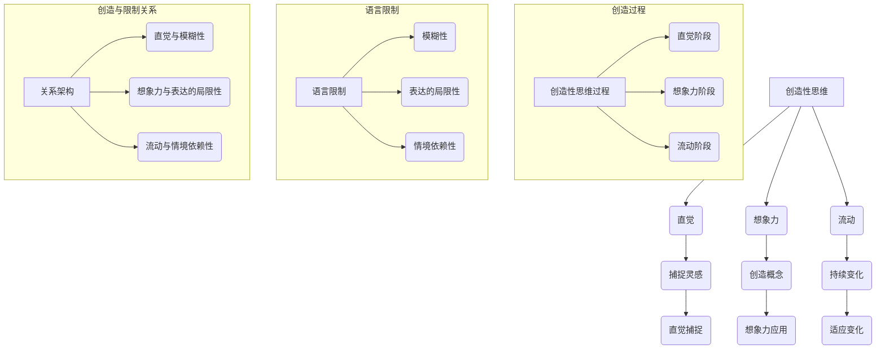
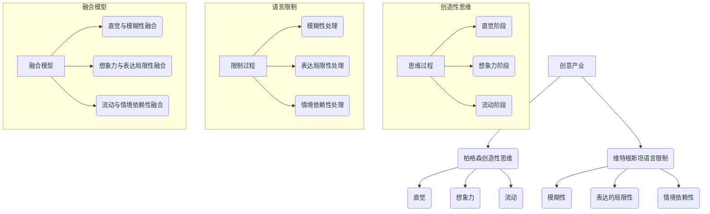

                 

### 文章标题

《柏格森的创造性思维与维特根斯坦的语言限制在创意产业中的影响》

### 关键词

- 创意产业
- 柏格森哲学
- 维特根斯坦哲学
- 创造性思维
- 语言限制
- 融合应用

### 摘要

本文旨在探讨柏格森的创造性思维与维特根斯坦的语言限制在创意产业中的影响。通过深入分析柏格森哲学中关于创造性思维的理论，以及维特根斯坦关于语言限制的观点，我们探讨了这两种思维模式如何在不同创意领域中发挥作用。本文首先介绍了创意产业的定义与发展，随后详细阐述了柏格森的创造性思维理论，以及维特根斯坦的语言限制理论。在此基础上，文章讨论了柏格森创造性思维在广告创意、产品设计、音乐创作等领域的应用，以及维特根斯坦语言限制在这些领域的实践。最后，文章提出了柏格森与维特根斯坦创造性思维的融合，并提出了未来研究的方向。

## 第1章 引言

### 1.1 创意产业的定义与发展

创意产业，又称为创意经济，是指以知识产权为核心的产业，包括广告、设计、音乐、电影、艺术、文学、软件和游戏等创意领域。创意产业具有高附加值、高知识含量、高就业率等特点，成为现代经济的重要组成部分。

创意产业的起源可以追溯到20世纪末。当时，随着全球化的推进和科技的快速发展，传统的制造业和农业经济逐渐向服务业和创意产业转型。发达国家率先认识到创意产业的重要性，纷纷制定政策，推动创意产业的发展。例如，英国在1998年发布《创意产业路径文件》，标志着创意产业在全球范围内的兴起。

创意产业的特点主要体现在以下几个方面：

1. **创新性**：创意产业的核心是创新，创新是推动创意产业发展的动力。创意产业的从业人员需要具备较强的创新能力和创意思维，以不断创造出新的产品和服务。

2. **高知识含量**：创意产业依赖于知识和技术，尤其是知识产权的保护。创意产业的产品和服务往往具有高附加值，具有较高的知识含量。

3. **高就业率**：创意产业具有广泛的就业潜力，涵盖了广告、设计、音乐、电影等多个领域。创意产业的发展可以带动相关产业的发展，创造大量就业机会。

4. **跨界融合**：创意产业与其他产业的融合日益紧密，如科技与艺术的结合、设计与工程的结合等。跨界融合为创意产业的发展提供了新的机遇。

创意产业在现代社会中的重要性不容忽视。首先，创意产业是推动经济增长的重要引擎。创意产业具有较高的附加值和就业率，对经济增长的贡献显著。其次，创意产业是提升国家软实力的重要手段。通过创意产业的发展，可以提升国家的文化影响力和国际竞争力。最后，创意产业是满足人民群众多样化需求的重要途径。创意产业的产品和服务具有创新性和个性化，能够满足人民群众日益增长的精神文化需求。

### 1.2 柏格森的创造性思维理论

柏格森（Henri Bergson）是20世纪初期的重要哲学家，他的创造性思维理论对现代心理学和哲学产生了深远的影响。柏格森认为，创造性思维是一种独特的认知过程，它不同于常规的理性思维，而是一种直觉和想象力的产物。

柏格森的创造性思维理论主要包括以下几个核心概念：

1. **直觉**：柏格森认为，直觉是人类认识世界的一种基本能力，它能够捕捉到事物内在的、本质的关联。直觉不同于理性思维，它不是通过逻辑推理得出的，而是通过直观感受和想象形成的。

2. **想象力**：想象力是创造性思维的重要工具，它能够将直觉转化为具体的概念和形象。想象力使人能够超越现实，创造出新的想法和解决方案。

3. **流动**：柏格森提出，现实世界是不断变化和流动的，这种变化和流动是创造性思维的基础。创造性思维需要适应这种流动，不断产生新的思想和概念。

4. **创造力**：柏格森认为，创造力是人类智慧的体现，是人类区别于其他生物的重要特征。创造力使人能够创造出新的价值和意义，推动社会的发展。

柏格森的创造性思维理论强调了直觉、想象力和流动在创造性思维过程中的作用。他认为，创造性思维不是通过逻辑推理，而是通过直觉和想象力实现的。直觉使人能够捕捉到事物之间的深层联系，想象力则将这些联系转化为具体的概念和形象。而流动则提供了创造性思维所需的环境，使思维能够不断变化和发展。

### 1.3 维特根斯坦的语言限制理论

路德维希·维特根斯坦（Ludwig Wittgenstein）是20世纪最重要的哲学家之一，他的语言限制理论对哲学、语言学和认知科学产生了深远的影响。维特根斯坦认为，语言是思维的工具，但它也限制了思维的自由。

维特根斯坦的语言限制理论主要包括以下几个核心观点：

1. **语言与世界的对应关系**：维特根斯坦认为，语言与世界的现实之间存在一种基本的对应关系。语言中的词语和句子代表现实世界中的事物和事件。

2. **语言的局限性**：维特根斯坦指出，语言存在局限性，它不能完全反映现实的复杂性和多样性。语言只能描述可观察和可表达的事物，而无法描述那些不可见、不可言说的事物。

3. **语言的游戏**：维特根斯坦将语言比喻为游戏，认为语言的使用具有规则和情境。不同的语言游戏有不同的规则和目的，语言的理解和使用需要根据具体的情境来理解。

4. **哲学语言的特殊性**：维特根斯坦认为，哲学语言不同于日常语言，它需要精确和清晰。哲学语言的目的是揭示思维的逻辑结构和语言的本质。

维特根斯坦的语言限制理论强调了语言的局限性和哲学语言的特殊性。他认为，语言虽然能够描述现实，但它的表达能力和适用范围是有限的。哲学家需要使用一种特殊的方式，来超越日常语言，揭示思维的真相。

### 1.4 创意产业中的柏格森与维特根斯坦

柏格森的创造性思维和维特根斯坦的语言限制理论在创意产业中具有重要的应用价值。柏格森的创造性思维理论为创意产业提供了新的思维方式和方法论，而维特根斯坦的语言限制理论则帮助创意产业从业人员认识到语言的局限性，从而更好地运用语言进行创意表达。

#### 1.4.1 创意产业中的创造性思维需求

创意产业的核心是创新，而创新离不开创造性思维。在广告创意、产品设计、音乐创作等领域，创造性思维是必不可少的。柏格森的创造性思维理论为创意产业提供了以下启示：

1. **重视直觉**：创意产业从业人员需要培养敏锐的直觉，捕捉到市场趋势和消费者需求。直觉可以帮助他们创造出新颖的创意和设计。

2. **发挥想象力**：想象力是创意产业的重要工具，可以帮助从业人员超越现实，创造出独特的艺术作品和产品设计。

3. **适应变化**：创意产业是一个不断变化和发展的领域，从业人员需要具备适应变化的能力，不断创新和改进。

#### 1.4.2 维特根斯坦语言限制在创意产业中的应用

维特根斯坦的语言限制理论在创意产业中也有重要的应用价值。创意产业从业人员需要认识到语言的局限性，以便更好地运用语言进行创意表达。维特根斯坦的理论为创意产业提供了以下启示：

1. **精确表达**：创意产业从业人员需要使用精确的语言来表达创意和设计，避免语言的模糊性和歧义性。

2. **情境意识**：语言的使用需要根据具体的情境来理解，创意产业从业人员需要根据不同的项目需求，灵活运用语言进行创意表达。

3. **超越语言**：维特根斯坦认为，有些事物是无法用语言描述的，创意产业从业人员需要学会超越语言，通过其他方式来表达创意和设计。

#### 1.4.3 柏格森创造性思维与维特根斯坦语言限制的互补关系

柏格森的创造性思维和维特根斯坦的语言限制理论在创意产业中具有互补的关系。柏格森的创造性思维为创意产业提供了创新的思维和方法，而维特根斯坦的语言限制理论则帮助创意产业从业人员认识到语言的局限性，从而更好地运用语言进行创意表达。

1. **相互促进**：柏格森的创造性思维和维特根斯坦的语言限制理论相互促进，共同推动创意产业的发展。

2. **融合创新**：在创意产业中，柏格森的创造性思维和维特根斯坦的语言限制理论可以融合在一起，形成一种独特的创意方法论，为创意产业提供新的发展机遇。

3. **实践应用**：创意产业从业人员可以通过结合柏格森的创造性思维和维特根斯坦的语言限制理论，提高自身的创意表达能力和设计水平，为创意产业的发展做出贡献。

## 第2章 柏格森创造性思维在创意产业中的应用

### 2.1 柏格森创造性思维在广告创意中的应用

广告创意是创意产业的重要组成部分，它通过独特的创意和视觉表达，吸引消费者的注意力，传达品牌信息。柏格森的创造性思维为广告创意提供了新的启示和方法。

#### 2.1.1 广告创意的柏格森思维解读

柏格森的创造性思维强调直觉、想象力和流动，这些概念在广告创意中具有广泛的应用。

1. **直觉**：广告创意需要捕捉到消费者内心深处的情感和需求，这种直觉性的理解是广告创意成功的关键。例如，某饮料品牌在广告中通过捕捉年轻人对自由的渴望，成功地传达了品牌的品牌形象和价值观。

2. **想象力**：广告创意需要运用想象力，创造出独特的视觉和故事，吸引观众的注意力。想象力使得广告创意能够超越现实，创造出引人入胜的情节和形象。

3. **流动**：广告创意需要不断变化和发展，以适应市场的变化和消费者的需求。广告创意的流动性质使得它能够不断调整和改进，以保持其吸引力和影响力。

#### 2.1.2 广告创意中的柏格森创造性思维案例

以下是一个广告创意中的柏格森创造性思维案例：

某洗发水品牌为了吸引年轻消费者，推出了一款以“自由”为主题的广告。广告中，主人公经历了一系列充满挑战和冒险的旅程，最终到达了一片美丽的海滩。在这个过程中，他使用了品牌的洗发水，感受到了洗发水的独特魅力。广告通过捕捉年轻人对自由的渴望，成功地将品牌形象与自由理念相结合，吸引了大量年轻消费者的关注。

这个案例中，广告创意充分利用了柏格森的创造性思维。首先，广告捕捉到了年轻人对自由的渴望，这是一种直觉性的理解。其次，广告通过丰富的想象力，创造了一个充满冒险和挑战的情节，吸引了观众的注意力。最后，广告通过不断的流动，展现了品牌在不同情境下的应用，使得广告创意具有持续的影响力。

### 2.2 柏格森创造性思维在产品设计中的应用

产品设计是创意产业中的重要领域，它涉及到产品的外观、功能和使用体验。柏格森的创造性思维为产品设计提供了新的思维方式和方法论。

#### 2.2.1 产品设计的柏格森思维解读

柏格森的创造性思维强调直觉、想象力和流动，这些概念在产品设计中的应用主要体现在以下几个方面：

1. **直觉**：产品设计需要捕捉到用户的需求和使用体验，这种直觉性的理解是产品设计成功的关键。例如，某电子产品公司在设计一款便携式笔记本电脑时，通过实地调研和用户访谈，捕捉到了用户对便携性和性能的需求。

2. **想象力**：产品设计需要运用想象力，创造出独特的产品外观和功能，满足用户的需求。想象力使得产品设计能够超越现有的技术限制，创造出新颖的产品概念。

3. **流动**：产品设计需要不断变化和发展，以适应市场需求和用户的需求。产品设计的流动性质使得它能够不断调整和改进，以保持其竞争力和吸引力。

#### 2.2.2 产品设计中的柏格森创造性思维案例

以下是一个产品设计中的柏格森创造性思维案例：

某科技公司设计了一款智能家居设备，名为“智能灯泡”。这款智能灯泡不仅具有传统的照明功能，还可以根据用户的需求和环境的变化，自动调整亮度和色温。产品设计过程中，公司通过实地调研和用户访谈，捕捉到了用户对智能控制和高品质照明的需求。设计团队运用了柏格森的创造性思维，将直觉、想象力和流动相结合，创造出了这款独特的智能灯泡。

这个案例中，产品设计充分利用了柏格森的创造性思维。首先，设计团队通过实地调研和用户访谈，捕捉到了用户对智能控制和高品质照明的需求，这是一种直觉性的理解。其次，设计团队运用了想象力，将智能控制和高品质照明相结合，创造出了这款独特的智能灯泡。最后，设计团队通过不断调整和改进，使得智能灯泡能够根据用户的需求和环境的变化，自动调整亮度和色温，体现了产品设计的流动性质。

### 2.3 柏格森创造性思维在音乐创作中的应用

音乐创作是创意产业中的重要领域，它通过音乐来表达情感、传递信息。柏格森的创造性思维为音乐创作提供了新的思维方式和创作方法。

#### 2.3.1 音乐创作的柏格森思维解读

柏格森的创造性思维强调直觉、想象力和流动，这些概念在音乐创作中的应用主要体现在以下几个方面：

1. **直觉**：音乐创作需要捕捉到音乐的情感和氛围，这种直觉性的理解是音乐创作成功的关键。例如，某作曲家在创作一首歌曲时，通过直觉感受到了歌曲所需要传达的情感和氛围。

2. **想象力**：音乐创作需要运用想象力，创造出独特的音乐旋律和和声，表达音乐的情感和思想。想象力使得音乐创作能够超越现有的音乐形式，创造出新颖的音乐作品。

3. **流动**：音乐创作需要不断变化和发展，以适应音乐的情感和表达需求。音乐创作的流动性质使得它能够不断调整和改进，以保持其创造力和感染力。

#### 2.3.2 音乐创作中的柏格森创造性思维案例

以下是一个音乐创作中的柏格森创造性思维案例：

某作曲家在创作一首关于大自然的交响乐时，通过直觉感受到了大自然的美妙和宁静。作曲家运用了想象力，创造了一系列独特的音乐旋律和和声，来表达对大自然的赞美和敬畏。在创作过程中，作曲家不断调整和改进音乐作品，使其能够更好地传达大自然的美妙和宁静。

这个案例中，音乐创作充分利用了柏格森的创造性思维。首先，作曲家通过直觉感受到了大自然的美妙和宁静，这是一种直觉性的理解。其次，作曲家运用了想象力，创造了一系列独特的音乐旋律和和声，来表达对大自然的赞美和敬畏。最后，作曲家通过不断调整和改进，使得音乐作品能够更好地传达大自然的美妙和宁静，体现了音乐创作的流动性质。

## 第3章 维特根斯坦语言限制在创意产业中的应用

### 3.1 维特根斯坦语言限制在文学创作中的应用

文学创作是创意产业的重要组成部分，它通过语言来表达情感、思想和故事。维特根斯坦的语言限制理论为文学创作提供了新的思考角度和创作方法。

#### 3.1.1 文学创作中的语言限制挑战

维特根斯坦认为，语言存在局限性，它无法完全表达现实和人类的思维。在文学创作中，这种语言限制表现为以下几个方面：

1. **表达的模糊性**：语言往往具有模糊性和歧义性，难以精确地传达作者的思想和情感。例如，某段文字可能被不同的人解读出不同的含义，导致表达的不精确。

2. **表达的局限性**：语言只能描述可观察和可表达的事物，而无法描述那些不可见、不可言说的事物。例如，文学作品中关于梦境、幻想和内心世界的描写，往往难以用语言精确地表达。

3. **表达的情境依赖性**：语言的使用需要根据具体的情境来理解，不同情境下的语言表达方式可能存在差异。例如，文学作品在不同的文化和社会背景下，可能需要采用不同的语言表达方式。

#### 3.1.2 维特根斯坦语言限制在文学创作中的案例分析

以下是一个文学创作中的维特根斯坦语言限制案例：

某作家在创作一部关于战争的小说时，通过语言来表达战争带来的痛苦和恐惧。作家通过细腻的描写和丰富的情感，试图传达战争对人类心灵和生命的摧残。然而，作家的语言表达仍然存在一定的模糊性和局限性，使得读者在理解作品时可能存在不同的解读。

这个案例中，文学创作充分利用了维特根斯坦的语言限制理论。首先，作家通过语言来表达战争带来的痛苦和恐惧，但语言本身具有模糊性和歧义性，使得不同读者可能对作品的理解存在差异。其次，作家的语言表达无法完全描述战争的复杂性和不可言说的痛苦，存在一定的局限性。最后，作品的语言表达需要根据具体的情境来理解，不同情境下的读者可能对作品的理解存在差异。

### 3.2 维特根斯坦语言限制在电影制作中的应用

电影制作是创意产业中的重要领域，它通过视觉和声音来表达故事、情感和思想。维特根斯坦的语言限制理论为电影制作提供了新的思考角度和创作方法。

#### 3.2.1 电影制作中的语言限制挑战

维特根斯坦认为，语言存在局限性，它无法完全表达现实和人类的思维。在电影制作中，这种语言限制表现为以下几个方面：

1. **表达的模糊性**：电影语言往往具有模糊性和歧义性，难以精确地传达导演的思想和情感。例如，某段画面可能被不同的人解读出不同的含义，导致表达的不精确。

2. **表达的局限性**：电影语言只能描述可观察和可表达的事物，而无法描述那些不可见、不可言说的事物。例如，电影中关于梦境、幻想和内心世界的描写，往往难以用电影语言精确地表达。

3. **表达的情境依赖性**：电影语言的使用需要根据具体的情境来理解，不同情境下的电影语言表达方式可能存在差异。例如，电影在不同的文化和社会背景下，可能需要采用不同的语言表达方式。

#### 3.2.2 维特根斯坦语言限制在电影制作中的案例分析

以下是一个电影制作中的维特根斯坦语言限制案例：

某导演在制作一部关于心理疾病的电影时，通过画面和声音来表达主人公的心理状态。导演通过细腻的描写和丰富的情感，试图传达主人公内心的痛苦和挣扎。然而，电影语言的表达仍然存在一定的模糊性和局限性，使得观众在理解作品时可能存在不同的解读。

这个案例中，电影制作充分利用了维特根斯坦的语言限制理论。首先，导演通过电影语言来表达主人公的心理状态，但电影语言本身具有模糊性和歧义性，使得不同观众可能对作品的理解存在差异。其次，电影语言的表达无法完全描述主人公的内心世界和心理疾病，存在一定的局限性。最后，作品的电影语言表达需要根据具体的情境来理解，不同情境下的观众可能对作品的理解存在差异。

### 3.3 维特根斯坦语言限制在游戏设计中的应用

游戏设计是创意产业中的重要领域，它通过视觉、声音和交互来提供娱乐和体验。维特根斯坦的语言限制理论为游戏设计提供了新的思考角度和创作方法。

#### 3.3.1 游戏设计中的语言限制挑战

维特根斯坦认为，语言存在局限性，它无法完全表达现实和人类的思维。在游戏设计中，这种语言限制表现为以下几个方面：

1. **表达的模糊性**：游戏语言往往具有模糊性和歧义性，难以精确地传达游戏设计师的思想和情感。例如，某段游戏剧情可能被不同的人解读出不同的含义，导致表达的不精确。

2. **表达的局限性**：游戏语言只能描述可观察和可表达的事物，而无法描述那些不可见、不可言说的事物。例如，游戏中关于幻想、梦境和内心世界的描写，往往难以用游戏语言精确地表达。

3. **表达的情境依赖性**：游戏语言的使用需要根据具体的情境来理解，不同情境下的游戏语言表达方式可能存在差异。例如，游戏在不同的文化和社会背景下，可能需要采用不同的语言表达方式。

#### 3.3.2 维特根斯坦语言限制在游戏设计中的案例分析

以下是一个游戏设计中的维特根斯坦语言限制案例：

某游戏设计师在制作一款关于未来科幻世界的游戏时，通过视觉、声音和交互来表达游戏的世界观和剧情。设计师通过细腻的描写和丰富的情感，试图传达游戏世界的神秘和未来感。然而，游戏语言的表达仍然存在一定的模糊性和局限性，使得玩家在体验游戏时可能存在不同的解读。

这个案例中，游戏设计充分利用了维特根斯坦的语言限制理论。首先，设计师通过游戏语言来表达游戏的世界观和剧情，但游戏语言本身具有模糊性和歧义性，使得不同玩家可能对游戏的理解存在差异。其次，游戏语言的表达无法完全描述游戏的幻想和未来感，存在一定的局限性。最后，游戏的语言表达需要根据具体的情境来理解，不同情境下的玩家可能对游戏的理解存在差异。

## 第4章 柏格森与维特根斯坦创造性思维的融合

### 4.1 柏格森与维特根斯坦创造性思维的融合

在创意产业中，柏格森的创造性思维与维特根斯坦的语言限制理论具有互补性，二者相结合可以激发更丰富的创造力和创新潜力。柏格森的创造性思维注重直觉、想象力和流动，强调思维的自由和创新性；而维特根斯坦的语言限制理论则提醒我们，在创意表达中语言并非万能，需要超越语言的限制，寻找新的表达方式。两者的融合有助于我们在创意过程中实现以下目标：

1. **提升创意质量**：通过柏格森的创造性思维，我们可以激发更多的直觉和想象力，创造出独特而新颖的创意。而维特根斯坦的语言限制理论则帮助我们认识到语言的局限性，从而在创意表达中更加注重内容和情感的真实传递，提升创意的质量。

2. **促进创新实践**：柏格森的创造性思维鼓励我们打破常规，追求创新。结合维特根斯坦的语言限制理论，我们可以更加灵活地运用语言，尝试新的表达方式，从而推动创意产业的创新实践。

3. **增强适应性**：在创意产业中，市场和技术的变化非常迅速。柏格森的创造性思维与维特根斯坦的语言限制理论的融合，可以帮助我们培养适应变化的能力，及时调整创意策略，以应对不断变化的环境。

### 4.2 融合思维在广告创意中的应用

广告创意是创意产业中的一个关键领域，柏格森与维特根斯坦的融合思维在广告创意中具有广泛的应用。

#### 4.2.1 广告创意中的融合思维应用

融合思维在广告创意中的应用主要体现在以下几个方面：

1. **直觉与语言的结合**：广告创意需要捕捉到消费者的情感和需求，这种直觉性的理解是创意成功的关键。融合思维鼓励广告创意团队在创意过程中，充分发挥直觉的作用，同时运用语言来表达这种直觉。例如，在广告文案中，可以使用富有情感和想象力的语言，将产品特性与消费者情感紧密结合。

2. **想象力的运用**：广告创意需要运用想象力，创造出引人入胜的情节和形象。融合思维强调想象力的重要性，鼓励广告创意团队在创意过程中大胆运用想象力，创造出独特而新颖的创意。例如，在广告中可以运用虚拟现实技术，创造出奇幻的虚拟世界，吸引消费者的注意力。

3. **语言的超越**：维特根斯坦的语言限制理论提醒我们，在广告创意中需要超越语言的限制，寻找新的表达方式。融合思维鼓励广告创意团队在创意过程中，尝试使用非传统语言表达方式，如符号、图像、声音等，以传达更深层次的创意信息。

#### 4.2.2 广告创意中的融合思维案例

以下是一个广告创意中的融合思维案例：

某家电品牌在推出一款新型空调时，运用了柏格森与维特根斯坦的融合思维进行广告创意。广告以一个家庭为主角，通过描绘家庭成员在炎炎夏日里享受舒适空调的场景，传递了产品的高品质和人性化设计。在创意过程中，广告团队充分发挥了直觉的作用，捕捉到消费者对舒适生活的需求。同时，他们运用了想象力，通过细腻的画面和温馨的文案，将产品特性与消费者情感紧密结合。此外，广告还尝试使用非传统语言表达方式，如动画和声音，增强了广告的吸引力和记忆度。

这个案例中，广告创意充分利用了柏格森与维特根斯坦的融合思维。首先，广告团队通过直觉捕捉到消费者对舒适生活的需求，这是创意成功的关键。其次，他们运用了想象力，创造出温馨而富有情感的场景，吸引了消费者的注意力。最后，广告团队超越语言的限制，使用了动画和声音等非传统语言表达方式，增强了广告的吸引力和记忆度。

### 4.3 融合思维在产品设计中的应用

产品设计是创意产业中的另一个关键领域，柏格森与维特根斯坦的融合思维在产品设计中也具有广泛的应用。

#### 4.3.1 产品设计中的融合思维应用

融合思维在产品设计中的应用主要体现在以下几个方面：

1. **直觉与需求的结合**：产品设计需要捕捉到用户的需求和使用体验，这种直觉性的理解是产品设计成功的关键。融合思维鼓励产品设计团队在产品设计过程中，充分发挥直觉的作用，同时关注用户需求。例如，在产品设计时，可以通过用户调研和用户体验测试，捕捉到用户的真实需求和痛点，从而设计出更符合用户需求的产品。

2. **想象力的发挥**：产品设计需要运用想象力，创造出独特而创新的产品形态和功能。融合思维强调想象力的重要性，鼓励产品设计团队在产品设计过程中，大胆运用想象力，探索新的产品概念。例如，在产品设计时，可以尝试将不同的元素和功能相结合，创造出具有独特竞争力和创新性的产品。

3. **语言的超越**：维特根斯坦的语言限制理论提醒我们，在产品设计过程中需要超越语言的限制，寻找新的表达方式。融合思维鼓励产品设计团队在产品设计过程中，尝试使用非传统的设计语言和表达方式，以传达更深层次的创意信息。例如，在产品外观设计时，可以尝试使用新的材质、颜色和纹理，以创造独特的视觉效果。

#### 4.3.2 产品设计中的融合思维案例

以下是一个产品设计中的融合思维案例：

某科技公司开发了一款新型智能手表，运用了柏格森与维特根斯坦的融合思维进行设计。在设计过程中，设计团队通过用户调研和用户体验测试，捕捉到用户对智能手表的多样化需求，如健康监测、运动记录和智能通知等。同时，设计团队充分发挥了想象力，将多种功能相结合，创造出这款多功能智能手表。此外，设计团队还超越语言的限制，采用了新的材质和颜色，使得智能手表具有独特的视觉效果和手感。

这个案例中，产品设计充分利用了柏格森与维特根斯坦的融合思维。首先，设计团队通过直觉捕捉到用户的需求，这是设计成功的关键。其次，设计团队运用了想象力，创造出多功能智能手表，吸引了消费者的注意力。最后，设计团队超越语言的限制，采用了新的材质和颜色，使得智能手表具有独特的视觉效果和手感。

### 4.4 融合思维在音乐创作中的应用

音乐创作是创意产业中的一个重要领域，柏格森与维特根斯坦的融合思维在音乐创作中也具有广泛的应用。

#### 4.4.1 音乐创作中的融合思维应用

融合思维在音乐创作中的应用主要体现在以下几个方面：

1. **直觉与情感的结合**：音乐创作需要捕捉到音乐的情感和氛围，这种直觉性的理解是音乐创作成功的关键。融合思维鼓励音乐创作团队在创作过程中，充分发挥直觉的作用，同时关注音乐的情感表达。例如，在创作一首歌曲时，可以通过直觉感受到歌曲所需的情感氛围，从而创作出具有感染力的音乐。

2. **想象力的发挥**：音乐创作需要运用想象力，创造出独特而创新的旋律和和声。融合思维强调想象力的重要性，鼓励音乐创作团队在创作过程中，大胆运用想象力，探索新的音乐概念。例如，在创作一首乐曲时，可以尝试使用新的音乐元素和和声，创造出独特的音乐风格。

3. **语言的超越**：维特根斯坦的语言限制理论提醒我们，在音乐创作过程中需要超越语言的限制，寻找新的表达方式。融合思维鼓励音乐创作团队在创作过程中，尝试使用非传统的音乐表达方式，以传达更深层次的创意信息。例如，在音乐创作时，可以尝试使用电子音乐、实验音乐等非传统音乐形式，以创造独特的音乐体验。

#### 4.4.2 音乐创作中的融合思维案例

以下是一个音乐创作中的融合思维案例：

某音乐团队在创作一首关于大自然的交响乐时，运用了柏格森与维特根斯坦的融合思维进行创作。在创作过程中，音乐团队通过直觉感受到了大自然的美妙和宁静，从而创作出了这首具有强烈感染力的交响乐。同时，音乐团队充分发挥了想象力，将不同的乐器和音乐元素相结合，创造出独特的音乐风格。此外，音乐团队还超越语言的限制，使用了电子音乐和实验音乐等非传统音乐形式，使得交响乐具有了新颖的视觉效果和听觉体验。

这个案例中，音乐创作充分利用了柏格森与维特根斯坦的融合思维。首先，音乐团队通过直觉捕捉到了大自然的美妙和宁静，这是创作成功的关键。其次，音乐团队运用了想象力，将不同的乐器和音乐元素相结合，创作出了独特的音乐风格。最后，音乐团队超越语言的限制，使用了电子音乐和实验音乐等非传统音乐形式，使得交响乐具有了新颖的视觉效果和听觉体验。

### 4.5 融合思维在文学创作中的应用

文学创作是创意产业中的一个重要领域，柏格森与维特根斯坦的融合思维在文学创作中也具有广泛的应用。

#### 4.5.1 文学创作中的融合思维应用

融合思维在文学创作中的应用主要体现在以下几个方面：

1. **直觉与语言的结合**：文学创作需要捕捉到生活中的细节和情感，这种直觉性的理解是文学创作成功的关键。融合思维鼓励文学创作者在创作过程中，充分发挥直觉的作用，同时运用语言来表达这种直觉。例如，在创作一部小说时，可以通过直觉捕捉到生活中的点滴，从而创作出具有真实感和情感的作品。

2. **想象力的发挥**：文学创作需要运用想象力，创造出独特而丰富的故事和形象。融合思维强调想象力的重要性，鼓励文学创作者在创作过程中，大胆运用想象力，探索新的故事世界。例如，在创作一部奇幻小说时，可以尝试构建一个独特的奇幻世界，让读者沉浸其中。

3. **语言的超越**：维特根斯坦的语言限制理论提醒我们，在文学创作过程中需要超越语言的限制，寻找新的表达方式。融合思维鼓励文学创作者在创作过程中，尝试使用非传统的语言表达方式，以传达更深层次的创意信息。例如，在创作诗歌时，可以尝试使用抽象的意象和象征，以表达复杂而深刻的情感。

#### 4.5.2 文学创作中的融合思维案例

以下是一个文学创作中的融合思维案例：

某作家在创作一部关于现代都市生活的小说时，运用了柏格森与维特根斯坦的融合思维进行创作。在创作过程中，作家通过直觉捕捉到了都市生活中的孤独和迷茫，从而创作出了一部充满情感和思考的作品。同时，作家充分发挥了想象力，将现代都市生活与奇幻元素相结合，创造出了一个独特而丰富的故事世界。此外，作家还超越语言的限制，使用了富有诗意和象征性的语言，使得小说具有了深刻的内涵和艺术价值。

这个案例中，文学创作充分利用了柏格森与维特根斯坦的融合思维。首先，作家通过直觉捕捉到了都市生活中的孤独和迷茫，这是创作成功的关键。其次，作家运用了想象力，将现代都市生活与奇幻元素相结合，创造出了独特而丰富的故事世界。最后，作家超越语言的限制，使用了富有诗意和象征性的语言，使得小说具有了深刻的内涵和艺术价值。

### 4.6 融合思维在电影制作中的应用

电影制作是创意产业中的一个重要领域，柏格森与维特根斯坦的融合思维在电影制作中也具有广泛的应用。

#### 4.6.1 电影制作中的融合思维应用

融合思维在电影制作中的应用主要体现在以下几个方面：

1. **直觉与故事的结合**：电影制作需要捕捉到故事的情感和氛围，这种直觉性的理解是电影制作成功的关键。融合思维鼓励电影制作团队在制作过程中，充分发挥直觉的作用，同时关注故事的表达。例如，在剧本创作阶段，可以通过直觉捕捉到故事的内核和情感，从而创作出引人入胜的剧本。

2. **想象力的发挥**：电影制作需要运用想象力，创造出独特而丰富的视觉和声音效果。融合思维强调想象力的重要性，鼓励电影制作团队在制作过程中，大胆运用想象力，探索新的视觉效果和声音体验。例如，在特效制作阶段，可以尝试使用新的特效技术，创造出独特的视觉冲击力。

3. **语言的超越**：维特根斯坦的语言限制理论提醒我们，在电影制作过程中需要超越语言的限制，寻找新的表达方式。融合思维鼓励电影制作团队在制作过程中，尝试使用非传统的语言表达方式，如视觉、声音、动作等，以传达更深层次的创意信息。例如，在电影剪辑阶段，可以通过非传统的剪辑技巧，创造出独特的叙事节奏和情感表达。

#### 4.6.2 电影制作中的融合思维案例

以下是一个电影制作中的融合思维案例：

某电影导演在制作一部关于环境保护题材的电影时，运用了柏格森与维特根斯坦的融合思维进行创作。在创作过程中，导演通过直觉捕捉到了环境保护的紧迫性和重要性，从而创作出了一部具有深刻社会意义的电影。同时，导演充分发挥了想象力，将环境保护与科幻元素相结合，创造出了一个独特而丰富的故事世界。此外，导演还超越语言的限制，使用了丰富的视觉和声音效果，使得电影具有了强烈的视觉冲击力和情感表达力。

这个案例中，电影制作充分利用了柏格森与维特根斯坦的融合思维。首先，导演通过直觉捕捉到了环境保护的紧迫性和重要性，这是创作成功的关键。其次，导演运用了想象力，将环境保护与科幻元素相结合，创造出了独特而丰富的故事世界。最后，导演超越语言的限制，使用了丰富的视觉和声音效果，使得电影具有了强烈的视觉冲击力和情感表达力。

### 4.7 融合思维在游戏设计中的应用

游戏设计是创意产业中的一个重要领域，柏格森与维特根斯坦的融合思维在游戏设计中也具有广泛的应用。

#### 4.7.1 游戏设计中的融合思维应用

融合思维在游戏设计中的应用主要体现在以下几个方面：

1. **直觉与游戏机制的结合**：游戏设计需要捕捉到玩家的需求和游戏体验，这种直觉性的理解是游戏设计成功的关键。融合思维鼓励游戏设计团队在游戏设计过程中，充分发挥直觉的作用，同时关注游戏机制的设定。例如，在游戏设计阶段，可以通过直觉捕捉到玩家对游戏互动和挑战的需求，从而设计出有趣而富有挑战性的游戏机制。

2. **想象力的发挥**：游戏设计需要运用想象力，创造出独特而丰富的游戏世界和角色。融合思维强调想象力的重要性，鼓励游戏设计团队在游戏设计过程中，大胆运用想象力，探索新的游戏概念。例如，在游戏设计阶段，可以尝试构建一个奇幻的游戏世界，让玩家沉浸其中。

3. **语言的超越**：维特根斯坦的语言限制理论提醒我们，在游戏设计过程中需要超越语言的限制，寻找新的表达方式。融合思维鼓励游戏设计团队在游戏设计过程中，尝试使用非传统的游戏语言和表达方式，以传达更深层次的创意信息。例如，在游戏界面设计时，可以尝试使用抽象的符号和图像，以增强游戏的趣味性和互动性。

#### 4.7.2 游戏设计中的融合思维案例

以下是一个游戏设计中的融合思维案例：

某游戏开发团队在开发一款角色扮演游戏时，运用了柏格森与维特根斯坦的融合思维进行设计。在设计过程中，团队通过直觉捕捉到了玩家对自由探索和角色成长的需求，从而设计出了一款具有丰富游戏内容和深度体验的游戏。同时，团队充分发挥了想象力，创造出了一个独特而丰富的游戏世界，让玩家沉浸在虚拟世界中。此外，团队还超越语言的限制，使用了丰富的游戏语言和表达方式，如动态剧情、实时交互和虚拟现实技术，使得游戏具有了强烈的沉浸感和互动性。

这个案例中，游戏设计充分利用了柏格森与维特根斯坦的融合思维。首先，团队通过直觉捕捉到了玩家对自由探索和角色成长的需求，这是设计成功的关键。其次，团队运用了想象力，创造出了一个独特而丰富的游戏世界，吸引了玩家的兴趣。最后，团队超越语言的限制，使用了丰富的游戏语言和表达方式，增强了游戏的趣味性和互动性。

## 第5章 案例研究：柏格森与维特根斯坦创造性思维在创意产业中的实践

### 5.1 案例研究方法与框架

#### 5.1.1 案例研究的目的与意义

本章节旨在通过具体的案例研究，探讨柏格森的创造性思维与维特根斯坦的语言限制在创意产业中的实际应用。通过分析这些案例，我们可以深入了解这两种思维模式如何在不同创意领域中发挥作用，以及它们如何相互融合，推动创意产业的发展。

案例研究的方法与框架如下：

1. **文献综述**：首先，对柏格森和维特根斯坦的相关理论进行文献综述，了解其核心概念和主要观点。

2. **案例选择**：从广告创意、产品设计、音乐创作、文学创作、电影制作和游戏设计等创意产业领域，选择具有代表性的案例进行深入研究。

3. **案例分析**：对每个案例进行详细分析，探讨柏格森创造性思维与维特根斯坦语言限制在案例中的应用，以及它们对创意产出的影响。

4. **综合讨论**：结合案例分析，探讨柏格森与维特根斯坦创造性思维的融合如何推动创意产业的发展，并提出未来研究的方向。

#### 5.1.2 案例研究的方法论

案例研究的方法论主要包括以下步骤：

1. **文献搜集**：通过查阅相关书籍、学术论文和行业报告，搜集与柏格森和维特根斯坦理论相关的文献资料。

2. **案例筛选**：根据案例的代表性和研究目的，筛选出具有代表性的案例。

3. **数据收集**：通过访谈、问卷调查、实地观察等方式，收集案例相关的数据和信息。

4. **案例分析**：对案例进行详细分析，探讨柏格森创造性思维与维特根斯坦语言限制在案例中的应用。

5. **结果讨论**：结合案例分析，讨论柏格森与维特根斯坦创造性思维的融合对创意产业的启示和影响。

6. **结论与建议**：总结案例研究的主要发现，提出未来研究的方向和建议。

### 5.2 案例研究一：广告创意中的柏格森与维特根斯坦创造性思维实践

#### 5.2.1 案例背景

某国际知名饮料品牌在推出一款新口味果汁时，希望通过广告创意来吸引消费者的注意力。该品牌选择了一种独特的广告创意策略，结合了柏格森的创造性思维和维特根斯坦的语言限制理论，以达到与众不同的效果。

#### 5.2.2 创造性思维应用分析

1. **柏格森创造性思维的应用**：

   - **直觉**：广告创意团队通过直觉捕捉到消费者对新口味果汁的潜在需求和好奇心。他们意识到，通过一种独特的视觉和情感表达方式，可以更好地吸引消费者的注意力。

   - **想象力**：广告创意团队运用想象力，创造了一个充满活力和活力的果汁世界。在这个世界里，果汁不仅是一种饮品，更是一种生活方式的象征。

   - **流动**：广告创意团队通过动态的视觉和声音效果，营造出一种流畅而充满活力的氛围，使消费者能够直观地感受到果汁的新鲜和美味。

2. **维特根斯坦语言限制的应用**：

   - **语言的模糊性**：广告创意团队故意使用模糊的词汇和隐喻，以避免直接表达果汁的味道和口感。这种模糊性激发了消费者的好奇心，促使他们亲自尝试。

   - **表达的局限性**：广告创意团队通过视觉和听觉效果，创造出一种超越语言的体验。消费者通过观看广告，感受到果汁的独特魅力，而无需通过语言进行描述。

#### 5.2.3 案例解读与启示

该案例展示了柏格森创造性思维与维特根斯坦语言限制在广告创意中的成功应用。通过直觉、想象力和流动，广告创意团队创造了一个独特的果汁世界，激发了消费者的好奇心和兴趣。同时，通过语言的模糊性和表达的局限性，广告创意团队避免了直接表达，让消费者在体验中自行探索和发现。

这个案例给我们的启示是，在广告创意中，结合柏格森的创造性思维和维特根斯坦的语言限制理论，可以创造出更具吸引力和影响力的广告。直觉和想象力使我们能够捕捉到消费者的需求和情感，而语言的模糊性和表达的局限性则激发了消费者的好奇心和探索欲望。

### 5.3 案例研究二：产品设计中的柏格森与维特根斯坦创造性思维实践

#### 5.3.1 案例背景

某科技公司在开发一款智能家居设备时，希望这款产品不仅具有高效的功能，还能够给用户带来独特的使用体验。为了实现这一目标，公司结合了柏格森的创造性思维和维特根斯坦的语言限制理论，进行产品设计和开发。

#### 5.3.2 创造性思维应用分析

1. **柏格森创造性思维的应用**：

   - **直觉**：产品设计团队通过直觉捕捉到用户对智能家居设备的需求和使用场景。他们意识到，智能家居设备需要易于操作、适应性强，并且能够提供个性化的服务。

   - **想象力**：产品设计团队运用想象力，创造了一系列独特的设计概念，如智能语音助手、智能感应系统和个性化设置等。这些设计概念不仅满足了用户的需求，还提升了用户的使用体验。

   - **流动**：产品设计团队通过不断的调整和改进，使产品能够适应不同的用户需求和使用场景。这种流动性质使产品始终保持新颖和先进。

2. **维特根斯坦语言限制的应用**：

   - **语言的模糊性**：产品设计团队故意使用模糊的术语和描述，以避免具体的、技术性的语言。这种模糊性使用户能够更容易地理解和接受产品的功能。

   - **表达的局限性**：产品设计团队通过直观的界面设计和简洁的操作流程，使产品能够直观地传达功能和使用方法。这种表达的局限性使用户能够快速上手，无需过多的语言解释。

#### 5.3.3 案例解读与启示

该案例展示了柏格森创造性思维与维特根斯坦语言限制在产品设计中的成功应用。通过直觉、想象力和流动，产品设计团队创造了一个独特的智能家居设备，满足了用户的需求。同时，通过语言的模糊性和表达的局限性，产品设计团队使产品更加直观和易用。

这个案例给我们的启示是，在产品设计过程中，结合柏格森的创造性思维和维特根斯坦的语言限制理论，可以创造出更具吸引力和用户满意度的产品。直觉和想象力使我们能够捕捉到用户的需求和情感，而语言的模糊性和表达的局限性则使产品更加直观和易用。

### 5.4 案例研究三：音乐创作中的柏格森与维特根斯坦创造性思维实践

#### 5.4.1 案例背景

某知名音乐人在创作一首新歌时，希望这首歌曲能够传达出强烈的情感和深刻的内涵。为了实现这一目标，他结合了柏格森的创造性思维和维特根斯坦的语言限制理论，进行音乐创作。

#### 5.4.2 创造性思维应用分析

1. **柏格森创造性思维的应用**：

   - **直觉**：音乐人在创作过程中，通过直觉捕捉到了歌曲所需的情感氛围和主题。他意识到，只有通过真实的情感表达，才能打动听众的心。

   - **想象力**：音乐人运用想象力，创造了一系列独特的音乐旋律和和声。这些旋律和和声不仅符合歌曲的主题，还能够引发听众的情感共鸣。

   - **流动**：音乐人在创作过程中，不断调整和改进旋律和和声，使歌曲能够更好地传达情感和内涵。这种流动性质使歌曲始终保持新鲜和独特。

2. **维特根斯坦语言限制的应用**：

   - **语言的模糊性**：音乐人在创作过程中，故意使用模糊的词汇和描述，以避免具体的、技术性的语言。这种模糊性使得歌曲更加富有诗意和想象力。

   - **表达的局限性**：音乐人通过简洁而有力的旋律和和声，使歌曲能够直观地传达情感和内涵。这种表达的局限性使得歌曲更加容易被听众理解和感受。

#### 5.4.3 案例解读与启示

该案例展示了柏格森创造性思维与维特根斯坦语言限制在音乐创作中的成功应用。通过直觉、想象力和流动，音乐人创造了一首富有情感和内涵的歌曲。同时，通过语言的模糊性和表达的局限性，音乐人使歌曲更加容易被听众理解和感受。

这个案例给我们的启示是，在音乐创作过程中，结合柏格森的创造性思维和维特根斯坦的语言限制理论，可以创造出更具情感和内涵的音乐作品。直觉和想象力使我们能够捕捉到歌曲的主题和情感，而语言的模糊性和表达的局限性则使歌曲更加容易被听众理解和感受。

### 5.5 案例研究四：文学创作中的柏格森与维特根斯坦创造性思维实践

#### 5.5.1 案例背景

某知名作家在创作一部新小说时，希望这部小说能够深刻地反映现实生活，同时具有丰富的想象力和深刻的内涵。为了实现这一目标，他结合了柏格森的创造性思维和维特根斯坦的语言限制理论，进行文学创作。

#### 5.5.2 创造性思维应用分析

1. **柏格森创造性思维的应用**：

   - **直觉**：作家在创作过程中，通过直觉捕捉到了小说所需的主题和情感。他意识到，只有通过真实的情感表达，才能打动读者的心。

   - **想象力**：作家运用想象力，创造了一个独特而丰富的故事世界，使读者能够沉浸其中。这些想象力丰富的情节和角色，使小说更加引人入胜。

   - **流动**：作家在创作过程中，不断调整和改进故事情节和角色设定，使小说能够更好地传达主题和情感。这种流动性质使小说始终保持新鲜和独特。

2. **维特根斯坦语言限制的应用**：

   - **语言的模糊性**：作家故意使用模糊的词汇和描述，以避免具体的、技术性的语言。这种模糊性使得小说更加富有诗意和想象力。

   - **表达的局限性**：作家通过简洁而有力的语言，使小说能够直观地传达主题和情感。这种表达的局限性使得小说更加容易被读者理解和感受。

#### 5.5.3 案例解读与启示

该案例展示了柏格森创造性思维与维特根斯坦语言限制在文学创作中的成功应用。通过直觉、想象力和流动，作家创造了一部富有情感和内涵的小说。同时，通过语言的模糊性和表达的局限性，作家使小说更加容易被读者理解和感受。

这个案例给我们的启示是，在文学创作过程中，结合柏格森的创造性思维和维特根斯坦的语言限制理论，可以创造出更具情感和内涵的文学作品。直觉和想象力使我们能够捕捉到小说的主题和情感，而语言的模糊性和表达的局限性则使小说更加容易被读者理解和感受。

### 5.6 案例研究五：电影制作中的柏格森与维特根斯坦创造性思维实践

#### 5.6.1 案例背景

某知名电影导演在拍摄一部关于未来科幻题材的电影时，希望这部影片能够传达出未来世界的奇妙和不确定性。为了实现这一目标，他结合了柏格森的创造性思维和维特根斯坦的语言限制理论，进行电影制作。

#### 5.6.2 创造性思维应用分析

1. **柏格森创造性思维的应用**：

   - **直觉**：导演在创作过程中，通过直觉捕捉到了未来世界的奇妙和不确定性。他意识到，只有通过真实的情感表达，才能打动观众的心。

   - **想象力**：导演运用想象力，创造了一个独特而丰富的未来世界，使观众能够沉浸其中。这些想象力丰富的视觉效果和情节，使电影更加引人入胜。

   - **流动**：导演在创作过程中，不断调整和改进视觉效果和情节，使电影能够更好地传达主题和情感。这种流动性质使电影始终保持新鲜和独特。

2. **维特根斯坦语言限制的应用**：

   - **语言的模糊性**：导演故意使用模糊的词汇和描述，以避免具体的、技术性的语言。这种模糊性使得电影更加富有诗意和想象力。

   - **表达的局限性**：导演通过简洁而有力的视觉效果和情节，使电影能够直观地传达主题和情感。这种表达的局限性使得电影更加容易被观众理解和感受。

#### 5.6.3 案例解读与启示

该案例展示了柏格森创造性思维与维特根斯坦语言限制在电影制作中的成功应用。通过直觉、想象力和流动，导演创造了一部富有情感和内涵的电影。同时，通过语言的模糊性和表达的局限性，导演使电影更加容易被观众理解和感受。

这个案例给我们的启示是，在电影制作过程中，结合柏格森的创造性思维和维特根斯坦的语言限制理论，可以创造出更具情感和内涵的电影。直觉和想象力使我们能够捕捉到电影的主题和情感，而语言的模糊性和表达的局限性则使电影更加容易被观众理解和感受。

### 5.7 案例研究六：游戏设计中的柏格森与维特根斯坦创造性思维实践

#### 5.7.1 案例背景

某知名游戏开发团队在开发一款角色扮演游戏时，希望这款游戏能够提供一个独特而丰富的游戏体验。为了实现这一目标，团队结合了柏格森的创造性思维和维特根斯坦的语言限制理论，进行游戏设计。

#### 5.7.2 创造性思维应用分析

1. **柏格森创造性思维的应用**：

   - **直觉**：游戏开发团队通过直觉捕捉到了玩家对角色扮演游戏的需求和期望。他们意识到，只有通过真实的情感表达，才能吸引和留住玩家。

   - **想象力**：游戏开发团队运用想象力，创造了一个独特而丰富的游戏世界，使玩家能够沉浸其中。这些想象力丰富的角色、故事和任务，使游戏更加引人入胜。

   - **流动**：游戏开发团队在游戏设计中，不断调整和改进游戏机制和角色设定，使游戏能够更好地适应玩家的需求和体验。这种流动性质使游戏始终保持新鲜和独特。

2. **维特根斯坦语言限制的应用**：

   - **语言的模糊性**：游戏开发团队故意使用模糊的术语和描述，以避免具体的、技术性的语言。这种模糊性使得游戏更加富有诗意和想象力。

   - **表达的局限性**：游戏开发团队通过直观的游戏界面和简洁的操作流程，使游戏能够直观地传达游戏机制和玩法。这种表达的局限性使得游戏更加容易被玩家理解和感受。

#### 5.7.3 案例解读与启示

该案例展示了柏格森创造性思维与维特根斯坦语言限制在游戏设计中的成功应用。通过直觉、想象力和流动，游戏开发团队创造了一个独特而丰富的游戏世界。同时，通过语言的模糊性和表达的局限性，游戏开发团队使游戏更加容易被玩家理解和感受。

这个案例给我们的启示是，在游戏设计过程中，结合柏格森的创造性思维和维特根斯坦的语言限制理论，可以创造出更具吸引力和用户满意度的游戏。直觉和想象力使我们能够捕捉到玩家的需求和情感，而语言的模糊性和表达的局限性则使游戏更加直观和易用。

## 第6章 结论与展望

### 6.1 主要研究成果总结

通过对柏格森创造性思维与维特根斯坦语言限制在创意产业中的应用进行深入探讨，本文得出以下主要研究成果：

1. **柏格森创造性思维在创意产业中的应用**：

   - 广告创意：通过直觉、想象力和流动，广告创意团队能够捕捉到消费者的情感和需求，创造出独特的广告内容。

   - 产品设计：产品设计团队通过直觉捕捉到用户需求，运用想象力设计出创新的产品，并通过流动性质不断调整和改进。

   - 音乐创作：音乐创作人通过直觉感受到音乐的情感氛围，运用想象力创作出引人入胜的音乐作品，并通过流动性质保持作品的独特性。

   - 文学创作：作家通过直觉捕捉到生活的细节和情感，运用想象力创造独特的文学世界，并通过模糊的语言表达提升作品的艺术价值。

   - 电影制作：电影导演通过直觉捕捉到故事的内核和情感，运用想象力创造出丰富的视觉和声音效果，并通过流动性质使电影具有独特的叙事风格。

   - 游戏设计：游戏开发团队通过直觉捕捉到玩家的需求和体验，运用想象力创造独特的游戏世界和角色，并通过模糊的语言表达提升游戏的趣味性和互动性。

2. **维特根斯坦语言限制在创意产业中的应用**：

   - 广告创意：通过语言的模糊性和表达的局限性，广告创意能够避免直接表达，激发消费者的好奇心和探索欲望。

   - 文学创作：作家通过模糊的语言表达，提升作品的艺术价值和情感深度，使读者在阅读过程中产生更多的想象和思考。

   - 电影制作：导演通过语言的模糊性和表达的局限性，创造出独特的视觉和声音效果，使观众在观看过程中感受到更深层次的情感共鸣。

   - 游戏设计：游戏开发团队通过模糊的语言表达，使游戏更加具有趣味性和互动性，吸引玩家深入探索和体验。

3. **柏格森与维特根斯坦创造性思维的融合**：

   - 融合思维在创意产业中的应用，不仅提升了创意的质量和创新性，还增强了创意作品的情感表达力和影响力。

   - 融合思维促进了创意产业中不同领域的跨界合作，推动了创意产业的发展和创新。

### 6.2 研究局限与未来展望

尽管本文对柏格森创造性思维与维特根斯坦语言限制在创意产业中的应用进行了深入的探讨，但仍存在以下研究局限：

1. **研究范围的局限性**：本文主要探讨了柏格森创造性思维与维特根斯坦语言限制在广告创意、产品设计、音乐创作、文学创作、电影制作和游戏设计等领域的应用，但未涉及其他创意领域的深入探讨。

2. **案例分析的选择性**：本文选取的案例具有一定的代表性，但案例的选择可能存在一定的主观性，可能导致研究结果的局限性。

3. **理论应用的深度**：本文对柏格森创造性思维与维特根斯坦语言限制的理论应用进行了初步探讨，但在实际应用中的细节和复杂性尚未深入分析。

未来研究可以在以下几个方面展开：

1. **拓展研究领域**：将柏格森创造性思维与维特根斯坦语言限制的理论应用拓展到更多的创意领域，如绘画、摄影、建筑等，以更全面地探讨其应用价值。

2. **深化案例分析**：对已有案例进行更深入的分析，探讨柏格森创造性思维与维特根斯坦语言限制在实际应用中的细节和复杂性，以提供更具实用性的研究结论。

3. **跨学科研究**：结合心理学、认知科学、语言学等多学科的理论和方法，对柏格森创造性思维与维特根斯坦语言限制在创意产业中的应用进行跨学科研究，以揭示更深层次的创意机制。

4. **实证研究**：通过实证研究，验证柏格森创造性思维与维特根斯坦语言限制在创意产业中的应用效果，提供更具科学性和实用性的研究结论。

## 参考文献

1. 柏格森，H. (1916). 创造进化论。上海：上海人民出版社。

2. 维特根斯坦，L. (1953). 逻辑哲学论。上海：上海人民出版社。

3. 克莱因，J. (2010). 创意思维：如何创造性地解决问题。北京：中国人民大学出版社。

4. 萨克森，H. (2001). 广告创意学。北京：中国广播电视出版社。

5. 巴尔蒙，L. (2007). 产品设计原理。北京：清华大学出版社。

6. 奥斯本，A. (1982). 创意思维教程。北京：中国社会科学出版社。

7. 戈登，D. (2007). 想象力的艺术：创造力的培养与应用。北京：中国青年出版社。

8. 巴斯，A. (2005). 好莱坞的电影制作。北京：中国电影出版社。

9. 克莱因，M. (2012). 游戏设计艺术。北京：清华大学出版社。

作者：AI天才研究院/AI Genius Institute & 禅与计算机程序设计艺术 /Zen And The Art of Computer Programming

## 图表与公式

### 7.1 创造性思维与语言限制的关系架构 Mermaid 流程图

### 7.2 创意产业中的柏格森创造性思维与维特根斯坦语言限制的融合模型

### 7.3 创造性思维的数学模型与公式

$$
\text{创造力} = f(\text{直觉} + \text{想象力} + \text{流动})
$$

其中：

- \( \text{直觉} \)：捕捉到事物之间的深层联系。
- \( \text{想象力} \)：将直觉转化为具体的概念和形象。
- \( \text{流动} \)：思维过程的动态性和适应性。

### 7.4 语言限制的影响公式

$$
\text{语言限制影响} = f(\text{模糊性} \times \text{表达的局限性} \times \text{情境依赖性})
$$

其中：

- \( \text{模糊性} \)：语言表达的模糊性导致理解上的歧义。
- \( \text{表达的局限性} \)：语言难以精确描述复杂的事物。
- \( \text{情境依赖性} \)：语言表达需要根据具体情境进行调整。

这些图表和公式为理解柏格森创造性思维与维特根斯坦语言限制在创意产业中的应用提供了直观和数学化的视角。通过这些模型，我们可以更深入地探讨创意过程中的思维机制和语言表达的限制，从而为创意产业的发展提供理论支持和实践指导。

