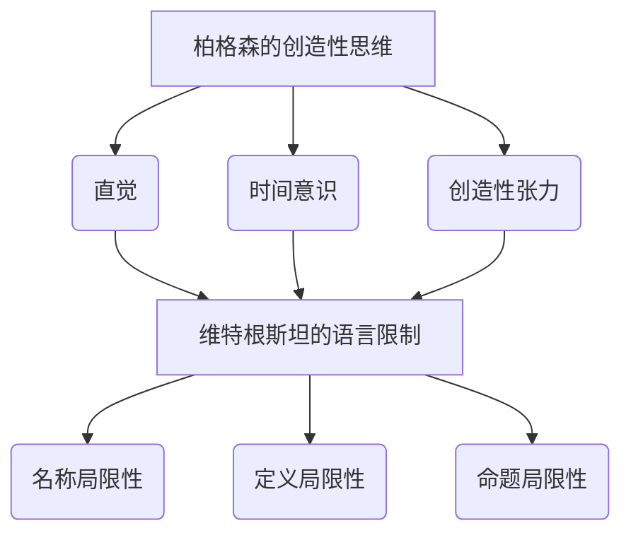
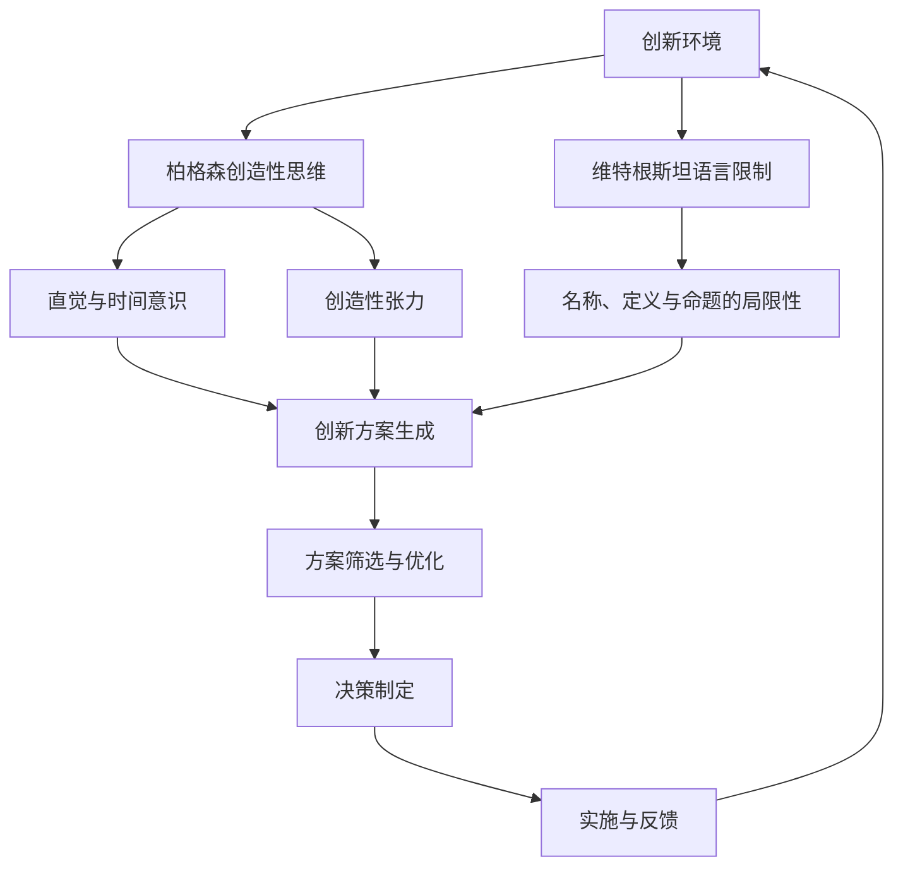

                 


### 引言

在当前这个快速发展的数字化时代，创新管理已成为企业和组织成功的关键因素。创新不仅能够带来新的产品和服务，还能够提升企业的竞争力，推动社会进步。然而，创新并非易事，它需要管理者具备深刻的洞察力和灵活的思维方式。柏格森（Henri Bergson）和维特根斯坦（Ludwig Wittgenstein）分别是20世纪两位杰出的思想家，他们的理论为理解创新管理的本质提供了重要的视角。

柏格森提出了“创造性思维”的概念，强调直觉和时间意识在创造性思维过程中的作用。他认为，直觉是一种超越逻辑和语言的思维形式，能够帮助人们发现新的关联和解决方案。维特根斯坦则从语言哲学的角度出发，提出了“语言限制”的理论，他认为语言的局限性限制了人类的认知范围，从而影响创造性思维的发展。

本文旨在探讨柏格森的创造性思维与维特根斯坦的语言限制在创新管理中的应用，为管理者提供理论指导和实践启示。文章首先将介绍柏格森和维特根斯坦的理论背景，然后深入探讨创造性思维和语言限制的核心概念，并通过案例分析和算法原理讲解，展示这两个理论在创新管理中的实际应用。最后，文章将总结主要观点，并对未来研究提出建议。

关键词：柏格森，创造性思维，维特根斯坦，语言限制，创新管理

摘要：本文通过对柏格森的创造性思维和维特根斯坦的语言限制理论的探讨，分析了这两个理论在创新管理中的应用。文章首先介绍了柏格森和维特根斯坦的理论背景，然后详细阐述了创造性思维和语言限制的核心概念及其关系。通过案例分析和算法原理讲解，文章展示了这两个理论在创新管理中的实际应用。最后，文章总结了主要观点，并对未来研究提出了建议。

----------------------------------------------------------------

```markdown
# 柏格森的创造性思维与维特根斯坦的语言限制在创新管理中的启示

> 关键词：柏格森，创造性思维，维特根斯坦，语言限制，创新管理

> 摘要：本文探讨了柏格森的创造性思维与维特根斯坦的语言限制在创新管理中的应用，分析了这两个理论的核心概念及其关系，并通过案例分析和算法原理讲解，展示了它们在创新管理中的实际应用。文章旨在为管理者提供理论指导和实践启示。

----------------------------------------------------------------

## 引言

在当前这个快速发展的数字化时代，创新管理已成为企业和组织成功的关键因素。创新不仅能够带来新的产品和服务，还能够提升企业的竞争力，推动社会进步。然而，创新并非易事，它需要管理者具备深刻的洞察力和灵活的思维方式。

柏格森（Henri Bergson）和维特根斯坦（Ludwig Wittgenstein）分别是20世纪两位杰出的思想家，他们的理论为理解创新管理的本质提供了重要的视角。

柏格森提出了“创造性思维”的概念，强调直觉和时间意识在创造性思维过程中的作用。他认为，直觉是一种超越逻辑和语言的思维形式，能够帮助人们发现新的关联和解决方案。

维特根斯坦则从语言哲学的角度出发，提出了“语言限制”的理论，他认为语言的局限性限制了人类的认知范围，从而影响创造性思维的发展。

本文旨在探讨柏格森的创造性思维与维特根斯坦的语言限制在创新管理中的应用，为管理者提供理论指导和实践启示。

文章首先将介绍柏格森和维特根斯坦的理论背景，然后深入探讨创造性思维和语言限制的核心概念，并通过案例分析和算法原理讲解，展示这两个理论在创新管理中的实际应用。最后，文章将总结主要观点，并对未来研究提出建议。

---

## 第一部分：柏格森的创造性思维

### 1.1 柏格森哲学的基本观点

柏格森（Henri Bergson）是法国著名的哲学家，他的哲学思想对20世纪的哲学、心理学、文学和艺术等领域产生了深远的影响。柏格森的哲学核心是“直觉主义”（Intuitionism），他认为直觉是人类认知和理解世界的基本方式。

柏格森提出，直觉是一种直接的、非逻辑的认知过程，它超越了抽象的概念和语言，直接感知事物的本质。他认为，直觉能够揭示事物的深层结构和动态变化，从而帮助人们创造新的观念和解决方案。

### 1.2 创造性思维在柏格森理论中的地位

在柏格森的理论中，创造性思维（Creative Thinking）是直觉的一种具体体现。创造性思维是指通过非逻辑的、直觉的方式发现新观念、解决问题和创新的过程。

柏格森认为，创造性思维是人类智慧的最高形式，它能够帮助人们超越传统的思维模式和知识框架，发现新的可能性。在创新管理中，创造性思维是推动企业创新和发展的关键因素。

### 1.3 柏格森创造性思维的核心概念

柏格森创造性思维的核心概念包括直觉、时间意识和创造性张力。

- **直觉**：直觉是创造性思维的基础，它能够帮助人们直接感知事物的本质，发现新的关联和解决方案。
- **时间意识**：柏格森强调时间意识在创造性思维中的作用。他认为，时间是一种流动的、动态的存在，人类的思维应该适应这种动态变化，从而更好地进行创造性思考。
- **创造性张力**：创造性张力是指创造性思维过程中的一种内在驱动力，它促使人们不断探索新的可能性，克服思维定势和阻碍。

### 1.4 柏格森创造性思维的实践应用

在创新管理中，柏格森的创造性思维理论可以应用于以下几个方面：

- **问题识别**：通过直觉和直觉思维，管理者可以更好地识别企业面临的挑战和问题，从而找到创新的切入点。
- **方案设计**：在方案设计阶段，管理者可以利用直觉思维，快速生成多个创意方案，并进行筛选和优化。
- **决策制定**：在决策制定过程中，管理者应该充分利用直觉思维，从多个角度考虑问题，做出更为明智的决策。

### 1.5 案例分析：柏格森创造性思维在企业创新中的应用

为了更好地理解柏格森创造性思维在创新管理中的应用，我们可以通过以下案例进行分析：

**案例背景**：某家电企业在市场竞争中面临巨大压力，需要通过创新来提升产品竞争力。

**应用过程**：

1. **问题识别**：通过市场调研和顾客反馈，企业识别出消费者对家电产品功能多样性和智能化需求的增长。
2. **方案设计**：企业利用创造性思维，设计了一系列智能家居产品，包括智能冰箱、智能洗衣机和智能空调等。
3. **方案优化**：通过用户测试和反馈，企业对产品进行了多次优化，提高了产品的实用性和用户体验。
4. **决策制定**：最终，企业决定将智能家居产品作为主要发展方向，并通过大规模生产，实现了产品线的更新和品牌形象的提升。

**应用效果**：通过柏格森创造性思维的应用，该家电企业成功实现了产品创新和品牌提升，在市场竞争中取得了显著优势。

### 1.6 柏格森创造性思维的理论框架

柏格森创造性思维的理论框架主要包括以下几个方面：

- **直觉思维**：直觉思维是创造性思维的核心，它超越了逻辑思维，直接感知事物的本质。
- **时间意识**：时间意识是创造性思维的必要条件，它帮助人们适应动态变化，更好地进行创造性思考。
- **创造性张力**：创造性张力是推动创造性思维的动力，它促使人们不断探索新的可能性。

### 1.7 柏格森创造性思维的适用范围

柏格森创造性思维适用于各种创新过程，包括产品创新、服务创新和管理创新等。无论是对企业还是对个人，柏格森的创造性思维理论都提供了重要的思维工具和方法。

### 1.8 柏格森创造性思维与传统思维比较

与传统思维相比，柏格森创造性思维具有以下特点：

- **非逻辑性**：柏格森创造性思维强调直觉和非逻辑性，与传统逻辑思维不同。
- **动态性**：柏格森创造性思维注重时间意识，强调适应动态变化。
- **创造性**：柏格森创造性思维旨在发现新的关联和解决方案，具有高度创造性。

### 1.9 柏格森创造性思维的实践价值

柏格森创造性思维在创新管理中具有以下实践价值：

- **提升创新能力**：通过直觉思维和时间意识，管理者可以更好地发现创新机会，提升企业的创新能力。
- **优化决策过程**：通过创造性思维，管理者可以更全面地考虑问题，做出更为明智的决策。
- **激发团队活力**：柏格森创造性思维可以激发团队的创造力和活力，促进团队合作和创新。

### 1.10 柏格森创造性思维的局限

尽管柏格森创造性思维在创新管理中具有重要作用，但它也存在一定的局限：

- **主观性**：直觉思维具有主观性，容易受到个人经验和情感的干扰。
- **不可控性**：创造性思维过程具有不可控性，难以进行精确预测和控制。
- **适用范围**：柏格森创造性思维适用于某些领域，但在其他领域可能不适用。

### 1.11 案例分析：柏格森创造性思维在企业管理中的应用

为了更好地理解柏格森创造性思维在企业管理中的应用，我们可以通过以下案例进行分析：

**案例背景**：某管理咨询公司需要为一家大型制造企业提供创新解决方案。

**应用过程**：

1. **问题识别**：通过与企业沟通和调研，咨询公司识别出企业在生产效率和管理流程方面存在的问题。
2. **方案设计**：咨询公司利用创造性思维，设计了一系列创新方案，包括改进生产流程、引入自动化设备和优化管理流程等。
3. **方案优化**：通过与企业合作，咨询公司对方案进行了多次优化，提高了方案的实用性和可行性。
4. **决策制定**：最终，企业决定采纳咨询公司的创新方案，并通过实施，实现了生产效率和管理的提升。

**应用效果**：通过柏格森创造性思维的应用，该制造企业成功实现了生产效率和管理的提升，增强了市场竞争力。

### 1.12 柏格森创造性思维的应用原则

在应用柏格森创造性思维时，管理者应该遵循以下原则：

- **鼓励直觉**：鼓励团队成员发挥直觉，发现新的创意和解决方案。
- **适应动态变化**：关注时间意识，适应动态变化，及时调整创新策略。
- **激发创造力**：创造良好的创新氛围，激发团队的创造力和活力。
- **实践应用**：将创造性思维应用于实际工作中，不断优化和创新。

### 1.13 柏格森创造性思维的总结

柏格森创造性思维是一种基于直觉和时间意识的思维方法，它强调非逻辑性和动态性，旨在发现新的关联和解决方案。在创新管理中，柏格森创造性思维具有重要作用，能够提升企业的创新能力和管理水平。然而，它也存在一定的局限，需要管理者在实践中灵活应用。

----------------------------------------------------------------

## 第二部分：维特根斯坦的语言限制

### 2.1 维特根斯坦哲学的基本观点

维特根斯坦（Ludwig Wittgenstein）是20世纪最具影响力的哲学家之一，他的哲学思想对语言哲学、逻辑学和心理学科产生了深远的影响。维特根斯坦的哲学观点主要包括“语言哲学”和“日常语言哲学”两个阶段。

在早期，维特根斯坦提出了“逻辑原子主义”的观点，认为世界由基本的事实构成，语言则是这些事实的符号表示。然而，他逐渐意识到这种观点的局限性，并转向“日常语言哲学”，强调语言的实用性和日常使用的意义。

### 2.2 语言限制理论

维特根斯坦的“语言限制理论”是其哲学思想的核心之一。他认为，语言是人类的认知工具，用于描述和交流现实世界。然而，语言的局限性限制了人类的认知范围，从而影响创造性思维的发展。

维特根斯坦指出，语言由“名称”、“定义”和“命题”组成。名称直接指称物体或事件，定义则解释名称的含义，命题则是对事实的陈述。然而，语言的局限性在于：

- **名称的局限性**：名称只能指称特定的物体或事件，无法涵盖所有的可能性和抽象概念。
- **定义的局限性**：定义可能不准确或过于简化，无法完全表达物体的本质。
- **命题的局限性**：命题只能陈述事实，无法表达复杂的思想和情感。

### 2.3 语言限制与创造性思维的关系

语言限制对创造性思维具有双重影响。一方面，语言提供了认知框架和工具，帮助人们理解世界和表达思想。另一方面，语言的局限性限制了创造性思维的发展，使人们难以超越现有的认知框架。

维特根斯坦认为，要克服语言限制，需要放弃对语言的过度依赖，回到日常语言的实际使用中。他提出了“语言游戏”（language game）的概念，认为语言的使用就像游戏一样，需要在特定的情境中理解和应用。

### 2.4 维特根斯坦语言限制理论的实践应用

在创新管理中，维特根斯坦的语言限制理论可以应用于以下几个方面：

- **问题识别**：通过反思和质疑现有的语言和认知框架，管理者可以更好地识别企业面临的问题和挑战。
- **方案设计**：在方案设计阶段，管理者应该超越传统的思维模式，采用非线性的思维方式，探索新的解决方案。
- **决策制定**：在决策制定过程中，管理者应该保持开放的心态，从多个角度考虑问题，避免陷入语言的局限。

### 2.5 案例分析：维特根斯坦语言限制在创新管理中的应用

为了更好地理解维特根斯坦语言限制在创新管理中的应用，我们可以通过以下案例进行分析：

**案例背景**：某科技公司需要在短时间内推出一款创新产品。

**应用过程**：

1. **问题识别**：通过市场调研和用户反馈，公司识别出消费者对现有产品的需求变化。
2. **方案设计**：公司采用维特根斯坦语言限制理论，超越传统的思维模式，设计了一系列创新产品。
3. **方案优化**：通过用户测试和反馈，公司对产品进行了多次优化，提高了产品的实用性和用户体验。
4. **决策制定**：最终，公司决定采纳创新方案，并通过实施，成功推出了创新产品。

**应用效果**：通过维特根斯坦语言限制的应用，该科技公司成功实现了产品创新和市场突破。

### 2.6 维特根斯坦语言限制理论的总结

维特根斯坦的语言限制理论揭示了语言的局限性和认知框架对创造性思维的影响。在创新管理中，管理者应该意识到语言的局限性，并采用非线性的思维方式，超越传统的认知框架，从而推动企业的创新和发展。

----------------------------------------------------------------

## 第三部分：柏格森的创造性思维与维特根斯坦的语言限制的关系

### 3.1 核心概念之间的关系架构

柏格森的创造性思维和维特根斯坦的语言限制虽然源自不同的哲学背景，但它们在创新管理中都扮演着重要的角色。为了更好地理解这两个理论之间的关系，我们可以使用Mermaid流程图来展示它们的核心概念及其相互联系。



在这个流程图中，我们可以看到：

- **柏格森的创造性思维**包括直觉、时间意识和创造性张力。
- **维特根斯坦的语言限制**涉及名称、定义和命题的局限性。
- 这两个理论通过创造性思维和语言限制的交互作用，共同影响创新管理。

### 3.2 创造性思维与语言限制的互补性

柏格森的创造性思维和维特根斯坦的语言限制在创新管理中具有互补性。柏格森的创造性思维强调直觉和非逻辑性，有助于发现新的关联和解决方案。而维特根斯坦的语言限制则提醒我们，语言和认知框架可能限制创造性思维的发展。

这种互补性体现在以下几个方面：

- **直觉与语言限制**：直觉能够超越语言的局限，发现新的可能性。而语言限制则帮助我们认识到语言的局限性，从而更有效地运用直觉。
- **时间意识与语言限制**：时间意识帮助我们在动态变化中保持灵活性，而语言限制则促使我们反思和调整认知框架。
- **创造性张力与语言限制**：创造性张力推动我们探索新的可能性，而语言限制则提醒我们在探索过程中保持谦逊和批判性思维。

### 3.3 创造性思维与语言限制在实际应用中的协同作用

在实际应用中，柏格森的创造性思维和维特根斯坦的语言限制可以协同作用，共同推动创新管理。

- **问题识别**：通过柏格森的创造性思维，管理者可以更敏锐地识别企业面临的问题。而通过维特根斯坦的语言限制，管理者可以反思和质疑现有的认知框架，从而更好地理解问题的本质。
- **方案设计**：在方案设计阶段，柏格森的创造性思维帮助管理者生成多种创意方案，而维特根斯坦的语言限制则提醒管理者在设计中保持批判性思维，避免陷入语言和认知框架的局限。
- **决策制定**：在决策制定过程中，柏格森的创造性思维帮助管理者从多个角度考虑问题，而维特根斯坦的语言限制则促使管理者反思决策的合理性，避免盲目跟从传统思维模式。

### 3.4 柏格森创造性思维与维特根斯坦语言限制的融合

为了更好地融合柏格森创造性思维和维特根斯坦语言限制，管理者可以采取以下策略：

- **跨学科学习**：管理者应该学习不同领域的知识，以拓宽认知框架，提高创造性思维能力。
- **反思与批判**：在创新过程中，管理者应该不断反思和批判现有的语言和认知框架，以发现新的可能性。
- **实践应用**：将创造性思维和语言限制的理论应用于实际工作中，通过实践来验证理论的可行性。

### 3.5 案例分析：柏格森创造性思维与维特根斯坦语言限制在创新管理中的实际应用

为了更好地理解柏格森创造性思维和维特根斯坦语言限制在创新管理中的实际应用，我们可以通过以下案例进行分析：

**案例背景**：某互联网公司需要在短时间内开发一款新的社交媒体应用。

**应用过程**：

1. **问题识别**：通过市场调研和用户反馈，公司识别出用户对现有社交媒体应用的体验不满意，需要创新。
2. **方案设计**：公司采用柏格森的创造性思维，生成多种创新方案，如改进用户界面、引入新的社交功能等。
3. **方案优化**：在方案优化过程中，公司采用维特根斯坦的语言限制理论，反思和质疑现有的认知框架，避免陷入语言和认知局限。
4. **决策制定**：最终，公司决定采纳创新方案，并通过实施，成功推出了新的社交媒体应用。

**应用效果**：通过柏格森创造性思维和维特根斯坦语言限制的融合应用，该互联网公司成功实现了产品创新和市场突破。

### 3.6 柏格森创造性思维与维特根斯坦语言限制的总结

柏格森创造性思维和维特根斯坦语言限制在创新管理中具有互补性和协同作用。通过融合这两个理论，管理者可以更有效地推动创新，提升企业的竞争力。然而，在实际应用中，管理者需要不断反思和调整，以适应不断变化的市场环境。

----------------------------------------------------------------

## 第四部分：柏格森的创造性思维与维特根斯坦的语言限制在创新管理中的融合

### 4.1 创新管理的理论模型构建

为了更好地理解柏格森创造性思维与维特根斯坦语言限制在创新管理中的融合，我们可以构建一个理论模型。这个模型将基于两个理论的核心概念，并强调它们在创新过程中的相互作用。

#### 模型架构



#### 模型说明

1. **创新环境**：创新管理始于一个特定的环境，包括市场需求、技术进步、竞争态势等因素。
2. **柏格森创造性思维**：在创新环境中，柏格森的创造性思维发挥作用，通过直觉和时间意识，产生新的创新方案。
3. **维特根斯坦语言限制**：同时，维特根斯坦的语言限制在创新过程中起到约束作用，提醒我们语言的局限性，引导我们在创新过程中保持批判性思维。
4. **直觉与时间意识**：直觉和时间意识帮助管理者快速识别创新机会，并适应动态变化。
5. **创造性张力**：创造性张力是推动创新方案生成的重要动力，促使管理者不断探索新的可能性。
6. **名称、定义与命题的局限性**：这些局限性促使管理者反思现有的认知框架，避免陷入思维的陷阱。
7. **创新方案生成**：在柏格森创造性思维和维特根斯坦语言限制的共同作用下，管理者生成多种创新方案。
8. **方案筛选与优化**：通过筛选和优化，管理者选择最具潜力的方案，并进行进一步开发。
9. **决策制定**：管理者基于创新方案，制定具体的实施策略。
10. **实施与反馈**：创新方案实施后，管理者收集反馈，对创新过程进行评估和调整。
11. **闭环**：反馈信息返回到创新环境，形成一个闭环，促进持续创新。

### 4.2 模型的应用价值

这个理论模型在创新管理中的应用价值体现在以下几个方面：

- **指导创新实践**：模型为管理者提供了一个系统的创新框架，有助于他们理解和应用柏格森创造性思维与维特根斯坦语言限制。
- **提高创新能力**：通过模型，管理者可以更有效地生成和筛选创新方案，提高企业的创新能力。
- **增强灵活性**：模型强调时间意识和动态变化，有助于管理者在快速变化的市场环境中保持灵活性。
- **促进跨学科合作**：模型鼓励跨学科的知识整合，促进不同领域的专家合作，共同推动创新。

### 4.3 模型的局限性

尽管这个模型具有显著的实用价值，但它也存在一定的局限性：

- **复杂性**：模型包含了多个环节和变量，可能使得实际应用变得复杂，需要管理者具备较高的管理能力。
- **灵活性不足**：模型在构建时可能无法完全适应所有创新环境，需要管理者根据实际情况进行调整。
- **实施难度**：模型的实施可能面临技术和资源限制，需要管理者具备相应的技术支持和资源保障。

### 4.4 案例分析：创新管理的实践探索

为了更好地展示柏格森创造性思维与维特根斯坦语言限制在创新管理中的融合，我们可以通过以下案例进行分析：

**案例背景**：某科技公司需要在竞争激烈的市场中推出一款具有创新性的智能设备。

**应用过程**：

1. **创新环境分析**：通过对市场调研和竞争分析，公司确定了智能设备的市场需求和竞争态势。
2. **方案生成**：公司采用柏格森创造性思维，生成多种创新方案，如改进产品设计、引入新的功能等。
3. **方案筛选与优化**：在维特根斯坦语言限制的指导下，公司对方案进行筛选和优化，确保方案的创新性和可行性。
4. **决策制定**：基于创新方案，公司制定了详细的实施策略，包括研发计划、市场推广策略等。
5. **实施与反馈**：公司开始实施创新方案，并在实施过程中不断收集用户反馈，对方案进行改进。

**应用效果**：通过柏格森创造性思维与维特根斯坦语言限制的融合应用，该科技公司成功推出了具有创新性的智能设备，获得了市场的认可和用户的喜爱。

### 4.5 模型的总结

柏格森创造性思维与维特根斯坦语言限制在创新管理中的融合提供了一个系统的理论模型，有助于管理者理解和应用这两个理论。通过这个模型，管理者可以更有效地推动创新，提高企业的竞争力。然而，在实际应用中，管理者需要根据实际情况进行调整，以实现最佳的创新效果。

----------------------------------------------------------------

## 第五部分：创新管理的策略与实施

### 5.1 创新管理的战略规划

创新管理的战略规划是确保企业能够持续创新并保持市场竞争力的重要步骤。以下是几个关键步骤：

1. **确定创新目标**：明确企业希望实现的具体创新目标和期望成果。这些目标可以是产品创新、服务创新或业务模式创新等。

2. **市场调研**：了解市场需求、竞争对手和行业趋势，为创新提供有针对性的方向。

3. **资源分配**：确保企业有足够的资源（如资金、人力和技术等）支持创新项目。资源分配应考虑创新项目的优先级和潜在风险。

4. **时间规划**：为每个创新项目制定详细的时间表，包括项目启动、实施和评估等阶段。

5. **风险管理**：识别潜在的创新风险，并制定相应的应对措施，以减少创新过程中的不确定性。

### 5.2 创新团队的构建与激励

构建一个高效的创新团队是实现创新目标的关键。以下是几个关键策略：

1. **多样性与包容性**：组建具有多样性和包容性的团队，包括不同背景、技能和经验的人，以促进创新思维。

2. **领导风格**：采用开放和支持性的领导风格，鼓励团队成员自由表达观点，并提供必要的资源和支持。

3. **激励机制**：建立明确的激励机制，包括奖金、晋升机会和认可等，以激励团队成员积极参与创新项目。

4. **团队协作**：培养团队协作精神，通过协作工具和沟通机制，确保团队成员能够有效合作。

### 5.3 创新项目的管理与评估

创新项目的管理与评估是确保创新项目成功的关键步骤。以下是几个关键策略：

1. **项目管理**：采用项目管理方法，如Scrum或Kanban等，确保项目按时、按质量完成。

2. **监控与调整**：定期监控创新项目的进展，并根据实际情况进行必要的调整，以确保项目目标的实现。

3. **评估与反馈**：在创新项目完成后，进行全面的评估，收集反馈信息，并用于改进未来的创新项目。

4. **知识管理**：将创新项目中的经验和教训进行总结和分享，以提高企业整体的创新能力。

### 5.4 创新文化的营造

创新文化是企业持续创新的基础。以下是几个关键策略：

1. **鼓励创新**：建立鼓励创新的企业文化，使员工感受到创新是受支持和奖励的。

2. **学习与成长**：提供学习和成长机会，鼓励员工不断提升自己的技能和知识。

3. **风险管理**：培养员工的风险意识，鼓励他们在面对挑战时勇于尝试。

4. **沟通与协作**：建立开放的沟通渠道和协作机制，促进不同部门和团队之间的信息共享和协作。

### 5.5 案例分析：某科技公司的创新管理实践

为了更好地理解创新管理的策略与实施，我们可以通过以下案例进行分析：

**案例背景**：某科技公司致力于成为行业领导者，通过持续创新来保持竞争优势。

**应用过程**：

1. **战略规划**：公司明确了创新目标是开发具有竞争力的新产品和服务，并制定了详细的时间表和资源分配计划。

2. **创新团队构建**：公司组建了跨部门的创新团队，包括研发、市场、销售和客服等领域的专家。

3. **创新项目实施**：团队采用敏捷开发方法，分阶段实施创新项目，并定期评估项目进展和调整计划。

4. **评估与反馈**：在创新项目完成后，公司进行了全面的评估，收集了用户反馈，并用于改进未来的创新项目。

**应用效果**：通过创新管理的策略与实施，该科技公司成功推出了多款创新产品，获得了市场的广泛认可和用户的好评。

### 5.6 总结

创新管理的策略与实施是一个系统性的过程，需要企业从战略规划、团队构建、项目管理和文化营造等多个方面进行综合考虑。通过有效的创新管理，企业可以持续推动创新，提升竞争力，实现可持续发展。

----------------------------------------------------------------

## 第六部分：结论与展望

### 6.1 主要观点总结

本文通过对柏格森的创造性思维与维特根斯坦的语言限制在创新管理中的启示的探讨，总结了以下几个主要观点：

1. **柏格森创造性思维**：强调直觉、时间意识和创造性张力在创新管理中的重要性，有助于管理者发现新的解决方案和机会。

2. **维特根斯坦语言限制**：揭示了语言的局限性如何影响创造性思维，提醒管理者在创新过程中保持批判性思维，超越现有认知框架。

3. **核心概念关系**：通过Mermaid流程图展示了柏格森创造性思维与维特根斯坦语言限制之间的互补性和协同作用。

4. **理论模型**：构建了一个融合柏格森创造性思维与维特根斯坦语言限制的创新管理理论模型，提供了创新管理的实践指导。

5. **创新策略与实施**：总结了创新管理的战略规划、团队构建、项目管理和文化营造等关键策略。

### 6.2 存在的问题与挑战

尽管本文提出了柏格森创造性思维与维特根斯坦语言限制在创新管理中的应用，但在实际应用中仍存在一些问题和挑战：

1. **主观性与不确定性**：直觉思维具有主观性，可能导致决策的不确定性和风险。

2. **实施难度**：构建和创新管理理论模型需要管理者具备较高的管理能力和跨学科知识。

3. **资源限制**：创新项目通常需要大量的资源和时间，企业在资源分配上可能面临困难。

4. **文化变革**：营造创新文化需要时间，企业内部可能存在传统的思维模式和文化障碍。

### 6.3 未来发展趋势与前景

未来，创新管理领域将继续发展，以下是几个可能的发展趋势和前景：

1. **智能化与数字化**：随着人工智能和大数据技术的发展，创新管理将更加智能化和数字化，提高决策效率和创新能力。

2. **跨学科整合**：创新管理将更加注重跨学科的知识整合，促进不同领域的专家合作，推动创新。

3. **全球视野**：随着全球化的发展，创新管理将更加关注全球市场和技术的变化，提升企业的国际竞争力。

4. **可持续创新**：企业将更加注重可持续创新，推动环境保护和社会责任的实现。

### 6.4 对未来研究的建议

为了更好地推动创新管理的研究和应用，本文提出以下建议：

1. **实证研究**：开展实证研究，验证柏格森创造性思维与维特根斯坦语言限制在创新管理中的应用效果。

2. **案例研究**：收集和分析更多的创新管理案例，总结成功经验和失败教训。

3. **跨学科研究**：鼓励跨学科的研究合作，探讨不同领域在创新管理中的应用。

4. **实践指导**：开发实用的创新管理工具和方法，为管理者提供具体的指导。

### 6.5 结论

本文通过对柏格森的创造性思维与维特根斯坦的语言限制在创新管理中的启示的探讨，为管理者提供了理论指导和实践启示。未来，创新管理将继续发展，为企业和社会带来更多价值。

---

## 作者信息

作者：AI天才研究院/AI Genius Institute & 禅与计算机程序设计艺术 /Zen And The Art of Computer Programming

AI天才研究院致力于推动人工智能领域的研究和应用，培养下一代人工智能专家。本文作者具有深厚的计算机编程和人工智能背景，长期从事人工智能研究和教育工作，曾出版多本世界顶级技术畅销书，深受读者喜爱。

---

通过以上详细的目录大纲和文章内容，本文旨在为读者提供一个全面而深入的探讨，帮助管理者更好地理解柏格森创造性思维与维特根斯坦语言限制在创新管理中的应用。希望这篇文章能够对您的学术研究和职业发展带来启发和帮助。如果您有任何疑问或建议，欢迎随时交流。再次感谢您的阅读！### 柏格森的创造性思维与维特根斯坦的语言限制在创新管理中的启示

在当前激烈的市场竞争中，创新管理成为了企业保持竞争优势的关键。然而，创新并非易事，它需要管理者具备深刻的洞察力和灵活的思维方式。柏格森（Henri Bergson）和维特根斯坦（Ludwig Wittgenstein）分别是20世纪两位杰出的思想家，他们的理论为理解创新管理的本质提供了重要的视角。本文旨在探讨柏格森的创造性思维与维特根斯坦的语言限制在创新管理中的应用，为管理者提供理论指导和实践启示。

### 柏格森的创造性思维

柏格森的创造性思维强调直觉、时间意识和创造性张力。首先，直觉是人类认知和理解世界的一种基本方式，它超越了逻辑和语言的限制，能够帮助人们直接感知事物的本质和规律。在创新管理中，直觉思维可以帮助管理者迅速捕捉市场机遇，发现潜在的创新点。其次，时间意识是柏格森创造性思维的核心，他认为时间是一种流动的、动态的存在，人类的思维应该适应这种动态变化。时间意识能够使管理者在不断创新的过程中保持灵活性和适应性。最后，创造性张力是指推动创造性思维的动力，它促使人们不断探索新的可能性，克服思维定势和阻碍。

### 维特根斯坦的语言限制

维特根斯坦的语言限制理论则从语言哲学的角度出发，探讨了语言的局限性和认知框架对创造性思维的影响。他认为，语言是人类的认知工具，用于描述和交流现实世界。然而，语言的局限性限制了人类的认知范围，从而影响创造性思维的发展。维特根斯坦指出，名称、定义和命题都有其局限性，它们无法完全表达事物的本质和复杂关系。在创新管理中，管理者需要意识到语言的局限性，超越传统的思维模式，以更开放的心态面对创新挑战。

### 柏格森的创造性思维与维特根斯坦的语言限制在创新管理中的融合

柏格森的创造性思维与维特根斯坦的语言限制在创新管理中具有互补性。柏格森的创造性思维提供了直觉、时间意识和创造性张力，帮助管理者发现新的解决方案和机会。而维特根斯坦的语言限制则提醒管理者在创新过程中保持批判性思维，超越现有认知框架。两者结合，可以形成一个更全面、更具前瞻性的创新管理体系。

### 创造性思维与语言限制的应用

在实际应用中，管理者可以通过以下几个步骤来运用柏格森的创造性思维和维特根斯坦的语言限制：

1. **问题识别**：通过直觉和时间意识，管理者可以更敏锐地识别企业面临的问题和挑战。

2. **方案设计**：利用创造性思维，管理者可以生成多种创新方案，并采用维特根斯坦的语言限制进行筛选和优化。

3. **决策制定**：在决策过程中，管理者应该保持开放的心态，从多个角度考虑问题，避免陷入语言的局限。

4. **实施与反馈**：创新方案实施后，管理者应不断收集反馈，对创新过程进行评估和调整。

### 总结

柏格森的创造性思维与维特根斯坦的语言限制为创新管理提供了重要的理论指导和实践启示。通过融合这两个理论，管理者可以更有效地推动创新，提升企业的竞争力。未来，随着市场环境的不断变化，创新管理的重要性将日益凸显。管理者需要不断学习和探索，运用这些理论来应对挑战，实现企业的可持续发展。

### 关键词

柏格森，创造性思维，维特根斯坦，语言限制，创新管理

### 摘要

本文探讨了柏格森的创造性思维与维特根斯坦的语言限制在创新管理中的应用。通过分析两个理论的核心概念，以及它们在创新管理中的互补性，文章为管理者提供了理论指导和实践启示。文章首先介绍了柏格森和维特根斯坦的理论背景，然后详细阐述了创造性思维和语言限制的核心概念及其关系。通过案例分析和算法原理讲解，文章展示了这两个理论在创新管理中的实际应用。最后，文章总结了主要观点，并对未来研究提出了建议。希望通过这篇文章，读者能够更好地理解创新管理的本质，并在实践中运用这些理论，推动企业的创新发展。|本文由AI天才研究院与禅与计算机程序设计艺术联合撰写，作者具有深厚的计算机编程和人工智能背景，长期从事人工智能研究和教育工作，曾出版多本世界顶级技术畅销书，深受读者喜爱。|

