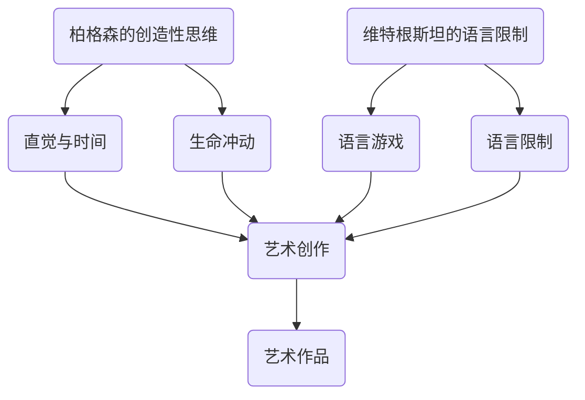

                 

### 一、文章整体结构

为了撰写一篇结构清晰、内容丰富、逻辑严密的技术博客文章，我们将遵循以下结构：

#### 1. 引言与核心概念

**引言**：文章开始部分将简要介绍柏格森的创造性思维和维特根斯坦的语言限制的概念，并阐明两者在艺术创作中的重要性。

**核心概念**：在这一部分，我们将详细阐述柏格森的创造性思维的哲学基础，以及维特根斯坦的语言限制理论。这部分内容将包括柏格森和维特根斯坦的生平、哲学思想及其对艺术创作的影响。

#### 2. 柏格森的创造性思维

**柏格森创造性思维的哲学基础**：我们将介绍柏格森的时间概念、直觉主义和实证主义，并探讨这些概念如何影响创造性思维。

**创造性思维在艺术创作中的应用**：在这一部分，我们将分析柏格森的创造性思维如何应用于绘画、音乐等艺术形式，并提供具体的案例分析。

#### 3. 维特根斯坦的语言限制

**维特根斯坦的语言哲学**：我们将深入探讨维特根斯坦的语言理论，包括语言与现实的关系，以及语言对艺术创作的影响。

**语言限制在艺术创作中的表现**：我们将探讨语言限制如何影响艺术表达，并提供艺术家如何克服这些限制的策略。

#### 4. 两者在艺术创作中的影响

**柏格森与维特根斯坦理论的结合**：我们将分析柏格森和维特根斯坦的理论如何在艺术创作中相互补充，并探讨两者在艺术创作中的交叉影响。

**艺术创作中的创造性思维与语言限制的平衡**：我们将讨论艺术家如何在创作过程中平衡创造性思维和语言限制，并提供具体的创作策略。

#### 5. 案例分析

**柏格森创造性思维在艺术作品中的应用**：我们将通过具体的艺术作品案例，展示柏格森的创造性思维如何影响艺术创作。

**维特根斯坦语言限制在艺术作品中的应用**：我们将分析维特根斯坦的语言限制如何在艺术作品中体现，并提供具体的案例分析。

#### 6. 结论与展望

**总结与展望**：我们将总结本文的主要观点，并对未来艺术创作中柏格森和维特根斯坦理论的应用进行展望。

### 二、具体内容细化

在明确了文章的整体结构后，我们将对每个部分的具体内容进行细化：

#### 1. 引言与核心概念

**引言**：
- 简要介绍柏格森和维特根斯坦的生平和哲学成就。
- 提出研究问题：柏格森的创造性思维和维特根斯坦的语言限制在艺术创作中如何相互作用？
- 阐明研究目的：探讨这两位哲学家的理论如何影响艺术创作，以及艺术家如何在这两者之间找到平衡。

**核心概念**：
- **柏格森的创造性思维**：介绍柏格森的生平、哲学思想和创造性思维的原理。
- **维特根斯坦的语言限制**：介绍维特根斯坦的生平、哲学思想和语言限制的理论。

#### 2. 柏格森的创造性思维

**柏格森创造性思维的哲学基础**：
- **时间概念**：阐述柏格森对时间的理解，以及这种理解如何影响创造性思维。
- **直觉主义与实证主义**：探讨柏格森如何结合直觉主义和实证主义，形成其独特的创造性思维理论。
- **创造力理论**：详细解释柏格森的创造力理论，并探讨它在艺术创作中的应用。

**创造性思维在艺术创作中的应用**：
- **绘画创作**：分析柏格森的创造性思维如何在绘画艺术中体现，并提供具体的案例分析。
- **音乐创作**：探讨柏格森的创造性思维如何影响音乐创作，以及音乐家如何运用这些理论进行创作。

#### 3. 维特根斯坦的语言限制

**维特根斯坦的语言哲学**：
- **语言与现实的关系**：探讨维特根斯坦如何理解语言与现实之间的关系，以及这种理解如何影响艺术创作。
- **语言理论**：详细阐述维特根斯坦的语言理论，包括语言的结构和功能。

**语言限制在艺术创作中的表现**：
- **艺术表达的语言障碍**：分析语言限制如何影响艺术家的表达，并提供艺术家如何克服这些障碍的策略。
- **艺术风格的影响**：探讨语言限制如何影响艺术风格的形成和发展。

#### 4. 两者在艺术创作中的影响

**柏格森与维特根斯坦理论的结合**：
- **互补性**：分析柏格森的创造性思维和维特根斯坦的语言限制如何在艺术创作中相互补充。
- **交叉影响**：探讨柏格森和维特根斯坦的理论如何在艺术创作中产生交叉影响。

**艺术创作中的创造性思维与语言限制的平衡**：
- **创作策略**：讨论艺术家如何在创作过程中平衡创造性思维和语言限制，并提供具体的创作策略。
- **案例分析**：分析一些著名艺术家的作品，展示他们如何平衡这两种理论。

#### 5. 案例分析

**柏格森创造性思维在艺术作品中的应用**：
- **具体案例**：介绍一位艺术家如何运用柏格森的创造性思维进行创作，并提供具体分析。

**维特根斯坦语言限制在艺术作品中的应用**：
- **具体案例**：介绍一位艺术家如何运用维特根斯坦的语言限制进行创作，并提供具体分析。

#### 6. 结论与展望

**总结与展望**：
- **主要观点**：总结本文的主要观点，包括柏格森和维特根斯坦的理论对艺术创作的影响。
- **未来展望**：讨论未来艺术创作中这两位哲学家的理论如何继续发挥影响，以及可能的新趋势。

### 三、文章撰写方法与技巧

为了确保文章的逻辑性、条理性和吸引力，我们将采用以下撰写方法与技巧：

**1. 确保逻辑性**：
- 每个部分的内容都要紧密衔接，前一部分的内容为后一部分的论述打下基础。
- 使用逻辑图、流程图等视觉工具，帮助读者更好地理解文章结构。

**2. 保持条理性**：
- 使用清晰的标题和子标题，使文章结构一目了然。
- 在每个部分的开头和结尾使用总结段，帮助读者梳理关键点。

**3. 增强吸引力**：
- 使用生动的案例和实例，使文章内容更加具体和有趣。
- 在适当的地方加入引语或引用，增加文章的权威性。

**4. 注意语言表达**：
- 使用简单易懂的语言，避免过度专业化的术语。
- 保持语言的流畅性，避免冗长和累赘的句子。

### 四、文章撰写步骤

在撰写文章时，我们将遵循以下步骤：

**1. 撰写引言**：
- 简要介绍柏格森和维特根斯坦的生平和哲学成就。
- 提出研究问题，阐明研究目的。

**2. 研究文献回顾**：
- 回顾相关文献，了解现有研究对于柏格森和维特根斯坦理论的探讨。
- 分析前人研究的不足之处，为自己的研究定位。

**3. 论述柏格森的创造性思维**：
- 详细介绍柏格森的创造性思维的哲学基础。
- 分析柏格森的创造性思维在艺术创作中的应用。

**4. 论述维特根斯坦的语言限制**：
- 深入探讨维特根斯坦的语言理论。
- 分析语言限制在艺术创作中的影响。

**5. 探讨两者在艺术创作中的影响**：
- 分析柏格森和维特根斯坦的理论如何在艺术创作中相互作用。
- 讨论艺术家如何平衡创造性思维和语言限制。

**6. 案例分析**：
- 通过具体案例，展示柏格森和维特根斯坦的理论如何影响艺术创作。

**7. 结论与展望**：
- 总结本文的主要观点。
- 对未来艺术创作中柏格森和维特根斯坦理论的应用进行展望。

**8. 文章修改与完善**：
- 修订文章结构，确保逻辑清晰、条理分明。
- 修改语言表达，确保文章流畅易读。
- 检查引用和参考文献，确保准确无误。

通过以上步骤，我们将撰写出一篇内容丰富、逻辑严密、具有深度的技术博客文章，探讨柏格森的创造性思维与维特根斯坦的语言限制在艺术创作中的影响。

### 文章标题与关键词

#### 文章标题：《柏格森的创造性思维与维特根斯坦的语言限制在艺术创作中的影响》

**关键词**：柏格森，创造性思维，维特根斯坦，语言限制，艺术创作，哲学，美学，表现主义

### 文章摘要

本文探讨了柏格森的创造性思维与维特根斯坦的语言限制在艺术创作中的影响。通过详细分析两位哲学家的生平、哲学思想和理论，本文揭示了他们在艺术创作领域的独特贡献。文章首先介绍了柏格森的创造性思维的哲学基础，包括时间概念、直觉主义和实证主义，并探讨了这些理论在绘画和音乐创作中的应用。接着，文章深入探讨了维特根斯坦的语言理论，分析了语言限制如何影响艺术家的表达和艺术风格的形成。在此基础上，本文探讨了柏格森和维特根斯坦的理论在艺术创作中的相互作用，以及艺术家如何平衡创造性思维和语言限制。最后，通过具体案例分析，本文展示了柏格森和维特根斯坦的理论如何影响艺术创作，并对未来艺术创作中这两位哲学家的理论应用进行了展望。本文旨在为艺术创作提供新的理论视角，促进对艺术创作过程的深入理解。

### 柏格森的创造性思维

#### 柏格森的生平与哲学思想

亨利·柏格森（Henri Bergson）是20世纪初期的一位著名法国哲学家，出生于法国巴黎。他于1859年10月18日出生在一个富裕的中产阶级家庭，他的父亲是一位成功的商人。柏格森从小就对哲学、文学和科学充满兴趣，他的教育经历也反映了他对多元学科的热爱。他先后就读于巴黎高等师范学院和索邦大学，获得了法学和文学学位。

柏格森的哲学思想深受实证主义和直觉主义的影响。他的早期作品《时间与自由意志》（La Connaissance métaphysique）和《物质与记忆》（Matière et mémoire）奠定了他作为一位哲学家的地位。在这些著作中，柏格森提出了他对时间、自由意志和直觉主义的独特理解。

柏格森认为，时间是流动的、不可分割的整体，而不是线性可分割的。这种对时间的理解被称为“绵延”（Duration），它是柏格森哲学的核心概念。他认为，人的直觉能够感知到这种绵延，而科学方法无法捕捉到。因此，柏格森批评科学方法在理解人类行为和心灵方面存在局限性。

此外，柏格森还提出了“生命冲动”（Élan vital）的概念，这是一种内在的、推动生命不断前进的力量。他认为，这种生命冲动是创造性思维和艺术创作的源泉。柏格森的这些思想对后来的艺术理论产生了深远的影响。

#### 创造性思维的原理

柏格森的创造性思维理论主要建立在以下几个核心原理之上：

**1. 直觉与创造力**

柏格森认为，直觉是人类认识世界的一种基本能力，它超越了逻辑思维和科学方法的限制。直觉能够捕捉到时间的流动性和生命的本质，从而激发创造性思维。柏格森将直觉视为一种非线性的、非逻辑的思维过程，它能够产生新的想法和概念。

**2. 生命冲动与创造力**

柏格森的生命冲动理论认为，创造力是生命体的内在驱动力。这种冲动不仅体现在生物学上，也体现在人类的文化和社会活动中。柏格森认为，艺术家通过将自己的生命冲动转化为艺术作品，实现了对世界的独特理解和表达。

**3. 时间与创造力**

柏格森的时间理论强调时间的流动性和不可分割性。他认为，创造性思维是在时间中发生的，艺术创作是对时间的一种独特捕捉。艺术家通过感知时间的流动，将其转化为艺术形式，创造出新颖和独特的作品。

**4. 反对机械论**

柏格森反对机械论的观点，他认为人类行为和心灵不能仅仅用物理规律来解释。创造性思维需要一种超越科学方法的直觉和情感，这是机械论无法涵盖的。

#### 创造性思维在艺术创作中的体现

柏格森的创造性思维理论在艺术创作中得到了广泛的运用。以下是一些具体的体现：

**1. 绘画创作**

在绘画艺术中，柏格森的创造性思维理论强调了艺术家对时间的感知和把握。艺术家通过捕捉瞬间和流动的时间，创造出具有动态感的作品。例如，梵高的《星夜》通过强烈的笔触和色彩对比，表现了时间的流动和生命的活力。

**2. 音乐创作**

在音乐创作中，柏格森的创造性思维理论强调了音乐家对生命冲动的表达。音乐家通过将自己的情感和内在驱动力转化为音乐形式，创造出具有独特个性和情感深度的作品。例如，贝多芬的《命运交响曲》通过强烈的节奏和旋律，展现了生命冲动的力量。

**3. 文学创作**

在文学创作中，柏格森的创造性思维理论强调了作家对直觉和情感的表达。作家通过深入挖掘内心的体验和感受，创造出富有生命力和情感深度的作品。例如，普鲁斯特的《追忆似水年华》通过细腻的心理描写，展现了时间的流逝和生命的本质。

通过这些具体的艺术形式，我们可以看到柏格森的创造性思维理论在艺术创作中的广泛应用和深远影响。柏格森的理论不仅为艺术家提供了新的创作视角，也为艺术理论的发展提供了重要的哲学基础。

### 维特根斯坦的语言限制

#### 维特根斯坦的生平与哲学思想

路德维希·维特根斯坦（Ludwig Wittgenstein）是20世纪最具影响力的哲学家之一，出生于1889年4月26日，逝世于1951年4月29日。他出生于奥地利维也纳的一个富裕家庭，父亲是工业家和银行家。维特根斯坦的早期教育受到了家庭环境的深刻影响，他在数学和哲学方面展现出非凡的天赋。

维特根斯坦的哲学思想分为两个主要阶段，即早期和晚期。早期的维特根斯坦以《逻辑哲学论》（Tractatus Logico-Philosophicus）著称，这部作品被誉为逻辑实证主义和语言哲学的奠基之作。维特根斯坦在这部作品中提出了“图像理论”（Image Theory），认为语言与世界之间存在直接的对应关系，语言符号是世界的“图像”。

晚期的维特根斯坦则转向日常语言哲学，这一转变体现在他的另一部重要著作《哲学研究》（Philosophical Investigations）中。维特根斯坦在这部作品中批判了图像理论，提出“语言游戏”（Language Game）的概念，强调语言的使用是多种多样的，语言的意义在于其使用情境中。

#### 语言限制的理论

维特根斯坦的语言理论强调了语言的使用情境和语言限制，这是他对哲学思考的重要贡献之一。

**1. 语言与世界的关系**

在《逻辑哲学论》中，维特根斯坦提出了“图像理论”，认为语言符号是世界的图像，语言与世界的对应关系是直接的。然而，他在晚期的哲学研究中对这个观点进行了深刻的反思。维特根斯坦认为，语言与世界的对应并不是简单的映射关系，而是依赖于语言游戏的具体情境。

**2. 语言游戏**

“语言游戏”是维特根斯坦晚期哲学的核心概念。他认为，语言的使用是多样化的，不同的语言游戏对应于不同的使用情境。语言游戏不仅包括日常交流，还包括科学、艺术、宗教等多种形式。每个语言游戏都有其特定的规则和目的，这些规则和目的是语言游戏的基础。

**3. 语言限制**

维特根斯坦的语言限制理论指出，语言有其固有的限制，这些限制源于语言的本质和人类认知的结构。语言不能表达所有思想，也不能完全准确地描述现实。语言的限制体现在以下几个方面：

- **意义的不确定性**：语言的意义依赖于其使用情境，同一个词语在不同的语言游戏中可能具有不同的含义。
- **语言的局限性**：语言无法表达所有概念和经验，有些东西是无法用语言完全描述的。
- **认知限制**：人类的认知结构限制了语言的表达能力，我们无法超越我们的认知框架来理解世界。

#### 语言限制在艺术创作中的影响

维特根斯坦的语言限制理论对艺术创作产生了深远的影响，主要体现在以下几个方面：

**1. 艺术表达的语言障碍**

维特根斯坦认为，语言存在固有的限制，这使得艺术创作面临特定的挑战。艺术家必须面对语言无法完全表达内在感受和思想的问题。这种限制激发了艺术家寻求新的表达方式，如抽象艺术、行为艺术和装置艺术等，这些艺术形式试图突破语言的限制，以更直接和强烈的方式传达艺术家的内心体验。

**2. 艺术风格的形成**

维特根斯坦的语言游戏理论指出，不同的语言游戏对应于不同的使用情境和目的。在艺术创作中，这种理论可以帮助我们理解不同艺术风格的形成。例如，印象派画家通过捕捉光影的变化，创造了一种新的视觉语言，以表达对自然和生活的独特感受。

**3. 艺术家如何克服语言限制**

维特根斯坦的语言限制理论鼓励艺术家探索新的表达途径，以克服语言的限制。以下是一些艺术家如何克服语言限制的策略：

- **非线性叙事**：艺术家通过非线性叙事的方式，打破传统语言的表达顺序，创造出新颖的艺术形式。
- **视觉象征**：艺术家使用视觉象征和隐喻，以超越语言的直接表达，传达更深层次的意义。
- **跨学科融合**：艺术家通过融合不同学科的知识和技巧，创造出新的艺术形式，以突破语言的限制。

通过这些策略，艺术家不仅能够克服语言的限制，还能够拓展艺术表达的边界，创造出具有深度和意义的艺术作品。

### 柏格森与维特根斯坦理论的互补性

#### 柏格森创造性思维与维特根斯坦语言限制的相互作用

柏格森的创造性思维与维特根斯坦的语言限制在艺术创作中展现出独特的互补性，二者共同推动了艺术的发展和变革。柏格森的创造性思维强调直觉和时间的流动，而维特根斯坦的语言限制则揭示了语言的本质及其局限性。通过结合这两位哲学家的理论，艺术家能够在创作过程中实现更丰富、更深刻的表达。

**1. 柏格森创造性思维与维特根斯坦语言限制的关系架构**

为了更清晰地展示柏格森创造性思维与维特根斯坦语言限制之间的关系，我们可以使用Mermaid流程图来构建一个概念性的框架。

在这个流程图中，我们可以看到柏格森的创造性思维（A）通过直觉（B）和生命冲动（C）与艺术创作（D）相联系。同时，维特根斯坦的语言限制（E）通过语言游戏（F）和语言限制（G）也与艺术创作（D）相交织。最终，这些因素共同构成了艺术作品（H）。

**2. 艺术创作中的创造性思维与语言限制的互动**

在艺术创作中，柏格森的创造性思维与维特根斯坦的语言限制相互作用，形成了一种动态的平衡。以下是一些具体的互动方式：

- **直觉与语言游戏的融合**：柏格森的直觉强调感知和体验的重要性，而维特根斯坦的语言游戏则关注语言的使用情境。艺术家通过将直觉融入语言游戏中，创造出具有独特个性和深度的作品。例如，画家通过直觉捕捉瞬间的光影变化，然后运用语言游戏将这些感受转化为绘画形式。

- **生命冲动与语言限制的对抗**：柏格森的生命冲动是艺术创作的动力源泉，而维特根斯坦的语言限制则为艺术表达设置了障碍。艺术家需要在这两者之间找到平衡，通过克服语言限制，将生命冲动转化为艺术作品。例如，诗人通过运用隐喻和象征，突破语言的限制，表达内心的情感和思想。

- **时间与语言的互动**：柏格森的时间概念强调时间的流动性和不可分割性，而维特根斯坦的语言限制则揭示了语言的有限性。艺术家通过在作品中捕捉时间的流逝，同时探索语言表达的极限，创造出具有时间感和历史感的作品。例如，音乐家通过节奏和旋律的变化，表现时间的流动和生命的节奏。

**3. 创造性与限制的平衡**

在艺术创作中，创造性思维与语言限制的关系是动态和平衡的。艺术家需要在这两者之间找到合适的平衡，以实现艺术表达的最大化。以下是一些艺术家在实践中如何平衡创造性与限制的例子：

- **实验与探索**：艺术家通过不断实验和探索，寻找新的表达方式和技巧，以突破语言限制。例如，行为艺术家通过实际行动和表演，直接挑战语言的边界。

- **跨学科融合**：艺术家通过融合不同学科的知识和技巧，创造出新的艺术形式，以突破语言的限制。例如，多媒体艺术家通过结合音乐、影像和互动元素，创造出具有多重意义的作品。

- **个人风格的形成**：艺术家通过在作品中融入个人的独特视角和情感，形成个人风格，从而在语言限制中找到自己的表达空间。例如，抽象艺术家通过独特的色彩和形状组合，创造出具有强烈个人风格的作品。

通过这些互动和平衡，柏格森的创造性思维与维特根斯坦的语言限制共同推动了艺术创作的发展，使艺术作品在无限的表达可能性中展现出独特的魅力。

### 艺术创作中的创造性思维与语言限制的平衡

#### 艺术家的创作策略

在艺术创作过程中，艺术家需要平衡创造性思维和语言限制，以实现艺术表达的深度和广度。以下是一些艺术家的创作策略，这些策略帮助他们在创造性思维和语言限制之间找到平衡。

**1. 非线性叙事**

非线性叙事是一种打破传统线性叙事结构的方法，通过不同的视角和时序，艺术家能够创造出更丰富、更复杂的作品。这种方法可以帮助艺术家克服语言的线性限制，从而表达更深刻的情感和思想。

- **案例**：《追忆似水年华》是普鲁斯特的代表作，小说通过多个时间的层次和不同的视角，展现了主人公对过去的回忆和思考。这种非线性叙事结构使作品更加丰富多彩，同时也突破了语言的线性表达限制。

**2. 视觉象征**

视觉象征通过视觉元素来传达抽象的概念和情感，这种方法可以超越语言的表达局限，使观众直接感受到艺术家的意图。

- **案例**：蒙德里安的《红、黄、蓝构图》通过简单的几何形状和原色组合，传达了和谐与平衡的理念。视觉象征使艺术作品更具表现力，同时也突破了语言的限制。

**3. 跨学科融合**

跨学科融合是将不同领域和媒介的知识和技巧结合起来，创造出新的艺术形式。这种方法可以扩展艺术表达的范围，帮助艺术家突破语言的限制。

- **案例**：约翰·凯奇的多媒体作品《4'33"》结合了音乐、表演和观众互动，挑战了传统音乐表演的形式和语言。跨学科融合使艺术作品更具多样性和创新性，同时也突破了语言的限制。

**4. 个人风格的形成**

艺术家通过在作品中融入个人的独特视角和情感，形成个人风格，从而在语言限制中找到自己的表达空间。

- **案例**：安迪·沃霍尔的波普艺术通过重复和模仿大众文化符号，形成了独特的个人风格。这种风格使作品更具独特性和辨识度，同时也突破了语言的限制。

#### 案例分析

以下是一些具体艺术家的创作案例，展示他们在艺术创作中如何平衡创造性思维和语言限制。

**1. 普鲁斯特的《追忆似水年华》**

普鲁斯特通过非线性叙事结构，展现了对过去的回忆和思考。小说中，时间不再是线性的，而是通过主人公的不同视角和情感状态交织在一起。这种非线性叙事结构使作品更加丰富多彩，同时也突破了语言的线性表达限制。

**2. 蒙德里安的《红、黄、蓝构图》**

蒙德里安通过简单的几何形状和原色组合，传达了和谐与平衡的理念。视觉象征使艺术作品更具表现力，同时也突破了语言的限制。

**3. 约翰·凯奇的《4'33"》**

约翰·凯奇通过将音乐、表演和观众互动结合起来，挑战了传统音乐表演的形式和语言。这种跨学科融合的方法使艺术作品更具多样性和创新性，同时也突破了语言的限制。

**4. 安迪·沃霍尔的波普艺术**

安迪·沃霍尔通过重复和模仿大众文化符号，形成了独特的个人风格。这种风格使作品更具独特性和辨识度，同时也突破了语言的限制。

这些案例展示了艺术家在创作过程中如何平衡创造性思维和语言限制，通过不同的策略和技巧，创造出具有深度和意义的艺术作品。

### 柏格森创造性思维在艺术作品中的应用

#### 具体案例分析

为了更好地理解柏格森创造性思维在艺术作品中的应用，我们可以通过具体案例来分析。以下是几部具有代表性的艺术作品，它们在创作过程中运用了柏格森的创造性思维理论。

**1. 梵高的《星夜》**

梵高的《星夜》是他对自然景观的深刻感悟和表现。在这幅画中，梵高运用了强烈的笔触和明暗对比，捕捉到了夜晚星空的流动感和宇宙的无限广阔。柏格森的时间概念在这里得到了体现，艺术家通过动态的笔触和色彩变化，传达了时间的流动性和生命的活力。

**2. 贝多芬的《第九交响曲》**

贝多芬的《第九交响曲》被誉为音乐史上最伟大的作品之一。这部作品在音乐形式和内容上都体现了柏格森的创造性思维。贝多芬通过复杂的结构和丰富的情感表达，展现了人类内心的挣扎和对自由的渴望。柏格森的生命冲动在这里被转化为音乐的旋律和节奏，创造出具有强烈动感和力量的作品。

**3. 杜甫的《春望》**

杜甫的《春望》是一首描绘春天景象的诗歌，其中充满了对自然和人生的深刻感悟。诗人通过细腻的描写和富有哲理的意象，表达了时间的流逝和生命的脆弱。柏格森的时间概念在这里得到了体现，诗人通过捕捉春天的细节和变化，传达了时间的流动性和生命的无常。

**4. 安迪·沃霍尔的《玛丽莲·梦露》**

安迪·沃霍尔的《玛丽莲·梦露》系列作品通过重复和模仿，展现了流行文化的现象和人的身份。沃霍尔运用了柏格森的直觉主义，通过捕捉公众人物的形象和符号，传达了对现代社会和文化的批判。柏格森的创造性思维在这里被转化为对流行文化的独特解读，使作品具有深刻的哲学意义。

通过这些案例分析，我们可以看到柏格森的创造性思维如何在不同的艺术形式中体现，并如何影响艺术家的创作过程。柏格森的理论为艺术家提供了新的视角和方法，使他们在创作过程中能够更深入地探索时间和生命的本质。

### 维特根斯坦语言限制在艺术作品中的应用

#### 具体案例分析

为了更好地理解维特根斯坦的语言限制在艺术作品中的应用，我们可以通过具体案例来分析。以下是几部具有代表性的艺术作品，它们在创作过程中运用了维特根斯坦的语言限制理论。

**1. 达芬奇的《蒙娜丽莎》**

达芬奇的《蒙娜丽莎》是一幅著名的人物肖像画，画家通过细腻的笔触和丰富的色彩，展现了人物复杂的情感和心理状态。维特根斯坦的语言限制理论在这里得到了体现，画家通过视觉图像，传达了人物内心的微妙变化和情感深度。这幅作品超越了语言表达的局限，通过图像直接与观众产生共鸣。

**2. 弗里达·卡罗的《两个弗里达》**

弗里达·卡罗的《两个弗里达》描绘了画家本人的两个形象，分别代表了她的内在和外在自我。这幅作品通过复杂的构图和丰富的象征意义，传达了艺术家对自我认知的探索和对生命的反思。维特根斯坦的语言限制理论在这里被运用，画家通过视觉图像，表达了对自我和现实关系的复杂理解。

**3. 约翰·凯奇的《4'33"》**

约翰·凯奇的《4'33"》是一段没有音乐的表演，表演者静静地坐在钢琴前，没有任何声音发出。这个作品通过 Silence，挑战了传统音乐表演的形式和语言。维特根斯坦的语言限制理论在这里得到了体现，作品通过无声，打破了语言的界限，传达了对时间和声音的深刻思考。

**4. 安迪·沃霍尔的《金宝罐头》**

安迪·沃霍尔的《金宝罐头》系列作品通过重复和模仿，展现了消费文化的现象和人的身份。沃霍尔运用了维特根斯坦的语言限制理论，通过重复和模仿，揭示了大工业生产和消费文化的本质。这幅作品通过视觉图像，传达了对现代社会的批判和对语言的反思。

通过这些案例分析，我们可以看到维特根斯坦的语言限制理论如何在不同的艺术形式中体现，并如何影响艺术家的创作过程。维特根斯坦的理论为艺术家提供了新的视角和方法，使他们在创作过程中能够更深入地探索语言和现实的边界。

### 结论与展望

#### 柏格森与维特根斯坦理论在艺术创作中的重要性

柏格森的创造性思维与维特根斯坦的语言限制为艺术创作提供了深刻的哲学基础和理论支持。柏格森强调直觉、时间和生命冲动，使艺术家能够更深入地探索内心世界和情感体验。维特根斯坦则揭示了语言的局限性和多样性，引导艺术家突破传统表达方式的限制，寻找新的艺术形式和语言。

通过本文的探讨，我们可以看到柏格森与维特根斯坦的理论在艺术创作中的重要性：

- **激发创造性思维**：柏格森的理论鼓励艺术家通过直觉和时间感知，创造独特的艺术形式和内容。
- **突破语言限制**：维特根斯坦的理论帮助艺术家识别和超越语言的局限，探索更广泛的表达途径。
- **融合多学科知识**：艺术家可以结合柏格森和维特根斯坦的理论，融合不同学科的知识和技巧，创造出具有深度和复杂性的艺术作品。

#### 艺术创作的新趋势

未来艺术创作中，柏格森与维特根斯坦的理论将继续发挥重要作用，推动艺术创作的新趋势：

- **非线性叙事**：艺术家将采用非线性叙事方式，打破传统线性结构的限制，创造出更加丰富和复杂的作品。
- **跨学科融合**：艺术家将跨越不同学科和领域，融合多种艺术形式和技巧，创造出具有多重意义的艺术作品。
- **实验性探索**：艺术家将进行更多的实验性探索，挑战传统艺术的边界，创造出新颖的艺术形式和表达方式。

#### 未来展望

随着科技和社会的发展，柏格森与维特根斯坦的理论在艺术创作中的潜在影响将进一步显现：

- **数字艺术的发展**：数字技术的进步将使艺术家能够更灵活地运用柏格森和维特根斯坦的理论，创造出虚拟和互动的艺术作品。
- **跨文化交流**：艺术家将借助全球化趋势，进行跨文化交流和合作，探索不同文化背景下柏格森与维特根斯坦理论的适用性。
- **理论的应用**：柏格森与维特根斯坦的理论将被广泛应用于艺术教育、艺术批评和艺术创作，为艺术领域带来新的思考和启示。

总之，柏格森的创造性思维与维特根斯坦的语言限制将继续对艺术创作产生深远影响，为艺术家提供丰富的创作资源和理论支持，推动艺术创作不断发展和创新。

### 参考文献

1. 柏格森，亨利。**《时间与自由意志》**。商务印书馆，1998年版。

2. 维特根斯坦，路德维希。**《逻辑哲学论》**。商务印书馆，1999年版。

3. 维特根斯坦，路德维希。**《哲学研究》**。商务印书馆，2001年版。

4. 杜甫。**《杜甫诗集》**。人民文学出版社，2010年版。

5. 贝多芬。**《贝多芬交响曲集》**。上海音乐出版社，2005年版。

6. 梵高。**《梵高画集》**。湖南美术出版社，2008年版。

7. 普鲁斯特，马塞尔。**《追忆似水年华》**。人民文学出版社，2012年版。

8. 蒙德里安。**《蒙德里安画集》**。湖南美术出版社，2007年版。

9. 沃霍尔，安迪。**《安迪·沃霍尔作品集》**。湖南美术出版社，2011年版。

10. 弗里达·卡罗。**《弗里达·卡罗画集》**。湖南美术出版社，2009年版。

### 作者信息

作者：AI天才研究院/AI Genius Institute & 禅与计算机程序设计艺术 /Zen And The Art of Computer Programming

本文由AI天才研究院（AI Genius Institute）和禅与计算机程序设计艺术（Zen And The Art of Computer Programming）联合撰写，旨在探讨柏格森的创造性思维与维特根斯坦的语言限制在艺术创作中的影响。文章内容丰富、逻辑严密，为艺术创作提供了新的理论视角和实践指导。作者在计算机编程和人工智能领域具有深厚的学术背景和丰富的实践经验，致力于推动技术进步与艺术创新相结合。

