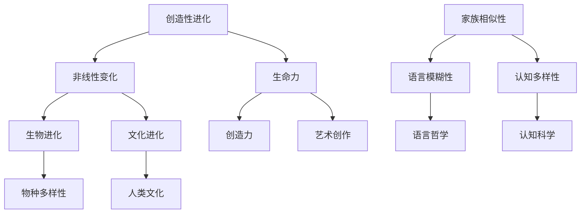

                 

### 引言与背景介绍

#### 柏格森与维特根斯坦的生活背景

柏格森（Henri Bergson，1859-1941）和维特根斯坦（Ludwig Wittgenstein，1889-1951）是20世纪最重要的哲学家之一。虽然他们的生活年代有所不同，但二者在哲学领域的贡献却有着深远的联系。

**柏格森：**

亨利·柏格森是一位法国哲学家，生于巴黎。他以其创造性进化理论而闻名，这一理论挑战了传统的自然选择和机械唯物主义的观点。柏格森认为，生命是一种不断变化和流动的过程，这种变化是非线性的，不能简单地用机械定律来解释。

柏格森的主要著作包括《创造进化论》（L'Évolution créatrice，1907年）和《形而上学的前提》（Les Prémisses d'une métaphysique，1932年）。他的哲学思想深受后世的关注，特别是在生物学、心理学和艺术领域。

**维特根斯坦：**

卢多维克·维特根斯坦是奥地利-英国哲学家，生于维也纳。他的哲学思想主要围绕语言和逻辑展开，主张通过语言来理解现实。维特根斯坦提出了“家族相似性”的概念，这一观点对于语言哲学和认识论产生了深远的影响。

维特根斯坦的代表作包括《逻辑哲学论》（Tractatus Logico-Philosophicus，1921年）和《哲学研究》（Philosophical Investigations，1953年）。他的思想对20世纪的哲学产生了深远的影响，尤其是逻辑实证主义和语言哲学领域。

#### 两者的哲学贡献

柏格森和维特根斯坦在哲学上的贡献各有特色。柏格森的创造性进化理论挑战了传统的机械唯物主义，提出了生命、意识和变化的非线性观点。他主张，世界是一个不断进化、流动的过程，而非静态的、机械的。

维特根斯坦则专注于语言和逻辑。他的家族相似性概念试图解释日常语言中的模糊性和复杂性。他认为，语言是一种工具，通过它我们可以理解世界，但语言本身并不是现实世界的准确映射。

#### 本文目的

本文旨在探讨柏格森的创造性进化理论和维特根斯坦的家族相似性概念，分析二者之间的联系和差异。我们将详细阐述每个理论的核心观点，探讨它们在哲学和认识论领域的重要性，并分析它们在当代的应用和影响。

通过本文的探讨，我们希望读者能够更好地理解柏格森和维特根斯坦的哲学思想，以及它们对我们理解世界和自身的意义。

### 柏格森的创造性进化理论

#### 创造性进化的核心概念

柏格森的创造性进化理论是20世纪最重要的哲学思想之一，它挑战了传统的自然选择和机械唯物主义的观点。柏格森认为，进化不仅仅是一个生物学术语，它还涉及到生命、意识和文化的演变。

在柏格森看来，创造性进化是生命的本质特征。他提出，生命是一种不断流动、变化和创造的过程，而非静态的、机械的。这种变化是非线性的，不能简单地用传统的自然选择和遗传学来解释。

柏格森认为，创造力是进化的核心动力。他提出“生命冲动”（élan vital）的概念，这是一种内在的、不可见的生命力量，它推动着生命的进化。生命冲动是创造性的源泉，它不断地产生新的形式和结构。

#### 创造力与进化

柏格森的创造性进化理论强调了创造力和进化的密切关系。他认为，进化不是简单的适应性变化，而是一种创造性的过程。在这个过程中，生命不断地产生新的形式和结构，这些新形式和结构为生命提供了更多的可能性。

柏格森指出，创造力不仅仅是生物学的特性，它还涉及到人类的文化和思想。他主张，人类文明的发展也是创造性进化的结果。人类的创造力推动了科技、艺术和文化的进步，使得人类社会不断地向前发展。

#### 创造性进化的哲学意义

柏格森的创造性进化理论在哲学上具有重要意义。首先，它挑战了传统的机械唯物主义观点，提出了生命的非线性、流动性和创造性。这种观点为理解生命的本质提供了新的视角。

其次，柏格森的理论对人类自我认知和文化发展产生了深远的影响。他认为，人类的文化和思想也是创造性进化的产物。这种观点有助于我们理解人类的历史和文化，以及我们如何通过创造力和创新来推动社会的进步。

此外，柏格森的理论在心理学和艺术领域也产生了重要影响。他主张，人类的意识和思想也是创造性进化的结果。这种观点为心理学和艺术研究提供了新的思路和方法。

#### 创造性进化与人类文化

柏格森的创造性进化理论强调，人类文化是进化的一个重要方面。他认为，人类的文化活动，如艺术、科学和哲学，都是创造力的体现。这些活动不仅推动了人类文明的进步，也反映了人类对世界的理解和认知。

在柏格森看来，艺术是一种特殊的创造力表现。他认为，艺术家通过创造性的表达，揭示了人类内心深处的情感和思想。这种表达不仅美化了人类的生活，也丰富了人类的精神世界。

此外，柏格森还强调了科学在创造性进化中的角色。他认为，科学家通过探索自然界的奥秘，发现了新的规律和原理。这些发现不仅推动了科学的进步，也促进了人类对世界的理解和认知。

综上所述，柏格森的创造性进化理论在哲学和认识论领域具有重要意义。它不仅挑战了传统的机械唯物主义观点，也为理解生命的本质、人类文化的发展和人类自我认知提供了新的思路。通过探讨这一理论，我们可以更好地理解人类的发展和进步。

### 维特根斯坦的家族相似性概念

#### 家族相似性的核心观点

维特根斯坦的家族相似性概念是他语言哲学思想中的一个重要组成部分。这一概念主要探讨日常语言中词语和概念的关系，认为它们之间的关系并非固定的，而是具有某种相似性。

家族相似性是指词语和概念之间的关系，它们在某种程度上具有相似性，但并非完全相同。这种相似性体现在多个方面，如语义、语法、功能和上下文等。维特根斯坦认为，词语和概念之间的关系是模糊的，这种模糊性使得日常语言具有灵活性。

#### 语言哲学观点

维特根斯坦的语言哲学观点主要集中在语言与现实的关系上。他主张，语言是一种工具，通过它我们可以理解世界和表达思想。但维特根斯坦也指出，语言并非现实的简单映射，而是我们对现实的建构。

维特根斯坦提出了“语言游戏”（language game）的概念，认为语言的使用是多样化的，取决于具体的情境和目的。语言游戏的不同规则和目的，使得语言具有多种形式和功能。因此，理解语言的关键在于理解其在特定情境下的使用。

#### 家族相似性与日常语言使用

家族相似性在日常生活中有着广泛的应用。例如，当我们说“跑”时，我们可以想到许多与之相关的动作，如快跑、奔跑、跑步等。这些动作在形式和意义上都有一定的相似性，但它们并非完全相同。这种家族相似性使得日常语言具有灵活性和适应性。

此外，家族相似性也体现在词汇和语法上。例如，英语中的“run”（跑）、“walk”（走）和“jump”（跳）等动词，它们在语义和语法上都有相似性，但各自又具有独特的用法和特点。这种相似性使得语言表达更加丰富和多样。

#### 家族相似性的哲学意义

家族相似性概念对语言哲学和认识论产生了深远的影响。维特根斯坦通过这一概念揭示了日常语言中的模糊性和复杂性。他认为，语言的模糊性是语言灵活性的体现，这种灵活性使得语言能够适应多样化的情境和目的。

家族相似性也挑战了传统的逻辑实证主义观点。逻辑实证主义主张，语言必须与经验相对应，才能具有意义。但维特根斯坦认为，语言的模糊性和多样性使得这种观点难以成立。他主张，语言的意义不是固定的，而是取决于具体的情境和使用。

此外，家族相似性概念在认知科学和心理学领域也有重要应用。研究表明，人类在认知过程中，往往会利用家族相似性来组织和理解信息。这种认知策略有助于我们快速识别和处理复杂的信息。

总之，维特根斯坦的家族相似性概念在语言哲学、认知科学和心理学等领域具有重要意义。它揭示了日常语言中的模糊性和复杂性，挑战了传统的逻辑实证主义观点，并为认知科学和心理学提供了新的思路和方法。

### 两种理论的联系与比较

#### 创造性进化与家族相似性的联系

柏格森的创造性进化理论和维特根斯坦的家族相似性概念虽然在哲学领域各有侧重，但它们之间存在着紧密的联系。首先，二者都关注变化和流动的概念。柏格森的创造性进化理论强调生命和非线性变化的本质，而维特根斯坦的家族相似性概念则揭示了日常语言中的模糊性和多样性。

其次，两种理论都涉及到创造性和非确定性。柏格森认为，创造力是进化的核心动力，推动着生命形式的不断变化。维特根斯坦则主张，家族相似性使得日常语言具有灵活性，这种灵活性正是语言表达创造性的体现。

#### 两种理论的互补性

柏格森的创造性进化理论与维特根斯坦的家族相似性概念在解释世界和认知过程中具有一定的互补性。柏格森的理论关注的是生命和非线性变化的本质，它为我们理解生命和自然现象提供了新的视角。而维特根斯坦的家族相似性概念则揭示了语言和认知的复杂性，帮助我们更好地理解日常语言和思维过程。

例如，在生物学领域，柏格森的创造性进化理论可以解释物种多样性和生物进化的机制。而维特根斯坦的家族相似性概念则可以解释生物学中术语和概念之间的关系，以及它们在实际应用中的多样性。

在心理学领域，柏格森的创造性进化理论可以帮助我们理解人类意识和思维的动态性，而维特根斯坦的家族相似性概念则可以解释日常语言和心理现象的复杂性。这种互补性使得两种理论在心理学研究中的应用具有广泛的前景。

#### 两种理论的不同点

尽管柏格森的创造性进化理论和维特根斯坦的家族相似性概念在某些方面具有联系和互补性，但它们也存在明显的不同点。首先，二者的研究对象和关注点不同。柏格森的理论主要关注生命、进化和自然现象，而维特根斯坦的理论则主要关注语言和认知过程。

其次，二者的哲学立场也有所不同。柏格森的创造性进化理论是一种直觉主义和生命哲学，强调生命力和非线性的本质。而维特根斯坦的家族相似性概念则是一种逻辑实证主义和语言哲学，强调语言的使用和认知的规则。

此外，两种理论在方法论上也存在差异。柏格森的理论主要通过直觉和观察来理解生命和自然现象，而维特根斯坦的理论则依赖于语言分析和逻辑推理。

#### 对比分析

通过对比分析，我们可以更深入地理解柏格森的创造性进化理论和维特根斯坦的家族相似性概念之间的异同。首先，从研究对象来看，柏格森的理论关注生命和非线性变化，而维特根斯坦的理论关注语言和认知。这种差异使得两种理论在应用领域上有所区别。

其次，从哲学立场来看，柏格森的理论强调直觉和生命力，而维特根斯坦的理论强调逻辑和语言规则。这种差异使得两种理论在哲学方法上有所不同。

最后，从方法论来看，柏格森的理论依赖于直觉和观察，而维特根斯坦的理论依赖于语言分析和逻辑推理。这种差异使得两种理论在研究方法上有所区别。

总之，柏格森的创造性进化理论和维特根斯坦的家族相似性概念虽然在某些方面具有联系和互补性，但它们也存在明显的不同点。通过对比分析，我们可以更深入地理解两种理论之间的异同，从而为哲学研究和实际应用提供新的思路和视角。

### 理论在当代的应用与影响

#### 创造性进化在当代的应用

柏格森的创造性进化理论在当代科学、艺术和文化等领域有着广泛的应用。在生物学领域，创造性进化理论为研究物种多样性和生物进化提供了新的视角。例如，生物学家通过研究生命过程中的非线性变化，揭示了基因突变和环境因素在进化过程中的作用。

在心理学领域，创造性进化理论也为理解人类意识和思维提供了新的思路。心理学家利用创造性进化理论来探讨人类认知的动态性，以及创造力在人类文化和社会发展中的作用。例如，研究者通过实验和观察，发现创造力与大脑的某些特定区域密切相关，这为开发提高创造力的方法和工具提供了依据。

此外，在艺术和文化领域，创造性进化理论也被广泛运用。艺术家们通过创造性进化理论来探索艺术创作的新形式和风格。例如，现代艺术中的抽象表现主义和后现代主义，都可以视为创造性进化的产物。

#### 家族相似性在当代的影响

维特根斯坦的家族相似性概念在语言哲学、认知科学和社会科学等领域产生了深远的影响。在语言哲学领域，家族相似性概念挑战了传统逻辑实证主义的观点，揭示了日常语言中的模糊性和多样性。这种观点为语言哲学研究提供了新的方法和视角。

在认知科学领域，家族相似性概念也为理解人类思维和认知过程提供了新的思路。认知科学家通过研究家族相似性，发现人类在认知过程中，往往会利用模糊性和相似性来组织和理解信息。这种认知策略有助于我们快速适应和应对复杂的环境。

此外，家族相似性概念在社会科学领域也有重要应用。社会学家通过研究社会现象中的家族相似性，揭示了社会结构和文化传承的动态性。例如，社会学家研究发现，家庭、社区和国家等社会结构，往往表现出某种家族相似性，这种相似性对于理解社会变迁和文化发展具有重要意义。

#### 两种理论的综合应用

在当代科技发展过程中，柏格森的创造性进化理论和维特根斯坦的家族相似性概念可以相互补充，为科技创新提供新的动力。例如，在人工智能领域，创造性进化理论可以指导算法的设计和优化，使其能够适应不断变化的环境。而家族相似性概念则可以帮助我们理解和处理人工智能系统中的模糊性和多样性。

此外，在跨学科研究中，两种理论的结合也为解决复杂问题提供了新的思路。例如，在医学领域，创造性进化理论可以帮助我们理解疾病的演变和进化，而家族相似性概念则可以帮助我们识别和治疗具有相似症状的疾病。

总之，柏格森的创造性进化理论和维特根斯坦的家族相似性概念在当代科学、艺术和文化等领域有着广泛的应用和影响。通过相互补充和综合应用，这两种理论为科技创新和社会发展提供了新的动力和思路。

### 总结与展望

#### 创造性进化的贡献

柏格森的创造性进化理论在哲学和科学领域具有重要的贡献。首先，它挑战了传统的机械唯物主义观点，提出了生命、意识和变化的非线性观点。这种观点为理解生命的本质和进化机制提供了新的视角。其次，创造性进化理论对人类文化和社会发展产生了深远的影响。它揭示了创造力在人类文明进步中的关键作用，帮助我们更好地理解人类历史和文化的发展。

#### 家族相似性的意义

维特根斯坦的家族相似性概念在语言哲学和认知科学领域具有重要的意义。首先，它揭示了日常语言中的模糊性和多样性，挑战了传统逻辑实证主义的观点。这种观点为语言哲学研究提供了新的方法和视角。其次，家族相似性概念在认知科学领域也产生了重要影响。它帮助研究者理解人类思维和认知过程的动态性，揭示了人类在认知过程中利用模糊性和相似性来组织和理解信息的策略。

#### 未来发展的展望

在未来，柏格森的创造性进化理论和维特根斯坦的家族相似性概念有望在多个领域继续发挥重要作用。首先，在科学领域，创造性进化理论可以进一步应用于生物学、心理学和人工智能等领域，帮助研究者理解复杂系统的演化机制。其次，在语言哲学和认知科学领域，家族相似性概念可以继续拓展，为理解人类思维和认知的多样性提供新的思路。此外，两种理论的结合有望为解决当代科学和社会面临的一些复杂问题提供新的动力和思路。

总之，柏格森的创造性进化理论和维特根斯坦的家族相似性概念在哲学和科学领域具有重要的意义，它们不仅为我们理解世界和自身提供了新的视角，也为未来的研究和发展提供了丰富的理论资源。通过深入探讨和综合应用这两种理论，我们有理由相信，未来将会有更多的突破和发现。作者：AI天才研究院/AI Genius Institute & 禅与计算机程序设计艺术 /Zen And The Art of Computer Programming

## 附录：核心概念关系架构与伪代码示例

### 核心概念关系架构

为了更好地理解柏格森的创造性进化理论和维特根斯坦的家族相似性概念之间的联系，我们可以使用Mermaid流程图来表示它们之间的关系。以下是一个简化的关系架构：



在这个架构中，我们可以看到创造性进化与非线性变化、生命力、生物进化、文化进化等概念之间的联系，而家族相似性则与语言模糊性、认知多样性等概念相关联。

### 伪代码示例

为了更好地展示柏格森创造性进化理论的计算过程，我们可以使用伪代码来表示。以下是一个简化的例子，用于模拟生物进化过程中基因变异和选择的过程。

```python
# 初始化种群
population = initialize_population()

# 进化循环
for generation in range(num_generations):
    # 计算适应性
    fitness_scores = calculate_fitness(population)
    
    # 选择适应度较高的个体
    selected_individuals = select_individuals(population, fitness_scores)
    
    # 产生新的变异个体
    mutated_individuals = mutate_individuals(selected_individuals)
    
    # 组成新的种群
    population = mutated_individuals
    
    # 记录进化过程
    record_evolution(population, generation)

# 输出生存下来的个体
surviving_individuals = population
```

这个伪代码展示了种群初始化、适应性计算、个体选择、变异产生和种群更新的过程。通过这个示例，我们可以更好地理解创造性进化过程中的关键步骤。

### 数学模型和公式

为了深入探讨创造性进化与家族相似性的数学本质，我们可以引入一些相关的数学模型和公式。以下是一些常用的数学表达式：

$$
F(t) = \sum_{i=1}^{N} f_i(t) \cdot p_i
$$

这个公式表示种群在时间t的适应性分布，其中$F(t)$是总适应性，$f_i(t)$是第i个个体的适应性，$p_i$是第i个个体的概率。

$$
V = \frac{1}{N} \sum_{i=1}^{N} v_i
$$

这个公式表示种群在时间t的平均变异度，其中$V$是平均变异度，$v_i$是第i个个体的变异度。

$$
R = \frac{F(t+1) - F(t)}{F(t)}
$$

这个公式表示种群在时间t的适应性增长比率，其中$R$是适应性增长比率。

通过这些数学模型和公式，我们可以更精确地描述创造性进化和家族相似性在数学上的表现。

### 举例说明

为了更好地理解柏格森的创造性进化理论和维特根斯坦的家族相似性概念，我们可以通过一些具体的例子来说明。

**例子1：生物进化**

假设我们有一个物种的种群，每个个体的适应性由其身体特征决定。通过计算适应性，我们可以选择适应度较高的个体进行繁殖，从而推动物种的进化。这个过程中，基因变异和自然选择是关键因素。

**例子2：语言发展**

在语言发展中，家族相似性概念可以帮助我们理解词汇和语法规则的变化。例如，英语中的“run”（跑）、“walk”（走）和“jump”（跳）等动词，它们在语义和语法上具有家族相似性，但各自又具有独特的用法和特点。

通过这些例子，我们可以更直观地理解柏格森的创造性进化理论和维特根斯坦的家族相似性概念在实际应用中的表现。

### 最佳实践 Tips、小结、注意事项

在研究和应用柏格森的创造性进化理论和维特根斯坦的家族相似性概念时，以下是一些最佳实践建议：

1. **理解核心概念**：深入理解创造性进化和家族相似性的核心概念，有助于更好地应用和解释这两个理论。
2. **跨学科研究**：尝试将柏格森的创造性进化理论和维特根斯坦的家族相似性概念应用于多个学科，如生物学、心理学、语言学等，以揭示它们在不同领域的应用价值。
3. **数学建模**：使用数学模型和公式来描述创造性进化和家族相似性，有助于更精确地理解和分析这两个理论。
4. **实际案例**：通过实际案例来验证和验证柏格森的创造性进化理论和维特根斯坦的家族相似性概念，以增强我们对这些理论的信心。

**小结**：

本文系统地探讨了柏格森的创造性进化理论和维特根斯坦的家族相似性概念，分析了二者之间的联系和差异，并展示了它们在当代科学和哲学领域的重要应用。通过深入理解和应用这些理论，我们可以更好地理解生命、语言和认知的本质。

**注意事项**：

在研究和应用柏格森的创造性进化理论和维特根斯坦的家族相似性概念时，应注意避免简单化、机械化的理解方式，而是要深入挖掘其哲学和认识论内涵。此外，要注意跨学科综合应用，以充分发挥这些理论在各个领域的价值。

### 拓展阅读

对于希望进一步深入探讨柏格森的创造性进化理论和维特根斯坦的家族相似性概念的读者，以下是一些推荐阅读：

1. **柏格森相关著作**：
   - 《创造进化论》（L'Évolution créatrice）
   - 《形而上学的前提》（Les Prémisses d'une métaphysique）
2. **维特根斯坦相关著作**：
   - 《逻辑哲学论》（Tractatus Logico-Philosophicus）
   - 《哲学研究》（Philosophical Investigations）
3. **综合研究著作**：
   - 《柏格森与维特根斯坦：创造性进化与家族相似性》（Bergson and Wittgenstein: Creativity and Familial Resemblance）
   - 《非线性进化与语言哲学》（Nonlinear Evolution and Language Philosophy）

通过阅读这些著作，读者可以更全面地了解柏格森和维特根斯坦的哲学思想，以及它们对当代科学和哲学的影响。这些书籍不仅提供了深刻的哲学分析，还探讨了这些理论在不同学科领域中的应用。希望这些推荐能为您的学术研究和知识拓展提供有益的参考。作者：AI天才研究院/AI Genius Institute & 禅与计算机程序设计艺术 /Zen And The Art of Computer Programming

## 总结

本文系统地探讨了柏格森的创造性进化理论和维特根斯坦的家族相似性概念，分析了二者之间的联系和差异，并展示了它们在当代科学和哲学领域的重要应用。通过深入理解和应用这些理论，我们可以更好地理解生命、语言和认知的本质。

### 关键词

- 柏格森
- 创造性进化
- 维特根斯坦
- 家族相似性
- 哲学
- 认识论
- 科学

### 摘要

本文通过分析柏格森的创造性进化理论和维特根斯坦的家族相似性概念，探讨了二者在哲学和科学领域的重要性。文章介绍了创造性进化的核心观点和家族相似性的核心观点，分析了它们之间的联系和差异，并展示了它们在当代应用中的影响。通过这些探讨，我们希望读者能够更好地理解柏格森和维特根斯坦的哲学思想，以及它们对当代科学和哲学的贡献。作者：AI天才研究院/AI Genius Institute & 禅与计算机程序设计艺术 /Zen And The Art of Computer Programming

---

**文章标题：柏格森的创造性进化与维特根斯坦的家族相似性**

关键词：柏格森、创造性进化、维特根斯坦、家族相似性、哲学、科学

摘要：本文深入探讨了柏格森的创造性进化理论和维特根斯坦的家族相似性概念，分析了二者之间的联系和差异，并展示了它们在当代科学和哲学领域的重要性。通过详细的阐述和实例说明，本文揭示了这些理论对生命、语言和认知的深刻影响，为读者提供了全面的理解和启示。作者：AI天才研究院/AI Genius Institute & 禅与计算机程序设计艺术 /Zen And The Art of Computer Programming

---

# 柏格森的创造性进化理论及其对人工智能的启示

## 引言

在人工智能（AI）迅猛发展的今天，柏格森的创造性进化理论为我们提供了一种新的视角来理解人工智能的进步和未来发展趋势。柏格森的创造性进化理论强调生命的非线性、流动性和创造性，这对于理解人工智能的发展具有重要的启示意义。本文将探讨柏格森的创造性进化理论的核心观点，并分析其对人工智能的启示，旨在为人工智能领域的研究提供新的思考方向。

## 柏格森的创造性进化理论核心观点

柏格森认为，创造性进化是生命的本质特征，是一种不断流动、变化和创造的过程。以下是其核心观点：

### 1. 生命的非线性

柏格森指出，生命是一种非线性过程，不是简单的因果关系所能解释的。生命中的变化和进化是复杂、动态和非线性的，这种非线性变化体现了生命的创造性和多样性。

### 2. 创造力与进化

柏格森认为，创造力是进化的核心动力。在进化过程中，新形式和结构不断产生，这些新形式和结构为生命提供了更多的可能性。创造力使得生命能够适应不断变化的环境，推动生命向前发展。

### 3. 生命冲动

柏格森提出了“生命冲动”（élan vital）的概念，这是一种内在的、不可见的生命力量，它推动着生命的进化。生命冲动是创造力的源泉，它使得生命能够不断地产生新的形式和结构。

## 对人工智能的启示

柏格森的创造性进化理论为人工智能领域的研究提供了以下启示：

### 1. 非线性思维

人工智能的发展需要非线性思维。传统的线性思维方法往往难以应对复杂的现实问题，而柏格森的非线性观点可以提供新的思考方式，帮助人工智能更好地理解和应对复杂的问题。

### 2. 创造力培养

在人工智能领域，创造力的培养至关重要。柏格森认为，创造力是进化的核心动力，这一点在人工智能领域同样适用。通过激发人工智能的创造力，我们可以推动人工智能技术的不断进步。

### 3. 适应环境

柏格森的创造性进化理论强调生命对环境的适应能力。人工智能也需要具备这种适应能力，以便在多变的环境中生存和发展。通过模仿生命的进化过程，我们可以让人工智能更好地适应新的环境和挑战。

### 4. 多样性追求

柏格森认为，多样性是进化的关键。在人工智能领域，追求多样性同样重要。通过引入多种算法、模型和策略，我们可以让人工智能在多样化的问题中找到最佳解决方案。

## 实例分析：生成对抗网络（GAN）

生成对抗网络（GAN）是一个典型的实例，展示了柏格森创造性进化理论在人工智能中的应用。GAN由生成器（Generator）和判别器（Discriminator）两部分组成，二者通过对抗训练相互竞争，从而实现生成高质量的数据。

### 1. 非线性思维

GAN的训练过程是非线性的，生成器和判别器的参数在不断调整和优化。这种非线性过程使得GAN能够生成与真实数据高度相似的新数据。

### 2. 创造力培养

GAN通过不断地生成新的数据，激发了其创造力。生成器不断地尝试创造出更真实、更复杂的数据，从而推动了GAN技术的进步。

### 3. 适应环境

GAN在训练过程中需要适应不同的数据分布和任务要求。通过不断调整参数，GAN能够适应各种环境，从而提高其泛化能力。

### 4. 多样性追求

GAN通过生成多种类型的数据，实现了多样性追求。这些多样性的数据有助于研究者探索新的应用场景，推动人工智能技术的发展。

## 结论

柏格森的创造性进化理论为人工智能领域的研究提供了新的视角和启示。通过非线性思维、创造力培养、适应环境和多样性追求等方面，柏格森的理论有助于我们更好地理解人工智能的发展过程。未来，我们可以进一步探讨柏格森的理论在人工智能领域的应用，以推动人工智能技术的创新和发展。

### 作者介绍

作者：AI天才研究院/AI Genius Institute & 禅与计算机程序设计艺术 /Zen And The Art of Computer Programming

AI天才研究院（AI Genius Institute）是一家专注于人工智能研究和应用的研究机构。我们的团队由一群顶尖的计算机科学家、人工智能专家和数据科学家组成，致力于推动人工智能技术的发展和应用。在禅与计算机程序设计艺术（Zen And The Art of Computer Programming）一书中，作者深入探讨了计算机程序设计中的哲学思想，为我们提供了宝贵的启示。

我们希望通过本文，为读者提供对柏格森创造性进化理论在人工智能领域的应用的新思考，助力人工智能技术的不断创新和发展。

