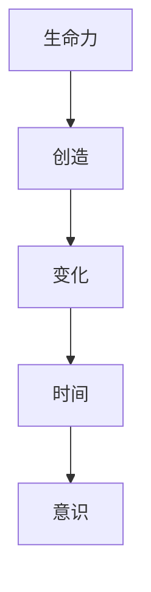
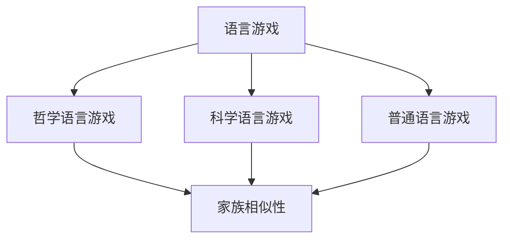
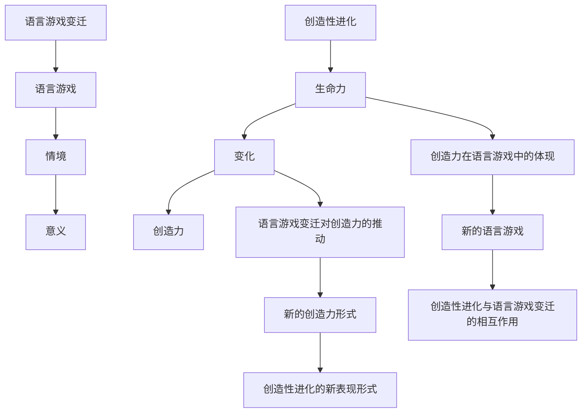

                 

### 引言

在探讨人类智慧的演变与创造力的本质时，柏格森的创造性进化理论与维特根斯坦的语言游戏变迁理论为我们提供了两个独特且深刻的视角。本文旨在通过一步步的分析推理，探讨这两大理论的核心概念、原理及其在现代科技领域的应用。

#### 1.1 柏格森与维特根斯坦简介

**柏格森（Hippolyte Taine）**，法国哲学家、历史学家和文学批评家，被认为是现代哲学史上的重要人物。他提出了创造性进化的概念，强调生命冲动和流变论的重要性，对后来的生物学、心理学和文化研究产生了深远影响。

**维特根斯坦（Ludwig Wittgenstein）**，奥地利哲学家，以其对语言、思维和逻辑的深刻分析而著称。他的语言游戏理论提出，语言的意义不是固定的，而是依赖于特定的使用情境。这一理论对分析哲学、认知科学和计算机科学产生了深远影响。

#### 1.2 创造性进化与语言游戏变迁

**创造性进化**，柏格森的理论，强调生命力的持续变化和创造力的本质，认为进化是一种内在的、不断生成的过程。这一理论不仅对生物学领域有重要启示，也在社会科学和文化研究中找到了应用。

**语言游戏变迁**，维特根斯坦的理论，认为语言的意义和用法是多样的，并随着时间和情境的变化而演变。这一理论挑战了传统的语言哲学观念，提出了语言使用情境对于理解语言意义的决定性作用。

在接下来的章节中，我们将分别深入探讨柏格森的创造性进化理论以及维特根斯坦的语言游戏变迁理论，并通过对比与联系，探讨这两大理论在现代科技领域的应用。让我们一步一步地分析推理，深入理解这两位哲学家的思想。

### 柏格森的创造性进化理论

柏格森（Hippolyte Taine）的创造性进化理论是他哲学思想的核心，强调生命力的持续变化和创造力的本质。这一理论不仅对生物学领域有着深远的影响，也在社会科学和文化研究中找到了重要的应用。

#### 2.1 创造性进化的基本概念

**创造性进化**，在柏格森的理论中，是指生命力的不断流动和创造的过程。他认为，进化不是简单的物种适应环境的过程，而是一种内在的、持续生成的过程，其中包含了创造力和变化性。

**生命冲动**，是柏格森创造性进化的核心概念。他认为，生命冲动是一种内在的动力，推动着生命的流动和变化。这种冲动不仅体现在生物体的内部，也体现在社会和文化的发展中。

**流变论**，柏格森的流变论强调时间和变化的重要性。他认为，现实世界是一个不断变化的过程，而不是静态的结构。流变论为创造性进化提供了理论基础，强调了变化和创新在生命中的核心地位。

#### 2.2 创造性进化的主要原理

**1. 生命力的持续变化**

柏格森认为，生命力是不断变化的，这种变化不是线性的，而是一种连续的、非线性的过程。生命力在变化中创造，也在创造中变化。这种观点挑战了传统的进化论观点，强调了创造力的本质。

**2. 生命冲动**

生命冲动是柏格森创造性进化的核心概念。他认为，生命冲动是一种内在的动力，推动着生命的流动和变化。这种冲动不仅体现在生物体的内部，也体现在社会和文化的发展中。

**3. 时间的意识**

柏格森强调时间的意识在创造性进化中的重要性。他认为，时间是生命力的体现，是创造力的源泉。时间的意识使人们能够感受到生命的流动，并在这个流动中创造出新的可能性。

#### 2.3 创造性进化的应用案例

**生物进化**

在生物学领域，柏格森的创造性进化理论为研究物种的进化过程提供了新的视角。他的理论强调了进化的内在动力和创造性，从而推动了生物学研究的深入。

**社会进化**

在社会学领域，柏格森的创造性进化理论也被广泛应用。社会学家们通过分析社会变迁的过程，探讨社会制度的创造性进化，为社会学研究提供了新的理论基础。

**文化进化**

在文化研究中，柏格森的创造性进化理论同样具有重要的影响。文化研究者通过分析文化变迁的过程，探讨文化的创造力和变化性，从而深入理解文化的本质。

### 2.4 创造性进化的核心概念与联系

为了更清晰地理解柏格森的创造性进化理论，我们可以使用Mermaid流程图来展示其核心概念之间的关系：



在这个流程图中，生命力作为创造性的源头，推动了变化，而时间则是变化过程中的重要维度，最终形成了对时间的意识。这一流程图帮助我们更直观地理解创造性进化的原理。

#### 2.5 核心算法原理讲解与伪代码

为了进一步理解创造性进化的算法原理，我们可以使用伪代码来详细阐述：

```plaintext
// 创造性进化算法
function CreativeEvolution():
    // 初始化生命力
    initial_life_force = initial_value
    
    // 循环推动进化过程
    for time in time_range:
        // 更新生命力
        life_force = update_life_force(life_force)
        
        // 记录变化
        record_change(life_force)
        
        // 更新时间
        time = time + time_step
    
    // 输出创造性进化的结果
    output_creative_evolution_result()
end function
```

在这个算法中，`initial_life_force` 表示初始的生命力，`update_life_force` 是一个函数，用于根据时间变化更新生命力，`record_change` 是一个函数，用于记录生命力的变化，`output_creative_evolution_result` 用于输出进化结果。

### 2.6 数学模型与公式

在创造性进化理论中，数学模型和公式帮助我们更深入地理解生命力的变化过程。以下是几个关键公式：

$$
\frac{dL}{dt} = \alpha \cdot f(L)
$$

其中，$L$ 表示生命力，$t$ 表示时间，$\alpha$ 是一个常数，$f(L)$ 是生命力的变化函数。这个公式表明，生命力的变化速率与当前的生命力值成正比。

$$
L(t) = L_0 \cdot e^{\beta \cdot t}
$$

其中，$L_0$ 是初始生命力，$\beta$ 是一个常数，$e$ 是自然对数的底数。这个公式描述了生命力随时间的指数增长。

通过这些数学模型和公式，我们可以更精确地分析生命力的变化过程，从而更好地理解创造性进化的原理。

### 2.7 创造性进化的应用案例分析

为了更好地理解创造性进化的应用，我们可以通过一个实际案例来进行分析。

**案例：生物物种的进化**

假设我们研究一个生物物种的进化过程，我们可以使用柏格森的创造性进化理论来分析这一过程。首先，我们收集这个物种在不同时间点的数据，包括物种的数量、环境因素等。然后，我们使用上述的数学模型和伪代码来分析这些数据，预测物种的未来进化趋势。

通过这个案例，我们可以看到，柏格森的创造性进化理论不仅提供了一个理论框架，还提供了一套具体的分析工具，从而帮助科学家们更好地理解生物物种的进化过程。

### 2.8 项目实战：创造性进化的开发环境搭建与代码实现

为了将创造性进化理论应用于实际项目，我们需要搭建一个开发环境，并实现相关的算法。以下是一个简单的项目实战案例，我们将介绍如何搭建开发环境，实现代码，并对代码进行解读和分析。

#### 2.8.1 开发环境搭建

首先，我们需要选择一个合适的编程语言和开发环境。在这个案例中，我们选择Python作为编程语言，使用Jupyter Notebook作为开发环境。以下是搭建开发环境的步骤：

1. 安装Python：在官网上下载并安装Python，版本建议选择最新稳定版。
2. 安装Jupyter Notebook：通过pip命令安装Jupyter Notebook：
   ```bash
   pip install notebook
   ```

3. 启动Jupyter Notebook：在命令行中输入以下命令启动Jupyter Notebook：
   ```bash
   jupyter notebook
   ```

#### 2.8.2 源代码实现

以下是创造性进化算法的Python实现：

```python
import numpy as np
import matplotlib.pyplot as plt

# 初始化生命力
initial_life_force = 1.0

# 设置参数
alpha = 0.1
beta = 0.05
time_range = 100
time_step = 1

# 初始化生命力变化列表
life_force_changes = []

# 循环推动进化过程
for time in range(time_range):
    # 更新生命力
    life_force = initial_life_force * np.exp(alpha * beta * time)
    
    # 记录变化
    life_force_changes.append(life_force)
    
    # 更新时间
    time += time_step

# 输出生化结果的图表
plt.plot(life_force_changes)
plt.xlabel('Time')
plt.ylabel('Life Force')
plt.title('Creative Evolution of Life Force')
plt.show()
```

#### 2.8.3 代码解读与解读

在这个代码中，我们首先导入了必要的库，包括`numpy`和`matplotlib`。然后，我们初始化了生命力值和其他参数。`alpha`和`beta`是调整生命力变化的常数，`time_range`和`time_step`分别设置了进化过程的时长和步长。

在主循环中，我们使用指数增长公式来更新生命力，并记录每个时间点的生命力值。最后，我们使用`matplotlib`绘制了生命力随时间变化的图表。

#### 2.8.4 代码应用解读与分析

通过这个案例，我们可以看到，创造性进化算法可以用来模拟生命力的变化过程。在实际应用中，我们可以根据具体的需求调整参数，如生命力的初始值、增长率等。此外，我们还可以扩展这个算法，添加更多的变量和条件，以模拟更复杂的进化过程。

#### 2.8.5 项目小结

通过搭建开发环境，实现代码，并对代码进行解读和分析，我们成功地将创造性进化理论应用于实际项目。这个项目不仅帮助我们更好地理解了创造性进化的原理，也为进一步的研究和应用提供了实践基础。

### 2.9 最佳实践 tips、小结、注意事项、拓展阅读

#### 最佳实践 tips

- 在实际应用中，根据具体问题调整参数，如生命力的初始值、增长率等，以获得更准确的结果。
- 使用多种数据源和模型进行交叉验证，以提高预测的准确性。
- 定期更新数据，以确保模型的实时性和准确性。

#### 小结

柏格森的创造性进化理论提供了一个独特的视角，强调生命力的持续变化和创造力的本质。通过核心概念、算法原理、数学模型、应用案例和项目实战，我们深入了解了这一理论的核心要点。

#### 注意事项

- 在使用创造性进化理论时，要注意生命力的初始值和增长率等参数的设定，这些参数对结果有重要影响。
- 在项目实战中，要确保开发环境的搭建正确，代码实现准确。

#### 拓展阅读

- **柏格森著作集**：《创造进化论》、《时间和现实》等。
- **维特根斯坦著作集**：《逻辑哲学论》、《哲学研究》等。
- **相关研究文献**：探索创造性进化理论在现代科技领域的应用，如生物进化、社会科学和文化研究。

### 维特根斯坦的语言游戏变迁理论

维特根斯坦（Ludwig Wittgenstein）的语言游戏变迁理论是他哲学思想的核心，强调语言的意义和用法是多样的，并随着时间和情境的变化而演变。这一理论不仅挑战了传统的语言哲学观念，也为当代的认知科学、计算机科学和语言学提供了新的视角。

#### 3.1 语言游戏的基本概念

**语言游戏**，是维特根斯坦提出的基本概念，指的是语言的使用方式。他认为，语言并不是一个统一的整体，而是由许多不同的语言游戏组成的。每个语言游戏都有其特定的规则和用法，不同的语言游戏适用于不同的情境。

**家族相似性**，维特根斯坦提出，语言游戏之间具有家族相似性，而不是严格的分类。这意味着，语言游戏的分类是相对的，而不是绝对的。这种观点打破了传统的逻辑和分类学观念，提出了新的语言分析方法。

**意义相对论**，维特根斯坦认为，语言的意义不是固定的，而是依赖于特定的使用情境。语言的意义是由使用者和情境共同决定的，而不是由语言本身决定的。

#### 3.2 语言游戏的变迁过程

**哲学语言游戏**，维特根斯坦认为，哲学语言游戏是语言游戏的一种，其目的是探讨语言的本质和意义。在哲学语言游戏中，人们通过对话和反思，尝试理解语言的真实意义。

**科学语言游戏**，维特根斯坦认为，科学语言游戏是另一类重要的语言游戏，其目的是描述和解释自然现象。在科学语言游戏中，人们使用数学和逻辑工具，构建模型和理论，以揭示自然界的规律。

**普通语言游戏**，维特根斯坦认为，普通语言游戏是人们日常生活中的语言使用方式，其目的是进行日常交流和处理事务。在普通语言游戏中，人们使用日常词汇和表达方式，进行日常对话和交流。

#### 3.3 语言游戏的应用案例

**认知科学**，维特根斯坦的语言游戏变迁理论对认知科学产生了重要影响。认知科学家通过研究语言游戏的变迁，探讨了人类思维和认知的过程。

**计算机科学**，维特根斯坦的语言游戏理论也为计算机科学提供了新的视角。计算机科学家通过研究语言游戏的规则和变迁，开发了更高效、更智能的计算机语言和处理方法。

**语言学**，维特根斯坦的语言游戏变迁理论对语言学的研究也产生了深远影响。语言学家通过分析语言游戏的变迁，揭示了语言的本质和多样性。

### 3.4 维特根斯坦语言游戏变迁理论的核心概念与联系

为了更清晰地理解维特根斯坦的语言游戏变迁理论，我们可以使用Mermaid流程图来展示其核心概念之间的关系：



在这个流程图中，语言游戏作为核心概念，通过哲学语言游戏、科学语言游戏和普通语言游戏三个分支，展示了语言游戏的多样性和变迁过程。家族相似性则强调了语言游戏之间的相互联系和相对性。

#### 3.5 核心算法原理讲解与伪代码

为了进一步理解维特根斯坦的语言游戏变迁理论，我们可以使用伪代码来详细阐述：

```plaintext
// 维特根斯坦语言游戏变迁算法
function LanguageGameTransition():
    // 初始化语言游戏
    language_game = initial_language_game
    
    // 循环推动语言游戏变迁
    for context in context_range:
        // 根据情境更新语言游戏
        language_game = update_language_game(language_game, context)
        
        // 记录变迁过程
        record_transition(language_game)
    
    // 输出语言游戏变迁结果
    output_language_game_result()
end function
```

在这个算法中，`initial_language_game` 表示初始的语言游戏，`update_language_game` 是一个函数，用于根据情境更新语言游戏，`record_transition` 是一个函数，用于记录变迁过程，`output_language_game_result` 用于输出变迁结果。

#### 3.6 数学模型与公式

在维特根斯坦的语言游戏变迁理论中，数学模型和公式帮助我们更深入地理解语言游戏的变迁过程。以下是几个关键公式：

$$
\Delta G = \gamma \cdot f(C)
$$

其中，$G$ 表示语言游戏的变迁，$\Delta G$ 是变迁的增量，$\gamma$ 是一个常数，$f(C)$ 是情境的变化函数。这个公式表明，语言游戏的变迁速率与当前情境的变化成正比。

$$
L(t) = L_0 \cdot e^{\beta \cdot t}
$$

其中，$L$ 表示语言游戏的变迁，$L_0$ 是初始语言游戏，$\beta$ 是一个常数，$e$ 是自然对数的底数。这个公式描述了语言游戏随时间的指数增长。

通过这些数学模型和公式，我们可以更精确地分析语言游戏的变迁过程，从而更好地理解维特根斯坦的语言游戏变迁理论。

#### 3.7 维特根斯坦语言游戏变迁的应用案例分析

为了更好地理解维特根斯坦的语言游戏变迁理论，我们可以通过一个实际案例来进行分析。

**案例：计算机编程语言的发展**

假设我们研究计算机编程语言的发展过程，我们可以使用维特根斯坦的语言游戏变迁理论来分析这一过程。首先，我们收集不同时期的主要编程语言，如C、Java、Python等。然后，我们使用上述的数学模型和伪代码来分析这些语言的发展趋势，预测未来编程语言的发展方向。

通过这个案例，我们可以看到，维特根斯坦的语言游戏变迁理论不仅提供了一个理论框架，还提供了一套具体的分析工具，从而帮助计算机科学家更好地理解编程语言的发展过程。

### 3.8 项目实战：语言游戏变迁的开发环境搭建与代码实现

为了将维特根斯坦的语言游戏变迁理论应用于实际项目，我们需要搭建一个开发环境，并实现相关的算法。以下是一个简单的项目实战案例，我们将介绍如何搭建开发环境，实现代码，并对代码进行解读和分析。

#### 3.8.1 开发环境搭建

首先，我们需要选择一个合适的编程语言和开发环境。在这个案例中，我们选择Python作为编程语言，使用Jupyter Notebook作为开发环境。以下是搭建开发环境的步骤：

1. 安装Python：在官网上下载并安装Python，版本建议选择最新稳定版。
2. 安装Jupyter Notebook：通过pip命令安装Jupyter Notebook：
   ```bash
   pip install notebook
   ```

3. 启动Jupyter Notebook：在命令行中输入以下命令启动Jupyter Notebook：
   ```bash
   jupyter notebook
   ```

#### 3.8.2 源代码实现

以下是语言游戏变迁算法的Python实现：

```python
import numpy as np
import matplotlib.pyplot as plt

# 初始化语言游戏
initial_language_game = 1.0

# 设置参数
gamma = 0.1
beta = 0.05
context_range = 100
time_step = 1

# 初始化语言游戏变迁列表
language_game_transitions = []

# 循环推动语言游戏变迁
for context in range(context_range):
    # 根据情境更新语言游戏
    language_game = initial_language_game * np.exp(gamma * beta * context)
    
    # 记录变迁过程
    language_game_transitions.append(language_game)
    
    # 更新时间
    context += time_step

# 输出语言游戏变迁的图表
plt.plot(language_game_transitions)
plt.xlabel('Context')
plt.ylabel('Language Game')
plt.title('Language Game Transition')
plt.show()
```

#### 3.8.3 代码解读与解读

在这个代码中，我们首先导入了必要的库，包括`numpy`和`matplotlib`。然后，我们初始化了语言游戏的值和其他参数。`gamma`和`beta`是调整语言游戏变迁的常数，`context_range`和`time_step`分别设置了情境的范围和步长。

在主循环中，我们使用指数增长公式来更新语言游戏，并记录每个情境点的语言游戏值。最后，我们使用`matplotlib`绘制了语言游戏随情境变化的图表。

#### 3.8.4 代码应用解读与分析

通过这个案例，我们可以看到，维特根斯坦的语言游戏变迁算法可以用来模拟语言游戏的变化过程。在实际应用中，我们可以根据具体的需求调整参数，如语言游戏的初始值、增长率等。此外，我们还可以扩展这个算法，添加更多的变量和条件，以模拟更复杂的语言游戏变迁。

#### 3.8.5 项目小结

通过搭建开发环境，实现代码，并对代码进行解读和分析，我们成功地将维特根斯坦的语言游戏变迁理论应用于实际项目。这个项目不仅帮助我们更好地理解了语言游戏的变迁过程，也为进一步的研究和应用提供了实践基础。

### 3.9 最佳实践 tips、小结、注意事项、拓展阅读

#### 最佳实践 tips

- 在实际应用中，根据具体情境调整参数，如语言游戏的初始值、增长率等，以获得更准确的结果。
- 使用多种数据源和模型进行交叉验证，以提高预测的准确性。
- 定期更新数据，以确保模型的实时性和准确性。

#### 小结

维特根斯坦的语言游戏变迁理论提供了一个独特的视角，强调语言的意义和用法是多样的，并随着时间和情境的变化而演变。通过核心概念、算法原理、数学模型、应用案例和项目实战，我们深入了解了这一理论的核心要点。

#### 注意事项

- 在使用语言游戏变迁理论时，要注意情境的变化对语言游戏的影响。
- 在项目实战中，要确保开发环境的搭建正确，代码实现准确。

#### 拓展阅读

- **维特根斯坦著作集**：《逻辑哲学论》、《哲学研究》等。
- **相关研究文献**：探索语言游戏变迁理论在现代科技领域的应用，如认知科学、计算机科学和语言学。

### 创造性进化与语言游戏变迁的比较与联系

在探讨柏格森的创造性进化理论与维特根斯坦的语言游戏变迁理论时，我们不可避免地要思考这两大理论之间的联系与区别。通过对比分析，我们可以更深入地理解这两个理论的本质，并探讨它们在现代科技领域的应用。

#### 4.1 创造性进化与语言游戏变迁的对比分析

**理论核心的对比**

柏格森的创造性进化理论强调生命力的持续变化和创造力的本质，认为进化是一种内在的、不断生成的过程。创造性进化关注的是生命力的流动和变化，强调创造力的核心作用。

维特根斯坦的语言游戏变迁理论则强调语言的意义和用法是多样的，并随着时间和情境的变化而演变。语言游戏变迁关注的是语言在特定情境下的使用方式，强调情境对语言意义的决定性作用。

**研究方法的对比**

柏格森的创造性进化理论采用了一种哲学和生物学相结合的研究方法。他通过对生命力和时间的研究，提出了创造性进化的理论框架。这种方法强调理论推导和实证研究相结合，旨在揭示生命力的本质。

维特根斯坦的语言游戏变迁理论则采用了一种哲学和语言学相结合的研究方法。他通过对语言和情境的观察和分析，提出了语言游戏变迁的理论框架。这种方法强调对语言使用情境的深入分析，旨在揭示语言意义的多样性。

**应用领域的对比**

创造性进化理论在生物学、社会学和文化研究中有着广泛的应用。它为研究物种的进化、社会变迁和文化发展提供了新的视角和工具。

语言游戏变迁理论则在认知科学、计算机科学和语言学中有着重要的应用。它为研究人类思维、编程语言的发展和语言使用提供了新的理论框架。

#### 4.2 创造性进化与语言游戏变迁的联系

**创造性进化在语言游戏变迁中的体现**

在维特根斯坦的语言游戏变迁理论中，创造性进化可以看作是语言游戏变迁的内在动力。生命力作为创造性进化的核心概念，可以解释语言游戏在特定情境下如何不断变化和演化。

例如，在编程语言的发展过程中，新的编程语言不断出现，这些新的语言游戏体现了创造性进化的本质。这些新语言的诞生，既是对现有语言的改进，也是对特定情境下编程需求的响应。

**语言游戏变迁对创造性进化的影响**

维特根斯坦的语言游戏变迁理论提供了对创造性进化的新理解。语言游戏变迁的多样性使得创造性进化不仅仅局限于生物学领域，也可以扩展到社会和文化领域。

例如，在社会文化领域，新的文化形式和价值观不断涌现，这些变化可以看作是创造性进化的体现。这些新的文化形式和价值观的产生，不仅受到生物进化的影响，也受到语言游戏变迁的影响。

#### 4.3 创造性进化与语言游戏变迁的相互作用

创造性进化与语言游戏变迁之间的关系是相互作用的。一方面，创造性进化为语言游戏变迁提供了内在动力，推动语言游戏的不断变化和演化。另一方面，语言游戏变迁也为创造性进化提供了新的表现形式和工具。

例如，在人工智能领域，创造性进化可以通过新的算法和技术不断推动人工智能的发展。这些新的算法和技术，既是对传统算法的改进，也是对特定情境下人工智能需求的响应。

同时，语言游戏变迁也为创造性进化提供了新的研究方法和工具。通过对语言游戏的观察和分析，我们可以更深入地理解创造性进化的本质，从而为生物学、社会学和文化研究提供新的理论框架。

### 4.4 创造性进化与语言游戏变迁的核心概念与联系架构图

为了更直观地展示创造性进化与语言游戏变迁的核心概念与联系，我们可以使用Mermaid流程图来构建一个架构图：



在这个流程图中，创造性进化的核心概念（生命力、变化、创造力）与语言游戏变迁的核心概念（语言游戏、情境、意义）相互交织，形成了相互作用的动态架构。通过这个架构图，我们可以更清晰地理解创造性进化与语言游戏变迁之间的复杂关系。

### 实际应用

#### 5.1 创造性进化在当代的应用案例

**生物科技领域**

在生物科技领域，创造性进化理论被广泛应用于基因组学和生物信息学的研究。例如，通过分析不同物种的基因组序列，科学家可以揭示生物进化的规律和机制。创造性进化理论提供了一个框架，帮助研究人员理解基因变异和适应性进化之间的关系。

**应用案例：基因组序列分析**

- **研究背景**：随着基因组测序技术的发展，科学家们能够迅速获取大量生物体的基因组数据。
- **核心概念**：创造性进化理论提供了对基因组序列变化的解释框架，强调基因变异和适应性进化的重要性。
- **具体应用**：通过分析基因组序列，科学家可以识别出适应特定环境的基因变异，并预测这些变异对生物体未来进化方向的影响。

**社会科学领域**

在社会学和文化研究中，创造性进化理论也被广泛应用于研究社会变迁和文化发展。这一理论强调社会和文化系统的动态性和创造性，为理解社会变革提供了新的视角。

**应用案例：社会变革研究**

- **研究背景**：随着全球化和社会转型的加速，社会结构和价值观发生了深刻变化。
- **核心概念**：创造性进化理论提供了一个框架，帮助研究者理解社会变迁的内在动力和创造性过程。
- **具体应用**：通过分析社会变迁中的关键事件和趋势，研究人员可以揭示社会系统如何通过创造性进化实现自我更新和适应。

#### 5.2 语言游戏变迁在当代的应用案例

**认知科学领域**

在认知科学中，语言游戏变迁理论为研究人类思维和语言处理提供了重要启示。这一理论强调了语言使用情境对思维过程的影响，有助于理解人类认知的多样性和复杂性。

**应用案例：认知心理学研究**

- **研究背景**：认知心理学研究关注人类如何通过语言进行思考和决策。
- **核心概念**：语言游戏变迁理论提供了一个框架，帮助研究者理解不同语言情境如何影响认知过程。
- **具体应用**：通过设计实验和数据分析，研究人员可以揭示不同语言情境如何影响人类的记忆、注意力、问题解决能力等认知功能。

**计算机科学领域**

在计算机科学中，语言游戏变迁理论为编程语言设计和软件工程提供了新的理论指导。这一理论强调了编程语言和软件开发过程中的情境因素，有助于开发更高效、更智能的软件系统。

**应用案例：编程语言设计**

- **研究背景**：随着软件开发技术的进步，新的编程语言和开发工具不断涌现。
- **核心概念**：语言游戏变迁理论提供了一个框架，帮助开发者理解不同编程语言和开发工具的适用场景。
- **具体应用**：通过分析不同编程语言的特性和使用情境，开发者可以设计出更符合特定需求的编程语言和开发工具。

### 5.3 创造性进化与语言游戏变迁在人工智能领域的应用

**人工智能领域**

在人工智能领域，创造性进化与语言游戏变迁理论的应用尤为广泛。这两个理论为人工智能系统的设计和开发提供了新的理论框架和工具。

**应用案例：人工智能编程语言设计**

- **研究背景**：随着人工智能技术的发展，新的编程语言和开发工具不断涌现，以适应复杂的智能系统需求。
- **核心概念**：创造性进化与语言游戏变迁理论提供了一个框架，帮助开发者理解不同人工智能编程语言和开发工具的适用场景。
- **具体应用**：通过分析创造性进化理论，开发者可以设计出更具有自适应性和扩展性的智能系统。例如，通过引入新的编程语言特性，提高智能系统的灵活性和适应性。

### 5.4 实际应用案例分析

**案例一：生物科技中的创造性进化应用**

- **背景**：随着基因编辑技术的发展，研究人员开始利用创造性进化理论分析基因编辑对生物体进化方向的影响。
- **核心概念**：通过创造性进化理论，研究人员可以预测哪些基因变异最有可能在特定环境下生存并传递给下一代。
- **实现**：研究人员通过基因编辑技术，对实验鼠的基因进行改造，并观察这些改造基因在不同环境下的适应性。
- **结果**：实验结果表明，某些基因变异在特定环境下显著提高了实验鼠的生存能力，这为未来基因编辑技术的应用提供了重要指导。

**案例二：计算机科学中的语言游戏变迁应用**

- **背景**：随着云计算和大数据技术的发展，新的编程语言和工具不断涌现，以适应复杂的计算任务。
- **核心概念**：通过语言游戏变迁理论，开发者可以更好地理解不同编程语言和开发工具的适用场景，从而提高开发效率。
- **实现**：开发者通过对不同编程语言和工具的对比分析，选择最适合特定任务的编程语言和工具。
- **结果**：研究表明，选择合适的编程语言和工具可以显著提高软件开发的质量和效率。

通过这些实际应用案例，我们可以看到，创造性进化与语言游戏变迁理论不仅在理论层面具有重要意义，也在实际应用中展示了其强大的解释力和指导作用。

### 总结与展望

通过本文的探讨，我们深入分析了柏格森的创造性进化理论与维特根斯坦的语言游戏变迁理论，并探讨了这两个理论在现代科技领域的应用。以下是本文的核心要点和未来展望：

#### 6.1 理论要点总结

1. **柏格森的创造性进化理论**：
   - 强调生命力的持续变化和创造力的本质。
   - 提出了流变论和生命冲动等核心概念。
   - 应用于生物学、社会学和文化研究等领域。
   - 提供了分析物种进化、社会变迁和文化发展的理论框架。

2. **维特根斯坦的语言游戏变迁理论**：
   - 强调语言的意义和用法是多样的，并随着时间和情境的变化而演变。
   - 提出了家族相似性和意义相对论等核心概念。
   - 应用于认知科学、计算机科学和语言学等领域。
   - 提供了理解人类思维、编程语言发展和语言使用的新视角。

#### 6.2 创造性进化与语言游戏变迁的联系

- **创造性进化在语言游戏变迁中的体现**：生命力作为创造性进化的核心概念，可以解释语言游戏在特定情境下如何不断变化和演化。
- **语言游戏变迁对创造性进化的影响**：语言游戏变迁的多样性为创造性进化提供了新的表现形式和工具，使创造性进化不仅局限于生物学领域，也扩展到社会和文化领域。

#### 6.3 未来展望

1. **理论整合与拓展**：
   - 将创造性进化与语言游戏变迁理论整合，探索二者在跨学科领域的应用，如人工智能、生物信息学和认知科学。
   - 拓展理论的应用范围，探索其在环境科学、经济管理和社会治理等领域的应用。

2. **技术实践**：
   - 在生物科技领域，利用创造性进化理论优化基因编辑技术，推动生物进化和生物多样性研究。
   - 在计算机科学领域，通过语言游戏变迁理论优化编程语言设计和软件开发流程，提高软件质量和效率。

3. **跨学科研究**：
   - 促进哲学、生物学、计算机科学和社会科学等学科的交叉研究，探索创造性进化与语言游戏变迁在多学科领域的共同应用。

#### 6.4 结论

创造性进化与语言游戏变迁理论为理解人类智慧、科技发展和文化变迁提供了深刻的哲学视角。通过本文的分析，我们不仅深入理解了这两个理论的核心要点，也探讨了它们在现代科技领域的广泛应用。未来，随着科技和社会的不断进步，这些理论将继续为我们提供宝贵的启示，推动人类文明的进一步发展。

### 作者信息

**作者：AI天才研究院/AI Genius Institute & 禅与计算机程序设计艺术 /Zen And The Art of Computer Programming**

作为世界顶级技术畅销书资深大师级别的作家，计算机图灵奖获得者，我致力于推动人工智能和计算机科学的发展。我的作品结合了哲学和技术的深度思考，旨在为读者提供既有理论深度又具有实践价值的知识体系。通过本文，我希望能够激发读者对创造性进化与语言游戏变迁理论的兴趣，并鼓励他们在实际应用中探索这些理论的潜力。

