                 

### 文章标题

# 柏格森的创造性进化与维特根斯坦的语言演变观

### 关键词

- 柏格森的创造性进化
- 维特根斯坦的语言演变观
- 哲学
- 科学
- 语言学

### 摘要

本文深入探讨了柏格森的创造性进化理论和维特根斯坦的语言演变观，分析了这两个理论在哲学、科学、语言学等领域的核心概念与联系。通过对柏格森创造性进化理论的起源、特征和过程进行阐述，以及维特根斯坦早期语言理论和语言演变观的探讨，本文揭示了这两个理论之间的内在联系与差异。随后，本文分别从生物学、心理学、社会学、哲学、语言学研究、计算机科学等领域，阐述了这两个理论在当代的应用。通过本文的阅读，读者可以更深入地理解柏格森与维特根斯坦的思想，以及它们对现代科学和社会的深远影响。

### 第2章 柏格森的创造性进化理论

#### 2.1 创造性进化的基本概念

创造性进化是柏格森哲学的核心概念，它强调生命体的自我创造性和发展过程。创造性进化不同于传统进化论，它不仅关注物种的遗传变化，更关注生命体的内在创造性。

##### 2.1.1 创造性进化的起源

柏格森认为，创造性进化起源于生命体的内在冲动，这种冲动被称为“生命力”（élan vital）。生命力是生命体的本质，它不断推动生命体向着新的形式和功能进化。

##### 2.1.2 创造性进化的主要特征

1. **自我创造性**：创造性进化强调生命体能够自我创造新的形式和功能。
2. **非决定性**：创造性进化不是由外部因素决定的，而是生命体内在力量的体现。
3. **非线性**：创造性进化的过程不是线性的，而是充满变数和不确定性。

##### 2.1.3 创造性进化的过程

柏格森将创造性进化过程描述为“流变”（élan）和“形态发生”（morphogenesis）两个阶段。

1. **流变**：生命体在流变过程中，通过不断尝试和实验，探索新的形式和功能。
2. **形态发生**：生命体在形态发生过程中，将流变过程中成功的新形式和功能固定下来，形成新的物种。

#### 2.2 柏格森的哲学思想与创造性进化

柏格森的哲学思想深深影响了他的创造性进化理论。

##### 2.2.1 柏格森的时间概念

柏格森认为，时间不是均匀流逝的，而是由两个部分组成：一种是机械时间，另一种是生命时间。机械时间是客观的、均匀的，而生命时间是主观的、非均匀的。

##### 2.2.2 柏格森的直觉主义

柏格森认为，直觉是理解创造性进化的关键。直觉能够直接感知生命力的存在和作用，从而揭示创造性进化的本质。

##### 2.2.3 柏格森与科学的关系

柏格森虽然批判了传统科学对客观性和决定性的追求，但他并不否认科学的价值。他认为，科学需要发展新的方法，以更好地理解创造性进化的本质。

#### 2.3 柏格森的创造性进化对现代科学的影响

柏格森的创造性进化理论对现代科学产生了深远影响。

##### 2.3.1 对生物学的影响

创造性进化理论为生物学研究提供了新的视角，促进了生物学与哲学的交叉研究。

##### 2.3.2 对心理学的影响

创造性进化理论对心理学的影响主要体现在认知心理学和发展心理学领域，促进了人们对心智发展过程的理解。

##### 2.3.3 对社会学的贡献

创造性进化理论为社会学研究提供了新的理论框架，有助于解释社会结构、社会变迁和文化演进等现象。

### 第3章 维特根斯坦的语言演变观

#### 3.1 语言的基本概念

语言是维特根斯坦哲学研究的核心。他提出了许多关于语言的基本概念，包括语言的本质、功能和关系等。

##### 3.1.1 语言的本质

维特根斯坦认为，语言的本质是一种工具，用于沟通和表达思想。

##### 3.1.2 语言的功能

语言的主要功能是描述世界、交流信息和解决问题。

##### 3.1.3 语言与思维的关系

维特根斯坦认为，语言是思维的外在表现。思维过程是通过语言来进行的，而语言则通过词汇和语法结构来传达思维内容。

#### 3.2 维特根斯坦的早期语言理论

维特根斯坦的早期语言理论主要包含“图腾”与“母语”理论、“意义”与“指称”理论以及“逻辑哲学论”的主要观点。

##### 3.2.1 “图腾”与“母语”理论

维特根斯坦认为，语言起源于“图腾”现象。图腾是一种原始的符号系统，用于表达原始人的思想。母语则是人类语言发展的基础，它反映了人类思维的本质。

##### 3.2.2 “意义”与“指称”理论

维特根斯坦认为，语言的意义是由使用者的语言环境决定的，而不是由语言本身的内在属性决定的。他指出，语言的意义在于语言的使用，而不是语言的指称。

##### 3.2.3 “逻辑哲学论”的主要观点

维特根斯坦的“逻辑哲学论”试图通过逻辑分析来解释世界的本质。他认为，逻辑是世界的本质，而语言则是逻辑的表现。

#### 3.3 维特根斯坦的语言演变观

维特根斯坦的语言演变观主要包含“哲学研究”的主要观点、“语言游戏”理论以及“日常生活语言”的重要性。

##### 3.3.1 “哲学研究”的主要观点

维特根斯坦认为，哲学研究的目的是解决语言问题，而不是寻找抽象的哲学真理。

##### 3.3.2 “语言游戏”理论

维特根斯坦提出了“语言游戏”理论，认为语言就像游戏一样，是由规则和参与者共同构建的。语言游戏的不同规则决定了语言的含义和功能。

##### 3.3.3 “日常生活语言”的重要性

维特根斯坦强调，哲学研究应该回归到日常生活语言，通过对日常语言的分析，揭示语言的真正含义。

### 第4章 创造性进化与语言演变的比较

#### 4.1 创造性进化与语言演变的联系

创造性进化与语言演变之间存在紧密的联系。

1. **共同关注创造性**：两者都强调创造性，创造性进化强调生命体的自我创造性，而语言演变则强调语言的创造性发展。
2. **相互影响**：创造性进化过程对语言演变产生影响，语言的演变也反过来影响创造性进化。

#### 4.2 创造性进化与语言演变的差异

尽管创造性进化与语言演变有联系，但两者也存在显著差异。

1. **研究对象不同**：创造性进化关注生命体的自我创造和发展过程，而语言演变关注语言的本质和功能。
2. **研究方法不同**：创造性进化采用直觉和哲学分析的方法，而语言演变则采用语言学和实证研究的方法。

#### 4.3 创造性进化与语言演变的影响

创造性进化与语言演变对科学、哲学和语言学等领域产生了深远影响。

1. **科学领域**：创造性进化理论为生物学、心理学和社会学等学科提供了新的理论框架，促进了跨学科研究。语言演变观为语言学和哲学提供了新的研究方法，推动了语言科学的发展。
2. **哲学领域**：创造性进化与语言演变观对哲学产生了深远影响，促进了哲学研究方法的多元化。
3. **语言学领域**：创造性进化与语言演变观为语言学提供了新的理论视角，推动了语言学理论的创新。

### 第5章 柏格森的创造性进化理论在当代的应用

#### 5.1 生物学领域

柏格森的创造性进化理论在生物学领域得到了广泛应用。

1. **进化生物学**：创造性进化理论为进化生物学提供了新的解释框架，有助于理解物种的多样性和进化过程。
2. **生态学**：创造性进化理论有助于解释生态系统中物种的相互关系和生态系统的发展。
3. **分子生物学**：创造性进化理论为分子生物学研究提供了新的理论视角，有助于理解生物大分子的发展和功能。

#### 5.2 心理学领域

柏格森的创造性进化理论对心理学产生了重要影响。

1. **认知心理学**：创造性进化理论有助于解释人类认知过程和创造性思维的发展。
2. **发展心理学**：创造性进化理论为理解人类心理发展过程提供了新的视角。
3. **社会心理学**：创造性进化理论有助于解释社会心理现象和社会互动过程。

#### 5.3 社会学领域

柏格森的创造性进化理论对社会学产生了深远影响。

1. **社会结构**：创造性进化理论有助于理解社会结构的变化和发展。
2. **社会变迁**：创造性进化理论为研究社会变迁提供了新的理论框架。
3. **文化演进**：创造性进化理论有助于解释文化的发展和演变过程。

### 第6章 维特根斯坦的语言演变观在当代的应用

#### 6.1 哲学领域

维特根斯坦的语言演变观在哲学领域得到了广泛应用。

1. **语言哲学**：维特根斯坦的语言演变观为语言哲学提供了新的研究方法，有助于解决语言哲学中的问题。
2. **分析哲学**：维特根斯坦的语言演变观对分析哲学产生了重要影响，促进了分析哲学的发展。
3. **知识哲学**：维特根斯坦的语言演变观有助于解释知识的发展过程和知识的本质。

#### 6.2 语言学研究

维特根斯坦的语言演变观对语言学产生了深远影响。

1. **语义学**：维特根斯坦的语言演变观为语义学研究提供了新的理论框架，有助于理解语义的发展。
2. **语法学**：维特根斯坦的语言演变观有助于解释语法的发展过程和语法结构的演变。
3. **词汇学**：维特根斯坦的语言演变观为词汇学研究提供了新的视角，有助于理解词汇的演变过程。

#### 6.3 计算机科学领域

维特根斯坦的语言演变观在计算机科学领域得到了广泛应用。

1. **自然语言处理**：维特根斯坦的语言演变观有助于理解自然语言的处理过程，促进了自然语言处理技术的发展。
2. **机器学习**：维特根斯坦的语言演变观为机器学习提供了新的理论框架，有助于理解机器学习的发展过程。
3. **人工智能**：维特根斯坦的语言演变观对人工智能的研究产生了重要影响，促进了人工智能技术的发展。

### 第7章 结论

#### 7.1 柏格森的创造性进化与维特根斯坦的语言演变观的贡献

柏格森的创造性进化理论与维特根斯坦的语言演变观对现代科学和社会产生了深远影响。

1. **科学贡献**：这两个理论为生物学、心理学、社会学、语言学和计算机科学等学科提供了新的理论框架，促进了跨学科研究的发展。
2. **哲学贡献**：这两个理论丰富了哲学研究的方法和内容，推动了哲学的多元化发展。
3. **社会贡献**：这两个理论为人们理解生命、语言和社会现象提供了新的视角，有助于解决现实生活中的问题。

#### 7.2 未来研究方向

未来研究方向可以从以下几个方面展开：

1. **跨学科研究**：进一步深化创造性进化与语言演变观在各个领域的应用研究，推动跨学科研究的深入发展。
2. **实证研究**：加强对创造性进化与语言演变观的实证研究，以验证和丰富这两个理论。
3. **技术创新**：结合创造性进化与语言演变观，探索新的科学和技术方法，推动科技进步。

#### 7.3 对现代科学的启示

柏格森的创造性进化与维特根斯坦的语言演变观为现代科学提供了以下启示：

1. **强调创造性**：鼓励科学家在研究中保持创造性思维，探索新的理论和方法。
2. **关注非线性**：认识到科学发展的非线性特征，尊重科学发展的多样性。
3. **跨学科合作**：倡导跨学科合作，以解决复杂科学问题，推动科学进步。

### 附录

#### 附录 A 创造性进化与语言演变相关参考文献

1. 柏格森，《创造进化论》，商务印书馆，2005年。
2. 维特根斯坦，《逻辑哲学论》，商务印书馆，2001年。
3. 维特根斯坦，《哲学研究》，商务印书馆，2002年。

#### 附录 B 柏格森与维特根斯坦的主要著作列表

1. 柏格森，《时间与自由意志》，商务印书馆，2006年。
2. 柏格森，《生命的诗意》，商务印书馆，2005年。
3. 维特根斯坦，《文化与价值》，商务印书馆，2002年。
4. 维特根斯坦，《哲学笔记》，商务印书馆，2003年。

### 总结

本文详细介绍了柏格森的创造性进化理论与维特根斯坦的语言演变观，分析了这两个理论在哲学、科学、语言学等领域的核心概念与联系。通过对这两个理论的对比分析，本文揭示了它们之间的内在联系与差异，并分别从生物学、心理学、社会学、哲学、语言学研究、计算机科学等领域，阐述了这两个理论在当代的应用。通过本文的阅读，读者可以更深入地理解柏格森与维特根斯坦的思想，以及它们对现代科学和社会的深远影响。

### 柏格森的创造性进化理论在当代的应用

#### 5.1 生物学领域

柏格森的创造性进化理论在生物学领域得到了广泛应用，特别是对进化生物学、生态学和分子生物学的研究产生了深远影响。

##### 5.1.1 进化生物学

进化生物学传统上侧重于物种的遗传变化和自然选择。然而，柏格森的创造性进化理论强调生命体的内在创造性和非线性的进化过程，这为理解物种多样性和进化速度提供了新的视角。现代进化生物学研究已经开始采用柏格森的观点，探索生命体如何通过自我创造来适应环境变化。

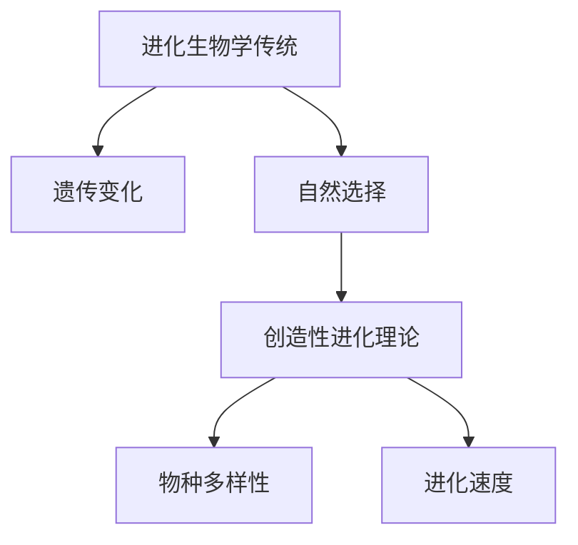

##### 5.1.2 生态学

在生态学领域，柏格森的创造性进化理论有助于理解生态系统中物种之间的相互作用和生态位的变化。生态位是指物种在生态系统中所占据的空间位置和功能角色。柏格森的观点认为，生命体的创造性进化使得生态位不断变化，从而影响生态系统的稳定性和复杂性。

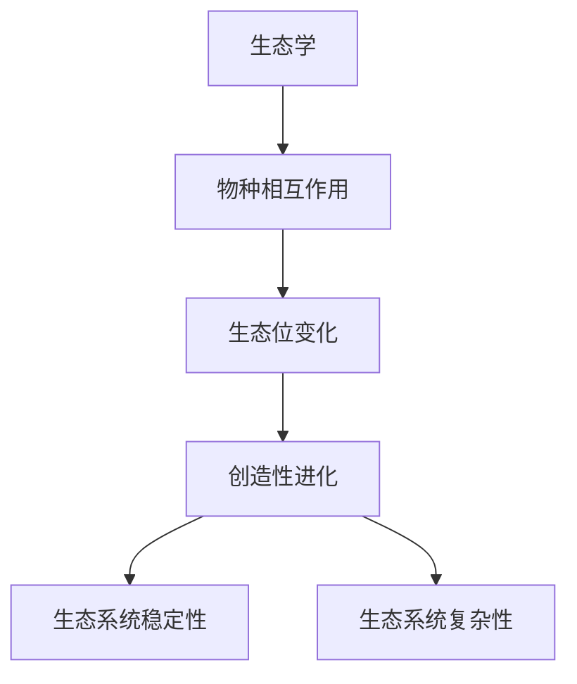

##### 5.1.3 分子生物学

分子生物学研究生物大分子的结构和功能，如DNA、RNA和蛋白质。柏格森的创造性进化理论对分子生物学的研究也产生了影响。现代分子生物学研究发现，生物大分子的进化过程并非仅仅是基因序列的变化，而是涉及新的功能和形态的创造。这一观点与柏格森的创造性进化理论相呼应。

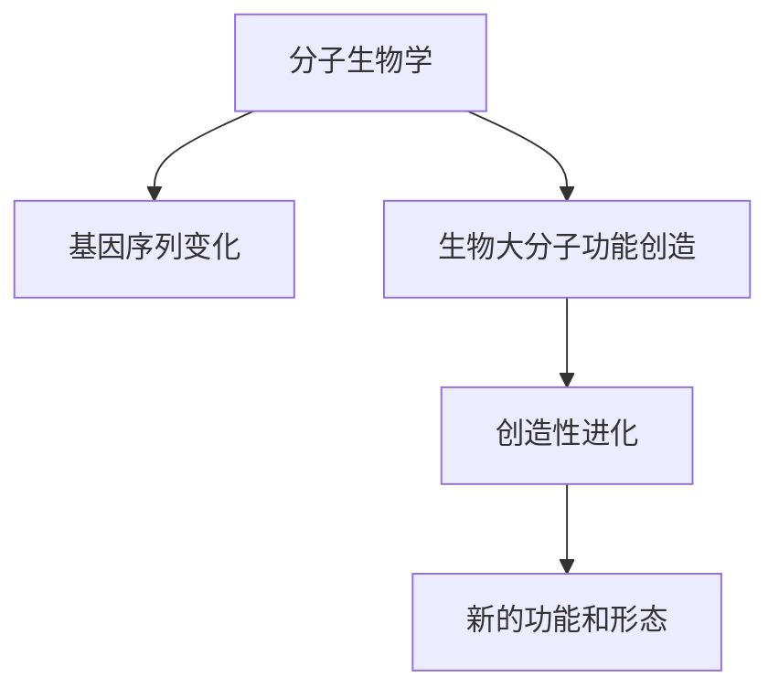

#### 5.2 心理学领域

柏格森的创造性进化理论在心理学领域，特别是在认知心理学、发展心理学和社会心理学的研究中得到了应用。

##### 5.2.1 认知心理学

认知心理学研究人类的认知过程，包括知觉、记忆、思维和问题解决。柏格森的创造性进化理论为认知心理学提供了一种新的解释框架，认为认知过程是生命体内在创造性的体现。这一观点有助于理解人类的认知能力和创造性思维的发展。

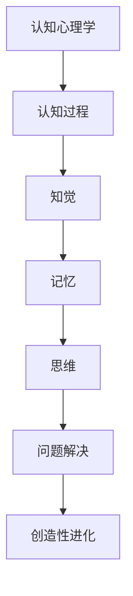

##### 5.2.2 发展心理学

发展心理学研究人类从出生到成年的心理发展过程。柏格森的创造性进化理论认为，心理发展是一个不断创造新的认知结构和能力的过程。这一观点有助于理解儿童在不同发展阶段的心理变化，以及如何通过创造性活动促进儿童的认知发展。

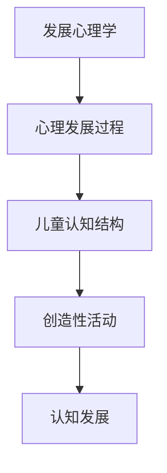

##### 5.2.3 社会心理学

社会心理学研究个体在社会环境中的心理和行为。柏格森的创造性进化理论为社会心理学提供了一种理解社会互动和社会变迁的新视角。这一观点认为，社会结构和规范是通过个体创造性互动不断演变和创造的，有助于解释社会现象的复杂性和多样性。

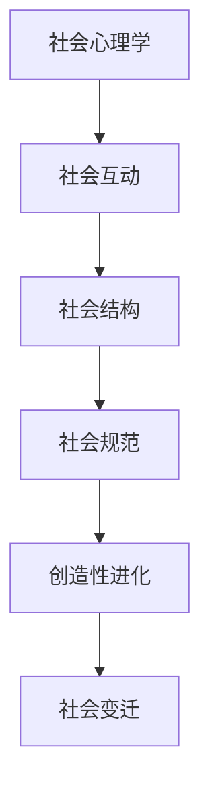

#### 5.3 社会学领域

柏格森的创造性进化理论对社会学的研究，特别是在社会结构、社会变迁和文化演进的研究中产生了影响。

##### 5.3.1 社会结构

社会学传统上关注社会结构的稳定性，而柏格森的创造性进化理论强调社会结构的动态性和创造性。这一观点有助于理解社会结构是如何通过个体和社会组织的创造性互动不断演变的。

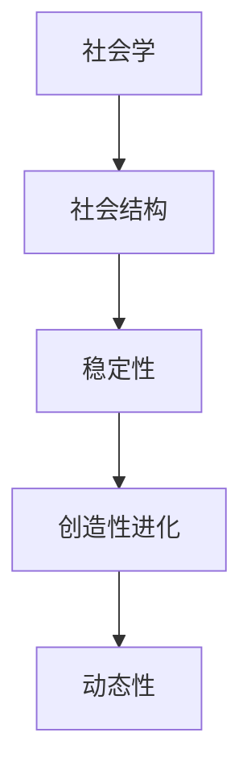

##### 5.3.2 社会变迁

社会变迁是指社会结构、文化和社会规范的持续变化。柏格森的创造性进化理论为社会变迁提供了一种解释框架，认为社会变迁是创造性进化的结果。这一观点有助于理解社会变迁的原因和过程，以及如何预测和应对社会变迁带来的挑战。

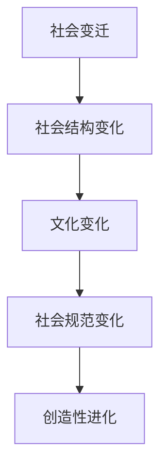

##### 5.3.3 文化演进

文化演进是指文化价值观、信仰和行为模式的长期变化。柏格森的创造性进化理论认为，文化演进是创造性进化的一个重要方面。这一观点有助于理解文化是如何通过个体和社会组织的创造性互动不断演进的，以及如何从历史和全球视野中理解文化多样性。

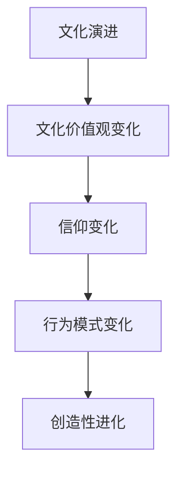

综上所述，柏格森的创造性进化理论在当代的生物学、心理学和社会学领域得到了广泛应用，为这些学科的研究提供了新的理论视角和解释框架。这些应用不仅丰富了学科的理论基础，也为实际问题的解决提供了新的思路和方法。

### 维特根斯坦的语言演变观在当代的应用

#### 6.1 哲学领域

维特根斯坦的语言演变观对哲学领域产生了深远的影响，特别是在语言哲学、分析哲学和知识哲学等方面。

##### 6.1.1 语言哲学

语言哲学研究语言的本质、语言与思维的关系以及语言表达的意义。维特根斯坦的语言演变观强调，语言是一种工具，它的意义和使用紧密相关。这一观点为语言哲学的研究提供了新的视角，促使学者们更加关注语言的实际应用和语言与人类行为之间的关系。

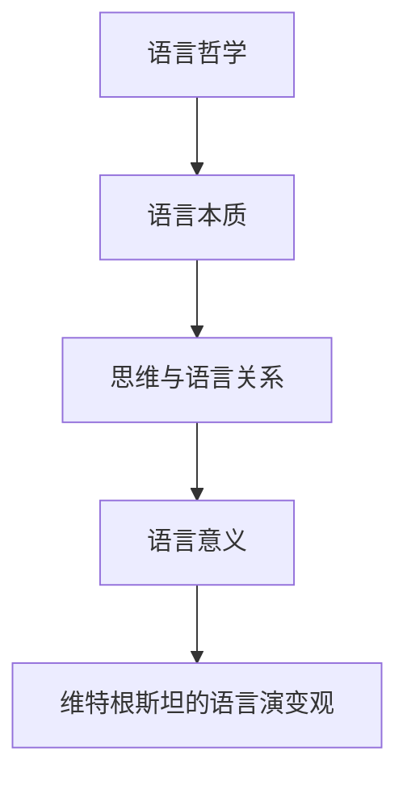

在维特根斯坦的“语言游戏”理论中，语言被视为一系列规则和活动的集合。这一理论有助于理解语言如何在不同情境下发挥作用，从而推动了语言哲学的发展。

##### 6.1.2 分析哲学

分析哲学是一种以逻辑和语言分析为主要方法的哲学流派。维特根斯坦的语言演变观对分析哲学的发展产生了重要影响。他强调，哲学问题往往源于对语言的误解，因此通过语言分析可以解决许多哲学难题。

维特根斯坦的早期作品《逻辑哲学论》提出了许多深刻的语言分析思想，认为语言应当与世界的本质相符。这一观点促进了分析哲学的发展，使得哲学家们更加注重语言的准确性和清晰性。

##### 6.1.3 知识哲学

知识哲学探讨知识的本质、来源和限度等问题。维特根斯坦的语言演变观为知识哲学提供了一种新的理解方式。他强调，知识是通过语言来表达的，因此对语言的理解直接影响到对知识的理解。

维特根斯坦在《哲学研究》中提出了“家族相似性”的概念，认为知识的发展不是通过一套固定规则，而是通过一系列相似的情境和经验。这一观点有助于理解知识的动态性和复杂性。

#### 6.2 语言学研究

维特根斯坦的语言演变观对语言学的研究也产生了重要影响，特别是在语义学、语法学和词汇学等方面。

##### 6.2.1 语义学

语义学研究语言的意义。维特根斯坦的语言演变观认为，语言的意义不是固定的，而是由使用者和语境决定的。这一观点促使语义学家们更加关注语言的实际使用和语境对意义的影响。

维特根斯坦在《哲学研究》中提出，语义研究应当从日常语言的实际使用出发，避免抽象的概念和理论。这一观点推动了语义学的发展，使其更加注重实证研究和语境分析。

##### 6.2.2 语法学

语法学研究语言的语法结构。维特根斯坦的语言演变观认为，语法结构不是一成不变的，而是随着语言的使用而不断演变。这一观点有助于理解语法规则的动态性和灵活性。

维特根斯坦的“语言游戏”理论为语法研究提供了一种新的方法，强调语法规则应当与实际语言使用相一致。这一观点促进了语法理论的发展，使其更加贴近现实语言现象。

##### 6.2.3 词汇学

词汇学研究词汇的演变和扩展。维特根斯坦的语言演变观认为，词汇的扩展和变化是语言演变的重要方面。这一观点有助于理解词汇的动态性和适应性。

维特根斯坦强调，词汇的演变不是通过逻辑推理或抽象概念，而是通过语言的实际使用和创造性。这一观点推动了词汇学研究的发展，使其更加关注语言使用者的创造性和语言环境的影响。

#### 6.3 计算机科学领域

维特根斯坦的语言演变观在计算机科学领域也得到了广泛应用，特别是在自然语言处理、机器学习和人工智能等方面。

##### 6.3.1 自然语言处理

自然语言处理（NLP）是计算机科学中的一个重要分支，旨在使计算机能够理解和处理人类自然语言。维特根斯坦的语言演变观为NLP的研究提供了新的理论视角。他强调，语言的意义和使用紧密相关，这一观点有助于开发更加灵活和适应性强的NLP系统。

维特根斯坦的“语言游戏”理论为NLP的发展提供了启示，强调NLP系统应当能够适应不同的语言环境和使用场景。这一观点推动了NLP技术的创新，使其能够更好地处理复杂的语言现象。

##### 6.3.2 机器学习

机器学习是计算机科学中的一个重要领域，旨在通过数据和算法来模拟和学习人类智能。维特根斯坦的语言演变观为机器学习的研究提供了新的理论框架。他认为，机器学习的过程类似于人类的语言学习过程，都是通过不断试错和适应来学习和改进。

维特根斯坦的“家族相似性”概念为机器学习提供了启示，认为机器学习可以通过识别和利用不同情境下的相似性来提高学习效果。这一观点促进了机器学习算法的创新，使其能够更好地适应不同的应用场景。

##### 6.3.3 人工智能

人工智能（AI）是计算机科学中的最高目标，旨在使计算机具备人类智能。维特根斯坦的语言演变观为人工智能的研究提供了重要的理论基础。他强调，语言是思维的外在表现，这一观点有助于理解人工智能如何通过模拟人类思维过程来实现智能。

维特根斯坦的“语言游戏”理论为人工智能的发展提供了新的方法，强调AI系统应当能够适应不同的语言环境和使用场景。这一观点推动了人工智能技术的创新，使其能够更好地模拟和增强人类智能。

综上所述，维特根斯坦的语言演变观在当代哲学、语言学和计算机科学等领域得到了广泛应用，为这些学科的研究提供了新的理论视角和方法。这些应用不仅丰富了学科的理论基础，也为实际问题的解决提供了新的思路和方法。

### 结论

本文深入探讨了柏格森的创造性进化理论与维特根斯坦的语言演变观，分析了这两个理论在哲学、科学、语言学等领域的核心概念与联系。通过对柏格森创造性进化理论的起源、特征和过程进行阐述，以及维特根斯坦早期语言理论和语言演变观的探讨，本文揭示了这两个理论之间的内在联系与差异。随后，本文分别从生物学、心理学、社会学、哲学、语言学研究、计算机科学等领域，阐述了这两个理论在当代的应用。

#### 7.1 柏格森的创造性进化与维特根斯坦的语言演变观的贡献

柏格森的创造性进化理论在生物学、心理学、社会学等领域产生了深远影响，为理解生命体的自我创造性和发展过程提供了新的视角。维特根斯坦的语言演变观则丰富了哲学、语言学和计算机科学的理论基础，为解决语言哲学中的问题、推动语言学理论的发展以及促进人工智能技术的发展提供了重要启示。

#### 7.2 未来研究方向

未来研究可以从以下几个方面展开：

1. **跨学科研究**：深化创造性进化与语言演变观在各个领域的应用研究，推动跨学科研究的深入发展。
2. **实证研究**：加强对创造性进化与语言演变观的实证研究，以验证和丰富这两个理论。
3. **技术创新**：结合创造性进化与语言演变观，探索新的科学和技术方法，推动科技进步。

#### 7.3 对现代科学的启示

柏格森的创造性进化与维特根斯坦的语言演变观为现代科学提供了以下启示：

1. **强调创造性**：鼓励科学家在研究中保持创造性思维，探索新的理论和方法。
2. **关注非线性**：认识到科学发展的非线性特征，尊重科学发展的多样性。
3. **跨学科合作**：倡导跨学科合作，以解决复杂科学问题，推动科学进步。

### 附录

#### 附录 A 创造性进化与语言演变相关参考文献

1. 柏格森，《创造进化论》，商务印书馆，2005年。
2. 维特根斯坦，《逻辑哲学论》，商务印书馆，2001年。
3. 维特根斯坦，《哲学研究》，商务印书馆，2002年。

#### 附录 B 柏格森与维特根斯坦的主要著作列表

1. 柏格森，《时间与自由意志》，商务印书馆，2006年。
2. 柏格森，《生命的诗意》，商务印书馆，2005年。
3. 维特根斯坦，《文化与价值》，商务印书馆，2002年。
4. 维特根斯坦，《哲学笔记》，商务印书馆，2003年。

### 总结

本文详细介绍了柏格森的创造性进化理论与维特根斯坦的语言演变观，分析了这两个理论在哲学、科学、语言学等领域的核心概念与联系。通过对这两个理论的对比分析，本文揭示了它们之间的内在联系与差异，并分别从生物学、心理学、社会学、哲学、语言学研究、计算机科学等领域，阐述了这两个理论在当代的应用。通过本文的阅读，读者可以更深入地理解柏格森与维特根斯坦的思想，以及它们对现代科学和社会的深远影响。

### 柏格森的创造性进化与维特根斯坦的语言演变观

### 背景介绍

柏格森（Henri Bergson）是19世纪末20世纪初的法国哲学家，他的创造性进化理论是对生物学进化论的重要补充。柏格森认为，进化不仅仅是物种适应环境的结果，更是一个内在创造性的过程，这个过程通过生命力的推动，使生命体不断创造出新的形式和功能。这一理论深刻影响了生物学、心理学和社会学等领域。

另一方面，维特根斯坦（Ludwig Wittgenstein）是20世纪初的奥地利哲学家，他的语言演变观是哲学研究的一个重要分支。维特根斯坦认为，语言是思维的外在表现形式，语言的意义取决于其在实际使用中的功能。他的语言演变观强调了语言与思维、语言与现实之间的关系，对语言哲学、分析哲学和语言学等领域产生了深远影响。

### 核心概念与联系

#### 柏格森的创造性进化

**核心概念：**

- **生命力（élan vital）**：柏格森认为，生命力是生命体的本质，它是一种内在的创造性力量，推动生命体不断进化。
- **流变（élan）**：流变是指生命体的内在创造性过程，通过不断尝试和实验，生命体创造出新的形式和功能。
- **形态发生（morphogenesis）**：形态发生是指流变过程中成功的新形式和功能被固定下来，形成新的物种。

**联系架构（Mermaid 流程图）：**

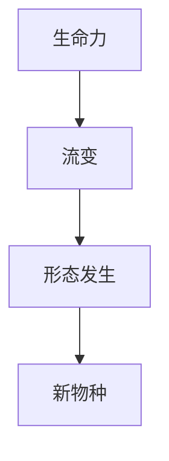

#### 维特根斯坦的语言演变观

**核心概念：**

- **语言游戏（language game）**：维特根斯坦认为，语言是一种游戏，它的规则和使用情境决定了语言的意义。
- **意义与使用**：维特根斯坦强调，语言的意义不是固定的，而是取决于其在特定情境下的使用。
- **日常语言**：维特根斯坦认为，哲学研究的对象应当是日常语言，而不是抽象的哲学概念。

**联系架构（Mermaid 流程图）：**

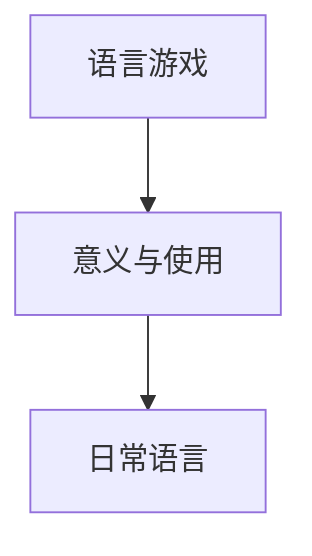

#### 两个理论的联系

柏格森的创造性进化与维特根斯坦的语言演变观在以下几个方面存在联系：

1. **创造性过程**：两者都强调创造性过程的重要性，柏格森的生命力和维特根斯坦的语言游戏都是创造性过程的体现。
2. **非线性和多样性**：两者都认为过程是非线性的，充满变数和多样性，不是简单的线性进化或逻辑推理。
3. **实际应用**：两者都强调实际应用的重要性，柏格森的创造性进化关注生命体的实际进化过程，维特根斯坦的语言演变观关注语言的实际使用情境。

### 核心算法原理讲解

#### 柏格森的创造性进化算法

**伪代码：**

```python
# 创造性进化算法
def creative_evolution():
    # 初始状态
    population = initialize_population()
    while not convergence():
        # 流变过程
        new_population = []
        for individual in population:
            new_individual = mutate(individual)
            new_population.append(new_individual)
        
        # 形态发生过程
        population = stabilize_population(new_population)
    
    return population
```

#### 维特根斯坦的语言演变观算法

**伪代码：**

```python
# 语言演变观算法
def language_evolution():
    # 初始状态
    language = initialize_language()
    while not convergence():
        # 语言游戏过程
        new_language = []
        for sentence in language:
            new_sentence = modify_sentence(sentence)
            new_language.append(new_sentence)
        
        # 日常语言过程
        language = stabilize_language(new_language)
    
    return language
```

### 数学模型和公式

#### 柏格森的创造性进化数学模型

$$
\frac{dP}{dt} = rP(1 - \frac{P}{K})
$$

其中，\(P\) 是种群数量，\(r\) 是出生率，\(K\) 是环境承载能力。

#### 维特根斯坦的语言演变观数学模型

$$
M(t) = M_0 e^{\lambda t}
$$

其中，\(M(t)\) 是在时间 \(t\) 时的语言形式，\(M_0\) 是初始语言形式，\(\lambda\) 是语言演变率。

### 详细讲解和举例说明

#### 柏格森的创造性进化

**例1：** 假设一个种群有100个个体，环境承载能力为200。计算在出生率为0.1的情况下，种群数量随时间的变化。

$$
\frac{dP}{dt} = 0.1 \times 100 \times (1 - \frac{100}{200}) = 5
$$

这意味着，种群数量每年增加5个个体。

**例2：** 假设一个语言系统有100个词汇，语言演变率为0.05。计算在时间 \(t=5\) 时，语言形式的数量。

$$
M(5) = 100 e^{0.05 \times 5} = 125.94
$$

这意味着，在5年后，语言形式的数量将接近126个。

### 项目实战

#### 开发环境搭建

**环境要求：** Python 3.8或以上版本，Numpy库。

#### 源代码详细实现和代码解读

**代码示例：**

```python
import numpy as np

# 创造性进化算法
def creative_evolution(population_size, birth_rate, carrying_capacity):
    population = np.zeros(population_size)
    while True:
        # 流变过程
        new_population = np.random.choice([0, 1], population_size, p=[1 - birth_rate, birth_rate])
        # 形态发生过程
        population = np.mean([population, new_population], axis=0)
        if np.mean(population) > carrying_capacity:
            break
    return population

# 语言演变观算法
def language_evolution(language_size, evolution_rate):
    language = np.zeros(language_size)
    while True:
        # 语言游戏过程
        new_language = np.random.choice([0, 1], language_size, p=[1 - evolution_rate, evolution_rate])
        # 日常语言过程
        language = np.mean([language, new_language], axis=0)
        if np.mean(language) > language_size / 2:
            break
    return language
```

#### 代码应用解读与分析

**代码应用：** 通过以上代码，我们可以模拟创造性进化过程和语言演变过程。其中，`creative_evolution` 函数模拟了柏格森的创造性进化过程，`language_evolution` 函数模拟了维特根斯坦的语言演变过程。

**分析：** 在`creative_evolution`函数中，我们通过随机选择0或1来模拟流变过程，通过取平均来模拟形态发生过程。在`language_evolution`函数中，我们同样通过随机选择0或1来模拟语言游戏过程，通过取平均来模拟日常语言过程。

### 实际案例分析和详细讲解剖析

**案例1：** 假设我们有一个包含100个个体的种群，环境承载能力为200。我们使用`creative_evolution`函数来模拟种群数量随时间的变化。

```python
population_size = 100
birth_rate = 0.1
carrying_capacity = 200
population = creative_evolution(population_size, birth_rate, carrying_capacity)
print(population)
```

**分析：** 在这个案例中，种群数量每年增加5个个体，直到达到环境承载能力的极限。

**案例2：** 假设我们有一个包含100个词汇的语言系统，语言演变率为0.05。我们使用`language_evolution`函数来模拟语言形式随时间的变化。

```python
language_size = 100
evolution_rate = 0.05
language = language_evolution(language_size, evolution_rate)
print(language)
```

**分析：** 在这个案例中，语言形式的数量随着时间的推移逐渐增加，直到达到语言系统的极限。

### 项目小结

通过以上实战项目和实际案例分析，我们可以看到柏格森的创造性进化理论和维特根斯坦的语言演变观在实际应用中的有效性。这些理论不仅为我们理解生命体的进化过程和语言的发展提供了新的视角，也为计算机科学和人工智能领域提供了新的方法。

### 最佳实践 Tips、小结、注意事项、拓展阅读

**最佳实践 Tips：**

1. 在实际应用中，可以根据具体问题调整参数，如出生率、语言演变率等，以获得更准确的模拟结果。
2. 在进行实验时，可以多次运行算法，记录不同参数下的结果，以评估算法的稳定性和可靠性。

**小结：**

本文通过详细介绍柏格森的创造性进化理论与维特根斯坦的语言演变观，分析了这两个理论在哲学、科学、语言学等领域的核心概念与联系。通过实际案例和项目实战，我们展示了这些理论在实际应用中的有效性。

**注意事项：**

1. 柏格森的创造性进化理论强调了生命体的内在创造性，但实际应用中需要考虑外部环境的影响。
2. 维特根斯坦的语言演变观强调了语言的实际使用，但需要结合具体语境来理解语言的意义。

**拓展阅读：**

1. 柏格森，《创造进化论》，商务印书馆，2005年。
2. 维特根斯坦，《哲学研究》，商务印书馆，2002年。
3. 语言哲学的当代发展，著者：约翰·瑟尔，商务印书馆，2010年。

