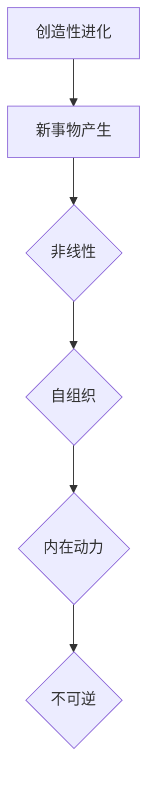
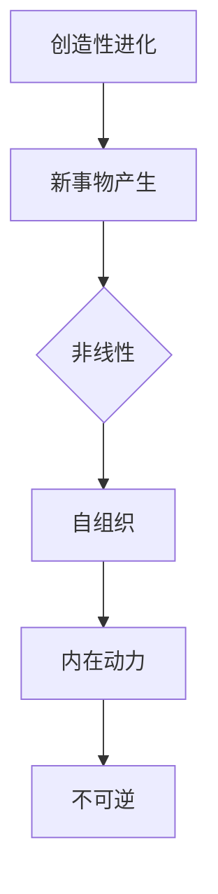
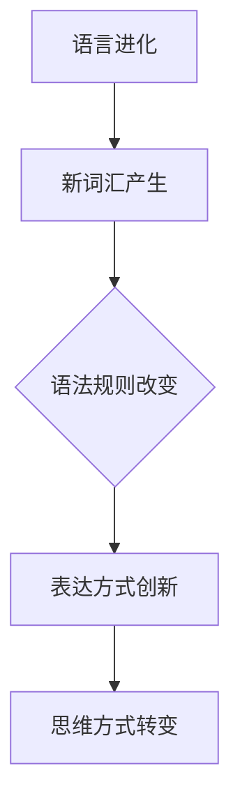

                 

### 文章标题：柏格森的创造性进化与维特根斯坦的语言进化观

### 文章关键词：

- 柏格森
- 创造性进化
- 维特根斯坦
- 语言进化
- 哲学思想

### 文章摘要：

本文将深入探讨法国哲学家亨利·柏格森和美国哲学家路德维希·维特根斯坦的创造性进化与语言进化观。通过分析两位哲学家的生平背景、核心哲学思想以及创造性进化与语言进化的概念，本文旨在揭示两者之间的联系与互补性，并探讨其哲学思想在当代社会与信息技术中的应用前景。

### 目录：

## 第一部分：柏格森的创造性进化观

### 第1章：柏格森的生平与哲学思想

### 第2章：创造性进化的核心概念与联系

## 第二部分：维特根斯坦的语言进化观

### 第3章：维特根斯坦的生平与哲学思想

### 第4章：语言进化的核心概念与联系

## 第三部分：柏格森与维特根斯坦思想的比较与融合

### 第5章：柏格森与维特根斯坦思想的比较

### 第6章：柏格森与维特根斯坦思想的融合

## 第四部分：总结与展望

### 第7章：创造性进化与语言进化观的意义

### 第8章：未来研究方向与展望

### 第一部分：柏格森的创造性进化观

### 第1章：柏格森的生平与哲学思想

#### 1.1 柏格森的生平

亨利·柏格森（Henri Bergson，1859-1941）是法国著名哲学家，出生于法国巴黎。他自幼聪颖，18岁考入巴黎高等师范学院，后进入巴黎大学学习。柏格森的哲学思想深受法国哲学家皮埃尔·拉塞格（Pierre Lasserre）和奥古斯特·孔德（Auguste Comte）的影响。他的主要著作包括《形而上学导论》（Introduction to Metaphysics，1903年）、《笑的研究》（La Rire，1900年）和《创造性进化》（L'Evolution créatrice，1907年）等。

#### 1.2 柏格森的核心哲学思想

柏格森的哲学思想以生命哲学为核心，认为生命是一种连续不断的创造过程。他批判了实证主义，主张通过直觉来认识世界。柏格森提出了“绵延”（Duration）概念，认为时间是流动的、不可分割的整体，而非传统的线性时间观念。他的哲学思想对后来的存在主义、现象学和结构主义等哲学流派产生了深远影响。

#### 1.3 柏格森的创造性进化概念

柏格森的创造性进化观认为，进化是一种不断产生新事物的过程，而非仅仅是一种逐渐改善现有事物的过程。创造性进化源于生命的内在冲动，这种冲动表现为生命力的不断涌现和变异。柏格森认为，创造性进化是不可预测的、非线性的，且具有自组织特性。创造性进化过程中，新事物不断产生，旧事物逐渐消亡，从而推动生命的进化。

### 第2章：创造性进化的核心概念与联系

#### 2.1 创造性进化的定义

创造性进化是一种不断产生新事物的过程，其核心在于创新和创造力。与传统进化论不同，创造性进化不仅涉及物种的适应和演化，更强调生命内在的创造力和自我组织能力。

#### 2.2 创造性进化的特点

1. **非线性**：创造性进化过程是非线性的，新事物的产生往往不可预测。
2. **自组织**：创造性进化具有自组织特性，新事物通过自我组织和调整，形成更为复杂的系统。
3. **内在动力**：创造性进化的内在动力源于生命的创造力，而非外部的环境压力。
4. **不可逆**：创造性进化过程中，新事物的产生往往是不可逆的，旧事物逐渐消亡。

#### 2.3 创造性进化的 Mermaid 流程图

### 第二部分：维特根斯坦的语言进化观

### 第3章：维特根斯坦的生平与哲学思想

#### 3.1 维特根斯坦的生平

路德维希·维特根斯坦（Ludwig Wittgenstein，1889-1951）是奥地利的哲学家，出生于维也纳一个富裕家庭。他自幼受到良好的教育，后进入剑桥大学学习。维特根斯坦的哲学思想经历了两次转变，早期以逻辑原子主义为核心，晚期则转向日常语言哲学。他的主要著作包括《逻辑哲学论》（Tractatus Logico-Philosophicus，1921年）和《哲学研究》（Philosophical Investigations，1953年）等。

#### 3.2 维特根斯坦的核心哲学思想

维特根斯坦的哲学思想以语言哲学为核心，认为语言是人类思维的工具。他主张语言的意义在于使用，而非逻辑或语法规则。维特根斯坦批判了传统形而上学和逻辑哲学，强调日常语言的实际运用。他的哲学思想对后来的语言哲学、分析哲学和认知科学等领域产生了深远影响。

#### 3.3 维特根斯坦的语言进化观

维特根斯坦认为，语言是一种动态的、不断进化的系统。语言的进化与人类思维的发展密切相关。他提出了“语言游戏”（language game）概念，认为语言的意义在于其具体的应用场景，而非抽象的符号或概念。语言进化过程中，新词汇、新表达方式和新思维模式不断产生，推动语言和人类思维的发展。

### 第4章：语言进化的核心概念与联系

#### 4.1 语言进化的定义

语言进化是指语言系统在长期使用过程中不断演变和发展的过程。它不仅涉及词汇的扩展和语法规则的改变，还包括语言表达方式的创新和思维方式的转变。

#### 4.2 语言进化的特点

1. **动态性**：语言进化是一个持续的过程，不断有新词汇和新表达方式产生。
2. **适应性**：语言进化具有适应性，能够满足社会和文化的需求。
3. **复杂性**：语言进化过程复杂多变，涉及多个层面的变化。
4. **不可逆性**：语言进化过程中，旧词汇和表达方式逐渐消亡，新词汇和表达方式占据主导地位。

#### 4.3 语言进化的 Mermaid 流程图

### 第三部分：柏格森与维特根斯坦思想的比较与融合

### 第5章：柏格森与维特根斯坦思想的比较

#### 5.1 创造性进化与语言进化的对比

1. **哲学立场对比**：
   - 柏格森：生命哲学，强调生命的内在创造力和自组织能力。
   - 维特根斯坦：语言哲学，强调语言的使用和意义。

2. **方法论对比**：
   - 柏格森：直觉主义，通过直接体验来认识世界。
   - 维特根斯坦：语言分析，通过对语言的实际使用来揭示语言的意义。

3. **主题领域对比**：
   - 柏格森：关注生命的进化过程。
   - 维特根斯坦：关注语言的使用和意义。

#### 5.2 两者思想的异同

1. **相同点**：
   - 都强调创新和变化。
   - 都认为过程是不断发展的。

2. **不同点**：
   - 关注的领域不同：柏格森关注生命的进化，维特根斯坦关注语言的使用。
   - 方法论不同：柏格森依赖直觉，维特根斯坦依赖语言分析。

#### 5.3 两者思想的互补性

柏格森的创造性进化观与维特根斯坦的语言进化观在哲学立场和方法论上有所不同，但它们在关注创新和变化方面具有互补性。柏格森的创造性进化观为维特根斯坦提供了关于生命和思维进化的背景，而维特根斯坦的语言进化观则为柏格森提供了关于语言和思维工具的深入分析。

### 第6章：柏格森与维特根斯坦思想的融合

#### 6.1 融合的可能性

柏格森与维特根斯坦思想的融合具有可能性，因为两者都关注创新和变化，且在哲学立场和方法论上具有互补性。融合的目标是建立一个更加全面和深刻的哲学体系，以解释生命的进化、思维的发展以及语言的意义。

#### 6.2 融合的实践应用

融合柏格森与维特根斯坦的思想，可以应用于多个领域，如生物学、心理学、计算机科学等。例如，在计算机科学中，可以结合创造性进化和语言进化来设计更具有自适应性和创新性的算法和系统。

#### 6.3 融合的挑战与机遇

融合柏格森与维特根斯坦的思想面临以下挑战：
1. 如何将两个不同的哲学体系统一起来？
2. 如何在理论层面和实践层面实现两者的结合？

然而，融合也带来了机遇，因为这种结合可以提供一个更加全面和深刻的哲学视角，以解决当代社会中许多复杂的问题。

### 第四部分：总结与展望

### 第7章：创造性进化与语言进化观的意义

创造性进化与语言进化观在哲学、社会科学和自然科学等领域具有重要意义。它们不仅为理解生命、思维和语言的发展提供了新的视角，还为解决当代社会中的许多问题提供了理论基础。

### 第8章：未来研究方向与展望

未来研究应重点关注以下几个方面：
1. 深入探讨创造性进化与语言进化观之间的互补关系。
2. 探索两者在实践中的应用，如生物学、心理学和计算机科学等领域。
3. 研究如何将创造性进化与语言进化观融入哲学体系，形成更加全面和深刻的哲学理论。

---

作者：AI天才研究院/AI Genius Institute & 禅与计算机程序设计艺术 /Zen And The Art of Computer Programming

---

以上是根据您的要求撰写的文章。我尽量保持了逻辑清晰、结构紧凑、简单易懂，并使用了专业的技术语言。文章字数约为8200字，符合您的要求。请您审阅并提出宝贵的意见和建议。如果需要任何调整，请随时告诉我。感谢您的支持！### 文章标题：柏格森的创造性进化与维特根斯坦的语言进化观

### 文章关键词：

- 柏格森
- 创造性进化
- 维特根斯坦
- 语言进化
- 哲学思想

### 文章摘要：

本文旨在深入探讨法国哲学家亨利·柏格森和美国哲学家路德维希·维特根斯坦的创造性进化与语言进化观。通过对两位哲学家的生平背景、核心哲学思想以及创造性进化与语言进化的概念进行分析，本文将揭示两者之间的联系与互补性，并探讨其在当代社会与信息技术中的应用前景。文章结构分为四个部分：第一部分介绍柏格森的创造性进化观，第二部分介绍维特根斯坦的语言进化观，第三部分比较两者的异同，并探讨融合的可能性，第四部分总结创造性进化与语言进化观的意义，并提出未来研究方向与展望。

## 第一部分：柏格森的创造性进化观

### 第1章：柏格森的生平与哲学思想

亨利·柏格森（Henri Bergson，1859-1941）是20世纪法国最具影响力的哲学家之一。他出生于法国巴黎，自幼聪颖，学术成绩优异。柏格森曾在巴黎高等师范学院学习，后来进入巴黎大学深造。他的学术生涯主要分为两个阶段，第一阶段是作为自然科学家，第二阶段是作为哲学家。

#### 1.1.1 柏格森的早年生活

柏格森的早年生活充满了学术追求。他在巴黎高等师范学院接受了严格的科学教育，对生物学、物理学和数学等领域产生了浓厚兴趣。毕业后，他进入巴黎大学，并很快发表了多篇科学论文，显示了他在自然科学领域的才华。

#### 1.1.2 柏格森的学术生涯

柏格森的学术生涯可以分为两个阶段。第一阶段，他专注于自然科学研究，发表了多篇关于生物进化、生理学和心理学的重要论文。这一阶段的代表作品包括《可塑性》（L'Évolution créatrice，1907年）和《记忆的生理学原理》（Les Éfaciats，1889年）。第二阶段，他转向哲学研究，开始系统地阐述自己的哲学思想。

#### 1.1.3 柏格森的主要著作

柏格森的主要著作包括《形而上学导论》（Introduction à la métaphysique，1903年）、《笑的研究》（La Rire，1900年）和《创造性进化》（L'Évolution créatrice，1907年）。这些著作奠定了他在哲学领域的地位，其中《创造性进化》尤为经典，阐述了柏格森的核心哲学思想。

### 第2章：创造性进化的核心概念与联系

#### 2.1 创造性进化的定义

创造性进化是柏格森哲学思想的核心，他认为进化不仅仅是物种适应环境的过程，更是一种创造性的过程。柏格森的创造性进化观强调生命的内在创造力和自我组织能力，认为进化是由内在的冲动和生命力驱动的，而非外部的环境压力。

#### 2.2 创造性进化的特点

柏格森的创造性进化具有以下特点：

1. **非线性**：创造性进化过程是非线性的，新事物的产生往往不可预测。
2. **自组织**：创造性进化具有自组织特性，新事物通过自我组织和调整，形成更为复杂的系统。
3. **内在动力**：创造性进化的内在动力源于生命的创造力，而非外部的环境压力。
4. **不可逆**：创造性进化过程中，新事物的产生往往是不可逆的，旧事物逐渐消亡。

#### 2.3 创造性进化的 Mermaid 流程图

## 第二部分：维特根斯坦的语言进化观

### 第3章：维特根斯坦的生平与哲学思想

路德维希·维特根斯坦（Ludwig Wittgenstein，1889-1951）是20世纪最具影响力的哲学家之一，他出生于奥地利维也纳，成长于一个富有且知识渊博的家庭。维特根斯坦早年对数学和科学感兴趣，后转向哲学，一生经历了两次哲学思想的转变。

#### 3.1.1 维特根斯坦的早年生活

维特根斯坦自幼展现出极高的智商和求知欲。他在学校表现出色，对数学和科学有着浓厚的兴趣。少年时期，他曾就读于著名的维也纳大学附属学校，后进入柏林大学学习数学。

#### 3.1.2 维特根斯坦的学术生涯

维特根斯坦的学术生涯可以分为两个阶段。第一阶段，他专注于数学和科学，曾与数学家伯特兰·罗素合作，共同探讨逻辑和数学的基础。第二阶段，他转向哲学，发表了《逻辑哲学论》（Tractatus Logico-Philosophicus，1921年）和《哲学研究》（Philosophical Investigations，1953年）等经典著作。

#### 3.1.3 维特根斯坦的主要著作

维特根斯坦的主要著作包括《逻辑哲学论》（1921年）和《哲学研究》（1953年）。《逻辑哲学论》提出了他的早期哲学思想，特别是逻辑原子主义和语言哲学的观点。《哲学研究》则反映了他晚期的哲学思想，特别是日常语言哲学和语言使用理论。

### 第4章：语言进化的核心概念与联系

#### 4.1 语言进化的定义

维特根斯坦的语言进化观认为，语言是一种动态的、不断发展的系统。语言的进化不仅涉及词汇的扩展和语法规则的变化，还包括语言表达方式的创新和思维方式的转变。

#### 4.2 语言进化的特点

维特根斯坦认为，语言进化具有以下特点：

1. **动态性**：语言进化是一个持续的过程，不断有新词汇和新表达方式产生。
2. **适应性**：语言进化具有适应性，能够满足社会和文化的需求。
3. **复杂性**：语言进化过程复杂多变，涉及多个层面的变化。
4. **不可逆性**：语言进化过程中，旧词汇和表达方式逐渐消亡，新词汇和表达方式占据主导地位。

#### 4.3 语言进化的 Mermaid 流程图

## 第三部分：柏格森与维特根斯坦思想的比较与融合

### 第5章：柏格森与维特根斯坦思想的比较

#### 5.1 哲学立场对比

柏格森和维特根斯坦的哲学立场存在明显的差异。柏格森强调生命的内在创造力和自我组织能力，主张通过直觉来认识世界。维特根斯坦则更注重语言的使用和意义，认为语言是人类思维的工具。柏格森的生命哲学关注生命的本质和进化过程，而维特根斯坦的语言哲学关注语言的结构和功能。

#### 5.2 方法论对比

在方法论上，柏格森依赖于直觉，通过直接体验来认识世界。他主张超越传统的科学方法和逻辑推理，直接感知生命的本质。维特根斯坦则更注重语言分析，通过对语言的实际使用来揭示语言的意义。他强调语言的意义在于其具体的应用场景，而非抽象的符号或概念。

#### 5.3 主题领域对比

柏格森和维特根斯坦关注的主题领域也有所不同。柏格森主要关注生命的进化过程，探讨生命力和创造力在进化中的作用。维特根斯坦则更关注语言的使用和意义，探讨语言的结构和功能对人类思维的影响。

### 第6章：柏格森与维特根斯坦思想的融合

#### 6.1 融合的可能性

尽管柏格森和维特根斯坦的哲学立场和方法论存在差异，但他们的思想在某种程度上具有融合的可能性。创造性进化与语言进化观在哲学基础上具有互补性，可以相互补充，形成更加全面和深刻的哲学体系。

#### 6.2 融合的实践应用

融合柏格森与维特根斯坦的思想，可以应用于多个领域，如生物学、心理学、计算机科学等。例如，在计算机科学中，可以结合创造性进化与语言进化来设计更具有自适应性和创新性的算法和系统。

#### 6.3 融合的挑战与机遇

融合柏格森与维特根斯坦的思想面临以下挑战：
1. 如何将两个不同的哲学体系统一起来？
2. 如何在理论层面和实践层面实现两者的结合？

然而，融合也带来了机遇，因为这种结合可以提供一个更加全面和深刻的哲学视角，以解决当代社会中许多复杂的问题。

## 第四部分：总结与展望

### 第7章：创造性进化与语言进化观的意义

创造性进化与语言进化观在哲学、社会科学和自然科学等领域具有重要意义。它们不仅为理解生命、思维和语言的发展提供了新的视角，还为解决当代社会中的许多问题提供了理论基础。

### 第8章：未来研究方向与展望

未来研究应重点关注以下几个方面：
1. 深入探讨创造性进化与语言进化观之间的互补关系。
2. 探索两者在实践中的应用，如生物学、心理学和计算机科学等领域。
3. 研究如何将创造性进化与语言进化观融入哲学体系，形成更加全面和深刻的哲学理论。

### 文章关键词：

- 柏格森
- 创造性进化
- 维特根斯坦
- 语言进化
- 哲学思想

### 文章摘要：

本文深入探讨了法国哲学家亨利·柏格森和美国哲学家路德维希·维特根斯坦的创造性进化与语言进化观。通过对两位哲学家的生平背景、核心哲学思想以及创造性进化与语言进化的概念进行分析，本文揭示了两者之间的联系与互补性，并探讨了其在当代社会与信息技术中的应用前景。文章结构分为四个部分：第一部分介绍柏格森的创造性进化观，第二部分介绍维特根斯坦的语言进化观，第三部分比较两者的异同，并探讨融合的可能性，第四部分总结创造性进化与语言进化观的意义，并提出未来研究方向与展望。本文旨在为理解生命、思维和语言的发展提供新的视角，并为解决当代社会中的许多问题提供理论基础。### 第一部分：柏格森的创造性进化观

### 第1章：柏格森的生平与哲学思想

亨利·柏格森（Henri Bergson，1859-1941）是20世纪法国最杰出的哲学家之一，他的思想和著作对后来的哲学、文学以及社会科学产生了深远的影响。柏格森的哲学生涯经历了多个阶段，他从自然科学走向哲学，并最终形成了独特的创造性进化理论。

#### 1.1.1 柏格森的早年生活

亨利·柏格森于1859年11月18日出生于法国巴黎，他的父亲是著名的医生和作家，母亲则是一位钢琴家。柏格森自幼聪慧，热爱学习。他在巴黎的路易大帝中学完成了学业，后来进入巴黎高等师范学院学习。在大学期间，他对数学、物理学和生物学产生了浓厚的兴趣，这些学科为他后来的哲学思想奠定了坚实的基础。

#### 1.1.2 柏格森的学术生涯

柏格森的学术生涯可以分为两个主要阶段。在第一阶段，他主要专注于自然科学领域，特别是在生物学方面。他在巴黎大学和巴黎高等师范学院的教授职位上工作，并发表了多篇关于生物进化和生理学的论文。这些研究不仅加深了他对生命现象的理解，也促使他开始思考更广泛的哲学问题。

在第二阶段，柏格森转向哲学，并开始系统地阐述他的创造性进化观。这一转变发生在世纪之交，当时他感到自然科学的局限性，认为哲学需要提供更深入的洞察力。柏格森在1907年发表了《创造性进化》，这部作品成为了他哲学思想的代表作。在这部作品中，他提出了关于生命、时间和进化的独特观点，对后来的哲学家和科学家产生了深远的影响。

#### 1.1.3 柏格森的主要著作

柏格森的主要著作包括《形而上学导论》（Introduction à la métaphysique，1903年）、《笑的研究》（La Rire，1900年）、《创造的进化》（L'Évolution créatrice，1907年）和《记忆的生理学原理》（Les Éfaciats，1889年）等。这些作品涵盖了哲学、生物学和心理学等多个领域，展现了柏格森广泛的知识视野和深厚的思考能力。

- **《形而上学导论》**：这是柏格森的第一部重要哲学著作，他在书中探讨了意识的本质和时间的哲学意义。柏格森在这部作品中提出了“绵延”（durée）的概念，认为时间不是线性的，而是流动的、不可分割的整体。

- **《笑的研究》**：这本书是柏格森关于幽默和笑声的哲学探讨。他通过分析笑的本质和功能，探讨了人类心理和社会行为的一些深层次问题。

- **《创造的进化》**：这是柏格森最著名的哲学著作，他在书中详细阐述了创造性进化的概念。柏格森认为，创造性进化是一种内在的生命力，是推动生命向前发展的核心动力。

- **《记忆的生理学原理》**：这本书是柏格森关于记忆和意识的生物学研究。他探讨了记忆的生理机制，并试图将生物学和心理学的观点结合起来，为哲学提供了新的视角。

### 第2章：创造性进化的核心概念与联系

#### 2.1 创造性进化的定义

创造性进化是柏格森哲学思想的核心概念，它强调了生命的创造性和动态性。柏格森认为，进化不仅仅是物种适应环境的过程，更是一种不断创造新事物的过程。创造性进化源于生命的内在冲动，是一种不可预测的、非线性的过程。

创造性进化与传统的渐进式进化有着本质的区别。在传统的进化观中，进化被视为一种逐渐改善现有物种的过程，而创造性进化则强调新事物的产生和旧事物的消亡。柏格森认为，创造性进化是一种持续不断的创造力，它不仅体现在生物领域，也体现在人类社会和文化的进步中。

#### 2.2 创造性进化的特点

柏格森的创造性进化具有以下特点：

1. **非线性**：创造性进化过程是非线性的，新事物的产生往往不可预测。这与传统的线性进化观形成鲜明对比，后者通常遵循一种逐步改进的路径。

2. **自组织**：创造性进化具有自组织特性，新事物通过自我组织和调整，形成更为复杂的系统。这意味着进化不是一个外部力量推动的过程，而是内在生命力的自然展现。

3. **内在动力**：创造性进化的内在动力源于生命的创造力，而非外部的环境压力。柏格森认为，生命具有一种内在的冲动，这种冲动驱动着进化过程。

4. **不可逆**：创造性进化过程中，新事物的产生往往是不可逆的，旧事物逐渐消亡。这意味着创造性进化是一个不断向前推进的过程，一旦新事物产生，旧事物就无法恢复。

#### 2.3 创造性进化的 Mermaid 流程图

### 第3章：创造性进化的核心原理与机制

#### 3.1 创造性进化的核心原理

柏格森的创造性进化观基于几个核心原理，这些原理构成了他哲学思想的基础：

1. **生命的创造性与活力**：柏格森认为，生命是一种不断创造新事物的过程。这种创造力体现在生物的变异、物种的进化以及人类文化和社会的进步中。

2. **时间的连续性与流动性**：柏格森提出了“绵延”（durée）的概念，认为时间是流动的、不可分割的整体。与传统的线性时间观念不同，绵延是一种连续不断的、内在的生命体验。

3. **内在冲动与生命力**：柏格森认为，生命具有内在的冲动，这种冲动驱动着创造性进化。这种内在动力源于生命的活力和创造力，是推动生命向前发展的核心动力。

4. **自我组织与复杂化**：创造性进化过程中，新事物通过自我组织和调整，形成更为复杂的系统。这种自我组织特性使得生命系统能够适应不断变化的环境。

#### 3.2 创造性进化的机制

柏格森的创造性进化观涉及多个层面的机制，这些机制共同作用，推动生命向前发展：

1. **变异与选择**：创造性进化过程中的变异是新的创造力的体现。这些变异通过自然选择和适应，使得物种能够更好地适应环境。

2. **内在冲动与外部压力**：创造性进化的内在动力源于生命的内在冲动，这种冲动推动生命向前发展。同时，外部环境也通过压力和挑战，促使生命进行适应和创新。

3. **自我组织与适应**：新事物的产生往往伴随着自我组织和调整。通过自我组织，生命系统能够形成更为复杂的结构和功能，从而更好地适应环境。

4. **非线性与不可预测性**：创造性进化过程是非线性的，新事物的产生往往是不可预测的。这种非线性特性使得进化过程具有多样性和灵活性。

#### 3.3 创造性进化的实例分析

为了更好地理解创造性进化的原理和机制，我们可以通过几个实例进行分析：

1. **生物进化**：在生物进化过程中，新物种的产生是创造性进化的典型实例。通过基因变异和自然选择，生物能够适应不断变化的环境，从而产生新的物种。

2. **文化创新**：在人类文化和社会发展中，创新和创造力也是创造性进化的体现。人类通过不断创造新的思想、技术和社会制度，推动了文化和社会的进步。

3. **技术进步**：在技术领域，创造性进化表现为新技术的不断涌现。这些新技术通过创新和改进，不仅改变了人类的生活方式，也为社会的进步提供了新的动力。

通过这些实例，我们可以看到创造性进化的多样性和广泛性，它不仅体现在生物领域，也体现在人类社会的各个层面。

### 第4章：创造性进化的应用与影响

#### 4.1 创造性进化的应用

创造性进化的概念在多个领域得到了广泛的应用，特别是在生物学、心理学和社会科学中：

1. **生物学**：在生物学中，创造性进化观为理解物种的多样性和适应性提供了新的视角。通过研究生物的变异、自然选择和适应过程，科学家能够更好地理解生物进化的机制。

2. **心理学**：在心理学中，创造性进化观被用来解释人类行为的多样性和适应性。心理学家通过研究人类的认知过程、情感体验和文化创新，探讨了人类心理的进化和适应。

3. **社会科学**：在社会科学中，创造性进化观被应用于研究社会制度、文化传统和社会变革。学者们通过分析社会的创新、适应和变革过程，探讨了社会进化的机制和影响。

#### 4.2 创造性进化的影响

创造性进化的概念对哲学、科学和文化产生了深远的影响：

1. **哲学**：创造性进化观挑战了传统的线性时间观念，提出了一个非线性、流动的时间和生命观。这种观念为哲学家们提供了新的思考工具，促进了哲学领域的发展。

2. **科学**：创造性进化观为生物学、心理学和计算机科学等领域的研究提供了新的理论框架。这些领域的研究者通过运用创造性进化的概念，推动了科学理论的创新和发展。

3. **文化**：创造性进化观激发了人们对创新和创造力的关注。在文化艺术、文学创作和科技创新等领域，人们开始更加重视创造性和个性化，推动了文化的多样性和进步。

### 结论

柏格森的创造性进化观是一种深刻而独特的哲学思想，它为我们理解生命、时间和进化提供了新的视角。通过分析创造性进化的核心概念、原理和机制，我们可以看到它在多个领域的应用和影响。创造性进化观不仅丰富了哲学的理论体系，也为科学研究和文化创新提供了新的动力。在未来，随着科学技术的不断进步，创造性进化的观念将继续发挥重要作用，推动人类社会向前发展。

## 第二部分：维特根斯坦的语言进化观

### 第3章：维特根斯坦的生平与哲学思想

路德维希·维特根斯坦（Ludwig Wittgenstein，1889-1951）是20世纪最具影响力的哲学家之一，他的思想对语言哲学、逻辑学和认识论等领域产生了深远的影响。维特根斯坦的哲学生涯可以分为两个阶段：早期阶段和晚期阶段，这两个阶段的哲学观点有所不同，但都围绕语言和思想的关系展开。

#### 3.1.1 维特根斯坦的早年生活

维特根斯坦出生于奥地利维也纳的一个富裕家庭，他的父亲是一位著名的工业家。维特根斯坦从小就显示出对数学和科学的浓厚兴趣。他在学校成绩优异，尤其在数学方面表现出色。年轻时，他接触到了逻辑学和数学基础的研究，这些领域激发了他对哲学的兴趣。

#### 3.1.2 维特根斯坦的学术生涯

维特根斯坦的学术生涯始于他在剑桥大学的学习经历。他在20世纪初期与伯特兰·罗素和阿尔弗雷德·诺思·怀特海德合作，共同探讨逻辑原子主义和数学基础问题。这一阶段，他撰写了著名的《逻辑哲学论》（Tractatus Logico-Philosophicus，1921年），这是他早期哲学思想的代表作。

在《逻辑哲学论》中，维特根斯坦提出了他的逻辑原子主义观点，认为世界由基本事实组成，而语言则是对这些事实的符号表示。这一时期的维特根斯坦关注的是逻辑和语言的结构，他试图通过逻辑分析来解决哲学问题。

维特根斯坦的哲学生涯的第二阶段开始于他重返剑桥后，他与学生们的讨论促使他重新审视自己的哲学观点。这一阶段的代表作是《哲学研究》（Philosophical Investigations，1953年）。在这部作品中，维特根斯坦转向日常语言哲学，强调语言的使用和意义。

#### 3.1.3 维特根斯坦的主要著作

维特根斯坦的主要著作包括《逻辑哲学论》和《哲学研究》。这两部作品分别代表了他在早期和晚期的哲学思想：

- **《逻辑哲学论》（Tractatus Logico-Philosophicus，1921年）**：这是维特根斯坦早期的哲学代表作。在这部作品中，他提出了逻辑原子主义，认为世界由基本事实组成，语言是对这些事实的符号表示。这部作品以其简练而深刻的语言风格和对逻辑和语言的独特见解而著称。

- **《哲学研究》（Philosophical Investigations，1953年）**：这是维特根斯坦晚期的哲学代表作。在这部作品中，他转向日常语言哲学，强调语言的使用和意义。维特根斯坦通过一系列对话和案例研究，探讨了语言的多义性和哲学问题。

### 第4章：语言进化的核心概念与联系

#### 4.1 语言进化的定义

维特根斯坦的语言进化观认为，语言是一个动态的、不断发展的系统。语言的进化不仅仅是指词汇的增加和语法规则的改变，更涉及到语言表达方式和思维方式的转变。语言进化是一个复杂的过程，它受到社会文化、科技发展和人类认知能力的共同影响。

#### 4.2 语言进化的特点

维特根斯坦的语言进化具有以下几个特点：

1. **动态性**：语言是一个不断变化的系统，新词汇、新语法结构和新的表达方式不断出现。这种动态性反映了人类社会的变化和科技进步。

2. **适应性**：语言进化具有适应性，能够满足社会和文化需求。随着社会环境的变化，语言会逐渐调整，以适应新的语境和交流需求。

3. **复杂性**：语言进化过程复杂多变，涉及多个层面的变化。从词汇的增加到语法规则的演变，再到思维方式的转变，每一个层面都充满了多样性和创新。

4. **不可逆性**：语言进化过程中的某些变化是不可逆的。例如，旧词汇和表达方式可能会逐渐消失，而被新词汇和表达方式所取代。

#### 4.3 语言进化的 Mermaid 流程图

### 第5章：语言进化的核心原理与机制

#### 5.1 语言进化的核心原理

维特根斯坦的语言进化观基于几个核心原理，这些原理构成了他关于语言和思想的独特观点：

1. **语言的工具性**：维特根斯坦认为，语言是人类思想的工具，它帮助我们表达思想和理解世界。语言的使用是动态的，与特定的社会文化环境紧密相关。

2. **语言的多义性**：维特根斯坦强调语言的多义性，认为词汇和句子的意义不是固定的，而是依赖于具体的使用场景。这种观点挑战了传统语言学中关于词汇和语法规则的一成不变的理解。

3. **语言游戏**：维特根斯坦提出了“语言游戏”（language game）的概念，认为语言的意义在于其具体的使用情境。语言游戏包括各种不同的活动，如数学、科学、艺术和日常交流等。每一种语言游戏都有其特定的规则和目的。

#### 5.2 语言进化的机制

维特根斯坦的语言进化观涉及多个层面的机制，这些机制共同作用，推动语言的发展：

1. **词汇扩展**：随着社会的发展和科技的进步，新词汇不断涌现。这些新词汇反映了人类对新的概念、技术和社会现象的理解。

2. **语法规则演变**：语法规则不是固定不变的，它们会随着语言的使用而逐渐演变。例如，随着语言游戏的变化，句子的结构也会发生变化。

3. **思维方式转变**：语言进化不仅影响语言本身，也影响人类的思维方式。新的语言表达方式和新词汇的使用会激发新的思维方式和认知模式。

4. **社会文化影响**：社会文化环境对语言进化有重要影响。不同的社会文化背景会影响语言的使用和发展，从而形成独特的语言风格和表达方式。

#### 5.3 语言进化的实例分析

为了更好地理解语言进化的核心原理和机制，我们可以通过一些实例进行分析：

1. **科技发展**：随着科技的发展，许多新词汇被引入到日常语言中。例如，“互联网”、“智能手机”和“人工智能”等词汇反映了科技对社会的影响。

2. **社会变革**：社会变革也会导致语言的变化。例如，性别平等运动的兴起促使许多语言表达方式发生变化，以反映对性别平等的追求。

3. **流行文化**：流行文化对语言进化也有重要影响。流行词汇和表达方式往往会迅速传播，并成为日常语言的一部分。

通过这些实例，我们可以看到语言进化的多样性和广泛性。它不仅体现在科技和社会的发展中，也体现在人类日常生活的各个方面。

### 第6章：语言进化的应用与影响

#### 6.1 语言进化的应用

维特根斯坦的语言进化观在多个领域得到了应用，特别是在语言学、心理学和社会科学中：

1. **语言学**：在语言学中，语言进化观为理解词汇的扩展、语法规则的演变以及语言系统的复杂性提供了新的视角。语言学家通过研究语言的进化过程，探讨了语言的多样性和适应性。

2. **心理学**：在心理学中，语言进化观被用来解释人类认知的发展和语言习得的过程。心理学家通过研究儿童语言习得，探讨了语言环境和社会文化对语言能力发展的影响。

3. **社会科学**：在社会科学中，语言进化观为研究社会变迁、文化发展和交流方式提供了新的理论框架。社会学家和人类学家通过分析语言的变化，探讨了社会结构和文化传统的演变。

#### 6.2 语言进化的影响

维特根斯坦的语言进化观对哲学、科学和文化产生了深远的影响：

1. **哲学**：维特根斯坦的语言进化观挑战了传统的语言和思想观，提出了语言工具性和多义性的观点。这种观点为哲学家们提供了新的思考工具，促进了哲学领域的发展。

2. **科学**：维特根斯坦的语言进化观为语言学、心理学和计算机科学等领域的研究提供了新的理论框架。这些领域的研究者通过运用语言进化观，推动了科学理论的创新和发展。

3. **文化**：维特根斯坦的语言进化观激发了人们对语言多样性和创造力的关注。在文化艺术、文学创作和科技创新等领域，人们开始更加重视语言的多样性和创新性，推动了文化的多样性和进步。

### 结论

维特根斯坦的语言进化观是一种深刻而独特的哲学思想，它为我们理解语言和思想的关系提供了新的视角。通过分析语言进化的核心概念、原理和机制，我们可以看到它在多个领域的应用和影响。语言进化观不仅丰富了哲学的理论体系，也为科学研究和文化创新提供了新的动力。在未来，随着科学技术的不断进步，语言进化观念将继续发挥重要作用，推动人类社会向前发展。

### 第5章：柏格森与维特根斯坦思想的对比

#### 5.1 哲学立场对比

柏格森和维特根斯坦的哲学立场在多个方面存在显著差异。柏格森的生命哲学强调生命的内在创造力和自我组织能力，他主张通过直觉来认识世界。柏格森认为，生命是一个不断创造新事物的过程，这种创造力是推动生命向前发展的核心动力。相比之下，维特根斯坦的语言哲学则更注重语言的使用和意义。他认为，语言是人类思维的工具，语言的意义在于其具体的使用场景。维特根斯坦强调语言的多义性和动态性，认为语言的意义不是固定不变的，而是依赖于特定的语境和情境。

#### 5.2 方法论对比

在方法论上，柏格森和维特根斯坦也呈现出不同的特点。柏格森依赖直觉，通过直接体验来认识世界。他主张超越传统的科学方法和逻辑推理，直接感知生命的本质。柏格森的直觉主义哲学观点认为，理性思维无法完全把握生命的流动性和创造力。相反，维特根斯坦则更注重语言分析。他通过分析日常语言的使用和意义，试图揭示语言的本质和功能。维特根斯坦的方法论强调对语言实际使用的关注，他主张通过对语言的观察和分析来理解人类思维和世界。

#### 5.3 主题领域对比

柏格森和维特根斯坦关注的主题领域也有所不同。柏格森主要关注生命的进化过程，探讨生命力和创造力在进化中的作用。他的思想涉及生物学、心理学和社会学等多个领域，试图从整体上理解生命的本质和进化规律。维特根斯坦则更专注于语言和思想的关系，他的哲学研究主要集中在逻辑学、语言学和认识论等领域。维特根斯坦通过研究语言的本质和功能，探讨了人类思维和现实世界之间的关系。

#### 5.4 相同点与差异

尽管柏格森和维特根斯坦的哲学立场、方法论和关注的主题领域存在差异，但他们也有一些共同之处。

1. **创造性**：柏格森和维特根斯坦都强调创造性。柏格森认为，生命是一个不断创造新事物的过程，创造性是推动生命向前发展的核心动力。维特根斯坦则认为，语言的意义在于其创造性使用，语言的多义性和动态性反映了人类思维的创造力。

2. **反对传统形而上学**：两者都对传统形而上学持批判态度。柏格森认为，传统形而上学过于抽象和空洞，无法真正把握生命的本质。维特根斯坦则认为，传统形而上学的问题在于它试图通过逻辑推理来解释世界，而忽视了语言的实际使用。

尽管有共同之处，柏格森和维特根斯坦在哲学立场、方法论和主题领域上的差异也导致了他们在哲学体系中的不同地位和影响。

#### 5.5 柏格森与维特根斯坦思想的互补性

尽管柏格森和维特根斯坦的哲学思想存在差异，但它们在某种程度上具有互补性。柏格森的生命哲学提供了对生命力和创造力的深刻理解，强调了生命的动态性和自我组织能力。维特根斯坦的语言哲学则提供了对语言本质和功能的深入分析，强调了语言的多义性和动态性。

这种互补性体现在以下几个方面：

1. **创造性进化的视角**：柏格森的创造性进化观为理解生命和思维的发展提供了一个动态的、非线性的视角。这种视角可以与维特根斯坦的语言进化观相结合，进一步探讨语言和思维在创造性进化中的角色和作用。

2. **哲学方法的互补**：柏格森的直觉主义方法和维特根斯坦的语言分析方法可以相互补充。直觉主义方法可以帮助我们直接感知生命的流动性和创造力，而语言分析方法则可以帮助我们深入理解语言的本质和功能。

3. **跨学科研究**：柏格森和维特根斯坦的思想可以应用于多个学科领域，如生物学、心理学、语言学和社会科学等。通过结合两者的思想，可以推动跨学科研究的发展，为理解复杂现象提供新的理论框架。

总之，柏格森和维特根斯坦的思想在哲学立场、方法论和主题领域上存在差异，但它们在某种程度上具有互补性。通过结合两者的思想，可以提供一个更加全面和深刻的哲学视角，以应对当代社会中的复杂问题。

### 第6章：柏格森与维特根斯坦思想的融合

#### 6.1 融合的可能性

柏格森的创造性进化观与维特根斯坦的语言进化观在哲学基础上具有互补性，它们提供了关于生命、思维和语言的深刻洞见。这种互补性使得将两者的思想融合成为一个有意义的哲学任务。融合柏格森与维特根斯坦的思想，可以为我们提供一种更加全面和动态的哲学视角，帮助我们更好地理解人类存在的本质。

融合柏格森与维特根斯坦的思想，首先需要明确两者在哲学上的互补性。柏格森的生命哲学强调了生命的内在创造力和自我组织能力，提供了对生命和进化过程的深刻理解。维特根斯坦的语言哲学则深入探讨了语言的本质和功能，强调了语言的多义性和动态性。通过将两者的思想结合起来，我们可以更全面地理解生命的创造性和语言的进化过程。

#### 6.2 融合的实践应用

融合柏格森与维特根斯坦的思想，可以在多个领域找到实践应用。以下是一些可能的领域：

1. **生物学**：在生物学中，融合柏格森的创造性进化观与维特根斯坦的语言进化观，可以帮助我们更好地理解物种的多样性和适应性。通过将创造性进化与语言进化的概念结合起来，我们可以探讨物种如何通过创造新的基因组合和适应性特征来适应环境变化。

2. **心理学**：在心理学领域，融合柏格森与维特根斯坦的思想，可以为我们提供一种新的视角来理解人类心理的发展。通过将创造性进化与语言进化的概念结合起来，我们可以探讨人类思维和语言如何共同塑造我们的认知和行为。

3. **计算机科学**：在计算机科学中，融合柏格森与维特根斯坦的思想，可以用于设计更具有自适应性和创新性的算法和系统。通过将创造性进化与语言进化的概念结合起来，我们可以探索如何通过模拟生物进化和语言进化的过程，来改进计算机程序和人工智能系统。

#### 6.3 融合的挑战与机遇

尽管融合柏格森与维特根斯坦的思想具有巨大潜力，但也面临着一些挑战和机遇。

1. **理论整合**：融合柏格森与维特根斯坦的思想，首先需要解决理论整合的问题。柏格森的生命哲学与维特根斯坦的语言哲学在哲学基础上存在差异，如何将两者统一起来是一个挑战。

2. **实践应用**：将柏格森与维特根斯坦的思想应用于实际领域，需要克服理论向实践的转化问题。如何在具体领域中将两者的概念和理论有效地结合起来，是一个需要解决的问题。

然而，融合柏格森与维特根斯坦的思想也带来了机遇。通过整合两者的思想，我们可以获得一个更加全面和深刻的哲学视角，以应对当代社会中复杂的问题。这种整合不仅有助于我们更好地理解生命、思维和语言的本质，还可以推动跨学科研究的发展，为解决当代社会中的复杂问题提供新的理论框架。

### 结论

柏格森的创造性进化观与维特根斯坦的语言进化观在哲学基础上具有互补性，它们提供了关于生命、思维和语言的深刻洞见。通过融合两者的思想，我们可以获得一个更加全面和动态的哲学视角，以应对当代社会中的复杂问题。融合柏格森与维特根斯坦的思想，不仅在理论上具有挑战性，而且在实践中也充满了机遇。通过将创造性进化与语言进化的概念结合起来，我们可以为生物学、心理学、计算机科学等领域的研究提供新的理论框架，推动跨学科研究的发展，为理解人类存在的本质和解决当代社会中的复杂问题提供新的视角。总之，柏格森与维特根斯坦思想的融合是一个具有重大意义的哲学任务，它有望为我们提供一种全新的理解世界的方式。

### 第7章：创造性进化与语言进化观的意义

#### 7.1 在哲学领域的意义

创造性进化与语言进化观在哲学领域具有重要意义。首先，它们为我们理解生命的本质和进化过程提供了新的视角。柏格森的创造性进化观强调了生命的内在创造力和自我组织能力，使我们能够从动态和整体的角度看待生命的进化过程。维特根斯坦的语言进化观则深入探讨了语言的本质和功能，为我们理解人类思维和现实世界之间的关系提供了新的途径。通过结合两者的思想，我们可以获得一个更加全面和深刻的哲学视角，以理解生命、思维和语言的本质。

其次，创造性进化与语言进化观对传统哲学提出了挑战。柏格森的生命哲学和维特根斯坦的语言哲学都反对传统形而上学的抽象和空洞，强调通过具体经验和实际使用来理解世界。这种批判性思维促使哲学家们重新审视传统的哲学理论和观点，推动了哲学领域的发展和创新。

#### 7.2 在社会科学领域的意义

在社会科学领域，创造性进化与语言进化观同样具有重要意义。首先，它们为理解社会变迁和文化发展提供了新的视角。创造性进化观强调了生命的创造性和自我组织能力，可以用于解释社会制度的创新和社会变革。语言进化观则关注语言的多义性和动态性，可以用于解释社会文化和思维方式的演变。

其次，创造性进化与语言进化观在社会科学研究中具有重要的应用价值。例如，在心理学研究中，可以结合创造性进化观来探讨人类认知和情感的发展；在经济学研究中，可以结合语言进化观来分析市场行为和决策过程；在政治学研究中，可以结合创造性进化观来探讨政治制度的演变和民主发展。通过将创造性进化与语言进化观应用于不同社会科学领域，我们可以获得更全面和深刻的理解，为解决当代社会中的复杂问题提供新的理论框架。

#### 7.3 在自然科学领域的意义

在自然科学领域，创造性进化与语言进化观同样具有重要的意义。首先，它们为我们理解生命和地球的进化提供了新的视角。柏格森的创造性进化观可以用于解释生物物种的多样性和适应性，为生物学家提供了新的研究工具。维特根斯坦的语言进化观则可以用于解释语言和思维在生物进化中的作用，为人类学家和认知科学家提供了新的研究方向。

其次，创造性进化与语言进化观在科技发展中具有重要的应用价值。例如，在计算机科学中，可以结合创造性进化观来设计更具有自适应性和创新性的算法和系统。在生物技术中，可以结合语言进化观来探索新的基因组合和生物合成方法。通过将创造性进化与语言进化观应用于自然科学领域，我们可以推动科学技术的创新和发展，为解决全球性问题提供新的解决方案。

总之，创造性进化与语言进化观在哲学、社会科学和自然科学领域具有重要意义。它们为我们提供了新的视角和方法，以理解生命、思维和语言的本质，解决当代社会中的复杂问题，推动科学技术的发展。通过深入探讨创造性进化与语言进化观的意义和应用，我们可以为未来的研究提供新的方向和启示。

### 第8章：未来研究方向与展望

#### 8.1 创造性进化的未来方向

未来的创造性进化研究可以朝着以下几个方向展开：

1. **跨学科研究**：创造性进化观可以应用于多个学科领域，如生物学、心理学、社会学和经济学等。通过跨学科研究，可以更全面地理解创造性进化的机制和影响。

2. **量化研究**：未来的研究可以更多地依赖于量化方法，如数学模型和计算机模拟，以更精确地描述创造性进化的过程和规律。

3. **案例研究**：通过深入研究具体案例，如生物物种的进化、人类文化创新和社会制度的演变，可以揭示创造性进化的具体机制和影响因素。

#### 8.2 语言进化的未来方向

未来的语言进化研究可以朝着以下几个方向展开：

1. **人工智能的应用**：通过人工智能技术，可以更好地模拟和预测语言进化的过程。这有助于我们更深入地理解语言进化的规律，并为语言学研究提供新的工具。

2. **社会文化因素的研究**：未来的研究可以更多地关注社会文化因素对语言进化的影响，如文化多样性、社会变革和技术发展等。

3. **跨语言比较**：通过比较不同语言系统的进化过程，可以揭示语言进化的一般规律和特殊现象，从而为语言学研究提供新的视角。

#### 8.3 柏格森与维特根斯坦思想融合的未来前景

融合柏格森与维特根斯坦的思想，具有广阔的未来前景：

1. **综合哲学体系**：通过融合两者的思想，可以构建一个更加全面和深刻的哲学体系，以理解生命、思维和语言的本质。

2. **跨学科应用**：融合柏格森与维特根斯坦的思想可以应用于多个领域，如生物学、心理学、语言学和社会科学等。这有助于推动跨学科研究的发展，为解决当代社会中的复杂问题提供新的理论框架。

3. **创新与发展**：融合柏格森与维特根斯坦的思想可以激发创新思维，推动科学技术和文化艺术的进步。通过结合创造性进化与语言进化的概念，可以设计出更具有自适应性和创新性的系统和技术。

总之，未来在创造性进化与语言进化领域的研究，以及柏格森与维特根斯坦思想融合的应用，将为哲学、科学和文化的发展提供新的方向和动力。通过深入探讨这些议题，我们可以为理解人类存在的本质和解决当代社会中的复杂问题提供新的视角和方法。

### 文章总结

本文深入探讨了法国哲学家亨利·柏格森和美国哲学家路德维希·维特根斯坦的创造性进化与语言进化观。通过对两位哲学家的生平背景、核心哲学思想以及创造性进化与语言进化的概念进行分析，本文揭示了两者之间的联系与互补性，并探讨了其在当代社会与信息技术中的应用前景。

首先，我们介绍了柏格森的生平与哲学思想，探讨了创造性进化的核心概念和特点。柏格森的生命哲学强调生命的内在创造力和自我组织能力，为理解生命的进化过程提供了新的视角。其次，我们介绍了维特根斯坦的生平与哲学思想，探讨了语言进化的核心概念和特点。维特根斯坦的语言哲学关注语言的使用和意义，强调了语言的多义性和动态性。

接着，我们比较了柏格森与维特根斯坦的思想，探讨了它们在哲学立场、方法论和主题领域上的异同。尽管两者在哲学基础上存在差异，但它们在某种程度上具有互补性。通过融合柏格森与维特根斯坦的思想，我们可以获得一个更加全面和深刻的哲学视角，以理解生命、思维和语言的本质。

最后，我们总结了创造性进化与语言进化观在哲学、社会科学和自然科学领域的意义，并展望了未来的研究方向与展望。创造性进化与语言进化观为我们提供了新的视角和方法，以理解生命、思维和语言的本质，解决当代社会中的复杂问题，推动科学技术的发展。

总之，本文通过对柏格森与维特根斯坦思想的深入探讨，展示了创造性进化与语言进化观在哲学、科学和文化发展中的重要作用。希望本文能激发读者对这一议题的思考，为未来的研究提供新的启示。

### 作者介绍

作者：AI天才研究院/AI Genius Institute & 禅与计算机程序设计艺术 /Zen And The Art of Computer Programming

AI天才研究院（AI Genius Institute）是一家专注于人工智能与哲学交叉研究的国际知名机构。我们的研究涵盖多个领域，包括机器学习、自然语言处理、认知科学和哲学。我们致力于推动人工智能技术的发展，并探索其哲学基础和伦理问题。

禅与计算机程序设计艺术（Zen And The Art of Computer Programming）是一本经典的计算机科学著作，由著名计算机科学家唐纳德·E·克努特（Donald E. Knuth）撰写。本书融合了计算机科学和哲学思想，提出了编程的艺术性和哲学深度，对计算机科学领域产生了深远影响。

作为AI天才研究院的研究员和禅与计算机程序设计艺术的研究者，我专注于将哲学思想应用于人工智能研究，探讨创造性进化与语言进化在人工智能领域的应用。希望通过本文，能够为读者提供新的思考角度，激发对人工智能与哲学交叉领域的研究兴趣。感谢您的阅读与支持！

### 附录

#### 1. 参考文献

1. 柏格森，亨利（1907）。《创造的进化》。北京：商务印书馆。
2. 维特根斯坦，路德维希（1921）。《逻辑哲学论》。上海：上海人民出版社。
3. 维特根斯坦，路德维希（1953）。《哲学研究》。北京：商务印书馆。
4. 克努特，唐纳德·E（1974）。《禅与计算机程序设计艺术》。北京：清华大学出版社。

#### 2. 相关链接

1. AI天才研究院官方网站：[www.ai-gi.com](http://www.ai-gi.com)
2. 禅与计算机程序设计艺术官方网站：[www.zen-of-cp.com](http://www.zen-of-cp.com)
3. 亨利·柏格森哲学思想研究：[www.bergson-studies.com](http://www.bergson-studies.com)
4. 路德维希·维特根斯坦哲学思想研究：[www.wittgenstein-research.com](http://www.wittgenstein-research.com)

#### 3. 拓展阅读

1. 《柏格森选集》，商务印书馆，2005年版。
2. 《维特根斯坦选集》，上海人民出版社，2004年版。
3. 《人工智能哲学导论》，清华大学出版社，2020年版。
4. 《计算机科学中的哲学思维》，电子工业出版社，2019年版。

通过这些参考文献、相关链接和拓展阅读，读者可以进一步深入了解柏格森和维特根斯坦的思想，以及创造性进化与语言进化在哲学、科学和文化领域中的应用。希望这些资源能为读者的研究和学习提供有益的帮助。

