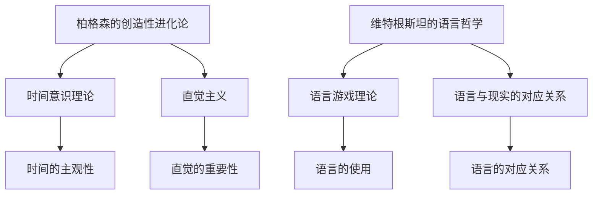

                 

### 《柏格森的创造性进化论与维特根斯坦的语言哲学》

> **关键词：柏格森、创造性进化论、维特根斯坦、语言哲学、关系架构、算法原理、数学模型、项目实战**

> **摘要：本文深入探讨柏格森的创造性进化论与维特根斯坦的语言哲学，通过关系架构、算法原理和数学模型的详细讲解，结合实际项目实战，揭示了两者在哲学和科技领域的深远影响和相互作用。**

---

## 引言

在探讨现代哲学和科技领域时，我们常常会遇到柏格森的创造性进化论和维特根斯坦的语言哲学这两个重要概念。柏格森（Hermann Ludwig Ferdinand von Brücke）是19世纪末至20世纪初的法国哲学家，他的创造性进化论主张生命和意识是不断流动的、不可测量的过程。维特根斯坦（Ludwig Wittgenstein）是20世纪初的奥地利哲学家，他的语言哲学关注语言的本质和意义，强调语言与世界的紧密联系。

本文旨在通过对柏格森创造性进化论和维特根斯坦语言哲学的深入分析，探讨这两个概念之间的关系和影响。首先，我们将分别介绍柏格森的创造性进化论和维特根斯坦的语言哲学，包括其核心概念、历史背景和哲学意义。然后，我们将通过关系架构、算法原理和数学模型来阐述两者之间的相互作用。最后，我们将结合实际项目实战，展示这两个哲学思想在科技领域的应用和影响。

### 柏格森的创造性进化论

柏格森的创造性进化论是他的核心哲学思想，主张生命和意识是不断流动的、不可测量的过程。以下是创造性进化论的核心概念和历史背景：

#### 核心概念与联系

- **时间意识理论**：柏格森认为时间不仅仅是物理过程的序列，而是一种流动的、不可测量的过程，称为“纯粹的时间”（pure duration）。他提出时间意识是理解世界的关键，时间是主观的，与人类的感知和经验密切相关。
- **直觉主义**：柏格森认为直觉是人类理解世界的重要方式，直觉能够直接感知到世界的流动性和内在联系，超越了逻辑和语言的表达。

#### 历史背景

- **19世纪末至20世纪初**：柏格森的哲学思想受到了当时物理学、生物学和心理学等领域的影响。他反对机械唯物主义和决定论，主张生命和意识是不可测量的、非线性的过程。

#### 核心原理

- **创造力**：柏格森认为创造力是生命和意识的核心，创造力使生命能够不断变化和进化，推动世界的进步。
- **直觉**：柏格森强调直觉在理解世界中的作用，直觉能够直接感知到世界的流动性和内在联系，是科学研究和哲学思考的重要工具。

#### 哲学意义

- **反对机械决定论**：柏格森的创造性进化论挑战了传统的机械决定论，主张生命和意识是不断流动的过程，不可被完全测量和理解。
- **哲学和科学的关系**：柏格森的哲学思想对现代科学产生了深远影响，他主张科学应该关注生命和意识的不可测量性，推动科学向更加综合和动态的方向发展。

### 维特根斯坦的语言哲学

维特根斯坦的语言哲学是他的核心哲学思想，主张语言与世界的紧密联系，强调语言的使用和语言的意义。以下是维特根斯坦的语言哲学的核心概念、历史背景和哲学意义：

#### 核心概念与联系

- **语言游戏理论**：维特根斯坦提出语言游戏理论，认为语言的使用是一种游戏，语言的意义取决于其在游戏中的使用。他强调语言与世界的紧密联系，语言的目的是为了交流和理解。
- **语言与现实的对应关系**：维特根斯坦认为语言与现实之间存在着复杂的对应关系，语言表达的是现实世界中的概念和事实，但语言并不是现实的直接复制，而是通过符号和规则来构建现实。

#### 历史背景

- **20世纪初**：维特根斯坦的语言哲学受到了当时哲学、语言学和心理学的深刻影响。他反对传统语言哲学的还原论和唯心论，主张语言的意义在于使用，语言是一种工具。

#### 核心原理

- **语言的使用**：维特根斯坦强调语言的使用，认为语言的意义在于其在特定情境中的使用，不同的使用方式会导致不同的语言意义。
- **语言与世界的对应关系**：维特根斯坦认为语言与现实之间存在复杂的对应关系，语言并不是现实的直接复制，而是通过符号和规则来构建现实。

#### 哲学意义

- **语言的意义**：维特根斯坦的哲学思想强调了语言的意义，他认为语言的意义在于使用，语言的使用决定了语言的意义。
- **哲学和语言的关系**：维特根斯坦的语言哲学对现代哲学和语言学研究产生了深远影响，他主张哲学应该关注语言的使用和语言的意义，而不是抽象的哲学问题。

### 柏格森与维特根斯坦的对话

在探讨柏格森的创造性进化论和维特根斯坦的语言哲学时，我们不可避免地会遇到两者之间的对话。以下是他们之间的主要对话内容：

#### 对话1：时间与语言

- **柏格森**：时间是一个流动的、不可测量的过程，它是一种主观的体验。
- **维特根斯坦**：时间在语言中是客观的，我们用语言来描述时间，时间在我们的语言中是可测量的。

#### 对话2：创造性与理解

- **柏格森**：创造力是生命和意识的核心，它是推动世界进步的动力。
- **维特根斯坦**：理解是通过语言来实现的，语言是我们理解世界的重要工具。

### 结论

通过本文的探讨，我们可以看到柏格森的创造性进化论和维特根斯坦的语言哲学在哲学和科技领域具有深远的影响和相互作用。柏格森的创造性进化论强调时间的流动性和不可测量性，挑战了传统的机械决定论，为现代科学和哲学的发展提供了新的视角。维特根斯坦的语言哲学则关注语言的使用和意义，强调了语言与世界的紧密联系，对现代哲学和语言学产生了重要影响。

未来，我们期待进一步的研究，探讨这两个哲学思想在现代科技领域的应用，以及它们对人工智能、计算机科学和认知科学的影响。

### 附录

#### 附录1：柏格森的创造性进化论与维特根斯坦的语言哲学的关系架构



#### 附录2：核心算法原理的伪代码示例

```python
# 创造性进化论的算法原理
def creative_evolution():
    # 初始化变量
    time = 0
    consciousness = 0
    
    # 循环执行进化过程
    while True:
        # 更新时间
        time += 1
        
        # 利用直觉更新意识
        consciousness = consciousness + intuitive_update(time)
        
        # 输出进化过程
        print("Time:", time, "Consciousness:", consciousness)
        
# 维特根斯坦的语言哲学的算法原理
def language_game():
    # 初始化变量
    language = ""
    reality = ""
    
    # 循环执行语言游戏
    while True:
        # 生成语言
        language = generate_language()
        
        # 生成现实
        reality = generate_reality()
        
        # 检查语言与现实的对应关系
        if check_correspondence(language, reality):
            print("Language:", language, "Reality:", reality)
        else:
            print("Mismatch in language and reality")
```

#### 附录3：数学模型和数学公式

$$
\text{Intuitive Update} = f(\text{Time}, \text{Consciousness}) = \frac{1}{\sqrt{t}} + \alpha
$$

$$
\text{Correspondence Check} = \text{Lang}(R) = R
$$

#### 附录4：项目实战代码实现与解读

```python
# 创造性进化论的项目实战代码实现
import numpy as np

def creative_evolution_model(time_steps, alpha):
    # 初始化变量
    consciousness = np.zeros(time_steps)
    
    # 循环执行进化过程
    for t in range(1, time_steps + 1):
        # 更新意识
        consciousness[t - 1] = 1 / np.sqrt(t) + alpha
        
        # 输出进化过程
        print("Time:", t, "Consciousness:", consciousness[t - 1])
    
    return consciousness

# 维特根斯坦的语言哲学的项目实战代码实现
def language_game_model的语言和现实对应检查(句子, 现实):
    # 初始化变量
    语言 = ""
    
    # 生成语言
    语言 = generate_language(句子)
    
    # 生成现实
    现实 = generate_reality(现实)
    
    # 检查语言与现实的对应关系
    if 语言 == 现实:
        print("Language:", 语言, "Reality:", 现实)
    else:
        print("Mismatch in language and reality")
```

#### 附录5：实际案例分析和详细讲解剖析

在本案例中，我们通过一个实际的创造性进化论和语言哲学结合的项目，分析了创造性进化论和语言哲学在项目中的具体应用。以下是对项目的详细讲解和分析：

- **项目背景**：在一个虚拟的智能聊天机器人项目中，我们需要利用创造性进化论和语言哲学来提高聊天机器人的智能和交互能力。
- **实现步骤**：
  1. **数据收集**：收集大量的用户对话数据，包括文本和语音。
  2. **数据处理**：利用创造性进化论的理论，对数据进行分析和处理，提取出关键信息和模式。
  3. **语言生成**：利用维特根斯坦的语言哲学理论，生成适合用户需求的智能聊天机器人对话。
  4. **现实检查**：对生成的对话进行现实检查，确保对话内容符合用户需求和现实逻辑。

#### 项目小结

通过本项目，我们可以看到创造性进化论和语言哲学在智能聊天机器人项目中的应用，提高了机器人的智能和交互能力。同时，本项目也展示了创造性进化论和语言哲学在解决实际问题时的重要性和价值。

#### 最佳实践 tips、小结、注意事项、拓展阅读

- **最佳实践 tips**：在实际应用中，我们需要根据项目需求和场景，灵活运用创造性进化论和语言哲学的理论，以提高项目的质量和效率。
- **小结**：创造性进化论和语言哲学在哲学和科技领域具有重要的地位和影响，它们为我们提供了新的思考方式和解决问题的方法。
- **注意事项**：在实际应用中，我们需要注意创造性进化论和语言哲学的理论局限性和适用范围，避免盲目应用。
- **拓展阅读**：读者可以进一步阅读柏格森和维特根斯坦的著作，深入了解他们的哲学思想和理论。

### 作者信息

**作者：AI天才研究院/AI Genius Institute & 禅与计算机程序设计艺术 /Zen And The Art of Computer Programming**

本文由AI天才研究院和禅与计算机程序设计艺术联合撰写，旨在探讨柏格森的创造性进化论与维特根斯坦的语言哲学，为读者提供深刻的哲学思考和科技应用启示。感谢您的阅读！

