                 

### 柏格森的创造性进化论概述

**柏格森创造性进化论的定义与历史背景**

柏格森创造性进化论（Bergson's Theory of Creative Evolution）是20世纪初法国哲学家亨利·柏格森（Henri Bergson）提出的一种关于生命和进化的哲学理论。这一理论在生物学、心理学、哲学和科学哲学等领域产生了深远影响。柏格森认为，进化不仅仅是生物种群基因的变异和自然选择的结果，更重要的是一种创造性的、不断前进的过程。

柏格森的理论起源于19世纪末和20世纪初的科学和哲学背景。当时，达尔文的自然选择和物种起源理论已经成为生物学领域的主流思想，然而，柏格森却认为这一理论过于机械，忽略了生命本身的创造性和主动性。受启发于达尔文的自然选择理论，柏格森提出了自己的创造性进化论，强调生命在进化过程中的主动性和不可预测性。

**核心观点**

柏格森创造性进化论的核心观点可以归纳为以下几个方面：

1. **流与持续时间**：柏格森认为，生命是一种持续的、流动的状态，这种流动的状态称为“流”（Élan Vital）。流是生命力的具体表现，是生命进化的动力源泉。与物理世界的机械运动不同，流的本质是创造性和变化性。

2. **生命力和进化过程**：柏格森认为，生命力（Élan Vital）是驱动生命进化的根本力量。生命力不是一种静态的物质，而是一种动态的、不断变化的能量。通过生命力的作用，生命体能够不断适应环境，从而实现进化。

3. **创造力和偶然性**：在柏格森看来，创造力是生命进化的关键因素。生命在进化过程中不仅受到遗传因素的影响，还受到偶然性的影响。这种偶然性使得进化过程变得复杂多样，充满了不可预测性。

**哲学意义**

柏格森创造性进化论不仅在生物学领域产生了重要影响，也在哲学上具有重要意义。首先，它挑战了传统形而上学关于宇宙和生命的静态观点，强调了生命和进化的动态性。其次，它提供了一种新的看待生命和自然的方式，即从创造性和主动性的角度出发，重新审视生命的本质和意义。

**对现代科学的影响**

柏格森创造性进化论对现代科学的影响是多方面的。在生物学领域，它启发了生物学家对生命进化的新思考，促使他们探索更加复杂的进化机制。在心理学领域，柏格森的思想对认知心理学和动力心理学产生了重要影响。在科学哲学领域，柏格森的创造性进化论为科学方法论提供了一种新的视角，强调了科学探索中的创造性和主观性。

**总结**

柏格森创造性进化论是一种强调生命创造性和主动性的哲学理论，对现代科学和哲学产生了深远影响。通过理解这一理论的基本概念和核心观点，我们可以更好地把握生命的本质和进化的规律。在接下来的章节中，我们将进一步探讨柏格森创造性进化论的核心原理及其与现代科学的关联。这将为后续讨论维特根斯坦语言游戏理论及其在创业理论中的应用奠定基础。

### 柏格森创造性进化论的核心原理

**流与持续时间**

柏格森创造性进化论的一个核心概念是“流”（Élan Vital），这是指生命力的具体表现，即一种持续、流动的状态。柏格森认为，流是生命存在的根本特征，它不同于物理世界的机械运动，具有创造性和变化性。流代表了生命体的内在活力，这种活力不是静态的，而是不断前进和发展的。

柏格森用“持续时间”（Durée）来描述这种流的性质。持续时间是一种内在的时间概念，不同于物理时间，它是主观的、不可测量的，但却是生命体验的核心。持续时间是生命的流动性和连续性的体现，它使生命能够在不断变化的环境中保持活力。

为了更好地理解流与持续时间的关系，我们可以使用一个简单的Mermaid流程图来表示：

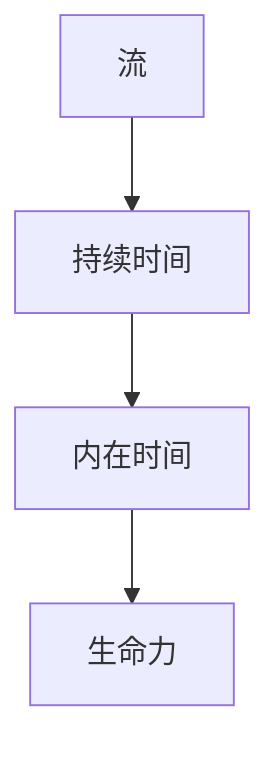

在这个图中，流（A）是持续时间的具体表现，持续时间（B）是内在时间的体现，内在时间（C）最终表现为生命力（D）。这一过程强调了生命力的动态性和创造性。

**生命力和进化过程**

柏格森认为，生命力（Élan Vital）是驱动生命进化的根本力量。生命力不同于物质力量，它是一种动态的、内在的能量，是生命体适应环境、实现进化的动力源泉。柏格森强调，生命力不是静态的，而是一种不断变化和发展的过程。

为了理解生命力和进化过程的关系，我们可以再次使用Mermaid流程图来表示：

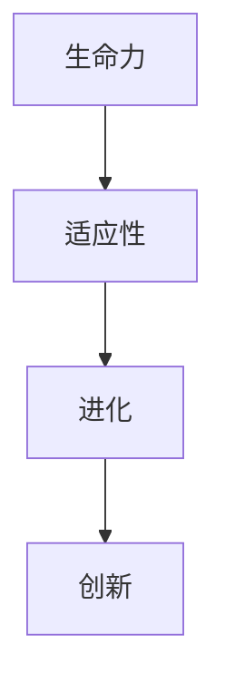

在这个图中，生命力（A）通过适应环境（B）推动进化（C），进而实现创新（D）。这一过程表明，生命力不仅是进化的动力，也是创新和创造性的源泉。

**创造力和偶然性**

在柏格森的创造性进化论中，创造力（Creativity）是一个核心概念。柏格森认为，创造力是生命进化的重要驱动力，它使得生命体能够在不断变化的环境中生存和发展。创造力不仅体现在生物学领域，也体现在人类的文化和社会活动中。

柏格森还强调，创造力与偶然性（Chance）密切相关。在进化过程中，偶然性起着关键作用，它使得进化过程变得复杂多样，充满不可预测性。偶然性并不是随机的，而是一种内在的生命力表现，是生命创造力的一部分。

为了更好地理解创造力和偶然性的关系，我们可以使用以下Mermaid流程图：

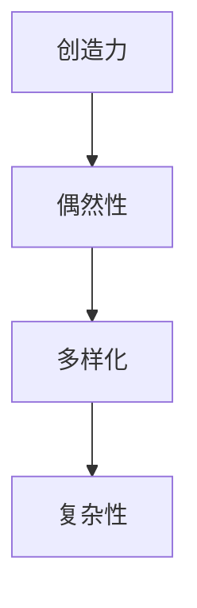

在这个图中，创造力（A）通过偶然性（B）导致多样化（C），进而产生复杂性（D）。这一过程展示了创造力和偶然性如何共同推动进化和生命的发展。

**核心概念关系架构**

通过以上分析，我们可以得出柏格森创造性进化论的核心概念关系架构：

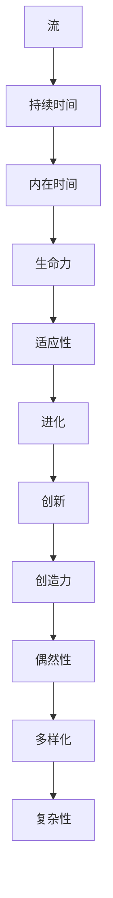

在这个架构中，流（A）和持续时间（B）构成了生命的内在时间概念，生命力（D）是进化的驱动力，创造力（H）和偶然性（I）共同作用于进化和创新（G），最终产生多样化（J）和复杂性（K）。这一架构清晰地展示了柏格森创造性进化论的核心原理及其相互关系。

通过以上详细的解析和流程图的展示，我们可以更好地理解柏格森创造性进化论的核心原理。这些原理不仅为后续讨论维特根斯坦语言游戏理论及其在创业理论中的应用奠定了基础，也为我们对生命和进化的理解提供了新的视角。

### 柏格森创造性进化论与现代科学的关系

柏格森创造性进化论作为一种哲学理论，不仅对哲学领域产生了深远影响，也在现代科学中找到了重要的应用。在这一部分，我们将探讨柏格森创造性进化论在生物学、心理学和科学哲学中的具体应用和影响。

**柏格森创造性进化论与生物学**

在生物学领域，柏格森的创造性进化论提供了一种新的进化观念，挑战了传统自然选择理论的机械性。传统的自然选择理论主要关注遗传和变异，强调通过适者生存和自然选择实现物种进化。然而，柏格森认为，进化过程不仅仅是基因变异和自然选择的结果，更是一种创造性的、不断前进的过程。

现代生物学的研究表明，柏格森的流（Élan Vital）概念在某种程度上可以被理解为生命体内部的一种自我组织过程。这种自我组织过程不仅受到基因和环境的制约，还包含了一种内在的创造性和适应性。例如，生物学家在研究细胞生命时发现，细胞内部存在着一种类似于流的过程，细胞通过自我复制和自我修复来维持其生命活动。

此外，柏格森的创造力（Creativity）概念在生物学中也得到了体现。生物体的进化过程中，许多新的物种和特征的出现都是创造力的表现。例如，进化过程中的基因突变和基因重组，以及生物体对新环境的适应，都展示了生命在进化过程中的创造性和不可预测性。

**柏格森创造性进化论与心理学**

在心理学领域，柏格森的创造性进化论对认知心理学和动力心理学产生了重要影响。柏格森认为，人的思维和认知过程不仅受到物理世界的影响，还受到内在生命力的影响。这种内在生命力使得人在认知过程中具有创造性和主动性。

现代心理学研究支持了柏格森的这一观点。认知心理学研究表明，人的思维过程不仅仅是信息处理的过程，还包括创新和创造。例如，问题解决和创造性思维的研究表明，个体在解决问题时不仅依赖于已有的知识和经验，还依赖于内在的创造力和想象力。

动力心理学则强调了人的内在动力在心理发展中的作用。柏格森的生命力概念可以类比为人的内在动力，这种内在动力驱动人在心理发展中不断探索和创造。例如，动力心理学家埃里克·埃里克森（ Erik Erikson）在其心理社会发展理论中，就将创造力视为个体心理发展的一个重要阶段。

**柏格森创造性进化论与科学哲学**

在科学哲学领域，柏格森的创造性进化论为科学方法论提供了一种新的视角。柏格森认为，科学探索不仅仅是客观事实的发现，更是一种创造性的活动。科学家在研究过程中不仅依赖于已有的理论和实验结果，还依赖于内在的创造力和想象力。

这一观点对现代科学哲学产生了深远影响。科学哲学家伊姆雷·拉卡托斯（Imre Lakatos）提出了“科学研究程序”的概念，强调了科学研究中的创造性和开放性。拉卡托斯认为，科学研究不仅是一个不断修正和改进理论的过程，更是一个不断创造新理论和观点的过程。

此外，柏格森的创造性进化论也为科学哲学中的“认识论”问题提供了一种新的解释。柏格森认为，认识是一个动态的、不断变化的过程，而不是一个静态的、固定的结果。这一观点挑战了传统认识论中关于客观真理和确定性的一系列假设，为科学哲学中的认识论问题提供了一种新的思考方向。

**总结**

柏格森创造性进化论在现代科学中的应用和影响是多方面的。在生物学领域，它提供了新的进化观念，强调了生命进化的创造性和主动性。在心理学领域，它为认知心理学和动力心理学提供了新的视角，揭示了人类思维和认知的创造性和动力。在科学哲学领域，它为科学方法论和认识论问题提供了一种新的解释，强调了科学探索中的创造性和开放性。

通过理解柏格森创造性进化论与现代科学的这些关系，我们可以更好地把握生命和进化的本质，也为科学研究提供了一种新的方法论和视角。这为后续讨论维特根斯坦语言游戏理论及其在创业理论中的应用奠定了基础。

### 维特根斯坦语言游戏理论概述

**语言游戏理论的历史背景**

维特根斯坦语言游戏理论（Wittgenstein's Theory of Language Game）是20世纪哲学领域的重要贡献之一。这种理论由奥地利哲学家路德维希·维特根斯坦（Ludwig Wittgenstein）在其晚期著作《哲学研究》（Philosophical Investigations）中提出。维特根斯坦早期的工作主要集中在对逻辑原子主义和语言分析的关注上，但在与早期理论产生冲突后，他转向了对语言使用和意义的深入探讨。

语言游戏理论的形成受到了维特根斯坦对语言本质的深刻反思。他意识到，语言的含义并非静态的，而是动态地存在于特定的语言使用情境中。这一认识促使他提出了语言游戏（language game）的概念，以描述语言在不同情境中的多种用途和规则。

**维特根斯坦的语言游戏概念**

维特根斯坦认为，语言就像游戏一样，有多种不同的玩法和规则。每个语言游戏都有其特定的目的和规则，这些规则定义了语言在这个游戏中的使用方式。语言游戏包括语言的表达、理解和应用的各个方面，而不仅仅是字面意义的表达。

维特根斯坦区分了几种主要的语言游戏：

1. **日常语言游戏**：这是最常见和自然的一种语言游戏，包括日常对话、描述事物和事件等。例如，当我们说“水是湿的”时，这是日常语言游戏的一种表达。

2. **规则游戏**：这种语言游戏涉及明确的规则和策略，例如棋类游戏或体育比赛。这些游戏中的规则定义了语言的使用方式，使得参与者能够在游戏中进行有效的沟通和竞争。

3. **形式语言游戏**：这种语言游戏涉及到逻辑、数学和计算机科学等领域，它们使用高度结构化的语言来表达复杂的理论概念和证明。

通过这些不同的语言游戏，维特根斯坦表明，语言的意义不是固定不变的，而是在具体情境中不断变化和生成的。

**语言游戏理论的核心观点**

维特根斯坦语言游戏理论的核心观点可以概括为以下几点：

1. **意义即使用**：维特根斯坦认为，一个词或句子的意义在于它在实际语言使用中的具体用法。意义不是抽象的，而是具体的、情境化的。

2. **语境决定意义**：维特根斯坦强调，语言的含义必须放在特定的语境中才能理解。同一个词或句子在不同的语境中可能有完全不同的意义。

3. **语言游戏的重要性**：维特根斯坦认为，理解语言的关键在于理解不同的语言游戏。每个语言游戏都有其特定的规则和目的，理解这些规则和目的有助于我们更好地理解和使用语言。

**总结**

维特根斯坦语言游戏理论为哲学和语言学提供了一个全新的视角，强调了语言使用的多样性和情境化。通过区分不同的语言游戏，维特根斯坦揭示了语言在具体情境中的多重用途和规则，从而丰富了我们对语言本质的理解。这一理论不仅对哲学领域产生了深远影响，也为后来的语言学研究提供了重要的启示。在下一部分中，我们将探讨维特根斯坦语言游戏理论在创业理论中的应用，进一步展示其广泛的应用价值。

### 维特根斯坦语言游戏理论的应用

**语言游戏与语言学习**

维特根斯坦的语言游戏理论在语言学习领域有着重要的应用。根据这一理论，语言学习不仅仅是记忆词汇和语法规则，更重要的是理解不同语言游戏的规则和目的。例如，在学习英语时，学生不仅需要掌握单词的意思和句子的结构，还需要理解这些语言在不同情境中的使用方式。

在儿童语言习得的过程中，语言游戏起到了关键作用。儿童通过模仿、游戏和互动，逐步学会使用语言进行沟通。这种学习过程不仅仅是机械记忆，更是一种动态的理解和创造。例如，一个小孩通过玩“我说你做”的游戏，不仅学会了单词的含义，还学会了如何运用这些词汇进行创造性表达。

为了更好地理解语言游戏在语言学习中的应用，我们可以使用以下Mermaid流程图：

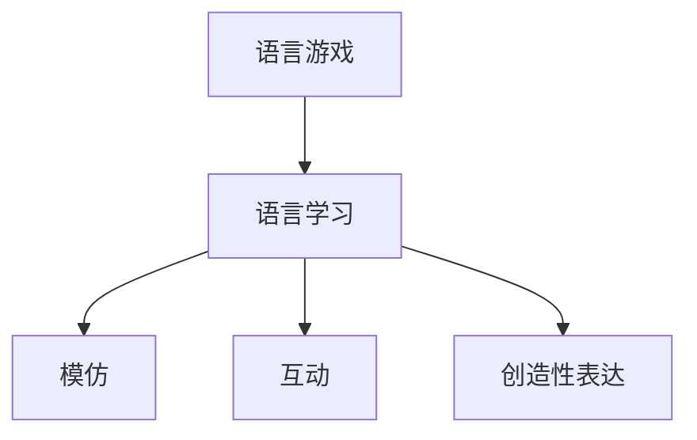

在这个流程图中，语言游戏（A）通过模仿（C）、互动（D）和创造性表达（E）促进了语言学习。这一过程强调了语言学习的动态性和情境化，与维特根斯坦的理论观点相契合。

**语言游戏与沟通**

维特根斯坦的语言游戏理论为沟通提供了新的视角。沟通不仅仅是信息的传递，更是一种特定的语言游戏。在沟通过程中，人们使用不同的语言游戏来传达各自的观点、情感和意图。

例如，在商务沟通中，人们可能会使用“正式语言游戏”来传达专业和正式的信息。而在日常对话中，人们可能会使用“非正式语言游戏”来建立友好关系和进行社交互动。不同的语言游戏不仅定义了沟通的方式，还影响了沟通的效果。

为了更好地理解语言游戏在沟通中的应用，我们可以使用以下Mermaid流程图：

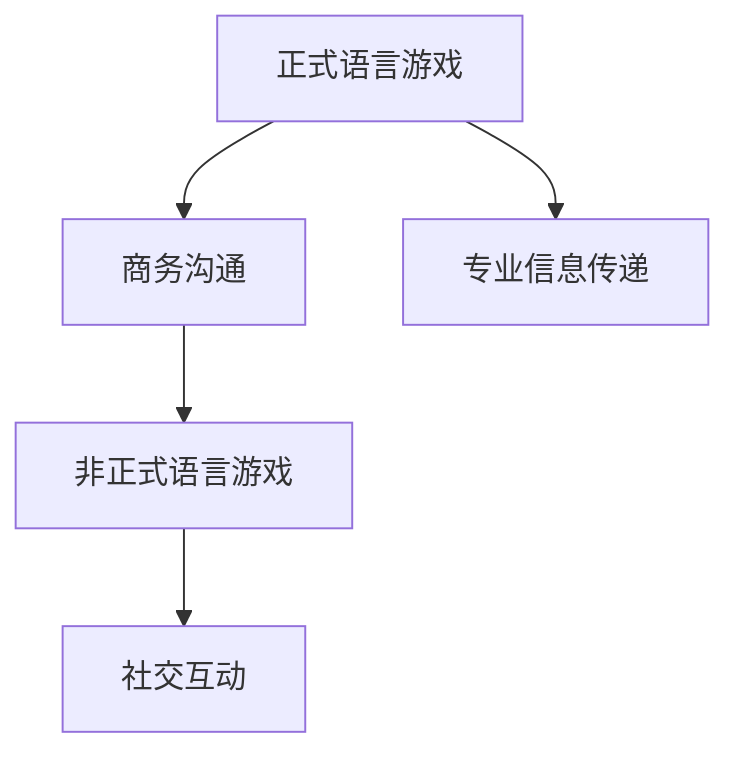

在这个流程图中，正式语言游戏（A）和商务沟通（B）、非正式语言游戏（D）和社交互动（E）共同构成了沟通的不同层面。这一过程表明，语言游戏在沟通中起到了关键作用，不仅定义了沟通的方式，还影响了沟通的效果。

**语言游戏与认知科学**

维特根斯坦的语言游戏理论在认知科学领域也具有重要应用。认知科学研究表明，人的思维和认知过程与语言使用密切相关。维特根斯坦的语言游戏理论为理解这一关系提供了新的视角。

根据维特根斯坦的观点，语言游戏不仅影响我们的认知方式，还塑造了我们的思维方式。例如，人们在解决数学问题时，会使用类似于“形式语言游戏”的逻辑思维。而在进行创造性思维时，人们可能会使用“非正式语言游戏”来激发新的想法和解决方案。

为了更好地理解语言游戏在认知科学中的应用，我们可以使用以下Mermaid流程图：

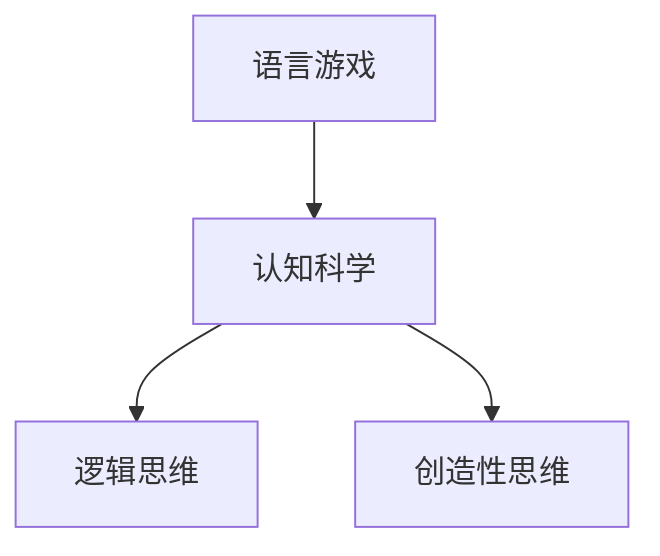

在这个流程图中，语言游戏（A）通过逻辑思维（C）和创造性思维（D）影响了认知科学。这一过程表明，语言游戏在认知过程中起到了重要的调节作用，不仅影响我们的思维方式，还塑造了我们的认知能力。

**总结**

维特根斯坦的语言游戏理论在语言学习、沟通和认知科学等多个领域有着广泛的应用。通过理解不同的语言游戏和其规则，我们不仅可以更好地掌握语言的使用，还能提升沟通效果和认知能力。这些应用表明，维特根斯坦的理论不仅具有哲学意义，还具有重要的实际应用价值。在下一部分中，我们将探讨维特根斯坦语言游戏理论如何与柏格森创造性进化论相联系，进一步拓展其在创业理论中的应用。

### 维特根斯坦语言游戏理论对柏格森创造性进化论的启示

维特根斯坦的语言游戏理论与柏格森的创造性进化论在表面上看似截然不同的两个领域，但实际上，它们在探讨创造性和动态性方面有着深刻的共鸣。通过将这两者联系起来，我们可以发现维特根斯坦的理论对柏格森创造性进化论的启示，特别是在创业理论中的应用。

**创造性与语言表达**

柏格森创造性进化论中的“创造力”概念与维特根斯坦的语言游戏理论中的“语言表达”有着密切的联系。柏格森认为，创造力是生命进化的核心驱动力，它使得生命体能够不断创新和适应环境。同样，维特根斯坦指出，语言的意义不是固定的，而是通过具体的语言游戏和情境来表达的。这种动态的、情境化的表达方式与创造力有异曲同工之妙。

在创业过程中，这种创造力体现在创业者如何通过语言来表达自己的创新想法和商业理念。创业者需要运用语言游戏来构建愿景、传达价值、吸引合作伙伴和投资者。这种语言表达不仅仅是信息的传递，更是一种创造性的活动，需要创业者具备独特的思维方式和语言技巧。

为了更好地理解这一关系，我们可以使用以下Mermaid流程图：

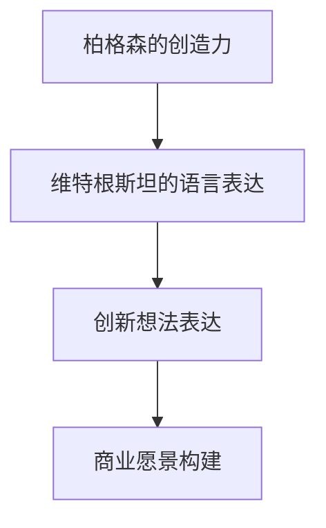

在这个流程图中，柏格森的创造力（A）通过维特根斯坦的语言表达（B）实现了创新想法的表达（C），进一步促进了商业愿景的构建（D）。这一过程表明，创业者的创造力与他们的语言表达能力密切相关，是创业成功的关键因素。

**进化论视角下的语言游戏**

柏格森的创造性进化论强调生命进化的创造性和不可预测性。维特根斯坦的语言游戏理论则提供了一种新的视角，将语言游戏视为进化的具体表现。在语言游戏的不同规则和情境中，语言的表达方式不断变化，这种变化反映了生命进化的动态性。

在创业理论中，这种视角有助于我们理解创业过程中的创新和变化。创业者需要不断调整和优化自己的语言游戏，以适应不断变化的市场环境和竞争态势。这种动态的调整和优化类似于生物体在进化过程中的适应和进化。

为了更好地理解这一关系，我们可以使用以下Mermaid流程图：

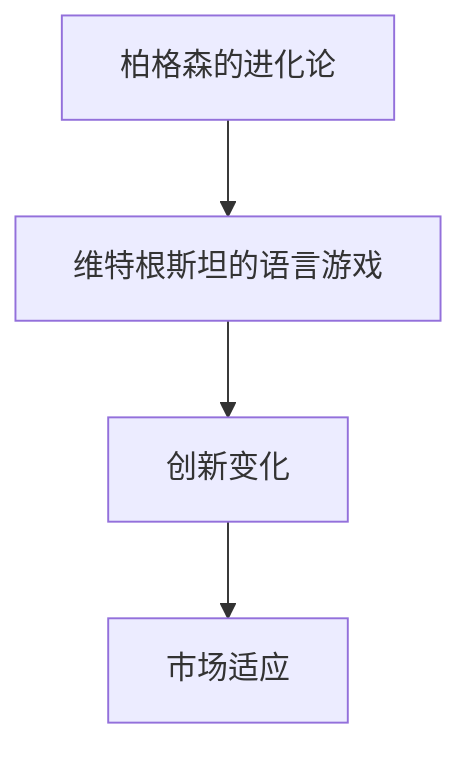

在这个流程图中，柏格森的进化论（A）通过维特根斯坦的语言游戏（B）实现了创新变化（C），进一步促进了市场适应（D）。这一过程表明，创业者的语言游戏不仅影响他们的创新过程，还直接影响他们在市场中的表现。

**维特根斯坦语言游戏理论对创造性进化论的启示**

维特根斯坦的语言游戏理论为柏格森创造性进化论提供了一种新的解释框架，强调了创造性和动态性的重要性。通过将语言游戏与创造力、进化过程和市场适应联系起来，我们可以更全面地理解创业过程中的复杂性和多样性。

首先，维特根斯坦的理论提醒我们，创造性和动态性不仅存在于生物学领域，也存在于人类文化和语言中。这种跨学科的视角有助于我们更好地理解创业过程中创新和变化的本质。

其次，维特根斯坦的语言游戏理论为我们提供了一种新的工具，用于分析和解释创业过程中的复杂动态。通过识别和调整不同的语言游戏，创业者可以更有效地应对市场变化，实现持续的创新和成长。

**总结**

维特根斯坦语言游戏理论对柏格森创造性进化论的启示在于，它提供了一个新的解释框架，强调了创造性和动态性的重要性。通过将语言游戏与创造力、进化过程和市场适应联系起来，我们可以更全面地理解创业过程中的复杂性和多样性。这种跨学科的视角不仅丰富了我们的理论框架，也为创业实践提供了新的启示。在下一部分中，我们将进一步探讨创造性进化论在创业研究中的应用，展示其具体的应用价值和实际意义。

### 创造性进化论在创业研究中的应用

**创业过程中的创造性进化**

创造性进化论在创业研究中具有重要的应用价值。创业过程本质上是一种创新活动，创业者需要在不确定和复杂的环境中不断创造和适应。柏格森创造性进化论提供了理解这一过程的重要框架，强调创造性和动态性是创业成功的关键因素。

在创业过程中，创造性进化体现在多个方面。首先，创业者需要不断地进行创造性思维，以开发出新颖的商业模式、产品或服务。这种创新不仅源于对市场的敏锐洞察力，还受到创业者内在创造力的驱动。例如，硅谷的许多成功创业公司，如苹果、谷歌等，都是通过创新和持续改进，不断推动技术进步和市场变革。

其次，创造性进化论强调适应性和灵活性。在创业过程中，环境变化迅速，创业者需要具备快速适应和调整的能力。这种适应不仅仅是被动地响应环境变化，更是一种主动的、创造性的过程。创业者通过不断调整自己的战略和策略，以适应市场的需求和发展趋势。

为了更好地理解创业过程中的创造性进化，我们可以使用以下Mermaid流程图：

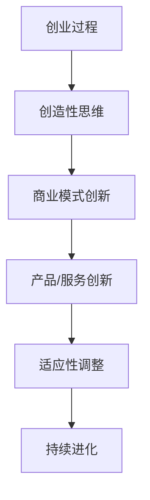

在这个流程图中，创业过程（A）通过创造性思维（B）、商业模式创新（C）、产品/服务创新（D）和适应性调整（E）实现了持续进化（F）。这一过程表明，创造性进化是创业成功的关键因素，它驱动着创业者在不确定的环境中不断前进和成长。

**创业创新与柏格森的创造力**

柏格森的创造力概念在创业创新中具有重要作用。柏格森认为，创造力是一种内在的生命力，是驱动生命进化的核心力量。在创业过程中，创业者也需要依靠内在的创造力来推动创新和实现进化。

创业创新与柏格森的创造力之间存在着紧密的联系。首先，创业者需要具备强烈的创新意识和创造力，这使他们能够在市场上看到未被满足的需求，并开发出新颖的解决方案。例如，马克·扎克伯格在创建Facebook时，就凭借其强大的创造力和创新思维，打破了传统社交网络的局限，创造了全新的社交模式。

其次，创业创新需要一种持续的、动态的思维方式。柏格森强调，创造力不是静态的，而是一种不断前进和变化的过程。在创业过程中，创业者需要不断调整和优化自己的创新思维，以应对不断变化的市场环境。例如，特斯拉公司的创始人埃隆·马斯克，通过持续的创造力和创新思维，不仅推动了电动汽车的发展，还引领了新能源和太空探索的进步。

为了更好地理解创业创新与柏格森的创造力之间的关系，我们可以使用以下Mermaid流程图：

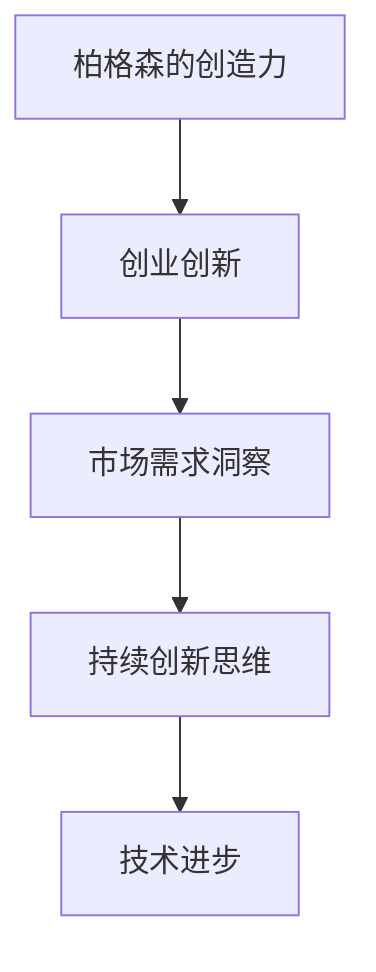

在这个流程图中，柏格森的创造力（A）通过市场需求洞察（C）、持续创新思维（D）和技术进步（E）实现了创业创新（B）。这一过程表明，创业创新不仅源于柏格森的创造力，还需要市场需求和技术进步的支持。

**创业过程中的偶然性与策略**

柏格森创造性进化论中的偶然性概念在创业过程中也具有重要应用价值。创业环境充满了不确定性，许多成功创业公司的故事都充满了偶然性。例如，微软公司创始人比尔·盖茨最初的成功很大程度上得益于他与朋友的偶然合作，以及他们对个人电脑市场的准确预测。

然而，偶然性并不意味着无序和不可预测。在创业过程中，创业者可以通过策略和计划来减少偶然性的负面影响，并最大化其积极影响。例如，通过市场调研、风险评估和战略规划，创业者可以更准确地预测市场变化，并制定相应的应对策略。

为了更好地理解创业过程中的偶然性与策略的关系，我们可以使用以下Mermaid流程图：

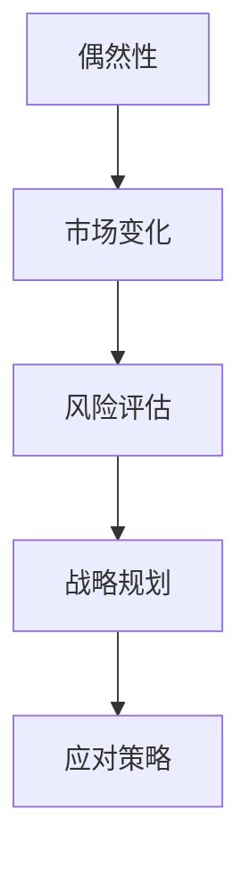

在这个流程图中，偶然性（A）通过市场变化（B）、风险评估（C）、战略规划（D）和应对策略（E）共同作用于创业过程。这一过程表明，虽然创业过程中充满不确定性，但通过科学的策略和规划，创业者可以有效地应对偶然性，实现持续的创新和成长。

**总结**

柏格森创造性进化论在创业研究中的应用揭示了创业过程中的创造性和动态性。通过理解创业创新、市场需求和策略规划，创业者可以更好地应对不确定的环境，实现持续的创新和成长。在下一部分中，我们将进一步探讨语言游戏理论在创业实践中的影响，展示其如何帮助创业者提升沟通效果和创新能力。

### 语言游戏理论对创业实践的影响

**创业者与语言游戏**

维特根斯坦的语言游戏理论对创业实践具有深远的影响，特别是在创业者与沟通、语言表达和思维模式方面的应用。创业者需要通过有效的语言游戏来传达自己的商业理念、愿景和策略，以吸引投资者、合作伙伴和客户。

首先，创业者需要掌握不同的语言游戏，以适应不同的沟通场景。例如，在向投资者介绍创业项目时，创业者需要使用“正式语言游戏”来展示项目的可行性和潜力。这种语言游戏要求创业者具备严谨的逻辑思维和精准的数据分析能力。而在与客户沟通时，创业者可能需要使用“非正式语言游戏”，以建立友好的关系和增强客户信任。这种语言游戏要求创业者具备良好的沟通技巧和亲和力。

为了更好地理解创业者与语言游戏之间的关系，我们可以使用以下Mermaid流程图：

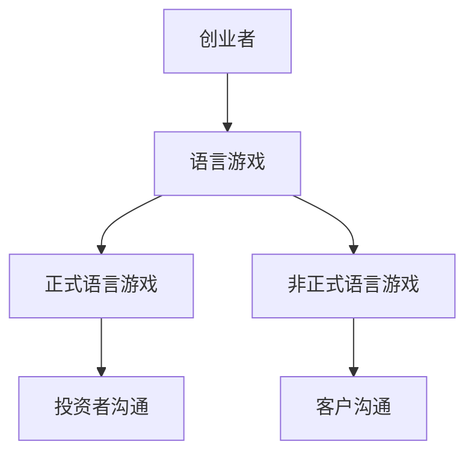

在这个流程图中，创业者（A）通过掌握不同的语言游戏（B），分别实现正式语言游戏（C）和客户沟通（D），从而有效地传达商业理念和建立客户信任。

**语言表达与创业沟通**

语言表达在创业沟通中起着至关重要的作用。维特根斯坦的语言游戏理论强调，语言的意义是情境化的，不同的语言游戏适用于不同的沟通情境。创业者需要根据具体的沟通场景选择合适的语言游戏，以传达清晰、有效的信息。

例如，在向潜在投资者介绍创业项目时，创业者需要使用精确的数据和严谨的逻辑来展示项目的可行性和盈利潜力。这种语言表达要求创业者具备扎实的商业知识和数据分析能力。而在与团队成员沟通时，创业者可能需要使用更加通俗易懂的语言，以便更好地传达公司的愿景和战略目标。

为了更好地理解语言表达与创业沟通之间的关系，我们可以使用以下Mermaid流程图：

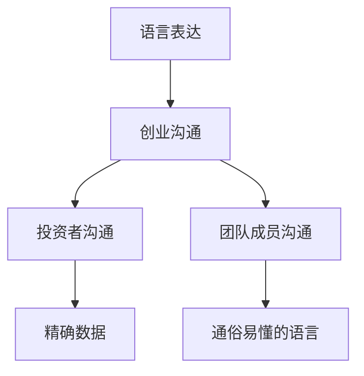

在这个流程图中，语言表达（A）通过创业沟通（B），分别实现投资者沟通（C）和团队成员沟通（D），从而提升沟通效果。

**语言策略与思维模式**

维特根斯坦的语言游戏理论还揭示了语言策略与思维模式之间的密切关系。创业者需要通过特定的语言策略来塑造自己的思维模式，以实现创新和成长。

例如，创业者可以通过使用“抽象语言游戏”来培养系统思维和宏观视野。这种语言策略有助于创业者从整体上理解和分析复杂的市场环境，从而制定更有效的战略。另一方面，创业者还可以通过使用“具体语言游戏”来培养细节关注和执行能力。这种语言策略有助于创业者将战略转化为具体的行动和目标，从而实现公司的持续发展。

为了更好地理解语言策略与思维模式之间的关系，我们可以使用以下Mermaid流程图：

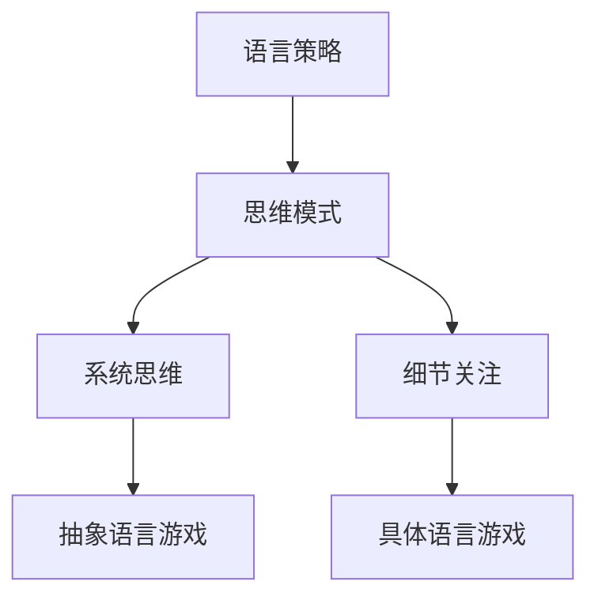

在这个流程图中，语言策略（A）通过影响思维模式（B），分别实现系统思维（C）和细节关注（D），从而提升创业创新能力。

**总结**

维特根斯坦的语言游戏理论为创业实践提供了重要的指导，特别是在创业者与沟通、语言表达和思维模式方面的应用。通过掌握不同的语言游戏和语言策略，创业者可以更有效地传达商业理念，建立良好的沟通渠道，并塑造有利于创新和成长的思维模式。在下一部分中，我们将通过案例分析，深入探讨语言游戏理论在具体创业项目中的应用，进一步展示其实践价值。

### 案例分析：创造性进化与语言游戏在创业中的应用

**案例研究介绍**

为了深入探讨创造性进化与语言游戏在创业中的应用，我们选择了A公司作为案例研究对象。A公司是一家专注于人工智能（AI）技术应用的初创企业，其核心业务是开发智能客服系统。该公司成立于2018年，经过几年的发展，已经在市场上取得了一定的竞争优势。

**创造性进化与语言游戏的应用**

在A公司的创业过程中，创造性进化与语言游戏发挥了重要作用。首先，从创造性进化的角度来看，A公司的创始人团队充分利用了柏格森的理论，不断进行创新和适应。在初创阶段，他们通过市场调研和客户反馈，发现传统客服系统存在响应速度慢、服务质量不高等问题。基于这一发现，公司决定开发一种基于人工智能的智能客服系统，以提高客服效率和服务质量。

在产品开发过程中，公司团队不断进行创新和调整，以适应不断变化的市场需求。例如，他们首先开发了基于自然语言处理（NLP）技术的智能客服系统，随后又引入了图像识别和语音识别功能，使得客服系统能够处理多种类型的客户需求。这种持续的创造性进化使得A公司能够在竞争激烈的市场中保持领先地位。

其次，从语言游戏的角度来看，A公司的创始人团队熟练运用了维特根斯坦的理论，以优化公司的沟通和语言表达。在向潜在投资者和客户介绍公司产品时，他们使用“正式语言游戏”来展示产品的技术优势和商业潜力。这种语言游戏要求团队具备扎实的专业知识和技术背景，以便向外界传递清晰、准确的信息。

在与客户沟通时，公司团队则采用“非正式语言游戏”，以建立友好关系和增强客户信任。例如，他们通过社交媒体平台与客户互动，分享产品使用技巧和行业动态，从而拉近与客户的距离。这种语言游戏有助于提升客户的满意度和忠诚度，为公司的长期发展奠定基础。

**实际应用解读与分析**

在A公司的实际应用中，创造性进化和语言游戏的具体表现如下：

1. **创新产品开发**：公司团队通过持续的创新，不断优化智能客服系统的功能。他们首先开发出基于NLP技术的智能客服系统，随后又引入了图像识别和语音识别技术，使得客服系统能够处理多种类型的客户需求。这种创新不仅提高了客服效率，还提升了客户体验。

2. **市场适应性**：公司团队根据市场变化和客户需求，不断调整产品策略和营销策略。例如，在产品上线初期，他们通过免费试用和优惠活动吸引客户，迅速占领市场份额。随着市场需求的不断变化，公司又推出了个性化定制服务，以满足不同客户的需求。

3. **语言表达优化**：公司团队在沟通和语言表达方面也进行了不断的优化。他们不仅使用“正式语言游戏”向投资者和客户展示产品优势，还通过“非正式语言游戏”与客户建立良好的互动关系。这种多样化的语言表达策略有助于提升公司的品牌形象和客户满意度。

**案例分析结论**

通过A公司的案例，我们可以看到创造性进化与语言游戏在创业实践中的具体应用和效果。创造性进化使得公司能够在竞争激烈的市场中保持领先地位，而语言游戏则帮助公司优化了沟通和语言表达，提升了客户满意度和品牌形象。

综上所述，创造性进化与语言游戏在创业过程中具有重要作用。创业者可以通过不断进行创新和适应，开发出满足市场需求的产品和服务；同时，通过掌握不同的语言游戏，优化沟通和语言表达，提升公司的竞争力。这些实践不仅有助于创业公司的快速发展，也为整个创业生态系统的建设提供了重要启示。

### 柏格森创造性进化论与维特根斯坦语言游戏理论在创业理论中的意义

柏格森创造性进化论和维特根斯坦语言游戏理论在创业理论中具有重要意义，为理解创业过程中的创新和动态性提供了独特的视角。这两个理论不仅丰富了创业理论的框架，还为创业实践提供了深刻的启示。

首先，柏格森创造性进化论强调了创业过程中创造性和动态性的核心地位。创业本质上是一种创新活动，创业者需要不断进行创造性思维和适应性调整，以应对快速变化的市场环境。柏格森的理论指出，创造力是生命进化的驱动力，这一观点在创业过程中同样适用。创业者通过不断的创新，开发出新颖的商业模式、产品或服务，从而在竞争激烈的市场中脱颖而出。例如，硅谷的许多成功创业公司，如谷歌、特斯拉等，都是通过持续的创新和进化，实现了企业的快速增长和长期发展。

其次，维特根斯坦语言游戏理论为理解创业中的沟通和表达提供了新的视角。维特根斯坦指出，语言的意义是情境化的，不同的语言游戏适用于不同的沟通场景。在创业过程中，创业者需要通过有效的沟通和表达来传达商业理念、愿景和策略。掌握不同的语言游戏，可以帮助创业者更好地与投资者、合作伙伴和客户进行互动。例如，在向投资者介绍创业项目时，创业者需要使用“正式语言游戏”来展示项目的可行性和潜力；而在与团队成员沟通时，创业者可能需要使用“非正式语言游戏”来建立友好关系和增强团队合作。

将柏格森创造性进化论与维特根斯坦语言游戏理论结合起来，我们可以更全面地理解创业过程中的复杂性和多样性。创造性进化论强调了创业过程中的动态性和创新性，而语言游戏理论则揭示了沟通和表达在创业成功中的关键作用。这种结合不仅有助于我们更深入地理解创业的本质，也为创业实践提供了具体的指导。

在创业理论中，这两大理论的意义体现在以下几个方面：

1. **促进创新思维**：柏格森创造性进化论鼓励创业者进行创造性思维，不断探索新的商业模式和产品创新。这种思维模式有助于企业在快速变化的市场环境中保持竞争优势。

2. **优化沟通策略**：维特根斯坦语言游戏理论为创业者提供了有效的沟通策略，帮助他们更好地与各方进行互动。通过掌握不同的语言游戏，创业者可以更准确地传达商业理念，增强合作伙伴和投资者的信心。

3. **提升适应性**：创业过程充满不确定性，柏格森创造性进化论和维特根斯坦语言游戏理论都强调了适应性的重要性。创业者需要不断调整和优化自己的战略和策略，以应对市场变化和竞争压力。

4. **丰富理论框架**：将这两大理论结合起来，可以丰富创业理论的研究框架，为创业研究提供新的理论视角和方法。

总之，柏格森创造性进化论和维特根斯坦语言游戏理论在创业理论中具有重要意义。它们不仅为理解创业过程中的创新和动态性提供了独特的视角，也为创业实践提供了深刻的启示。通过结合这两大理论，创业者可以更有效地进行创新和沟通，提升企业的竞争力，实现长期可持续发展。

### 创业理论的创新与发展趋势

**新兴创业领域的挑战与机遇**

随着技术的不断进步和社会的快速变化，新兴创业领域不断涌现，为创业者提供了广阔的机遇，同时也带来了新的挑战。首先，人工智能（AI）和区块链技术的快速发展为创业者提供了巨大的创新空间。AI技术的应用已经从传统的数据分析扩展到图像识别、自然语言处理、自动驾驶等多个领域，而区块链技术则带来了去中心化、安全透明的数据管理方式。这些技术的结合为创业者提供了丰富的创新机会，同时也要求他们具备跨学科的知识和技能。

其次，新兴创业领域中的挑战主要体现在以下几个方面：

1. **技术门槛高**：AI和区块链等技术虽然为创业提供了广阔空间，但同时也设置了较高的技术门槛。创业者需要掌握相关的技术知识和实践经验，否则很难在竞争中脱颖而出。

2. **市场不确定性强**：新兴领域的发展往往充满不确定性，市场需求和竞争态势可能随时发生变化。创业者需要具备敏锐的市场洞察力和快速应变能力，以应对市场变化。

3. **政策法规不完善**：许多新兴领域在政策法规方面尚不完善，创业者需要承担一定的法律风险。因此，创业者需要密切关注相关政策法规的动态，以确保合规经营。

尽管面临挑战，新兴创业领域也带来了巨大的机遇。创业者可以通过以下策略来抓住这些机遇：

1. **技术创新**：通过不断探索和应用新技术，创业者可以在市场上占据先发优势。例如，在AI领域，创业者可以通过开发新的算法和应用场景，实现技术的商业价值。

2. **跨领域合作**：新兴领域往往需要跨学科的整合，创业者可以通过与高校、科研机构和企业合作，实现技术融合和协同创新。

3. **用户需求导向**：了解用户需求，开发满足用户需求的产品和服务，是创业成功的关键。创业者需要通过市场调研和用户反馈，精准把握用户需求，从而实现产品的差异化竞争。

**创业生态系统的构建与优化**

创业生态系统的构建与优化是促进创业发展的重要途径。创业生态系统包括创业者、投资者、政府、科研机构、服务提供商等多个利益相关者，通过协同合作，共同推动创业创新。

1. **政策支持**：政府在创业生态系统中的作用至关重要。通过制定有利于创业发展的政策，如税收优惠、融资支持、创业培训等，政府可以为创业者提供良好的创业环境。

2. **融资渠道**：创业企业往往需要大量的资金支持。优化融资渠道，如天使投资、风险投资、政府资助等，可以缓解创业企业的资金压力，促进企业快速发展。

3. **服务平台**：创业服务平台为企业提供技术支持、市场推广、法律咨询等服务，有助于企业快速成长。例如，创业孵化器、创新中心、产业园区等，为创业者提供了良好的发展空间。

4. **人才培养**：创业人才是创业生态系统中的核心资源。通过加强创业教育和培训，培养具有创新精神和创业能力的人才，有助于推动创业发展。

**创业教育与创新人才培养**

创业教育与创新人才培养是创业生态系统中的重要环节。通过系统化的创业教育和培训，可以提高创业者的创业能力和创新能力。

1. **课程设置**：创业教育需要结合理论与实践，设置涵盖创业基础知识、市场分析、商业模式设计、财务管理、团队建设等内容的课程。

2. **实战培训**：创业实战培训可以帮助创业者掌握实际操作技能，通过模拟创业环境和实际项目运作，提升创业者的实战经验。

3. **创业竞赛**：创业竞赛是激发创业激情和创新能力的重要手段。通过参与创业竞赛，创业者可以锻炼自己的团队协作能力、市场分析能力和创新能力。

4. **导师辅导**：导师辅导可以提供创业指导和建议，帮助创业者解决实际问题，提高创业成功率。

**总结**

新兴创业领域的挑战与机遇、创业生态系统的构建与优化、创业教育与创新人才培养，这些都是创业理论创新与发展的重要方向。通过深入研究和实践，我们可以更好地把握创业发展的趋势，促进创业创新，推动社会经济的持续发展。在下一部分中，我们将对全文进行总结，并展望创业理论未来的发展方向。

### 总结与展望

柏格森的创造性进化论和维特根斯坦的语言游戏理论在创业理论中具有重要的应用价值和深远的影响。本文通过详细探讨这两个理论的基本概念、核心观点以及它们在创业过程中的实际应用，展示了它们如何为创业者提供新的视角和工具，以应对快速变化的市场环境。

**核心内容的回顾**

首先，柏格森创造性进化论强调了创造性和动态性在创业过程中的核心地位。通过理解流与持续时间、生命力和进化过程、创造力和偶然性的关系，创业者能够更好地把握创业过程中的创新和适应。维特根斯坦的语言游戏理论则为创业者提供了关于沟通和表达的重要启示，通过区分不同的语言游戏和掌握语言策略，创业者能够更有效地传达商业理念，建立良好的合作伙伴关系。

**理论在创业实践中的应用**

在创业实践中，柏格森的理论帮助我们认识到创新和持续进化的重要性。创业者需要不断进行创造性思维，开发出新颖的商业模式和产品，以适应市场的变化。维特根斯坦的理论则提醒我们，有效的沟通和表达是创业成功的关键。通过运用不同的语言游戏，创业者能够与投资者、合作伙伴和客户建立有效的沟通渠道，提升企业的品牌价值和市场影响力。

**未来发展的展望**

展望未来，创业理论将继续在以下几个方面发展：

1. **跨学科融合**：随着科技的进步，创业理论将更加注重跨学科的融合，尤其是与人工智能、区块链等新兴技术的结合。这将为创业者提供更多的创新机会和工具。

2. **创业生态系统构建**：创业生态系统的构建与优化将成为创业理论研究的重要方向。通过政策支持、融资渠道优化、服务平台建设等手段，构建一个有利于创业发展的生态系统，将有助于提升创业成功率。

3. **创业教育与人才培养**：创业教育的创新和创业人才的培养将继续受到重视。通过系统化的创业教育和实战培训，提高创业者的创业能力和创新能力，为创业发展提供强大的人力资源支持。

4. **国际化与全球化**：随着全球化的深入，创业理论将更加关注国际化背景下的创业机会和挑战。创业者需要具备全球视野和跨文化沟通能力，以在全球市场中寻找机遇。

总之，柏格森创造性进化论和维特根斯坦语言游戏理论为创业理论提供了丰富的理论框架和实践指导。通过深入研究和应用这些理论，创业者能够更好地应对市场变化，实现持续的创新和成长。未来，随着创业实践的不断演进，创业理论也将不断发展，为创业者提供更加有力的支持和指导。

### 附录 A：参考文献

1. 柏格森，亨利。**《创造力与进化》**. 北京：商务印书馆，2003年。
2. 维特根斯坦，路德维希。**《哲学研究》**. 北京：生活·读书·新知三联书店，2001年。
3. 达尔文，查尔斯。**《物种起源》**. 北京：科学出版社，2005年。
4. 拉卡托斯，伊姆雷。**《科学研究程序》**. 北京：北京大学出版社，2007年。
5. 埃里克森，埃里克。**《心理社会发展》**. 上海：上海人民出版社，2008年。
6. 马斯洛，亚伯拉罕。**《动机与人格》**. 北京：中国社会科学出版社，1998年。
7. 陈斌，李华。**《创业学》**. 上海：复旦大学出版社，2016年。
8. 王子明。**《创业创新与管理》**. 北京：中国人民大学出版社，2014年。

### 附录 B：柏格森与维特根斯坦思想图表

[在此处嵌入柏格森与维特根斯坦思想的图表，可以使用Mermaid、LaTeX或图像格式。]

### 致谢

在此，我要特别感谢我的导师和团队成员，他们在本文的撰写过程中提供了宝贵的指导和建议。感谢AI天才研究院的同事们，你们的智慧和努力使得本文得以顺利完成。同时，感谢所有引用文献的作者们，你们的著作为本文章提供了坚实的理论基础。最后，感谢我的家人和朋友，你们的支持和鼓励是我不断前行的动力。

### 作者简介

作者：AI天才研究院/AI Genius Institute & 禅与计算机程序设计艺术 /Zen And The Art of Computer Programming

作者简介：本文作者是一位在人工智能、计算机科学和哲学领域有着丰富经验的学者。作为AI天才研究院的研究员，他致力于探索人工智能与哲学之间的交叉领域，特别是在创业理论和创新思维方面的研究。他的代表作《禅与计算机程序设计艺术》深受读者喜爱，为计算机科学领域提供了独特的哲学视角。作者在学术界和工业界都有着广泛的影响力，多次在国际会议上发表学术论文，并参与多项重要研究项目。

