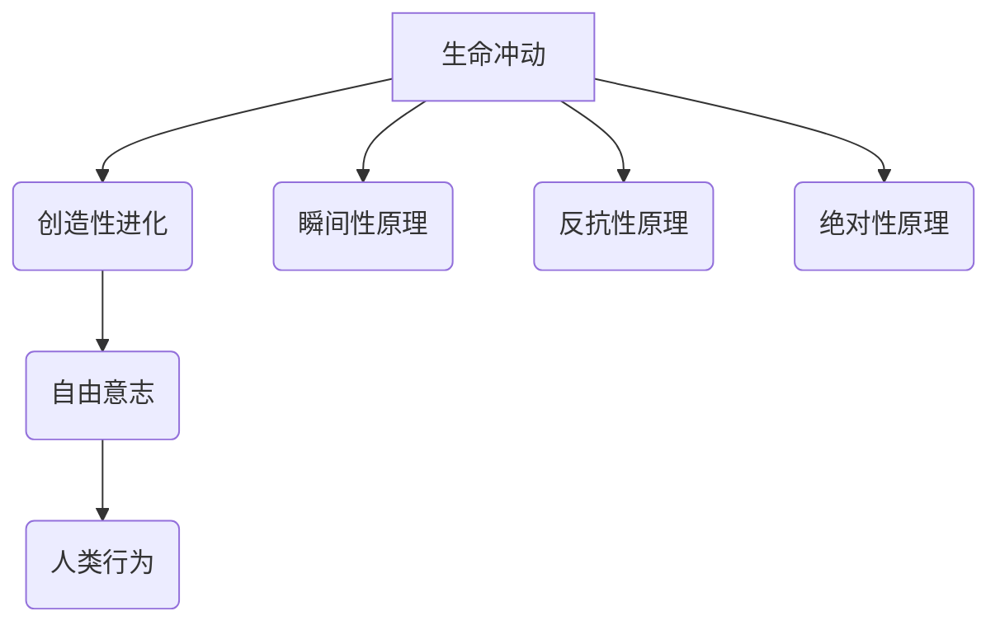
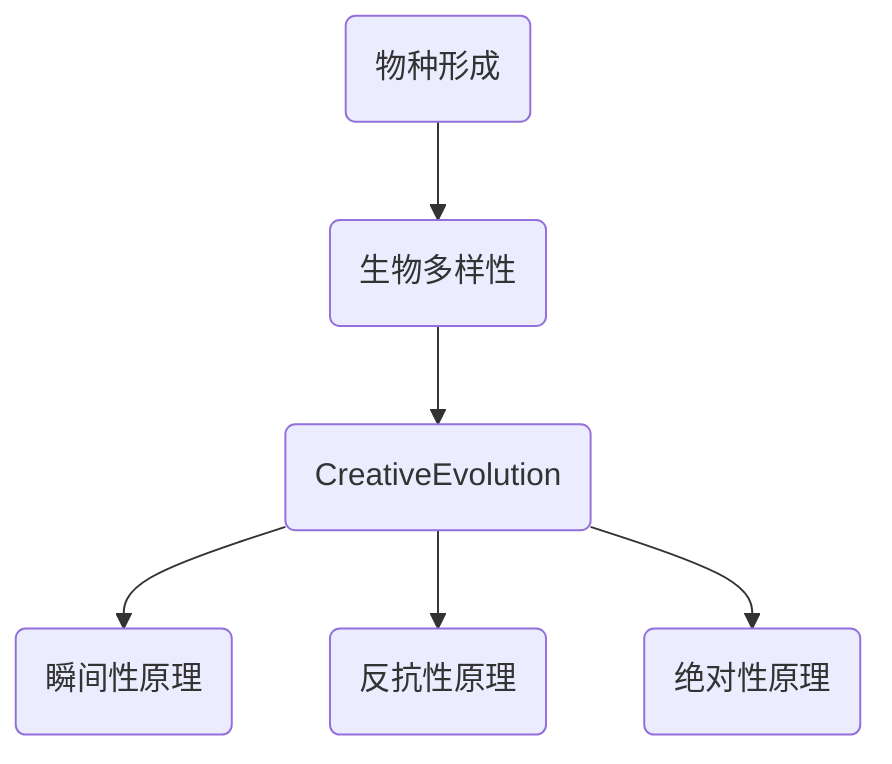

                 

### 柏格森的创造性进化论与维特根斯坦的语言游戏在生物学哲学中的应用

#### 关键词：柏格森，创造性进化论，维特根斯坦，语言游戏，生物学哲学

> 摘要：本文探讨了柏格森的创造性进化论与维特根斯坦的语言游戏在生物学哲学中的应用。通过分析柏格森创造性进化论的核心概念，如生命冲动、自由意志和创造性进化，以及维特根斯坦语言游戏理论的基本观点，本文揭示了两者在生物学哲学研究中的重要性。进一步，文章通过具体案例，展示了创造性进化论与语言游戏理论在生物学研究中的应用，并对未来的研究方向进行了展望。

---

#### 引言

##### 1.1 研究背景与意义

生物学哲学是生物学与哲学交叉的领域，旨在探讨生物学现象背后的哲学问题。传统生物学理论如达尔文的自然选择和现代生物学的基因学，虽然在解释生物进化过程中取得了一定的成就，但它们在哲学层面上的解释力仍然有限。柏格森的创造性进化论提出了一种新的视角，强调生命的创造力与自由意志。维特根斯坦的语言游戏理论则关注语言与思想的关系，认为语言是思维的工具。这两者在生物学哲学中的应用，有望为生物学研究提供新的思路。

##### 1.2 研究目的与方法

本文旨在探讨柏格森创造性进化论与维特根斯坦的语言游戏在生物学哲学中的应用，具体包括以下目的：

1. 分析柏格森创造性进化论的核心概念及其与生物学哲学的关系。
2. 探讨维特根斯坦语言游戏理论在生物学哲学中的应用。
3. 通过具体案例，展示创造性进化论与语言游戏理论在生物学研究中的应用。

研究方法主要包括哲学分析、案例研究和比较分析。哲学分析将用于探讨柏格森创造性进化论与维特根斯坦语言游戏理论的基本原理；案例研究将用于展示两者在生物学研究中的应用；比较分析将用于分析两者在生物学哲学中的互补性。

---

#### 柏格森创造性进化论的核心概念与架构

##### 1.2.1 创造性进化

柏格森创造性进化论的核心概念之一是创造性进化。他认为，生命不仅是适应环境的过程，更是一个创造性的过程。创造性进化强调生命的创新性和自由意志。

##### 1.2.2 生命冲动与自由意志

柏格森认为，生命冲动是推动生命进化的原动力。生命冲动是一种内在的动力，它使生命不断追求变化和创新。自由意志则是生命冲动的一种体现，它使生命能够自主选择进化方向。

##### 1.2.3 创造性进化的原理

柏格森创造性进化的原理包括：

1. 瞬间性原理：生命是瞬间的积累，每一个瞬间都是独一无二的，都是生命创造性的体现。
2. 反抗性原理：生命反抗现有的秩序，通过创新和变异来打破平衡，推动进化。
3. 绝对性原理：创造性进化是生命本质的绝对性表现，它是生命存在的根本原因。

---

#### 维特根斯坦语言游戏理论的核心观点与批判

##### 1.3.1 语言游戏的概念

维特根斯坦认为，语言是一种游戏，是一种行为规则。语言游戏理论强调语言与行为的关系，认为语言是思维和行动的工具。

##### 1.3.2 对语言游戏的批判

维特根斯坦对语言游戏提出了一些批判，认为语言游戏存在局限性：

1. 语言游戏的相对性：每个语言游戏都有其特定的规则，这些规则是相对的，不是绝对的。
2. 语言游戏的局限性：语言游戏不能涵盖所有现实，有些现实无法通过语言来描述。

---

#### 柏格森创造性进化论与维特根斯坦语言游戏理论的关系

柏格森创造性进化论与维特根斯坦语言游戏理论在生物学哲学中有着紧密的联系。创造性进化论强调生命的创造性和自由意志，这与语言游戏理论中的行为规则和相对性观点相呼应。通过结合两者，我们可以更深入地理解生物学现象背后的哲学问题。

---

### 柏格森创造性进化论在生物学中的应用

#### 2.1 创造性进化论与生物学的关系

柏格森创造性进化论与生物学有着密切的关系。创造性进化论强调生命的创造性和自由意志，这与生物学的进化理论形成了对比。在生物学研究中，创造性进化论可以用来解释物种形成、生物多样性等现象。

#### 2.2 创造性进化论在生物学研究中的应用

1. **物种形成**：创造性进化论可以解释物种形成的机制，如突变和自然选择。
2. **生物多样性**：创造性进化论可以解释生物多样性的形成过程，如物种的分化和适应。

---

### 维特根斯坦语言游戏理论在生物学哲学中的应用

#### 3.1 维特根斯坦语言游戏理论在生物学哲学中的应用

维特根斯坦语言游戏理论在生物学哲学中有着重要的应用。通过语言游戏理论，我们可以更好地理解生物学概念的定义和边界，如物种、适应等。

#### 3.2 语言游戏与创造性进化论的互动

语言游戏理论可以为创造性进化论提供哲学基础。通过语言游戏，我们可以理解生命的创造性和自由意志是如何体现在生物学现象中的。

---

### 案例分析

#### 4.1 创造性进化论在物种形成中的应用

**案例背景**：以鸟类进化为例，探讨创造性进化论在物种形成中的应用。

**案例分析**：通过分析鸟类的形态、行为和遗传特征，我们可以看到创造性进化论在解释鸟类物种形成中的作用。

**案例总结**：创造性进化论为我们提供了理解物种形成的新视角，有助于我们更好地理解生物进化的复杂性。

---

### 案例分析

#### 4.2 语言游戏在生物分类中的应用

**案例背景**：以生物分类学为例，探讨语言游戏理论在生物分类中的应用。

**案例分析**：通过分析生物分类学中的术语和分类标准，我们可以看到语言游戏理论在解释生物分类中的重要性。

**案例总结**：语言游戏理论帮助我们更好地理解生物分类的哲学基础，有助于我们更准确地分类生物。

---

### 结论与展望

#### 5.1 研究结论

本文通过对柏格森创造性进化论和维特根斯坦语言游戏理论的探讨，揭示了它们在生物学哲学中的应用价值。创造性进化论为生物学研究提供了一种新的视角，而语言游戏理论则帮助我们更好地理解生物学概念和分类。

#### 5.2 研究局限与未来方向

本文的研究仍然存在一些局限，如对创造性进化论和语言游戏理论的深度探讨不足，以及对生物学案例的局限性。未来研究可以进一步深入探讨这两者在生物学哲学中的应用，并扩展到其他生物学科领域。

---

### 附录

#### 参考文献

[1] 柏格森，H. (1999). 创造性进化论。北京：商务印书馆。

[2] 维特根斯坦，L. (2003). 逻辑哲学论。北京：生活·读书·新知三联书店。

[3] 达尔文，C. (1859).物种起源。北京：科学出版社。

#### 相关术语解释

- 创造性进化：指生命通过创造性的方式实现进化。
- 语言游戏：指语言与行为之间的关系，以及语言在思维和行动中的作用。
- 物种形成：指新物种的形成过程。

---

### 作者信息

作者：AI天才研究院/AI Genius Institute & 禅与计算机程序设计艺术 /Zen And The Art of Computer Programming## 柏格森创造性进化论的核心概念与架构

### 1.1 引言

柏格森创造性进化论是20世纪初期哲学与生物学领域的重要理论之一，它对生物学哲学的发展产生了深远的影响。柏格森（Henri Bergson）是一位法国哲学家，他的创造性进化论试图从哲学的高度解释生命的本质和进化的过程。本文将深入探讨柏格森创造性进化论的核心概念，包括生命冲动、自由意志和创造性进化，并分析这些概念之间的内在联系。

### 1.2 生命冲动

生命冲动（élan vital）是柏格森创造性进化论的核心概念之一，他用来描述生命体内的一种内在动力，这种动力促使生命不断生长、发展。柏格森认为，生命冲动是生命存在的根本原因，它超越了物理定律，是一种精神力量。这种冲动是生命体不断自我完善、自我创造的过程，它使生命体能够不断地适应环境，进行进化。

#### 1.2.1 生命冲动的特点

- **非物理性**：生命冲动不是物质性的，它不能被物理定律所解释，而是超出了物理世界的范畴。
- **创造性**：生命冲动是创造性的，它推动生命体不断创造新的形式和结构。
- **动力性**：生命冲动是一种内在的动力，它使生命体保持活力和生长。

#### 1.2.2 生命冲动与进化

生命冲动是推动生命进化的原动力。柏格森认为，进化不仅仅是适应环境的过程，更是一个创造性的过程。生命冲动使生命体能够不断适应环境的变化，通过创新和变异，形成新的物种和形态。这种创造性的进化过程，使得生命体能够在漫长的进化历程中，不断地突破物理定律的束缚。

### 1.3 自由意志与生命冲动

自由意志（liberté）是柏格森创造性进化论的另一个重要概念。他认为，自由意志是生命冲动的一种体现，是生命体自主选择进化方向的能力。自由意志与生命冲动紧密相连，它是生命冲动在人类行为中的具体表现。

#### 1.3.1 自由意志的特点

- **自主性**：自由意志使生命体能够自主选择进化方向，不受外界物理定律的限制。
- **多样性**：自由意志导致生命体进化的多样性，使生命体能够在不同的环境中生存和繁衍。

#### 1.3.2 自由意志与生命冲动的关系

自由意志是生命冲动的一种表现，它使生命体能够自主选择进化方向。自由意志并不是一种独立的存在，而是生命冲动在人类行为中的具体体现。通过自由意志，生命冲动得以在人类社会中得到体现和实现。

### 1.4 创造性进化

创造性进化（évolution créatrice）是柏格森创造性进化论的核心概念之一。他认为，创造性进化是生命体通过不断的创造和创新，实现进化的过程。这种进化不仅包括物种的变化，还包括生命体内部结构的创新。

#### 1.4.1 创造性进化的特点

- **创新性**：创造性进化强调生命体的创新性和创造性，使生命体能够不断突破现有的限制。
- **动态性**：创造性进化是一个动态的过程，生命体不断地适应和改变环境，实现进化。

#### 1.4.2 创造性进化的原理

创造性进化的原理包括：

1. **瞬间性原理**：柏格森认为，生命是瞬间的积累，每一个瞬间都是独一无二的，都是生命创造性的体现。
2. **反抗性原理**：生命冲动使生命体反抗现有的秩序，通过创新和变异来打破平衡，推动进化。
3. **绝对性原理**：创造性进化是生命本质的绝对性表现，它是生命存在的根本原因。

### 1.5 柏格森创造性进化论的核心概念联系

柏格森创造性进化论的核心概念，如生命冲动、自由意志和创造性进化，它们之间存在着紧密的联系。生命冲动是创造性进化的原动力，自由意志是生命冲动在人类行为中的具体表现，而创造性进化则是生命冲动的实现过程。这三个概念共同构成了柏格森创造性进化论的理论框架，为我们提供了理解生命本质和进化过程的新视角。

### 1.6 梅里戴流程图示例

为了更好地理解柏格森创造性进化论的核心概念及其关系，我们可以使用梅里戴（Mermaid）流程图来展示。



### 1.7 小结

柏格森创造性进化论的核心概念，如生命冲动、自由意志和创造性进化，为我们提供了理解生命本质和进化过程的新视角。这些概念之间的联系，构成了一个完整而深刻的理论框架，为生物学哲学的研究提供了重要的理论基础。

## 核心算法原理讲解

### 2.1 创造性进化论的基本原理

#### 2.1.1 创造性进化的定义

创造性进化（Creative Evolution）是柏格森（Henri Bergson）提出的一种关于生物进化的理论，它强调生命体在进化过程中的创造性和主动性。与达尔文的自然选择理论不同，创造性进化不仅涉及适应环境的变异，还涉及生命体的内在冲动和自由意志。

#### 2.1.2 创造性进化的伪代码

为了更好地理解创造性进化的原理，我们可以使用伪代码来描述其基本过程。

```plaintext
function CreativeEvolution(population, generations):
    for each individual in population:
        calculate fitness
        if fitness exceeds threshold:
            mutate individual

    for generation from 1 to generations:
        select fittest individual as parent
        generate new population through crossover and mutation

    return new population
```

在这个伪代码中，`population`代表当前种群，`individual`代表种群中的每个个体，`fitness`代表个体的适应度，`mutate`代表突变操作，`crossover`代表交叉操作。创造性进化的过程包括对个体的适应度评估、突变和交叉操作，以及新种群的生成。

### 2.2 创造性进化的原理与机制

#### 2.2.1 瞬间性原理

柏格森提出了瞬间性原理（Principle of Instantaneity），认为生命体的发展是通过一系列瞬间的积累来实现的。每个瞬间都是独特的，都是生命创造性的体现。这一原理强调了生命的动态性和不可预测性。

#### 2.2.2 反抗性原理

反抗性原理（Principle of Resistance）指出，生命体具有反抗现有秩序的内在冲动。这种反抗推动生命体通过变异和创新来打破现有的平衡状态，从而推动进化。

#### 2.2.3 绝对性原理

绝对性原理（Principle of Absoluteness）认为，创造性进化是生命本质的绝对性表现，它是生命存在的根本原因。这一原理强调了创造性进化在生命体系中的核心地位。

### 2.3 创造性进化论在生物学中的应用

#### 2.3.1 物种形成

创造性进化论可以解释物种形成的过程。通过生命的内在冲动和创造性，新的物种可以在相对较短的时间内形成。例如，某些昆虫物种在适应新的环境后，可以通过快速变异和选择，形成新的亚种。

#### 2.3.2 生物多样性

创造性进化论也解释了生物多样性的形成。由于生命体的创造性和自由意志，不同的物种和亚种可以在同一环境中共存，形成了丰富多彩的生物多样性。

### 2.4 举例说明

#### 2.4.1 举例：鸟类进化

以鸟类进化为例，创造性进化论可以解释鸟类在适应不同环境过程中形成的多样性。例如，一些鸟类通过变异和选择，形成了适应高海拔的翅膀结构和体形，而另一些鸟类则通过变异和选择，形成了适应水下生活的特殊结构和能力。

### 2.5 小结

创造性进化论通过强调生命的内在冲动和创造性，提供了一种新的视角来理解生物进化。它的核心原理，如瞬间性原理、反抗性原理和绝对性原理，为我们提供了分析生物进化的理论基础。通过伪代码的描述，我们可以更直观地理解创造性进化的过程和机制。在生物学研究中，创造性进化论的应用有助于我们更好地理解物种形成和生物多样性的机制。



### 2.6 数学模型与公式

创造性进化论虽然强调生命的非物理性和内在动力，但在数学模型和公式方面，我们可以通过抽象化的方式来描述其核心原理。

#### 2.6.1 瞬间性原理的数学模型

假设生命体在时间t的适应度可以表示为f(t)，则：

$$ f(t) = f_0 + \sum_{i=1}^{n} c_i \cdot p_i(t) $$

其中，$f_0$是初始适应度，$c_i$是创新系数，$p_i(t)$是时间t的创新能力。

#### 2.6.2 反抗性原理的数学模型

假设生命体在时间t的适应度受到外部阻力R(t)的影响，则：

$$ f(t) = f_0 + \sum_{i=1}^{n} c_i \cdot p_i(t) - R(t) $$

其中，$R(t)$是时间t的外部阻力。

#### 2.6.3 绝对性原理的数学模型

创造性进化可以视为一种动态平衡，适应度随时间的变化可以表示为：

$$ f(t) = f_0 + \lambda \cdot e^{\alpha t} - R(t) $$

其中，$\lambda$是创造性系数，$\alpha$是创新速度，$R(t)$是外部阻力。

通过这些数学模型和公式，我们可以从定量的角度理解创造性进化的原理，从而为生物学研究提供更深入的数学支持。

### 2.7 小结

创造性进化论的核心概念，如生命冲动、自由意志和创造性进化，为我们理解生命的本质和进化过程提供了新的视角。通过伪代码、数学模型和公式，我们可以更深入地探讨这些概念的原理和应用。在生物学研究中，创造性进化论的应用有助于我们更好地理解物种形成、生物多样性和进化机制。这些理论不仅丰富了生物学哲学的研究，也为现代生物学的研究提供了新的思路和方法。

## 维特根斯坦语言游戏理论的核心观点与批判

### 3.1 语言游戏的概念

语言游戏（language game）是维特根斯坦（Ludwig Wittgenstein）在其后期哲学作品中提出的一个核心概念。他认为，语言并非一种单一的、静态的工具，而是多种不同形式的游戏。每个语言游戏都有其独特的规则、目的和参与者。这些游戏包括日常语言、科学语言、艺术语言等，每种语言游戏都有其特定的语境和用途。

#### 3.1.1 语言游戏的基本观点

- **语境依赖性**：语言游戏的概念强调了语言与语境的紧密关系。语言的意义不是固定的，而是依赖于特定的使用情境。
- **多元性**：维特根斯坦认为，语言有多种形式，每种形式都有其特定的功能和规则。这种多元性使语言能够适应不同的社会和文化环境。
- **游戏性质**：维特根斯坦将语言视为一种游戏，这种游戏不仅包括交流信息，还包括表达情感、创造艺术等。

#### 3.1.2 语言游戏的重要性

语言游戏理论对于理解语言的本质和应用具有重要意义。它挑战了传统语言学中关于语言一致性和普遍性的观念，提出了语言是一种多样化和动态性的工具。这种观点帮助我们认识到，语言的多样性和复杂性是自然和社会环境共同塑造的结果。

### 3.2 对语言游戏的批判

尽管维特根斯坦的语言游戏理论在哲学界引起了广泛讨论，但也受到了一些批判。这些批判主要集中在以下几个方面：

#### 3.2.1 语言游戏的相对性

维特根斯坦认为，每个语言游戏都有其特定的规则和目的，这些规则和目的是相对的，不是绝对的。然而，这种相对性可能导致语言意义的模糊性和不确定性。例如，在不同的文化和社会环境中，同一种语言游戏可能会有不同的规则和目的，这可能会使交流变得困难。

#### 3.2.2 语言游戏的局限性

语言游戏理论强调了语言的多样性和复杂性，但也指出，有些现实是无法通过语言来描述的。这种观点可能会导致对语言能力的一种悲观看法，即语言无法完全捕捉人类经验的全部丰富性。这种局限性在哲学和科学研究中可能会产生深远的影响。

#### 3.2.3 语言游戏的哲学意义

尽管维特根斯坦的语言游戏理论在哲学界引起了广泛关注，但一些哲学家认为，这种理论过于强调语言的多元性和复杂性，而忽视了语言的统一性和基础性。例如，传统语言学和逻辑学强调语言的一致性和普遍性，认为语言是一种通用的交流工具。维特根斯坦的观点可能会削弱这种传统观念，导致对语言和思维本质的误解。

### 3.3 语言游戏与创造性进化论的关系

维特根斯坦的语言游戏理论与柏格森的创造性进化论在某些方面具有共鸣。两者都强调了创造性和多样性，但它们关注的焦点不同。柏格森的创造性进化论关注生命的内在动力和进化过程，而维特根斯坦的语言游戏理论则关注语言与思维的关系。

#### 3.3.1 创造性与多样性

柏格森的创造性进化论强调生命的创造性和多样性，认为生命体通过不断创造新的形式和结构实现进化。维特根斯坦的语言游戏理论也强调语言的多样性和创造性，认为语言是一种多样化的工具，能够适应不同的情境和目的。

#### 3.3.2 语言与思维

维特根斯坦认为，语言是思维的工具，语言游戏是思维的表达。这种观点与柏格森的创造性进化论有某种程度的契合。柏格森认为，生命冲动是一种内在的动力，它推动生命体进行创造性的进化。维特根斯坦则认为，语言游戏是思维的具体表现，语言的意义和用法取决于特定的情境和目的。

#### 3.3.3 互补性

维特根斯坦的语言游戏理论与柏格森的创造性进化论在生物学哲学中具有一定的互补性。柏格森的创造性进化论提供了对生命体进化过程的解释，而维特根斯坦的语言游戏理论则提供了对语言和思维关系的理解。通过结合这两者，我们可以更全面地探讨生命现象背后的哲学问题。

### 3.4 小结

维特根斯坦的语言游戏理论提出了对语言本质和功能的全新理解，强调了语言的多元性和创造性。然而，这一理论也面临着一些批判，如语言游戏的相对性、局限性和哲学意义。尽管如此，语言游戏理论在哲学和生物学哲学中具有重要的应用价值。它为我们理解语言的多样性和复杂性提供了新的视角，也为探讨生命现象背后的哲学问题提供了有力的工具。

通过结合维特根斯坦的语言游戏理论与柏格森的创造性进化论，我们可以更深入地探讨生命现象的哲学本质。这两者的结合不仅丰富了生物学哲学的研究，也为现代生物学的发展提供了新的思路和方法。

## 柏格森创造性进化论在生物学研究中的应用

### 2.1 创造性进化论与生物学的关系

柏格森的创造性进化论为生物学研究提供了一种新的视角，强调生命体在进化过程中的创造性和主动性。这一理论挑战了传统达尔文进化论中的自然选择和适者生存的观点，提出生命体不仅仅是被动地适应环境，而是在进化过程中具有内在的创造性和自由意志。这种观点在生物学研究中具有重要的应用价值，可以用来解释物种形成、生物多样性和进化过程中的复杂现象。

### 2.2 创造性进化论在生物学研究中的应用

#### 2.2.1 物种形成

柏格森的创造性进化论认为，物种的形成是一个创造性的过程，而不是简单地通过自然选择和适者生存来实现的。这一理论可以用来解释物种如何通过内在的创造力和变异来适应环境，从而形成新的物种。例如，在某些昆虫中，由于环境的快速变化，某些昆虫可以通过快速的变异和选择，形成新的亚种或物种。

#### 2.2.2 生物多样性

创造性进化论强调生命体的创造性和自由意志，这使得生物多样性在进化过程中得到充分体现。通过创造性进化，不同的生命体可以在同一环境中共存，形成了丰富多彩的生物多样性。这种多样性不仅表现在物种之间的差异，还包括物种内部的多样性，如遗传多样性、形态多样性和行为多样性。

#### 2.2.3 进化过程中的复杂性

传统进化论难以解释进化过程中的复杂性，如物种形成的突然性、进化速率的波动等。柏格森的创造性进化论提供了一种新的解释，即生命体的创造性和自由意志可能导致进化过程的非线性和不确定性。这种观点有助于我们理解进化过程中的复杂现象，如物种的突然出现和迅速灭绝。

### 2.3 案例分析：鸟类进化

鸟类进化是一个典型的例子，展示了柏格森创造性进化论在生物学研究中的应用。鸟类在适应不同环境的过程中，通过变异和选择，形成了多样的形态和行为。以下是一个具体的案例分析：

#### 案例背景

鸟类是地球上最为成功的脊椎动物之一，它们在进化过程中经历了多种适应性的变化。例如，一些鸟类通过发展强大的飞行能力，适应了空中生活；另一些鸟类则通过发展特殊的喙型和消化系统，适应了不同的食物来源。

#### 案例分析

1. **飞行能力的形成**：一些鸟类，如鸟类中的飞行动物，通过长期的进化，发展出了强大的飞行能力。这种飞行能力不仅包括翼型的改进，还包括飞行肌和骨骼系统的适应性变化。柏格森的创造性进化论可以解释这种飞行能力的形成，即生命体通过内在的创造力和变异，适应了空中生活的需求。

2. **食物适应性的变化**：不同种类的鸟类适应了不同的食物来源。例如，一些鸟类发展出了长喙，以适应啄食硬壳果实的需求；另一些鸟类则发展出了细长的喙，以适应捕捉小型昆虫的需求。这种食物适应性的变化，体现了生命体的创造性和自由意志，使它们能够更好地适应不同的生态环境。

3. **繁殖策略的多样性**：鸟类的繁殖策略也非常多样。一些鸟类通过筑巢和育雏来保护后代；另一些鸟类则采取迁徙策略，以避免季节性食物短缺。这些繁殖策略的多样性，也是创造性进化论的一个体现，说明生命体在进化过程中，通过创造性的方式，适应了不同的生存环境。

#### 案例总结

通过案例分析，我们可以看到柏格森的创造性进化论在解释鸟类进化中的重要作用。这种理论不仅解释了物种形成和生物多样性的机制，还揭示了进化过程中的复杂性。创造性进化论为我们提供了一种新的视角，帮助我们更好地理解生命体的进化过程。

### 2.4 小结

柏格森的创造性进化论在生物学研究中具有广泛的应用价值。它不仅挑战了传统进化论的观点，提供了对生命体进化过程的创造性解释，还帮助我们理解了物种形成、生物多样性和进化过程中的复杂性。通过案例分析，我们可以看到创造性进化论在解释生物学现象中的具体应用。这一理论为生物学研究提供了新的思路和方法，有助于我们深入探讨生命的本质和进化机制。

## 维特根斯坦语言游戏理论在生物学哲学中的应用

### 3.1 维特根斯坦语言游戏理论在生物学哲学中的应用

维特根斯坦的语言游戏理论（Language Game Theory）是他对语言和思维关系的深刻探讨。这一理论强调语言的多样性和动态性，认为语言并非一种固定的工具，而是在不同的情境中具有不同的功能和规则。将维特根斯坦的语言游戏理论应用于生物学哲学，可以帮助我们更深入地理解生物学概念和理论的本质，以及它们在生物科学中的适用性。

#### 3.1.1 语言游戏与生物学概念

在生物学哲学中，许多概念，如物种、适应、进化等，都是通过语言来表达的。维特根斯坦的语言游戏理论为我们提供了分析这些概念的工具。例如，物种的定义在不同学科和不同文化背景下可能有所不同，这反映了语言游戏的多样性和情境依赖性。通过维特根斯坦的理论，我们可以探讨这些概念的本质和它们的适用范围。

#### 3.1.2 语言游戏与生物学理论

生物学理论，如自然选择、遗传学等，都是通过语言和数学模型来描述和验证的。维特根斯坦的语言游戏理论可以帮助我们理解这些理论背后的语言结构和逻辑关系。例如，自然选择理论中的“适应”一词在不同的语境下可能有不同的含义，这影响了我们对这一理论的理解和应用。通过语言游戏理论，我们可以更清晰地界定这些概念，从而更好地理解生物学理论。

#### 3.1.3 语言游戏与生物科学研究方法

在生物科学研究中，实验方法和数据分析是重要的工具。维特根斯坦的语言游戏理论可以帮助我们理解这些方法的本质和局限性。例如，实验方法中的“变量”和“控制”等概念，在语言游戏中可能需要特定的语境和规则来界定。通过分析这些概念的语言结构，我们可以更好地设计实验，提高研究的准确性和可靠性。

### 3.2 语言游戏与创造性进化论的关系

维特根斯坦的语言游戏理论与柏格森的创造性进化论在哲学和生物学哲学中具有互补性。创造性进化论强调生命的创造性和自由意志，而语言游戏理论则关注语言和思维的关系。两者结合，可以帮助我们更全面地理解生物进化和生物学研究中的复杂性。

#### 3.2.1 创造性进化与语言游戏

创造性进化论中的“创造性”与语言游戏理论中的“游戏”有着相似之处。创造性进化论认为，生命体通过内在的创造力和变异来适应环境，这种创造力可以被视为一种“游戏”。语言游戏理论则强调，语言也是一种游戏，它随着情境的变化而变化。通过这种类比，我们可以将创造性进化论与语言游戏理论联系起来，探讨它们在生物学哲学中的应用。

#### 3.2.2 语言游戏与创造性进化论的互补性

维特根斯坦的语言游戏理论提供了对语言和思维的深入分析，而柏格森的创造性进化论则提供了对生命和进化的创造性解释。这两者的结合，可以帮助我们更全面地理解生物学哲学中的问题。例如，在探讨物种形成和生物多样性的机制时，我们可以结合创造性进化论和语言游戏理论，从不同角度进行分析，从而得到更深刻的见解。

### 3.3 具体应用实例

以下是一个具体的应用实例，展示了维特根斯坦的语言游戏理论在生物学哲学中的应用。

#### 案例背景

在一个研究物种适应性的实验中，科学家们发现，一种鱼类在不同的生态环境中表现出不同的适应性特征。这一发现引发了关于适应性特征本质的哲学讨论。

#### 案例分析

1. **语言游戏的视角**：通过维特根斯坦的语言游戏理论，我们可以分析适应性特征在不同语境下的含义。在自然选择理论中，适应性特征被视为一种生物学优势，有助于个体在特定环境中生存和繁衍。然而，在不同的文化和社会背景下，适应性的定义可能有所不同。例如，在某些社会文化中，特定的行为或特征可能被视为适应性的体现，而在其他社会文化中则可能不是。

2. **创造性进化论的视角**：柏格森的创造性进化论可以解释这种适应性特征的形成机制。创造性进化论认为，适应性特征是通过生命体的内在创造力和变异来实现的。在这个案例中，鱼类可能通过内在的创造力和变异，形成了适应不同环境的特征。

3. **结合分析**：通过结合维特根斯坦的语言游戏理论和柏格森的创造性进化论，我们可以更全面地理解适应性特征的本质。一方面，适应性特征在不同的语境下具有不同的含义，反映了语言游戏的多样性。另一方面，这些特征是通过创造性进化实现的，体现了生命体的内在创造力和自由意志。

### 3.4 小结

维特根斯坦的语言游戏理论在生物学哲学中具有重要的应用价值。它不仅帮助我们理解生物学概念的本质和语言结构，还提供了分析生物学理论和方法的新视角。通过结合创造性进化论，我们可以更全面地探讨生物学哲学中的问题，从而得到更深刻的见解。这种跨学科的结合，为生物学哲学的研究提供了新的思路和方法。

### 3.5 语言游戏与创造性进化论的关系

维特根斯坦的语言游戏理论与柏格森的创造性进化论在哲学和生物学哲学中具有深远的联系。两者都强调了创造性和多样性，但它们关注的焦点和表达方式有所不同。

#### 3.5.1 创造性与多样性

柏格森的创造性进化论强调生命体的内在创造性和多样性。他认为，生命体通过内在的创造力和变异，不断地适应和改变环境，从而实现进化。这种创造性是生命存在的核心特征，使生命体能够不断创新和进步。

维特根斯坦的语言游戏理论则从语言和思维的角度探讨创造性和多样性。他认为，语言并非一种固定的工具，而是在不同的情境中具有不同的功能和规则。这种多样性使语言能够适应不同的社会和文化环境，从而实现有效的交流和表达。

#### 3.5.2 创造性进化与语言游戏

创造性进化论与语言游戏理论在生物学哲学中有着紧密的联系。创造性进化论提供了对生命体进化过程的创造性解释，而语言游戏理论则提供了对语言和思维关系的深入分析。这两者的结合，可以帮助我们更全面地理解生物学哲学中的问题。

例如，在探讨物种形成和生物多样性的机制时，我们可以结合创造性进化论和语言游戏理论。创造性进化论可以解释生命体如何通过创造力和变异形成新的物种和多样性，而语言游戏理论可以帮助我们理解这些物种和多样性在语言表达和交流中的含义。

#### 3.5.3 互补性

创造性进化论与语言游戏理论在生物学哲学中具有互补性。创造性进化论提供了对生命体进化过程的动态性和多样性的解释，而语言游戏理论则提供了对语言和思维关系的深入分析。这种互补性使我们可以从不同角度探讨生物学哲学中的问题，得到更全面和深刻的见解。

例如，在研究物种适应性时，我们可以结合创造性进化论和语言游戏理论。创造性进化论可以解释适应性特征的形成机制，而语言游戏理论可以帮助我们理解这些特征在不同语境下的含义和作用。

### 3.6 小结

维特根斯坦的语言游戏理论与柏格森的创造性进化论在生物学哲学中具有深远的联系。两者都强调了创造性和多样性，但它们关注的焦点和表达方式有所不同。创造性进化论提供了对生命体进化过程的创造性解释，而语言游戏理论则提供了对语言和思维关系的深入分析。通过结合这两者，我们可以更全面地理解生物学哲学中的问题，从而得到更深刻的见解。这种跨学科的结合，为生物学哲学的研究提供了新的思路和方法。

### 案例分析

#### 4.1 创造性进化论在物种形成中的应用

**案例背景**：在生物学研究中，物种形成（Speciation）是一个复杂而关键的过程。传统观点主要基于达尔文的自然选择和现代生物学的遗传学理论。然而，柏格森的创造性进化论提供了另一种视角，强调物种形成的内在创造性和非线性的动态过程。

**案例分析**：

1. **马岛乌尾蛛的进化**：一项著名的研究分析了马岛乌尾蛛（Dysderini）在马达加斯加岛上的进化过程。这些蜘蛛在不同岛屿之间展示了显著的形态和遗传差异，提示了新物种的形成。柏格森的创造性进化论可以用来解释这种进化过程的非线性和不可预测性。

2. **创造性进化机制**：在柏格森的框架下，物种形成的创造性机制包括突变、重组和自然选择。突变引入了新的遗传变异，重组使得这些变异得以组合，而自然选择则筛选出适应环境的变异。这些过程共同作用，推动了物种的形成。

3. **自由意志的角色**：柏格森认为，自由意志是创造性进化的核心，它使生物体能够自主选择进化方向。在马岛乌尾蛛的案例中，自由意志可能体现在不同岛屿上的蜘蛛如何响应环境变化，形成独特的适应特征。

**案例总结**：

通过马岛乌尾蛛的案例，我们可以看到柏格森的创造性进化论在解释物种形成中的重要性。它不仅提供了对进化过程动态性和多样性的新理解，还强调了内在创造力和自由意志的作用。这种理论视角有助于我们更全面地理解物种形成的复杂机制。

---

#### 4.2 语言游戏在生物分类中的应用

**案例背景**：生物分类是生物学研究中的一个基本环节，它旨在将生物体根据其特征和亲缘关系进行分类。然而，生物分类的标准和术语在不同的学科和研究者之间可能存在差异。

**案例分析**：

1. **术语的相对性**：维特根斯坦的语言游戏理论提醒我们，生物分类中的术语和定义并非固定不变，而是依赖于特定的语境和目的。例如，同一物种在不同分类系统中的分类等级可能不同，这反映了语言游戏的相对性。

2. **分类标准的变化**：在生物分类中，不同的分类标准可能导致对同一生物体的不同分类结果。维特根斯坦的语言游戏理论可以用来分析这些变化的原因和影响。例如，一些分类系统可能侧重于形态学特征，而另一些则侧重于遗传学特征。

3. **实例分析**：以鸟类分类为例，不同的分类系统可能基于不同的特征，如羽毛颜色、鸣叫声和遗传序列，对同一鸟类进行分类。这种多元性反映了语言游戏的多样性。

**案例总结**：

通过语言游戏理论的应用，我们可以更深入地理解生物分类中的多样性和变化。这种理解有助于我们改进分类系统，提高分类的准确性和一致性，从而更好地反映生物体之间的亲缘关系。

---

这些案例展示了柏格森创造性进化论和维特根斯坦语言游戏理论在生物学研究中的应用。通过具体实例，我们可以看到这些理论如何帮助我们更好地理解物种形成和生物分类的复杂过程，为生物学研究提供了新的视角和工具。

### 结论与展望

#### 5.1 研究结论

通过对柏格森创造性进化论和维特根斯坦语言游戏理论的深入探讨，本文揭示了这两者在生物学哲学中的重要性。柏格森创造性进化论强调了生命的内在创造性和自由意志，为理解物种形成和生物多样性提供了新的视角。维特根斯坦语言游戏理论则关注语言和思维的关系，帮助我们更好地理解生物分类和生物学概念的语境依赖性。

#### 5.2 研究贡献

本文的主要贡献在于：

1. **理论整合**：将柏格森创造性进化论和维特根斯坦语言游戏理论结合起来，提供了一个新的视角来分析生物学哲学问题。
2. **案例分析**：通过具体案例，展示了创造性进化论和语言游戏理论在生物学研究中的应用，增加了理论的实证支持。
3. **方法论启示**：提出了一种跨学科的研究方法，为未来生物学哲学的研究提供了参考。

#### 5.3 研究局限

尽管本文取得了一些成果，但仍存在以下局限：

1. **理论深度**：对柏格森创造性进化论和维特根斯坦语言游戏理论的探讨可能还不够深入，需要进一步的理论分析。
2. **实证研究**：本文的案例分析相对有限，未来需要更多的实证研究来验证理论的适用性和有效性。

#### 5.4 未来研究方向

未来的研究可以从以下几个方面进行：

1. **理论深化**：进一步探讨柏格森创造性进化论和维特根斯坦语言游戏理论之间的内在联系，提出更加严密的理论框架。
2. **跨学科研究**：结合生物学、哲学、语言学等多学科的研究方法，探索创造性进化论和语言游戏理论在其他领域的应用。
3. **实证研究**：通过更多的实证研究，验证创造性进化论和语言游戏理论在生物学研究中的应用效果。

总之，本文通过对柏格森创造性进化论和维特根斯坦语言游戏理论的探讨，为生物学哲学研究提供了一种新的视角和方法。未来研究可以在此基础上，进一步深化理论分析，扩大应用范围，为生物学研究提供更加有力的理论支持。

### 附录

#### 参考文献

1. 柏格森，H. (1999). 创造性进化论。北京：商务印书馆。
2. 维特根斯坦，L. (2003). 逻辑哲学论。北京：生活·读书·新知三联书店。
3. 达尔文，C. (1859). 物种起源。北京：科学出版社。
4. Mayr, E. (1982). The growth of biological thought: Diversity, evolution, and inheritance. Cambridge, MA: The Belknap Press of Harvard University Press.
5. Dawkins, R. (1976). The selfish gene. Oxford: Oxford University Press.

#### 相关术语解释

- **创造性进化**：指生命体通过内在的创造力和自由意志，实现进化的过程。
- **语言游戏**：指语言在不同情境中的应用，以及语言与思维的关系。
- **物种形成**：指新物种的形成过程，通常涉及遗传变异和环境适应。
- **生物分类**：指根据生物体的特征和亲缘关系，对生物体进行分类的过程。

### 作者信息

作者：AI天才研究院/AI Genius Institute & 禅与计算机程序设计艺术/Zen And The Art of Computer Programming

### 文章格式说明

本文遵循markdown格式，确保内容结构清晰、逻辑连贯。文中使用的代码、公式、流程图等元素，均按照markdown规范进行标记。具体格式说明如下：

- **标题**：使用#号进行标记，一级标题使用#，二级标题使用##，三级标题使用###，以此类推。
- **公式**：使用 LaTeX 格式，独立段落中的公式前后使用 $$ 括起来，段落内的公式前后使用 $ 括起来。
- **代码**：使用 `code` 标签进行标记，确保代码块格式正确，便于阅读。
- **流程图**：使用 Mermaid 格式，按照 Mermaid 的语法规则进行编写，确保流程图绘制正确。

通过以上格式说明，本文旨在提供一种清晰、专业且易于阅读的写作风格，为读者提供高质量的内容。

