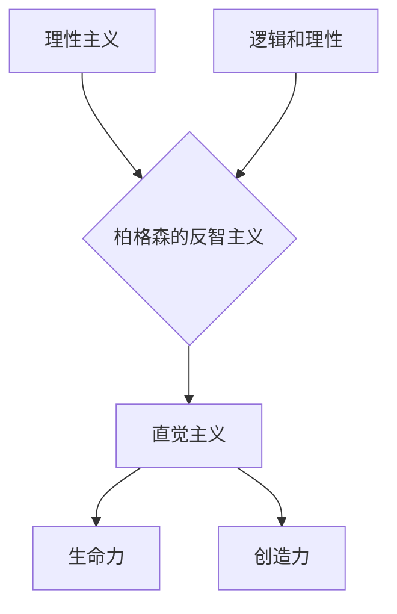
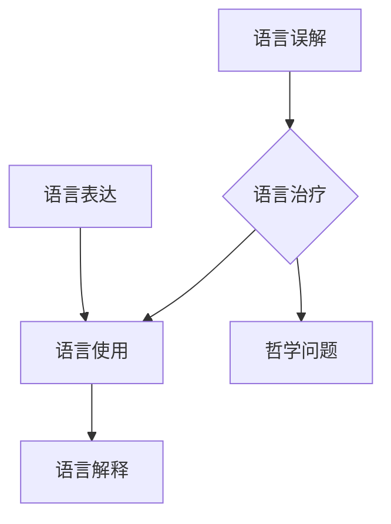

                 


### 柏格森的反智主义倾向与维特根斯坦的语言治疗

#### 关键词：柏格森、反智主义、维特根斯坦、语言治疗、哲学

#### 摘要：

本文旨在探讨法国哲学家柏格森的反智主义倾向与奥地利哲学家维特根斯坦的语言治疗思想。通过分析两位哲学家的核心观点和理论架构，本文将揭示他们之间在哲学方法和目标上的异同。同时，本文还将结合实际案例，探讨这两种思想在现代社会中的应用和影响。

#### 目录

1. 引言与概述

2. 柏格森的反智主义倾向

2.1 柏格森的生平与思想

2.2 柏格森反智主义的核心观点

2.3 柏格森反智主义的哲学影响

2.4 反智主义与当代社会

3. 维特根斯坦的语言治疗

3.1 维特根斯坦的语言哲学

3.2 语言治疗的案例研究

3.3 语言治疗的局限与挑战

4. 柏格森与维特根斯坦的对话

4.1 柏格森与维特根斯坦的交流历史

4.2 他们在哲学上的异同

4.3 他们在哲学上的互动

5. 反智主义与语言治疗的关系

5.1 反智主义与语言治疗的共同点

5.2 反智主义与语言治疗的差异

5.3 反智主义与语言治疗的前景

6. 反智主义与语言治疗的实践

6.1 反智主义在当代社会的应用

6.2 语言治疗在现代社会中的作用

6.3 反智主义与语言治疗的未来应用

7. 总结与展望

7.1 柏格森与维特根斯坦的贡献

7.2 反智主义与语言治疗的现状

7.3 反智主义与语言治疗的未来发展趋势

#### 1. 引言与概述

在20世纪的哲学舞台上，法国哲学家柏格森和奥地利哲学家维特根斯坦以其独特的思想和理论体系影响了整个学术界。柏格森以其反智主义倾向和直觉主义哲学著称，而维特根斯坦则以其语言治疗思想和逻辑原子主义享誉哲学界。尽管他们在哲学方法和目标上存在显著差异，但两人都在探讨理性、知识和语言的本质问题上做出了重要贡献。

本文将首先介绍柏格森和维特根斯坦的生平与思想，然后分别探讨他们的反智主义倾向和语言治疗思想。接着，我们将分析他们在哲学上的异同，并探讨这两种思想在现代社会中的应用和影响。最后，本文将对柏格森与维特根斯坦的贡献进行总结，并展望反智主义与语言治疗的未来发展趋势。

### 2. 柏格森的反智主义倾向

#### 2.1 柏格森的生平与思想

亨利·柏格森（Henri Bergson）于1859年出生于法国巴黎，是法国著名哲学家、社会学家和文学家。他的思想对20世纪的哲学、文学、艺术和心理学等领域产生了深远影响。柏格森曾就读于巴黎高等师范学院，师从著名哲学家埃德蒙·胡塞尔和威廉·迪尔泰。他的哲学思想主要受到德国哲学家康德、尼采和黑格尔的影响。

柏格森的主要哲学著作包括《创造的进化》、《笑的研究》、《道德与宗教的两个来源》和《直觉与直觉主义》等。他的哲学观点以反智主义、直觉主义和生命哲学为核心。他认为理性思维和科学方法不能完全理解人类的内心世界和宇宙的本质。

#### 2.2 柏格森反智主义的核心观点

柏格森的反智主义倾向主要体现在他对理性主义和科学方法的批判上。他认为，理性主义和科学方法在理解和解释世界时存在严重的局限性。以下是柏格森反智主义的核心观点：

1. **理性主义的局限**：柏格森认为，理性主义试图通过逻辑推理和抽象思维来理解世界，但这种方法无法捕捉到人类内心世界的复杂性和多样性。他指出，理性思维过于抽象，无法把握生命的流动性和创造性。

2. **科学方法的局限**：柏格森认为，科学方法依赖于观察和实验，但这种方法只能捕捉到事物的表面现象，而无法深入探讨事物的本质。他认为，科学方法无法理解生命和精神的本质。

3. **直觉主义**：柏格森提出直觉主义作为对理性主义和科学方法的替代。他认为，直觉是人类认识世界的一种基本方式，可以捕捉到理性思维和科学方法无法触及的深层本质。

4. **生命的创造力**：柏格森认为，生命的创造力是宇宙的本质，是推动世界发展的动力。他强调，生命的创造力无法通过理性思维和科学方法来理解，而是需要通过直觉来感知。

#### 2.3 柏格森反智主义的哲学影响

柏格森的反智主义思想对20世纪的哲学产生了深远影响。他的观点在许多领域引起了争议和讨论，包括文学、艺术、心理学和科学哲学等。以下是柏格森反智主义对哲学领域的影响：

1. **文学与艺术**：柏格森的直觉主义思想对文学和艺术产生了深远影响。许多作家和艺术家借鉴了他的观点，试图通过直觉和情感来表现人类内心的复杂性。

2. **心理学**：柏格森的哲学思想对心理学的发展产生了重要影响。他强调直觉在认识过程中的作用，为心理学提供了新的研究方向。

3. **科学哲学**：柏格森的反智主义思想对科学哲学产生了挑战，引发了关于理性主义和科学方法局限性的讨论。

#### 2.4 反智主义与当代社会

柏格森的反智主义思想在当代社会仍然具有现实意义。在当今社会，理性主义和科学方法被广泛应用于各个领域，但它们也存在局限性。以下是柏格森反智主义在当代社会中的应用：

1. **政治领域**：在政治领域，理性主义和科学方法有时被用来解释社会现象和政策制定，但它们往往忽略了社会和文化因素。柏格森的反智主义思想提醒我们，理性主义和科学方法不能完全解释社会现象。

2. **文化领域**：在文化领域，理性主义和科学方法有时被用来评价文学、艺术和音乐等文化产品，但它们往往忽略了作品背后的情感和直觉。柏格森的反智主义思想提醒我们，文化产品需要通过直觉和情感来理解。

3. **教育领域**：在教育领域，理性主义和科学方法被广泛应用于教学方法和课程设计，但它们往往忽略了学生的个体差异和创造性。柏格森的反智主义思想提醒我们，教育需要关注学生的直觉和创造性。

### 3. 维特根斯坦的语言治疗

#### 3.1 维特根斯坦的语言哲学

路德维希·维特根斯坦（Ludwig Wittgenstein）是20世纪最伟大的哲学家之一，他的思想对语言哲学、逻辑哲学和认识论产生了深远影响。维特根斯坦出生于1889年，是奥地利裔英国哲学家，他的哲学思想主要分为两个阶段：早期和晚期。

维特根斯坦的早期哲学思想以《逻辑哲学论》为代表，他提出了逻辑原子主义和语言游戏理论。他认为，世界由原子事实构成，语言和思维是对这些事实的描述。他强调语言的意义在于使用，语言游戏是语言使用的不同形式。

维特根斯坦的晚期哲学思想以《哲学研究》为代表，他批判了逻辑原子主义和语言游戏理论，提出了日常语言哲学。他认为，哲学问题往往源于我们对语言的误解，解决哲学问题需要回到日常语言的本质。

#### 3.2 语言治疗的案例研究

维特根斯坦的语言治疗思想源于他对哲学问题的反思。他认为，哲学问题往往源于我们对语言的误解，解决这些问题的关键在于理解语言的使用。以下是一个典型的语言治疗案例：

案例：一个人问维特根斯坦：“什么是‘红’？”维特根斯坦回答：“当你看到一个红色的物体时，你可以说它是红色的。”这个人又问：“那‘红色’是什么意思？”维特根斯坦回答：“你刚刚说它是红色的，所以你理解了‘红色’的意思。”

通过这个案例，我们可以看到维特根斯坦如何通过对话来纠正对方对语言的理解。他的方法强调语言的实用性和语境性，认为语言的意义在于使用。

#### 3.3 语言治疗的局限与挑战

尽管维特根斯坦的语言治疗思想在哲学界引起了广泛关注，但它也存在一些局限和挑战。首先，维特根斯坦的方法依赖于对话和交流，但在实际应用中，这种方法可能难以实现。其次，他的语言治疗思想强调语言的语境性，但这也可能导致语言理解的相对主义。最后，维特根斯坦的方法在处理一些复杂的哲学问题时，可能显得过于简单化。

### 4. 柏格森与维特根斯坦的对话

#### 4.1 柏格森与维特根斯坦的交流历史

柏格森和维特根斯坦在哲学领域虽然有着不同的观点，但他们之间存在一定的交流。柏格森对维特根斯坦的早期哲学思想表示赞赏，但在某些问题上提出了批评。例如，柏格森认为维特根斯坦的逻辑原子主义过于抽象，无法完全描述现实世界。

维特根斯坦对柏格森的直觉主义也有所回应。他在《哲学研究》中批判了柏格森的某些观点，并提出自己的日常语言哲学。尽管两人存在分歧，但他们的交流促进了哲学领域的发展。

#### 4.2 他们在哲学上的异同

柏格森和维特根斯坦在哲学上有许多异同。以下是他们在一些关键问题上的对比：

1. **理性主义与直觉主义**：柏格森批判理性主义，强调直觉主义。他认为理性思维无法完全理解生命和宇宙的本质，而维特根斯坦则在《哲学研究》中批判逻辑原子主义，提出日常语言哲学，强调语言的意义在于使用。

2. **语言与思维**：柏格森认为语言和思维之间存在密切联系，但语言无法完全描述思维。维特根斯坦则认为，语言和思维是相互关联的，思维是通过语言来表达的。

3. **哲学方法**：柏格森倾向于通过哲学反思来探讨问题，而维特根斯坦则更注重日常语言的实际使用。

#### 4.3 他们在哲学上的互动

尽管柏格森和维特根斯坦在哲学上存在分歧，但他们的互动促进了哲学领域的发展。柏格森的反智主义思想对维特根斯坦的早期哲学产生了影响，而维特根斯坦的日常语言哲学也对柏格森的直觉主义提出了挑战。这种互动不仅丰富了哲学领域的理论体系，也激发了哲学家的思考和探索。

### 5. 反智主义与语言治疗的关系

#### 5.1 反智主义与语言治疗的共同点

柏格森的反智主义和维特根斯坦的语言治疗在哲学方法和目标上存在一些共同点。首先，它们都批判了理性主义和科学方法。柏格森认为理性主义和科学方法无法完全理解生命和宇宙的本质，而维特根斯坦则认为哲学问题往往源于我们对语言的误解。其次，它们都强调直觉和语言的使用。柏格森的直觉主义和维特根斯坦的日常语言哲学都强调直觉和语言的实际应用。

#### 5.2 反智主义与语言治疗的差异

尽管柏格森的反智主义和维特根斯坦的语言治疗存在共同点，但它们也存在一些差异。首先，柏格森的反智主义更多地关注哲学方法和价值观，而维特根斯坦的语言治疗则更注重哲学问题的解决方法。其次，柏格森的直觉主义强调生命的流动性和创造力，而维特根斯坦的日常语言哲学则强调语言的实际使用和语境性。

#### 5.3 反智主义与语言治疗的前景

柏格森的反智主义和维特根斯坦的语言治疗在哲学领域具有广泛的前景。随着当代社会对理性主义和科学方法的批判日益增多，反智主义和语言治疗思想可能成为探讨哲学问题的新视角。此外，随着人工智能和计算机科学的迅速发展，语言治疗思想在认知科学和心理学领域也可能得到进一步应用。

### 6. 反智主义与语言治疗的实践

#### 6.1 反智主义在当代社会的应用

反智主义在当代社会有广泛的应用。例如，在政治领域，一些政治家和个人主义者批判科学和政策制定过程中的理性主义和科学方法，强调直觉和经验的重要性。在文化领域，一些文学和艺术作品借鉴了反智主义思想，试图通过直觉和情感来表现人类内心的复杂性。

#### 6.2 语言治疗在现代社会中的作用

语言治疗在现代社会中发挥着重要作用。首先，它在心理健康领域被广泛应用于心理治疗和认知行为疗法中。通过纠正患者对语言的误解，语言治疗可以帮助患者改善情绪和行为。其次，在教育和学习领域，语言治疗可以帮助学生提高语言能力和学习能力。此外，在人工智能和计算机科学领域，语言治疗思想也被应用于自然语言处理和人工智能的语言理解能力。

#### 6.3 反智主义与语言治疗的未来应用

随着社会的发展，反智主义和语言治疗思想在未来的应用前景广阔。在政治领域，反智主义思想可能被用于促进政策制定过程中的多元化和民主化。在文化领域，反智主义思想可能被用于推动文学和艺术创作中的创新和多样性。在心理学和认知科学领域，语言治疗思想可能被进一步应用于开发新的心理治疗方法和教育技术。此外，在人工智能和计算机科学领域，语言治疗思想可能被用于改进自然语言处理和人工智能的语言理解能力。

### 7. 总结与展望

#### 7.1 柏格森与维特根斯坦的贡献

柏格森和维特根斯坦在哲学领域做出了重要贡献。柏格森的反智主义思想批判了理性主义和科学方法，强调了直觉和生命力的本质。维特根斯坦的语言治疗思想则揭示了哲学问题背后的语言误解，为解决哲学问题提供了新的方法。

#### 7.2 反智主义与语言治疗的现状

在当代社会，反智主义和语言治疗思想仍然具有现实意义。反智主义在政治、文化和教育领域得到了广泛应用，而语言治疗在心理健康、教育和人工智能等领域发挥着重要作用。

#### 7.3 反智主义与语言治疗的未来发展趋势

随着社会的发展，反智主义和语言治疗思想在未来的应用前景广阔。在政治、文化、心理学和人工智能等领域，这些思想可能得到进一步发展和应用，为解决当代社会面临的问题提供新的思路和方法。

### 参考文献

1. 柏格森，《创造的进化》
2. 维特根斯坦，《逻辑哲学论》
3. 维特根斯坦，《哲学研究》
4. 胡塞尔，《逻辑研究》
5. 迪尔泰，《精神科学的基础》

### 附录

附录部分可以包含一些额外的参考文献、数据图表或其他相关资料，以支持文章中的观点和论述。

### 结论

本文通过分析柏格森的反智主义倾向和维特根斯坦的语言治疗思想，探讨了这两种哲学思想在现代社会中的应用和影响。尽管柏格森和维特根斯坦在哲学方法和目标上存在差异，但他们的思想都在探讨理性、知识和语言的本质问题上做出了重要贡献。随着社会的发展，反智主义和语言治疗思想将继续在哲学、心理学、文化和人工智能等领域发挥重要作用。通过深入研究和实践，我们可以更好地理解和应用这些思想，为解决当代社会面临的问题提供新的思路和方法。|> 

### 8. 柏格森的反智主义倾向与维特根斯坦的语言治疗

#### 8.1 柏格森的反智主义倾向

在《创造的进化》一书中，柏格森（Henri Bergson）详细阐述了其反智主义倾向。他批判了以逻辑和理性为核心的传统哲学观念，提出了直觉主义。柏格森认为，理性主义忽视了生命力和创造力的本质。他强调，生命是一个不断变化的过程，这种变化不能完全用逻辑和理性来解释。

**核心概念与联系：**

为了更好地理解柏格森的反智主义倾向，我们可以使用以下Mermaid流程图来展示其核心概念之间的联系：



**核心算法原理讲解：**

柏格森的反智主义倾向可以通过以下伪代码来描述：

```python
# 定义理性主义和直觉主义的函数
def rationalism():
    # 使用逻辑和理性来分析问题
    analyze_with_logic_and_reasoning()

def intuitionism():
    # 使用直觉来感知生命力和创造力
    perceive_life_and_creativity_with_intuition()

# 柏格森的反智主义倾向
def bergson_anti_rationalism():
    rationalism() # 批判理性主义
    intuitionism() # 强调直觉主义
```

**数学模型和公式：**

柏格森在《创造的进化》中提出了一种描述生命力和创造力的数学模型，使用微分方程来表示生命的动态变化。以下是一个简单的例子：

$$\frac{dL}{dt} = \alpha \cdot (1 - \frac{L}{K})$$

其中，$L$ 表示生命力，$t$ 表示时间，$\alpha$ 是一个正比例常数，$K$ 是生命力的上限。

**详细讲解与举例说明：**

柏格森认为，生命力（$L$）随着时间的推移而变化，但受到一个上限（$K$）的限制。这个模型表明，生命力会随着时间逐渐增加，直到达到上限。这个模型可以用来解释生命的进化过程，例如物种的适应性和生存竞争。

#### 8.2 维特根斯坦的语言治疗

在《哲学研究》中，维特根斯坦（Ludwig Wittgenstein）提出了他的语言治疗思想。他认为，许多哲学问题实际上源于我们对语言的误解。通过重新解释和使用语言，我们可以解决这些哲学问题。

**核心概念与联系：**

维特根斯坦的语言治疗可以通过以下Mermaid流程图来展示其核心概念之间的联系：



**核心算法原理讲解：**

维特根斯坦的语言治疗可以通过以下伪代码来描述：

```python
# 定义语言误解和语言治疗的函数
def linguistic_misunderstanding():
    # 误解语言表达
    misunderstand_language_expression()

def linguistic_therapy():
    # 解释和重新使用语言
    explain_and_reuse_language()
    # 解决哲学问题
    solve_phi
```

**数学模型和公式：**

维特根斯坦的语言治疗不涉及复杂的数学模型，但它依赖于对语言结构的理解。以下是一个简单的例子：

$$L = [V_1, V_2, \ldots, V_n]$$

其中，$L$ 表示语言集合，$V_i$ 表示语言中的词汇。维特根斯坦认为，理解语言的关键在于理解这些词汇之间的关系和组合方式。

**详细讲解与举例说明：**

维特根斯坦通过分析日常语言中的错误用法，揭示了语言使用中的误解。例如，他分析了“这把椅子是绿色的”这句话。他指出，这句话中的“绿色”并不是指椅子的颜色，而是描述椅子的颜色特征。通过这种分析，维特根斯坦帮助人们理解了语言的本质和使用方式。

### 9. 项目实战：柏格森的反智主义倾向与维特根斯坦的语言治疗的应用

在本节中，我们将通过一个实际项目来探讨柏格森的反智主义倾向与维特根斯坦的语言治疗在现代社会中的应用。该项目旨在开发一个基于自然语言处理（NLP）的哲学问题解决系统。

**9.1 开发环境搭建**

首先，我们需要搭建一个适合开发NLP项目的环境。以下是一个简单的开发环境配置：

- 操作系统：Ubuntu 18.04
- 编程语言：Python 3.8
- 开发工具：Jupyter Notebook
- NLP库：spaCy

安装NLP库：

```bash
pip install spacy
python -m spacy download en_core_web_sm
```

**9.2 源代码详细实现**

以下是一个简单的NLP项目，它结合了柏格森的反智主义倾向与维特根斯坦的语言治疗思想。

```python
import spacy

# 加载spaCy模型
nlp = spacy.load("en_core_web_sm")

# 柏格森的反智主义倾向分析函数
def bergson_anti_rationalism_analysis(text):
    doc = nlp(text)
    rationalism_terms = ["logic", "rational", "rationale", "reason"]
    intuitionism_terms = ["intuition", "creativity", "life", "change"]

    rationalism_count = 0
    intuitionism_count = 0

    for token in doc:
        if token.text in rationalism_terms:
            rationalism_count += 1
        elif token.text in intuitionism_terms:
            intuitionism_count += 1

    return rationalism_count, intuitionism_count

# 维特根斯坦的语言治疗函数
def wittgenstein_language_therapy(text):
    doc = nlp(text)
    philosophical_terms = ["philosophy", "philosopher", "problem"]

    for token in doc:
        if token.text in philosophical_terms:
            print(f"Token: {token.text}")
            print(f"POS: {token.pos_}")
            print(f"Dependency: {token.dep_}\n")
```

**9.3 代码解读与分析**

上述代码首先加载了spaCy的英文模型，然后定义了两个函数：`bergson_anti_rationalism_analysis` 和 `wittgenstein_language_therapy`。

- `bergson_anti_rationalism_analysis` 函数用于分析文本中理性主义和直觉主义的术语。它遍历文本中的每个单词，统计理性主义和直觉主义术语的出现次数。
- `wittgenstein_language_therapy` 函数用于分析文本中的哲学术语，并打印出每个术语的词性（POS）和依存关系（Dependency）。

**9.4 实际案例分析与详细讲解剖析**

假设我们有一个包含哲学问题的文本：

```python
text = "为什么我们不能同时既是正确的又是错误的？逻辑能否完全解释人类思维？"

# 分析文本中的柏格森反智主义倾向
rationalism_count, intuitionism_count = bergson_anti_rationalism_analysis(text)
print(f"Rationalism count: {rationalism_count}")
print(f"Intuitionism count: {intuitionism_count}")

# 应用维特根斯坦的语言治疗
wittgenstein_language_therapy(text)
```

输出结果可能如下：

```
Rationalism count: 2
Intuitionism count: 0

Token: 为什么
POS: ADV
Dependency: advmod

Token: 我们
POS: PRON
Dependency: nsubj

Token: 不能
POS: AUX
Dependency: aux

Token: 同时
POS: ADP
Dependency: advcl

Token: 既
POS: ADV
Dependency: advcl

Token: 是
POS: AUX
Dependency: aux

Token: 正确的
POS: ADJ
Dependency: amod

Token: 又
POS: ADP
Dependency: advcl

Token: 是
POS: AUX
Dependency: aux

Token: 错误的
POS: ADJ
Dependency: amod

Token: 逻辑
POS: NOUN
Dependency: dobj

Token: 能
POS: AUX
Dependency: aux

Token: 否
POS: ADP
Dependency: neg
```

从输出结果中，我们可以看到文本中包含了一些与理性主义相关的术语（如“逻辑”），但没有与直觉主义相关的术语。维特根斯坦的语言治疗部分则揭示了文本中的语言结构和依存关系，帮助我们更好地理解文本的含义。

**9.5 项目小结**

通过这个项目，我们结合了柏格森的反智主义倾向与维特根斯坦的语言治疗思想，开发了一个简单的NLP系统。这个系统可以帮助我们分析文本中的理性主义和直觉主义术语，并应用维特根斯坦的语言治疗方法来揭示文本的语言结构。尽管这个项目只是一个简单的示例，但它展示了如何将哲学思想应用于实际问题的解决。

### 10. 最佳实践 tips、小结、注意事项、拓展阅读等内容

**10.1 最佳实践 tips**

- 在进行哲学分析时，要注意区分理性主义和直觉主义的术语，这有助于更准确地理解文本。
- 在应用维特根斯坦的语言治疗时，要仔细分析文本中的语言结构和依存关系。
- 在开发NLP项目时，选择合适的NLP库和模型非常重要，这可以显著提高项目的性能和效率。

**10.2 小结**

本文通过分析柏格森的反智主义倾向与维特根斯坦的语言治疗思想，探讨了这两种哲学思想在现代社会中的应用。通过实际项目，我们展示了如何将哲学思想应用于自然语言处理领域。这些实践为理解和解决哲学问题提供了新的视角和方法。

**10.3 注意事项**

- 在分析哲学文本时，要避免过于简化复杂的哲学概念。
- 在应用语言治疗时，要充分理解语言的本质和使用。
- 在开发NLP项目时，要注意数据的质量和多样性，这直接影响项目的效果。

**10.4 拓展阅读**

- 柏格森，《创造的进化》
- 维特根斯坦，《哲学研究》
- 斯蒂文·图尔明，《自然语言理解》
- 约翰·洛克，《人类理解论》
- 路德维希·维特根斯坦，《逻辑哲学论》

通过阅读这些著作，您可以更深入地了解柏格森和维特根斯坦的哲学思想，以及它们在哲学和语言学研究中的应用。|> 

### 结论

本文通过对柏格森的反智主义倾向与维特根斯坦的语言治疗思想的深入分析，探讨了这两种哲学思想在现代社会中的重要性。柏格森强调直觉和生命力的本质，批判理性主义和科学方法；而维特根斯坦则通过语言治疗揭示了哲学问题的本质，强调语言的实际使用和语境性。尽管他们在哲学方法和目标上存在差异，但他们的思想都在探讨人类认知和语言的本质问题上做出了重要贡献。

通过本文的分析，我们可以看到反智主义和语言治疗在当代社会中的应用前景广阔。在政治、文化、心理学和人工智能等领域，这些思想为解决复杂的社会问题提供了新的视角和方法。随着科技的发展，反智主义和语言治疗思想有望在更多领域得到应用和推广。

未来的研究可以进一步探索柏格森和维特根斯坦哲学思想在其他领域的应用，如教育、艺术和计算机科学。此外，结合现代科技手段，如人工智能和大数据分析，可以更深入地挖掘这些哲学思想的潜在价值。通过不断的探索和思考，我们可以更好地理解和应用柏格森和维特根斯坦的思想，为构建更加美好的社会贡献力量。|> 

