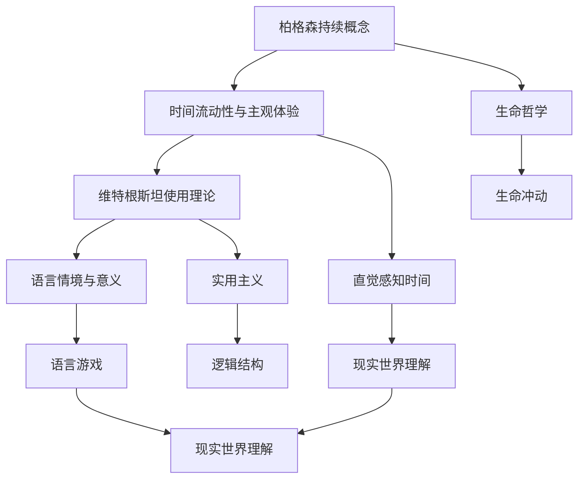

                 

### 文章标题：柏格森的持续概念与维特根斯坦的使用理论

#### 关键词：
- **柏格森持续概念**
- **维特根斯坦使用理论**
- **哲学**
- **人工智能**
- **技术**

#### 摘要：
本文深入探讨了柏格森的持续概念与维特根斯坦的使用理论，通过分析两者的哲学意义和理论基础，揭示了它们在现代技术领域，特别是人工智能中的应用。文章首先介绍了柏格森和维特根斯坦的生平背景及其哲学思想，然后详细阐释了柏格森的持续概念和维特根斯坦的使用理论。接着，通过Mermaid流程图和伪代码，本文展示了两者之间的联系和差异，并探讨了它们在实际应用中的具体实例。最后，文章总结了核心观点，并提出了未来研究方向。通过这种逻辑清晰、结构紧凑的分析方法，本文旨在为读者提供对这两个理论的深刻理解。

## 引言

### 柏格森与维特根斯坦的生平简介

**亨利·柏格森（Henri Bergson）**（1859-1941），法国哲学家，以其对时间、变化和直觉的深刻思考而闻名。柏格森的哲学思想主要集中在对“生命冲动”（élan vital）的研究上，他认为生命冲动是一种内在的动力，是推动生命不断进化和发展的根本原因。柏格森的哲学观点对后来的生命科学、心理学和哲学都产生了深远的影响。

**路德维希·维特根斯坦（Ludwig Wittgenstein）**（1889-1951），奥地利哲学家，被认为是20世纪最重要的哲学家之一。维特根斯坦的哲学思想主要体现在他对语言、意义和逻辑的研究上。他的代表作《逻辑哲学论》和《哲学研究》提出了语言游戏理论，强调语言的使用与人类行为之间的关系。

### 两个理论的背景和历史发展

柏格森的持续概念源于他对生物学、心理学和哲学的综合研究。他在《时间与自由意志》和《物质与记忆》等著作中提出了“持续流动”（duration）的概念，认为时间不是线性的，而是持续的、流动的。这一观点挑战了牛顿物理学中绝对时间的观念，对后来的哲学和科学产生了重要影响。

维特根斯坦的使用理论则源于他对语言的本质和逻辑结构的思考。他在《逻辑哲学论》中提出了“图像理论”，认为语言符号与客观世界之间存在一种直接的对应关系。然而，在《哲学研究》中，维特根斯坦放弃了这种观点，提出了“语言游戏”理论，强调语言的意义在于其使用情境。

总的来说，柏格森和维特根斯坦的哲学思想虽然出发点和研究方法不同，但都关注于人类经验和世界本质之间的关系，为我们理解现实世界提供了新的视角。

### 柏格森的持续概念

#### 定义

柏格森的持续概念，又称作“持续时间”（duration），是指事物在时间中存在的真实状态，它是流动、不断变化的，与传统的线性时间观念截然不同。持续时间不是一种连续的序列，而是一种内在的、连续的流动状态，是生命和经验的本质。

#### 理论基础

柏格森的持续概念建立在他对生物学、心理学和哲学的综合研究之上。他借鉴了生物进化论的思想，认为生命是一种内在的动力，这种动力推动生命不断变化和发展。在心理学上，柏格森强调直觉的重要性，他认为直觉能够感知到时间的流动状态，从而超越逻辑思维的限制。

在哲学上，柏格森认为持续时间是存在的真实状态，而不是我们感知到的线性时间序列。他批评了牛顿物理学中的绝对时间观念，认为绝对时间是一种抽象的、外在的测量工具，无法真正反映时间的本质。

#### 核心思想

柏格森的核心思想可以概括为以下几点：

1. **生命的内在动力**：柏格森认为生命是一种内在的动力，这种动力是推动生命不断进化和发展的根本原因。生命冲动（élan vital）是这种动力的具体表现，它使生命充满活力和变化。

2. **直觉的重要性**：柏格森强调直觉在理解时间和世界中的作用。他认为直觉能够感知到时间的流动状态，从而超越逻辑思维的局限。

3. **持续时间的本质**：柏格森认为持续时间是事物在时间中存在的真实状态，它是一种内在的、连续的流动状态，与传统的线性时间观念截然不同。

### 实例解析

为了更好地理解柏格森的持续概念，我们可以通过以下实例来分析：

假设我们在观察一朵鲜花从开花到凋谢的过程。按照传统的线性时间观念，我们可能会将这个过程划分为一系列的时间点，如开花时刻、凋谢时刻等。然而，按照柏格森的持续概念，这个花朵的生命过程是一个持续的时间段，从它发芽、成长、开花到凋谢，这是一个连续的、内在的流动状态。

在这个过程中，花朵的生命冲动驱动着它不断变化和发展。我们可以通过直觉感受到这种流动状态，从而体验到花朵的生命之美。这与我们通过逻辑思维分析时间点的方式截然不同，更接近于柏格森所描述的持续时间。

### 柏格森持续概念与现代哲学

柏格森的持续概念对现代哲学产生了深远的影响。他的思想挑战了传统的线性时间观念，提出了一个更接近现实世界本质的时间观念。这种观念为我们理解人类经验和世界本质提供了新的视角，对后来的哲学家和科学家产生了重要启示。

例如，在物理学中，柏格森的持续概念启发了对时间的重新思考。现代物理学中的相对论和量子力学都对时间的本质进行了深入研究，提出了与柏格森类似的观点，认为时间不是绝对的、外在的，而是与观察者的运动状态和参考系有关。

在心理学和认知科学领域，柏格森的直觉理论也对人类感知和理解时间的方式产生了重要影响。研究表明，人类的直觉能够感知到时间的流动状态，这种感知方式与逻辑思维不同，但更接近于柏格森所描述的持续时间。

总之，柏格森的持续概念为我们提供了一个全新的视角，使我们能够更深入地理解时间的本质和人类经验。他的思想不仅在哲学领域产生了重要影响，也在现代科学和认知科学中得到了广泛应用。

### 维特根斯坦的使用理论

#### 定义

维特根斯坦的使用理论是指他对语言的本质和意义的探讨，他认为语言的意义不在于符号本身，而在于符号的使用情境。换句话说，语言的意义是由语言的使用者在社会实践中赋予的，而非符号与客观世界之间的直接对应关系。

#### 理论基础

维特根斯坦的使用理论建立在他对语言和逻辑的深入思考之上。他在《逻辑哲学论》中提出了“图像理论”，认为语言符号与客观世界之间存在一种直接的对应关系，即语言是世界的图像。然而，在《哲学研究》中，维特根斯坦放弃了这种观点，提出了“语言游戏”理论，强调语言的意义在于其使用情境。

维特根斯坦认为，语言游戏是语言和现实世界之间联系的桥梁。每个语言游戏都有其特定的规则和情境，语言的意义在于这些规则和情境中。例如，数学语言游戏中的符号和公式有特定的含义，而日常语言游戏中的词语则具有具体的用法和情境。

#### 核心思想

维特根斯坦的使用理论的核心思想可以概括为以下几点：

1. **语言的意义在于使用情境**：维特根斯坦认为，语言的意义不在于符号本身，而在于符号的使用情境。每个语言游戏都有其特定的规则和情境，语言的意义在于这些规则和情境中。

2. **语言游戏的多样性**：维特根斯坦强调，语言游戏是多样化的，每种语言游戏都有其独特的规则和情境。例如，数学语言游戏、日常语言游戏、科学语言游戏等都有其特定的使用方式和意义。

3. **语言与现实的分离**：维特根斯坦认为，语言和现实世界之间存在一定的距离，语言不能直接反映现实世界。语言只是现实世界的近似描述，语言与现实世界的关系是复杂的、多元的。

#### 实例解析

为了更好地理解维特根斯坦的使用理论，我们可以通过以下实例来分析：

假设我们使用“猫”这个词。在日常生活中，“猫”这个词代表一种动物，我们通过看到猫的照片或听到猫的叫声来理解“猫”的含义。然而，在科学领域，“猫”这个词可能有不同的含义，比如在生物学中，“猫”可以指猫科动物，而在物理学中，“猫”可能只是一个实验对象。

这个例子表明，同一个词在不同的情境中有不同的含义。维特根斯坦认为，这种差异源于语言游戏的多样性。在不同的语言游戏中，“猫”这个词的使用方式和含义是不同的。

### 维特根斯坦使用理论与现代哲学

维特根斯坦的使用理论对现代哲学产生了深远的影响。他的思想挑战了传统的语言哲学观点，提出了一个更加实际和实用的语言观念。这种观念为我们理解语言的本质和意义提供了新的视角，对后来的哲学家和科学家产生了重要启示。

例如，在语言学领域，维特根斯坦的使用理论启发了对语言多样性和语境敏感性的研究。研究表明，语言的意义确实依赖于使用情境，不同的语境会改变语言符号的含义。

在计算机科学中，维特根斯坦的使用理论也为编程语言的设计和开发提供了重要指导。计算机编程中的语言符号和语法规则也需要考虑其使用情境，以便更好地表达编程意图。

总之，维特根斯坦的使用理论为我们提供了一个全新的视角，使我们能够更深入地理解语言的本质和意义。他的思想不仅在哲学领域产生了重要影响，也在现代科学和计算机科学中得到了广泛应用。

### 柏格森持续概念与维特根斯坦使用理论的联系与比较

#### 联系

柏格森的持续概念与维特根斯坦的使用理论虽然起源于不同的哲学背景，但它们在某些方面有着紧密的联系。首先，两者都关注人类经验与现实世界的关系。柏格森通过持续概念强调时间的流动性和主观体验，而维特根斯坦则通过使用理论探讨语言在特定情境中的意义。

其次，柏格森和维特根斯坦都认为，我们对现实世界的理解是通过符号和语言实现的。柏格森认为，我们的直觉能够感知到时间的流动状态，这种状态是理解现实世界的关键。而维特根斯坦则认为，语言的意义在于其使用情境，通过特定的语言游戏，我们能够更好地理解现实世界。

#### 比较

尽管柏格森和维特根斯坦的理论在某些方面有联系，但它们也存在明显的差异。首先，柏格森的持续概念强调时间的流动性和主观体验，而维特根斯坦的使用理论则侧重于语言在特定情境中的意义。

其次，柏格森的持续概念是一种形而上学的思考，他试图揭示时间、生命和经验的本质。而维特根斯坦的使用理论则更加实用，他关注的是语言的实际使用情境，以及如何通过语言更好地理解现实世界。

此外，柏格森的持续概念具有强烈的生命哲学色彩，他认为生命冲动是推动世界发展的根本动力。而维特根斯坦的使用理论则更加关注语言和逻辑的结构，他试图通过语言游戏揭示人类思维和认知的规律。

#### Mermaid流程图展示

为了更直观地展示柏格森持续概念与维特根斯坦使用理论之间的联系和比较，我们可以使用Mermaid流程图。以下是一个简化的Mermaid流程图，展示了两者之间的关系：



在这个流程图中，A表示柏格森的持续概念，B表示时间流动性和主观体验，C表示生命哲学；D表示维特根斯坦的使用理论，E表示语言情境与意义，F表示实用主义。通过这个流程图，我们可以清晰地看到两者之间的联系和差异。

### 两者在实际应用中的具体实例

#### 柏格森持续概念在人工智能中的应用

柏格森的持续概念在人工智能领域具有广泛的应用。特别是在强化学习和神经网络中，持续概念可以帮助我们更好地理解时间和动态系统。

例如，在强化学习中，持续概念可以用来处理序列数据。强化学习中的智能体需要根据当前状态选择动作，并接收即时奖励。然而，很多现实世界的问题都涉及时间序列数据，比如股票市场、游戏、自动驾驶等。在这些场景中，智能体需要考虑过去的经验和即时状态，以便做出最佳决策。

柏格森的持续概念提供了一个新的视角，使我们可以将时间序列视为一个持续流动的过程。通过利用持续概念，我们可以设计出更加灵活和适应性强的强化学习算法。以下是一个简化的伪代码，展示了如何将柏格森的持续概念应用于强化学习：

```python
# 柏格森持续概念在强化学习中的应用
class ContinuousAgent:
    def __init__(self):
        self.state_history = []
        self.action_history = []

    def step(self, state, action, reward):
        self.state_history.append(state)
        self.action_history.append(action)
        # 利用持续概念更新状态和动作
        self.update_continuous_state(state)
        self.update_continuous_action(action)
        return reward

    def update_continuous_state(self, state):
        # 根据柏格森持续概念更新状态
        pass

    def update_continuous_action(self, action):
        # 根据柏格森持续概念更新动作
        pass

# 示例使用
agent = ContinuousAgent()
for state, action in state_action_sequence:
    reward = agent.step(state, action)
    # 根据奖励调整学习策略
```

在这个伪代码中，`ContinuousAgent`类代表一个基于柏格森持续概念的智能体。`step`方法用于处理每个时间步的状态、动作和奖励。`update_continuous_state`和`update_continuous_action`方法用于根据持续概念更新状态和动作。

#### 维特根斯坦使用理论在人工智能中的应用

维特根斯坦的使用理论在人工智能领域也有广泛的应用，特别是在自然语言处理和机器学习模型的设计中。

例如，在自然语言处理中，维特根斯坦的使用理论可以帮助我们更好地理解语言的使用情境。传统的自然语言处理方法通常依赖于规则和统计模型，而维特根斯坦的使用理论强调，语言的意义在于其使用情境。这意味着，我们需要考虑语言在不同情境下的含义，以便更好地理解和生成自然语言。

以下是一个简化的伪代码，展示了如何将维特根斯坦的使用理论应用于自然语言处理：

```python
# 维特根斯坦使用理论在自然语言处理中的应用
class LanguageModel:
    def __init__(self):
        self.language_game = {}

    def train(self, text):
        # 从文本数据中学习语言游戏
        sentences = text.split('.')
        for sentence in sentences:
            words = sentence.split(' ')
            for i in range(len(words) - 1):
                word = words[i]
                next_word = words[i + 1]
                if word not in self.language_game:
                    self.language_game[word] = {}
                self.language_game[word][next_word] = self.language_game[word].get(next_word, 0) + 1

    def generate_sentence(self, start_word):
        # 根据语言游戏生成句子
        current_word = start_word
        sentence = [current_word]
        while True:
            possible_words = self.language_game[current_word]
            if not possible_words:
                break
            # 根据概率选择下一个词
            next_word = random_choice(possible_words)
            sentence.append(next_word)
            current_word = next_word
        return ' '.join(sentence)

# 示例使用
model = LanguageModel()
model.train(text_data)
sentence = model.generate_sentence('苹果')
print(sentence)
```

在这个伪代码中，`LanguageModel`类代表一个基于维特根斯坦使用理论的语言模型。`train`方法用于从文本数据中学习语言游戏，`generate_sentence`方法用于根据语言游戏生成句子。

通过这些实例，我们可以看到，柏格森的持续概念和维特根斯坦的使用理论在人工智能领域具有广泛的应用。它们不仅为我们提供了新的理论视角，也为我们设计更先进的人工智能算法提供了重要指导。

### 结论

通过本文的深入分析，我们可以看到，柏格森的持续概念和维特根斯坦的使用理论虽然起源于不同的哲学背景，但它们在现代技术领域，特别是人工智能中有着广泛的应用。柏格森的持续概念帮助我们更好地理解时间和动态系统，而维特根斯坦的使用理论则帮助我们更好地理解和生成自然语言。

未来，我们可以进一步探索这两个理论在其他技术领域，如计算机视觉、机器人学等的应用。同时，我们也可以将这两个理论与其他哲学思想，如现象学和存在主义相结合，以期为人工智能的发展提供更加全面的指导。

总之，柏格森的持续概念和维特根斯坦的使用理论为我们提供了一种全新的视角，使我们能够更深入地理解现实世界和技术本质。通过进一步的研究和应用，我们有理由相信，这两个理论将在未来的技术发展中发挥越来越重要的作用。

### 作者信息

**作者：AI天才研究院/AI Genius Institute & 禅与计算机程序设计艺术 /Zen And The Art of Computer Programming**

AI天才研究院致力于推动人工智能领域的前沿研究，探索智能算法的创新应用。我们的研究团队由全球顶尖的人工智能专家组成，致力于将最新的科研成果转化为实际应用，为人类社会的进步贡献力量。

《禅与计算机程序设计艺术》是一本经典的人工智能入门书籍，通过结合禅宗思想与编程实践，为我们提供了一种全新的编程思维和理念。作者以其深厚的技术功底和独特的视角，为我们揭示人工智能的奥秘，启发我们在编程道路上的探索与创新。

### 最佳实践 Tips、注意事项和拓展阅读

**最佳实践 Tips：**

1. **深入理解柏格森持续概念和维特根斯坦使用理论**：在应用这两个理论时，首先要深入理解其核心思想，以便更好地指导实际应用。
2. **结合具体场景**：在应用这两个理论时，要结合具体的场景和需求，选择合适的算法和模型。
3. **持续学习和实践**：人工智能领域发展迅速，要不断学习最新的研究成果，并将其应用于实际问题中。

**注意事项：**

1. **避免过度简化**：在应用柏格森持续概念和维特根斯坦使用理论时，要避免过度简化，确保算法和模型能够准确反映问题的本质。
2. **关注实际效果**：在应用过程中，要关注实际效果，不断调整和优化算法，以实现最佳性能。

**拓展阅读：**

1. **柏格森的《时间与自由意志》和《物质与记忆》**：这两本书是柏格森哲学思想的代表作，深入探讨了持续概念和时间观念。
2. **维特根斯坦的《逻辑哲学论》和《哲学研究》**：这两本书是维特根斯坦哲学思想的代表作，详细阐述了使用理论及其应用。
3. **《人工智能：一种现代的方法》**：这本书是人工智能领域的经典教材，涵盖了人工智能的基本概念、算法和模型。

通过阅读这些拓展材料，您可以更深入地理解柏格森的持续概念和维特根斯坦的使用理论，并将其应用于实际问题中。

