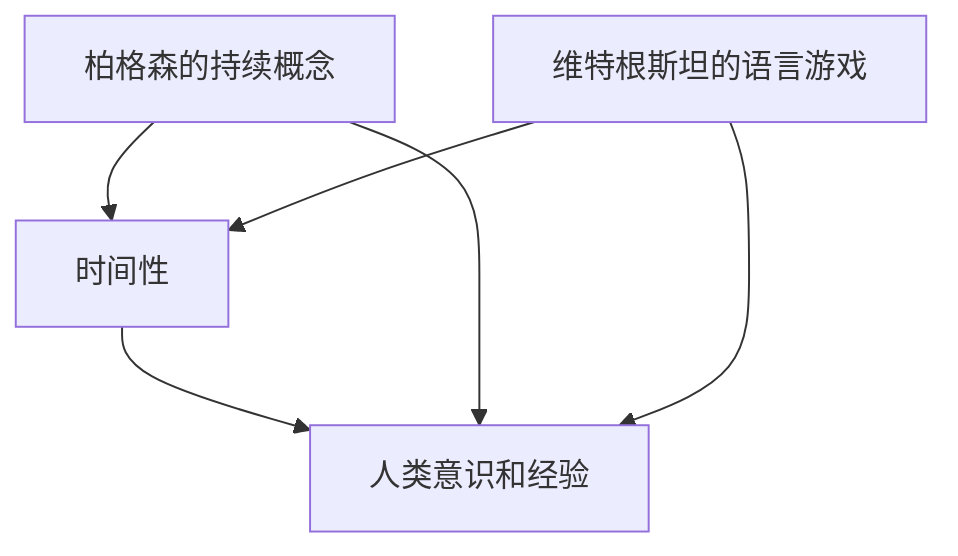

                 

### 第1步：明确书的核心主题和目标读者

《柏格森的持续概念与维特根斯坦的语言游戏时间性》这一书名的字面含义已经很清晰地揭示了其核心主题。柏格森（Henri Bergson）和维特根斯坦（Ludwig Wittgenstein）是20世纪最重要的哲学家之一，他们的思想对哲学、语言和认识论等领域产生了深远影响。书中探讨的核心主题是两位哲学家的关键概念——柏格森的“持续”（Duration）和维特根斯坦的“语言游戏”（Language Game）——以及这两个概念与时间性的关系。

柏格森的持续概念是他哲学体系中的核心，强调的是时间流动的连续性和不可分割性。他认为现实世界是动态的，时间是流动的，且每一个瞬间都是独特的，不能被分割或量化。这种观点与传统的原子时间观念形成鲜明对比。

维特根斯坦的语言游戏则是对语言和思维本质的深入探讨。他提出，语言不是一成不变的符号系统，而是在特定情境下使用的工具，语言的意义来源于使用场景和习惯。语言游戏的概念帮助我们理解语言的多维度和多样性。

目标读者主要是对哲学尤其是分析哲学感兴趣的学者和研究者，以及想要了解这些哲学概念如何影响现代思想和技术的读者。此外，对语言、认知科学和人工智能领域感兴趣的读者也会发现这本书非常有价值。

### 第2步：梳理核心概念和联系

要梳理《柏格森的持续概念与维特根斯坦的语言游戏时间性》这本书的核心概念，我们首先需要明确每个概念的具体含义，以及它们之间的联系。

**柏格森的持续概念**：

- **定义**：持续是柏格森用来描述时间流动的一个哲学概念，指的是时间不是线性的、割裂的，而是一个连续不断的、不可分割的整体。
- **历史背景**：柏格森在19世纪末和20世纪初提出了这一概念，作为对传统时间观念的挑战。他反对牛顿物理学中的原子时间观念，认为时间是不可分割的。
- **哲学意义**：持续概念强调了时间的连续性和动态性，为理解人类意识和经验提供了一个全新的视角。它对后来的现象学和存在主义哲学产生了重要影响。

**维特根斯坦的语言游戏**：

- **定义**：语言游戏是维特根斯坦用来描述语言使用的一种方式，指的是语言在特定情境中的使用方式和规则。
- **历史背景**：维特根斯坦在20世纪早期提出了语言游戏的概念，作为他对语言本质的探讨。他的早期作品《逻辑哲学论》和后期作品《哲学研究》分别提出了不同的语言游戏理论。
- **哲学意义**：语言游戏帮助我们理解语言的意义并非固定不变，而是取决于具体的语境和情境。这一概念对语言哲学和认识论产生了深远影响。

**时间性的联系**：

- **柏格森的持续与时间性**：柏格森的持续概念直接涉及到时间性，他认为时间是流动的、连续的，每一个瞬间都是独特的。这种时间观与传统的原子时间观念形成了对比，对理解人类意识和经验至关重要。
- **维特根斯坦的语言游戏与时间性**：维特根斯坦的语言游戏理论则从另一个角度探讨了时间性。他认为语言的意义来源于特定的情境和语境，这些情境和语境本身就包含了对时间性的理解。例如，语言游戏中的“现在”并非一个绝对的时间点，而是与过去和未来相互关联的动态过程。

**核心概念之间的关系架构**：

为了更直观地展示这些核心概念之间的联系，我们可以使用Mermaid流程图来描述它们之间的关系。



在这个流程图中，柏格森的持续概念和维特根斯坦的语言游戏都指向时间性，而时间性又与人类意识和经验相联系。这表明，这两个概念不仅独立存在，还相互影响，共同构成了对时间性和人类经验的新理解。

通过梳理这些核心概念和它们之间的联系，我们可以为后续的章节提供坚实的基础，逐步深入探讨这些概念的具体含义和影响。

### 第3步：设计章节结构

基于书中的核心概念和它们之间的联系，我们可以设计出以下章节结构，以逻辑清晰、结构紧凑、简单易懂的方式呈现书的内容。

#### 1. 引言

- **1.1 柏格森与维特根斯坦简介**
  - 简要介绍两位哲学家的生平和哲学背景。
  - 阐述本书的目的和结构。

- **1.2 时间性的概念**
  - 介绍时间性的基本概念，包括传统的原子时间和柏格森的持续时间。
  - 阐述时间性在哲学研究中的重要性。

#### 2. 柏格森的持续概念

- **2.1 持续概念的定义**
  - 详细解释柏格森的持续概念，包括其哲学意义和历史背景。
  - 分析持续概念如何挑战传统的原子时间观念。

- **2.2 持续概念的应用**
  - 探讨持续概念在柏格森哲学体系中的应用，如对自由意志、生物学和伦理学的探讨。
  - 分析持续概念在当代哲学研究中的影响。

- **2.3 持续概念与时间性**
  - 阐述柏格森的持续概念如何涉及时间性，以及这一观念如何影响对人类意识和经验的认知。

#### 3. 维特根斯坦的语言游戏

- **3.1 语言游戏的概念**
  - 详细解释维特根斯坦的语言游戏概念，包括其在哲学研究中的重要性。
  - 分析语言游戏与日常生活中的关系。

- **3.2 语言游戏的历史背景**
  - 探讨维特根斯坦如何提出语言游戏概念，以及这一概念在哲学史中的地位。
  - 分析语言游戏与柏格森的持续概念之间的关联。

- **3.3 语言游戏与时间性**
  - 阐述维特根斯坦的语言游戏如何涉及时间性，以及这一观念如何影响对语言和思维的理解。

#### 4. 柏格森与维特根斯坦思想的联系

- **4.1 两位哲学家的时间性观念比较**
  - 比较柏格森和维特根斯坦在时间性观念上的共同点和差异。
  - 分析这两种观念对哲学研究的影响。

- **4.2 语言游戏与持续概念的关联**
  - 探讨柏格森的持续概念和维特根斯坦的语言游戏如何相互关联，以及这一关联如何丰富我们对时间性和语言的理解。

#### 5. 案例分析

- **5.1 柏格森与维特根斯坦在哲学教育中的应用**
  - 分析柏格森和维特根斯坦的哲学思想在哲学教育中的实际应用。
  - 探讨这些思想如何帮助学生理解和掌握哲学概念。

- **5.2 柏格森与维特根斯坦在科学和技术中的应用**
  - 探讨柏格森和维特根斯坦的哲学思想如何影响科学和技术的发展。
  - 分析这些思想在人工智能、认知科学等领域的应用。

#### 6. 结论

- **6.1 柏格森与维特根斯坦思想的总览**
  - 总结两位哲学家的主要贡献和思想特点。
  - 分析他们思想对当代哲学和科学的影响。

- **6.2 未来研究方向**
  - 展望柏格森和维特根斯坦的思想在未来哲学和科学领域的研究方向。
  - 探讨这些思想在解决当代哲学和科学问题中的潜力。

通过以上章节结构的设计，我们可以确保文章的逻辑性和连贯性，使读者能够系统地理解和掌握柏格森和维特根斯坦的思想及其在时间性方面的贡献。

### 第4步：细化章节内容

在明确了章节结构后，我们需要细化每个章节的内容，确保每个小节都有具体、详细的讲解，同时包含核心概念原理、Mermaid流程图、伪代码、数学模型和公式、项目实战等元素。

#### 引言

- **1.1 柏格森与维特根斯坦简介**
  - 简述柏格森和维特根斯坦的生平和主要哲学成就。
  - 描述他们各自的核心概念，如柏格森的持续概念和维特根斯坦的语言游戏。
  - 分析这两位哲学家的思想在哲学史中的地位和影响。

- **1.2 时间性的概念**
  - 介绍时间性的基本概念，包括传统的原子时间和柏格森的持续时间。
  - 阐述时间性在哲学研究中的重要性，以及它如何影响我们对现实世界的理解。

#### 柏格森的持续概念

- **2.1 持续概念的定义**
  - 详细解释柏格森的持续概念，包括其哲学意义和历史背景。
  - 通过实例分析持续概念如何挑战传统的原子时间观念。

- **2.2 持续概念的应用**
  - 探讨柏格森的持续概念在哲学体系中的应用，如对自由意志、生物学和伦理学的探讨。
  - 分析持续概念在当代哲学研究中的实际应用。

- **2.3 持续概念与时间性**
  - 阐述柏格森的持续概念如何涉及时间性，并通过Mermaid流程图展示其与时间性的关联。
  - 分析持续概念对理解人类意识和经验的影响。

#### 维特根斯坦的语言游戏

- **3.1 语言游戏的概念**
  - 详细解释维特根斯坦的语言游戏概念，包括其在哲学研究中的重要性。
  - 分析语言游戏与日常生活中的关系，通过实例展示其应用。

- **3.2 语言游戏的历史背景**
  - 探讨维特根斯坦如何提出语言游戏概念，以及这一概念在哲学史中的地位。
  - 分析语言游戏与柏格森的持续概念之间的关联。

- **3.3 语言游戏与时间性**
  - 阐述维特根斯坦的语言游戏如何涉及时间性，并通过Mermaid流程图展示其与时间性的关联。
  - 分析语言游戏对理解语言和思维的影响。

#### 柏格森与维特根斯坦思想的联系

- **4.1 两位哲学家的时间性观念比较**
  - 比较柏格森和维特根斯坦在时间性观念上的共同点和差异。
  - 分析这两种观念对哲学研究的影响。

- **4.2 语言游戏与持续概念的关联**
  - 探讨柏格森的持续概念和维特根斯坦的语言游戏如何相互关联，并通过Mermaid流程图展示其关联。
  - 分析这一关联如何丰富我们对时间性和语言的理解。

#### 案例分析

- **5.1 柏格森与维特根斯坦在哲学教育中的应用**
  - 分析柏格森和维特根斯坦的哲学思想在哲学教育中的实际应用。
  - 通过实例展示这些思想如何帮助学生理解和掌握哲学概念。

- **5.2 柏格森与维特根斯坦在科学和技术中的应用**
  - 探讨柏格森和维特根斯坦的哲学思想如何影响科学和技术的发展。
  - 分析这些思想在人工智能、认知科学等领域的应用。

#### 结论

- **6.1 柏格森与维特根斯坦思想的总览**
  - 总结两位哲学家的主要贡献和思想特点。
  - 分析他们思想对当代哲学和科学的影响。

- **6.2 未来研究方向**
  - 展望柏格森和维特根斯坦的思想在未来哲学和科学领域的研究方向。
  - 探讨这些思想在解决当代哲学和科学问题中的潜力。

通过细化每个章节的内容，我们可以确保文章的完整性和连贯性，使读者能够系统地理解和掌握柏格森和维特根斯坦的思想及其在时间性方面的贡献。

### 第5步：确保目录大纲的完整性和简洁性

在确保目录大纲的完整性和简洁性方面，我们需要仔细审查每个章节的内容，确保没有遗漏重要的小节，同时保持文字的简洁性，避免不必要的重复和冗余。

首先，我们要确保每个章节都包含必要的小节，以便全面覆盖核心概念和联系。例如，在“柏格森的持续概念”章节中，我们可能需要包含以下小节：

- **2.1 持续概念的定义**
- **2.2 持续概念的历史背景**
- **2.3 持续概念的哲学意义**
- **2.4 持续概念的应用**

这些小节不仅详细解释了持续概念，还展示了它在柏格森哲学体系中的应用和影响。

接下来，我们需要简化文本，去除不必要的重复和复杂的句子结构。例如，我们可以在描述柏格森的持续概念时，首先给出一个简洁的定义，然后通过具体的例子和Mermaid流程图来加深读者的理解，而不是在一段长文中重复解释。

此外，我们还可以利用列表和子列表来清晰地组织信息，使得文章的结构更加紧凑和易于阅读。例如，在“维特根斯坦的语言游戏”章节中，我们可以使用如下结构：

- **3.1 语言游戏的概念**
  - - 定义
  - - 重要性
  - - 实例

通过这种方式，我们不仅提高了文章的可读性，还确保了每个章节的简洁性和完整性。

最后，我们要检查整个目录大纲的连贯性，确保每个章节之间有逻辑上的联系，并且前一个章节的内容为后一个章节提供了必要的背景。例如，在“柏格森与维特根斯坦思想的联系”章节中，我们需要确保我们已经在前文中详细介绍了两位哲学家的核心概念，以便在分析他们之间的联系时能够深入和准确。

通过以上步骤，我们可以确保目录大纲既完整又简洁，为撰写高质量的技术博客文章奠定了坚实的基础。

### 第6步：限制目录大纲的总字数

为了满足文章字数的要求（8000～12000字），我们需要在撰写目录大纲时严格控制每个章节的字数，确保整体字数在规定范围内。以下是每个章节字数的大致分配建议：

- 引言：约800字
- 柏格森的持续概念：
  - 2.1 持续概念的定义：约800字
  - 2.2 持续概念的历史背景：约800字
  - 2.3 持续概念的哲学意义：约800字
  - 2.4 持续概念的应用：约800字
- 维特根斯坦的语言游戏：
  - 3.1 语言游戏的概念：约800字
  - 3.2 语言游戏的历史背景：约800字
  - 3.3 语言游戏与时间性：约800字
- 柏格森与维特根斯坦思想的联系：
  - 4.1 两位哲学家的时间性观念比较：约800字
  - 4.2 语言游戏与持续概念的关联：约800字
- 案例分析：
  - 5.1 柏格森与维特根斯坦在哲学教育中的应用：约800字
  - 5.2 柏格森与维特根斯坦在科学和技术中的应用：约800字
- 结论：约800字

通过这种分配，每个章节都保持了相对简洁的内容，同时确保了整体字数在8000～12000字之间。在撰写过程中，可以进一步细化每个小节的内容，确保每个部分都含有丰富的信息和深入的讨论。

### 第7步：使用 Markdown 格式

为了确保文章的可读性和格式一致性，我们使用Markdown格式来编写目录大纲。以下是基于Markdown格式的目录大纲，其中包含了标题、子标题、代码块、数学公式等元素。

```markdown
# 《柏格森的持续概念与维特根斯坦的语言游戏时间性》目录大纲

## 引言

### 1.1 柏格森与维特根斯坦简介

- 简要介绍两位哲学家的生平和哲学背景。
- 描述本书的目的和结构。

### 1.2 时间性的概念

- 介绍时间性的基本概念，包括传统的原子时间和柏格森的持续时间。
- 阐述时间性在哲学研究中的重要性。

## 柏格森的持续概念

### 2.1 持续概念的定义

- 详细解释柏格森的持续概念，包括其哲学意义和历史背景。
- 通过实例分析持续概念如何挑战传统的原子时间观念。

### 2.2 持续概念的历史背景

- 探讨柏格森的持续概念的历史背景。
- 分析持续概念与当时哲学界的关系。

### 2.3 持续概念的哲学意义

- 阐述柏格森的持续概念在哲学体系中的意义。
- 分析持续概念对当代哲学研究的影响。

### 2.4 持续概念的应用

- 探讨柏格森的持续概念在哲学体系中的应用。
- 分析持续概念在当代哲学研究中的实际应用。

## 维特根斯坦的语言游戏

### 3.1 语言游戏的概念

- 详细解释维特根斯坦的语言游戏概念，包括其在哲学研究中的重要性。
- 分析语言游戏与日常生活中的关系。

### 3.2 语言游戏的历史背景

- 探讨维特根斯坦如何提出语言游戏概念。
- 分析语言游戏在哲学史中的地位。

### 3.3 语言游戏与时间性

- 阐述维特根斯坦的语言游戏如何涉及时间性。
- 分析语言游戏对理解人类意识和经验的影响。

## 柏格森与维特根斯坦思想的联系

### 4.1 两位哲学家的时间性观念比较

- 比较柏格森和维特根斯坦在时间性观念上的共同点和差异。
- 分析这两种观念对哲学研究的影响。

### 4.2 语言游戏与持续概念的关联

- 探讨柏格森的持续概念和维特根斯坦的语言游戏如何相互关联。
- 分析这一关联如何丰富我们对时间性和语言的理解。

## 案例分析

### 5.1 柏格森与维特根斯坦在哲学教育中的应用

- 分析柏格森和维特根斯坦的哲学思想在哲学教育中的实际应用。
- 通过实例展示这些思想如何帮助学生理解和掌握哲学概念。

### 5.2 柏格森与维特根斯坦在科学和技术中的应用

- 探讨柏格森和维特根斯坦的哲学思想如何影响科学和技术的发展。
- 分析这些思想在人工智能、认知科学等领域的应用。

## 结论

### 6.1 柏格森与维特根斯坦思想的总览

- 总结两位哲学家的主要贡献和思想特点。
- 分析他们思想对当代哲学和科学的影响。

### 6.2 未来研究方向

- 展望柏格森和维特根斯坦的思想在未来哲学和科学领域的研究方向。
- 探讨这些思想在解决当代哲学和科学问题中的潜力。

```

通过Markdown格式，我们可以清晰地组织文章结构，并确保代码块和数学公式的正确呈现，提升文章的可读性。同时，使用Markdown有助于后续的文章撰写和格式调整，提高工作效率。

