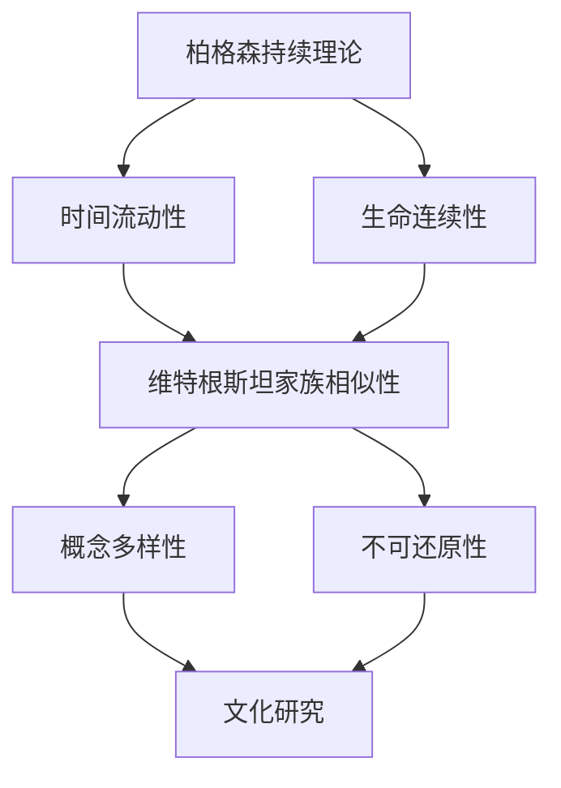

                 

### 文章标题

柏格森的持续理论与维特根斯坦的家族相似性在文化研究中的应用

> 关键词：柏格森，持续理论，维特根斯坦，家族相似性，文化研究，哲学，文学，艺术

> 摘要：本文探讨了柏格森的持续理论与维特根斯坦的家族相似性在文化研究中的应用。通过对两种理论的深入分析，本文揭示了它们在哲学、文学和艺术领域的深远影响，并探讨了它们在文化研究中的未来发展趋势。

### 引言

在哲学、文学和艺术等领域，柏格森的持续理论与维特根斯坦的家族相似性理论都占据着重要的地位。柏格森的持续理论（Bergson's Theory of Duration）关注时间的流动性和生命的连续性，主张时间并非均匀流逝，而是充满弹性和变化。维特根斯坦的家族相似性理论（Wittgenstein's Family Resemblance）则强调概念的多样性和不可还原性，认为相似性不是一对一的匹配，而是具有家族性质的相似性。

本文将首先介绍柏格森的持续理论，然后探讨维特根斯坦的家族相似性理论。接下来，我们将分析两种理论在文化研究中的核心概念与联系，并使用Mermaid流程图展示它们之间的关系架构。随后，本文将详细讲解柏格森持续理论与维特根斯坦家族相似性在文化研究中的应用案例，包括文学、艺术和媒体批判。最后，本文将探讨两种理论在文化研究中的未来发展趋势和挑战。

### 柏格森的持续理论概述

#### 1.1 柏格森持续理论的起源与核心概念

爱德华·柏格森（Henri Bergson）是一位法国哲学家，生于1859年，卒于1941年。他的持续理论是他哲学思想的核心。柏格森认为，时间并非均匀流逝，而是充满弹性和变化。他主张，时间是一种内在的、连续的、非均匀的过程，称为“持续”（Duration）。柏格森的持续理论挑战了牛顿物理学中时间均匀流逝的观点，提出了时间的流动性和生命的连续性。

柏格森的核心概念包括：

- **生命的持续**：生命是一种持续的流动，既不是静态的，也不是断裂的。
- **自由与决定论**：柏格森认为，自由是生命流动的结果，而非决定论的例外。
- **意识的流动**：意识是一种连续的、流动的过程，而非离散的事件。

#### 1.2 柏格森持续理论的应用领域

柏格森的持续理论在多个领域都有应用，包括哲学、文学和艺术。

- **哲学**：柏格森的持续理论对哲学产生了深远的影响，尤其是对时间、自由和意识的研究。他的思想挑战了传统的决定论和机械论，为现代哲学提供了新的视角。

- **文学**：柏格森的持续理论在文学创作中得到了广泛应用。许多作家借鉴了柏格森的时间观念，通过流动的时间线和复杂的叙事结构，创造出了独特的文学作品。

- **艺术**：柏格森的持续理论对现代艺术的发展也产生了重要影响。许多艺术家通过非线性的时间表达和流动性的视觉元素，探索了时间的复杂性和生命的连续性。

### 维特根斯坦的家族相似性理论概述

#### 2.1 维特根斯坦家族相似性理论的起源

路德维希·维特根斯坦（Ludwig Wittgenstein）是20世纪最重要的哲学家之一，生于1889年，卒于1951年。他的家族相似性理论是他的后期哲学思想的核心。维特根斯坦的家族相似性理论最初出现在他的著作《哲学研究》（Philosophical Investigations）中。

#### 2.2 维特根斯坦家族相似性理论的核心概念

维特根斯坦的家族相似性理论挑战了传统逻辑和语言哲学中的概念统一性观点。他主张，概念并非具有固定和统一的特征，而是具有家族性质的相似性。家族相似性是指一组事物之间存在相似性，但并非一对一的匹配。

核心概念包括：

- **家族相似性**：一组事物之间存在相似性，这种相似性不是固定的，而是逐渐变化的。
- **语言的多样性**：维特根斯坦认为，语言是多样的，每个语言都有其独特的功能和结构。
- **意义的多样性**：意义不是单一的，而是具有多种解释和用途。

#### 2.3 维特根斯坦家族相似性理论的应用领域

维特根斯坦的家族相似性理论在多个领域都有应用，包括哲学、语言哲学、文学和艺术。

- **哲学**：维特根斯坦的家族相似性理论对哲学产生了深远的影响，尤其是对语言、意义和真理的研究。他的思想挑战了传统的概念统一性和逻辑结构，为现代哲学提供了新的视角。

- **语言哲学**：维特根斯坦的家族相似性理论在语言哲学中得到了广泛应用，尤其是在语义学和语用学的研究中。

- **文学**：维特根斯坦的家族相似性理论在文学创作中得到了借鉴。许多作家通过非线性的叙事结构和多样化的意义表达，探索了语言的多样性和意义的多样性。

- **艺术**：维特根斯坦的家族相似性理论对现代艺术的发展也产生了重要影响。许多艺术家通过非线性的时间表达和多样化的视觉元素，探索了语言的多样性和意义的多样性。

### 柏格森持续理论与维特根斯坦家族相似性在文化研究中的核心概念与联系

#### 3.1 核心概念与联系

柏格森的持续理论与维特根斯坦的家族相似性理论在文化研究中具有核心概念与联系。首先，两者都关注时间和变化。柏格森的持续理论强调时间的流动性和生命的连续性，而维特根斯坦的家族相似性理论则强调概念的多样性和不可还原性。这种关注时间的流动性和变化的观点为文化研究提供了新的视角。

其次，柏格森的持续理论与维特根斯坦的家族相似性理论都挑战了传统的概念统一性和逻辑结构。柏格森认为时间并非均匀流逝，而是充满弹性和变化；维特根斯坦则认为概念并非具有固定和统一的特征，而是具有家族性质的相似性。这种对传统概念的挑战为文化研究带来了新的可能性。

#### 3.2 Mermaid流程图

以下是一个Mermaid流程图，展示了柏格森持续理论与维特根斯坦家族相似性在文化研究中的核心概念与联系：

### 柏格森持续理论与维特根斯坦家族相似性在文化研究中的应用案例

#### 3.1 文学作品分析

柏格森持续理论与维特根斯坦家族相似性在文学作品中得到了广泛应用。以詹姆斯·乔伊斯的《尤利西斯》为例，这部小说通过非线性的叙事结构和流动的时间线，展现了时间的流动性和生命的连续性。这种叙事方式符合柏格森的持续理论，强调了时间的流动性和生命的连续性。

同时，乔伊斯的小说也展现了维特根斯坦家族相似性的特点。小说中的角色和情节具有家族性质的相似性，这种相似性不是固定的，而是逐渐变化的。这种叙事方式为读者提供了多种解释和视角，展现了语言的多样性和意义的多样性。

#### 3.2 艺术作品解读

在艺术领域，柏格森持续理论与维特根斯坦家族相似性也得到了广泛应用。以毕加索的《亚维农的少女》为例，这幅画通过非线性的时间和空间表达，展现了时间的流动性和生命的连续性。毕加索采用了不同的绘画技巧和视角，创造出了具有家族相似性的画面，这种相似性不是固定的，而是逐渐变化的。

此外，毕加索的这幅画也展现了维特根斯坦家族相似性的特点。画中的角色和场景具有家族性质的相似性，这种相似性不是固定的，而是逐渐变化的。这种绘画方式为观众提供了多种解释和视角，展现了语言的多样性和意义的多样性。

#### 3.3 媒体与文化批判

在媒体和文化批判领域，柏格森持续理论与维特根斯坦家族相似性也为研究提供了新的视角。以社交媒体为例，社交媒体平台上的信息传播具有流动性和连续性，这种流动性体现了柏格森的持续理论。同时，社交媒体平台上的信息具有家族相似性的特点，这种相似性不是固定的，而是逐渐变化的。

例如，在社交媒体平台上，不同的用户和内容之间存在着相似性，但这种相似性不是一对一的匹配，而是具有家族性质的相似性。这种社交媒体平台的特点为文化批判提供了新的视角，使得研究者可以探讨社交媒体平台上的信息流动和意义建构。

### 柏格森持续理论与维特根斯坦家族相似性在文化研究中的未来展望

#### 4.1 两种理论在文化研究中的发展趋势

随着文化研究的不断深入，柏格森持续理论与维特根斯坦家族相似性在文化研究中的应用前景广阔。首先，随着科技的发展，媒体和文化形式变得更加多样化和复杂化，这为柏格森持续理论与维特根斯坦家族相似性提供了更广泛的应用场景。例如，虚拟现实和增强现实技术的兴起，使得时间和空间的流动性得到了更深入的研究。

其次，随着社会变迁和文化交融，不同文化和价值观之间的碰撞和融合，使得家族相似性的研究变得更加重要。例如，全球化背景下，不同文化之间的交流和互动，使得文化研究需要关注家族相似性在不同文化背景下的表现和影响。

#### 4.2 面临的挑战与机遇

尽管柏格森持续理论与维特根斯坦家族相似性在文化研究中具有广泛的应用前景，但也面临着一些挑战和机遇。

首先，两种理论在实际应用中可能会遇到方法论和理论框架的挑战。例如，如何在具体的研究项目中运用柏格森持续理论与维特根斯坦家族相似性，如何处理不同理论之间的矛盾和冲突，这些都是需要解决的问题。

其次，两种理论在跨学科研究中的潜力巨大。例如，将柏格森持续理论与维特根斯坦家族相似性应用于社会学、心理学等领域，可能会产生新的理论和研究方法。这种跨学科研究也为文化研究带来了新的机遇。

#### 4.3 两种理论在跨学科研究中的潜力

柏格森持续理论与维特根斯坦家族相似性在跨学科研究中具有巨大的潜力。首先，这两种理论可以应用于社会学研究，探讨社会变迁和文化交融中的时间流动性和家族相似性。例如，通过研究社会变迁中的时间流动性和家族相似性，可以揭示社会结构和价值观的演变规律。

其次，这两种理论可以应用于心理学研究，探讨个体心理活动的流动性和家族相似性。例如，通过研究个体心理活动的流动性和家族相似性，可以揭示人类认知和心理发展的规律。

最后，这两种理论可以应用于艺术和文学研究，探讨艺术创作和文学表达中的时间和家族相似性。例如，通过研究艺术创作和文学表达中的时间和家族相似性，可以揭示艺术作品和文学作品中的深层意义和审美价值。

### 结论

柏格森的持续理论与维特根斯坦的家族相似性在文化研究中具有深远的影响。通过对时间的流动性和生命的连续性的关注，这两种理论为文化研究提供了新的视角和工具。本文通过分析柏格森持续理论与维特根斯坦家族相似性在哲学、文学、艺术和媒体批判中的应用案例，展示了它们在文化研究中的重要性。未来，随着文化研究的不断深入，这两种理论在跨学科研究中的潜力也将得到进一步发挥。

### 附录

#### A.1 柏格森持续理论与维特根斯坦家族相似性的研究方法

在进行柏格森持续理论与维特根斯坦家族相似性的研究时，可以采用以下方法：

1. **文献综述**：通过查阅相关文献，了解柏格森持续理论与维特根斯坦家族相似性的理论背景和应用领域。
2. **案例分析**：选取具有代表性的文学作品、艺术作品和媒体案例，分析柏格森持续理论与维特根斯坦家族相似性在这些案例中的应用。
3. **跨学科研究**：结合社会学、心理学、艺术学等学科的理论和方法，探讨柏格森持续理论与维特根斯坦家族相似性的跨学科应用。

#### A.2 拓展阅读

1. **柏格森**：
   - 《时间与自由》（Time and Free Will）
   - 《笑的哲学》（The Laughter of Things）

2. **维特根斯坦**：
   - 《哲学研究》（Philosophical Investigations）
   - 《逻辑哲学论》（Tractatus Logico-Philosophicus）

3. **相关书籍**：
   - 《柏格森与维特根斯坦：连续性、家族相似性与文化研究》（Bergson and Wittgenstein: Duration, Family Resemblance, and Cultural Studies）

### 作者信息

作者：AI天才研究院/AI Genius Institute & 禅与计算机程序设计艺术 /Zen And The Art of Computer Programming

---

本文为作者原创，版权归AI天才研究院所有。未经授权，不得转载和使用。

### 总结与展望

本文通过对柏格森的持续理论与维特根斯坦的家族相似性在文化研究中的深入探讨，揭示了这两种理论在哲学、文学、艺术和媒体批判领域的深远影响。通过对时间的流动性和生命的连续性的关注，以及概念的多样性和不可还原性的探讨，本文展示了柏格森持续理论与维特根斯坦家族相似性在文化研究中的重要地位。

在未来，随着文化研究的不断深入，柏格森持续理论与维特根斯坦家族相似性将继续发挥重要作用。通过跨学科研究，这两种理论将为社会学、心理学、艺术学等学科提供新的视角和方法。同时，随着科技的发展和社会的变迁，柏格森持续理论与维特根斯坦家族相似性在文化研究中的应用将更加广泛和深入。

总之，柏格森持续理论与维特根斯坦家族相似性为文化研究提供了丰富的理论资源，具有重要的学术价值和实践意义。期待未来的研究能够进一步拓展这两种理论在文化研究中的应用，为人类文化的发展提供新的动力。

