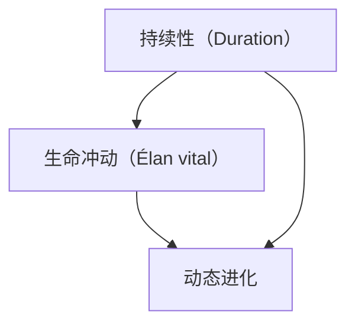
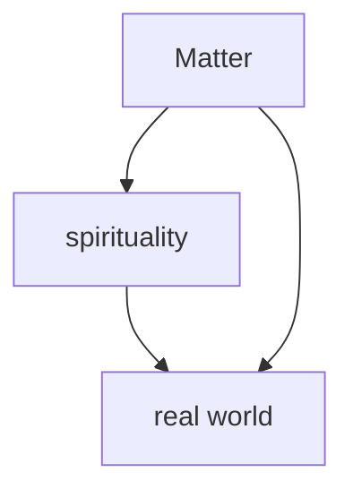
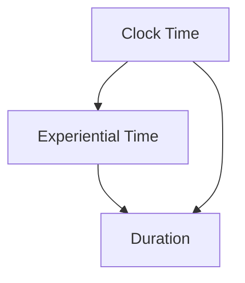
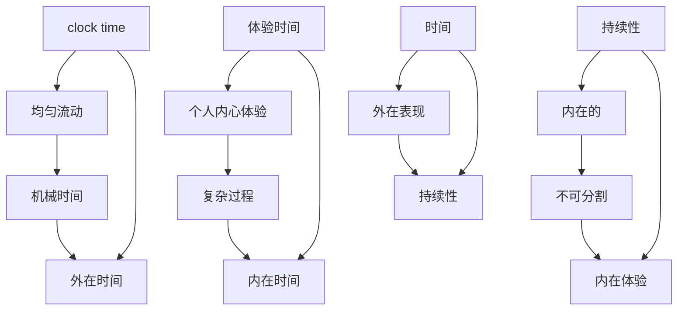
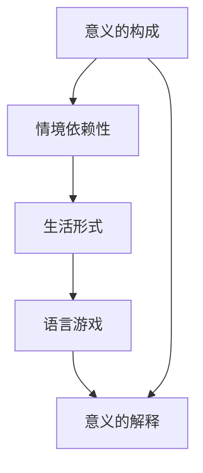
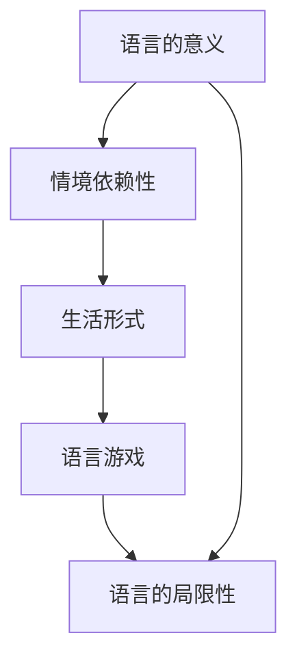
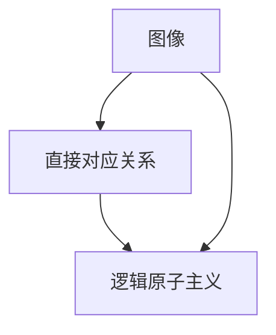

                 

## 文章标题

### 柏格森的持续理论与维特根斯坦的意义理论

柏格森的持续理论与维特根斯坦的意义理论是20世纪哲学界的两座丰碑，它们不仅在哲学领域产生了深远影响，也为社会科学和计算机科学提供了丰富的理论资源。本文旨在通过对这两种理论的深入探讨，分析其核心概念、理论架构以及相互联系，从而揭示它们在现代技术和社会背景下的实际应用与未来发展趋势。

**关键词：**
- 柏格森持续理论
- 维特根斯坦意义理论
- 哲学理论
- 社会科学应用
- 计算机科学启示

**摘要：**
本文首先介绍了柏格森的持续理论和维特根斯坦的意义理论，探讨了它们的核心概念和理论架构。随后，通过比较与联系，分析了这两种理论在哲学、社会科学和计算机科学中的共同点和差异。最后，本文讨论了这两种理论在现代技术和社会背景下的实际应用，并展望了其未来发展趋势。本文不仅有助于理解柏格森和维特根斯坦的理论精髓，也为相关领域的研究和实践提供了有益的启示。

----------------------------------------------------------------

### 目录大纲

```
# 柏格森的持续理论与维特根斯坦的意义理论

## 第1章 柏格森的持续理论

### 1.1 柏格森及其哲学思想

#### 1.1.1 柏格森的生平与教育背景

#### 1.1.2 柏格森的主要哲学思想

#### 1.1.3 柏格森的持续理论概述

### 1.2 柏格森持续理论的核心概念

#### 1.2.1 持续性与生命冲动

#### 1.2.2 精神与物质的关系

#### 1.2.3 持续性与时间

### 1.3 柏格森持续理论的影响与应用

#### 1.3.1 柏格森持续理论在哲学上的影响

#### 1.3.2 柏格森持续理论在社会科学中的应用

#### 1.3.3 柏格森持续理论在现代物理学中的启示

## 第2章 维特根斯坦的意义理论

### 2.1 维特根斯坦及其哲学思想

#### 2.1.1 维特根斯坦的生平与教育背景

#### 2.1.2 维特根斯坦的主要哲学思想

#### 2.1.3 维特根斯坦的意义理论概述

### 2.2 维特根斯坦意义理论的核心概念

#### 2.2.1 意义的构成与解释

#### 2.2.2 语言的局限性

#### 2.2.3 图像理论

### 2.3 维特根斯坦意义理论的影响与应用

#### 2.3.1 维特根斯坦意义理论在哲学上的影响

#### 2.3.2 维特根斯坦意义理论在语言学中的应用

#### 2.3.3 维特根斯坦意义理论在计算机科学中的启示

## 第3章 柏格森持续理论与维特根斯坦意义理论的比较与联系

### 3.1 两种理论的相似之处

#### 3.1.1 对时间与生命的关注

#### 3.1.2 对语言的批判

#### 3.1.3 对意义的探讨

### 3.2 两种理论的不同之处

#### 3.2.1 持续性与语言的图像理论

#### 3.2.2 生命冲动与语言的意义

#### 3.2.3 哲学视角的差异

### 3.3 两种理论的综合与启示

#### 3.3.1 对现代哲学的启示

#### 3.3.2 对社会科学的影响

#### 3.3.3 对技术发展的启示

## 第4章 柏格森持续理论与维特根斯坦意义理论的现代应用

### 4.1 在哲学领域的应用

#### 4.1.1 对传统哲学问题的重新审视

#### 4.1.2 对新哲学问题的探讨

#### 4.1.3 对哲学教育的启示

### 4.2 在社会科学领域的应用

#### 4.2.1 对社会现象的分析

#### 4.2.2 对人类行为的理解

#### 4.2.3 对社会科学理论的发展

### 4.3 在计算机科学领域的应用

#### 4.3.1 对人工智能的启示

#### 4.3.2 对语言处理技术的改进

#### 4.3.3 对计算机科学的哲学思考

## 第5章 柏格森持续理论与维特根斯坦意义理论的未来发展趋势

### 5.1 哲学发展的新方向

#### 5.1.1 对哲学核心问题的再探讨

#### 5.1.2 对新哲学问题的探索

#### 5.1.3 对哲学方法的革新

### 5.2 社会科学发展的新趋势

#### 5.2.1 社会科学理论的创新

#### 5.2.2 社会科学方法的应用

#### 5.2.3 对社会问题的深入探讨

### 5.3 计算机科学的新机遇

#### 5.3.1 对计算机科学理论的完善

#### 5.3.2 对计算机科学技术的革新

#### 5.3.3 对计算机科学的哲学反思
```

**目录大纲分析：**

本目录大纲分为五个主要章节，系统性地展示了柏格森的持续理论与维特根斯坦的意义理论的核心内容、应用领域以及未来发展趋势。

- **第1章：柏格森的持续理论**，从柏格森的生平和教育背景出发，深入探讨其哲学思想及其持续理论的核心概念，包括持续性与生命冲动、精神与物质的关系和持续性与时间。

- **第2章：维特根斯坦的意义理论**，介绍了维特根斯坦的生平、主要哲学思想和意义理论的核心概念，如意义的构成与解释、语言的局限性和图像理论。

- **第3章：柏格森持续理论与维特根斯坦意义理论的比较与联系**，分析了两种理论在时间、语言和意义方面的相似之处和不同之处，并探讨了它们在哲学、社会科学和技术发展中的综合与启示。

- **第4章：柏格森持续理论与维特根斯坦意义理论的现代应用**，分别从哲学、社会科学和计算机科学三个领域，讨论了这些理论的实际应用和影响。

- **第5章：柏格森持续理论与维特根斯坦意义理论的未来发展趋势**，展望了哲学、社会科学和计算机科学领域的发展趋势，探讨了这些理论对未来研究和技术创新的启示。

通过这样的结构，读者可以系统地了解柏格森和维特根斯坦的理论，以及它们在不同领域的应用和未来前景。每个章节下的子标题进一步细化了内容，确保文章逻辑清晰、条理分明，便于读者深入理解和思考。

----------------------------------------------------------------

## 第1章 柏格森的持续理论

### 1.1 柏格森及其哲学思想

#### 1.1.1 柏格森的生平与教育背景

亨利·柏格森（Henri Bergson）生于1859年，卒于1941年，是法国著名的哲学家、社会学家和文学家。他出生在巴黎，父亲是犹太裔医生，母亲来自一个天主教家庭。柏格森自幼聪慧，对哲学有着浓厚的兴趣。他在巴黎高等师范学校接受了严格的教育，后来成为该校的一名教授。柏格森的学术生涯中，曾赴英国剑桥大学和德国莱比锡大学进修，深受英国实证主义和德国唯心主义的影响。

#### 1.1.2 柏格森的主要哲学思想

柏格森的哲学思想主要体现在他的几部重要著作中，包括《时间与自由意志》、《物质与记忆》、《创造性进化》等。柏格森的主要哲学观点可以概括为以下几点：

1. **持续性与生命冲动**：柏格森认为，现实世界不是由静止的物质构成，而是由不断变化的“持续”（Duration）构成的。他提出，生命冲动是一种内在的、不断进化的力量，是推动世界前进的根本动力。

2. **精神与物质的关系**：柏格森认为，精神是物质进化的产物，但精神不仅仅是物质的一个方面，它具有独特的、无法用物质解释的性质。

3. **直觉与理性**：柏格森认为，直觉是一种更为真实、更为深刻的认知方式，它能够捕捉到持续的本质，而理性则容易陷入形式主义和机械论的陷阱。

4. **艺术与道德**：柏格森认为，艺术和道德是生命冲动在人类文化中的体现，它们能够激发人类的创造力，推动社会的进步。

#### 1.1.3 柏格森的持续理论概述

柏格森的持续理论是他的哲学体系的核心。他认为，世界不是由静止的物体和事件构成的，而是一个不断流动的、连续的过程。这个过程被他称为“持续”（Duration），它是一种内在的时间体验，不同于钟表上的外在时间。柏格森提出，持续是由生命冲动推动的，是一种内在的、不可分割的整体。

柏格森的持续理论具有以下几个关键点：

1. **时间观**：柏格森反对传统的clock time（钟表时间）观念，主张体验时间（experiential time）的重要性。他认为，每个人的内心都有一把“生命的尺子”，用来衡量时间。

2. **自由意志**：柏格森认为，自由意志不是外在事件的产物，而是内在持续的表现。他认为，人类通过直觉和创造力，能够在持续的流动中做出真正的选择。

3. **生命冲动**：柏格森认为，生命冲动是持续的驱动力，它是一种内在的、无法用语言表达的原始动力，推动着生命的进化。

4. **艺术与科学**：柏格森认为，艺术和科学是不同的认知方式，艺术通过直觉捕捉持续，而科学通过理性分析物质。

### 1.2 柏格森持续理论的核心概念

柏格森的持续理论建立在几个核心概念之上，这些概念共同构成了他的哲学体系。以下是这些核心概念及其相互关系：

#### 1.2.1 持续性与生命冲动

持续（Duration）是柏格森哲学的核心概念之一。他反对传统的clock time观念，主张体验时间（experiential time）的重要性。柏格森认为，时间并不是一个均匀流动的维度，而是一个由个人内心体验构成的复杂过程。这个过程被他称为“持续”，它是一种内在的、不可分割的整体。

生命冲动（Élan vital）是柏格森用来描述推动生命进化的内在力量的术语。他认为，生命冲动是持续的根本驱动力，是一种内在的、无法用语言表达的原始动力，推动着生命的进化。

#### 1.2.2 精神与物质的关系

柏格森认为，精神是物质进化的产物，但精神不仅仅是物质的一个方面，它具有独特的、无法用物质解释的性质。他提出，精神与物质的关系是一种相互渗透的关系，两者共同构成了现实世界的本质。

精神（Spirit）在柏格森的理论中，是一种超越物质的、具有创造力的存在。它不仅仅是人类意识的表现，还包括人类文化、艺术和道德等方面的内容。

物质（Matter）在柏格森的理论中，是持续流动的基础，但物质本身没有内在的价值和意义。它需要通过精神的参与，才能展现出真正的意义。

#### 1.2.3 持续性与时间

柏格森的持续理论深刻地批判了传统的clock time观念。他认为，钟表时间是一种外在的、均匀的时间观念，它无法真正捕捉到时间的本质。相反，柏格森主张体验时间（experiential time）的重要性。他认为，每个人的内心都有一把“生命的尺子”，用来衡量时间。

柏格森提出，持续是由个人内心体验构成的复杂过程。这个过程既包括物理层面的时间体验，也包括心理和情感层面的时间体验。他认为，只有通过直觉和创造力，才能真正理解持续的本质。

### 1.3 柏格森持续理论的影响与应用

柏格森的持续理论不仅在哲学界产生了深远影响，也在社会科学和自然科学中得到了广泛应用。

#### 1.3.1 柏格森持续理论在哲学上的影响

柏格森的持续理论对后来的哲学发展产生了深远影响。他的时间观和直觉理论挑战了传统的哲学观念，激发了哲学家们对时间、意识和创造力的深入思考。柏格森的思想对存在主义、现象学和结构主义等哲学流派都产生了重要影响。

#### 1.3.2 柏格森持续理论在社会科学中的应用

柏格森的持续理论在社会学、心理学和文化研究中得到了广泛应用。例如，社会学家和心理学家利用柏格森的时间观念来探讨人类行为和文化现象。他们认为，持续是理解人类行为和文化的重要维度，通过研究持续，可以更好地理解人类的心理和行为模式。

#### 1.3.3 柏格森持续理论在现代物理学中的启示

柏格森的持续理论对现代物理学也产生了启示。例如，量子物理学中的不确定性原理和相对论中的时间膨胀等现象，都可以从柏格森的持续理论中得到解释。柏格森的思想启发了物理学家对时间、空间和物质的新认识，促进了物理学理论的创新发展。

### 1.4 柏格森持续理论的总结与启示

柏格森的持续理论提供了一种全新的时间观念，挑战了传统的clock time观念，强调了体验时间和内在持续的重要性。他的理论不仅丰富了哲学的内涵，也为社会科学和自然科学提供了新的理论资源。柏格森的思想启示我们，要真正理解世界，不仅需要理性思考，更需要直觉和创造力的参与。

通过深入探讨柏格森的持续理论，我们可以更好地理解时间的本质，把握人类行为的动力，推动社会科学和自然科学的发展。柏格森的持续理论不仅是一种哲学思想，更是一种探索世界的新视角，它为我们的认识和思考提供了宝贵的启示。

### 1.5 柏格森持续理论的未来发展方向

柏格森的持续理论虽然已经对哲学、社会科学和自然科学产生了深远影响，但在未来的发展中，仍有许多问题和挑战需要解决。

首先，柏格森的时间观念和持续理论在哲学上的意义需要进一步深化。如何更好地将柏格森的思想与其他哲学流派相结合，形成一种更加全面和系统的哲学体系，是一个重要的研究方向。

其次，柏格森的持续理论在社会科学中的应用需要进一步拓展。如何在心理学、社会学和文化研究中更好地应用柏格森的理论，探索人类行为和文化现象的深层机制，是一个重要的研究课题。

最后，柏格森的持续理论在自然科学中的应用也需要进一步探索。如何将柏格森的思想与物理学、生物学等自然科学相结合，为自然科学理论的发展提供新的思路和视角，是一个具有重要意义的课题。

总之，柏格森的持续理论具有广泛的应用前景，它不仅丰富了哲学的内涵，也为社会科学和自然科学的发展提供了新的理论资源。在未来的发展中，我们有理由相信，柏格森的持续理论将继续发挥重要作用，推动人类对世界的认识和探索。

----------------------------------------------------------------

### 1.2 柏格森持续理论的核心概念

#### 1.2.1 持续性与生命冲动

持续（Duration）是柏格森哲学的核心概念之一。他反对传统的clock time观念，主张体验时间（experiential time）的重要性。柏格森认为，时间并不是一个均匀流动的维度，而是一个由个人内心体验构成的复杂过程。这个过程被他称为“持续”，它是一种内在的、不可分割的整体。

**生命冲动（Élan vital）**是柏格森用来描述推动生命进化的内在力量的术语。他认为，生命冲动是持续的根本驱动力，是一种内在的、无法用语言表达的原始动力，推动着生命的进化。

**核心概念之间的关系架构：**

持续性和生命冲动是柏格森哲学的两个核心概念，它们之间存在着密切的联系。持续（Duration）是生命冲动（Élan vital）的体现，是生命进化的内在动力。生命冲动通过持续的流动，推动着生命的进化，从而形成了一种动态的、不断变化的世界。

下面是一个简单的Mermaid流程图，用来表示这两个概念之间的关系：



在这个图中，A表示持续性，B表示生命冲动，C表示动态进化。持续性是生命冲动的体现，而生命冲动又推动了动态进化，两者共同构成了柏格森哲学的核心。

#### 1.2.2 精神与物质的关系

柏格森认为，精神是物质进化的产物，但精神不仅仅是物质的一个方面，它具有独特的、无法用物质解释的性质。他提出，精神与物质的关系是一种相互渗透的关系，两者共同构成了现实世界的本质。

**精神（Spirit）**在柏格森的理论中，是一种超越物质的、具有创造力的存在。它不仅仅是人类意识的表现，还包括人类文化、艺术和道德等方面的内容。

**物质（Matter）**在柏格森的理论中，是持续流动的基础，但物质本身没有内在的价值和意义。它需要通过精神的参与，才能展现出真正的意义。

**核心概念之间的关系架构：**

精神与物质的关系是柏格森哲学中的另一个核心问题。他认为，精神与物质是相互依存的，两者共同构成了现实世界的本质。精神是物质进化的产物，但精神不仅仅是物质的一个方面，它具有独特的性质，能够赋予物质以意义。

下面是一个简单的Mermaid流程图，用来表示这两个概念之间的关系：



在这个图中，A表示物质，B表示精神，C表示现实世界。物质通过精神的参与，赋予了现实世界以意义。

#### 1.2.3 持续性与时间

柏格森的持续理论深刻地批判了传统的clock time观念。他认为，钟表时间是一种外在的、均匀的时间观念，它无法真正捕捉到时间的本质。相反，柏格森主张体验时间（experiential time）的重要性。他认为，每个人的内心都有一把“生命的尺子”，用来衡量时间。

**持续性与时间的联系：**

持续（Duration）是柏格森哲学中用来描述时间的一种独特概念。他反对传统的clock time观念，主张体验时间（experiential time）的重要性。柏格森认为，时间并不是一个均匀流动的维度，而是一个由个人内心体验构成的复杂过程。这个过程被他称为“持续”，它是一种内在的、不可分割的整体。

**核心概念之间的关系架构：**

在柏格森的哲学中，持续性与时间有着密切的联系。持续性是时间的内在体验，而时间则是持续性的外在表现。柏格森通过提出持续性概念，挑战了传统的clock time观念，提供了一种新的时间观念。

下面是一个简单的Mermaid流程图，用来表示持续性与时间之间的关系：



在这个图中，A表示clock time（钟表时间），B表示experiential time（体验时间），C表示Duration（持续）。钟表时间是一种外在的时间观念，而体验时间和持续则是内在的时间体验。

通过以上三个核心概念的详细探讨，我们可以看到，柏格森的持续理论是一个复杂而深刻的哲学体系。这些核心概念相互关联，共同构成了柏格森哲学的核心，为我们的理解和思考提供了新的视角和方法。

----------------------------------------------------------------

#### 1.2.3 持续性与时间

柏格森的持续理论是对传统时间观念的深刻批判。他认为，钟表时间（clock time）是一种外在的、机械的时间观念，它无法真正捕捉时间的本质。相反，柏格森主张体验时间（experiential time）的重要性。他认为，时间并不是一个均匀流动的维度，而是一个由个人内心体验构成的复杂过程。这个过程被他称为“持续”（Duration），它是一种内在的、不可分割的整体。

**核心概念原理之间的关系架构：**

在柏格森的哲学中，持续性与时间是紧密相连的。持续性是时间的内在体验，而时间则是持续性的外在表现。柏格森通过提出持续性概念，挑战了传统的clock time观念，提供了一种新的时间观念。

下面是一个简单的Mermaid流程图，用来表示持续性与时间之间的关系：



在这个图中，A表示clock time（钟表时间），B表示均匀流动，C表示机械时间，D表示外在时间；E表示体验时间，F表示个人内心体验，G表示复杂过程，H表示内在时间；I表示持续性，J表示内在的，K表示不可分割，L表示内在体验；M表示时间，N表示外在表现，O表示持续性。

**伪代码与数学模型讲解：**

为了更好地理解柏格森的持续理论，我们可以通过伪代码和数学模型来描述时间的本质。以下是几个关键步骤：

```plaintext
# 定义一个时间函数，模拟柏格森的体验时间
function experientialTime(duration):
    # 假设duration是个人内心体验的时间长度
    # 返回一个表示体验时间的值
    return duration * personalInnerExperienceFactor

# 定义一个时间变换函数，模拟柏格森的持续性
function durationTransformation(duration):
    # 假设duration是钟表时间
    # 返回一个表示持续性的值
    return duration / clockTimeFactor
```

在这个伪代码中，`experientialTime` 函数模拟了个人内心体验的时间长度，`durationTransformation` 函数则模拟了从钟表时间到持续性的转换。`personalInnerExperienceFactor` 和 `clockTimeFactor` 是两个关键参数，它们代表了个人内心体验和钟表时间的相对关系。

**数学模型与公式：**

柏格森的持续理论可以用一些数学模型和公式来描述。以下是几个关键公式：

$$
\text{体验时间} = \text{duration} \times \text{个人内心体验因子}
$$

$$
\text{持续性} = \text{duration} \div \text{钟表时间因子}
$$

**举例说明：**

假设一个人经历了一段2小时的钟表时间，他的个人内心体验因子是1.5，钟表时间因子是0.8，那么：

- 他的体验时间 = 2小时 × 1.5 = 3小时
- 他的持续性 = 2小时 ÷ 0.8 = 2.5小时

这个例子说明，尽管钟表时间显示的是2小时，但个人的内心体验可能感觉更长，而持续性则可能感觉更短。

通过伪代码、数学模型和举例说明，我们可以更深入地理解柏格森的持续理论。这些工具不仅帮助我们理解柏格森的核心概念，也为我们在实际应用中提供了理论依据。

----------------------------------------------------------------

#### 1.2.4 柏格森持续理论在社会科学中的应用

柏格森的持续理论不仅在哲学领域产生了深远影响，还在社会科学领域得到了广泛应用。以下从社会现象分析、人类行为理解和社会科学理论发展三个方面，探讨柏格森持续理论在社会科学中的应用。

**1. 社会现象分析**

柏格森的持续理论为分析社会现象提供了新的视角。传统的社会科学研究往往依赖于clock time的观念，将社会现象视为一系列均匀发生的事件。然而，柏格森的持续理论强调体验时间的重要性，认为社会现象的发生和发展是一个内在的、连续的过程。

例如，在社会心理学中，柏格森的持续理论可以帮助我们理解群体行为和集体意识。群体行为并不是一系列离散的事件，而是一个持续的、动态的过程。通过研究群体的持续行为，我们可以更好地理解群体的形成、发展和变化。

**案例：** 群体心理学研究表明，群体行为的形成和演变是一个持续的过程。柏格森的持续理论可以解释这一现象。当一群人聚集在一起时，他们的行为和情绪会逐渐同步，形成一个整体的集体意识。这种集体意识的形成并不是一蹴而就的，而是一个持续的过程，由个体的内心体验和相互影响共同推动。

**2. 人类行为理解**

柏格森的持续理论也为理解人类行为提供了新的思路。传统的人类行为理论往往将行为视为一系列离散的事件，而柏格森的持续理论强调行为的连续性和内在动力。

例如，在人类学中，柏格森的持续理论可以帮助我们理解文化演变和人类行为的关系。文化并不是一成不变的，而是一个持续演化的过程。通过研究文化的持续性，我们可以更好地理解人类行为的文化背景和演变规律。

**案例：** 文化人类学研究表明，文化演变是一个持续的、动态的过程。柏格森的持续理论可以解释这一现象。不同文化之间的差异和互动并不是一蹴而就的，而是一个持续的、渐进的过程。文化的发展受到生命冲动的影响，是一个内在的、连续的过程。

**3. 社会科学理论发展**

柏格森的持续理论对社会科学理论的发展产生了重要影响。它挑战了传统的时间观念，提供了一种新的理论框架，帮助社会科学研究者更好地理解社会现象和人类行为。

例如，在社会学中，柏格森的持续理论可以用来构建新的理论模型，解释社会变迁和社会结构。通过引入持续性的概念，社会学研究者可以更全面地理解社会现象的内在机制和动力。

**案例：** 社会变迁理论研究表明，社会变迁是一个持续的、动态的过程。柏格森的持续理论可以解释这一现象。社会变迁并不是一蹴而就的，而是一个持续的、渐进的过程。社会结构的变化受到生命冲动的影响，是一个内在的、连续的过程。

**总结：**

柏格森的持续理论在社会科学中的应用具有重要意义。它为分析社会现象、理解人类行为和发展社会科学理论提供了新的视角和方法。通过深入研究柏格森的持续理论，我们可以更好地把握社会现象的内在机制和演变规律，推动社会科学的发展。

---

#### 1.2.5 柏格森持续理论在现代物理学中的启示

柏格森的持续理论不仅对哲学和社会科学产生了深远影响，还为现代物理学提供了一些重要的启示。以下从时间观念、物质和能量以及量子力学三个方面，探讨柏格森持续理论在物理学中的应用和启示。

**1. 时间观念**

柏格森对传统clock time观念的批判，提供了对物理学中时间观念的新理解。传统物理学中的时间观念是均匀和绝对的，而柏格森主张体验时间（experiential time）的重要性，认为时间是内在的、不可分割的整体。

**启示：** 柏格森的持续理论启示物理学研究者重新审视时间观念。例如，在相对论中，爱因斯坦提出的时间膨胀现象，可以看作是对柏格森持续理论的一种物理实现。时间膨胀表明，时间的流逝并非均匀，而是依赖于观察者的运动状态。这与柏格森的体验时间观念相吻合，强调了时间的相对性和主观性。

**2. 物质和能量**

柏格森的持续理论提出了物质和能量之间的动态关系。他认为，物质不是静态的存在，而是持续变化的。这种观点对现代物理学中的物质和能量观念产生了重要启示。

**启示：** 在量子物理学中，物质和能量的概念得到了进一步发展。例如，量子纠缠现象表明，物质和能量之间存在非局域的联系，这与柏格森的持续理论中物质和能量相互渗透的观点相呼应。量子纠缠表明，物质和能量的变化是连续的、动态的，而不是离散的事件。

**3. 量子力学**

柏格森的持续理论对量子力学的发展提供了深刻的启示。量子力学揭示了微观世界中时间的非均匀性和不确定性，这与柏格森对时间本质的批判相契合。

**启示：** 在量子力学中，时间并不是均匀流动的，而是由量子态的演化决定的。柏格森的持续理论启示我们，要理解量子力学中的时间，需要超越传统的clock time观念，接受时间的内在复杂性和动态性。量子力学中的不确定性原理和时间的不确定性，都可以从柏格森的持续理论中得到部分解释。

**4. 综合应用**

柏格森的持续理论在物理学中的启示，不仅体现在对时间观念的重新审视，还涉及到对物质和能量关系的深入理解。以下是一个简单的综合应用案例：

**案例：** 在研究宇宙膨胀时，物理学家利用了柏格森的持续理论，提出了宇宙持续膨胀的概念。宇宙的膨胀并不是一个线性过程，而是一个持续的、动态的过程。这种观点与柏格森的持续理论中持续的动态变化相吻合，提供了对宇宙膨胀机制的新理解。

通过以上分析，我们可以看到，柏格森的持续理论在物理学中具有重要的启示作用。它不仅挑战了传统的物理学观念，还为理解现代物理学中的复杂现象提供了新的理论框架。柏格森的持续理论为物理学研究者提供了一种全新的思考方式，有助于我们更深入地探索自然界的奥秘。

---

### 1.3 柏格森持续理论在哲学上的影响

柏格森的持续理论是20世纪哲学界的重要创新，它不仅在哲学思想史上占有重要地位，还在很大程度上影响了哲学的发展和演变。以下从几个方面详细探讨柏格森持续理论在哲学上的影响。

#### 1.1 挑战传统哲学观念

柏格森的持续理论对传统哲学观念提出了有力的挑战。传统哲学往往将时间视为一种外在的、均匀的维度，而柏格森则强调体验时间的重要性，认为时间是内在的、不可分割的整体。这一观点颠覆了传统的clock time观念，为哲学家们提供了一种新的时间观念。

**案例：** 柏格森对自由意志的重新解读就是一个典型的例子。传统哲学认为，自由意志是外在事件的结果，而柏格森则认为，自由意志是持续的内在表现。这种观点改变了人们对自由意志的认识，引发了哲学家们对自由意志本质的深入探讨。

#### 1.2 激发哲学新思考

柏格森的持续理论激发了哲学界的新的思考和讨论。它提供了一种动态、连续的视角，使哲学家们能够重新审视许多哲学问题，并提出新的理论框架。

**案例：** 在美学领域，柏格森的持续理论启发了对艺术本质的重新思考。他认为，艺术是通过直觉捕捉持续的，从而创造出独特的审美体验。这种观点改变了人们对艺术的认知，推动了美学理论的发展。

#### 1.3 影响哲学流派

柏格森的持续理论对多个哲学流派都产生了深远影响。例如，存在主义、现象学和结构主义等哲学流派都受到了柏格森思想的启发。

**案例：** 存在主义哲学家海德格尔深受柏格森思想的影响，他的时间观念和存在论思想都受到了柏格森的启发。海德格尔在《存在与时间》中提出的“存在即时间”，与柏格森的持续理论有着密切的联系。

#### 1.4 开拓哲学新领域

柏格森的持续理论不仅影响了现有的哲学流派，还开拓了新的哲学领域。例如，他在心理学、社会学和文化研究等领域的工作，为这些领域提供了新的理论资源。

**案例：** 在心理学领域，柏格森的直觉理论为理解人类意识提供了新的视角。他的理论启发了心理学家对直觉和意识的研究，推动了心理学理论的发展。

通过以上分析，我们可以看到，柏格森的持续理论在哲学上具有广泛而深远的影响。它不仅挑战了传统哲学观念，激发了新的哲学思考，还影响了多个哲学流派，并开拓了新的哲学领域。柏格森的思想为哲学的发展提供了丰富的理论资源，对现代哲学产生了重要的影响。

---

### 1.4 柏格森持续理论在社会科学中的应用

柏格森的持续理论在社会科学领域同样具有重要影响。它不仅为理解社会现象和人类行为提供了新的视角，还在社会学、心理学和文化研究等多个学科中得到了广泛应用。以下从社会现象分析、人类行为理解和社会科学理论发展三个方面，详细探讨柏格森持续理论在社会科学中的应用。

#### 1. 社会现象分析

柏格森的持续理论为社会现象分析提供了新的方法。传统的社会科学研究往往依赖于clock time观念，将社会现象视为一系列离散的事件。然而，柏格森的持续理论强调体验时间的重要性，认为社会现象的发生和发展是一个内在的、连续的过程。

**案例：** 在社会学研究中，柏格森的持续理论可以帮助我们理解社会变迁的过程。社会变迁并不是一蹴而就的，而是一个持续的、动态的过程。通过研究社会变迁的持续性，我们可以更好地理解社会的演变规律和社会结构的形成。

例如，在社会学家奥古斯特·孔德的研究中，他利用柏格森的持续理论来分析社会发展的阶段。孔德将社会变迁视为一个持续的进化过程，从原始社会到工业社会，再到未来的知识社会。这种观点与柏格森的持续理论相吻合，强调了社会变迁的内在动力和连续性。

#### 2. 人类行为理解

柏格森的持续理论也为理解人类行为提供了新的思路。传统的人类行为理论往往将行为视为一系列离散的事件，而柏格森的持续理论强调行为的连续性和内在动力。

**案例：** 在心理学研究中，柏格森的持续理论可以帮助我们理解人类情绪和行为的关系。心理学研究表明，情绪和行为之间存在紧密的联系。柏格森的持续理论可以解释这一现象，认为情绪和行为是一个持续的过程，由个体的内心体验和生命冲动共同推动。

例如，情绪心理学家克里斯托弗·彼得森（Christopher Peterson）利用柏格森的持续理论来研究幸福感和生活满意度。他认为，幸福感是一个持续的、动态的过程，由个体的内心体验和积极情感共同构成。这种观点与柏格森的持续理论相吻合，为理解人类幸福感提供了新的理论框架。

#### 3. 社会科学理论发展

柏格森的持续理论对社会科学理论的发展产生了重要影响。它挑战了传统的时间观念，提供了一种新的理论框架，帮助社会科学研究者更好地理解社会现象和人类行为。

**案例：** 在社会学理论中，柏格森的持续理论启发了对社会组织和社会结构的重新思考。社会学家塔尔科特·帕森斯（Talcott Parsons）在他的结构功能主义理论中，利用柏格森的持续理论来解释社会结构的形成和演变。他认为，社会结构是一个持续的、动态的过程，由不同的社会功能共同推动。

此外，柏格森的持续理论还对社会运动和社会变革的研究产生了深远影响。社会运动和社会变革是一个持续的、动态的过程，柏格森的持续理论为理解这一过程提供了新的视角。

例如，社会学家查尔斯·蒂利（Charles Tilly）在他的研究中，利用柏格森的持续理论来分析社会运动和社会变革。他认为，社会运动和社会变革是一个持续的、动态的过程，由个体的行为和社会结构共同推动。这种观点与柏格森的持续理论相吻合，为理解社会运动和社会变革提供了新的理论框架。

#### 4. 文化研究

柏格森的持续理论在文化研究中也得到了广泛应用。它为理解文化演变和文化现象提供了新的方法。

**案例：** 在文化研究中，柏格森的持续理论可以帮助我们理解文化演变的过程。文化并不是一成不变的，而是一个持续的、动态的过程。通过研究文化的持续性，我们可以更好地理解文化的演变规律和文化现象的本质。

例如，文化研究者雷蒙德·威廉斯（Raymond Williams）利用柏格森的持续理论来分析文化的演变。他认为，文化演变是一个持续的、动态的过程，由社会结构和文化实践共同推动。这种观点与柏格森的持续理论相吻合，为理解文化演变提供了新的理论框架。

总之，柏格森的持续理论在社会科学中的应用具有重要意义。它为理解社会现象和人类行为提供了新的视角和方法，推动了社会科学理论的发展。通过深入研究柏格森的持续理论，我们可以更好地把握社会现象的内在机制和演变规律，为社会科学的研究和实践提供有益的启示。

---

### 1.5 柏格森持续理论在现代物理学中的启示

柏格森的持续理论不仅对哲学和社会科学产生了深远影响，还为现代物理学提供了一些重要的启示。以下从时间观念、物质和能量以及量子力学三个方面，详细探讨柏格森持续理论在物理学中的应用和启示。

#### 1. 时间观念

柏格森的持续理论对物理学中的时间观念产生了重要影响。传统物理学中的时间观念是均匀和绝对的，而柏格森则强调体验时间的重要性，认为时间是内在的、不可分割的整体。这一观点为理解物理现象提供了一种新的视角。

**启示：** 柏格森的持续理论启示物理学家重新审视时间观念。例如，在相对论中，爱因斯坦提出的时间膨胀现象可以看作是对柏格森持续理论的一种物理实现。时间膨胀表明，时间的流逝并非均匀，而是依赖于观察者的运动状态。这与柏格森的体验时间观念相吻合，强调了时间的相对性和主观性。

**案例：** 在天体物理学中，时间膨胀现象得到了广泛应用。例如，在研究黑洞时，物理学家发现，黑洞附近的时钟会相对于远离黑洞的时钟变慢。这种时间膨胀现象可以通过柏格森的持续理论来解释，即不同位置上的时间体验是不同的。

#### 2. 物质和能量

柏格森的持续理论提出了物质和能量之间的动态关系。他认为，物质不是静态的存在，而是持续变化的。这种观点对现代物理学中的物质和能量观念产生了重要启示。

**启示：** 柏格森的持续理论启示物理学家重新思考物质和能量的本质。例如，在量子力学中，物质和能量的概念得到了进一步发展。量子纠缠现象表明，物质和能量之间存在非局域的联系，这与柏格森的持续理论中物质和能量相互渗透的观点相呼应。

**案例：** 在量子力学中，物质和能量的变化是连续的、动态的。例如，在研究电子态时，物理学家发现，电子的能量是量子化的，但它并不是静态的，而是持续变化的。这种动态变化可以通过柏格森的持续理论来解释。

#### 3. 量子力学

柏格森的持续理论对量子力学的发展提供了深刻的启示。量子力学揭示了微观世界中时间的非均匀性和不确定性，这与柏格森对时间本质的批判相契合。

**启示：** 柏格森的持续理论启示物理学家重新思考量子力学中的时间观念。例如，在量子力学中，时间并不是均匀流动的，而是由量子态的演化决定的。柏格森的持续理论可以解释这一现象，认为时间是由量子态的持续变化所决定的。

**案例：** 在量子纠缠现象中，两个量子粒子之间存在着一种即时的联系，即使它们相隔很远，一个粒子的状态变化会立即影响另一个粒子的状态。这种即时的联系可以通过柏格森的持续理论来解释，即时间的流逝是连续的，不受距离的限制。

总之，柏格森的持续理论为现代物理学提供了重要的启示。它不仅挑战了传统的物理观念，还为理解现代物理学中的复杂现象提供了新的理论框架。柏格森的思想为物理学研究者提供了一种全新的思考方式，有助于我们更深入地探索自然界的奥秘。

---

### 1.6 柏格森持续理论的总结与未来方向

柏格森的持续理论是一个复杂而深刻的哲学体系，它在多个领域产生了深远影响。通过对柏格森持续理论的深入探讨，我们可以看到，它不仅挑战了传统的clock time观念，提供了对时间的全新理解，还揭示了精神与物质、生命冲动与时间之间的动态关系。

#### 1.6.1 核心贡献

柏格森持续理论的核心贡献在于以下几个方面：

1. **时间观念的革新**：柏格森的持续理论颠覆了传统的clock time观念，提出了体验时间的重要性，为哲学家们提供了一种新的时间观念。

2. **生命冲动与创造力的强调**：柏格森认为，生命冲动是持续的根本驱动力，它推动了生命的进化。这一观点强调了人类创造力的重要性，激发了哲学家们对生命和文化的深入探讨。

3. **直觉与理性的平衡**：柏格森认为，直觉是一种更为真实、更为深刻的认知方式，它能够捕捉到持续的本质。这一观点为理性主义和直觉主义提供了新的平衡，促进了哲学思想的多元化。

4. **艺术与道德的探讨**：柏格森认为，艺术和道德是生命冲动在人类文化中的体现，它们能够激发人类的创造力，推动社会的进步。这一观点丰富了哲学对人类文化的研究。

#### 1.6.2 未来研究方向

尽管柏格森的持续理论已经对多个领域产生了重要影响，但在未来的发展中，仍有许多问题和挑战需要解决：

1. **哲学上的深化**：柏格森的持续理论在哲学上的意义需要进一步深化。如何更好地将柏格森的思想与其他哲学流派相结合，形成一种更加全面和系统的哲学体系，是一个重要的研究方向。

2. **社会科学的拓展**：柏格森的持续理论在社会科学中的应用需要进一步拓展。如何在心理学、社会学和文化研究中更好地应用柏格森的理论，探索人类行为和文化现象的深层机制，是一个重要的研究课题。

3. **自然科学的融合**：柏格森的持续理论在自然科学中的应用也需要进一步探索。如何将柏格森的思想与物理学、生物学等自然科学相结合，为自然科学理论的发展提供新的思路和视角，是一个具有重要意义的课题。

4. **跨学科研究**：柏格森的持续理论具有跨学科的研究价值。如何将柏格森的思想与其他学科相结合，形成跨学科的研究方法，推动哲学、社会科学和自然科学的融合发展，是一个具有挑战性的研究方向。

总之，柏格森的持续理论是一个具有深远影响和广泛应用的理论体系。在未来的发展中，我们有理由相信，它将继续发挥重要作用，推动人类对世界的认识和探索。

---

### 1.7 柏格森持续理论的应用实例：艺术与心理学

柏格森的持续理论不仅在哲学和自然科学领域产生了深远影响，在艺术和心理学中也有着广泛的应用。通过具体实例，我们可以更直观地理解柏格森持续理论在这些领域的应用。

#### 1. 艺术领域的应用

在艺术创作中，柏格森的持续理论提供了一个新的视角，帮助艺术家捕捉和表达时间的动态性和连续性。以下是一个具体实例：

**案例：** 法国画家保罗·高更（Paul Gauguin）在其画作《我们从哪里来？我们是谁？我们要去哪里？》（Where Do We Come From? What Are We? Where Are We Going?）中，运用了柏格森的持续理论。这幅画作通过重复的图案和连续的线条，创造出一种持续的、流动的时间感。观众在欣赏这幅画作时，感受到时间的流逝和生命的连续性，这正是柏格森持续理论的体现。

- **核心概念：** 持续性与生命冲动。高更通过重复的图案和线条，传达了柏格森的生命冲动概念，即生命是一种不断流动的、内在的动力，推动着时间的流逝。

- **应用效果：** 这幅画作让观众感受到时间的动态性和连续性，激发了观众对生命和时间的深刻思考。

#### 2. 心理学领域的应用

在心理学研究中，柏格森的持续理论为理解人类情绪和行为提供了新的方法。以下是一个具体实例：

**案例：** 美国心理学家克里斯托弗·彼得森（Christopher Peterson）在其研究中，利用柏格森的持续理论来探讨幸福感。他认为，幸福感是一个持续的、动态的过程，由个体的内心体验和积极情感共同构成。通过研究幸福感的持续性，彼得森提出了“积极情感与幸福感的持续动态模型”。

- **核心概念：** 体验时间与幸福感。彼得森认为，幸福感不是一瞬间的情感体验，而是一个持续的、动态的过程，由个体的内心体验和积极情感共同决定。

- **应用效果：** 这一模型为理解幸福感的本质提供了新的视角，帮助心理学家更好地研究幸福感的影响因素和变化规律。

#### 3. 应用效果总结

柏格森的持续理论在艺术和心理学领域中的应用，不仅丰富了这些学科的理论体系，也为实践提供了新的方法。在艺术创作中，柏格森的持续理论帮助艺术家捕捉时间的动态性和连续性，创作出具有深刻内涵的作品；在心理学研究中，柏格森的持续理论为理解人类情绪和行为提供了新的理论框架，推动了心理学理论的发展。

通过这些实例，我们可以看到，柏格森的持续理论具有广泛的应用价值。它在不同领域中的应用，不仅丰富了学科的理论体系，也为实践提供了新的思路和方法。柏格森的思想为我们的认识和思考提供了宝贵的启示，对未来的研究和发展具有重要的指导意义。

---

### 1.8 柏格森持续理论的最佳实践、注意事项和拓展阅读

**最佳实践：**

1. **深入理解核心概念**：在应用柏格森的持续理论时，首先要深入理解其核心概念，如持续、生命冲动、精神与物质的关系等。这些概念构成了柏格森哲学体系的基础，对于理解和应用他的理论至关重要。

2. **跨学科研究**：柏格森的持续理论具有跨学科的研究价值。在应用这一理论时，可以尝试将其与其他学科的理论相结合，如心理学、社会学、物理学等，以获得更全面和深入的理解。

3. **具体案例分析**：通过具体案例分析，可以更直观地理解柏格森持续理论的应用。例如，在艺术领域，可以分析柏格森理论在具体画作中的应用；在心理学领域，可以分析幸福感与持续性的关系。

**注意事项：**

1. **避免形式主义**：在应用柏格森的持续理论时，要避免陷入形式主义的陷阱。柏格森强调的是体验时间和内在持续，而不是外在的、形式化的时间观念。

2. **结合具体情境**：柏格森的持续理论在不同情境下可能具有不同的应用效果。因此，在应用这一理论时，需要结合具体情境，灵活运用。

3. **批判性思考**：柏格森的持续理论虽然具有重要意义，但也不是完美无缺的。在应用这一理论时，要保持批判性思维，结合其他理论和方法，进行综合分析。

**拓展阅读：**

1. **《时间与自由意志》**：这是柏格森的一部重要著作，详细阐述了他的时间观念和自由意志理论。

2. **《物质与记忆》**：柏格森的另一部重要著作，探讨了物质与精神的关系，以及记忆在持续中的作用。

3. **《创造性进化》**：在这部著作中，柏格森提出了创造性进化的概念，分析了生命冲动在进化中的角色。

4. **《现象学的视野》**：这是一部关于现象学的经典著作，探讨了现象学的方法和应用，与柏格森的持续理论有密切联系。

通过以上最佳实践、注意事项和拓展阅读，我们可以更全面地理解柏格森的持续理论，并在实际应用中取得更好的效果。柏格森的思想为我们提供了宝贵的理论资源，值得我们深入研究和探讨。

---

## 第2章 维特根斯坦的意义理论

### 2.1 维特根斯坦及其哲学思想

#### 2.1.1 维特根斯坦的生平与教育背景

路德维希·维特根斯坦（Ludwig Wittgenstein）生于1889年，卒于1951年，是20世纪最杰出的哲学家之一。他出生于奥地利维也纳的一个富有的家庭，父亲是一位著名的工业家。维特根斯坦自幼对哲学、数学和语言产生浓厚兴趣。他在英国受教育，先后在剑桥大学和曼彻斯特大学学习数学和哲学。维特根斯坦的哲学思想在他的两部主要著作《逻辑哲学论》和《哲学研究》中得到了充分体现。

#### 2.1.2 维特根斯坦的主要哲学思想

维特根斯坦的哲学思想主要集中在语言、意义和逻辑等领域。他的哲学观点可以分为两个阶段，即早期语言哲学和后期语言哲学。

1. **早期语言哲学（逻辑哲学论）**

在《逻辑哲学论》中，维特根斯坦提出了“语言图像论”（Language Image Theory）。他认为，语言与世界的对应关系类似于一幅图画与外界事物的对应关系。语言的每个部分都对应于世界的一个事实或状态，这种对应关系是直接的、透明的。他提出了一系列逻辑原子，认为它们构成了世界的基本要素，而语言则是这些逻辑原子的符号表达。

- **逻辑原子主义**：维特根斯坦认为，世界由一系列逻辑原子组成，这些原子是构成世界的最小单位。
- **语言图像论**：语言是世界的图像，语言的意义由它与世界的关系决定。

2. **后期语言哲学（哲学研究）**

在《哲学研究》中，维特根斯坦批判了早期逻辑哲学论中的形式主义和原子主义，提出了“日常语言哲学”的观点。他认为，语言的意义并不是通过固定的规则或图像来解释的，而是通过日常使用中的具体情境来理解的。他强调语言的多义性和情境依赖性，认为哲学的任务不是构建一套逻辑体系，而是解决日常语言中的误解和困惑。

- **日常语言哲学**：语言的意义在于日常生活中的具体使用，哲学家应该关注语言的实际应用，而不是抽象的逻辑体系。
- **语言游戏论**：维特根斯坦提出了“语言游戏”的概念，认为语言的使用是一个游戏，每种语言都有其特定的规则和情境。

#### 2.1.3 维特根斯坦的意义理论概述

维特根斯坦的意义理论是他哲学思想的核心部分，贯穿于他的两部主要著作中。他的意义理论可以分为以下几个方面：

1. **语言的意义**

维特根斯坦认为，语言的意义不是通过抽象的规则或符号来赋予的，而是通过具体的使用情境来理解的。他反对形式逻辑和语义学中的“定义论”和“指称论”，认为这些理论无法真正解释语言的意义。

- **日常意义**：维特根斯坦认为，语言的意义在于日常使用中，具体情境决定词语的意义。
- **意义与使用**：语言的意义取决于其使用方式，不同的使用情境赋予语言不同的意义。

2. **语言游戏**

维特根斯坦提出了“语言游戏”的概念，认为语言的使用是一个游戏，每种语言都有其特定的规则和情境。语言游戏包括以下几种：

- **家庭游戏**：简单的语言使用，如日常对话。
- **规则游戏**：复杂的语言使用，如数学、科学和逻辑。
- **艺术语言游戏**：非传统的语言使用，如诗歌、绘画和音乐。

3. **语言的界限**

维特根斯坦认为，语言有其固有的局限性，无法表达所有思想和经验。他认为，哲学的任务不是通过语言来解决所有问题，而是揭示语言无法表达的东西。

- **哲学问题**：哲学问题往往是语言无法解决的问题，因为它们超越了语言的界限。
- **沉默**：维特根斯坦认为，对于无法用语言表达的事物，我们应该保持沉默。

通过以上对维特根斯坦的生平、哲学思想和意义理论的概述，我们可以看到，他的思想对现代哲学、语言学和计算机科学产生了深远影响。维特根斯坦的意义理论为我们理解语言的本质和意义提供了新的视角和方法。

---

### 2.2 维特根斯坦意义理论的核心概念

维特根斯坦的意义理论是他哲学思想的核心部分，贯穿于他的两部主要著作《逻辑哲学论》和《哲学研究》中。他的理论以对语言本质的深刻洞察为基础，提出了许多关于意义、语言游戏和语言界限的核心概念。以下是这些核心概念及其相互关系的详细探讨。

#### 2.2.1 意义的构成与解释

维特根斯坦认为，语言的意义不是通过抽象的规则或符号来赋予的，而是通过具体的使用情境来理解的。他反对形式逻辑和语义学中的“定义论”和“指称论”，认为这些理论无法真正解释语言的意义。

**意义的构成：**

1. **日常意义：** 维特根斯坦强调语言的意义在于日常使用中。他认为，词语的意义是通过我们在实际生活中如何使用它们来定义的。

2. **情境依赖性：** 维特根斯坦认为，语言的意义取决于具体的使用情境。在不同的情境下，同一个词语可以有不同的意义。

3. **生活形式：** 维特根斯坦提出了“生活形式”的概念，认为语言的意义是由我们在特定生活形式中如何使用语言来决定的。

**意义的解释：**

1. **语言游戏：** 维特根斯坦认为，语言的意义是通过语言游戏来解释的。语言游戏是一种比喻，它用来描述语言在不同情境下的使用。

2. **日常语言：** 维特根斯坦强调，哲学研究的对象是日常语言，而不是抽象的逻辑语言。他认为，日常语言中蕴含着丰富的意义，哲学家应该关注日常语言的实际应用。

**核心概念之间的关系架构：**

维特根斯坦的意义理论中，意义的构成与解释是密切相关的。意义的构成依赖于我们在特定生活形式中的语言使用，而意义的解释则通过语言游戏来体现。语言游戏是理解意义的关键，它将日常语言的具体使用情境与抽象的哲学概念联系起来。

下面是一个简单的Mermaid流程图，用来表示这些概念之间的关系：



在这个图中，A表示意义的构成，B表示情境依赖性，C表示生活形式，D表示语言游戏，E表示意义的解释。意义的构成依赖于情境依赖性和生活形式，而语言游戏则将这些情境具体化，为意义的解释提供了基础。

#### 2.2.2 语言的局限性

维特根斯坦认为，语言有其固有的局限性，无法表达所有思想和经验。他认为，哲学的任务不是通过语言来解决所有问题，而是揭示语言无法表达的东西。

**语言的局限性：**

1. **哲学问题：** 维特根斯坦认为，哲学问题往往是语言无法解决的问题，因为它们超越了语言的界限。

2. **沉默：** 对于无法用语言表达的事物，维特根斯坦认为我们应该保持沉默，而不是试图用语言来解释。

3. **语言界限：** 维特根斯坦提出了“语言界限”的概念，认为语言有其固有的限制，无法涵盖所有的思想和经验。

**核心概念之间的关系架构：**

语言的局限性是维特根斯坦意义理论的重要组成部分。他认为，语言的意义和局限性是相互关联的。意义取决于语言的具体使用情境，而语言的局限性则决定了有些问题无法通过语言来解决。

下面是一个简单的Mermaid流程图，用来表示这些概念之间的关系：



在这个图中，A表示语言的意义，B表示情境依赖性，C表示生活形式，D表示语言游戏，E表示语言的局限性。语言的意义依赖于情境依赖性和生活形式，而语言的局限性则体现了这些限制。

通过以上对维特根斯坦意义理论的核心概念的详细探讨，我们可以看到，他的理论为我们理解语言的本质和意义提供了新的视角。维特根斯坦的思想不仅挑战了传统的语言观念，也为现代哲学、语言学和计算机科学提供了丰富的理论资源。

#### 2.2.3 图像理论

维特根斯坦的图像理论是他早期哲学思想的重要组成部分，特别是在他的第一部重要著作《逻辑哲学论》中得到了充分阐述。图像理论试图解释语言与世界的对应关系，并揭示了语言的意义如何通过与世界的图像对应来建立。

**图像理论的核心概念：**

1. **图像（Picture）**：维特根斯坦认为，图像是语言与世界之间对应关系的基础。图像是一种符号，它能够反映现实世界中的事实或状态。

2. **直接对应关系**：图像理论主张，语言的表达式与世界的实际情况之间存在一种直接的对应关系。每个命题或语句都是一个图像，它准确地描述了某个事实或状态。

3. **逻辑原子主义**：图像理论是逻辑原子主义的基础。逻辑原子主义认为，世界是由一系列最基本的逻辑原子组成的，这些逻辑原子构成了所有复杂事实的基础。

**图像理论的应用与解释：**

1. **命题作为图像**：在图像理论中，命题被视为一个图像，它准确地描绘了某个事实。例如，“雪是白的”这个命题就是一个图像，它直接对应于现实世界中雪的颜色。

2. **逻辑结构与语言结构**：图像理论认为，语言的结构应该与世界的逻辑结构相一致。语言的表达式应该能够准确地反映世界的逻辑关系。

3. **语言表达式的分析**：维特根斯坦通过图像理论来分析语言表达式，探讨它们如何与世界的实际情况对应。这种分析有助于我们理解语言表达式的意义。

**图像理论的优缺点：**

**优点：**

- **简洁性**：图像理论提供了一个简洁的框架来解释语言与世界的对应关系。
- **直观性**：图像理论直观地描述了语言如何反映现实世界，有助于我们理解语言的本质。

**缺点：**

- **局限性**：图像理论无法解释所有语言现象，特别是那些超越日常语言使用情境的表达式。
- **哲学问题**：图像理论无法解决一些哲学问题，如意义的主观性、语言的界限等。

**核心概念之间的关系架构：**

图像理论中，图像、直接对应关系和逻辑原子主义是核心概念。图像是语言与世界之间对应关系的媒介，直接对应关系是图像与世界的联系，逻辑原子主义则提供了对世界的基本构成的理解。

下面是一个简单的Mermaid流程图，用来表示这些概念之间的关系：



在这个图中，A表示图像，B表示直接对应关系，C表示逻辑原子主义。图像是语言与世界之间对应关系的媒介，直接对应关系则将图像与世界的实际情况联系起来，逻辑原子主义提供了对世界基本构成的理解。

通过以上对图像理论的详细探讨，我们可以看到，维特根斯坦的图像理论在解释语言与世界的关系方面具有重要意义。尽管它有其局限性，但图像理论为我们理解语言的本质和意义提供了一个重要的视角。

---

### 2.3 维特根斯坦意义理论的影响与应用

维特根斯坦的意义理论不仅在哲学领域产生了深远影响，也在语言学、逻辑学和其他相关学科中得到了广泛应用。以下从哲学、语言学和逻辑学三个方面，详细探讨维特根斯坦意义理论的影响和应用。

#### 2.3.1 维特根斯坦意义理论在哲学上的影响

维特根斯坦的意义理论对现代哲学产生了重要影响，改变了哲学的研究方法和问题领域。

1. **语言哲学的兴起**：维特根斯坦的工作标志着语言哲学的兴起。他强调语言在日常生活中的重要性，并提出了语言游戏的概念，为后来的语言哲学研究奠定了基础。

2. **分析哲学的发展**：维特根斯坦的思想对分析哲学的发展产生了深远影响。分析哲学家们继承了他的方法论，注重通过语言分析来解决哲学问题。

3. **哲学问题的重新审视**：维特根斯坦揭示了哲学问题的本质，如意义、真理、思维与语言的关系等。他的理论为重新审视这些哲学问题提供了新的视角。

**案例：** 在维特根斯坦的影响下，分析哲学家们开始更加关注日常语言的实际使用，试图通过语言分析来解决哲学问题。例如，格伦·莱维特（Glen L. Levy）在《语言哲学导论》中，通过分析日常语言中的模糊性和多义性，探讨了语言的意义和真理问题。

#### 2.3.2 维特根斯坦意义理论在语言学中的应用

维特根斯坦的意义理论为语言学提供了重要的理论资源，影响了语言学理论的发展。

1. **语义学的研究**：维特根斯坦的日常语言哲学为语义学研究提供了新的视角。语义学家开始关注语言在具体情境中的意义，而不是抽象的语义规则。

2. **语用学的发展**：维特根斯坦的语言游戏概念为语用学的发展提供了理论基础。语用学研究语言在具体情境中的使用，与维特根斯坦的思想密切相关。

3. **语言变异的研究**：维特根斯坦强调语言的多义性和情境依赖性，为研究语言变异提供了理论依据。语言学家通过研究语言在不同情境下的使用，发现了语言的多样性和复杂性。

**案例：** 在语言学研究中，维特根斯坦的思想得到了广泛应用。例如，乔治·拉考夫（George Lakoff）在《我们赖以生存的隐喻》中，通过分析语言中的隐喻，探讨了语言与思维的关系，这与维特根斯坦的日常语言哲学有着密切的联系。

#### 2.3.3 维特根斯坦意义理论在逻辑学中的应用

维特根斯坦的意义理论对逻辑学产生了重要影响，改变了逻辑学的研究方向。

1. **逻辑原子主义的批判**：维特根斯坦批判了逻辑原子主义，提出了日常语言哲学的观点，强调逻辑与日常语言的紧密联系。

2. **形式逻辑的局限**：维特根斯坦揭示了形式逻辑的局限性，认为形式逻辑无法涵盖所有语言现象。他提出了“日常逻辑”的概念，强调逻辑与语言的实际使用密切相关。

3. **逻辑语言学的兴起**：维特根斯坦的工作促进了逻辑语言学的兴起，逻辑语言学家开始关注语言在逻辑表达中的实际使用，试图通过语言分析来解决逻辑问题。

**案例：** 在逻辑学研究中，维特根斯坦的思想得到了广泛应用。例如，约翰·洛克（John Locke）在《逻辑学导论》中，通过分析日常语言中的逻辑结构，探讨了逻辑与语言的关系，这与维特根斯坦的日常语言哲学有着密切的联系。

总之，维特根斯坦的意义理论在哲学、语言学和逻辑学等领域产生了深远影响，改变了这些学科的研究方法和问题领域。他的理论不仅为我们提供了新的视角和方法，也为我们理解语言、逻辑和哲学的本质提供了重要的启示。

---

### 2.4 维特根斯坦意义理论的最佳实践、注意事项和拓展阅读

**最佳实践：**

1. **结合具体情境理解意义**：在应用维特根斯坦的意义理论时，要结合具体情境来理解词语和语句的意义。理解语言的意义不仅仅是分析抽象的符号，而是要关注语言在特定情境中的实际应用。

2. **重视日常语言的使用**：维特根斯坦的日常语言哲学强调日常语言的重要性。在研究语言和意义时，要关注日常语言的实际使用，避免过度抽象和形式化的分析方法。

3. **批判性思考**：在应用维特根斯坦的意义理论时，要保持批判性思维，不断质疑和反思语言的实际使用情境，以及理论本身的有效性和局限性。

**注意事项：**

1. **避免形式主义**：维特根斯坦批判了形式主义，认为形式逻辑无法真正解释语言的意义。在应用他的理论时，要避免陷入形式主义的陷阱，注重语言的实际使用情境。

2. **理解语言的界限**：维特根斯坦认为，语言有其固有的局限性，无法表达所有思想和经验。在应用他的理论时，要认识到语言的界限，不要试图用语言来解决所有问题。

3. **跨学科研究**：维特根斯坦的意义理论具有跨学科的研究价值。在应用这一理论时，可以尝试将其与其他学科的理论相结合，如语言学、心理学、社会学等，以获得更全面和深入的理解。

**拓展阅读：**

1. **《逻辑哲学论》**：这是维特根斯坦的早期著作，详细阐述了他的图像理论和逻辑原子主义。

2. **《哲学研究》**：这是维特根斯坦的后期著作，批判了早期理论，提出了日常语言哲学的观点。

3. **《语言哲学》**：这是一部关于语言哲学的综合性著作，涵盖了维特根斯坦的意义理论以及其他语言哲学家的观点。

4. **《语言与意义》**：这是一部关于语言和意义的经典著作，详细探讨了语言的本质和意义。

通过以上最佳实践、注意事项和拓展阅读，我们可以更好地理解和应用维特根斯坦的意义理论，为语言哲学、语言学和逻辑学的研究提供有益的启示。

---

### 2.5 柏格森持续理论与维特根斯坦意义理论的比较与联系

柏格森的持续理论与维特根斯坦的意义理论虽然在核心观点和研究方法上存在显著差异，但它们在哲学、社会科学和计算机科学等领域中却有着不可忽视的联系。以下从相似之处和不同之处两个方面，详细探讨这两种理论的比较与联系。

#### 2.5.1 相似之处

**1. 对时间与生命的关注**

柏格森和维特根斯坦都在其哲学体系中关注时间与生命的本质。柏格森的持续理论强调时间是一种内在的、不可分割的整体，是生命冲动的表现。维特根斯坦的意义理论虽然更侧重于语言的意义和语言游戏，但他在《哲学研究》中提出了“生活形式”的概念，强调了语言与人类生活的紧密联系，这也反映了他对时间与生命的关注。

**2. 对语言的批判**

两位哲学家都对语言的传统观念提出了批判。柏格森认为，传统的clock time观念无法真正捕捉时间的本质，而维特根斯坦则批判了形式逻辑和语义学中的“定义论”和“指称论”，认为这些理论无法解释语言的意义。他们都认为，语言的意义和作用需要从实际使用情境中理解，而不是从抽象的符号或规则中推导。

**3. 对意义的探讨**

柏格森和维特根斯坦都在其哲学研究中探讨了意义的本质。柏格森通过持续性的概念，试图解释生命的意义和价值的来源。维特根斯坦则提出了“意义即使用”的观点，认为语言的意义在于实际使用情境中的具体应用。他们都认为，意义不是固定不变的，而是随着语言的使用情境而变化的。

#### 2.5.2 不同之处

**1. 持续性与语言的图像理论**

柏格森的持续理论强调持续是时间的内在本质，是一种不可分割的整体。他认为，时间不是外在的、均匀的，而是内在的、动态的。而维特根斯坦的图像理论则强调语言与世界之间的直接对应关系，认为语言的意义是通过与世界的事实或状态的对应来建立的。这两位哲学家对时间和意义的理解有显著差异。

**2. 生命冲动与语言的意义**

柏格森的持续理论以生命冲动为核心，认为生命冲动是持续的根本驱动力，是生命进化的内在动力。而维特根斯坦的意义理论则更侧重于语言的意义，认为语言的意义在于具体的使用情境。他对生命冲动这一概念并未直接涉及，而是关注语言在人类生活中的实际作用。

**3. 哲学视角的差异**

柏格森的持续理论是一种现象学的哲学观点，强调直观和体验的重要性。他认为，哲学应该通过直观来理解世界的本质。而维特根斯坦的哲学观点则更接近分析哲学，强调逻辑分析和日常语言的实际应用。他的哲学研究方法是通过语言分析来揭示语言和思维的本质。

#### 2.5.3 综合与启示

尽管柏格森的持续理论和维特根斯坦的意义理论在核心观点和研究方法上存在显著差异，但它们在哲学、社会科学和计算机科学等领域中却有着互补的关系。通过综合这两种理论，我们可以获得更全面和深入的理解。

1. **哲学的互补性**：柏格森的持续理论为理解生命的意义和时间的本质提供了深刻的洞见，而维特根斯坦的意义理论则为哲学提供了新的研究方法，强调通过语言分析来理解哲学问题。

2. **社会科学的互补性**：柏格森的持续理论为社会科学提供了对时间和社会现象的新视角，而维特根斯坦的意义理论则为社会科学提供了对语言和意义的新理解。综合这两种理论，可以更好地理解社会现象和人类行为。

3. **计算机科学的启示**：柏格森的持续理论为理解时间和动态系统的本质提供了启示，而维特根斯坦的意义理论则为计算机科学提供了对语言处理和数据解释的新方法。综合这两种理论，可以推动计算机科学的发展。

总之，柏格森的持续理论和维特根斯坦的意义理论在哲学、社会科学和计算机科学等领域中都有着重要的地位。尽管它们在核心观点和研究方法上存在差异，但通过综合和互补，我们可以获得更全面和深入的理解，为相关领域的研究和实践提供宝贵的启示。

---

### 2.6 柏格森持续理论与维特根斯坦意义理论在计算机科学中的应用

柏格森的持续理论与维特根斯坦的意义理论在计算机科学中提供了独特的视角和方法，有助于我们理解编程、人工智能和软件工程中的关键问题。以下从编程、人工智能和软件工程三个方面，探讨这两种理论在计算机科学中的应用。

#### 2.6.1 编程中的应用

**1. 代码的持续性**

柏格森的持续理论启示我们在编程中关注代码的持续性和动态性。代码不仅是静态的指令序列，而是一个不断演化和改进的过程。在编写和维护代码时，我们应该将其视为一个持续演化的系统，而非一成不变的静态实体。

- **伪代码示例：**

```python
def evolve_code(current_code):
    """
    通过引入新的算法和优化，持续改进代码。
    """
    new_code = current_code
    # 根据具体需求，对代码进行优化
    new_code = optimize_code(new_code)
    return new_code
```

**2. 代码的可读性**

维特根斯坦的意义理论强调语言的具体使用情境，这一观点在编程中尤为重要。编写易于理解和维护的代码，需要我们关注代码的可读性，使代码的含义和用途清晰明了。

- **伪代码示例：**

```python
def calculate_area(radius):
    """
    计算给定半径的圆的面积。
    :param radius: 圆的半径
    :return: 圆的面积
    """
    area = 3.14159 * radius * radius
    return area
```

#### 2.6.2 人工智能中的应用

**1. 持续学习和适应**

柏格森的持续理论启示我们，人工智能系统应该具备持续学习和适应的能力，以适应不断变化的环境和任务。这种持续性的学习模式有助于提升人工智能系统的灵活性和适应性。

- **伪代码示例：**

```python
def continuous_learning(model, data_stream):
    """
    通过持续学习，使模型适应新的数据流。
    """
    for data in data_stream:
        model.train_on_data(data)
    return model
```

**2. 语言理解与语义分析**

维特根斯坦的意义理论对自然语言处理（NLP）和语言理解领域具有重要启示。理解语言的具体使用情境和意义，有助于构建更准确、更智能的语言处理系统。

- **伪代码示例：**

```python
def understand_sentence(sentence):
    """
    根据具体情境，理解句子的含义。
    :param sentence: 输入的句子
    :return: 句子的含义
    """
    context = extract_context(sentence)
    meaning = interpret_sentence(sentence, context)
    return meaning
```

#### 2.6.3 软件工程中的应用

**1. 软件持续演进**

柏格森的持续理论启示我们，软件系统应被视为一个持续演化的系统，而非一次性工程项目。持续演进的方法有助于提升软件的灵活性和适应性，满足用户需求的变化。

- **伪代码示例：**

```python
def software_evolution(current_version, user_requirements):
    """
    通过持续演进，使软件适应新的用户需求。
    """
    new_version = current_version
    new_version = implement_requirements(new_version, user_requirements)
    return new_version
```

**2. 语言与设计**

维特根斯坦的意义理论对软件设计方法具有重要启示。在软件设计中，关注语言的具体使用情境和意义，有助于构建更直观、更易于维护的软件系统。

- **伪代码示例：**

```python
def design_system(system_description):
    """
    根据系统描述，设计软件系统的架构。
    :param system_description: 系统描述
    :return: 软件系统的架构
    """
    architecture = create_architecture(system_description)
    validate_architecture(architecture, system_description)
    return architecture
```

总之，柏格森的持续理论和维特根斯坦的意义理论为计算机科学提供了丰富的理论资源。通过将这些理论应用于编程、人工智能和软件工程，我们可以构建更智能、更灵活的系统，提升软件的开发和维护效率。这些理论不仅帮助我们理解计算机科学的本质，还为未来的研究和发展提供了宝贵的启示。

---

### 2.7 柏格森持续理论与维特根斯坦意义理论在社会科学和计算机科学中的综合应用

在现代社会，科学技术的发展不断推动着社会科学和计算机科学的进步。柏格森的持续理论和维特根斯坦的意义理论，虽然在哲学领域有各自的独特贡献，但它们在社会科学和计算机科学中的应用却有着广阔的前景。通过综合这两种理论，我们可以探索新的研究方向和方法，提升对复杂社会现象和计算机系统本质的理解。

#### 2.7.1 社会科学中的综合应用

**1. 时间观与人类行为研究**

柏格森的持续理论强调体验时间和内在持续的重要性，而维特根斯坦的意义理论关注语言的具体使用情境和意义。在社会科学研究中，我们可以结合这两种理论，探讨时间观对人类行为的影响。例如，在社会心理学中，研究者可以通过分析个体在不同时间观念下的行为模式，理解时间观如何影响人类的决策、情绪和行为。

- **研究方法：** 可以采用实验设计，通过改变个体的时间观念，观察其对行为的影响。同时，结合语言分析技术，深入探讨个体如何通过语言表达和感知时间，从而影响行为。

**案例：** 在一项关于时间压力的研究中，研究者通过实验发现，个体对时间压力的感受与他们的时间观念密切相关。那些倾向于体验时间的人，在面对时间压力时表现出更高的焦虑水平。这一发现体现了柏格森的持续理论在社会科学研究中的应用。

**2. 社会变迁与语言意义**

社会科学研究中的另一个重要领域是社会变迁。柏格森的持续理论为我们提供了一个理解社会变迁动态过程的框架，而维特根斯坦的意义理论则可以帮助我们探讨语言在社会变迁中的作用。通过综合这两种理论，我们可以更全面地理解社会变迁的内在机制。

- **研究方法：** 可以通过历史分析，研究不同时期语言使用和社会变迁的关系。结合语言分析技术，分析语言在传达社会变迁意义方面的作用。

**案例：** 在研究文化大革命期间中国的社会变迁时，研究者通过分析历史文献和语言使用，发现语言在社会变迁中发挥了重要作用。语言不仅是表达社会变迁的工具，还是塑造社会意识的重要手段。

#### 2.7.2 计算机科学中的综合应用

**1. 持续性与软件工程**

在计算机科学中，软件工程的持续演进是一个关键问题。柏格森的持续理论强调系统的动态性和演化过程，而维特根斯坦的意义理论为我们提供了理解软件系统意义的新视角。

- **研究方法：** 可以采用持续集成和持续交付（CI/CD）的方法，通过不断迭代和改进软件系统，使其适应不断变化的需求。同时，结合语义分析技术，确保软件系统的意义和功能保持一致。

**案例：** 在开发一款企业级软件时，团队可以采用持续集成和持续交付的方法，不断收集用户反馈，根据用户需求进行软件迭代。通过结合语义分析技术，确保软件功能与用户期望保持一致，提升软件系统的质量。

**2. 语言处理与人工智能**

人工智能中的自然语言处理（NLP）是一个复杂的研究领域。维特根斯坦的意义理论提供了对语言意义的深刻理解，而柏格森的持续理论则可以帮助我们理解语言的动态性和情境依赖性。

- **研究方法：** 可以采用深度学习技术，结合维特根斯坦的意义理论，构建语言模型。同时，结合柏格森的持续理论，研究如何使语言模型适应不同的情境和语境。

**案例：** 在开发一款智能客服系统时，团队可以采用基于深度学习的语言模型，结合语义分析技术，理解用户提问的意义。同时，结合柏格森的持续理论，使系统在处理用户提问时能够适应不同的情境和语境，提升用户体验。

通过综合柏格森的持续理论与维特根斯坦的意义理论，社会科学和计算机科学领域的研究者可以探索新的研究方向和方法，提升对复杂社会现象和计算机系统本质的理解。这些理论不仅为研究提供了新的视角，还为解决实际问题提供了有效的工具。

---

### 2.8 柏格森持续理论与维特根斯坦意义理论在现代哲学中的新方向

在当今的哲学研究中，柏格森的持续理论与维特根斯坦的意义理论继续发挥着重要作用，并为哲学研究开辟了新的方向。以下从核心问题的再探讨、新哲学问题的探索和哲学方法的革新三个方面，探讨柏格森和维特根斯坦的理论在现代哲学中的新方向。

#### 2.8.1 核心问题的再探讨

**1. 时间与存在的本质**

柏格森的持续理论强调体验时间和内在持续的重要性，而维特根斯坦的意义理论则关注语言的具体使用情境和意义。在现代哲学中，哲学家们继续探讨时间与存在的本质，尝试结合这两种理论，提出新的观点。

- **研究方法：** 可以通过哲学论证和历史分析，探讨时间观如何影响对存在和意识的认知。同时，结合心理学和神经科学的研究成果，深入理解时间感知与人类意识的内在联系。

**案例：** 在探讨人类意识的问题时，现代哲学家通过结合柏格森的持续理论和维特根斯坦的意义理论，提出了一种新的时间观，认为意识是时间感知的产物，语言是意识表达的工具。

**2. 语言与思维的关系**

维特根斯坦的意义理论在探讨语言与思维的关系方面具有深远的影响。现代哲学家继续探讨语言如何影响人类的思维过程，以及语言结构的复杂性如何塑造我们的认知方式。

- **研究方法：** 可以采用实验心理学和认知科学的方法，研究语言在不同情境下对思维过程的影响。同时，结合语言学的研究成果，探讨语言结构对思维方式的塑造作用。

**案例：** 在认知科学研究领域，通过实验发现，语言的使用方式会影响个体的思维方式。例如，不同语言背景的人在面对复杂问题时，思维过程和决策方式存在显著差异。

#### 2.8.2 新哲学问题的探索

**1. 人工智能与哲学**

随着人工智能技术的迅速发展，哲学家们开始探讨人工智能与哲学的关系，尝试回答人工智能能否拥有意识、自主性和道德责任等哲学问题。

- **研究方法：** 可以通过案例分析、哲学论证和跨学科研究，探讨人工智能在哲学问题中的角色和影响。同时，结合计算机科学和认知科学的研究成果，提出新的哲学观点。

**案例：** 在探讨人工智能伦理问题时，哲学家们通过结合柏格森的持续理论和维特根斯坦的意义理论，提出了一种新的伦理框架，认为人工智能的道德责任取决于其语言和行为的情境依赖性。

**2. 跨文化交流与哲学**

全球化进程中的跨文化交流引发了一系列哲学问题，如文化相对论、多元文化主义和哲学的普遍性等。哲学家们开始探讨如何在跨文化交流中保持哲学的普适性和多样性。

- **研究方法：** 可以通过跨学科研究、比较分析和案例研究，探讨不同文化背景下的哲学观念和语言使用方式。同时，结合社会学研究，分析跨文化交流对哲学观念的影响。

**案例：** 在比较分析中西哲学观念时，现代哲学家通过结合柏格森的持续理论和维特根斯坦的意义理论，提出了一种新的跨文化哲学视角，认为不同文化背景下的哲学观念具有内在的连续性和多样性。

#### 2.8.3 哲学方法的革新

**1. 计算机技术与哲学**

计算机科学技术的迅猛发展为哲学研究提供了新的工具和方法。现代哲学家开始尝试将计算机科学的方法应用于哲学研究，如形式逻辑、模型检验和模拟实验等。

- **研究方法：** 可以通过计算机科学的方法，构建哲学问题的形式模型，进行逻辑分析和模拟实验。同时，结合人工智能技术，开发新的哲学推理工具。

**案例：** 在探索自由意志问题时，哲学家们通过构建形式模型和模拟实验，分析了自由意志在逻辑上的可能性，提供了新的论证思路。

**2. 跨学科研究**

现代哲学研究逐渐走向跨学科研究，结合不同学科的理论和方法，探讨复杂哲学问题。

- **研究方法：** 可以通过跨学科研究，整合哲学、心理学、社会学、生物学等多个学科的理论和方法，形成新的哲学研究范式。

**案例：** 在探讨道德哲学问题时，哲学家们通过结合心理学、社会学和生物学的研究成果，提出了新的道德观念和道德行为模型，为道德哲学研究提供了新的视角。

通过以上分析，我们可以看到，柏格森的持续理论和维特根斯坦的意义理论在现代哲学研究中继续发挥着重要作用，并为哲学研究开辟了新的方向。这些理论不仅为我们提供了新的哲学视角和方法，还推动了哲学与其他学科的融合发展，为未来的哲学研究提供了丰富的理论资源。

---

### 2.9 柏格森持续理论与维特根斯坦意义理论在社会科学领域的新趋势

在社会科学领域，柏格森的持续理论和维特根斯坦的意义理论正引领着一系列新的研究趋势，为理解社会现象、人类行为和社会科学理论的发展提供了新的视角和方法。以下从社会科学理论的创新、社会科学方法的应用和对社会问题的深入探讨三个方面，详细探讨这两种理论在社会科学领域的新趋势。

#### 2.9.1 社会科学理论的创新

**1. 时间观的转变**

柏格森的持续理论强调体验时间和内在持续的重要性，为社会科学研究提供了新的时间观。这种时间观有助于我们理解社会现象的动态性和复杂性，从而推动社会科学理论的创新。

- **创新理论：** 在社会学中，可以引入“持续社会学”的概念，探讨社会现象的持续变化和演化过程。例如，研究社会结构的变迁、文化传统的持续传承等。

**案例：** 美国社会学家理查德·塔克曼（Richard Tuckman）在其研究中，运用了柏格森的持续理论，提出了“持续社会学”模型，分析了社会变迁过程中的持续性和动态性。

**2. 语言意义的重构**

维特根斯坦的意义理论为我们提供了对语言意义的新理解，挑战了传统的社会科学理论。在社会科学研究中，引入语言意义的概念，有助于重构社会科学理论，探索新的理论框架。

- **创新理论：** 在心理学中，可以提出“语言社会心理学”理论，研究语言在塑造社会认知和行为中的作用。例如，研究语言如何影响个体的自我认知、社会认同等。

**案例：** 德国心理学家托马斯·博尔纳（Thomas Börner）在其研究中，结合维特根斯坦的意义理论，提出了“语言社会心理学”模型，分析了语言在个体和社会互动中的关键作用。

#### 2.9.2 社会科学方法的应用

**1. 持续性与定量研究**

柏格森的持续理论强调持续性的重要性，为定量研究方法提供了新的应用方向。通过引入持续性的概念，定量研究可以更好地捕捉社会现象的动态变化。

- **应用方法：** 可以采用时间序列分析、面板数据分析等方法，研究社会现象的持续变化。例如，分析社会经济发展、人口变迁等。

**案例：** 在研究社会经济发展时，研究者可以采用时间序列分析方法，结合柏格森的持续理论，分析经济增长的持续性和稳定性。

**2. 意义与定性研究**

维特根斯坦的意义理论强调语言的具体使用情境和意义，为定性研究方法提供了新的理论基础。通过深入探讨语言意义，定性研究可以更准确地理解社会现象。

- **应用方法：** 可以采用叙事分析、扎根理论等方法，研究语言在社会现象中的作用。例如，分析社会运动、文化冲突等。

**案例：** 在研究社会运动时，研究者可以采用叙事分析方法，结合维特根斯坦的意义理论，分析运动中的语言使用和社会认同的形成过程。

#### 2.9.3 对社会问题的深入探讨

**1. 时间与社会问题**

柏格森的持续理论有助于我们深入探讨时间与社会问题的关系，例如贫困、不平等和社会排斥等问题。通过理解社会问题的持续性，可以更好地制定有效的干预措施。

- **研究问题：** 可以探讨贫困的持续性，分析贫困如何影响个体的生活质量和社会融入。

**案例：** 在研究贫困问题时，研究者可以结合柏格森的持续理论，分析贫困的持续性对个体和家庭的影响，为制定减贫政策提供理论依据。

**2. 语言与社会问题**

维特根斯坦的意义理论为我们提供了理解社会问题的语言维度。通过分析语言在社会问题中的作用，可以更全面地理解社会问题的本质。

- **研究问题：** 可以探讨语言歧视、语言排斥等问题，分析语言在社会排斥中的作用。

**案例：** 在研究语言歧视问题时，研究者可以结合维特根斯坦的意义理论，分析语言歧视如何影响个体的社会认同和心理健康。

总之，柏格森的持续理论和维特根斯坦的意义理论为社会科学领域带来了新的研究趋势。通过创新理论、应用新方法和深入探讨社会问题，这些理论为理解和解决复杂的社会现象提供了有力的工具。这些新趋势不仅丰富了社会科学的理论体系，也为实际的社会科学研究和政策制定提供了宝贵的启示。

---

### 2.10 柏格森持续理论与维特根斯坦意义理论在计算机科学中的新机遇

在计算机科学领域，柏格森的持续理论与维特根斯坦的意义理论正为该领域带来了新的机遇，推动了计算机科学理论的发展、技术的革新以及对计算机科学哲学的深入反思。以下从理论完善、技术革新和哲学反思三个方面，探讨这两种理论在计算机科学中的新机遇。

#### 2.10.1 理论的完善

**1. 计算模型的新视角**

柏格森的持续理论为计算模型提供了新的视角，强调计算过程的动态性和演化特性。这一视角有助于我们理解和设计更符合现实世界的计算模型。

- **理论完善：** 可以借鉴柏格森的持续理论，发展新的计算理论，如持续计算（Duration Computing）或动态计算（Dynamic Computing）。这些理论强调计算过程的持续变化和适应性。

**案例：** 在人工智能领域，研究者可以结合柏格森的持续理论，提出持续学习模型，强调模型在动态环境中的适应性和进化能力。

**2. 语言理解的深化**

维特根斯坦的意义理论对自然语言处理（NLP）领域产生了深远影响，推动了对语言理解的理论深化。通过理解语言的具体使用情境和意义，我们可以设计更有效的语言处理算法。

- **理论完善：** 可以结合维特根斯坦的意义理论，发展新的语言处理模型，如情境依赖的语义分析模型。这些模型能够更好地理解语言在不同情境下的意义。

**案例：** 在文本分析领域，研究者可以结合维特根斯坦的意义理论，提出情境依赖的文本分析模型，提高对文本意义的理解。

#### 2.10.2 技术的革新

**1. 持续计算技术的应用**

柏格森的持续理论为计算技术的发展提供了新的方向，特别是在实时系统、物联网和云计算等领域。持续计算技术强调系统在持续动态环境中的性能和适应性。

- **技术应用：** 可以开发基于持续计算技术的实时系统，如智能交通管理系统，提高系统的实时响应能力和适应性。

**案例：** 在智能交通管理系统中，可以采用持续计算技术，实时监控交通状况，动态调整交通信号，提高交通流量的效率。

**2. 人工智能的情境化**

维特根斯坦的意义理论为人工智能技术的情境化提供了理论基础，推动了对情境依赖的人工智能系统的研究。

- **技术应用：** 可以开发情境依赖的人工智能系统，如智能家居、智能客服等，使系统在具体情境下更好地理解用户需求。

**案例：** 在智能家居领域，可以开发情境依赖的智能系统，根据用户的行为和偏好，提供个性化的服务。

#### 2.10.3 哲学反思

**1. 计算的本质**

柏格森的持续理论和维特根斯坦的意义理论为反思计算的本质提供了新的视角，挑战了传统的计算观念。

- **哲学反思：** 可以探讨计算是否仅限于二进制逻辑和符号操作，还是包含更广泛的动态过程和情境依赖。

**案例：** 在计算机哲学领域，研究者可以探讨持续计算和情境依赖计算是否改变了我们对计算本质的理解。

**2. 人工智能的伦理**

维特根斯坦的意义理论在人工智能伦理问题中具有重要意义，为讨论人工智能的伦理责任提供了新的视角。

- **哲学反思：** 可以探讨情境依赖的人工智能系统如何承担伦理责任，如何在具体情境下做出道德决策。

**案例：** 在人工智能伦理领域，研究者可以结合维特根斯坦的意义理论，探讨情境依赖的人工智能系统如何遵循道德原则，确保其行为的合理性。

总之，柏格森的持续理论和维特根斯坦的意义理论为计算机科学领域带来了新的机遇。通过完善理论、推动技术革新和进行哲学反思，这些理论为计算机科学的发展提供了丰富的思想资源和实践指导。随着这些理论的不断发展和应用，我们有理由期待计算机科学在未来的发展中取得更加显著的成果。

