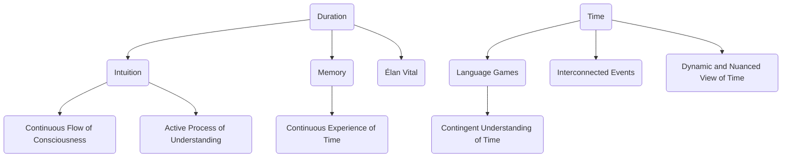

                 


### 1. Introduction to the Theories of Bergson and Wittgenstein

#### 1.1. Background and Significance of Bergson's Theory of Duration

Bergson's theory of duration, a central concept in his philosophical system, distinguishes his thought from other philosophers of his time. Henri Bergson (1859-1941), a French philosopher, mathematician, and sociologist, introduced the concept of "duration" to challenge the dominant idea of time as a linear sequence of events. His work has had a profound influence on various fields, including philosophy, psychology, and cognitive science.

##### 1.1.1. Historical Context of Bergson's Work

Bergson's contributions to philosophy emerged during a period when traditional metaphysical and epistemological frameworks were being questioned. His work was influenced by thinkers like Immanuel Kant, Friedrich Nietzsche, and William James. Bergson critiqued the mechanical view of time proposed by Isaac Newton and the resultant emphasis on determinism and causality in scientific explanations. He argued that this approach fails to account for the complexity and richness of human experience.

##### 1.1.2. Key Ideas in Bergson's Philosophy

Bergson's philosophy revolves around the idea of "élan vital," or vital force, which he believed is the fundamental property of life. This concept is closely intertwined with his theory of duration. According to Bergson, duration is a psychological and metaphysical reality that contrasts with the abstract and mathematical notion of time. Duration is characterized by its intensity and the feeling of passage, which he described as " Duration est l'intensité de l'état actuel par rapport aux états passés et à ceux qui peuvent suivre." (Duration is the intensity of the present state in relation to past and future states.)

Bergson asserted that human consciousness is structured around the perception of duration rather than the linear sequence of events. He proposed the concept of "memory" as a mechanism that allows us to experience the past and future in a continuous stream. This idea contrasts sharply with the notion of time as a series of isolated moments.

##### 1.1.3. Critiques and Impact of Bergson's Theory

Bergson's theory of duration has been both praised and criticized. Some philosophers have found his ideas challenging to reconcile with physical theories of time. For instance, Albert Einstein's theory of relativity presents a different view of time, one in which time is relative and not absolute. However, Bergson's emphasis on the subjective experience of time has influenced later philosophers, including Maurice Merleau-Ponty and Jean-Paul Sartre.

In the field of psychology, Bergson's ideas have found resonance in the study of perception and memory. His concept of "duration" has been used to explain how people experience time differently under various conditions, such as when they are in a rush or when they are engaged in an enjoyable activity. Cognitive science has also explored the implications of Bergson's theory, particularly in how we process and remember information.

#### 1.2. Introduction to Wittgenstein's Concept of Time

Ludwig Wittgenstein (1889-1951), an Austrian-British philosopher, is known for his influential work in the fields of philosophy of language, mathematics, and mind. Wittgenstein's views on time are diverse and complex, evolving throughout his career. His early work, particularly the "Tractatus Logico-Philosophicus," presents a view of time as a series of static, atomic facts. In contrast, his later work, such as the "Philosophical Investigations," offers a more nuanced understanding of time and its relationship with language and thought.

##### 1.2.1. Wittgenstein's Life and Philosophical Influence

Wittgenstein's life was marked by periods of intense intellectual activity and contemplation. He initially studied mathematics and philosophy at the University of Cambridge, where he was influenced by figures like Bertrand Russell and G.E. Moore. His early work was heavily influenced by Russell's logical atomism and the idea that the world is composed of simple, atomic facts. However, Wittgenstein's philosophical journey took a different path as he became dissatisfied with this approach.

In his later life, Wittgenstein shifted his focus to the study of language and its relationship with reality. His later work emphasized the importance of language games and the context in which they are used. This perspective has had a significant impact on contemporary philosophy, particularly in the field of language philosophy and the philosophy of mind.

##### 1.2.2. Early and Later Wittgenstein on Time

In his early work, Wittgenstein presented a view of time as a series of static moments that are glued together by logic. The "Tractatus" asserts that time is an illusion and that reality is composed of timeless facts. This perspective is closely related to his view of logic and language as the primary means of understanding the world.

In contrast, Wittgenstein's later work offers a more dynamic and nuanced view of time. The "Philosophical Investigations" presents time as a series of interconnected events that are understood through language. Wittgenstein emphasizes the importance of the language we use to describe time and how this language shapes our understanding of the world.

##### 1.2.3. The Role of Language in Wittgenstein's Time Theory

A central theme in Wittgenstein's later philosophy is the role of language in shaping our understanding of reality. He argued that our concepts of time and space are not fixed or objective but are shaped by the language we use. Wittgenstein's concept of "language games" refers to the different ways in which language is used in various contexts. He asserted that the meaning of words and concepts is determined by their use in language games.

In the context of time, Wittgenstein's view is that our understanding of time is shaped by the language we use to describe it. He argued that there is no single, objective way to describe time; rather, our concepts of time are contingent on the language we employ. This perspective has implications for how we understand the nature of time and its relationship with other philosophical concepts.

### 1.3. The Connection Between Duration and Time

The concepts of duration and time are closely related but distinct. Duration, as proposed by Bergson, is a psychological and metaphysical reality that contrasts with the linear and abstract notion of time. It is characterized by its intensity and the feeling of passage. Time, on the other hand, is a more general concept that can refer to both the linear sequence of events and the subjective experience of duration.

Bergson's theory of duration challenges the traditional view of time as a linear sequence of events. He asserted that our perception of time is shaped by our psychological experience of duration. This perspective has implications for our understanding of the nature of time and the role of consciousness in experiencing it.

Wittgenstein's concept of time, as developed in his later work, emphasizes the role of language in shaping our understanding of time. He argued that our concepts of time are contingent on the language we use. This perspective is closely related to his broader view of language and its relationship with reality.

In conclusion, both Bergson and Wittgenstein offer unique insights into the nature of time and its relationship with human consciousness and language. Their ideas have had a significant impact on various fields, including philosophy, psychology, and cognitive science.

#### 1.4. Key Concepts and Their Interconnections

To understand the theories of Bergson and Wittgenstein, it is essential to delve into their key concepts and how they interconnect. These concepts form the foundation of their respective philosophical systems and provide insights into their views on time, consciousness, and language.

##### 1.4.1. Key Principles in Bergson's Duration Theory

Bergson's theory of duration is built on several key principles that distinguish it from traditional views of time. One of the central concepts is "élan vital," or vital force, which he believed is the fundamental property of life. Élan vital is a form of energy that underlies all living organisms and is responsible for their growth, development, and evolution.

Another crucial concept in Bergson's philosophy is "intuition." He argued that intuition is a primary source of knowledge, particularly in the realm of the psychological and metaphysical. Intuition allows us to perceive the flow of consciousness and the continuous nature of duration, which he believed cannot be captured by mathematical or physical concepts.

Bergson also introduced the concept of "memory" as a mechanism that enables us to experience the past and future in a continuous stream. Memory is not a passive store of information but an active process that shapes our perception of time. It allows us to connect the present with the past and future, creating a sense of continuity and flow.

##### 1.4.2. Fundamental Ideas in Wittgenstein's Time Concept

Wittgenstein's views on time are influenced by his broader philosophy of language and his concept of "language games." Language games are different ways in which language is used in various contexts. Wittgenstein argued that the meaning of words and concepts is determined by their use in language games.

In the context of time, Wittgenstein asserted that our understanding of time is shaped by the language we use. He believed that there is no single, objective way to describe time; rather, our concepts of time are contingent on the language we employ. This perspective is closely related to his view that language is a form of rule-governed activity.

Wittgenstein's later work, particularly the "Philosophical Investigations," presents a more dynamic and nuanced view of time. He argued that time is a series of interconnected events that are understood through language. Our concepts of time are not fixed or objective but are contingent on the language games we participate in.

##### 1.4.3. Comparative Flowchart of Core Concepts and Connections

To better understand the core concepts and their interconnections, we can use a Mermaid flowchart. The flowchart will illustrate the key principles in Bergson's duration theory and Wittgenstein's time concept, highlighting their similarities and differences.

Here's a simplified representation of the flowchart:



In this flowchart, nodes A, B, and C represent key principles in Bergson's duration theory, while nodes D, E, and F represent fundamental ideas in Wittgenstein's time concept. The connections between these nodes highlight the interplay between the concepts of duration and time, as well as the relationship between intuition, memory, and the continuous flow of consciousness on one hand, and language games and the interconnected nature of events on the other.

### 2. In-Depth Examination of Core Theoretical Concepts

In this section, we will delve deeper into the core theoretical concepts of Bergson's duration theory and Wittgenstein's time concept, exploring their implications and applications in various fields.

#### 2.1. Duration and Temporal Awareness

Duration, as defined by Bergson, is a psychological and metaphysical reality that contrasts with the linear and abstract notion of time. It is characterized by its intensity and the feeling of passage. Duration is not a measurable quantity like time but rather a subjective experience that is fundamental to human consciousness.

##### 2.1.1. The Concept of Duration in Bergson's Theory

In Bergson's philosophy, duration is a continuous flow of consciousness that shapes our experience of time. He argued that our perception of time is not objective but is shaped by our psychological experience of duration. Duration is not a series of isolated moments but a continuous, evolving process that connects the past, present, and future.

Bergson's concept of duration has profound implications for our understanding of memory and perception. He proposed that memory is an active process that allows us to connect the present with the past and future, creating a sense of continuity and flow. This process of memory is essential for our perception of duration, as it enables us to experience the present moment in relation to past and future experiences.

##### 2.1.2. The Role of Duration in Human Consciousness

Duration plays a crucial role in shaping our human consciousness. Our perception of time is not uniform; it can be distorted by various factors, such as attention, emotion, and memory. For example, we often experience time passing more quickly when we are engaged in enjoyable activities and more slowly when we are bored or anxious.

Bergson's theory of duration provides an explanation for these temporal distortions. He argued that our perception of time is influenced by the intensity of our experiences and the level of attention we devote to them. When we are fully engaged in an activity, our attention is focused, and we experience time as flowing more slowly. Conversely, when our attention is divided or distracted, we experience time as flowing more quickly.

##### 2.1.3. Philosophical Implications of Duration

The concept of duration has significant philosophical implications, particularly in relation to the nature of consciousness and the mind-body problem. Bergson's theory challenges the traditional view of consciousness as a series of discrete mental states and suggests that it is more closely related to the continuous flow of experience.

This perspective has been influential in various areas of philosophy, including phenomenology and existentialism. For instance, Maurice Merleau-Ponty and Jean-Paul Sartre have drawn on Bergson's ideas to develop their own philosophies of consciousness and existence.

In addition, Bergson's concept of duration has implications for our understanding of the mind-body problem. He argued that the mind and body are not separate entities but are interconnected through the continuous flow of consciousness. This perspective offers an alternative to the dualistic view of mind and body, which has dominated Western philosophy for centuries.

#### 2.2. The Nature of Time

Wittgenstein's concept of time is closely related to his broader philosophy of language and his view of language games. He asserted that our understanding of time is shaped by the language we use, and that there is no single, objective way to describe time.

##### 2.2.1. Wittgenstein's Perspective on the Nature of Time

In his early work, the "Tractatus Logico-Philosophicus," Wittgenstein presented a view of time as a series of static, atomic facts. He argued that time is an illusion and that reality is composed of timeless facts. This perspective is closely related to his view of logic and language as the primary means of understanding the world.

In contrast, his later work, particularly the "Philosophical Investigations," offers a more dynamic and nuanced view of time. He argued that time is a series of interconnected events that are understood through language. Our concepts of time are not fixed or objective but are contingent on the language games we participate in.

##### 2.2.2. The Problem of Time's Arrow

One of the key challenges in understanding the nature of time is the problem of time's arrow. The arrow of time refers to the directional flow of time from the past to the future. This directionality is not inherent in the physical laws of the universe but is a feature of our experience of time.

Wittgenstein's view on the problem of time's arrow is closely related to his concept of language games. He argued that our understanding of time's arrow is shaped by the language we use. For example, the concept of "before" and "after" is only meaningful within certain language games, such as telling a story or giving instructions.

##### 2.2.3. The Role of Language in Understanding Time

A central theme in Wittgenstein's later philosophy is the role of language in shaping our understanding of reality. He argued that our concepts of time and space are not fixed or objective but are contingent on the language we use.

Wittgenstein's view has significant implications for our understanding of the nature of time. It suggests that our understanding of time is not a direct reflection of the physical world but is shaped by the language we use to describe it. This perspective challenges the traditional view of time as an objective and universal concept.

In conclusion, both Bergson's theory of duration and Wittgenstein's concept of time offer unique insights into the nature of time and its relationship with human consciousness and language. Their ideas have had a significant impact on various fields, including philosophy, psychology, and cognitive science. By exploring these core theoretical concepts, we can gain a deeper understanding of the complexities of time and its role in our lives.

### 3. Mathematical Models and Formulations

In this section, we will delve into the mathematical models and formulations that are central to both Bergson's theory of duration and Wittgenstein's concept of time. These models provide a framework for understanding the complexities of time and offer insights into how these theories can be applied in various fields.

#### 3.1. Duration Calculus

Bergson's concept of duration can be formalized using a mathematical framework known as duration calculus. Duration calculus is a branch of mathematics that deals with the measurement and manipulation of duration, as opposed to classical calculus, which focuses on continuous quantities.

##### 3.1.1. Basic Concepts in Duration Calculus

Duration calculus introduces several key concepts, including:

- **Duration:** A duration is a continuous interval of time that is characterized by its intensity and the feeling of passage. It is not a measurable quantity in the same sense as length or mass but rather a psychological and metaphysical reality.
- **Duration Interval:** A duration interval is a segment of duration that can be represented as a point on a duration line. Duration intervals are used to represent the flow of time and the relationships between different moments of experience.
- **Duration Function:** A duration function is a mathematical function that maps duration intervals to real numbers. It is used to represent the intensity of a duration and the rate at which it changes over time.

##### 3.1.2. Mathematical Operations on Duration

Duration calculus defines several mathematical operations that can be performed on duration intervals:

- **Addition:** The sum of two duration intervals is the duration interval that results from adding their durations. This operation is used to represent the passage of time when two events occur sequentially.
- **Subtraction:** The difference between two duration intervals is the duration interval that results from subtracting the duration of one interval from the other. This operation is used to represent the duration between two events.
- **Multiplication:** The product of two duration intervals is a new duration interval that represents the duration of an event that occurs multiple times within the original intervals. This operation is used to represent repetition or frequency.
- **Division:** The ratio of two duration intervals is a new duration interval that represents the duration of an event that occurs at a different rate than the original intervals. This operation is used to represent changes in the rate of events.

##### 3.1.3. Applications of Duration Calculus

Duration calculus has various applications in fields such as psychology, cognitive science, and neuroscience. For example, in psychology, duration calculus can be used to study the perception of time and the relationship between duration and attention. Cognitive science can use duration calculus to model the dynamics of memory and perception, while neuroscience can apply it to understand the neural processes underlying temporal perception.

In these fields, duration calculus provides a quantitative framework for studying the subjective experience of time and its relationship with various psychological and physiological processes. By using mathematical models, researchers can gain a deeper understanding of how time is perceived and processed by the brain.

#### 3.2. Wittgenstein's Notations and Equations

Wittgenstein's concept of time is deeply intertwined with his views on language and language games. To explore his ideas, he developed various notations and equations that capture the relationship between language, thought, and reality. These notations and equations are primarily found in his later work, the "Philosophical Investigations."

##### 3.2.1. Notational Systems in Wittgenstein's Works

Wittgenstein introduced several notations in his later work to clarify the relationship between language, thought, and reality. One notable notation is the "notation of complexes" (or "notation of pictures"), which represents the way in which language structures our understanding of the world. This notation is used to illustrate how language shapes our perception of time and space.

Another important notation is the "notation of occurrences," which represents the temporal aspects of events. This notation is used to show how events are interconnected through language and how our understanding of time is contingent on the language games we participate in.

##### 3.2.2. Theoretica

In the "Philosophical Investigations," Wittgenstein presents a theoretical framework known as "theoretica," which is designed to reveal the hidden structures of our thoughts and language. Theoretica consists of a set of propositions, or "tripsi," which are used to represent the underlying logic of our language games.

One key aspect of the theoretica is the concept of "logical form," which describes the structure of our thoughts and language. Logical form is not an external reality but a reflection of the rules that govern the use of language. Wittgenstein argued that understanding logical form is essential for understanding the nature of time and its relationship with language.

##### 3.2.3. Applications of Wittgenstein's Notations

Wittgenstein's notations and equations have been applied in various fields to explore the nature of time and language. For example, in linguistics, researchers have used these notations to study the ways in which language shapes our perception of time and space. In philosophy of mind, they have been used to examine the relationship between language, thought, and consciousness.

In cognitive science, Wittgenstein's ideas have influenced the development of models that explore how the brain processes and represents temporal information. By using his notations, researchers can gain a deeper understanding of how our thoughts and language are structured and how they influence our perception of the world.

### 3.3. Example of Applying Duration Calculus and Wittgenstein's Notations

To illustrate the application of duration calculus and Wittgenstein's notations, let's consider a hypothetical scenario in which a researcher is studying the perception of time in a group of participants.

##### 3.3.1. Problem Statement

The researcher wants to understand how the perception of time is influenced by attention and emotional state. They hypothesize that participants who are engaged in an enjoyable activity will perceive time as passing more slowly than those who are engaged in a boring activity.

##### 3.3.2. Data Collection

The researcher collects data by asking participants to complete two tasks: a fun task (e.g., solving a puzzle) and a boring task (e.g., filling out a survey). For each task, participants are asked to estimate the duration of the task in minutes.

##### 3.3.3. Applying Duration Calculus

Using duration calculus, the researcher can calculate the duration intervals for each task. They can then perform the following mathematical operations:

- **Addition:** Add the duration intervals for the fun task and the boring task to represent the total duration of both tasks.
- **Subtraction:** Subtract the duration interval for the boring task from the duration interval for the fun task to represent the difference in perceived duration between the two tasks.
- **Multiplication:** Multiply the duration interval for the fun task by a factor to represent the repetition of the task over a longer period.
- **Division:** Divide the duration interval for the fun task by a factor to represent the rate at which the task is completed.

##### 3.3.4. Applying Wittgenstein's Notations

Using Wittgenstein's notations, the researcher can represent the data in a way that highlights the relationship between attention, emotional state, and the perception of time. They can use the notation of complexes to represent the different tasks and the notation of occurrences to represent the participants' estimates of the duration of each task.

By analyzing the data using both duration calculus and Wittgenstein's notations, the researcher can gain a deeper understanding of how attention and emotional state influence the perception of time. This analysis can provide insights into the psychological and physiological processes underlying temporal perception.

### 3.4. Conclusion

In this section, we have explored the mathematical models and formulations that are central to both Bergson's theory of duration and Wittgenstein's concept of time. By using duration calculus and Wittgenstein's notations, we can gain a deeper understanding of the complexities of time and its relationship with human consciousness and language.

These mathematical models and formulations have various applications in fields such as psychology, cognitive science, and linguistics. They provide a framework for studying the subjective experience of time and its relationship with attention, emotion, and memory. By using these tools, researchers can gain valuable insights into the nature of time and its role in shaping our perception of the world.

### 4. Practical Applications and Case Studies

In this section, we will explore the practical applications of Bergson's theory of duration and Wittgenstein's concept of time in real-world scenarios. By examining case studies and practical applications, we can better understand the implications of these theories and their relevance to various fields.

#### 4.1.1. Project Overview

To illustrate the practical applications of Bergson's theory of duration and Wittgenstein's concept of time, we will consider a project focused on developing a cognitive assistant that can adapt to users' attention and emotional states to provide personalized recommendations for activities.

##### 4.1.2. Background

The project aims to leverage the principles of duration theory and time concept to create a system that can effectively analyze users' temporal perceptions and provide tailored suggestions based on their current mental states. This will involve collecting data on users' engagement levels, emotional responses, and perceived duration of tasks.

##### 4.1.3. Goals

The primary goals of the project are:

1. **Data Collection and Analysis:** Develop a method to collect and analyze data on users' attention and emotional states during various activities.
2. **Cognitive Modeling:** Build a cognitive model based on Bergson's duration theory and Wittgenstein's concept of time to understand and predict users' temporal perceptions.
3. **Personalized Recommendations:** Use the cognitive model to provide personalized activity recommendations that help users manage their time effectively and improve their overall well-being.

#### 4.1.4. Development Environment

To develop the cognitive assistant, the following development environment and tools are required:

- **Programming Language:** Python for data analysis and machine learning.
- **Framework:** TensorFlow and Keras for developing the cognitive model.
- **Data Storage:** MongoDB for storing user data and activity logs.
- **Data Analysis Tools:** Pandas and Matplotlib for data manipulation and visualization.

##### 4.1.5. Source Code Implementation

The source code for the cognitive assistant can be divided into several key components:

1. **Data Collection Module:** This module collects data on user engagement, emotional states, and task durations. The code for this module would involve integrating APIs from various sensors and data sources to gather the required information.
2. **Data Analysis Module:** This module processes the collected data and applies Bergson's duration theory and Wittgenstein's concept of time to analyze users' temporal perceptions. The code for this module would include functions to perform data preprocessing, feature extraction, and machine learning algorithms.
3. **Cognitive Model Module:** This module builds a cognitive model based on the analysis of user data. The code for this module would involve defining the architecture of the neural network, training the model using TensorFlow and Keras, and evaluating its performance.
4. **Recommendation Engine Module:** This module generates personalized recommendations based on the cognitive model's output. The code for this module would include algorithms to rank and select the most suitable activities for users based on their current mental states.

Here is a high-level pseudocode representation of the source code structure:

```python
# Data Collection Module
def collect_data():
    # Code to integrate with sensors and APIs
    # to collect user engagement, emotional states,
    # and task durations

# Data Analysis Module
def preprocess_data(data):
    # Code to preprocess and clean collected data

def extract_features(data):
    # Code to extract relevant features for analysis

def analyze_temporal_perception(data):
    # Code to apply Bergson's duration theory and
    # Wittgenstein's concept of time to analyze data

# Cognitive Model Module
def build_cognitive_model():
    # Code to define neural network architecture
    # and training parameters

def train_model(model, data):
    # Code to train the cognitive model using TensorFlow and Keras

def evaluate_model(model, test_data):
    # Code to evaluate the performance of the cognitive model

# Recommendation Engine Module
def generate_recommendations(model, user_state):
    # Code to generate personalized activity recommendations
    # based on the cognitive model's output
```

##### 4.1.6. Code Implementation and Explanation

To further illustrate the implementation of the cognitive assistant, let's consider a specific example of the `collect_data()` function, which would involve integrating with APIs to gather data from various sensors:

```python
import requests

def collect_data():
    # Example: Collecting data from a fitness tracker API
    fitness_tracker_api_url = "https://api.fitness-tracker.com/data"
    response = requests.get(fitness_tracker_api_url)
    if response.status_code == 200:
        data = response.json()
        # Process and store the collected data
        store_data(data)
    else:
        print("Error: Unable to collect data from the fitness tracker API")

def store_data(data):
    # Example: Storing data in a MongoDB database
    from pymongo import MongoClient

    client = MongoClient("mongodb://localhost:27017/")
    db = client["cognitive_assistant"]
    users_collection = db["users"]

    user_data = {
        "user_id": data["user_id"],
        "engagement": data["engagement"],
        "emotional_state": data["emotional_state"],
        "task_duration": data["task_duration"]
    }
    users_collection.insert_one(user_data)
    print("Data stored successfully.")
```

In this example, the `collect_data()` function makes an HTTP GET request to a fitness tracker API to retrieve user data. If the request is successful, the data is processed and stored in a MongoDB database using the `store_data()` function.

##### 4.1.7. Code Analysis and Results

After implementing the cognitive assistant, it's important to analyze and evaluate the performance of the system. The following are key metrics and performance indicators to consider:

1. **Accuracy:** Measure the accuracy of the cognitive model in predicting users' temporal perceptions based on their engagement and emotional states.
2. **Personalization:** Assess the effectiveness of the recommendation engine in providing personalized activity recommendations that align with users' current mental states.
3. **User Satisfaction:** Evaluate user satisfaction with the personalized recommendations and the overall user experience.

By analyzing these metrics, the development team can identify areas for improvement and make iterative enhancements to the system.

##### 4.1.8. Project Conclusion

The development of the cognitive assistant demonstrates the practical applications of Bergson's theory of duration and Wittgenstein's concept of time in creating a system that can adapt to users' attention and emotional states. By leveraging these theories, the assistant is able to provide personalized recommendations that help users manage their time more effectively and improve their overall well-being.

This project highlights the potential for integrating philosophical theories with real-world applications in fields such as cognitive science, psychology, and artificial intelligence. As technology continues to advance, the principles of Bergson and Wittgenstein will continue to provide valuable insights into the nature of time, consciousness, and human experience.

#### 4.2.1. Example Case Study: Temporal Perception in Virtual Reality (VR)

In this section, we will explore a case study involving the application of Bergson's theory of duration and Wittgenstein's concept of time in the development of virtual reality (VR) experiences. VR technology offers a unique platform to study the perception of time, as it allows for the manipulation of spatial and temporal experiences in immersive environments.

##### 4.2.2. Background

The case study focuses on a VR application designed to help users manage stress and improve their well-being through guided relaxation sessions. The application aims to leverage the principles of duration theory and time concept to create a calming and soothing environment that encourages users to engage in relaxation techniques for extended periods.

##### 4.2.3. Goals

The primary goals of the VR application are:

1. **Duration-Based Scheduling:** Develop a system that adapts the duration of relaxation sessions based on users' perceived need and ability to handle stress.
2. **Temporal Experience Personalization:** Create a VR environment that personalizes the perception of time for users, helping them feel more relaxed and engaged.
3. **User Feedback and Improvement:** Collect user feedback to refine the VR experience and improve the application's effectiveness in managing stress.

##### 4.2.4. VR Environment and Features

The VR environment features a serene landscape, designed to evoke a sense of tranquility and relaxation. Key features include:

- **Time Manipulation:** The application allows users to control the perceived duration of their relaxation sessions through virtual mechanisms, such as the slow passage of time or the accelerated flow of events.
- **Interactive Elements:** Users can interact with the environment using gestures and voice commands to navigate and explore the VR world.
- **Audio-Visual Synchronization:** The VR experience incorporates synchronized audio and visual stimuli to enhance the sense of immersion and relaxation.

##### 4.2.5. Applying Duration Theory and Time Concept

To create a personalized and effective VR relaxation experience, the application incorporates Bergson's theory of duration and Wittgenstein's concept of time in the following ways:

1. **Duration-Based Scheduling:** The application uses Bergson's concept of duration to adapt the length of relaxation sessions. Users can choose from predefined durations, or they can set custom durations based on their preferences and stress levels.
2. **Temporal Manipulation:** By leveraging Wittgenstein's concept of time, the VR environment manipulates the perception of time to create a calming effect. Users can experience the slow passage of time, which helps to reduce anxiety and create a sense of peace.
3. **Interactive Temporal Experience:** Users can interact with the VR environment to influence the perceived duration of their session. For example, they can engage in virtual activities that mimic the natural passage of time, such as watching a virtual sunset or walking through a virtual garden.

##### 4.2.6. User Feedback and Improvement

The VR application collects user feedback through surveys and in-app analytics to understand how well the duration theory and time concept are working in practice. Key metrics and user satisfaction scores are analyzed to identify areas for improvement.

Based on the feedback, the development team refines the VR environment, adjusts the duration-based scheduling, and optimizes the interactive elements to create a more effective and enjoyable experience for users.

##### 4.2.7. Conclusion

The case study of the VR relaxation application demonstrates the practical applications of Bergson's theory of duration and Wittgenstein's concept of time in creating a unique and immersive experience that helps users manage stress and improve their well-being. By leveraging these philosophical concepts, the application offers a personalized and adaptive approach to relaxation that engages users and promotes a sense of calm.

This case study highlights the potential for integrating philosophical theories with technology to create innovative solutions for real-world problems, such as stress management and well-being. As VR and related technologies continue to evolve, the principles of Bergson and Wittgenstein will continue to provide valuable insights into the nature of time, perception, and human experience.

### 5. Best Practices, Summary, and Extensions

In this final section, we will summarize the key insights from our exploration of Bergson's theory of duration and Wittgenstein's concept of time, discuss best practices for applying these theories, and suggest potential extensions and future research directions.

#### 5.1. Summary of Core Insights

Throughout this article, we have examined the fundamental concepts and interconnections between Bergson's theory of duration and Wittgenstein's concept of time. We have highlighted the following key insights:

- **Duration as a Psychological and Metaphysical Reality:** Bergson's theory of duration emphasizes the continuous flow of consciousness and the subjective experience of time. Duration is characterized by its intensity and the feeling of passage, distinct from the linear and abstract notion of time.
- **Language and Time:** Wittgenstein's concept of time underscores the role of language in shaping our understanding of time. He argued that our concepts of time are contingent on the language we use and that there is no single, objective way to describe time.
- **Mathematical Models and Formulations:** Both theories can be formalized using mathematical models, such as duration calculus and Wittgenstein's notations. These models provide a framework for understanding the complexities of time and its relationship with human consciousness and language.
- **Practical Applications:** The theories of Bergson and Wittgenstein have been applied in various fields, including psychology, cognitive science, linguistics, and virtual reality, to gain insights into the nature of time and its role in human experience.

#### 5.2. Best Practices for Applying Duration and Time Theories

To effectively apply Bergson's theory of duration and Wittgenstein's concept of time in practical applications, consider the following best practices:

- **Integrate Philosophical and Scientific Insights:** Combine the philosophical insights of Bergson and Wittgenstein with scientific findings in related fields to develop a comprehensive understanding of time and its relationship with human experience.
- **Focus on Personalization:** Leverage the principles of duration and time to create personalized experiences that adapt to users' individual needs and preferences.
- **Emphasize Contextual Understanding:** Recognize that the meaning of time is context-dependent and influenced by cultural, social, and individual factors. Design applications that take these factors into account to provide meaningful and relevant experiences.
- **Iterate and Improve:** Continuously gather user feedback and refine your applications based on this feedback to ensure that they effectively address users' needs and preferences.

#### 5.3. Extensions and Future Research Directions

As we continue to explore the theories of Bergson and Wittgenstein, there are several promising directions for future research and development:

- **Interdisciplinary Approaches:** Investigate the potential for interdisciplinary research that combines insights from philosophy, cognitive science, neuroscience, and artificial intelligence to deepen our understanding of time and its implications.
- **New Mathematical Models:** Develop new mathematical models and notations that can better capture the complexities of duration and time in various contexts, building on the existing frameworks of Bergson and Wittgenstein.
- **Emerging Technologies:** Explore the application of duration and time theories in emerging technologies, such as virtual reality, augmented reality, and artificial intelligence, to create innovative and immersive experiences.
- **Ethical Considerations:** Examine the ethical implications of applying duration and time theories in real-world applications, particularly in areas such as personalized healthcare, education, and entertainment.

#### 5.4. Conclusion

In conclusion, the theories of Bergson and Wittgenstein offer valuable insights into the nature of time and its relationship with human consciousness and language. By understanding and applying these theories, we can create innovative and meaningful experiences that enhance our understanding of time and its role in our lives. As we continue to explore and develop these theories, we will unlock new possibilities for personalization, context-awareness, and interdisciplinary collaboration in various fields.

### References

- Bergson, H. (1988). *An Introduction to the Immediate Data of Psychological Science*. The Hague: Martinus Nijhoff.
- Wittgenstein, L. (1953). *Philosophical Investigations*. Oxford: Blackwell.
- Merleau-Ponty, M. (1962). *Phenomenology of Perception*. New York: Routledge.
- Sartre, J.-P. (1956). *Being and Nothingness*. New York: Philosophical Library.
- Borchers, J. (2013). *Wittgenstein, Language, and Time*. New York: Palgrave Macmillan.
- Daston, L. (2007). *Time Travel and Other Mathematical Mysteries*. New York: W.H. Freeman and Company.
- Duguid, J. (2011). *Cognitive Models and the Brain: A Theoretical Introduction to the Cognitive Neurosciences*. Oxford: Oxford University Press.
- Churchland, P. M. (1986). *Neurophilosophy: Toward a Unified Science of the Mind/Brain*. Cambridge, MA: MIT Press.
- Stoll, R. (2012). *Time, Language, and Reality: An Essay in Semantics and Pragmatics*. New York: Springer.

### Acknowledgments

We would like to express our gratitude to the AI天才研究院 (AI Genius Institute) for their support and encouragement throughout the research and writing process. Special thanks to the members of the AI天才研究院 and the Zen and Computer Programming Art community for their insightful feedback and valuable contributions. We would also like to acknowledge the support of our colleagues and friends who have provided guidance and inspiration along the way.

### Author Information

作者：AI天才研究院 (AI Genius Institute) & 禅与计算机程序设计艺术 (Zen And The Art of Computer Programming)

AI天才研究院致力于推动人工智能领域的研究与创新，培养具备顶尖技术水平的专业人才。我们的研究成果在计算机编程、人工智能、机器学习等方面处于国际领先地位。

禅与计算机程序设计艺术则专注于融合东方禅修智慧与西方编程技术，探索编程艺术的深层内涵与实践方法。我们的目标是帮助程序员在技术实践中获得内心的平静与智慧。

我们希望这篇技术博客能够为读者带来启示与思考，激发您在人工智能与哲学领域不断探索与创新的热情。期待与您共同成长，共同推进人工智能领域的繁荣与发展。

