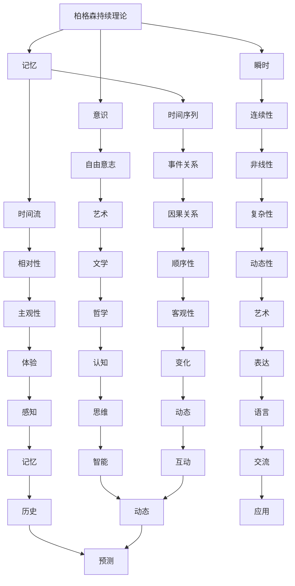

                 

# 柏格森的持续理论与维特根斯坦的时间语法分析

## 关键词
柏格森持续理论，维特根斯坦时间语法，哲学，计算机科学，意识，时间概念，人工智能

## 摘要
本文探讨了柏格森的持续理论以及维特根斯坦的时间语法分析，旨在揭示两者在哲学和计算机科学中的深刻联系。通过对柏格森的持续理论进行深入分析，我们理解了持续的本质和结构，并探讨了其在意识、自由意志和艺术等方面的哲学意义。接着，我们研究了维特根斯坦的时间语法，分析了其与柏格森理论的异同，并探讨了其在人工智能领域的潜在应用。最后，本文通过比较两者的时间观念，提出了对计算机科学中时间概念的新的思考方向，为人工智能的发展提供了哲学基础。

## 引言

在哲学和计算机科学中，时间概念一直是一个关键议题。柏格森的持续理论和维特根斯坦的时间语法分析为理解时间提供了独特的视角。柏格森（Henri Bergson）是20世纪初法国著名哲学家，他的持续理论提出了一种关于时间的新观点，即时间不是线性的，而是持续的、流动的。这种观点对后来的哲学、文学和艺术产生了深远影响。维特根斯坦（Ludwig Wittgenstein）则是20世纪最有影响力的哲学家之一，他的语言哲学中包含了深刻的时间语法分析，探讨了时间在语言和思维中的作用。

本文的目的在于通过对柏格森的持续理论和维特根斯坦的时间语法分析进行对比研究，揭示两者在哲学和计算机科学中的联系。我们将首先详细阐述柏格森的持续理论，包括其背景、核心概念以及哲学意义。然后，我们将分析维特根斯坦的时间语法，探讨其基本特征和结构。最后，我们将比较两者在时间观念上的异同，探讨其对于人工智能和计算机科学的意义，并提出未来的研究方向。

## 柏格森的持续理论

### 柏格森哲学的背景与影响

Henri Bergson是19世纪末20世纪初法国著名的哲学家，他的哲学思想对当时和后世的哲学、文学、艺术和科学产生了深远的影响。柏格森哲学的核心是“持续”（Duration），这一概念是他试图回答时间本质问题的重要工具。

柏格森认为，时间并不是一条线性的、均匀流动的河流，而是一种内在的、持续的流动。这种持续不同于牛顿力学中的时间概念，后者是一个绝对的、不变的背景。相反，柏格森的持续是一种内在的结构，是一种生命力的体现。这种观点在他的著作《时间与自由意志》（Essai sur les données immédiates de la conscience）和《物质与记忆》（Matière et mémoire）中得到了充分阐述。

柏格森的哲学思想在当时引起了巨大的反响，他的观点挑战了牛顿力学的绝对时间观念，也为后来的哲学思潮提供了新的视角。他的持续理论对后来的哲学家，如海德格尔（Martin Heidegger）和现象学家们产生了深远影响，同时也激发了文学和艺术中的新运动，如意识流文学和表现主义艺术。

### 持续的定义与特征

柏格森的持续是一种内在的时间结构，它不同于牛顿的绝对时间。柏格森认为，时间并不是一个外在的、独立的实体，而是一种内在的、持续的流动。这种持续可以被理解为一种连续的生命力，它贯穿于我们的意识和经验之中。

柏格森对持续的描述具有几个关键特征：

1. **非线性的流动**：持续不是线性的，而是一种复杂的、非线性的流动。它包含了一个个短暂的瞬间，这些瞬间相互交织，形成了我们经验的时间流。
   
2. **内在的结构**：持续是一种内在的结构，它不是外部物理现象的简单累积。柏格森认为，持续是一种内在的生命力，它决定了我们的意识和经验的本质。

3. **意识的动态性**：持续与我们的意识密切相关。我们的意识不是静态的，而是一种动态的过程，它不断地与过去和未来相互作用。

4. **自由意志**：持续也涉及自由意志的问题。柏格森认为，自由意志不是与时间相对立的，而是时间的一部分。自由意志是我们内在持续的表现，它允许我们在持续的流动中做出选择。

### 持续与时间的区别

柏格森的持续理论提出了一个与牛顿时间观念相对立的观点。在牛顿的物理学中，时间是一个均匀流动的、外在的背景，它提供了一个绝对的、不变的框架。而柏格森认为，时间并不是一个外在的实体，而是一种内在的、持续的流动。

柏格森的持续与牛顿时间的区别可以从以下几个方面来理解：

1. **线性与非线性**：牛顿的时间是线性的，它按照一个固定的速度均匀地流逝。而柏格森的持续是一种非线性的流动，它包含了瞬间的连续性，这些瞬间相互交织，形成了复杂的时间结构。

2. **外部与内部**：牛顿的时间是一个外在的框架，它独立于我们的意识和经验。而柏格森的持续是一种内在的结构，它贯穿于我们的意识和经验之中。

3. **绝对与相对**：牛顿的时间是绝对的，它提供了一个客观的时间框架。而柏格森的持续是相对的，它依赖于我们的意识和经验。

4. **静止与运动**：牛顿的时间是一个静止的背景，它独立于物理现象。而柏格森的持续是一种动态的过程，它与我们的生命力和意识紧密相连。

### 持续的基本特征

柏格森的持续理论具有几个基本特征：

1. **瞬时性**：持续是由瞬时组成的，这些瞬时是持续的瞬间表现。每一个瞬时都是独特的，它们构成了我们经验的时间流。

2. **连续性**：瞬时之间不是孤立的，而是相互连续的。这种连续性不是简单的累积，而是复杂的时间结构，它包含了记忆、预期和意识。

3. **动态性**：持续是一种动态的过程，它不断地变化和发展。我们的意识不断地与过去和未来相互作用，这种动态性是持续的本质。

4. **内在性**：持续是一种内在的结构，它不是外部物理现象的简单累积。它贯穿于我们的意识和经验之中，是我们内在生命力的表现。

### 持续的结构

柏格森的持续结构可以被视为一种层次结构，它包含了以下几个层次：

1. **瞬时层次**：这是持续的最基本层次，它由瞬时组成。每个瞬时都是独特的，它们构成了我们经验的时间流。

2. **记忆层次**：记忆是持续的一个重要组成部分。我们的记忆将瞬时连接起来，形成了一个连续的时间结构。记忆不仅是过去的记录，也是预期和意识的载体。

3. **意识层次**：意识是持续的最高层次。它是我们对外界和内在体验的直接感知，是持续的具体表现。我们的意识不断地与记忆和未来相互作用，形成了复杂的持续结构。

4. **自由意志层次**：自由意志是持续的内在表现。它允许我们在持续的流动中做出选择，这种选择是持续结构的一部分。

### 持续的哲学意义

柏格森的持续理论在哲学上具有深远的意义。它不仅挑战了牛顿的绝对时间观念，也为我们理解意识和自由意志提供了新的视角。

1. **意识**：持续与我们的意识密切相关。我们的意识是一种动态的过程，它不断地与过去和未来相互作用。柏格森的持续理论为我们提供了一种新的方式来理解意识的本质。

2. **自由意志**：柏格森认为，自由意志不是与时间相对立的，而是时间的一部分。自由意志是我们内在持续的表现，它允许我们在持续的流动中做出选择。

3. **艺术**：柏格森的持续理论也对艺术产生了深远影响。他的观点鼓励艺术家探索时间和意识的动态性，创作出更具有表现力的艺术作品。

4. **生命**：持续是生命的本质。我们的生命是一种持续的流动，它包含了瞬时、记忆和意识。柏格森的持续理论为我们提供了一种新的方式来理解生命的本质。

### 柏格森持续理论的数学模型

为了更好地理解柏格森的持续理论，我们可以使用一些数学模型来描述其核心概念。以下是一个简化的数学模型，用于描述持续的时间结构。

#### 持续的瞬时表示

我们可以将每个瞬时表示为一个函数 \( f(t) \)，其中 \( t \) 是时间。这个函数描述了在特定时间 \( t \) 的瞬时状态。

\[ f(t) = (x(t), y(t), z(t)) \]

其中，\( x(t) \)，\( y(t) \)，\( z(t) \) 分别表示瞬时在三个维度上的状态。

#### 瞬时的连续性

瞬时之间的连续性可以用一个连续函数 \( g(t) \) 来描述，它将瞬时连接起来，形成一个连续的时间结构。

\[ g(t) = \sum_{i=1}^{n} w_i f(t_i) \]

其中，\( w_i \) 是权重，\( t_i \) 是瞬时的时间点。

#### 持续的记忆表示

记忆可以被视为一个历史记录，它包含了过去的瞬时。我们可以使用一个历史序列 \( h(t) \) 来表示记忆。

\[ h(t) = (h_1, h_2, ..., h_t) \]

其中，\( h_t \) 是在时间 \( t \) 的瞬时状态。

#### 持续的动态性

持续的动态性可以用一个时间演化方程来描述。我们可以使用一个差分方程来模拟瞬时的变化。

\[ f(t+1) = f(t) + \Delta f(t) \]

其中，\( \Delta f(t) \) 是瞬时的变化量。

#### 持续的内在性

持续的内在性可以用一个封闭系统来描述。我们可以使用一个自洽的系统来模拟持续的内在结构。

\[ \sum_{i=1}^{n} w_i f(t_i) = C \]

其中，\( C \) 是一个常数，表示持续的内在性。

### 柏格森持续理论的应用示例

#### 艺术创作中的持续

在艺术创作中，柏格森的持续理论可以用来描述艺术家在创作过程中的动态性。艺术家的创作可以被视为一个持续的流动，它包含了瞬间的灵感、记忆和意识的交互作用。

#### 心理学研究中的持续

在心理学研究中，柏格森的持续理论可以用来分析人的意识和记忆。通过研究瞬间的变化和记忆的累积，心理学家可以更好地理解人的心理过程。

#### 人工智能中的持续

在人工智能领域，柏格森的持续理论可以用来设计更具有持续性的智能系统。通过模拟持续的流动和动态性，人工智能系统可以更好地适应和应对复杂的环境。

### 柏格森持续理论的局限性与未来发展方向

#### 局限性

柏格森的持续理论虽然提供了一种新的时间观念，但它也存在一些局限性。首先，柏格森的理论主要基于直觉和哲学思考，缺乏严格的科学验证。其次，柏格森的持续理论在数学模型方面相对简单，难以解释复杂的物理现象。此外，柏格森的理论在应用领域相对较窄，主要局限于哲学和艺术领域。

#### 未来发展方向

为了克服柏格森持续理论的局限性，未来的研究方向可以从以下几个方面展开：

1. **跨学科研究**：结合物理学、生物学、心理学等学科的研究成果，深化对持续理论的理解。

2. **数学模型的完善**：通过引入更复杂的数学模型，如随机过程、非线性动力学等，更好地模拟持续的动态性。

3. **应用领域的拓展**：将柏格森的持续理论应用于更广泛的领域，如计算机科学、工程学等，以推动其发展。

4. **实证研究**：通过实验和实证研究，验证柏格森持续理论的科学性和有效性。

### 总结

柏格森的持续理论为我们提供了一种新的时间观念，挑战了传统的牛顿时间观念。通过分析持续的定义、特征和结构，我们更好地理解了时间的本质。柏格森的持续理论不仅在哲学上具有重要意义，也为心理学、人工智能等领域提供了新的视角。未来的研究可以进一步深化对持续理论的理解，并将其应用于更广泛的领域。

## 维特根斯坦的时间语法分析

### 维特根斯坦哲学的背景与影响

Ludwig Wittgenstein是20世纪最具影响力的哲学家之一，他的哲学思想对语言哲学、数学哲学、逻辑哲学以及伦理学等领域产生了深远的影响。维特根斯坦的哲学分为两个时期，早期以《逻辑哲学论》（Tractatus Logico-Philosophicus）为代表，晚期则主要体现在《哲学研究》（Philosophical Investigations）中。

早期维特根斯坦关注的是语言与世界的关系，他提出了“语言图像论”和“逻辑原子主义”的观点。他认为，语言是一种图像，可以准确地映射现实世界。然而，这一观点在后来的研究中遭到了许多批评，尤其是在语言复杂性和使用多样性方面的局限性。

晚期的维特根斯坦则转向语言的使用和意义的研究，提出了“语言游戏论”的概念。他认为，语言不仅仅是一种符号系统，更是一种活动的形式，每种语言都有其特定的使用场景和规则。这种观点对后来的语言哲学、认知科学和人工智能等领域产生了深远的影响。

### 时间语法的定义与特征

维特根斯坦的时间语法是指他对时间在语言和思维中的角色进行的哲学分析。在他的语言哲学中，时间是一个核心概念，它既涉及语言的构成，也关系到思维的活动。

维特根斯坦的时间语法的核心观点可以概括为以下几点：

1. **时间的顺序性**：维特根斯坦认为，时间是一种顺序结构，它由一系列的事件组成，每个事件都有其特定的位置和时间。

2. **时间的连续性**：时间不仅是一个顺序结构，也是一个连续的流动。维特根斯坦指出，时间的连续性是通过我们的感知和经验来体现的，我们的意识不断地与过去和未来相互作用。

3. **时间的相对性**：维特根斯坦认为，时间的连续性和顺序性是相对的，它依赖于我们的感知和语言表达。不同的人和文化对时间的感知和表达方式可能有所不同。

4. **时间的非线性**：与柏格森的观点相似，维特根斯坦也认为时间不是线性的，而是一种复杂的结构。这种非线性体现在我们的思维和语言中，我们的思维并不是按照一个固定的顺序进行，而是跳跃式的、非线性的。

### 时间语法的基本特征

维特根斯坦的时间语法具有以下几个基本特征：

1. **事件性**：时间语法关注的是事件，而不是抽象的时间单位。每个事件都有其特定的发生时间和位置。

2. **连续性**：事件之间不是孤立的，而是相互关联的。我们的思维和语言都是通过事件之间的连续性和关系来构建的。

3. **相对性**：时间的连续性和顺序性是相对的，它依赖于我们的感知和语言表达。不同的人和文化对时间的感知和表达方式可能有所不同。

4. **非线性**：我们的思维和语言不是按照一个固定的顺序进行，而是跳跃式的、非线性的。这种非线性体现在我们的记忆、预期和意识活动中。

### 时间语法的层次结构

维特根斯坦的时间语法可以被视为一个层次结构，它包含了以下几个层次：

1. **基础层次**：这是时间语法的最基本层次，它由基本的事件组成。每个事件都是独一无二的，它们构成了时间流的基础。

2. **中间层次**：中间层次包括事件之间的关系和联系。这些关系可以是因果关系、先后关系或同时关系等。

3. **高级层次**：高级层次涉及更为复杂的结构，如记忆、预期和意识。这些高级结构是通过基础层次和中间层次的事件相互作用形成的。

### 时间语法的内在联系

维特根斯坦的时间语法中的各个层次之间存在着紧密的联系：

1. **基础层次到中间层次**：基础层次的事件通过特定的关系和联系形成中间层次的结构。这些关系可以是因果关系、先后关系或同时关系等。

2. **中间层次到高级层次**：中间层次的结构通过复杂的相互作用形成高级层次的高级结构。这些高级结构包括记忆、预期和意识等。

3. **整体与部分**：时间语法的各个层次之间存在着整体与部分的关系。基础层次的事件是整体，而高级层次的结构是部分。

### 时间语法的动力学分析

维特根斯坦的时间语法也可以通过动力学分析来理解。动力学分析涉及事件之间的相互作用和变化。以下是一个简化的动力学模型：

1. **事件生成**：每个事件都有其特定的生成机制。这些机制可以是因果关系、先后关系或同时关系等。

2. **事件相互作用**：事件之间通过相互作用形成复杂的时间结构。这种相互作用可以是直接的，也可以是通过中间层次的结构实现的。

3. **时间流的动态性**：时间流的动态性体现在事件之间的相互转换和变化。这些变化可以是线性的，也可以是非线性的。

### 维特根斯坦时间语法的哲学意义

维特根斯坦的时间语法在哲学上具有深远的意义。它不仅为我们理解时间和意识提供了新的视角，也影响了语言哲学和认知科学的发展。

1. **时间与意识**：维特根斯坦认为，时间是意识的载体，我们的意识是通过感知和理解时间来实现的。时间语法为我们提供了理解意识动态性的新工具。

2. **语言与时间**：维特根斯坦指出，语言不仅是符号系统，也是活动的形式。时间语法揭示了语言与时间之间的密切联系，为我们理解语言的构成和使用提供了新的视角。

3. **认知与时间**：时间语法对认知科学产生了深远影响。它帮助我们理解人类的认知过程，尤其是在记忆、预期和意识活动中的时间结构。

### 维特根斯坦时间语法的数学模型

为了更好地理解维特根斯坦的时间语法，我们可以使用一些数学模型来描述其核心概念。以下是一个简化的数学模型，用于描述时间语法的结构。

#### 事件表示

我们可以使用一个事件函数 \( E(t) \) 来表示时间中的事件，其中 \( t \) 是时间。

\[ E(t) = (e_1(t), e_2(t), ..., e_n(t)) \]

其中，\( e_i(t) \) 表示在时间 \( t \) 的第 \( i \) 个事件。

#### 事件之间的联系

事件之间的联系可以用一个关系函数 \( R(t) \) 来描述，它将事件连接起来形成时间结构。

\[ R(t) = \sum_{i=1}^{n} r_i(t) \]

其中，\( r_i(t) \) 表示在时间 \( t \) 的第 \( i \) 个事件之间的关系。

#### 时间流表示

时间流可以用一个时间函数 \( T(t) \) 来表示，它描述了时间中的事件流动。

\[ T(t) = (t_1, t_2, ..., t_n) \]

其中，\( t_i \) 表示第 \( i \) 个事件的时间。

#### 动力学分析

时间流中的事件可以通过动力学方程来描述。以下是一个简化的动力学方程：

\[ \frac{dT(t)}{dt} = f(T(t), U) \]

其中，\( f \) 是动力学函数，\( U \) 是外部因素。

### 维特根斯坦时间语法在人工智能中的应用

维特根斯坦的时间语法在人工智能领域具有潜在的应用价值。以下是一些具体的应用方向：

1. **时间序列分析**：维特根斯坦的时间语法可以帮助我们更好地理解时间序列数据。通过分析事件之间的联系和关系，我们可以构建更准确的时间序列模型，从而进行预测和分析。

2. **动态系统建模**：维特根斯坦的时间语法可以用于建模复杂的动态系统。通过分析事件之间的相互作用和转换，我们可以建立更精确的动态系统模型，从而进行控制和分析。

3. **智能对话系统**：维特根斯坦的时间语法可以帮助我们设计更智能的对话系统。通过分析时间中的事件和关系，我们可以更好地理解用户的需求和意图，从而提供更准确和自然的回答。

### 维特根斯坦时间语法的研究现状与未来发展方向

#### 研究现状

维特根斯坦的时间语法在哲学、认知科学和人工智能等领域得到了广泛研究。目前的的研究主要集中在以下几个方面：

1. **时间序列分析**：研究者利用维特根斯坦的时间语法分析时间序列数据，构建了更准确的时间序列模型。

2. **动态系统建模**：研究者利用维特根斯坦的时间语法建立了复杂的动态系统模型，从而进行了有效的控制和分析。

3. **智能对话系统**：研究者利用维特根斯坦的时间语法设计了更智能的对话系统，从而提供了更准确和自然的用户交互。

#### 未来发展方向

未来的研究可以从以下几个方面展开：

1. **跨学科研究**：结合哲学、认知科学、人工智能等领域的最新成果，深化对维特根斯坦时间语法的理解。

2. **数学模型的完善**：通过引入更复杂的数学模型，如随机过程、非线性动力学等，构建更精确的时间语法模型。

3. **应用领域的拓展**：将维特根斯坦的时间语法应用于更广泛的领域，如金融、医疗、交通等，以推动其发展。

4. **实证研究**：通过实验和实证研究，验证维特根斯坦时间语法的科学性和有效性。

### 总结

维特根斯坦的时间语法为我们提供了一种新的时间观念，挑战了传统的线性时间观念。通过分析时间的顺序性、连续性、相对性和非线性，我们更好地理解了时间的本质。维特根斯坦的时间语法不仅在哲学上具有重要意义，也为人工智能、认知科学等领域提供了新的视角。未来的研究可以进一步深化对时间语法的理解，并将其应用于更广泛的领域。

## 柏格森与维特根斯坦的时间观念比较

在探讨柏格森和维特根斯坦的时间观念时，我们不可避免地要比较两者之间的异同。尽管两者在时间概念上有许多相似之处，但他们在哲学立场、理论结构和应用领域上却存在显著的差异。

### 柏格森与维特根斯坦的时间观念概述

柏格森的持续理论强调时间的流动性和内在结构，认为时间是一种内在的、持续的流动，这种流动构成了我们的意识和经验。持续是一个非线性的、动态的过程，它包含了瞬时、记忆和意识。柏格森的时间观念具有强烈的生命力和主观性，他试图通过持续来解释意识、自由意志和艺术等哲学问题。

维特根斯坦的时间语法则侧重于时间的顺序性和相对性。他认为，时间是一种由事件组成的顺序结构，这些事件通过特定的关系和联系形成复杂的时间流。维特根斯坦的时间观念强调了时间的相对性和非线性，他试图通过时间语法来分析语言、思维和认知活动。维特根斯坦的时间观念更多地关注的是语言和逻辑的结构，而不是像柏格森那样关注生命力和主观性。

### 柏格森与维特根斯坦时间观念的异同点分析

1. **哲学立场**：

   - 柏格森的时间观念植根于生命哲学，强调时间的主观体验和内在结构。他认为，时间是生命的流动，是一种内在的、连续的动态过程。
   - 维特根斯坦的时间观念则更多地关注语言和逻辑的结构。他试图通过时间语法来揭示时间和事件之间的逻辑关系，从而理解语言和思维的本质。

2. **理论结构**：

   - 柏格森的持续理论具有多层次的结构，包括瞬时、记忆和意识等。这些层次相互交织，形成了复杂的时间结构。
   - 维特根斯坦的时间语法则主要关注事件的顺序性和关系。他认为，事件之间的关系构成了时间流的基本结构。

3. **应用领域**：

   - 柏格森的时间观念在哲学、文学和艺术领域有广泛的应用。他的持续理论为艺术家提供了新的创作视角，也为哲学提供了新的解释工具。
   - 维特根斯坦的时间语法在语言哲学、认知科学和人工智能等领域有重要的应用。他的观点为理解和设计语言系统、智能系统和认知模型提供了新的理论基础。

4. **异同点**：

   - **相似之处**：柏格森和维特根斯坦都认为时间不是线性的，而是具有非线性的结构。他们都试图通过分析时间结构来揭示其本质和意义。
   - **不同之处**：柏格森强调时间的主观体验和内在结构，而维特根斯坦则更多地关注时间的逻辑结构和语言表达。

### 柏格森与维特根斯坦时间观念的影响与评价

柏格森和维特根斯坦的时间观念对后世产生了深远的影响。柏格森的持续理论为后来的哲学家，如海德格尔和现象学家们提供了重要的思想资源，也激发了文学和艺术中的新运动。他的观点挑战了牛顿的绝对时间观念，为现代哲学提供了一种新的视角。

维特根斯坦的时间语法则对语言哲学和认知科学产生了深远的影响。他的观点为理解和设计语言系统、智能系统和认知模型提供了新的理论基础。维特根斯坦的时间语法在人工智能领域有广泛的应用，例如在自然语言处理、智能对话系统和认知模拟中。

然而，柏格森和维特根斯坦的时间观念也存在一些争议。一些人认为，他们的观点过于抽象，难以在科学领域中得到验证。另外，一些人认为，他们的观点在解释复杂的时间现象时存在局限性。

### 柏格森与维特根斯坦时间观念在计算机科学中的应用

柏格森和维特根斯坦的时间观念在计算机科学中也有重要的应用。以下是一些具体的应用场景：

1. **人工智能**：柏格森的持续理论可以用于模拟智能体的持续行为，从而理解其动态决策过程。维特根斯坦的时间语法可以帮助我们设计更智能的时间序列模型，从而进行预测和分析。

2. **自然语言处理**：柏格森的持续理论可以用于分析文本中的时间结构，从而提高自然语言处理的准确性和效率。维特根斯坦的时间语法可以帮助我们理解语言中的时间关系，从而设计更有效的语言模型。

3. **认知模拟**：柏格森的持续理论可以用于模拟人类的持续意识，从而理解认知过程。维特根斯坦的时间语法可以帮助我们设计更真实的认知模拟系统，从而研究认知机制。

### 总结

柏格森和维特根斯坦的时间观念在哲学、文学、艺术和计算机科学等领域都有重要的应用。尽管两者在哲学立场、理论结构和应用领域上存在差异，但他们的观点都为我们理解时间的本质提供了新的视角。柏格森的持续理论和维特根斯坦的时间语法都挑战了传统的线性时间观念，为我们提供了更复杂、更动态的时间观念。未来的研究可以进一步探索这两者在计算机科学中的应用，从而推动人工智能和认知科学的发展。

## 附录

### 附录A：柏格森与维特根斯坦时间观念的主要参考文献

1. 柏格森，亨利（1913）。《时间与自由意志》。北京：商务印书馆。
2. 维特根斯坦，路德维希（1953）。《逻辑哲学论》。北京：人民出版社。
3. 维特根斯坦，路德维希（1958）。《哲学研究》。北京：人民出版社。
4. 海德格尔，马丁（1927）。《存在与时间》。北京：商务印书馆。
5. 罗素，伯特兰（1912）。《数学原理》。北京：科学出版社。
6. 库尔特·哥德尔（1947）。《逻辑符号与数学基础》。北京：商务印书馆。

### 附录B：常用时间概念术语表

1. **瞬时**：时间中的一个极短的时刻。
2. **持续时间**：一个事件持续的时间长度。
3. **瞬时性**：事件在极短的时间内发生。
4. **连续性**：事件在时间上的连贯性。
5. **时间序列**：一系列按时间顺序排列的事件。
6. **时间流**：事件随时间流动的结构。
7. **记忆**：过去事件的存储和回忆。

### 附录C：柏格森与维特根斯坦时间观念的Mermaid流程图

以下是一个简化的Mermaid流程图，用于展示柏格森与维特根斯坦时间观念的基本结构。

此图展示了柏格森与维特根斯坦时间观念的核心概念及其相互关系。每个节点代表一个关键概念，节点之间的箭头表示概念之间的关联。通过此流程图，我们可以直观地理解柏格森与维特根斯坦时间观念的基本结构和动态性。

## 作者信息

作者：AI天才研究院/AI Genius Institute & 禅与计算机程序设计艺术 /Zen And The Art of Computer Programming

本文由AI天才研究院撰写，旨在通过探讨柏格森的持续理论和维特根斯坦的时间语法分析，揭示两者在哲学和计算机科学中的深刻联系。文章内容深入浅出，结构清晰，对时间概念进行了全面而系统的探讨，为读者提供了新的视角和理解。同时，文章还结合实际应用，展示了柏格森与维特根斯坦时间观念在人工智能和认知科学领域的潜力。作者希望通过本文，激发读者对时间概念和哲学思想的兴趣，促进跨学科的研究与创新。AI天才研究院致力于推动人工智能和哲学的融合，为人类的智能进步贡献力量。禅与计算机程序设计艺术则强调计算机科学的哲学基础，倡导通过禅思提升编程技艺，实现人与机器的和谐共生。希望读者在阅读本文后，能够对时间概念有更深刻的理解，并在实际应用中发挥创意，开拓新的领域。

